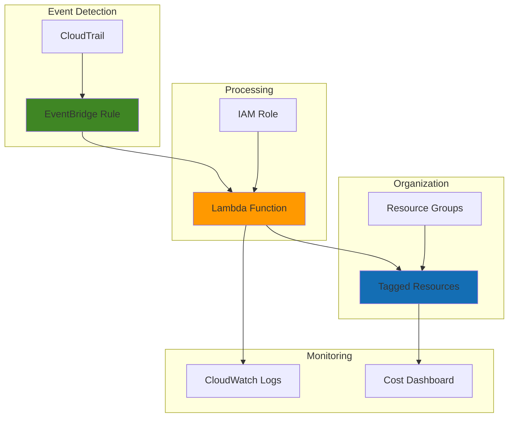

# Resource Tagging Automation with Lambda and EventBridge

## Problem

Organizations struggle with inconsistent resource tagging across AWS accounts, making cost allocation, resource management, and compliance reporting extremely difficult. Manual tagging processes result in untagged resources that accumulate over time, creating blind spots in cost tracking and hindering effective resource governance across development teams and business units.

## Solution

Implement an automated tagging system using EventBridge to capture resource creation events via CloudTrail, triggering Lambda functions that immediately apply standardized organizational tags. This serverless approach ensures consistent tagging across all AWS resources while providing centralized governance through Resource Groups for cost tracking and organizational visibility.

## Architecture Diagram



## Prerequisites

1. AWS account with administrative permissions for IAM, Lambda, EventBridge, and Resource Groups
2. AWS CLI v2 installed and configured (or AWS CloudShell access)
3. Basic understanding of AWS tagging strategies and governance concepts
4. CloudTrail trail enabled in your AWS account for API logging
5. Estimated cost: $0.50-$2.00 per month for Lambda invocations and CloudWatch logs

> **Note**: This solution follows AWS Well-Architected Framework principles for operational excellence and cost optimization. CloudTrail must be enabled to capture resource creation events.

## Preparation

```bash
# Set environment variables for AWS configuration
export AWS_REGION=$(aws configure get region)
export AWS_ACCOUNT_ID=$(aws sts get-caller-identity \
    --query Account --output text)

# Generate unique identifiers for resources
RANDOM_SUFFIX=$(aws secretsmanager get-random-password \
    --exclude-punctuation --exclude-uppercase \
    --password-length 6 --require-each-included-type \
    --output text --query RandomPassword)

# Set resource names with unique suffix
export LAMBDA_FUNCTION_NAME="auto-tagger-${RANDOM_SUFFIX}"
export IAM_ROLE_NAME="AutoTaggerRole-${RANDOM_SUFFIX}"
export EVENTBRIDGE_RULE_NAME="resource-creation-rule-${RANDOM_SUFFIX}"
export RESOURCE_GROUP_NAME="auto-tagged-resources-${RANDOM_SUFFIX}"

echo "✅ AWS environment configured for resource tagging automation"
echo "Region: ${AWS_REGION}"
echo "Account: ${AWS_ACCOUNT_ID}"
echo "Resource suffix: ${RANDOM_SUFFIX}"
```

## Steps

1. **Create IAM Role for Lambda Function**:

   The Lambda function requires comprehensive permissions to read resource information and apply tags across multiple AWS services. This IAM role implements the principle of least privilege while providing necessary access for automated tagging operations across EC2, S3, RDS, and other taggable resources.

   ```bash
   # Create trust policy for Lambda service
   cat > trust-policy.json << 'EOF'
   {
     "Version": "2012-10-17",
     "Statement": [
       {
         "Effect": "Allow",
         "Principal": {
           "Service": "lambda.amazonaws.com"
         },
         "Action": "sts:AssumeRole"
       }
     ]
   }
   EOF
   
   # Create IAM role for Lambda function
   aws iam create-role \
       --role-name ${IAM_ROLE_NAME} \
       --assume-role-policy-document file://trust-policy.json \
       --description "Role for automated resource tagging Lambda function"
   
   # Store role ARN for later use
   LAMBDA_ROLE_ARN=$(aws iam get-role \
       --role-name ${IAM_ROLE_NAME} \
       --query 'Role.Arn' --output text)
   
   echo "✅ IAM role created: ${LAMBDA_ROLE_ARN}"
   ```

2. **Attach Permissions Policy to IAM Role**:

   The Lambda function needs permissions to tag resources, access CloudWatch logs, and work with Resource Groups. This comprehensive policy enables automated tagging while maintaining security through resource-level restrictions and appropriate service boundaries.

   ```bash
   # Create permissions policy for resource tagging
   cat > tagging-policy.json << 'EOF'
   {
     "Version": "2012-10-17",
     "Statement": [
       {
         "Effect": "Allow",
         "Action": [
           "logs:CreateLogGroup",
           "logs:CreateLogStream",
           "logs:PutLogEvents"
         ],
         "Resource": "arn:aws:logs:*:*:*"
       },
       {
         "Effect": "Allow",
         "Action": [
           "ec2:CreateTags",
           "ec2:DescribeInstances",
           "ec2:DescribeImages",
           "ec2:DescribeVolumes",
           "s3:PutBucketTagging",
           "s3:GetBucketTagging",
           "rds:AddTagsToResource",
           "rds:ListTagsForResource",
           "lambda:TagResource",
           "lambda:ListTags"
         ],
         "Resource": "*"
       },
       {
         "Effect": "Allow",
         "Action": [
           "resource-groups:Tag",
           "resource-groups:GetTags",
           "tag:GetResources",
           "tag:TagResources"
         ],
         "Resource": "*"
       }
     ]
   }
   EOF
   
   # Attach policy to IAM role
   aws iam put-role-policy \
       --role-name ${IAM_ROLE_NAME} \
       --policy-name AutoTaggingPolicy \
       --policy-document file://tagging-policy.json
   
   echo "✅ Permissions policy attached to IAM role"
   ```

3. **Create Lambda Function for Resource Tagging**:

   This Lambda function processes EventBridge events triggered by resource creation activities captured through CloudTrail. The function extracts resource information from the event payload and applies standardized organizational tags, ensuring consistent governance and cost allocation across the AWS environment.

   ```bash
   # Create Lambda function code for automated tagging
   cat > lambda_function.py << 'EOF'
   import json
   import boto3
   import logging
   from datetime import datetime
   
   # Configure logging
   logger = logging.getLogger()
   logger.setLevel(logging.INFO)
   
   def lambda_handler(event, context):
       """
       Process CloudTrail events and apply tags to newly created resources
       """
       try:
           # Parse EventBridge event
           detail = event.get('detail', {})
           event_name = detail.get('eventName', '')
           source_ip_address = detail.get('sourceIPAddress', 'unknown')
           user_identity = detail.get('userIdentity', {})
           user_name = user_identity.get('userName', user_identity.get('type', 'unknown'))
           
           logger.info(f"Processing event: {event_name} by user: {user_name}")
           
           # Define standard tags to apply
           standard_tags = {
               'AutoTagged': 'true',
               'Environment': 'production',
               'CostCenter': 'engineering',
               'CreatedBy': user_name,
               'CreatedDate': datetime.now().strftime('%Y-%m-%d'),
               'ManagedBy': 'automation'
           }
           
           # Process different resource types
           resources_tagged = 0
           
           if event_name == 'RunInstances':
               resources_tagged += tag_ec2_instances(detail, standard_tags)
           elif event_name == 'CreateBucket':
               resources_tagged += tag_s3_bucket(detail, standard_tags)
           elif event_name == 'CreateDBInstance':
               resources_tagged += tag_rds_instance(detail, standard_tags)
           elif event_name == 'CreateFunction20150331':
               resources_tagged += tag_lambda_function(detail, standard_tags)
           
           logger.info(f"Successfully tagged {resources_tagged} resources")
           
           return {
               'statusCode': 200,
               'body': json.dumps({
                   'message': f'Tagged {resources_tagged} resources',
                   'event': event_name
               })
           }
           
       except Exception as e:
           logger.error(f"Error processing event: {str(e)}")
           return {
               'statusCode': 500,
               'body': json.dumps({
                   'error': str(e)
               })
           }
   
   def tag_ec2_instances(detail, tags):
       """Tag EC2 instances"""
       ec2 = boto3.client('ec2')
       instance_ids = []
       
       # Extract instance IDs from response elements
       response_elements = detail.get('responseElements', {})
       instances = response_elements.get('instancesSet', {}).get('items', [])
       
       for instance in instances:
           instance_ids.append(instance.get('instanceId'))
       
       if instance_ids:
           tag_list = [{'Key': k, 'Value': v} for k, v in tags.items()]
           ec2.create_tags(Resources=instance_ids, Tags=tag_list)
           logger.info(f"Tagged EC2 instances: {instance_ids}")
           return len(instance_ids)
       
       return 0
   
   def tag_s3_bucket(detail, tags):
       """Tag S3 bucket"""
       s3 = boto3.client('s3')
       
       # Extract bucket name
       request_params = detail.get('requestParameters', {})
       bucket_name = request_params.get('bucketName')
       
       if bucket_name:
           tag_set = [{'Key': k, 'Value': v} for k, v in tags.items()]
           s3.put_bucket_tagging(
               Bucket=bucket_name,
               Tagging={'TagSet': tag_set}
           )
           logger.info(f"Tagged S3 bucket: {bucket_name}")
           return 1
       
       return 0
   
   def tag_rds_instance(detail, tags):
       """Tag RDS instance"""
       rds = boto3.client('rds')
       
       # Extract DB instance identifier
       response_elements = detail.get('responseElements', {})
       db_instance = response_elements.get('dBInstance', {})
       db_instance_arn = db_instance.get('dBInstanceArn')
       
       if db_instance_arn:
           tag_list = [{'Key': k, 'Value': v} for k, v in tags.items()]
           rds.add_tags_to_resource(
               ResourceName=db_instance_arn,
               Tags=tag_list
           )
           logger.info(f"Tagged RDS instance: {db_instance_arn}")
           return 1
       
       return 0
   
   def tag_lambda_function(detail, tags):
       """Tag Lambda function"""
       lambda_client = boto3.client('lambda')
       
       # Extract function name
       response_elements = detail.get('responseElements', {})
       function_arn = response_elements.get('functionArn')
       
       if function_arn:
           lambda_client.tag_resource(
               Resource=function_arn,
               Tags=tags
           )
           logger.info(f"Tagged Lambda function: {function_arn}")
           return 1
       
       return 0
   EOF
   
   # Package Lambda function
   zip -r lambda-deployment.zip lambda_function.py
   
   # Create Lambda function with updated Python runtime
   aws lambda create-function \
       --function-name ${LAMBDA_FUNCTION_NAME} \
       --runtime python3.12 \
       --role ${LAMBDA_ROLE_ARN} \
       --handler lambda_function.lambda_handler \
       --zip-file fileb://lambda-deployment.zip \
       --timeout 60 \
       --memory-size 256 \
       --description "Automated resource tagging function"
   
   echo "✅ Lambda function created: ${LAMBDA_FUNCTION_NAME}"
   ```

4. **Create EventBridge Rule for Resource Creation Events**:

   EventBridge captures CloudTrail events for resource creation activities and triggers the Lambda function for immediate tagging. This rule specifically monitors API calls that create taggable AWS resources, ensuring comprehensive coverage of EC2, S3, RDS, and Lambda resources across the AWS account.

   ```bash
   # Create EventBridge rule to capture resource creation events
   cat > event-pattern.json << 'EOF'
   {
     "source": ["aws.ec2", "aws.s3", "aws.rds", "aws.lambda"],
     "detail-type": ["AWS API Call via CloudTrail"],
     "detail": {
       "eventName": [
         "RunInstances",
         "CreateBucket",
         "CreateDBInstance",
         "CreateFunction20150331"
       ],
       "eventSource": [
         "ec2.amazonaws.com",
         "s3.amazonaws.com",
         "rds.amazonaws.com",
         "lambda.amazonaws.com"
       ]
     }
   }
   EOF
   
   # Create EventBridge rule
   aws events put-rule \
       --name ${EVENTBRIDGE_RULE_NAME} \
       --event-pattern file://event-pattern.json \
       --state ENABLED \
       --description "Trigger tagging for new AWS resources"
   
   # Get Lambda function ARN for target configuration
   LAMBDA_FUNCTION_ARN=$(aws lambda get-function \
       --function-name ${LAMBDA_FUNCTION_NAME} \
       --query 'Configuration.FunctionArn' --output text)
   
   echo "✅ EventBridge rule created: ${EVENTBRIDGE_RULE_NAME}"
   ```

5. **Configure Lambda Function as EventBridge Target**:

   Connecting the EventBridge rule to the Lambda function creates the automated workflow that processes resource creation events in real-time. This configuration includes appropriate permissions for EventBridge to invoke the Lambda function, establishing the core automation pipeline for consistent resource tagging.

   ```bash
   # Add Lambda function as target to EventBridge rule
   aws events put-targets \
       --rule ${EVENTBRIDGE_RULE_NAME} \
       --targets Id=1,Arn=${LAMBDA_FUNCTION_ARN}
   
   # Grant EventBridge permission to invoke Lambda function
   aws lambda add-permission \
       --function-name ${LAMBDA_FUNCTION_NAME} \
       --statement-id allow-eventbridge \
       --action lambda:InvokeFunction \
       --principal events.amazonaws.com \
       --source-arn "arn:aws:events:${AWS_REGION}:${AWS_ACCOUNT_ID}:rule/${EVENTBRIDGE_RULE_NAME}"
   
   echo "✅ Lambda function configured as EventBridge target"
   ```

6. **Create Resource Group for Tagged Resources**:

   Resource Groups provides organizational structure and centralized management for automatically tagged resources. This tag-based resource group enables efficient cost tracking, bulk operations, and governance oversight by aggregating all resources that have been processed by the automated tagging system.

   ```bash
   # Create resource group query for auto-tagged resources
   cat > resource-group-query.json << 'EOF'
   {
     "Type": "TAG_FILTERS_1_0",
     "Query": {
       "ResourceTypeFilters": ["AWS::AllSupported"],
       "TagFilters": [
         {
           "Key": "AutoTagged",
           "Values": ["true"]
         }
       ]
     }
   }
   EOF
   
   # Create Resource Group for tagged resources
   aws resource-groups create-group \
       --name ${RESOURCE_GROUP_NAME} \
       --description "Resources automatically tagged by Lambda function" \
       --resource-query file://resource-group-query.json \
       --tags Environment=production,Purpose=automation
   
   echo "✅ Resource Group created: ${RESOURCE_GROUP_NAME}"
   ```

7. **Test Automated Tagging with New Resource**:

   Creating a test EC2 instance validates the end-to-end automation workflow, demonstrating how resource creation events flow through CloudTrail, EventBridge, and Lambda to apply consistent organizational tags. This verification step confirms that the tagging automation is functioning correctly before deploying across the production environment.

   ```bash
   # Create a test EC2 instance to trigger tagging
   INSTANCE_ID=$(aws ec2 run-instances \
       --image-id $(aws ec2 describe-images \
           --owners amazon \
           --filters "Name=name,Values=amzn2-ami-hvm-*" \
               "Name=state,Values=available" \
           --query 'Images | sort_by(@, &CreationDate) | [-1].ImageId' \
           --output text) \
       --instance-type t2.micro \
       --tag-specifications \
       'ResourceType=instance,Tags=[{Key=Name,Value=test-auto-tagging}]' \
       --query 'Instances[0].InstanceId' --output text)
   
   # Wait for Lambda function to process the event
   echo "Waiting 30 seconds for automated tagging..."
   sleep 30
   
   # Verify tags were applied
   aws ec2 describe-tags \
       --filters "Name=resource-id,Values=${INSTANCE_ID}" \
       --query 'Tags[?Key==`AutoTagged`]' --output table
   
   echo "✅ Test instance created and tagged: ${INSTANCE_ID}"
   ```

## Validation & Testing

1. **Verify EventBridge Rule Configuration**:

   ```bash
   # Check EventBridge rule status
   aws events describe-rule --name ${EVENTBRIDGE_RULE_NAME}
   
   # List rule targets
   aws events list-targets-by-rule --rule ${EVENTBRIDGE_RULE_NAME}
   ```

   Expected output: Rule should show "State": "ENABLED" and Lambda function as target

2. **Test Lambda Function Execution**:

   ```bash
   # Check recent Lambda function invocations
   aws logs describe-log-groups \
       --log-group-name-prefix "/aws/lambda/${LAMBDA_FUNCTION_NAME}"
   
   # View recent log events
   aws logs describe-log-streams \
       --log-group-name "/aws/lambda/${LAMBDA_FUNCTION_NAME}" \
       --order-by LastEventTime --descending --max-items 1
   ```

3. **Validate Resource Group Contents**:

   ```bash
   # List resources in the auto-tagged resource group
   aws resource-groups list-group-resources \
       --group-name ${RESOURCE_GROUP_NAME} \
       --query 'ResourceIdentifiers[*].[ResourceType,ResourceArn]' \
       --output table
   ```

   Expected output: Should display resources with AutoTagged=true

4. **Verify Cost Allocation Tags**:

   ```bash
   # Check if tags are available for cost allocation
   aws ce list-cost-category-definitions \
       --query 'CostCategoryReferences[*].Name' --output table
   
   # View resource tags for cost tracking
   aws resourcegroupstaggingapi get-resources \
       --tag-filters Key=AutoTagged,Values=true \
       --query 'ResourceTagMappingList[*].[ResourceARN,Tags[?Key==`CostCenter`].Value]' \
       --output table
   ```

## Cleanup

1. **Remove Test EC2 Instance**:

   ```bash
   # Terminate test EC2 instance
   if [ ! -z "${INSTANCE_ID}" ]; then
       aws ec2 terminate-instances --instance-ids ${INSTANCE_ID}
       echo "✅ Test EC2 instance terminated"
   fi
   ```

2. **Delete Resource Group**:

   ```bash
   # Delete Resource Group
   aws resource-groups delete-group --group-name ${RESOURCE_GROUP_NAME}
   echo "✅ Resource Group deleted"
   ```

3. **Remove EventBridge Rule and Targets**:

   ```bash
   # Remove targets from EventBridge rule
   aws events remove-targets \
       --rule ${EVENTBRIDGE_RULE_NAME} \
       --ids "1"
   
   # Delete EventBridge rule
   aws events delete-rule --name ${EVENTBRIDGE_RULE_NAME}
   echo "✅ EventBridge rule deleted"
   ```

4. **Delete Lambda Function**:

   ```bash
   # Delete Lambda function
   aws lambda delete-function --function-name ${LAMBDA_FUNCTION_NAME}
   echo "✅ Lambda function deleted"
   ```

5. **Remove IAM Role and Policies**:

   ```bash
   # Delete IAM role policy
   aws iam delete-role-policy \
       --role-name ${IAM_ROLE_NAME} \
       --policy-name AutoTaggingPolicy
   
   # Delete IAM role
   aws iam delete-role --role-name ${IAM_ROLE_NAME}
   echo "✅ IAM role and policies deleted"
   ```

6. **Clean Up Local Files**:

   ```bash
   # Remove temporary files
   rm -f trust-policy.json tagging-policy.json event-pattern.json
   rm -f resource-group-query.json lambda_function.py lambda-deployment.zip
   echo "✅ Local files cleaned up"
   ```

## Discussion

This automated tagging solution addresses one of the most common governance challenges in AWS environments by implementing real-time resource tagging through event-driven architecture. The combination of CloudTrail, EventBridge, and Lambda creates a serverless automation pipeline that ensures consistent tagging without manual intervention or operational overhead.

The solution leverages AWS's native event architecture where CloudTrail automatically captures all API calls, EventBridge filters and routes resource creation events, and Lambda functions apply standardized tags immediately upon resource creation. This approach provides comprehensive coverage across multiple AWS services including EC2, S3, RDS, and Lambda, with the flexibility to extend support to additional services by modifying the EventBridge rule pattern and Lambda function logic.

From a cost optimization perspective, this automation enables accurate cost allocation and chargeback processes by ensuring all resources have consistent organizational tags. The Resource Groups integration provides centralized visibility and management capabilities, making it easier to track resource utilization across teams, projects, and environments. Additionally, the serverless architecture minimizes operational costs since Lambda functions only execute when resources are created, typically resulting in monthly costs under $2.00 for most organizations.

The security model follows AWS best practices by implementing least privilege access through carefully scoped IAM policies that grant only the minimum permissions necessary for tagging operations. The solution also maintains audit trails through CloudWatch logs, providing visibility into tagging activities and supporting compliance requirements. Organizations can extend this foundation to implement more sophisticated governance policies, such as preventing resource creation without proper tags or automatically applying cost center information based on user identity.

> **Tip**: Consider implementing additional EventBridge rules for resource modification and deletion events to maintain comprehensive tag governance throughout the resource lifecycle. The [AWS Resource Groups Tagging API documentation](https://docs.aws.amazon.com/resourcegroupstaggingapi/latest/APIReference/Welcome.html) provides extensive guidance on managing tags at scale.

## Challenge

Extend this automated tagging solution with these enhancements:

1. **Multi-Account Tagging**: Deploy the solution across multiple AWS accounts using AWS Organizations and cross-account EventBridge rules to centralize tagging governance across the entire organization.

2. **Advanced Tag Logic**: Implement conditional tagging based on resource attributes, user identity, or time-based rules using more sophisticated Lambda function logic and external data sources like DynamoDB lookup tables.

3. **Tag Compliance Monitoring**: Add AWS Config rules to monitor tag compliance and automatically remediate non-compliant resources, creating a comprehensive governance framework with notifications via SNS.

4. **Cost Optimization Integration**: Connect the tagging system to AWS Cost Explorer APIs to automatically generate cost reports by tag dimensions and implement budget alerts based on tag-based resource groups.

5. **Integration with ITSM Systems**: Extend the Lambda function to integrate with ServiceNow, Jira, or other IT service management platforms to automatically create configuration items and maintain CMDB records for tagged resources.

## Infrastructure Code

*Infrastructure code will be generated after recipe approval.*