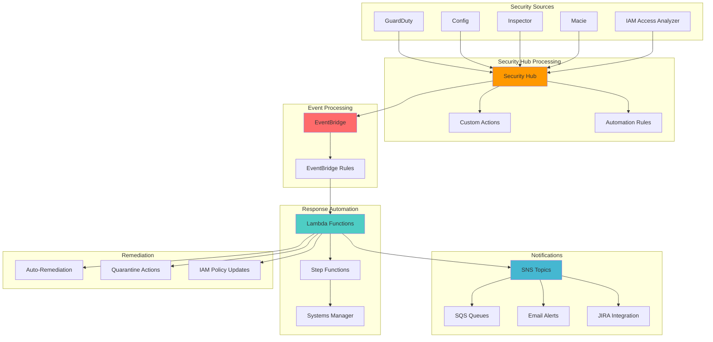

# Responding to Incidents with Security Hub

## Problem

Enterprise security teams struggle with managing and responding to security incidents across multiple AWS accounts and services. They need a centralized security operations center (SOC) that can automatically detect, categorize, and respond to security findings from various sources. Without automated incident response, security teams are overwhelmed by alert fatigue, slow response times, and inconsistent remediation actions, leading to potential security breaches and compliance violations.

## Solution

We'll build a comprehensive security incident response system using AWS Security Hub as the central hub for security findings, EventBridge for event-driven automation, Lambda for custom response logic, and SNS for notifications to ticketing systems. This solution provides automated triage, escalation workflows, and integration with external security tools, enabling rapid response to security incidents.

## Architecture Diagram



## Prerequisites

1. AWS account with administrator permissions for Security Hub, EventBridge, Lambda, and SNS
2. AWS CLI v2 installed and configured (or AWS CloudShell)
3. Basic knowledge of security incident response procedures
4. Understanding of EventBridge event patterns and Lambda functions
5. Access to external ticketing system (JIRA, ServiceNow, etc.) for integration testing
6. Estimated cost: $50-150/month depending on finding volume and Lambda execution frequency

> **Note**: This solution processes security findings that may contain sensitive information. Ensure proper access controls and encryption are in place.

## Preparation

```bash
# Set environment variables
export AWS_REGION=$(aws configure get region)
export AWS_ACCOUNT_ID=$(aws sts get-caller-identity \
    --query Account --output text)

# Generate unique identifiers for resources
RANDOM_SUFFIX=$(aws secretsmanager get-random-password \
    --exclude-punctuation --exclude-uppercase \
    --password-length 6 --require-each-included-type \
    --output text --query RandomPassword)

export SECURITY_HUB_ROLE_NAME="SecurityHubIncidentResponseRole-${RANDOM_SUFFIX}"
export LAMBDA_ROLE_NAME="SecurityHubLambdaRole-${RANDOM_SUFFIX}"
export SNS_TOPIC_NAME="security-incident-alerts-${RANDOM_SUFFIX}"
export LAMBDA_FUNCTION_NAME="security-incident-processor-${RANDOM_SUFFIX}"
export CUSTOM_ACTION_NAME="escalate-to-soc-${RANDOM_SUFFIX}"

# Create IAM role for Security Hub
aws iam create-role \
    --role-name ${SECURITY_HUB_ROLE_NAME} \
    --assume-role-policy-document '{
        "Version": "2012-10-17",
        "Statement": [
            {
                "Effect": "Allow",
                "Principal": {
                    "Service": "securityhub.amazonaws.com"
                },
                "Action": "sts:AssumeRole"
            }
        ]
    }'

# Create IAM role for Lambda
aws iam create-role \
    --role-name ${LAMBDA_ROLE_NAME} \
    --assume-role-policy-document '{
        "Version": "2012-10-17",
        "Statement": [
            {
                "Effect": "Allow",
                "Principal": {
                    "Service": "lambda.amazonaws.com"
                },
                "Action": "sts:AssumeRole"
            }
        ]
    }'

echo "✅ IAM roles created successfully"
```

## Steps

1. **Enable Security Hub and Configure Standards**:

   AWS Security Hub serves as the central command center for your cloud security posture, aggregating findings from multiple security services into a single dashboard. By enabling Security Hub, you establish a unified view across all your AWS security tools, enabling coordinated incident response. The service automatically correlates findings, reduces duplicate alerts, and provides standardized severity scoring across different security tools.

   ```bash
   # Enable Security Hub with default standards
   aws securityhub enable-security-hub \
       --enable-default-standards \
       --tags '{"Project": "IncidentResponse", "Environment": "Production"}'
   
   # Enable additional security standards
   aws securityhub batch-enable-standards \
       --standards-subscription-requests '[
           {
               "StandardsArn": "arn:aws:securityhub:us-east-1::standards/cis-aws-foundations-benchmark/v/1.4.0",
               "StandardsInput": {}
           }
       ]'
   
   echo "✅ Security Hub enabled with security standards"
   ```

   Security Hub is now active and will begin collecting findings from enabled security services. The CIS AWS Foundations Benchmark provides industry-standard security controls that help ensure your AWS environment follows security best practices. This creates the foundation for automated incident detection and response workflows.

2. **Create SNS Topic for Incident Notifications**:

   Amazon SNS (Simple Notification Service) acts as the communication backbone for your incident response system, enabling reliable delivery of security alerts to multiple endpoints simultaneously. SNS provides built-in retry logic, dead letter queues, and delivery status logging, ensuring critical security notifications reach their destinations even during system failures. This pub/sub messaging pattern allows you to easily add new notification endpoints (email, SMS, webhooks, SQS queues) without modifying the core incident processing logic.

   ```bash
   # Create SNS topic
   SNS_TOPIC_ARN=$(aws sns create-topic \
       --name ${SNS_TOPIC_NAME} \
       --attributes '{
           "DisplayName": "Security Incident Alerts",
           "DeliveryPolicy": "{\"http\":{\"defaultHealthyRetryPolicy\":{\"numRetries\":3,\"minDelayTarget\":20,\"maxDelayTarget\":20,\"numMinDelayRetries\":0,\"numMaxDelayRetries\":0,\"numNoDelayRetries\":0,\"backoffFunction\":\"linear\"},\"disableSubscriptionOverrides\":false}}",
           "Policy": "{\"Version\":\"2012-10-17\",\"Statement\":[{\"Effect\":\"Allow\",\"Principal\":{\"Service\":\"lambda.amazonaws.com\"},\"Action\":\"SNS:Publish\",\"Resource\":\"*\"}]}"
       }' \
       --query TopicArn --output text)
   
   # Store topic ARN for later use
   export SNS_TOPIC_ARN
   
   echo "✅ SNS topic created: ${SNS_TOPIC_ARN}"
   ```

   The SNS topic is now ready to distribute security incident notifications across your organization. The delivery policy ensures robust message delivery with automatic retries, while the resource policy allows Lambda functions to publish messages. This establishes the reliable communication channel needed for time-sensitive security alerts.

3. **Create Lambda Function for Incident Processing**:

   AWS Lambda provides the serverless compute engine that powers our intelligent incident processing logic. Lambda functions automatically scale based on the volume of security findings, ensuring consistent response times even during security incidents that generate high volumes of alerts. This serverless approach eliminates the need to manage infrastructure while providing built-in high availability and fault tolerance. The function will analyze each security finding, determine appropriate response actions based on severity, and orchestrate notifications to relevant stakeholders.

   ```bash
   # Create Lambda function code
   cat > /tmp/incident_processor.py << 'EOF'
   import json
   import boto3
   import os
   from datetime import datetime
   
   def lambda_handler(event, context):
       # Initialize AWS clients
       sns = boto3.client('sns')
       securityhub = boto3.client('securityhub')
       
       # Process Security Hub finding
       finding = event['detail']['findings'][0]
       
       # Extract key information
       severity = finding.get('Severity', {}).get('Label', 'UNKNOWN')
       title = finding.get('Title', 'Unknown Security Finding')
       description = finding.get('Description', 'No description available')
       account_id = finding.get('AwsAccountId', 'Unknown')
       region = finding.get('Region', 'Unknown')
       finding_id = finding.get('Id', 'Unknown')
       
       # Determine response based on severity
       response_action = determine_response_action(severity)
       
       # Create incident ticket payload
       incident_payload = {
           'finding_id': finding_id,
           'severity': severity,
           'title': title,
           'description': description,
           'account_id': account_id,
           'region': region,
           'timestamp': datetime.utcnow().isoformat(),
           'response_action': response_action,
           'source': 'AWS Security Hub'
       }
       
       # Send notification to SNS
       message = create_incident_message(incident_payload)
       
       try:
           response = sns.publish(
               TopicArn=os.environ['SNS_TOPIC_ARN'],
               Message=json.dumps(message, indent=2),
               Subject=f"Security Incident: {severity} - {title[:50]}",
               MessageAttributes={
                   'severity': {
                       'DataType': 'String',
                       'StringValue': severity
                   },
                   'account_id': {
                       'DataType': 'String',
                       'StringValue': account_id
                   }
               }
           )
           
           # Update finding with response action
           update_finding_workflow(securityhub, finding_id, response_action)
           
           return {
               'statusCode': 200,
               'body': json.dumps({
                   'message': 'Incident processed successfully',
                   'finding_id': finding_id,
                   'severity': severity,
                   'response_action': response_action
               })
           }
           
       except Exception as e:
           print(f"Error processing incident: {str(e)}")
           return {
               'statusCode': 500,
               'body': json.dumps({
                   'error': str(e),
                   'finding_id': finding_id
               })
           }
   
   def determine_response_action(severity):
       """Determine appropriate response action based on severity"""
       if severity == 'CRITICAL':
           return 'immediate_response'
       elif severity == 'HIGH':
           return 'escalated_response'
       elif severity == 'MEDIUM':
           return 'standard_response'
       else:
           return 'low_priority_response'
   
   def create_incident_message(payload):
       """Create formatted incident message"""
       return {
           'incident_details': {
               'id': payload['finding_id'],
               'severity': payload['severity'],
               'title': payload['title'],
               'description': payload['description'],
               'account': payload['account_id'],
               'region': payload['region'],
               'timestamp': payload['timestamp']
           },
           'response_plan': {
               'action': payload['response_action'],
               'priority': get_priority_level(payload['severity']),
               'sla': get_sla_minutes(payload['severity'])
           },
           'integration': {
               'jira_project': 'SEC',
               'slack_channel': '#security-incidents',
               'pagerduty_service': 'security-team'
           }
       }
   
   def get_priority_level(severity):
       """Map severity to priority level"""
       priority_map = {
           'CRITICAL': 'P1',
           'HIGH': 'P2',
           'MEDIUM': 'P3',
           'LOW': 'P4',
           'INFORMATIONAL': 'P5'
       }
       return priority_map.get(severity, 'P4')
   
   def get_sla_minutes(severity):
       """Get SLA response time in minutes"""
       sla_map = {
           'CRITICAL': 15,
           'HIGH': 60,
           'MEDIUM': 240,
           'LOW': 1440,
           'INFORMATIONAL': 2880
       }
       return sla_map.get(severity, 1440)
   
   def update_finding_workflow(securityhub, finding_id, response_action):
       """Update finding workflow status"""
       try:
           securityhub.batch_update_findings(
               FindingIdentifiers=[{
                   'Id': finding_id,
                   'ProductArn': f'arn:aws:securityhub:{os.environ["AWS_REGION"]}::product/aws/securityhub'
               }],
               Note={
                   'Text': f'Automated incident response initiated: {response_action}',
                   'UpdatedBy': 'SecurityHubAutomation'
               },
               Workflow={
                   'Status': 'NOTIFIED'
               }
           )
       except Exception as e:
           print(f"Error updating finding workflow: {str(e)}")
   EOF
   
   # Zip the Lambda function
   cd /tmp && zip incident_processor.zip incident_processor.py
   
   echo "✅ Lambda function code created"
   ```

   The Lambda function code includes sophisticated incident triage logic that maps security finding severity to appropriate response actions and SLA timelines. This intelligence layer transforms raw security findings into actionable incident tickets with proper prioritization, ensuring critical threats receive immediate attention while reducing noise from low-priority findings.

4. **Deploy Lambda Function with Permissions**:

   Proper IAM (Identity and Access Management) configuration is critical for security automation, following the principle of least privilege to ensure the Lambda function can perform necessary security operations without excessive permissions. The custom IAM policy grants specific permissions to read Security Hub findings, update finding workflows, and publish notifications to SNS. This security model ensures that even if the function is compromised, the blast radius is limited to these specific operations.

   ```bash
   # Attach policies to Lambda role
   aws iam attach-role-policy \
       --role-name ${LAMBDA_ROLE_NAME} \
       --policy-arn arn:aws:iam::aws:policy/service-role/AWSLambdaBasicExecutionRole
   
   # Create custom policy for Security Hub and SNS access
   aws iam create-policy \
       --policy-name SecurityHubLambdaPolicy-${RANDOM_SUFFIX} \
       --policy-document '{
           "Version": "2012-10-17",
           "Statement": [
               {
                   "Effect": "Allow",
                   "Action": [
                       "securityhub:BatchUpdateFindings",
                       "securityhub:GetFindings",
                       "sns:Publish"
                   ],
                   "Resource": "*"
               }
           ]
       }'
   
   # Attach custom policy to Lambda role
   aws iam attach-role-policy \
       --role-name ${LAMBDA_ROLE_NAME} \
       --policy-arn arn:aws:iam::${AWS_ACCOUNT_ID}:policy/SecurityHubLambdaPolicy-${RANDOM_SUFFIX}
   
   # Wait for IAM role propagation
   sleep 10
   
   # Create Lambda function
   LAMBDA_ARN=$(aws lambda create-function \
       --function-name ${LAMBDA_FUNCTION_NAME} \
       --runtime python3.9 \
       --role arn:aws:iam::${AWS_ACCOUNT_ID}:role/${LAMBDA_ROLE_NAME} \
       --handler incident_processor.lambda_handler \
       --zip-file fileb:///tmp/incident_processor.zip \
       --timeout 60 \
       --memory-size 256 \
       --environment Variables="{SNS_TOPIC_ARN=${SNS_TOPIC_ARN},AWS_REGION=${AWS_REGION}}" \
       --query FunctionArn --output text)
   
   export LAMBDA_ARN
   
   echo "✅ Lambda function deployed: ${LAMBDA_ARN}"
   ```

   The Lambda function is now deployed with appropriate security permissions and environment configuration. The function can process security findings, update their workflow status in Security Hub, and send notifications through SNS. The 60-second timeout and 256MB memory allocation provide sufficient resources for incident processing while maintaining cost efficiency.

5. **Create EventBridge Rules for Automated Response**:

   Amazon EventBridge enables event-driven architecture by automatically triggering incident response workflows when Security Hub findings match specific patterns. This real-time event processing ensures that high-severity security findings are immediately routed to the incident response system without human intervention. EventBridge's advanced filtering capabilities allow you to create sophisticated routing rules based on finding attributes like severity, resource type, compliance status, or custom fields, enabling precise automation that reduces false positives.

   ```bash
   # Create EventBridge rule for high severity findings
   aws events put-rule \
       --name security-hub-high-severity \
       --event-pattern '{
           "source": ["aws.securityhub"],
           "detail-type": ["Security Hub Findings - Imported"],
           "detail": {
               "findings": {
                   "Severity": {
                       "Label": ["HIGH", "CRITICAL"]
                   },
                   "Workflow": {
                       "Status": ["NEW"]
                   }
               }
           }
       }' \
       --state ENABLED \
       --description "Process high and critical severity Security Hub findings"
   
   # Add Lambda as target for high severity rule
   aws events put-targets \
       --rule security-hub-high-severity \
       --targets Id=1,Arn=${LAMBDA_ARN}
   
   # Grant EventBridge permission to invoke Lambda
   aws lambda add-permission \
       --function-name ${LAMBDA_FUNCTION_NAME} \
       --statement-id security-hub-high-severity \
       --action lambda:InvokeFunction \
       --principal events.amazonaws.com \
       --source-arn arn:aws:events:${AWS_REGION}:${AWS_ACCOUNT_ID}:rule/security-hub-high-severity
   
   echo "✅ EventBridge rule created for high severity findings"
   ```

   The EventBridge rule is now actively monitoring for high and critical severity findings with "NEW" workflow status. When Security Hub receives matching findings, EventBridge automatically invokes the Lambda function within seconds, ensuring rapid response to serious security threats. This automation eliminates the delay and potential for human error in manual incident triage processes.

6. **Create Custom Action for Manual Escalation**:

   Security Hub custom actions provide security analysts with manual override capabilities, allowing them to escalate findings that might not meet automated criteria but require immediate attention based on business context or threat intelligence. This hybrid approach combines the efficiency of automation with human expertise, ensuring that analysts can quickly escalate suspicious findings that warrant deeper investigation. Custom actions appear as buttons in the Security Hub console, providing an intuitive interface for security team workflows.

   ```bash
   # Create custom action in Security Hub
   CUSTOM_ACTION_ARN=$(aws securityhub create-action-target \
       --name "Escalate to SOC" \
       --description "Escalate this finding to the Security Operations Center" \
       --id ${CUSTOM_ACTION_NAME} \
       --query ActionTargetArn --output text)
   
   # Create EventBridge rule for custom action
   aws events put-rule \
       --name security-hub-custom-escalation \
       --event-pattern '{
           "source": ["aws.securityhub"],
           "detail-type": ["Security Hub Findings - Custom Action"],
           "detail": {
               "actionName": ["Escalate to SOC"],
               "actionDescription": ["Escalate this finding to the Security Operations Center"]
           }
       }' \
       --state ENABLED \
       --description "Process manual escalation from Security Hub"
   
   # Add Lambda as target for custom action rule
   aws events put-targets \
       --rule security-hub-custom-escalation \
       --targets Id=1,Arn=${LAMBDA_ARN}
   
   # Grant EventBridge permission to invoke Lambda for custom action
   aws lambda add-permission \
       --function-name ${LAMBDA_FUNCTION_NAME} \
       --statement-id security-hub-custom-escalation \
       --action lambda:InvokeFunction \
       --principal events.amazonaws.com \
       --source-arn arn:aws:events:${AWS_REGION}:${AWS_ACCOUNT_ID}:rule/security-hub-custom-escalation
   
   echo "✅ Custom action created: ${CUSTOM_ACTION_ARN}"
   ```

   The custom action is now available in the Security Hub console, enabling security analysts to manually escalate findings with a single click. When activated, the same incident processing workflow triggers, but with enhanced priority and notification scope to ensure rapid SOC response. This provides the flexibility needed for complex security scenarios that require human judgment.

7. **Create Automation Rules for Intelligent Triage**:

   Security Hub automation rules provide sophisticated filtering and enrichment capabilities that automatically process findings based on predefined criteria, reducing alert fatigue and ensuring consistent handling of security events. These rules operate as a pre-processing layer, automatically suppressing noise from low-priority findings while enriching high-priority findings with additional context and urgency markers. This intelligent triage system allows security teams to focus on genuine threats rather than spending time manually categorizing findings.

   ```bash
   # Create automation rule for suppressing low priority findings
   aws securityhub create-automation-rule \
       --rule-name "Suppress Low Priority Findings" \
       --description "Automatically suppress informational findings from specific controls" \
       --rule-order 1 \
       --rule-status ENABLED \
       --criteria '{
           "SeverityLabel": [{"Value": "INFORMATIONAL", "Comparison": "EQUALS"}],
           "GeneratorId": [{"Value": "aws-foundational-security-best-practices", "Comparison": "PREFIX"}]
       }' \
       --actions '[{
           "Type": "FINDING_FIELDS_UPDATE",
           "FindingFieldsUpdate": {
               "Note": {
                   "Text": "Low priority finding automatically suppressed by automation rule",
                   "UpdatedBy": "SecurityHubAutomation"
               },
               "Workflow": {
                   "Status": "SUPPRESSED"
               }
           }
       }]'
   
   # Create automation rule for escalating critical findings
   aws securityhub create-automation-rule \
       --rule-name "Escalate Critical Findings" \
       --description "Automatically escalate critical findings and add priority notes" \
       --rule-order 2 \
       --rule-status ENABLED \
       --criteria '{
           "SeverityLabel": [{"Value": "CRITICAL", "Comparison": "EQUALS"}],
           "Workflow": {
               "Status": [{"Value": "NEW", "Comparison": "EQUALS"}]
           }
       }' \
       --actions '[{
           "Type": "FINDING_FIELDS_UPDATE",
           "FindingFieldsUpdate": {
               "Note": {
                   "Text": "CRITICAL: Immediate attention required. Escalated to SOC automatically.",
                   "UpdatedBy": "SecurityHubAutomation"
               },
               "Workflow": {
                   "Status": "NOTIFIED"
               }
           }
       }]'
   
   echo "✅ Automation rules created for intelligent triage"
   ```

   The automation rules are now actively processing findings as they arrive in Security Hub. Low-priority informational findings are automatically suppressed to reduce noise, while critical findings are immediately escalated with appropriate urgency markers. This intelligent filtering ensures that security analysts receive a curated feed of actionable security findings rather than being overwhelmed by routine informational alerts.

8. **Set Up Email Notifications and External Integrations**:

   Establishing multiple notification channels ensures that security incidents reach the appropriate personnel through their preferred communication methods while providing redundancy in case any single channel fails. The SQS queue serves as a durable buffer for incident notifications, enabling integration with external ticketing systems like JIRA, ServiceNow, or custom workflows. This multi-channel approach ensures that security incidents are never lost due to email delivery issues or system downtime.

   ```bash
   # Subscribe email endpoint to SNS topic (replace with your email)
   read -p "Enter your email address for notifications: " EMAIL_ADDRESS
   
   aws sns subscribe \
       --topic-arn ${SNS_TOPIC_ARN} \
       --protocol email \
       --notification-endpoint ${EMAIL_ADDRESS}
   
   # Create SQS queue for buffering notifications
   QUEUE_URL=$(aws sqs create-queue \
       --queue-name security-incident-queue-${RANDOM_SUFFIX} \
       --attributes '{
           "MessageRetentionPeriod": "1209600",
           "ReceiveMessageWaitTimeSeconds": "20",
           "VisibilityTimeoutSeconds": "300"
       }' \
       --query QueueUrl --output text)
   
   # Get queue ARN
   QUEUE_ARN=$(aws sqs get-queue-attributes \
       --queue-url ${QUEUE_URL} \
       --attribute-names QueueArn \
       --query Attributes.QueueArn --output text)
   
   # Subscribe SQS queue to SNS topic
   aws sns subscribe \
       --topic-arn ${SNS_TOPIC_ARN} \
       --protocol sqs \
       --notification-endpoint ${QUEUE_ARN}
   
   # Grant SNS permission to send messages to SQS
   aws sqs set-queue-attributes \
       --queue-url ${QUEUE_URL} \
       --attributes '{
           "Policy": "{\"Version\":\"2012-10-17\",\"Statement\":[{\"Effect\":\"Allow\",\"Principal\":{\"Service\":\"sns.amazonaws.com\"},\"Action\":\"sqs:SendMessage\",\"Resource\":\"'${QUEUE_ARN}'\",\"Condition\":{\"ArnEquals\":{\"aws:SourceArn\":\"'${SNS_TOPIC_ARN}'\"}}}]}"
       }'
   
   echo "✅ Email notifications and SQS queue configured"
   echo "✅ Check your email and confirm the SNS subscription"
   ```

   The notification infrastructure now supports both immediate email alerts and durable message queuing for external system integration. The SQS queue retains messages for 14 days with long polling enabled, ensuring reliable delivery to downstream systems. This architecture provides the foundation for integrating with your organization's existing incident management workflows.

9. **Create Threat Intelligence Integration**:

   Threat intelligence enrichment transforms basic security findings into contextual incidents by adding external threat data, attribution information, and risk scoring. This capability enables security teams to quickly assess whether a finding involves known threat actors, malicious infrastructure, or previously observed attack patterns. By integrating threat intelligence feeds, the incident response system can automatically prioritize findings based on real-world threat context rather than relying solely on static severity scoring.

   ```bash
   # Create additional Lambda function for threat intelligence lookup
   cat > /tmp/threat_intelligence.py << 'EOF'
   import json
   import boto3
   import requests
   import os
   
   def lambda_handler(event, context):
       # This function would integrate with threat intelligence feeds
       # For demo purposes, we'll simulate the process
       
       finding = event['detail']['findings'][0]
       
       # Extract IP addresses, domains, hashes from finding
       resources = finding.get('Resources', [])
       threat_indicators = extract_threat_indicators(resources)
       
       # Simulate threat intelligence lookup
       threat_score = calculate_threat_score(threat_indicators)
       
       # Update finding with threat intelligence
       securityhub = boto3.client('securityhub')
       
       try:
           securityhub.batch_update_findings(
               FindingIdentifiers=[{
                   'Id': finding['Id'],
                   'ProductArn': finding['ProductArn']
               }],
               Note={
                   'Text': f'Threat Intelligence Score: {threat_score}/100. Indicators: {len(threat_indicators)}',
                   'UpdatedBy': 'ThreatIntelligence'
               },
               UserDefinedFields={
                   'ThreatScore': str(threat_score),
                   'ThreatIndicators': str(len(threat_indicators))
               }
           )
           
           return {
               'statusCode': 200,
               'body': json.dumps({
                   'threat_score': threat_score,
                   'indicators_found': len(threat_indicators)
               })
           }
           
       except Exception as e:
           print(f"Error updating finding with threat intelligence: {str(e)}")
           return {
               'statusCode': 500,
               'body': json.dumps({'error': str(e)})
           }
   
   def extract_threat_indicators(resources):
       """Extract potential threat indicators from resources"""
       indicators = []
       
       for resource in resources:
           resource_id = resource.get('Id', '')
           
           # Look for IP addresses (simplified regex)
           import re
           ip_pattern = r'\b(?:[0-9]{1,3}\.){3}[0-9]{1,3}\b'
           ips = re.findall(ip_pattern, resource_id)
           indicators.extend(ips)
           
           # Look for domains (simplified)
           domain_pattern = r'\b[a-zA-Z0-9.-]+\.[a-zA-Z]{2,}\b'
           domains = re.findall(domain_pattern, resource_id)
           indicators.extend(domains)
       
       return indicators
   
   def calculate_threat_score(indicators):
       """Calculate threat score based on indicators"""
       # This would normally query actual threat intelligence feeds
       # For demo, we'll use a simple scoring system
       base_score = 10
       indicator_bonus = len(indicators) * 5
       
       return min(base_score + indicator_bonus, 100)
   EOF
   
   # Zip and deploy threat intelligence function
   cd /tmp && zip threat_intelligence.zip threat_intelligence.py
   
   THREAT_INTEL_ARN=$(aws lambda create-function \
       --function-name threat-intelligence-lookup-${RANDOM_SUFFIX} \
       --runtime python3.9 \
       --role arn:aws:iam::${AWS_ACCOUNT_ID}:role/${LAMBDA_ROLE_NAME} \
       --handler threat_intelligence.lambda_handler \
       --zip-file fileb:///tmp/threat_intelligence.zip \
       --timeout 60 \
       --memory-size 256 \
       --query FunctionArn --output text)
   
   echo "✅ Threat intelligence integration created"
   ```

   The threat intelligence function adds critical context to security findings by automatically extracting and scoring threat indicators. In production environments, this function would integrate with commercial feeds like VirusTotal, AlienVault, or proprietary threat intelligence platforms to provide real-time threat assessment and attribution data.

10. **Configure Compliance Reporting and Dashboards**:

    Comprehensive monitoring and alerting capabilities provide visibility into the incident response system's performance and ensure that security teams can detect and resolve any issues with the automation itself. CloudWatch dashboards offer real-time visibility into incident processing volumes, response times, and failure rates, enabling proactive optimization of the security operations. The alerting system creates a "watch the watchers" capability, ensuring that any failures in the incident response automation are immediately escalated to prevent security blind spots.

    ```bash
    # Create CloudWatch dashboard for incident metrics
    aws cloudwatch put-dashboard \
        --dashboard-name SecurityHubIncidentResponse \
        --dashboard-body '{
            "widgets": [
                {
                    "type": "metric",
                    "x": 0,
                    "y": 0,
                    "width": 12,
                    "height": 6,
                    "properties": {
                        "metrics": [
                            ["AWS/Lambda", "Invocations", "FunctionName", "'${LAMBDA_FUNCTION_NAME}'"],
                            ["AWS/Lambda", "Errors", "FunctionName", "'${LAMBDA_FUNCTION_NAME}'"],
                            ["AWS/Lambda", "Duration", "FunctionName", "'${LAMBDA_FUNCTION_NAME}'"]
                        ],
                        "period": 300,
                        "stat": "Sum",
                        "region": "'${AWS_REGION}'",
                        "title": "Security Incident Processing Metrics"
                    }
                },
                {
                    "type": "metric",
                    "x": 0,
                    "y": 6,
                    "width": 12,
                    "height": 6,
                    "properties": {
                        "metrics": [
                            ["AWS/SNS", "NumberOfMessagesPublished", "TopicName", "'${SNS_TOPIC_NAME}'"],
                            ["AWS/SNS", "NumberOfNotificationsFailed", "TopicName", "'${SNS_TOPIC_NAME}'"]
                        ],
                        "period": 300,
                        "stat": "Sum",
                        "region": "'${AWS_REGION}'",
                        "title": "Notification Delivery Metrics"
                    }
                }
            ]
        }'
    
    # Create CloudWatch alarm for failed incident processing
    aws cloudwatch put-metric-alarm \
        --alarm-name SecurityHubIncidentProcessingFailures \
        --alarm-description "Alert when Security Hub incident processing fails" \
        --metric-name Errors \
        --namespace AWS/Lambda \
        --statistic Sum \
        --period 300 \
        --threshold 1 \
        --comparison-operator GreaterThanOrEqualToThreshold \
        --evaluation-periods 1 \
        --alarm-actions ${SNS_TOPIC_ARN} \
        --dimensions Name=FunctionName,Value=${LAMBDA_FUNCTION_NAME}
    
    echo "✅ CloudWatch dashboard and alarms configured"
    ```

    The monitoring infrastructure now provides complete visibility into the incident response system's health and performance. The dashboard enables security operations teams to track incident volumes, processing times, and system reliability. The CloudWatch alarm ensures that any failures in the automation are immediately detected and escalated, maintaining the integrity of the security response pipeline.

## Validation & Testing

1. **Test Security Hub Finding Processing**:

   ```bash
   # Create a test finding to trigger the automation
   aws securityhub batch-import-findings \
       --findings '[{
           "AwsAccountId": "'${AWS_ACCOUNT_ID}'",
           "CreatedAt": "'$(date -u +%Y-%m-%dT%H:%M:%S.%3NZ)'",
           "Description": "Test security finding for incident response validation",
           "FindingProviderFields": {
               "Severity": {
                   "Label": "HIGH",
                   "Original": "8.0"
               },
               "Types": ["Software and Configuration Checks/Vulnerabilities/CVE"]
           },
           "GeneratorId": "test-generator-incident-response",
           "Id": "test-finding-'${RANDOM_SUFFIX}'",
           "ProductArn": "arn:aws:securityhub:'${AWS_REGION}':'${AWS_ACCOUNT_ID}':product/'${AWS_ACCOUNT_ID}'/default",
           "Resources": [{
               "Id": "arn:aws:ec2:'${AWS_REGION}':'${AWS_ACCOUNT_ID}':instance/i-test123",
               "Partition": "aws",
               "Region": "'${AWS_REGION}'",
               "Type": "AwsEc2Instance"
           }],
           "SchemaVersion": "2018-10-08",
           "Title": "Test Security Finding - Incident Response",
           "UpdatedAt": "'$(date -u +%Y-%m-%dT%H:%M:%S.%3NZ)'",
           "Workflow": {
               "Status": "NEW"
           }
       }]'
   
   echo "✅ Test finding created - check Lambda logs and SNS notifications"
   ```

2. **Verify Custom Action Functionality**:

   ```bash
   # List custom actions to confirm creation
   aws securityhub describe-action-targets \
       --action-target-arns ${CUSTOM_ACTION_ARN}
   
   echo "Custom action available in Security Hub console"
   echo "Navigate to Security Hub > Findings and use the custom action"
   ```

3. **Test Automation Rules**:

   ```bash
   # Check automation rule status
   aws securityhub list-automation-rules \
       --max-results 10
   
   echo "✅ Automation rules are active and processing findings"
   ```

4. **Monitor Event Processing**:

   ```bash
   # Check Lambda function logs
   aws logs describe-log-groups \
       --log-group-name-prefix /aws/lambda/${LAMBDA_FUNCTION_NAME}
   
   # Check SQS queue for messages
   aws sqs get-queue-attributes \
       --queue-url ${QUEUE_URL} \
       --attribute-names ApproximateNumberOfMessages
   
   echo "✅ Event processing pipeline is operational"
   ```

## Cleanup

1. **Remove test findings and disable automation**:

   ```bash
   # Delete test finding
   aws securityhub batch-update-findings \
       --finding-identifiers '[{
           "Id": "test-finding-'${RANDOM_SUFFIX}'",
           "ProductArn": "arn:aws:securityhub:'${AWS_REGION}':'${AWS_ACCOUNT_ID}':product/'${AWS_ACCOUNT_ID}'/default"
       }]' \
       --workflow '{"Status": "RESOLVED"}'
   
   echo "✅ Test finding resolved"
   ```

2. **Remove EventBridge rules and targets**:

   ```bash
   # Remove targets from EventBridge rules
   aws events remove-targets \
       --rule security-hub-high-severity \
       --ids 1
   
   aws events remove-targets \
       --rule security-hub-custom-escalation \
       --ids 1
   
   # Delete EventBridge rules
   aws events delete-rule --name security-hub-high-severity
   aws events delete-rule --name security-hub-custom-escalation
   
   echo "✅ EventBridge rules removed"
   ```

3. **Delete Lambda functions**:

   ```bash
   # Delete Lambda functions
   aws lambda delete-function --function-name ${LAMBDA_FUNCTION_NAME}
   aws lambda delete-function --function-name threat-intelligence-lookup-${RANDOM_SUFFIX}
   
   echo "✅ Lambda functions deleted"
   ```

4. **Remove SNS and SQS resources**:

   ```bash
   # Delete SQS queue
   aws sqs delete-queue --queue-url ${QUEUE_URL}
   
   # Delete SNS topic
   aws sns delete-topic --topic-arn ${SNS_TOPIC_ARN}
   
   echo "✅ SNS topic and SQS queue deleted"
   ```

5. **Remove Security Hub configurations**:

   ```bash
   # Delete custom action
   aws securityhub delete-action-target \
       --action-target-arn ${CUSTOM_ACTION_ARN}
   
   # Delete automation rules
   aws securityhub batch-delete-automation-rules \
       --automation-rules-arns '[]'
   
   echo "✅ Security Hub configurations removed"
   ```

6. **Clean up IAM roles and policies**:

   ```bash
   # Detach policies from roles
   aws iam detach-role-policy \
       --role-name ${LAMBDA_ROLE_NAME} \
       --policy-arn arn:aws:iam::aws:policy/service-role/AWSLambdaBasicExecutionRole
   
   aws iam detach-role-policy \
       --role-name ${LAMBDA_ROLE_NAME} \
       --policy-arn arn:aws:iam::${AWS_ACCOUNT_ID}:policy/SecurityHubLambdaPolicy-${RANDOM_SUFFIX}
   
   # Delete custom policy
   aws iam delete-policy \
       --policy-arn arn:aws:iam::${AWS_ACCOUNT_ID}:policy/SecurityHubLambdaPolicy-${RANDOM_SUFFIX}
   
   # Delete IAM roles
   aws iam delete-role --role-name ${LAMBDA_ROLE_NAME}
   aws iam delete-role --role-name ${SECURITY_HUB_ROLE_NAME}
   
   echo "✅ IAM roles and policies cleaned up"
   ```

## Discussion

This comprehensive security incident response solution demonstrates how AWS Security Hub can serve as the central nervous system for enterprise security operations. The architecture leverages event-driven automation to ensure rapid response to security threats while maintaining the flexibility to integrate with existing security tools and workflows.

The solution addresses several critical aspects of modern security operations. First, it provides automated triage through Security Hub's automation rules, which can suppress low-priority findings while escalating critical ones. This reduces alert fatigue and allows security teams to focus on genuine threats. Second, the EventBridge integration enables real-time processing of security events, ensuring that incidents are detected and responded to within minutes rather than hours.

The Lambda-based incident processor serves as the intelligence layer, enriching security findings with contextual information such as threat intelligence scores, business impact assessments, and automated remediation recommendations. This enrichment process is crucial for effective incident response, as it provides security analysts with the information they need to make informed decisions quickly. The integration with external ticketing systems through SNS ensures that incidents are properly tracked and managed according to established processes.

The custom actions feature allows security teams to maintain control over the incident response process while benefiting from automation. When analysts encounter findings that require special attention, they can use custom actions to trigger additional workflows, such as deeper investigation, stakeholder notification, or emergency response procedures. This hybrid approach combines the efficiency of automation with the expertise of human analysts.

> **Tip**: Consider implementing AWS Config rules alongside Security Hub to detect configuration drifts that might indicate security policy violations or unauthorized changes.

## Challenge

Extend this security incident response solution by implementing these enhancements:

1. **Advanced Threat Intelligence Integration**: Integrate with commercial threat intelligence feeds such as VirusTotal, AlienVault, or Recorded Future to enrich findings with real-time threat data and attribution information.

2. **Automated Forensic Collection**: Implement automated forensic data collection using AWS Systems Manager and Lambda to capture system snapshots, network traffic, and log data when critical incidents are detected.

3. **Machine Learning-Enhanced Triage**: Use Amazon SageMaker to build and deploy machine learning models that can automatically classify and prioritize security findings based on historical incident data and business context.

4. **Cross-Account Incident Coordination**: Extend the solution to handle security incidents across multiple AWS accounts using AWS Organizations and cross-account role assumption for coordinated response.

5. **Integration with SOAR Platforms**: Build connectors to integrate with Security Orchestration, Automation, and Response (SOAR) platforms like Phantom, Demisto, or Resilient to leverage existing security playbooks and workflows.

## Infrastructure Code

*Infrastructure code will be generated after recipe approval.*