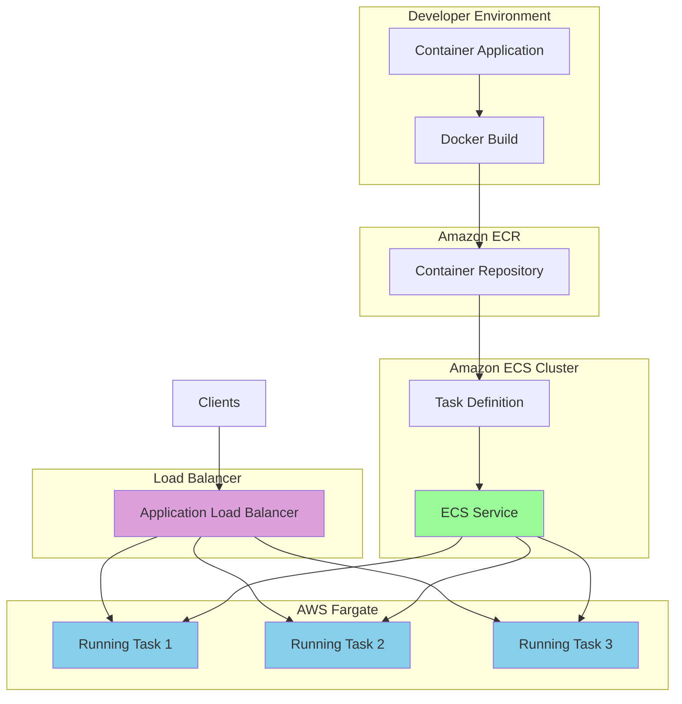

# Running Containers with AWS Fargate

## Problem

You need to deploy containerized applications to production without the operational overhead of managing EC2 instances, Kubernetes clusters, or underlying infrastructure. Traditional container deployment requires provisioning servers, configuring capacity, managing patches, and scaling infrastructure manually, which increases operational complexity and costs while diverting focus from application development.

## Solution

Deploy your containerized applications using AWS Fargate, a serverless compute engine for containers that eliminates the need to manage underlying infrastructure. With Fargate, you define your application requirements in an ECS task definition, push your container image to Amazon ECR, and let AWS handle the provisioning, scaling, and maintenance of the compute infrastructure automatically.



## Prerequisites

1. Docker installed locally for building container images
2. AWS CLI v2 installed and configured with appropriate permissions
3. IAM permissions for ECS, ECR, Fargate, and related services (VPC, IAM, CloudWatch, Application Auto Scaling)
4. Basic understanding of containerization and Docker concepts
5. Estimated cost: $0.50-2.00/hour for Fargate compute time, minimal ECR storage costs

> **Note**: This recipe will incur costs for Fargate compute time, ECR storage, and data transfer. Fargate pricing is based on vCPU and memory resources allocated to tasks, calculated per second with a 1-minute minimum.

## Preparation

Set up environment variables and create the foundational AWS resources:

```bash
# Set AWS environment variables
export AWS_REGION=$(aws configure get region)
export AWS_ACCOUNT_ID=$(aws sts get-caller-identity \
    --query Account --output text)

# Generate random suffix for globally unique resource names
RANDOM_STRING=$(aws secretsmanager get-random-password \
    --exclude-punctuation --exclude-uppercase \
    --password-length 6 --require-each-included-type \
    --output text --query RandomPassword)

export CLUSTER_NAME="fargate-demo-${RANDOM_STRING}"
export REPOSITORY_NAME="demo-app-${RANDOM_STRING}"
export SERVICE_NAME="demo-service"
export TASK_FAMILY="demo-task"

# Create ECS cluster
aws ecs create-cluster \
    --cluster-name $CLUSTER_NAME \
    --capacity-providers FARGATE FARGATE_SPOT \
    --default-capacity-provider-strategy \
    capacityProvider=FARGATE,weight=1

# Create ECR repository with vulnerability scanning
aws ecr create-repository \
    --repository-name $REPOSITORY_NAME \
    --image-scanning-configuration scanOnPush=true

# Get ECR repository URI
REPOSITORY_URI=$(aws ecr describe-repositories \
    --repository-names $REPOSITORY_NAME \
    --query 'repositories[0].repositoryUri' --output text)

export REPOSITORY_URI

echo "✅ Setup complete. Repository URI: $REPOSITORY_URI"
```

## Steps

1. **Create Sample Containerized Application**:

   Before deploying to Fargate, we need a containerized application that demonstrates proper cloud-native architecture patterns. A well-designed container application includes health endpoints for ECS health checks, proper logging for CloudWatch integration, and secure configuration practices. This foundational step establishes the application layer that will benefit from Fargate's serverless compute capabilities.

   ```bash
   # Create application directory
   mkdir -p fargate-demo-app
   cd fargate-demo-app

   # Create a simple Node.js application
   cat << 'EOF' > app.js
   const express = require('express');
   const app = express();
   const port = process.env.PORT || 3000;

   app.get('/', (req, res) => {
     res.json({
       message: 'Hello from AWS Fargate!',
       timestamp: new Date().toISOString(),
       hostname: require('os').hostname()
     });
   });

   app.get('/health', (req, res) => {
     res.status(200).json({ status: 'healthy' });
   });

   app.listen(port, '0.0.0.0', () => {
     console.log(`Server running on port ${port}`);
   });
   EOF

   # Create package.json with latest LTS dependencies
   cat << 'EOF' > package.json
   {
     "name": "fargate-demo-app",
     "version": "1.0.0",
     "description": "Demo application for AWS Fargate",
     "main": "app.js",
     "scripts": {
       "start": "node app.js"
     },
     "dependencies": {
       "express": "^4.21.1"
     }
   }
   EOF

   # Create optimized Dockerfile with security best practices
   cat << 'EOF' > Dockerfile
   FROM node:22-alpine
   
   # Create app directory
   WORKDIR /app
   
   # Copy package files and install dependencies
   COPY package*.json ./
   RUN npm ci --only=production && npm cache clean --force
   
   # Copy application code
   COPY . .
   
   # Expose port
   EXPOSE 3000
   
   # Create non-root user for security
   RUN addgroup -g 1001 -S nodejs && \
       adduser -S nodeuser -u 1001
   
   # Change ownership and switch to non-root user
   RUN chown -R nodeuser:nodejs /app
   USER nodeuser
   
   # Define the command to run the application
   CMD ["npm", "start"]
   EOF

   cd ..
   ```

   Your containerized application is now ready with essential cloud-native features including health endpoints and secure configuration. The Dockerfile follows security best practices by using a non-root user, optimized layer caching, and the latest Node.js LTS version, which will reduce deployment times and enhance security when running on Fargate.

2. **Build and Push Container Image to Amazon ECR**:

   Amazon ECR provides a fully managed container registry that integrates seamlessly with ECS and Fargate. ECR offers features like vulnerability scanning, image signing, and lifecycle policies that are essential for production containerized applications. Building and storing your images in ECR ensures they're available for deployment while maintaining security and compliance standards.

   ```bash
   cd fargate-demo-app

   # Build the Docker image
   docker build -t $REPOSITORY_NAME .

   # Tag the image for ECR
   docker tag $REPOSITORY_NAME:latest $REPOSITORY_URI:latest

   # Get ECR login token and authenticate Docker client
   aws ecr get-login-password --region $AWS_REGION | \
       docker login --username AWS --password-stdin $REPOSITORY_URI

   # Push the image to ECR
   docker push $REPOSITORY_URI:latest

   echo "✅ Image pushed successfully to $REPOSITORY_URI:latest"
   cd ..
   ```

   Your container image is now stored in ECR with vulnerability scanning enabled, providing a secure foundation for Fargate deployments. ECR automatically scans your images and provides detailed security reports, helping you maintain secure container workloads throughout their lifecycle.

> **Tip**: Amazon ECR automatically scans your images for vulnerabilities when `scanOnPush` is enabled. Check the ECR console after pushing to review any security findings and address critical vulnerabilities before deployment.

3. **Create IAM Roles for ECS Task Execution**:

   IAM roles in ECS provide secure, temporary credential delegation that follows the principle of least privilege. The task execution role enables ECS to pull container images from ECR, send logs to CloudWatch, and perform other essential infrastructure operations on behalf of your tasks. This security model eliminates the need to embed AWS credentials in your container images while providing the necessary permissions for Fargate operations.

   ```bash
   # Create task execution role trust policy
   cat << 'EOF' > task-execution-assume-role-policy.json
   {
     "Version": "2012-10-17",
     "Statement": [
       {
         "Effect": "Allow",
         "Principal": {
           "Service": "ecs-tasks.amazonaws.com"
         },
         "Action": "sts:AssumeRole"
       }
     ]
   }
   EOF

   # Create the task execution role
   aws iam create-role \
       --role-name ecsTaskExecutionRole-$RANDOM_STRING \
       --assume-role-policy-document file://task-execution-assume-role-policy.json

   # Attach the required policy for task execution
   aws iam attach-role-policy \
       --role-name ecsTaskExecutionRole-$RANDOM_STRING \
       --policy-arn arn:aws:iam::aws:policy/service-role/AmazonECSTaskExecutionRolePolicy

   # Wait for role to be available
   sleep 10

   # Get the execution role ARN
   EXECUTION_ROLE_ARN=$(aws iam get-role \
       --role-name ecsTaskExecutionRole-$RANDOM_STRING \
       --query 'Role.Arn' --output text)

   export EXECUTION_ROLE_ARN
   
   echo "✅ Task execution role created: $EXECUTION_ROLE_ARN"
   ```

   The IAM execution role is now configured with the necessary permissions for Fargate task execution. This role enables secure access to ECR for image pulls and CloudWatch for logging, establishing the security foundation that allows your containers to operate without embedded credentials.

4. **Create ECS Task Definition for Fargate Application**:

   The ECS task definition serves as the blueprint for your containerized application, specifying resource requirements, networking mode, and container configuration. Fargate requires the `awsvpc` network mode, which provides each task with its own elastic network interface and private IP address, enabling fine-grained network security controls. This architectural pattern supports microservices isolation and simplified service-to-service communication.

   ```bash
   # Get default VPC information for networking
   DEFAULT_VPC_ID=$(aws ec2 describe-vpcs \
       --filters "Name=is-default,Values=true" \
       --query 'Vpcs[0].VpcId' --output text)

   # Create CloudWatch log group
   aws logs create-log-group \
       --log-group-name /ecs/$TASK_FAMILY \
       --region $AWS_REGION

   # Create task definition JSON with health checks
   cat << EOF > task-definition.json
   {
     "family": "$TASK_FAMILY",
     "networkMode": "awsvpc",
     "requiresCompatibilities": ["FARGATE"],
     "cpu": "256",
     "memory": "512",
     "executionRoleArn": "$EXECUTION_ROLE_ARN",
     "runtimePlatform": {
       "cpuArchitecture": "X86_64",
       "operatingSystemFamily": "LINUX"
     },
     "containerDefinitions": [
       {
         "name": "demo-container",
         "image": "$REPOSITORY_URI:latest",
         "portMappings": [
           {
             "name": "demo-container-3000-tcp",
             "containerPort": 3000,
             "hostPort": 3000,
             "protocol": "tcp"
           }
         ],
         "essential": true,
         "logConfiguration": {
           "logDriver": "awslogs",
           "options": {
             "awslogs-group": "/ecs/$TASK_FAMILY",
             "awslogs-region": "$AWS_REGION",
             "awslogs-stream-prefix": "ecs"
           }
         },
         "healthCheck": {
           "command": [
             "CMD-SHELL",
             "wget --no-verbose --tries=1 --spider http://localhost:3000/health || exit 1"
           ],
           "interval": 30,
           "timeout": 5,
           "retries": 3,
           "startPeriod": 60
         }
       }
     ]
   }
   EOF

   # Register the task definition
   aws ecs register-task-definition \
       --cli-input-json file://task-definition.json

   echo "✅ Task definition registered: $TASK_FAMILY"
   ```

   Your task definition is now registered with ECS, defining the container specifications, resource allocation, and health check configuration. The health check ensures that ECS only considers tasks healthy when your application responds correctly, enabling automatic recovery and traffic routing to healthy instances.

5. **Create Security Groups and Networking Configuration**:

   Security groups act as virtual firewalls for your Fargate tasks, controlling inbound and outbound traffic at the instance level. The `awsvpc` networking mode in Fargate assigns each task its own elastic network interface, enabling you to apply security group rules directly to containers rather than to underlying hosts. This provides precise network security controls and simplifies compliance requirements for containerized applications.

   ```bash
   # Create security group for the Fargate tasks
   FARGATE_SG_ID=$(aws ec2 create-security-group \
       --group-name fargate-demo-sg-$RANDOM_STRING \
       --description "Security group for Fargate demo application" \
       --vpc-id $DEFAULT_VPC_ID \
       --query 'GroupId' --output text)

   # Allow inbound traffic on port 3000 from anywhere (demo only)
   aws ec2 authorize-security-group-ingress \
       --group-id $FARGATE_SG_ID \
       --protocol tcp --port 3000 --cidr 0.0.0.0/0

   # Get default subnets for the VPC
   SUBNET_IDS=$(aws ec2 describe-subnets \
       --filters "Name=vpc-id,Values=$DEFAULT_VPC_ID" \
       --query 'Subnets[*].SubnetId' --output text | \
       tr '\t' ',')

   export FARGATE_SG_ID SUBNET_IDS
   echo "✅ Security group created: $FARGATE_SG_ID"
   echo "✅ Using subnets: $SUBNET_IDS"
   ```

   The security group and subnet configuration establish the network perimeter for your Fargate tasks. Each task will receive its own network interface within the specified subnets, with the security group rules controlling access to your application ports.

6. **Create and Configure ECS Service with High Availability**:

   ECS services provide the orchestration layer that ensures your desired number of tasks are running and healthy at all times. Services handle task placement, replacement of failed tasks, and integration with load balancers for traffic distribution. The service definition enables Fargate to automatically manage the lifecycle of your containerized application, providing high availability and resilience without requiring manual intervention.

   ```bash
   # Create the ECS service with high availability configuration
   aws ecs create-service \
       --cluster $CLUSTER_NAME \
       --service-name $SERVICE_NAME \
       --task-definition $TASK_FAMILY \
       --desired-count 2 \
       --launch-type FARGATE \
       --platform-version LATEST \
       --network-configuration "awsvpcConfiguration={subnets=[$SUBNET_IDS],securityGroups=[$FARGATE_SG_ID],assignPublicIp=ENABLED}" \
       --enable-execute-command

   # Wait for the service to stabilize
   echo "Waiting for service to become stable..."
   aws ecs wait services-stable \
       --cluster $CLUSTER_NAME \
       --services $SERVICE_NAME

   echo "✅ Service created and stable: $SERVICE_NAME"
   ```

   Your ECS service is now running with two tasks distributed across multiple availability zones for high availability. The service continuously monitors task health and automatically replaces any failed tasks, ensuring your application maintains the desired capacity and availability.

7. **Configure Service Auto-Scaling Policies**:

   Application Auto Scaling enables your Fargate service to automatically adjust the number of running tasks based on demand metrics such as CPU utilization, memory usage, or custom CloudWatch metrics. This elasticity ensures optimal performance during traffic spikes while minimizing costs during low-demand periods. Target tracking scaling policies provide a simple way to maintain performance targets automatically without manual intervention.

   ```bash
   # Register the service as a scalable target
   aws application-autoscaling register-scalable-target \
       --service-namespace ecs \
       --resource-id service/$CLUSTER_NAME/$SERVICE_NAME \
       --scalable-dimension ecs:service:DesiredCount \
       --min-capacity 1 \
       --max-capacity 10

   # Create target tracking scaling policy based on CPU utilization
   aws application-autoscaling put-scaling-policy \
       --service-namespace ecs \
       --resource-id service/$CLUSTER_NAME/$SERVICE_NAME \
       --scalable-dimension ecs:service:DesiredCount \
       --policy-name cpu-target-tracking-scaling-policy \
       --policy-type TargetTrackingScaling \
       --target-tracking-scaling-policy-configuration '{
           "TargetValue": 50.0,
           "PredefinedMetricSpecification": {
               "PredefinedMetricType": "ECSServiceAverageCPUUtilization"
           },
           "ScaleOutCooldown": 300,
           "ScaleInCooldown": 300
       }'

   echo "✅ Auto-scaling configured for the service"
   ```

   Auto-scaling is now configured to maintain average CPU utilization around 50%, automatically scaling out when demand increases and scaling in when demand decreases. This ensures your application can handle traffic variations efficiently while optimizing costs through right-sizing.

## Validation & Testing

1. Verify that your ECS cluster is running and active:

   ```bash
   CLUSTER_STATUS=$(aws ecs describe-clusters \
       --clusters $CLUSTER_NAME \
       --query 'clusters[0].status' --output text)
   
   if [ "$CLUSTER_STATUS" = "ACTIVE" ]; then
       echo "✅ ECS cluster is active"
   else
       echo "❌ ECS cluster status: $CLUSTER_STATUS"
   fi
   ```

2. Check that your service is running with the desired number of tasks:

   ```bash
   SERVICE_INFO=$(aws ecs describe-services \
       --cluster $CLUSTER_NAME \
       --services $SERVICE_NAME \
       --query 'services[0].[runningCount,desiredCount]' \
       --output text)
   
   RUNNING_COUNT=$(echo $SERVICE_INFO | cut -d' ' -f1)
   DESIRED_COUNT=$(echo $SERVICE_INFO | cut -d' ' -f2)
   
   if [ "$RUNNING_COUNT" = "$DESIRED_COUNT" ]; then
       echo "✅ Service is running $RUNNING_COUNT/$DESIRED_COUNT tasks"
   else
       echo "❌ Service running $RUNNING_COUNT/$DESIRED_COUNT tasks"
   fi
   ```

3. Test application connectivity by getting task public IPs and making HTTP requests:

   ```bash
   # Get running task ARNs
   TASK_ARNS=$(aws ecs list-tasks \
       --cluster $CLUSTER_NAME \
       --service-name $SERVICE_NAME \
       --query 'taskArns[*]' --output text)
   
   echo "Testing connectivity to running tasks:"
   for TASK_ARN in $TASK_ARNS; do
       # Get task details including network interface
       TASK_DETAILS=$(aws ecs describe-tasks \
           --cluster $CLUSTER_NAME \
           --tasks $TASK_ARN)
       
       # Extract public IP address
       PUBLIC_IP=$(echo $TASK_DETAILS | \
           jq -r '.tasks[0].attachments[0].details[] | 
           select(.name=="networkInterfaceId").value' | \
           xargs -I {} aws ec2 describe-network-interfaces \
           --network-interface-ids {} \
           --query 'NetworkInterfaces[0].Association.PublicIp' \
           --output text)
       
       if [ "$PUBLIC_IP" != "null" ] && [ "$PUBLIC_IP" != "" ]; then
           echo "Testing task at IP: $PUBLIC_IP"
           curl -f "http://$PUBLIC_IP:3000" && \
               echo " ✅ Task responding" || \
               echo " ❌ Task not responding"
       fi
   done
   ```

4. Verify auto-scaling is configured:

   ```bash
   SCALING_POLICIES=$(aws application-autoscaling describe-scaling-policies \
       --service-namespace ecs \
       --resource-id service/$CLUSTER_NAME/$SERVICE_NAME \
       --query 'ScalingPolicies[*].PolicyName' --output text)
   
   if [ -n "$SCALING_POLICIES" ]; then
       echo "✅ Auto-scaling policies configured: $SCALING_POLICIES"
   else
       echo "❌ No auto-scaling policies found"
   fi
   ```

> **Warning**: The tasks are configured with public IP addresses for testing purposes. In production, consider using a load balancer and placing tasks in private subnets for better security following AWS Well-Architected Framework principles.

## Cleanup

1. Delete the ECS service and wait for it to drain:

   ```bash
   # Scale down the service to 0 tasks
   aws ecs update-service \
       --cluster $CLUSTER_NAME \
       --service $SERVICE_NAME \
       --desired-count 0
   
   # Wait for tasks to stop
   aws ecs wait services-stable \
       --cluster $CLUSTER_NAME \
       --services $SERVICE_NAME
   
   # Delete the service
   aws ecs delete-service \
       --cluster $CLUSTER_NAME \
       --service $SERVICE_NAME
   
   echo "✅ ECS service deleted"
   ```

2. Remove auto-scaling configuration:

   ```bash
   # Deregister the scalable target
   aws application-autoscaling deregister-scalable-target \
       --service-namespace ecs \
       --resource-id service/$CLUSTER_NAME/$SERVICE_NAME \
       --scalable-dimension ecs:service:DesiredCount
   
   echo "✅ Auto-scaling configuration removed"
   ```

3. Clean up ECS cluster and task definitions:

   ```bash
   # Delete the cluster
   aws ecs delete-cluster --cluster $CLUSTER_NAME
   
   # Deregister task definition (optional - keeps revision history)
   # aws ecs deregister-task-definition --task-definition $TASK_FAMILY:1
   
   echo "✅ ECS cluster deleted"
   ```

4. Remove ECR repository and images:

   ```bash
   # Delete all images in the repository
   aws ecr batch-delete-image \
       --repository-name $REPOSITORY_NAME \
       --image-ids imageTag=latest
   
   # Delete the repository
   aws ecr delete-repository \
       --repository-name $REPOSITORY_NAME
   
   echo "✅ ECR repository deleted"
   ```

5. Clean up IAM roles and security groups:

   ```bash
   # Detach policy from execution role
   aws iam detach-role-policy \
       --role-name ecsTaskExecutionRole-$RANDOM_STRING \
       --policy-arn arn:aws:iam::aws:policy/service-role/AmazonECSTaskExecutionRolePolicy
   
   # Delete execution role
   aws iam delete-role --role-name ecsTaskExecutionRole-$RANDOM_STRING
   
   # Delete security group
   aws ec2 delete-security-group --group-id $FARGATE_SG_ID
   
   # Delete CloudWatch log group
   aws logs delete-log-group --log-group-name /ecs/$TASK_FAMILY
   
   echo "✅ IAM roles and security groups cleaned up"
   ```

6. Remove local application files:

   ```bash
   # Clean up local files
   rm -rf fargate-demo-app
   rm task-definition.json task-execution-assume-role-policy.json
   
   echo "✅ Cleanup completed successfully"
   ```

## Discussion

[AWS Fargate](https://docs.aws.amazon.com/AmazonECS/latest/developerguide/AWS_Fargate.html) represents a significant shift in how containerized applications are deployed and managed in the cloud. By abstracting away the underlying infrastructure, Fargate enables developers to focus on application logic rather than server management, patching, and capacity planning. This serverless approach to container hosting provides several key advantages over traditional EC2-based deployments and aligns with the AWS Well-Architected Framework's operational excellence pillar.

The isolation model in Fargate ensures that each task runs in its own dedicated environment with allocated CPU, memory, and network resources that are not shared with other workloads. This provides strong security boundaries and predictable performance characteristics, making it suitable for production workloads that require consistent resource allocation. The integration with Amazon ECR provides a secure, managed container registry that includes vulnerability scanning and image signing capabilities, supporting the security pillar of the Well-Architected Framework.

One of the most compelling aspects of Fargate is its pay-per-use pricing model. Unlike EC2 instances that you pay for regardless of utilization, Fargate charges only for the vCPU and memory resources allocated to your running tasks, calculated per second with a one-minute minimum. This makes it particularly cost-effective for applications with variable or unpredictable traffic patterns, development environments, and batch processing workloads. The ability to mix Fargate and Fargate Spot capacity provides additional cost optimization opportunities for fault-tolerant workloads, directly supporting the cost optimization pillar.

The recipe demonstrates several production-ready patterns including health checks, auto-scaling, and comprehensive logging. The health check configuration ensures that ECS only routes traffic to healthy containers, while the auto-scaling policies automatically adjust capacity based on CPU utilization metrics. For production deployments, consider implementing additional monitoring with [CloudWatch Container Insights](https://docs.aws.amazon.com/AmazonCloudWatch/latest/monitoring/ContainerInsights.html), setting up proper networking with private subnets and load balancers, and implementing CI/CD pipelines for automated deployments as described in the [AWS Well-Architected Framework](https://docs.aws.amazon.com/wellarchitected/latest/framework/welcome.html).

> **Note**: This recipe follows AWS Well-Architected Framework principles for operational excellence, security, reliability, performance efficiency, and cost optimization. For production deployments, review the complete framework guidance to ensure your architecture meets all requirements.

## Challenge

Extend this solution by implementing these enhancements:

1. **Multi-Service Architecture**: Create a multi-service microservices architecture where multiple containerized services communicate with each other using ECS Service Connect. Add a web frontend service, an API backend service, and configure service-to-service communication with service discovery and load balancing.

2. **Advanced Auto-Scaling**: Implement different scaling policies for each service based on their specific performance characteristics (CPU for compute-intensive services, memory for data-intensive services, custom CloudWatch metrics for application-specific scaling).

3. **Production Security**: Replace public subnets with private subnets, add an Application Load Balancer for traffic distribution, implement AWS WAF for additional security, and configure VPC endpoints for ECR access without internet connectivity.

4. **Monitoring and Observability**: Add comprehensive monitoring dashboards using CloudWatch Container Insights, implement distributed tracing with AWS X-Ray, and create custom CloudWatch alarms for proactive alerting on application and infrastructure metrics.

5. **CI/CD Integration**: Build a complete CI/CD pipeline using AWS CodePipeline, CodeBuild, and CodeDeploy to automatically build, test, and deploy container updates with blue/green deployment strategies for zero-downtime deployments.

## Infrastructure Code

### Available Infrastructure as Code:

- [Infrastructure Code Overview](code/README.md) - Detailed description of all infrastructure components
- [AWS CDK (Python)](code/cdk-python/) - AWS CDK Python implementation
- [AWS CDK (TypeScript)](code/cdk-typescript/) - AWS CDK TypeScript implementation
- [CloudFormation](code/cloudformation.yaml) - AWS CloudFormation template
- [Bash CLI Scripts](code/scripts/) - Example bash scripts using AWS CLI commands to deploy infrastructure
- [Terraform](code/terraform/) - Terraform configuration files