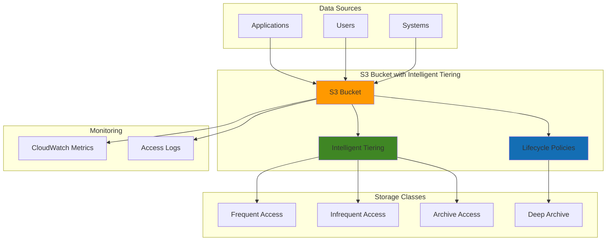

# S3 Automated Tiering and Lifecycle Management

## Problem

Organizations struggle with balancing storage costs and access performance as their data grows exponentially. Without automated management, companies pay premium prices for infrequently accessed data stored in high-performance tiers, while performance-critical data may be relegated to slower, cheaper storage classes. Manual lifecycle management becomes impossible at scale and often results in either over-provisioning expensive storage or under-provisioning that impacts application performance.

## Solution

Amazon S3 Intelligent Tiering automatically monitors access patterns and moves objects between different storage classes without performance impact or operational overhead. Combined with lifecycle policies, this creates a comprehensive cost optimization strategy that can reduce storage costs by up to 68% while maintaining millisecond access times for frequently accessed data. The solution provides automated cost optimization without requiring application changes or complex monitoring systems.

## Architecture Diagram



## Prerequisites

1. AWS account with S3 full access permissions
2. AWS CLI v2 installed and configured (or AWS CloudShell access)
3. Basic understanding of S3 storage classes and pricing models
4. Existing S3 bucket or permission to create new buckets
5. Estimated cost: $0.01-$5.00 per month depending on data volume and access patterns

> **Note**: Intelligent Tiering has a small monitoring fee of $0.0025 per 1,000 objects but typically saves much more in storage costs.

## Preparation

```bash
# Set environment variables
export AWS_REGION=$(aws configure get region)
export AWS_ACCOUNT_ID=$(aws sts get-caller-identity \
    --query Account --output text)

# Generate unique suffix for resources
RANDOM_SUFFIX=$(aws secretsmanager get-random-password \
    --exclude-punctuation --exclude-uppercase \
    --password-length 6 --require-each-included-type \
    --output text --query RandomPassword)

export BUCKET_NAME="intelligent-tiering-demo-${RANDOM_SUFFIX}"

echo "✅ Environment prepared. Bucket name: ${BUCKET_NAME}"
```

## Steps

1. **Create S3 Bucket with Intelligent Tiering Configuration**:

   S3 Intelligent Tiering automatically optimizes storage costs by moving objects between access tiers based on changing access patterns. This service monitors object access and automatically moves data to the most cost-effective tier without performance impact, operational overhead, or retrieval fees when accessing your data.

   ```bash
   # Create the S3 bucket
   aws s3 mb s3://${BUCKET_NAME} --region ${AWS_REGION}
   
   # Enable versioning for better data protection
   aws s3api put-bucket-versioning \
       --bucket ${BUCKET_NAME} \
       --versioning-configuration Status=Enabled
   
   echo "✅ S3 bucket created with versioning enabled"
   ```

   The bucket is now ready to receive data and will serve as the foundation for our intelligent storage optimization strategy. Versioning provides additional data protection while intelligent tiering optimizes costs automatically.

2. **Configure Intelligent Tiering for the Entire Bucket**:

   Intelligent Tiering works by monitoring access patterns over 30-day periods and automatically transitioning objects between frequent and infrequent access tiers. This eliminates the guesswork in predicting access patterns and ensures optimal cost-performance balance without manual intervention.

   ```bash
   # Create intelligent tiering configuration
   aws s3api put-bucket-intelligent-tiering-configuration \
       --bucket ${BUCKET_NAME} \
       --id "EntireBucketConfig" \
       --intelligent-tiering-configuration '{
           "Id": "EntireBucketConfig",
           "Status": "Enabled",
           "Filter": {
               "Prefix": ""
           },
           "Tierings": [
               {
                   "Days": 90,
                   "AccessTier": "ARCHIVE_ACCESS"
               },
               {
                   "Days": 180,
                   "AccessTier": "DEEP_ARCHIVE_ACCESS"
               }
           ]
       }'
   
   echo "✅ Intelligent Tiering configured for entire bucket"
   ```

   This configuration enables automatic transitions to Archive Access after 90 days and Deep Archive Access after 180 days of no access, providing up to 95% cost savings for long-term archival while maintaining data accessibility.

3. **Create Lifecycle Policy for Additional Cost Optimization**:

   Lifecycle policies complement Intelligent Tiering by handling specific scenarios like deleting incomplete multipart uploads, managing object versions, and enforcing data retention policies. This creates a comprehensive data management strategy that addresses both cost optimization and compliance requirements.

   ```bash
   # Create lifecycle policy configuration
   cat > lifecycle-policy.json << 'EOF'
   {
       "Rules": [
           {
               "ID": "OptimizeStorage",
               "Status": "Enabled",
               "Filter": {
                   "Prefix": ""
               },
               "Transitions": [
                   {
                       "Days": 30,
                       "StorageClass": "INTELLIGENT_TIERING"
                   }
               ],
               "AbortIncompleteMultipartUpload": {
                   "DaysAfterInitiation": 7
               },
               "NoncurrentVersionTransitions": [
                   {
                       "NoncurrentDays": 30,
                       "StorageClass": "STANDARD_IA"
                   },
                   {
                       "NoncurrentDays": 90,
                       "StorageClass": "GLACIER"
                   }
               ],
               "NoncurrentVersionExpiration": {
                   "NoncurrentDays": 365
               }
           }
       ]
   }
   EOF
   
   # Apply lifecycle policy to bucket
   aws s3api put-bucket-lifecycle-configuration \
       --bucket ${BUCKET_NAME} \
       --lifecycle-configuration file://lifecycle-policy.json
   
   echo "✅ Lifecycle policy applied successfully"
   ```

   The lifecycle policy now automatically transitions new objects to Intelligent Tiering after 30 days, manages incomplete uploads, and handles version lifecycle management. This creates a complete automated storage optimization pipeline.

4. **Upload Sample Data with Different Access Patterns**:

   Testing with sample data helps validate the configuration and demonstrates how Intelligent Tiering responds to different access patterns. Real-world data often has varying access characteristics, and this step simulates those patterns to showcase the cost optimization benefits.

   ```bash
   # Create sample files with different sizes and types
   echo "Frequently accessed data - $(date)" > frequent-data.txt
   echo "Archive data from $(date)" > archive-data.txt
   
   # Create a larger sample file
   base64 /dev/urandom | head -c 1048576 > large-sample.dat
   
   # Upload files to different prefixes
   aws s3 cp frequent-data.txt s3://${BUCKET_NAME}/active/
   aws s3 cp archive-data.txt s3://${BUCKET_NAME}/archive/
   aws s3 cp large-sample.dat s3://${BUCKET_NAME}/data/
   
   # Add metadata tags for better organization
   aws s3api put-object-tagging \
       --bucket ${BUCKET_NAME} \
       --key active/frequent-data.txt \
       --tagging 'TagSet=[{Key=AccessPattern,Value=Frequent},{Key=Department,Value=Operations}]'
   
   echo "✅ Sample data uploaded with appropriate tagging"
   ```

   The sample data is now in place with proper tagging and organization. This establishes baseline objects that will demonstrate Intelligent Tiering behavior and provide data for monitoring cost optimization effectiveness.

5. **Configure CloudWatch Monitoring for Storage Metrics**:

   CloudWatch monitoring provides visibility into storage utilization, access patterns, and cost optimization effectiveness. These metrics enable data-driven decisions about storage policies and help demonstrate ROI from Intelligent Tiering implementation.

   ```bash
   # Enable S3 request metrics for the bucket
   aws s3api put-bucket-metrics-configuration \
       --bucket ${BUCKET_NAME} \
       --id "EntireBucket" \
       --metrics-configuration '{
           "Id": "EntireBucket",
           "Filter": {
               "Prefix": ""
           }
       }'
   
   # Create CloudWatch dashboard for monitoring
   aws cloudwatch put-dashboard \
       --dashboard-name "S3-Storage-Optimization-${RANDOM_SUFFIX}" \
       --dashboard-body '{
           "widgets": [
               {
                   "type": "metric",
                   "properties": {
                       "metrics": [
                           ["AWS/S3", "BucketSizeBytes", "BucketName", "'${BUCKET_NAME}'", "StorageType", "StandardStorage"],
                           [".", ".", ".", ".", ".", "IntelligentTieringIAStorage"],
                           [".", ".", ".", ".", ".", "IntelligentTieringAAStorage"]
                       ],
                       "period": 86400,
                       "stat": "Average",
                       "region": "'${AWS_REGION}'",
                       "title": "S3 Storage by Class"
                   }
               }
           ]
       }'
   
   echo "✅ CloudWatch monitoring configured"
   ```

   Monitoring is now active and will track storage distribution across different tiers. This visibility enables ongoing optimization and provides metrics to measure the business impact of the storage strategy.

> **Warning**: S3 Intelligent Tiering monitoring charges apply at $0.0025 per 1,000 objects monitored, but savings typically exceed costs significantly.

## Validation & Testing

1. **Verify Intelligent Tiering Configuration**:

   ```bash
   # Check intelligent tiering configuration
   aws s3api get-bucket-intelligent-tiering-configuration \
       --bucket ${BUCKET_NAME} \
       --id "EntireBucketConfig"
   ```

   Expected output: JSON configuration showing enabled status and tiering rules.

2. **Verify Lifecycle Policy**:

   ```bash
   # Check lifecycle configuration
   aws s3api get-bucket-lifecycle-configuration \
       --bucket ${BUCKET_NAME}
   ```

   Expected output: Lifecycle rules showing transitions and cleanup policies.

3. **Test Object Access and Metadata**:

   ```bash
   # List objects and their storage classes
   aws s3api list-objects-v2 \
       --bucket ${BUCKET_NAME} \
       --query 'Contents[].{Key:Key,StorageClass:StorageClass,Size:Size}'
   
   # Access one file to simulate frequent access pattern
   aws s3 cp s3://${BUCKET_NAME}/active/frequent-data.txt downloaded-file.txt
   
   echo "✅ Objects accessible and properly configured"
   ```

4. **Monitor Initial Metrics**:

   ```bash
   # Check bucket metrics
   aws cloudwatch get-metric-statistics \
       --namespace AWS/S3 \
       --metric-name BucketSizeBytes \
       --dimensions Name=BucketName,Value=${BUCKET_NAME} Name=StorageType,Value=StandardStorage \
       --start-time $(date -u -d '1 day ago' +%Y-%m-%dT%H:%M:%SZ) \
       --end-time $(date -u +%Y-%m-%dT%H:%M:%SZ) \
       --period 86400 \
       --statistics Average
   ```

## Cleanup

1. **Remove Sample Data**:

   ```bash
   # Delete all objects from bucket
   aws s3 rm s3://${BUCKET_NAME} --recursive
   
   # Remove all object versions (if any exist)
   aws s3api list-object-versions \
       --bucket ${BUCKET_NAME} \
       --query 'Versions[].{Key:Key,VersionId:VersionId}' \
       --output json > versions.json
   
   if [ -s versions.json ] && [ "$(cat versions.json)" != "[]" ]; then
       aws s3api delete-objects \
           --bucket ${BUCKET_NAME} \
           --delete file://versions.json
   fi
   
   rm -f versions.json
   
   echo "✅ All objects and versions removed"
   ```

2. **Remove CloudWatch Dashboard**:

   ```bash
   # Delete CloudWatch dashboard
   aws cloudwatch delete-dashboards \
       --dashboard-names "S3-Storage-Optimization-${RANDOM_SUFFIX}"
   
   echo "✅ CloudWatch dashboard removed"
   ```

3. **Delete S3 Bucket**:

   ```bash
   # Remove bucket configurations first
   aws s3api delete-bucket-intelligent-tiering-configuration \
       --bucket ${BUCKET_NAME} \
       --id "EntireBucketConfig"
   
   aws s3api delete-bucket-lifecycle-configuration \
       --bucket ${BUCKET_NAME}
   
   # Remove metrics configuration
   aws s3api delete-bucket-metrics-configuration \
       --bucket ${BUCKET_NAME} \
       --id "EntireBucket"
   
   # Delete the bucket
   aws s3 rb s3://${BUCKET_NAME}
   
   echo "✅ S3 bucket and configurations removed"
   ```

4. **Clean Up Local Files**:

   ```bash
   # Remove local test files
   rm -f frequent-data.txt archive-data.txt large-sample.dat \
         downloaded-file.txt lifecycle-policy.json
   
   echo "✅ Local files cleaned up"
   ```

## Discussion

S3 Intelligent Tiering represents a paradigm shift from manual storage management to automated cost optimization based on actual usage patterns. By continuously monitoring object access patterns over 30-day periods, it eliminates the traditional challenge of predicting future data access requirements while ensuring optimal cost-performance balance.

The integration of lifecycle policies with Intelligent Tiering creates a comprehensive data management strategy that addresses both immediate cost optimization and long-term data governance requirements. Organizations typically see 20-68% storage cost reductions within the first quarter of implementation, with the added benefit of simplified operations and reduced administrative overhead. The automatic transition capabilities ensure that performance-critical data remains highly available while infrequently accessed data moves to cost-effective storage tiers without manual intervention.

Security and compliance benefits extend beyond cost savings, as the solution maintains Amazon S3's industry-leading data durability (99.999999999% - 11 9's) while providing detailed access logging and monitoring capabilities. The CloudWatch integration enables data-driven decision making and helps organizations understand their data access patterns, leading to better architectural decisions and further optimization opportunities. This approach follows AWS Well-Architected Framework principles for cost optimization and operational excellence.

> **Tip**: Monitor your storage metrics monthly and adjust lifecycle policies based on actual access patterns shown in CloudWatch metrics for continuous optimization. See the [AWS S3 User Guide](https://docs.aws.amazon.com/AmazonS3/latest/userguide/intelligent-tiering.html) for additional best practices.

## Challenge

Extend this solution by implementing these enhancements:

1. **Multi-Environment Strategy**: Configure different intelligent tiering policies for development, staging, and production environments with environment-specific retention periods and access patterns.

2. **Cross-Region Replication**: Implement intelligent tiering with cross-region replication for disaster recovery while optimizing costs in both regions using region-specific access patterns.

3. **Advanced Tagging Strategy**: Create sophisticated tagging policies that enable fine-grained lifecycle management based on data classification, department, project, or compliance requirements.

4. **Cost Analytics Dashboard**: Build comprehensive cost tracking with AWS Cost Explorer APIs to monitor storage optimization ROI and create automated reporting for stakeholders.

5. **Lambda-Based Automation**: Develop Lambda functions that automatically adjust intelligent tiering configurations based on changing business requirements or seasonal access patterns.

## Infrastructure Code

### Available Infrastructure as Code:

- [Infrastructure Code Overview](code/README.md) - Detailed description of all infrastructure components
- [AWS CDK (Python)](code/cdk-python/) - AWS CDK Python implementation
- [AWS CDK (TypeScript)](code/cdk-typescript/) - AWS CDK TypeScript implementation
- [CloudFormation](code/cloudformation.yaml) - AWS CloudFormation template
- [Bash CLI Scripts](code/scripts/) - Example bash scripts using AWS CLI commands to deploy infrastructure
- [Terraform](code/terraform/) - Terraform configuration files