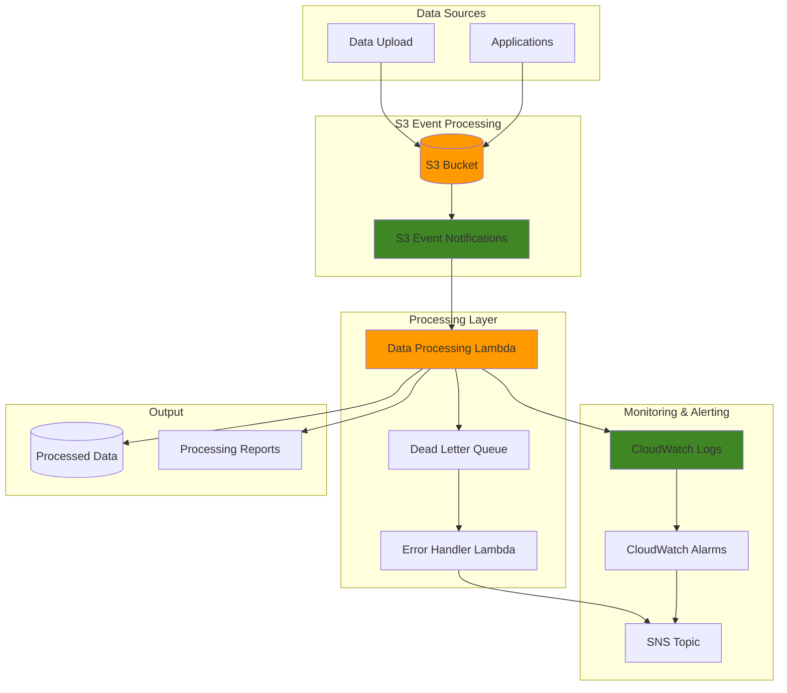

# Automated Processing with S3 Event Triggers

## Problem

Data processing teams struggle with manually triggering data pipelines when new files arrive in S3 buckets. This creates delays, increases operational overhead, and leads to inconsistent processing times. Organizations need automated mechanisms to process data files immediately upon arrival, but lack the infrastructure to reliably detect file uploads and trigger appropriate processing workflows without constant monitoring.

## Solution

This solution implements an event-driven data processing architecture using S3 event notifications to automatically trigger Lambda functions when objects are created or modified. The system filters events based on object prefixes and file types, routes them to specific processing functions, and provides comprehensive monitoring and error handling to ensure reliable data processing workflows.

## Architecture Diagram



## Prerequisites

1. AWS account with appropriate permissions for S3, Lambda, IAM, and CloudWatch
2. AWS CLI v2 installed and configured (or AWS CloudShell)
3. Basic understanding of event-driven architectures and Lambda functions
4. Experience with Python programming for Lambda functions
5. Estimated cost: $0.25-2.00 per month for light usage (varies by processing volume)

> **Note**: S3 event notifications are delivered at least once and typically arrive within seconds, but can occasionally take up to a minute. Learn more about [S3 Event Notifications](https://docs.aws.amazon.com/AmazonS3/latest/userguide/EventNotifications.html) in the AWS documentation.

> **Warning**: Lambda functions have a maximum execution time of 15 minutes. For large file processing, consider using Step Functions for orchestration or implementing streaming processing patterns.

## Preparation

```bash
# Set environment variables
export AWS_REGION=$(aws configure get region)
export AWS_ACCOUNT_ID=$(aws sts get-caller-identity \
    --query Account --output text)

# Generate unique identifiers for resources
RANDOM_SUFFIX=$(aws secretsmanager get-random-password \
    --exclude-punctuation --exclude-uppercase \
    --password-length 6 --require-each-included-type \
    --output text --query RandomPassword)

export BUCKET_NAME="data-processing-${RANDOM_SUFFIX}"
export LAMBDA_FUNCTION_NAME="data-processor-${RANDOM_SUFFIX}"
export ERROR_HANDLER_NAME="error-handler-${RANDOM_SUFFIX}"
export DLQ_NAME="data-processing-dlq-${RANDOM_SUFFIX}"
export SNS_TOPIC_NAME="data-processing-alerts-${RANDOM_SUFFIX}"
export LAMBDA_ROLE_NAME="data-processing-lambda-role-${RANDOM_SUFFIX}"

echo "✅ Environment variables configured"
echo "Bucket: $BUCKET_NAME"
echo "Lambda Function: $LAMBDA_FUNCTION_NAME"
```

## Steps

1. **Create S3 bucket for data processing**:

   Amazon S3 provides highly durable (99.999999999% or 11 9's) object storage that serves as the ideal foundation for event-driven data processing architectures. [S3 event notifications](https://docs.aws.amazon.com/AmazonS3/latest/userguide/EventNotifications.html) automatically detect when objects are created, modified, or deleted, eliminating the need for manual polling or scheduling mechanisms. This creates a reactive system that processes data immediately upon arrival, reducing latency and operational overhead.

   ```bash
   # Create the S3 bucket (handle region-specific creation)
   if [ "$AWS_REGION" = "us-east-1" ]; then
       aws s3api create-bucket --bucket $BUCKET_NAME
   else
       aws s3api create-bucket \
           --bucket $BUCKET_NAME \
           --region $AWS_REGION \
           --create-bucket-configuration LocationConstraint=$AWS_REGION
   fi
   
   # Enable versioning for better data management
   aws s3api put-bucket-versioning \
       --bucket $BUCKET_NAME \
       --versioning-configuration Status=Enabled
   
   echo "✅ S3 bucket created: $BUCKET_NAME"
   ```

   Your data landing zone is now established with versioning enabled for data protection and change tracking. The bucket will serve as the trigger point for automatic processing workflows whenever new data files arrive. Versioning ensures that accidental overwrites or deletions don't result in data loss, providing an additional layer of data protection for your processing pipeline.

2. **Create SNS topic for error notifications**:

   Amazon SNS (Simple Notification Service) provides a fully managed pub/sub messaging service that delivers messages reliably to multiple subscribers including email, SMS, mobile push notifications, and HTTP endpoints. In our architecture, SNS serves as the central notification hub for operational alerts, ensuring that processing failures and system issues are immediately communicated to operations teams for rapid response.

   ```bash
   # Create SNS topic for alerts
   SNS_TOPIC_ARN=$(aws sns create-topic \
       --name $SNS_TOPIC_NAME \
       --query TopicArn --output text)
   
   # Subscribe your email to the topic (replace with your email)
   aws sns subscribe \
       --topic-arn $SNS_TOPIC_ARN \
       --protocol email \
       --notification-endpoint your-email@example.com
   
   echo "✅ SNS topic created: $SNS_TOPIC_ARN"
   echo "Please check your email and confirm the subscription"
   ```

   Your notification infrastructure is now ready to provide real-time alerts about processing errors, system health issues, and operational anomalies. SNS's fanout capability allows you to add multiple notification channels (Slack, PagerDuty, SMS) without modifying your processing logic, creating a robust operational monitoring foundation.

3. **Create SQS Dead Letter Queue**:

   Amazon SQS Dead Letter Queues implement a critical error handling pattern that captures messages that cannot be processed successfully after multiple retry attempts. This prevents data loss from transient failures while providing a centralized location for analyzing and reprocessing failed events. [DLQs](https://docs.aws.amazon.com/AWSSimpleQueueService/latest/SQSDeveloperGuide/sqs-dead-letter-queues.html) are essential for production workloads where processing failures must be tracked, analyzed, and potentially retried without blocking the main processing pipeline.

   ```bash
   # Create dead letter queue for failed processing
   DLQ_URL=$(aws sqs create-queue \
       --queue-name $DLQ_NAME \
       --attributes VisibilityTimeoutSeconds=300 \
       --query QueueUrl --output text)
   
   # Get DLQ ARN
   DLQ_ARN=$(aws sqs get-queue-attributes \
       --queue-url $DLQ_URL \
       --attribute-names QueueArn \
       --query Attributes.QueueArn --output text)
   
   echo "✅ Dead Letter Queue created: $DLQ_ARN"
   ```

   Your error handling infrastructure is now in place to capture and manage processing failures systematically. The DLQ provides a safety net that prevents data loss from transient issues while enabling detailed failure analysis and manual reprocessing when needed. The 300-second visibility timeout gives adequate time for error investigation without message duplication.

4. **Create IAM role for Lambda functions**:

   AWS Lambda functions operate under IAM execution roles that define their permissions to access other AWS services. This follows the [principle of least privilege](https://docs.aws.amazon.com/IAM/latest/UserGuide/best-practices.html#grant-least-privilege), granting only the specific permissions needed for the function to operate. The trust policy defines which service (Lambda) can assume the role, while the execution role provides the security context for all function operations, ensuring secure and auditable access to AWS resources.

   ```bash
   # Create trust policy for Lambda
   cat > /tmp/lambda-trust-policy.json << 'EOF'
   {
       "Version": "2012-10-17",
       "Statement": [
           {
               "Effect": "Allow",
               "Principal": {
                   "Service": "lambda.amazonaws.com"
               },
               "Action": "sts:AssumeRole"
           }
       ]
   }
   EOF
   
   # Create IAM role
   aws iam create-role \
       --role-name $LAMBDA_ROLE_NAME \
       --assume-role-policy-document file:///tmp/lambda-trust-policy.json
   
   # Attach basic execution policy
   aws iam attach-role-policy \
       --role-name $LAMBDA_ROLE_NAME \
       --policy-arn arn:aws:iam::aws:policy/service-role/AWSLambdaBasicExecutionRole
   
   echo "✅ Lambda IAM role created"
   ```

   The execution role is now established with basic CloudWatch Logs permissions, providing the foundation for secure Lambda operations. This role will be enhanced with additional permissions for S3, SQS, and SNS access in the next step, following security best practices by separating trust relationships from specific resource permissions.

5. **Create Lambda execution policy with S3 and SQS permissions**:

   IAM policies implement fine-grained access control by specifying exactly which actions can be performed on which resources. This custom policy grants your Lambda functions the minimum permissions needed to read and write S3 objects, send messages to the Dead Letter Queue, and publish notifications to SNS. Each permission is scoped to specific resources, preventing unauthorized access to other AWS resources and following [IAM security best practices](https://docs.aws.amazon.com/IAM/latest/UserGuide/best-practices.html).

   ```bash
   # Create custom policy for S3 access and SQS publishing
   cat > /tmp/lambda-execution-policy.json << EOF
   {
       "Version": "2012-10-17",
       "Statement": [
           {
               "Effect": "Allow",
               "Action": [
                   "s3:GetObject",
                   "s3:GetObjectVersion",
                   "s3:PutObject",
                   "s3:DeleteObject"
               ],
               "Resource": [
                   "arn:aws:s3:::$BUCKET_NAME/*"
               ]
           },
           {
               "Effect": "Allow",
               "Action": [
                   "sqs:SendMessage",
                   "sqs:GetQueueAttributes"
               ],
               "Resource": [
                   "$DLQ_ARN"
               ]
           },
           {
               "Effect": "Allow",
               "Action": [
                   "sns:Publish"
               ],
               "Resource": [
                   "$SNS_TOPIC_ARN"
               ]
           }
       ]
   }
   EOF
   
   # Create and attach the policy
   aws iam put-role-policy \
       --role-name $LAMBDA_ROLE_NAME \
       --policy-name DataProcessingPolicy \
       --policy-document file:///tmp/lambda-execution-policy.json
   
   echo "✅ Lambda execution policy attached"
   ```

   Your Lambda functions now have precisely the permissions they need to operate securely within the data processing pipeline. The resource-specific permissions ensure that functions can only access the designated S3 bucket, DLQ, and SNS topic, preventing privilege escalation and maintaining security boundaries even if function code is compromised.

6. **Create the data processing Lambda function**:

   AWS Lambda provides serverless compute that automatically scales from zero to thousands of concurrent executions based on demand. This data processing function represents the core business logic of your pipeline, automatically triggered by [S3 events](https://docs.aws.amazon.com/lambda/latest/dg/with-s3.html) without requiring server management or capacity planning. Lambda's event-driven execution model means you only pay for actual processing time, making it ideal for variable workloads while providing built-in error handling and monitoring capabilities.

   ```bash
   # Create Lambda function code
   cat > /tmp/data_processor.py << 'EOF'
   import json
   import boto3
   import urllib.parse
   from datetime import datetime
   import logging
   
   # Configure logging
   logger = logging.getLogger()
   logger.setLevel(logging.INFO)
   
   s3 = boto3.client('s3')
   sqs = boto3.client('sqs')
   
   def lambda_handler(event, context):
       try:
           # Process each S3 event record
           for record in event['Records']:
               bucket = record['s3']['bucket']['name']
               key = urllib.parse.unquote_plus(record['s3']['object']['key'])
               
               logger.info(f"Processing object: {key} from bucket: {bucket}")
               
               # Get object metadata
               response = s3.head_object(Bucket=bucket, Key=key)
               file_size = response['ContentLength']
               last_modified = response['LastModified']
               
               # Example processing logic based on file type
               if key.endswith('.csv'):
                   process_csv_file(bucket, key, file_size)
               elif key.endswith('.json'):
                   process_json_file(bucket, key, file_size)
               else:
                   logger.info(f"Unsupported file type: {key}")
                   continue
               
               # Create processing report
               create_processing_report(bucket, key, file_size, last_modified)
               
           return {
               'statusCode': 200,
               'body': json.dumps('Successfully processed S3 events')
           }
           
       except Exception as e:
           logger.error(f"Error processing S3 event: {str(e)}")
           # Send to DLQ for retry logic
           send_to_dlq(event, str(e))
           raise e
   
   def process_csv_file(bucket, key, file_size):
       """Process CSV files - add your business logic here"""
       logger.info(f"Processing CSV file: {key} (Size: {file_size} bytes)")
       # Example: You could parse CSV and perform data transformations
       # csv_obj = s3.get_object(Bucket=bucket, Key=key)
       # csv_content = csv_obj['Body'].read().decode('utf-8')
       # Add your CSV processing logic here
       
   def process_json_file(bucket, key, file_size):
       """Process JSON files - add your business logic here"""
       logger.info(f"Processing JSON file: {key} (Size: {file_size} bytes)")
       # Example: You could parse JSON and validate schema
       # json_obj = s3.get_object(Bucket=bucket, Key=key)
       # json_content = json.loads(json_obj['Body'].read().decode('utf-8'))
       # Add your JSON processing logic here
   
   def create_processing_report(bucket, key, file_size, last_modified):
       """Create a processing report and store it in S3"""
       report_key = f"reports/{key.replace('/', '_')}-report-{datetime.now().strftime('%Y%m%d%H%M%S')}.json"
       
       report = {
           'file_processed': key,
           'file_size': file_size,
           'last_modified': last_modified.isoformat(),
           'processing_time': datetime.now().isoformat(),
           'status': 'completed',
           'processor_version': '1.0'
       }
       
       s3.put_object(
           Bucket=bucket,
           Key=report_key,
           Body=json.dumps(report, indent=2),
           ContentType='application/json'
       )
       
       logger.info(f"Processing report created: {report_key}")
   
   def send_to_dlq(event, error_message):
       """Send failed event to DLQ for retry"""
       import os
       dlq_url = os.environ.get('DLQ_URL')
       
       if dlq_url:
           message = {
               'original_event': event,
               'error_message': error_message,
               'timestamp': datetime.now().isoformat(),
               'retry_count': 1
           }
           
           try:
               sqs.send_message(
                   QueueUrl=dlq_url,
                   MessageBody=json.dumps(message)
               )
               logger.info("Failed event sent to DLQ")
           except Exception as dlq_error:
               logger.error(f"Failed to send message to DLQ: {str(dlq_error)}")
   EOF
   
   # Create deployment package
   cd /tmp && zip data_processor.zip data_processor.py
   
   # Wait for IAM role to propagate
   sleep 15
   
   # Create Lambda function with updated runtime
   LAMBDA_ARN=$(aws lambda create-function \
       --function-name $LAMBDA_FUNCTION_NAME \
       --runtime python3.12 \
       --role arn:aws:iam::$AWS_ACCOUNT_ID:role/$LAMBDA_ROLE_NAME \
       --handler data_processor.lambda_handler \
       --zip-file fileb://data_processor.zip \
       --timeout 300 \
       --memory-size 512 \
       --environment Variables="{DLQ_URL=$DLQ_URL}" \
       --dead-letter-config TargetArn=$DLQ_ARN \
       --query FunctionArn --output text)
   
   echo "✅ Data processing Lambda function created: $LAMBDA_ARN"
   ```

   Your automated data processing capability is now deployed and ready to handle incoming files. The function includes enhanced error handling, structured logging, and retry logic for reliable data processing operations. The updated Python 3.12 runtime provides better performance and security compared to older versions.

7. **Create error handler Lambda function**:

   Separation of concerns is a fundamental architectural principle that improves system maintainability and reliability. This dedicated error handler function specializes in processing failures, converting technical errors into business-friendly notifications and implementing retry strategies. By separating error handling from data processing, you can optimize each function for its specific purpose, apply different security policies, and scale error handling independently from the main processing pipeline.

   ```bash
   # Create error handler function code
   cat > /tmp/error_handler.py << 'EOF'
   import json
   import boto3
   from datetime import datetime
   import logging
   
   # Configure logging
   logger = logging.getLogger()
   logger.setLevel(logging.INFO)
   
   sns = boto3.client('sns')
   
   def lambda_handler(event, context):
       try:
           # Process SQS messages from DLQ
           for record in event['Records']:
               message_body = json.loads(record['body'])
               
               # Extract error details
               error_message = message_body.get('error_message', 'Unknown error')
               timestamp = message_body.get('timestamp', datetime.now().isoformat())
               original_event = message_body.get('original_event', {})
               retry_count = message_body.get('retry_count', 1)
               
               # Extract S3 object details if available
               s3_details = ""
               if original_event and 'Records' in original_event:
                   try:
                       s3_record = original_event['Records'][0]['s3']
                       bucket_name = s3_record['bucket']['name']
                       object_key = s3_record['object']['key']
                       s3_details = f"Bucket: {bucket_name}, Object: {object_key}"
                   except (KeyError, IndexError):
                       s3_details = "S3 details not available"
               
               # Send alert via SNS
               alert_message = f"""
   Data Processing Error Alert
   
   Error: {error_message}
   Timestamp: {timestamp}
   Retry Attempt: {retry_count}
   {s3_details}
   
   Please investigate the failed processing job.
   Check CloudWatch Logs for detailed error information.
               """
               
               import os
               sns_topic_arn = os.environ.get('SNS_TOPIC_ARN')
               
               if sns_topic_arn:
                   sns.publish(
                       TopicArn=sns_topic_arn,
                       Message=alert_message.strip(),
                       Subject='Data Processing Error Alert'
                   )
               
               logger.info(f"Error alert sent for: {error_message}")
               
       except Exception as e:
           logger.error(f"Error in error handler: {str(e)}")
           raise e
       
       return {
           'statusCode': 200,
           'body': json.dumps('Error handling completed')
       }
   EOF
   
   # Create deployment package
   cd /tmp && zip error_handler.zip error_handler.py
   
   # Create error handler Lambda function
   ERROR_HANDLER_ARN=$(aws lambda create-function \
       --function-name $ERROR_HANDLER_NAME \
       --runtime python3.12 \
       --role arn:aws:iam::$AWS_ACCOUNT_ID:role/$LAMBDA_ROLE_NAME \
       --handler error_handler.lambda_handler \
       --zip-file fileb://error_handler.zip \
       --timeout 60 \
       --memory-size 256 \
       --environment Variables="{SNS_TOPIC_ARN=$SNS_TOPIC_ARN}" \
       --query FunctionArn --output text)
   
   echo "✅ Error handler Lambda function created: $ERROR_HANDLER_ARN"
   ```

   Your error handling system is now operational, providing automated failure detection and notification capabilities with enhanced error context. This ensures processing issues are quickly identified and communicated to operations teams with sufficient detail for rapid troubleshooting.

8. **Configure SQS trigger for error handler**:

   [Lambda event source mappings](https://docs.aws.amazon.com/lambda/latest/dg/invocation-eventsourcemapping.html) create a managed integration between AWS services and your functions, automatically polling SQS queues and invoking functions when messages are available. This polling mechanism is more efficient than having Lambda functions continuously check for messages, as AWS manages the polling lifecycle, handles connection management, and provides automatic scaling based on queue depth. The batch size and batching window parameters optimize throughput and cost by processing multiple messages together.

   ```bash
   # Create event source mapping for DLQ to error handler
   aws lambda create-event-source-mapping \
       --function-name $ERROR_HANDLER_NAME \
       --event-source-arn $DLQ_ARN \
       --batch-size 10 \
       --maximum-batching-window-in-seconds 5
   
   echo "✅ SQS event source mapping created for error handler"
   ```

   Your error processing automation is now complete, ensuring that failed processing attempts are automatically captured and processed through dedicated error handling logic with optimized batching for efficient processing.

9. **Grant S3 permission to invoke Lambda**:

   AWS implements a dual authorization model where both the calling service (S3) and the target service (Lambda) must have appropriate permissions. Resource-based policies on Lambda functions explicitly grant S3 permission to invoke your function, while the S3 service uses its own service role for the invocation. This prevents unauthorized invocations and ensures that only the designated S3 bucket can trigger your processing function, maintaining security boundaries in your event-driven architecture.

   ```bash
   # Add permission for S3 to invoke Lambda
   aws lambda add-permission \
       --function-name $LAMBDA_FUNCTION_NAME \
       --principal s3.amazonaws.com \
       --action lambda:InvokeFunction \
       --statement-id s3-trigger-permission \
       --source-arn arn:aws:s3:::$BUCKET_NAME
   
   echo "✅ S3 permission granted to invoke Lambda"
   ```

   S3 can now trigger your Lambda function automatically, completing the event-driven integration between storage and processing services with proper security controls in place.

10. **Configure S3 event notifications**:

    S3 event notifications transform your storage bucket into an active component of your processing pipeline by automatically detecting object lifecycle events and routing them to appropriate targets. The filtering capabilities allow you to process only relevant files (by prefix, suffix, or object size), reducing costs and preventing unnecessary function invocations. This configuration creates a reactive architecture where data processing happens immediately upon data arrival, eliminating polling overhead and reducing processing latency.

    ```bash
    # Create notification configuration
    cat > /tmp/notification-config.json << EOF
    {
        "LambdaConfigurations": [
            {
                "Id": "data-processing-notification",
                "LambdaFunctionArn": "$LAMBDA_ARN",
                "Events": [
                    "s3:ObjectCreated:*"
                ],
                "Filter": {
                    "Key": {
                        "FilterRules": [
                            {
                                "Name": "prefix",
                                "Value": "data/"
                            }
                        ]
                    }
                }
            }
        ]
    }
    EOF
    
    # Apply notification configuration
    aws s3api put-bucket-notification-configuration \
        --bucket $BUCKET_NAME \
        --notification-configuration file:///tmp/notification-config.json
    
    echo "✅ S3 event notifications configured"
    ```

    Your event-driven data processing pipeline is now fully operational. File uploads to the "data/" prefix will automatically trigger processing functions, providing real-time data processing capabilities with built-in filtering to reduce unnecessary invocations.

11. **Create CloudWatch alarms for monitoring**:

    Amazon CloudWatch provides comprehensive monitoring and alerting capabilities that transform reactive troubleshooting into proactive system management. These [CloudWatch alarms](https://docs.aws.amazon.com/AmazonCloudWatch/latest/monitoring/AlarmThatSendsEmail.html) monitor key performance indicators (error rates, message queue depths, processing latencies) and automatically trigger notifications when thresholds are breached. This enables your operations team to detect and respond to issues before they impact business processes, implementing the observability practices essential for production-grade serverless applications.

    ```bash
    # Create alarm for Lambda errors
    aws cloudwatch put-metric-alarm \
        --alarm-name "${LAMBDA_FUNCTION_NAME}-errors" \
        --alarm-description "Monitor Lambda function errors" \
        --metric-name Errors \
        --namespace AWS/Lambda \
        --statistic Sum \
        --period 300 \
        --threshold 1 \
        --comparison-operator GreaterThanOrEqualToThreshold \
        --evaluation-periods 1 \
        --alarm-actions $SNS_TOPIC_ARN \
        --dimensions Name=FunctionName,Value=$LAMBDA_FUNCTION_NAME
    
    # Create alarm for DLQ message count
    aws cloudwatch put-metric-alarm \
        --alarm-name "${DLQ_NAME}-messages" \
        --alarm-description "Monitor DLQ message count" \
        --metric-name ApproximateNumberOfVisibleMessages \
        --namespace AWS/SQS \
        --statistic Average \
        --period 300 \
        --threshold 5 \
        --comparison-operator GreaterThanThreshold \
        --evaluation-periods 1 \
        --alarm-actions $SNS_TOPIC_ARN \
        --dimensions Name=QueueName,Value=$DLQ_NAME
    
    # Create alarm for Lambda duration (performance monitoring)
    aws cloudwatch put-metric-alarm \
        --alarm-name "${LAMBDA_FUNCTION_NAME}-duration" \
        --alarm-description "Monitor Lambda function duration" \
        --metric-name Duration \
        --namespace AWS/Lambda \
        --statistic Average \
        --period 300 \
        --threshold 240000 \
        --comparison-operator GreaterThanThreshold \
        --evaluation-periods 2 \
        --alarm-actions $SNS_TOPIC_ARN \
        --dimensions Name=FunctionName,Value=$LAMBDA_FUNCTION_NAME
    
    echo "✅ CloudWatch alarms created for monitoring"
    ```

    Your monitoring infrastructure is now active, providing automated alerting on processing failures, performance issues, and queue depth anomalies. This completes your production-ready event-driven data processing system with comprehensive observability.

## Validation & Testing

1. **Test the event-driven processing by uploading a file**:

   ```bash
   # Create test data files
   echo "name,age,city" > /tmp/test-data.csv
   echo "John,30,New York" >> /tmp/test-data.csv
   echo "Jane,25,Los Angeles" >> /tmp/test-data.csv
   
   # Upload to trigger processing
   aws s3 cp /tmp/test-data.csv s3://$BUCKET_NAME/data/test-data.csv
   
   echo "✅ Test file uploaded to trigger processing"
   ```

2. **Verify Lambda function execution**:

   ```bash
   # Check Lambda logs
   aws logs describe-log-groups \
       --log-group-name-prefix /aws/lambda/$LAMBDA_FUNCTION_NAME
   
   # Get recent log events (wait a few seconds after upload)
   sleep 15
   aws logs filter-log-events \
       --log-group-name /aws/lambda/$LAMBDA_FUNCTION_NAME \
       --start-time $(date -d '5 minutes ago' +%s)000 \
       --query 'events[*].[timestamp,message]' \
       --output table
   ```

3. **Check processing reports were created**:

   ```bash
   # List objects in reports folder
   aws s3 ls s3://$BUCKET_NAME/reports/
   
   # Download and view a report
   REPORT_KEY=$(aws s3 ls s3://$BUCKET_NAME/reports/ --recursive | \
       head -1 | awk '{print $4}')
   
   if [ ! -z "$REPORT_KEY" ]; then
       aws s3 cp s3://$BUCKET_NAME/$REPORT_KEY /tmp/report.json
       echo "Processing report contents:"
       cat /tmp/report.json | jq '.'
   fi
   ```

4. **Test error handling by uploading an invalid file**:

   ```bash
   # Create a file that will trigger an error (unsupported type)
   echo "invalid content" > /tmp/invalid-test.txt
   aws s3 cp /tmp/invalid-test.txt s3://$BUCKET_NAME/data/invalid-test.txt
   
   # Wait for processing and check DLQ for messages
   sleep 20
   aws sqs get-queue-attributes \
       --queue-url $DLQ_URL \
       --attribute-names ApproximateNumberOfMessages,ApproximateNumberOfMessagesNotVisible
   ```

5. **Monitor CloudWatch metrics**:

   ```bash
   # Check Lambda invocation metrics
   aws cloudwatch get-metric-statistics \
       --namespace AWS/Lambda \
       --metric-name Invocations \
       --dimensions Name=FunctionName,Value=$LAMBDA_FUNCTION_NAME \
       --start-time $(date -d '10 minutes ago' --iso-8601) \
       --end-time $(date --iso-8601) \
       --period 300 \
       --statistics Sum
   ```

## Cleanup

1. **Remove S3 event notification configuration**:

   ```bash
   # Remove notification configuration
   aws s3api put-bucket-notification-configuration \
       --bucket $BUCKET_NAME \
       --notification-configuration '{}'
   
   echo "✅ S3 event notifications removed"
   ```

2. **Delete S3 bucket and contents**:

   ```bash
   # Delete all objects in bucket
   aws s3 rm s3://$BUCKET_NAME --recursive
   
   # Delete the bucket
   aws s3api delete-bucket --bucket $BUCKET_NAME
   
   echo "✅ S3 bucket deleted"
   ```

3. **Delete Lambda functions**:

   ```bash
   # Delete Lambda functions
   aws lambda delete-function --function-name $LAMBDA_FUNCTION_NAME
   aws lambda delete-function --function-name $ERROR_HANDLER_NAME
   
   echo "✅ Lambda functions deleted"
   ```

4. **Delete SQS queue**:

   ```bash
   # Delete SQS queue
   aws sqs delete-queue --queue-url $DLQ_URL
   
   echo "✅ SQS queue deleted"
   ```

5. **Delete SNS topic**:

   ```bash
   # Delete SNS topic
   aws sns delete-topic --topic-arn $SNS_TOPIC_ARN
   
   echo "✅ SNS topic deleted"
   ```

6. **Delete CloudWatch alarms**:

   ```bash
   # Delete CloudWatch alarms
   aws cloudwatch delete-alarms \
       --alarm-names "${LAMBDA_FUNCTION_NAME}-errors" \
       "${DLQ_NAME}-messages" \
       "${LAMBDA_FUNCTION_NAME}-duration"
   
   echo "✅ CloudWatch alarms deleted"
   ```

7. **Delete IAM role and policies**:

   ```bash
   # Detach policies from role
   aws iam detach-role-policy \
       --role-name $LAMBDA_ROLE_NAME \
       --policy-arn arn:aws:iam::aws:policy/service-role/AWSLambdaBasicExecutionRole
   
   # Delete inline policy
   aws iam delete-role-policy \
       --role-name $LAMBDA_ROLE_NAME \
       --policy-name DataProcessingPolicy
   
   # Delete IAM role
   aws iam delete-role --role-name $LAMBDA_ROLE_NAME
   
   echo "✅ IAM role and policies deleted"
   ```

## Discussion

This event-driven data processing solution demonstrates the power of AWS's serverless architecture for building scalable, responsive data pipelines. The architecture leverages [S3 event notifications](https://docs.aws.amazon.com/AmazonS3/latest/userguide/EventNotifications.html) as the primary trigger mechanism, which automatically detects when new objects are created and immediately invokes processing functions without the need for polling or manual intervention.

The key architectural decisions include using Lambda for compute-intensive processing, SQS Dead Letter Queues for error handling, and SNS for alert notifications. This design provides several advantages: automatic scaling based on workload, pay-per-use pricing, and built-in fault tolerance. The filtering capabilities allow for fine-grained control over which events trigger processing, enabling efficient resource utilization and cost optimization by processing only relevant files.

The monitoring and error handling components are crucial for production workloads. [CloudWatch alarms](https://docs.aws.amazon.com/AmazonCloudWatch/latest/monitoring/AlarmThatSendsEmail.html) provide proactive alerting when processing failures occur, while the [Dead Letter Queue](https://docs.aws.amazon.com/AWSSimpleQueueService/latest/SQSDeveloperGuide/sqs-dead-letter-queues.html) captures failed events for analysis and potential reprocessing. This approach ensures that data processing failures don't go unnoticed and can be addressed systematically. The enhanced error handler provides detailed context about failures, making troubleshooting more efficient.

Performance considerations include Lambda cold starts, which can add latency to initial processing, and the eventual consistency model of S3 events. For high-throughput scenarios, consider using [provisioned concurrency](https://docs.aws.amazon.com/lambda/latest/dg/provisioned-concurrency.html) for Lambda functions and implementing idempotent processing logic to handle potential duplicate events. The Python 3.12 runtime provides improved performance and security compared to older versions. See [Lambda monitoring best practices](https://docs.aws.amazon.com/lambda/latest/dg/lambda-monitoring.html) for additional guidance.

> **Tip**: Use S3 object prefixes effectively to organize data and reduce unnecessary Lambda invocations. Consider implementing batch processing for small files to optimize costs and performance. The current configuration only processes files in the "data/" prefix, which is a cost-effective approach for selective processing.

## Challenge

Extend this solution by implementing these enhancements:

1. **Add data validation and schema checking** using AWS Glue Data Catalog to validate incoming data files against predefined schemas before processing, with automatic quarantine of invalid files
2. **Implement parallel processing** by partitioning large files and processing chunks concurrently using Step Functions for orchestration and Lambda for parallel execution
3. **Add comprehensive data lineage tracking** by integrating with AWS Lake Formation to track data transformations, maintain audit trails, and enable data governance
4. **Create an operational dashboard** using Amazon QuickSight to visualize processing metrics, success rates, error patterns, and system performance with real-time updates
5. **Implement cross-region disaster recovery** by setting up S3 Cross-Region Replication, deploying processing infrastructure in multiple regions, and implementing automatic failover mechanisms

## Infrastructure Code

*Infrastructure code will be generated after recipe approval.*