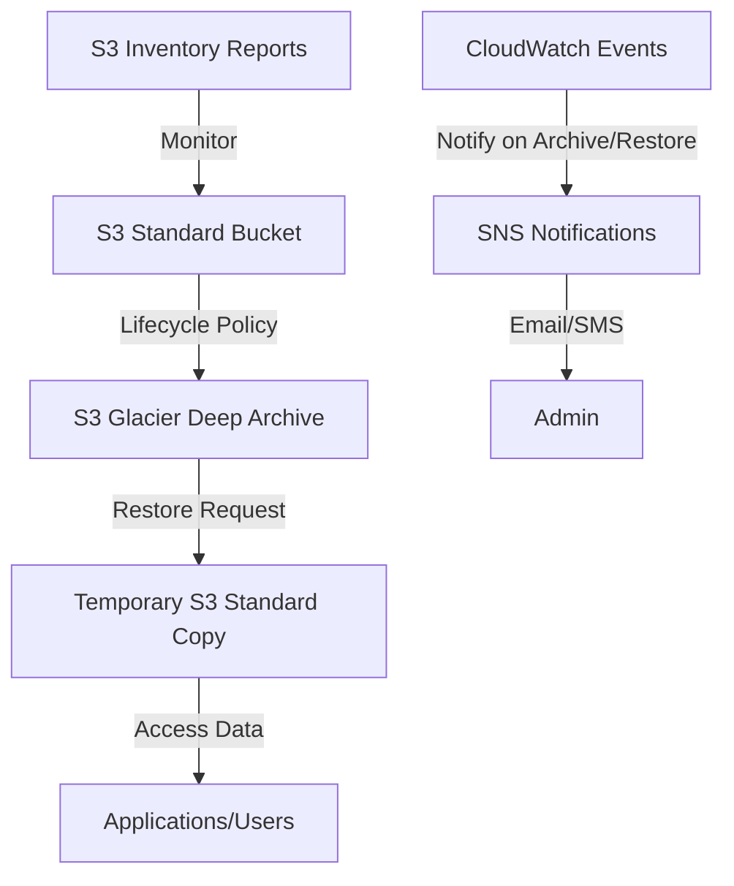

# S3 Glacier Deep Archive for Long-term Storage

## Problem

Your organization needs to retain data for extended periods (7+ years) to meet regulatory requirements while minimizing storage costs. You need a solution that safely archives historical data in a cost-effective manner while maintaining the ability to retrieve it when needed.

## Solution

Create a comprehensive long-term archiving strategy using Amazon S3 and S3 Glacier Deep Archive. Set up lifecycle policies to automatically transition data to the lowest-cost storage tier based on age, while maintaining the ability to retrieve data when necessary through a structured restoration process.

## Architecture Diagram



## Prerequisites

1. AWS account with appropriate permissions to create and manage S3 buckets
2. AWS CLI v2 installed and configured (or AWS CloudShell)
3. A dataset that requires long-term archiving
4. Understanding of S3 storage classes and lifecycle policies
5. Estimated cost: Less than $1 per TB stored (significantly less than standard S3)

## Preparation

```bash
# Set environment variables for consistent resource naming
export AWS_REGION=$(aws configure get region)
export AWS_ACCOUNT_ID=$(aws sts get-caller-identity \
    --query Account --output text)

# Generate unique identifier for resources
RANDOM_SUFFIX=$(aws secretsmanager get-random-password \
    --exclude-punctuation --exclude-uppercase \
    --password-length 6 --require-each-included-type \
    --output text --query RandomPassword)

echo "✅ Environment prepared for archiving setup"
```

## Steps

1. **Create S3 Bucket for Long-term Data Storage**:

   Amazon S3 serves as the foundation for your archiving strategy, providing 99.999999999% (11 9's) durability and seamless integration with Glacier Deep Archive. Creating a dedicated archival bucket establishes the primary repository that will automatically transition data to the most cost-effective storage tier based on your lifecycle policies.

   ```bash
   aws s3api create-bucket \
     --bucket long-term-archive-${RANDOM_SUFFIX} \
     --region ${AWS_REGION} \
     --create-bucket-configuration LocationConstraint=${AWS_REGION}
   
   BUCKET_NAME=long-term-archive-${RANDOM_SUFFIX}
   echo "✅ Created archival bucket: $BUCKET_NAME"
   ```

   The bucket is now ready to receive data and apply automated lifecycle transitions. This foundational step enables all subsequent archiving operations and provides the scalable storage foundation required for regulatory compliance and long-term data retention.

   > **Note**: S3 bucket names must be globally unique across all AWS accounts. The random suffix ensures you can create a bucket with a unique name while following AWS naming conventions.

2. **Configure Lifecycle Policies for Automated Archiving**:

   Lifecycle policies enable automated data management by transitioning objects between storage classes based on age, eliminating manual intervention and ensuring consistent cost optimization. This configuration implements a tiered approach where frequently accessed archive data transitions after 90 days, while general data transitions after 180 days.

   ```bash
   cat <<EOF > lifecycle-config.json
   {
     "Rules": [
       {
         "ID": "Move to Glacier Deep Archive after 90 days",
         "Status": "Enabled",
         "Filter": {
           "Prefix": "archives/"
         },
         "Transitions": [
           {
             "Days": 90,
             "StorageClass": "DEEP_ARCHIVE"
           }
         ]
       },
       {
         "ID": "Move all files to Glacier Deep Archive after 180 days",
         "Status": "Enabled",
         "Filter": {
           "Prefix": ""
         },
         "Transitions": [
           {
             "Days": 180,
             "StorageClass": "DEEP_ARCHIVE"
           }
         ]
       }
     ]
   }
   EOF
   
   echo "✅ Lifecycle configuration created"
   ```

   This configuration establishes a "set-and-forget" archiving strategy that automatically manages data transitions based on business rules, reducing storage costs by up to 75% compared to S3 Standard while maintaining data durability and availability for compliance requirements.

3. **Apply Lifecycle Configuration to Enable Automatic Transitions**:

   Applying the lifecycle configuration activates the automated data management policies that will continuously monitor object ages and transition them to the appropriate storage class. This automation ensures compliance with data retention policies while optimizing storage costs without manual intervention.

   ```bash
   aws s3api put-bucket-lifecycle-configuration \
     --bucket ${BUCKET_NAME} \
     --lifecycle-configuration file://lifecycle-config.json
   
   echo "✅ Lifecycle policies activated for automated archiving"
   ```

   The bucket now actively manages data transitions based on the configured rules, automatically moving objects to Glacier Deep Archive storage class when they reach the specified age thresholds.

4. **Set Up Notification System for Archive Events**:

   S3 event notifications integrated with SNS provide real-time visibility into archiving operations, enabling operational monitoring and audit trail creation. This notification system alerts administrators when objects transition to Deep Archive, supporting compliance documentation and operational awareness.

   ```bash
   # Create SNS topic for archive notifications
   aws sns create-topic --name s3-archive-notifications
   
   # Store the topic ARN for configuration
   TOPIC_ARN=$(aws sns create-topic --name s3-archive-notifications \
     --output text --query 'TopicArn')
   
   # Subscribe email for notifications
   aws sns subscribe \
     --topic-arn ${TOPIC_ARN} \
     --protocol email \
     --notification-endpoint your-email@example.com
   
   echo "✅ Notification system configured - check email to confirm subscription"
   ```

   The notification infrastructure is now established to provide operational visibility into archiving activities, enabling proactive monitoring and audit compliance for data lifecycle management.

5. **Configure Event Filtering for Targeted Notifications**:

   Event filtering ensures you receive notifications only for relevant archiving activities, reducing notification noise while maintaining visibility into critical data movements. This configuration focuses on PDF documents as an example of document-centric archiving common in compliance scenarios.

   ```bash
   cat <<EOF > notification-config.json
   {
     "TopicConfigurations": [
       {
         "TopicArn": "${TOPIC_ARN}",
         "Events": ["s3:LifecycleTransition"],
         "Filter": {
           "Key": {
             "FilterRules": [
               {
                 "Name": "suffix",
                 "Value": ".pdf"
               }
             ]
           }
         }
       }
     ]
   }
   EOF
   
   echo "✅ Event filtering configuration created"
   ```

   This filtering approach allows for granular monitoring of specific file types or data categories, enabling targeted operational responses and compliance tracking for different types of archived content.

6. **Activate Event Notifications for Archive Monitoring**:

   Applying the notification configuration establishes real-time monitoring of archiving events, providing operational visibility and audit capabilities essential for compliance and data governance. This integration enables proactive management of archived data and supports regulatory reporting requirements.

   ```bash
   aws s3api put-bucket-notification-configuration \
     --bucket ${BUCKET_NAME} \
     --notification-configuration file://notification-config.json
   
   echo "✅ Event notifications activated for archive monitoring"
   ```

   The notification system is now active and will alert administrators when PDF files transition to Deep Archive storage, enabling real-time tracking of compliance-critical data movements.

7. **Test Archive System with Sample Data**:

   Testing the archiving system with sample data validates the lifecycle policies and notification configurations while demonstrating the different transition timelines based on object location. This step verifies that the automated archiving workflow functions correctly before deploying with production data.

   ```bash
   # Create sample document for testing
   echo "This is a sample archived document" > sample-document.pdf
   
   # Upload to archives folder (90-day transition)
   aws s3 cp sample-document.pdf s3://${BUCKET_NAME}/archives/
   
   # Upload to root folder (180-day transition)
   aws s3 cp sample-document.pdf s3://${BUCKET_NAME}/
   
   echo "✅ Sample data uploaded - lifecycle policies will govern automatic archiving"
   ```

   The sample files are now subject to the configured lifecycle policies and will automatically transition to Deep Archive storage based on their location, demonstrating the tiered archiving approach for different data types.

8. **Enable S3 Inventory for Comprehensive Archive Tracking**:

   S3 Inventory provides detailed reports about object storage classes, sizes, and metadata without incurring retrieval costs, essential for compliance auditing and cost optimization. Weekly inventory reports enable proactive management of archived data and support regulatory documentation requirements.

   ```bash
   cat <<EOF > inventory-config.json
   {
     "Id": "Weekly-Inventory",
     "Destination": {
       "S3BucketDestination": {
         "Format": "CSV",
         "Bucket": "arn:aws:s3:::${BUCKET_NAME}",
         "Prefix": "inventory-reports"
       }
     },
     "IsEnabled": true,
     "IncludedObjectVersions": "Current",
     "Schedule": {
       "Frequency": "Weekly"
     },
     "OptionalFields": [
       "Size",
       "LastModifiedDate",
       "StorageClass",
       "ETag",
       "ReplicationStatus"
     ]
   }
   EOF
   
   aws s3api put-bucket-inventory-configuration \
     --bucket ${BUCKET_NAME} \
     --id "Weekly-Inventory" \
     --inventory-configuration file://inventory-config.json
   
   echo "✅ Weekly inventory reporting enabled for archive tracking"
   ```

   The inventory system will generate weekly reports detailing all objects, their storage classes, and metadata, providing comprehensive visibility into archived data without requiring costly retrieval operations.

## Validation & Testing

1. Verify your lifecycle configuration was applied successfully:

```bash
aws s3api get-bucket-lifecycle-configuration --bucket ${BUCKET_NAME}
```

2. Check that your notification configuration is active:

```bash
aws s3api get-bucket-notification-configuration --bucket ${BUCKET_NAME}
```

3. Test the restoration process for an object (note that in a real scenario, objects would need to be in Glacier Deep Archive, which takes time to transition):

```bash
# Simulate with a direct upload to Glacier Deep Archive
aws s3 cp sample-document.pdf \
  s3://${BUCKET_NAME}/immediate-archive/ \
  --storage-class DEEP_ARCHIVE

# Initiate a restore request (48-hour retrieval)
aws s3api restore-object \
  --bucket ${BUCKET_NAME} \
  --key immediate-archive/sample-document.pdf \
  --restore-request '{"Days":5,"GlacierJobParameters":{"Tier":"Bulk"}}'

# Check the restore status
aws s3api head-object \
  --bucket ${BUCKET_NAME} \
  --key immediate-archive/sample-document.pdf
```

> **Tip**: When initiating restore requests for production data, consider your retrieval time needs carefully. Standard retrieval takes 9-12 hours, while bulk retrieval takes up to 48 hours but is more cost-effective for large datasets. For urgent needs, plan your restoration process in advance.

## Cleanup

Remove the resources you created to avoid ongoing charges:

```bash
# Delete notification configuration
aws s3api put-bucket-notification-configuration \
  --bucket ${BUCKET_NAME} \
  --notification-configuration "{}"

# Delete SNS topic
aws sns delete-topic --topic-arn ${TOPIC_ARN}

# Empty the bucket (required before deletion)
aws s3 rm s3://${BUCKET_NAME} --recursive

# Delete the bucket
aws s3api delete-bucket --bucket ${BUCKET_NAME}
```

## Discussion

Amazon S3 Glacier Deep Archive is the lowest-cost storage class offered by AWS, designed specifically for long-term data retention where access is infrequent (less than once per year). At approximately 1/4 the cost of S3 Standard storage, it provides an excellent solution for regulatory compliance requirements that mandate data retention for extended periods.

When designing your archiving strategy, consider the trade-offs between accessibility and cost. S3 Glacier Deep Archive optimizes for cost at the expense of immediate access. Objects stored in this tier require a restore operation before they can be accessed, with retrieval times ranging from 9-48 hours depending on the chosen retrieval tier.

The lifecycle configuration approach allows you to automate the transition of objects between storage tiers based on age, creating a "set-and-forget" archiving solution. This is particularly valuable for organizations that generate regular reports, logs, or other time-series data that decreases in access frequency over time.

S3 Inventory provides a powerful mechanism to keep track of your archived objects without incurring retrieval costs. The weekly reports help you maintain an up-to-date catalog of archived data, which is important for both compliance and operational purposes.

> **Warning**: While S3 Glacier Deep Archive provides the lowest storage costs, be aware of potential retrieval costs. Retrieving large amounts of data can become expensive, especially using faster retrieval options. Plan your retrieval strategy carefully and consider batch operations for large restores.

Organizations should also consider implementing data classification policies to determine which data requires long-term archiving and which can be safely deleted. By only archiving truly necessary data, you can further optimize your storage costs while maintaining compliance.

## Challenge

1. Extend this solution by creating different archive paths with varying retention schedules based on data sensitivity or regulatory requirements. For example, implement a tiered approach where financial records transition to Deep Archive after 7 years, while general business records transition after 3 years.

2. Implement a Lambda function triggered by S3 events to automatically add metadata tags to objects when they're uploaded, such as "ArchiveDate" and "RetentionPeriod". Then modify your lifecycle rules to transition objects based on these tags rather than a fixed schedule.

## Infrastructure Code

*Infrastructure code will be generated after recipe approval.*