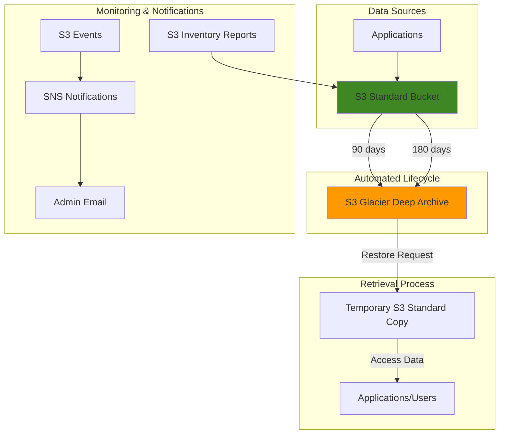

# S3 Glacier Deep Archive for Long-term Storage

## Problem

Your organization needs to retain data for extended periods (7+ years) to meet regulatory requirements while minimizing storage costs. Traditional storage solutions are expensive for infrequently accessed data, and manual data management creates operational overhead and compliance risks.

## Solution

Create a comprehensive long-term archiving strategy using Amazon S3 and S3 Glacier Deep Archive. Set up lifecycle policies to automatically transition data to the lowest-cost storage tier based on age, while maintaining the ability to retrieve data when necessary through a structured restoration process.

## Architecture Diagram



## Prerequisites

1. AWS account with permissions for S3, SNS, and IAM operations
2. AWS CLI v2 installed and configured (or AWS CloudShell)
3. Understanding of S3 storage classes and lifecycle policies
4. Email address for archive notifications
5. Estimated cost: $0.00099 per GB/month for Deep Archive storage (75% less than S3 Standard)

> **Note**: S3 Glacier Deep Archive provides 99.999999999% (11 9's) durability at the lowest cost storage class. Objects require 12+ hours minimum storage duration and retrieval times of 9-48 hours.

## Preparation

```bash
# Set environment variables for consistent resource naming
export AWS_REGION=$(aws configure get region)
export AWS_ACCOUNT_ID=$(aws sts get-caller-identity \
    --query Account --output text)

# Generate unique identifier for resources
RANDOM_SUFFIX=$(aws secretsmanager get-random-password \
    --exclude-punctuation --exclude-uppercase \
    --password-length 6 --require-each-included-type \
    --output text --query RandomPassword)

echo "✅ Environment prepared for archiving setup"
echo "Region: $AWS_REGION"
echo "Account: $AWS_ACCOUNT_ID"
```

## Steps

1. **Create S3 Bucket for Long-term Data Storage**:

   Amazon S3 serves as the foundation for your archiving strategy, providing 99.999999999% (11 9's) durability and seamless integration with Glacier Deep Archive. Creating a dedicated archival bucket establishes the primary repository that will automatically transition data to the most cost-effective storage tier based on your lifecycle policies.

   ```bash
   # Create bucket with region-specific configuration
   if [ "$AWS_REGION" = "us-east-1" ]; then
     aws s3api create-bucket --bucket long-term-archive-${RANDOM_SUFFIX}
   else
     aws s3api create-bucket \
       --bucket long-term-archive-${RANDOM_SUFFIX} \
       --region ${AWS_REGION} \
       --create-bucket-configuration LocationConstraint=${AWS_REGION}
   fi
   
   BUCKET_NAME=long-term-archive-${RANDOM_SUFFIX}
   echo "✅ Created archival bucket: $BUCKET_NAME"
   ```

   The bucket is now ready to receive data and apply automated lifecycle transitions. This foundational step enables all subsequent archiving operations and provides the scalable storage foundation required for regulatory compliance and long-term data retention.

2. **Enable Versioning and Default Encryption for Data Protection**:

   Versioning and encryption provide additional data protection layers essential for compliance and regulatory requirements. Versioning protects against accidental deletions while AES-256 encryption ensures data security at rest.

   ```bash
   # Enable versioning for data protection
   aws s3api put-bucket-versioning \
     --bucket ${BUCKET_NAME} \
     --versioning-configuration Status=Enabled
   
   # Enable default encryption
   aws s3api put-bucket-encryption \
     --bucket ${BUCKET_NAME} \
     --server-side-encryption-configuration \
     'Rules=[{ApplyServerSideEncryptionByDefault:{SSEAlgorithm:AES256}}]'
   
   echo "✅ Enabled versioning and encryption for data protection"
   ```

   The bucket now provides enterprise-grade data protection with automatic versioning and encryption, ensuring compliance with security standards and protecting against both accidental and malicious data loss.

3. **Configure Lifecycle Policies for Automated Archiving**:

   Lifecycle policies enable automated data management by transitioning objects between storage classes based on age, eliminating manual intervention and ensuring consistent cost optimization. This configuration implements a tiered approach where frequently accessed archive data transitions after 90 days, while general data transitions after 180 days.

   ```bash
   cat <<EOF > lifecycle-config.json
   {
     "Rules": [
       {
         "ID": "Priority-Archive-90-Days",
         "Status": "Enabled",
         "Filter": {
           "Prefix": "archives/"
         },
         "Transitions": [
           {
             "Days": 90,
             "StorageClass": "DEEP_ARCHIVE"
           }
         ]
       },
       {
         "ID": "General-Archive-180-Days",
         "Status": "Enabled",
         "Filter": {
           "Prefix": ""
         },
         "Transitions": [
           {
             "Days": 180,
             "StorageClass": "DEEP_ARCHIVE"
           }
         ]
       }
     ]
   }
   EOF
   
   echo "✅ Lifecycle configuration created"
   ```

   This configuration establishes a "set-and-forget" archiving strategy that automatically manages data transitions based on business rules, reducing storage costs by up to 75% compared to S3 Standard while maintaining data durability and availability for compliance requirements.

4. **Apply Lifecycle Configuration to Enable Automatic Transitions**:

   Applying the lifecycle configuration activates the automated data management policies that will continuously monitor object ages and transition them to the appropriate storage class. This automation ensures compliance with data retention policies while optimizing storage costs without manual intervention.

   ```bash
   aws s3api put-bucket-lifecycle-configuration \
     --bucket ${BUCKET_NAME} \
     --lifecycle-configuration file://lifecycle-config.json
   
   echo "✅ Lifecycle policies activated for automated archiving"
   ```

   The bucket now actively manages data transitions based on the configured rules, automatically moving objects to Glacier Deep Archive storage class when they reach the specified age thresholds.

5. **Create SNS Topic and Configure Permissions for S3 Events**:

   SNS provides the notification infrastructure for archive event monitoring. Proper IAM permissions are essential to allow S3 to publish events to the SNS topic, enabling real-time visibility into archiving operations.

   ```bash
   # Create SNS topic for archive notifications
   TOPIC_ARN=$(aws sns create-topic --name s3-archive-notifications-${RANDOM_SUFFIX} \
     --output text --query 'TopicArn')
   
   # Create SNS topic policy to allow S3 to publish events
   cat <<EOF > sns-policy.json
   {
     "Version": "2012-10-17",
     "Statement": [
       {
         "Effect": "Allow",
         "Principal": {
           "Service": "s3.amazonaws.com"
         },
         "Action": "SNS:Publish",
         "Resource": "${TOPIC_ARN}",
         "Condition": {
           "StringEquals": {
             "aws:SourceAccount": "${AWS_ACCOUNT_ID}"
           },
           "ArnEquals": {
             "aws:SourceArn": "arn:aws:s3:::${BUCKET_NAME}"
           }
         }
       }
     ]
   }
   EOF
   
   # Apply the policy to the SNS topic
   aws sns set-topic-attributes \
     --topic-arn ${TOPIC_ARN} \
     --attribute-name Policy \
     --attribute-value file://sns-policy.json
   
   echo "✅ SNS topic created with S3 permissions: $TOPIC_ARN"
   ```

   The SNS topic is now configured with proper permissions to receive events from S3, enabling secure and reliable notification delivery for archive operations.

6. **Subscribe to Email Notifications for Archive Events**:

   Email subscription provides operational visibility into archiving activities, enabling proactive monitoring and audit compliance for data lifecycle management. This notification system alerts administrators when objects transition to Deep Archive, supporting compliance documentation and operational awareness.

   ```bash
   # Subscribe email for notifications (replace with your email)
   echo "Enter your email address for archive notifications:"
   read EMAIL_ADDRESS
   
   aws sns subscribe \
     --topic-arn ${TOPIC_ARN} \
     --protocol email \
     --notification-endpoint ${EMAIL_ADDRESS}
   
   echo "✅ Email subscription created - check ${EMAIL_ADDRESS} to confirm subscription"
   ```

   The notification infrastructure is now established to provide operational visibility into archiving activities, enabling proactive monitoring and audit compliance for data lifecycle management.

7. **Configure S3 Event Notifications for Lifecycle Transitions**:

   Event filtering ensures you receive notifications only for relevant archiving activities, reducing notification noise while maintaining visibility into critical data movements. This configuration monitors all lifecycle transitions to Deep Archive storage.

   ```bash
   cat <<EOF > notification-config.json
   {
     "TopicConfigurations": [
       {
         "TopicArn": "${TOPIC_ARN}",
         "Events": ["s3:LifecycleTransition"],
         "Filter": {
           "Key": {
             "FilterRules": []
           }
         }
       }
     ]
   }
   EOF
   
   # Apply notification configuration
   aws s3api put-bucket-notification-configuration \
     --bucket ${BUCKET_NAME} \
     --notification-configuration file://notification-config.json
   
   echo "✅ Event notifications activated for archive monitoring"
   ```

   The notification system is now active and will alert administrators when objects transition to Deep Archive storage, enabling real-time tracking of compliance-critical data movements.

8. **Test Archive System with Sample Data**:

   Testing the archiving system with sample data validates the lifecycle policies and notification configurations while demonstrating the different transition timelines based on object location. This step verifies that the automated archiving workflow functions correctly before deploying with production data.

   ```bash
   # Create sample documents for testing
   echo "Sample archived document - Priority" > priority-doc.pdf
   echo "Sample archived document - General" > general-doc.pdf
   
   # Upload to archives folder (90-day transition)
   aws s3 cp priority-doc.pdf s3://${BUCKET_NAME}/archives/
   
   # Upload to root folder (180-day transition)
   aws s3 cp general-doc.pdf s3://${BUCKET_NAME}/
   
   # Verify uploads
   aws s3 ls s3://${BUCKET_NAME}/ --recursive
   
   echo "✅ Sample data uploaded - lifecycle policies will govern automatic archiving"
   ```

   The sample files are now subject to the configured lifecycle policies and will automatically transition to Deep Archive storage based on their location, demonstrating the tiered archiving approach for different data types.

9. **Enable S3 Inventory for Comprehensive Archive Tracking**:

   S3 Inventory provides detailed reports about object storage classes, sizes, and metadata without incurring retrieval costs, essential for compliance auditing and cost optimization. Weekly inventory reports enable proactive management of archived data and support regulatory documentation requirements.

   ```bash
   cat <<EOF > inventory-config.json
   {
     "Id": "Weekly-Inventory",
     "Destination": {
       "S3BucketDestination": {
         "Format": "CSV",
         "Bucket": "arn:aws:s3:::${BUCKET_NAME}",
         "Prefix": "inventory-reports/"
       }
     },
     "IsEnabled": true,
     "IncludedObjectVersions": "Current",
     "Schedule": {
       "Frequency": "Weekly"
     },
     "OptionalFields": [
       "Size",
       "LastModifiedDate",
       "StorageClass",
       "ETag",
       "ReplicationStatus"
     ]
   }
   EOF
   
   aws s3api put-bucket-inventory-configuration \
     --bucket ${BUCKET_NAME} \
     --id "Weekly-Inventory" \
     --inventory-configuration file://inventory-config.json
   
   echo "✅ Weekly inventory reporting enabled for archive tracking"
   ```

   The inventory system will generate weekly reports detailing all objects, their storage classes, and metadata, providing comprehensive visibility into archived data without requiring costly retrieval operations.

## Validation & Testing

1. Verify your lifecycle configuration was applied successfully:

   ```bash
   aws s3api get-bucket-lifecycle-configuration \
     --bucket ${BUCKET_NAME}
   ```

   Expected output: JSON showing your configured lifecycle rules with transition settings.

2. Check that your notification configuration is active:

   ```bash
   aws s3api get-bucket-notification-configuration \
     --bucket ${BUCKET_NAME}
   ```

   Expected output: JSON showing your SNS topic configuration for lifecycle events.

3. Verify bucket versioning and encryption are enabled:

   ```bash
   # Check versioning status
   aws s3api get-bucket-versioning --bucket ${BUCKET_NAME}
   
   # Check encryption configuration
   aws s3api get-bucket-encryption --bucket ${BUCKET_NAME}
   ```

   Expected output: Versioning status "Enabled" and AES256 encryption configuration.

4. Test the restoration process for an object in Deep Archive:

   ```bash
   # Upload a file directly to Deep Archive for testing
   aws s3 cp general-doc.pdf \
     s3://${BUCKET_NAME}/test-restore/ \
     --storage-class DEEP_ARCHIVE
   
   # Initiate a restore request (bulk retrieval - up to 48 hours)
   aws s3api restore-object \
     --bucket ${BUCKET_NAME} \
     --key test-restore/general-doc.pdf \
     --restore-request '{"Days":5,"GlacierJobParameters":{"Tier":"Bulk"}}'
   
   # Check the restore status
   aws s3api head-object \
     --bucket ${BUCKET_NAME} \
     --key test-restore/general-doc.pdf
   
   echo "✅ Restore request initiated - check restore status periodically"
   ```

> **Tip**: Standard retrieval takes 9-12 hours, while bulk retrieval takes up to 48 hours but costs significantly less. For production systems, plan restoration times according to your business recovery requirements.

## Cleanup

Remove the resources you created to avoid ongoing charges:

```bash
# Delete notification configuration
aws s3api put-bucket-notification-configuration \
  --bucket ${BUCKET_NAME} \
  --notification-configuration "{}"

# Delete SNS subscriptions and topic
aws sns list-subscriptions-by-topic --topic-arn ${TOPIC_ARN} \
  --query 'Subscriptions[].SubscriptionArn' --output text | \
  xargs -I {} aws sns unsubscribe --subscription-arn {}

aws sns delete-topic --topic-arn ${TOPIC_ARN}

# Remove inventory configuration
aws s3api delete-bucket-inventory-configuration \
  --bucket ${BUCKET_NAME} \
  --id "Weekly-Inventory"

# Empty the bucket (including all versions)
aws s3api list-object-versions --bucket ${BUCKET_NAME} \
  --output json --query 'Versions[].{Key:Key,VersionId:VersionId}' | \
  jq -r '.[] | "\(.Key) \(.VersionId)"' | \
  while read key version; do
    aws s3api delete-object --bucket ${BUCKET_NAME} --key "$key" --version-id "$version"
  done

# Delete any delete markers
aws s3api list-object-versions --bucket ${BUCKET_NAME} \
  --output json --query 'DeleteMarkers[].{Key:Key,VersionId:VersionId}' | \
  jq -r '.[] | "\(.Key) \(.VersionId)"' | \
  while read key version; do
    aws s3api delete-object --bucket ${BUCKET_NAME} --key "$key" --version-id "$version"
  done

# Delete the bucket
aws s3api delete-bucket --bucket ${BUCKET_NAME}

# Clean up temporary files
rm -f lifecycle-config.json notification-config.json inventory-config.json sns-policy.json
rm -f priority-doc.pdf general-doc.pdf

echo "✅ All resources cleaned up successfully"
```

## Discussion

Amazon S3 Glacier Deep Archive represents the most cost-effective storage solution in AWS, priced at approximately $0.00099 per GB per month—roughly 75% less than S3 Standard storage. This storage class is specifically designed for long-term data retention scenarios where access frequency is extremely low (less than once per year), making it ideal for regulatory compliance, backup archival, and disaster recovery use cases.

The architecture follows the AWS Well-Architected Framework principles by implementing automated lifecycle management, comprehensive monitoring, and cost optimization strategies. The dual-tier lifecycle approach allows organizations to optimize costs further by applying different retention policies based on data criticality and access patterns.

S3 Inventory reporting provides crucial operational visibility without incurring retrieval costs, enabling organizations to maintain compliance documentation and cost tracking. This is particularly important for industries with strict regulatory requirements like healthcare (HIPAA), financial services (SOX), and government sectors that mandate long-term data retention.

When designing your archiving strategy, consider the 180-day minimum storage duration for Deep Archive objects. Early deletion incurs prorated charges for the remaining days. Additionally, while storage costs are minimal, retrieval operations can become expensive at scale, particularly for expedited retrievals. Organizations should implement proper data classification and retention policies to ensure only necessary data is archived.

> **Warning**: S3 Glacier Deep Archive has a minimum 180-day storage commitment. Objects deleted before this period incur prorated charges. Plan your data lifecycle carefully and consider using S3 Intelligent-Tiering for data with unpredictable access patterns.

For comprehensive documentation on S3 lifecycle policies and best practices, see the [AWS S3 User Guide](https://docs.aws.amazon.com/AmazonS3/latest/userguide/object-lifecycle-mgmt.html) and [AWS Well-Architected Framework](https://docs.aws.amazon.com/wellarchitected/latest/framework/welcome.html).

## Challenge

Extend this solution by implementing these enhancements:

1. **Multi-Tier Archive Strategy**: Create a comprehensive lifecycle policy that transitions data through multiple storage classes (S3 Standard → S3 Standard-IA → S3 Glacier Flexible Retrieval → S3 Glacier Deep Archive) based on data classification tags and business requirements.

2. **Automated Metadata Tagging**: Implement a Lambda function triggered by S3 PutObject events that automatically applies metadata tags based on object properties, then modify lifecycle rules to use tag-based filtering instead of prefix-based filtering.

3. **Cross-Region Replication for DR**: Configure Cross-Region Replication to replicate archived data to a secondary region for disaster recovery, implementing different lifecycle policies for primary and replica buckets to optimize costs while maintaining compliance.

4. **Restore Automation with Step Functions**: Build an AWS Step Functions workflow that automates the restoration process, including cost estimation, approval workflows, and automatic cleanup of restored objects after a specified access period.

5. **Compliance Reporting Dashboard**: Create a CloudWatch dashboard that tracks archiving metrics, costs, and compliance status using S3 Inventory reports and CloudWatch Logs, providing executive visibility into data retention and costs.

## Infrastructure Code

*Infrastructure code will be generated after recipe approval.*