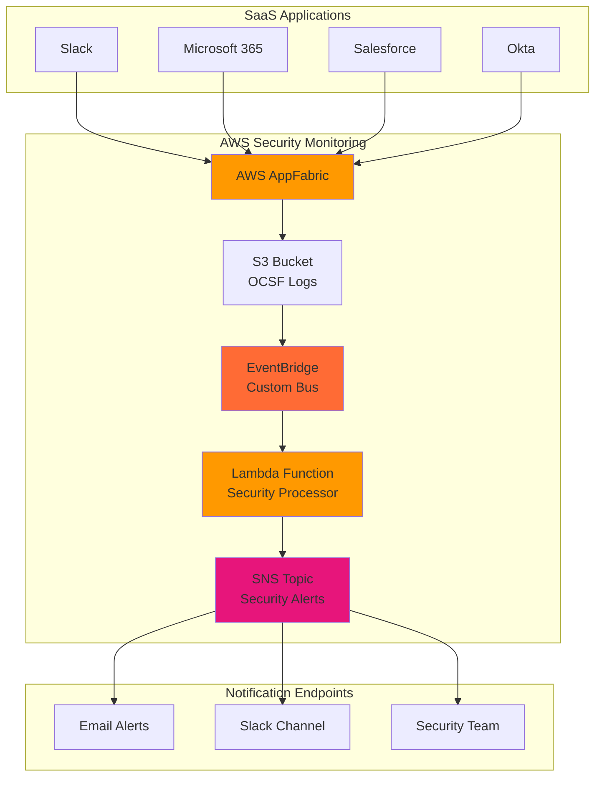

# SaaS Security Monitoring with AppFabric

## Problem

Organizations using multiple SaaS applications struggle to maintain security visibility across their diverse software ecosystem, leading to delayed threat detection and fragmented security monitoring. Security teams lack a unified view of user activities, authentication events, and potential security incidents across applications like Slack, Microsoft 365, Salesforce, and other SaaS platforms. This security blind spot creates significant risk exposure and compliance challenges for enterprise environments.

## Solution

AWS AppFabric provides standardized connectivity to SaaS applications, normalizing security logs into the Open Cybersecurity Schema Framework (OCSF) format for centralized analysis. By integrating AppFabric with EventBridge, Lambda, and SNS, we create an intelligent security monitoring system that automatically processes security events, applies threat detection logic, and delivers contextual alerts to security teams. This serverless architecture enables real-time security monitoring across your entire SaaS ecosystem with automated response capabilities.

## Architecture Diagram



## Prerequisites

1. AWS account with permissions for AppFabric, EventBridge, Lambda, SNS, S3, and IAM
2. AWS CLI v2 installed and configured (or use AWS CloudShell)
3. Access to at least one supported SaaS application (Slack, Microsoft 365, Salesforce, etc.)
4. Basic understanding of event-driven architectures and security monitoring concepts
5. Estimated cost: $20-50/month depending on log volume and alert frequency

> **Note**: AWS AppFabric is available in US East (N. Virginia), Europe (Ireland), and Asia Pacific (Tokyo) regions. Ensure your deployment region supports AppFabric.

## Preparation

```bash
# Set environment variables
export AWS_REGION=$(aws configure get region)
export AWS_ACCOUNT_ID=$(aws sts get-caller-identity \
    --query Account --output text)

# Generate unique identifiers for resources
RANDOM_SUFFIX=$(aws secretsmanager get-random-password \
    --exclude-punctuation --exclude-uppercase \
    --password-length 6 --require-each-included-type \
    --output text --query RandomPassword)

# Set resource names
export APPFABRIC_APP_BUNDLE="saas-security-bundle-${RANDOM_SUFFIX}"
export S3_BUCKET="security-logs-${AWS_ACCOUNT_ID}-${RANDOM_SUFFIX}"
export EVENTBRIDGE_BUS="security-monitoring-bus-${RANDOM_SUFFIX}"
export LAMBDA_FUNCTION="security-processor-${RANDOM_SUFFIX}"
export SNS_TOPIC="security-alerts-${RANDOM_SUFFIX}"

# Create S3 bucket for AppFabric logs
aws s3 mb s3://${S3_BUCKET} --region ${AWS_REGION}

# Enable S3 bucket versioning and encryption
aws s3api put-bucket-versioning \
    --bucket ${S3_BUCKET} \
    --versioning-configuration Status=Enabled

aws s3api put-bucket-encryption \
    --bucket ${S3_BUCKET} \
    --server-side-encryption-configuration \
    'Rules=[{ApplyServerSideEncryptionByDefault:{SSEAlgorithm:AES256}}]'

echo "✅ AWS environment configured with secure S3 bucket"
```

## Steps

1. **Create IAM Roles for Service Integration**:

   AWS AppFabric and Lambda require specific IAM permissions to access S3, EventBridge, and SNS services. These roles implement least-privilege access principles while enabling secure service-to-service communication. The AppFabric service role allows writing normalized security logs to S3, while the Lambda execution role enables processing events and publishing alerts.

   ```bash
   # Create AppFabric service role
   cat > appfabric-role-policy.json << EOF
   {
     "Version": "2012-10-17",
     "Statement": [
       {
         "Effect": "Allow",
         "Principal": {
           "Service": "appfabric.amazonaws.com"
         },
         "Action": "sts:AssumeRole"
       }
     ]
   }
   EOF
   
   aws iam create-role \
       --role-name AppFabricServiceRole-${RANDOM_SUFFIX} \
       --assume-role-policy-document file://appfabric-role-policy.json
   
   # Attach S3 permissions to AppFabric role
   cat > appfabric-s3-policy.json << EOF
   {
     "Version": "2012-10-17",
     "Statement": [
       {
         "Effect": "Allow",
         "Action": [
           "s3:PutObject",
           "s3:PutObjectAcl",
           "s3:GetBucketLocation"
         ],
         "Resource": [
           "arn:aws:s3:::${S3_BUCKET}",
           "arn:aws:s3:::${S3_BUCKET}/*"
         ]
       }
     ]
   }
   EOF
   
   aws iam put-role-policy \
       --role-name AppFabricServiceRole-${RANDOM_SUFFIX} \
       --policy-name S3AccessPolicy \
       --policy-document file://appfabric-s3-policy.json
   
   export APPFABRIC_ROLE_ARN=$(aws iam get-role \
       --role-name AppFabricServiceRole-${RANDOM_SUFFIX} \
       --query 'Role.Arn' --output text)
   
   echo "✅ AppFabric IAM role created with S3 access permissions"
   ```

   These IAM roles establish the security foundation for our monitoring system, ensuring services can interact securely while maintaining compliance with AWS security best practices.

2. **Create Custom EventBridge Bus for Security Events**:

   EventBridge custom event buses provide isolated event routing for security-specific events, enabling better organization and access control compared to the default event bus. This separation ensures security events are processed independently from other application events, improving monitoring clarity and reducing noise.

   ```bash
   # Create custom EventBridge bus for security events
   aws events create-event-bus \
       --name ${EVENTBRIDGE_BUS} \
       --tags Key=Purpose,Value=SecurityMonitoring \
              Key=Environment,Value=Production
   
   # Create S3 event notification configuration
   cat > s3-event-config.json << EOF
   {
     "CloudWatchConfiguration": {
       "IsEnabled": true
     },
     "EventBridgeConfiguration": {
       "IsEnabled": true
     }
   }
   EOF
   
   aws s3api put-bucket-notification-configuration \
       --bucket ${S3_BUCKET} \
       --notification-configuration file://s3-event-config.json
   
   echo "✅ Custom EventBridge bus created for security event routing"
   ```

   The custom event bus now provides dedicated routing for security events, enabling targeted processing and alerting based on security-specific event patterns and criteria.

3. **Deploy Lambda Function for Security Event Processing**:

   Lambda provides serverless compute for processing security events with automatic scaling based on event volume. This function analyzes OCSF-normalized security logs from AppFabric, applies threat detection logic, and generates contextual alerts. The serverless approach ensures cost-effective processing while maintaining high availability and automatic scaling.

   ```bash
   # Create Lambda function code
   mkdir -p lambda-security-processor
   cat > lambda-security-processor/index.py << 'EOF'
   import json
   import boto3
   import logging
   import os
   import re
   from datetime import datetime
   
   logger = logging.getLogger()
   logger.setLevel(logging.INFO)
   
   sns = boto3.client('sns')
   s3 = boto3.client('s3')
   
   def lambda_handler(event, context):
       """Process security events from AppFabric and generate alerts"""
       
       try:
           # Parse S3 event from EventBridge
           for record in event.get('Records', []):
               if record.get('eventSource') == 'aws:s3':
                   process_s3_security_log(record)
           
           # Process direct EventBridge events
           if 'source' in event and event['source'] == 'aws.s3':
               process_eventbridge_s3_event(event)
               
           return {
               'statusCode': 200,
               'body': json.dumps('Security events processed successfully')
           }
           
       except Exception as e:
           logger.error(f"Error processing security event: {str(e)}")
           raise
   
   def process_s3_security_log(s3_record):
       """Process security logs uploaded to S3 by AppFabric"""
       
       bucket = s3_record['s3']['bucket']['name']
       key = s3_record['s3']['object']['key']
       
       logger.info(f"Processing security log: s3://{bucket}/{key}")
       
       try:
           # Read and analyze the security log content
           response = s3.get_object(Bucket=bucket, Key=key)
           log_content = response['Body'].read().decode('utf-8')
           
           # Parse OCSF security events
           security_events = parse_ocsf_logs(log_content)
           
           for event in security_events:
               analyze_security_event(event, key)
               
       except Exception as e:
           logger.error(f"Error processing S3 log {key}: {str(e)}")
   
   def process_eventbridge_s3_event(event):
       """Process S3 events from EventBridge"""
       
       detail = event.get('detail', {})
       bucket = detail.get('bucket', {}).get('name')
       key = detail.get('object', {}).get('key')
       
       if bucket and key:
           logger.info(f"Processing EventBridge S3 event: s3://{bucket}/{key}")
           
           # Extract application name from S3 key path
           app_name = extract_app_name(key)
           
           # Generate alert for new security log
           alert_message = {
               'alert_type': 'NEW_SECURITY_LOG',
               'application': app_name,
               'timestamp': datetime.utcnow().isoformat(),
               's3_location': f"s3://{bucket}/{key}",
               'severity': 'INFO'
           }
           
           send_security_alert(alert_message)
   
   def parse_ocsf_logs(log_content):
       """Parse OCSF-formatted security logs"""
       
       events = []
       try:
           # Handle both single events and newline-delimited JSON
           for line in log_content.strip().split('\n'):
               if line.strip():
                   events.append(json.loads(line))
       except json.JSONDecodeError:
           logger.warning("Failed to parse OCSF log content as JSON")
           
       return events
   
   def analyze_security_event(event, s3_key):
       """Analyze OCSF security event for threats"""
       
       # Apply threat detection logic based on OCSF event patterns
       if is_suspicious_ocsf_activity(event):
           app_name = extract_app_name(s3_key)
           
           alert_message = {
               'alert_type': 'SUSPICIOUS_ACTIVITY',
               'application': app_name,
               'event_type': event.get('type_name', 'Unknown'),
               'user': event.get('actor', {}).get('user', {}).get('name', 'Unknown'),
               'timestamp': event.get('time', datetime.utcnow().isoformat()),
               'severity': determine_severity(event),
               'details': event
           }
           
           send_security_alert(alert_message)
   
   def is_suspicious_ocsf_activity(event):
       """Apply threat detection logic to OCSF events"""
       
       # Check for authentication failures
       if event.get('class_uid') == 3002:  # Authentication class
           if event.get('activity_id') == 2:  # Failed logon
               return True
       
       # Check for privilege escalation
       if event.get('class_uid') == 3005:  # Account Change class
           if 'privilege' in str(event.get('activity_name', '')).lower():
               return True
       
       # Check for unusual access patterns
       severity_id = event.get('severity_id', 0)
       if severity_id >= 4:  # Medium to Critical severity
           return True
       
       # Check for specific threat indicators in event text
       event_text = json.dumps(event).lower()
       suspicious_indicators = [
           'failed_login',
           'brute_force',
           'privilege_escalation',
           'data_exfiltration',
           'malware',
           'unauthorized_access'
       ]
       
       return any(indicator in event_text for indicator in suspicious_indicators)
   
   def determine_severity(event):
       """Determine alert severity based on OCSF event"""
       
       severity_id = event.get('severity_id', 1)
       severity_map = {
           1: 'INFO',
           2: 'LOW',
           3: 'MEDIUM',
           4: 'HIGH',
           5: 'CRITICAL'
       }
       
       return severity_map.get(severity_id, 'MEDIUM')
   
   def extract_app_name(s3_key):
       """Extract application name from S3 key path"""
       
       # AppFabric S3 key format: app-bundle-id/app-name/yyyy/mm/dd/file
       path_parts = s3_key.split('/')
       return path_parts[1] if len(path_parts) > 1 else 'unknown'
   
   def send_security_alert(alert_message):
       """Send security alert via SNS"""
       
       topic_arn = os.environ['SNS_TOPIC_ARN']
       
       message = {
           'default': json.dumps(alert_message, indent=2),
           'email': format_email_alert(alert_message),
           'sms': format_sms_alert(alert_message)
       }
       
       sns.publish(
           TopicArn=topic_arn,
           Message=json.dumps(message),
           MessageStructure='json',
           Subject=f"Security Alert: {alert_message['alert_type']}"
       )
       
       logger.info(f"Security alert sent: {alert_message['alert_type']}")
   
   def format_email_alert(alert):
       """Format security alert for email delivery"""
       
       return f"""
   Security Alert: {alert['alert_type']}
   
   Severity: {alert['severity']}
   Timestamp: {alert['timestamp']}
   Application: {alert.get('application', 'N/A')}
   User: {alert.get('user', 'N/A')}
   Event Type: {alert.get('event_type', 'N/A')}
   
   Details:
   {json.dumps(alert.get('details', {}), indent=2)}
   
   This is an automated security alert from your SaaS monitoring system.
   Review the security event details and take appropriate action if required.
   """
   
   def format_sms_alert(alert):
       """Format security alert for SMS delivery"""
       
       return f"SECURITY ALERT: {alert['alert_type']} - {alert['severity']} severity detected in {alert.get('application', 'Unknown')} at {alert['timestamp']}"
   EOF
   
   # Create deployment package
   cd lambda-security-processor
   zip -r ../security-processor.zip .
   cd ..
   
   # Create Lambda execution role
   cat > lambda-role-policy.json << EOF
   {
     "Version": "2012-10-17",
     "Statement": [
       {
         "Effect": "Allow",
         "Principal": {
           "Service": "lambda.amazonaws.com"
         },
         "Action": "sts:AssumeRole"
       }
     ]
   }
   EOF
   
   aws iam create-role \
       --role-name LambdaSecurityProcessorRole-${RANDOM_SUFFIX} \
       --assume-role-policy-document file://lambda-role-policy.json
   
   # Attach Lambda execution policy
   aws iam attach-role-policy \
       --role-name LambdaSecurityProcessorRole-${RANDOM_SUFFIX} \
       --policy-arn arn:aws:iam::aws:policy/service-role/AWSLambdaBasicExecutionRole
   
   export LAMBDA_ROLE_ARN=$(aws iam get-role \
       --role-name LambdaSecurityProcessorRole-${RANDOM_SUFFIX} \
       --query 'Role.Arn' --output text)
   
   echo "✅ Lambda function code prepared with OCSF security processing logic"
   ```

   The Lambda function is now configured with comprehensive OCSF security event processing capabilities, including threat detection logic based on Open Cybersecurity Schema Framework standards and multi-format alert generation for different communication channels.

4. **Create SNS Topic for Security Alerts**:

   SNS provides reliable, scalable notification delivery for security alerts with support for multiple endpoints including email, SMS, and webhook integrations. This multi-channel approach ensures security teams receive critical alerts through their preferred communication methods while maintaining delivery reliability and audit trails.

   ```bash
   # Create SNS topic for security alerts
   aws sns create-topic --name ${SNS_TOPIC}
   
   export SNS_TOPIC_ARN=$(aws sns get-topic-attributes \
       --topic-arn arn:aws:sns:${AWS_REGION}:${AWS_ACCOUNT_ID}:${SNS_TOPIC} \
       --query 'Attributes.TopicArn' --output text)
   
   # Add Lambda permissions to publish to SNS and read from S3
   cat > lambda-sns-policy.json << EOF
   {
     "Version": "2012-10-17",
     "Statement": [
       {
         "Effect": "Allow",
         "Action": [
           "sns:Publish"
         ],
         "Resource": "${SNS_TOPIC_ARN}"
       },
       {
         "Effect": "Allow",
         "Action": [
           "s3:GetObject"
         ],
         "Resource": "arn:aws:s3:::${S3_BUCKET}/*"
       }
     ]
   }
   EOF
   
   aws iam put-role-policy \
       --role-name LambdaSecurityProcessorRole-${RANDOM_SUFFIX} \
       --policy-name SNSPublishPolicy \
       --policy-document file://lambda-sns-policy.json
   
   # Subscribe to SNS topic (replace with your email)
   echo "Enter your email address for security alerts:"
   read EMAIL_ADDRESS
   
   aws sns subscribe \
       --topic-arn ${SNS_TOPIC_ARN} \
       --protocol email \
       --notification-endpoint ${EMAIL_ADDRESS}
   
   echo "✅ SNS topic created with email subscription (check email for confirmation)"
   ```

   The SNS topic is now configured for multi-channel alert delivery, providing reliable notification infrastructure that scales automatically with your security monitoring needs.

5. **Deploy Lambda Function with Environment Configuration**:

   Lambda deployment with proper environment variables enables the function to integrate seamlessly with SNS and other AWS services. Environment variables provide secure configuration management while enabling the function to adapt to different deployment environments without code changes.

   ```bash
   # Wait for IAM role propagation
   sleep 10
   
   # Create Lambda function with updated Python runtime
   aws lambda create-function \
       --function-name ${LAMBDA_FUNCTION} \
       --runtime python3.12 \
       --role ${LAMBDA_ROLE_ARN} \
       --handler index.lambda_handler \
       --zip-file fileb://security-processor.zip \
       --timeout 60 \
       --memory-size 256 \
       --environment Variables="{SNS_TOPIC_ARN=${SNS_TOPIC_ARN}}" \
       --tags Purpose=SecurityMonitoring,Environment=Production
   
   export LAMBDA_FUNCTION_ARN=$(aws lambda get-function \
       --function-name ${LAMBDA_FUNCTION} \
       --query 'Configuration.FunctionArn' --output text)
   
   echo "✅ Lambda function deployed with SNS integration"
   ```

   The Lambda function is now operational with proper IAM permissions and environment configuration, ready to process security events and generate intelligent alerts using the latest Python 3.12 runtime.

6. **Configure EventBridge Rules for Security Event Processing**:

   EventBridge rules enable automatic routing of S3 events to our Lambda function, creating a seamless event-driven security monitoring pipeline. These rules filter relevant security events and ensure proper processing without manual intervention, supporting real-time threat detection and response.

   ```bash
   # Create EventBridge rule for S3 security log events
   cat > eventbridge-rule-pattern.json << EOF
   {
     "source": ["aws.s3"],
     "detail-type": ["Object Created"],
     "detail": {
       "bucket": {
         "name": ["${S3_BUCKET}"]
       }
     }
   }
   EOF
   
   aws events put-rule \
       --name SecurityLogProcessingRule-${RANDOM_SUFFIX} \
       --event-pattern file://eventbridge-rule-pattern.json \
       --event-bus-name ${EVENTBRIDGE_BUS} \
       --description "Route S3 security logs to Lambda processor"
   
   # Add Lambda as target for the rule
   aws events put-targets \
       --rule SecurityLogProcessingRule-${RANDOM_SUFFIX} \
       --event-bus-name ${EVENTBRIDGE_BUS} \
       --targets "Id"="1","Arn"="${LAMBDA_FUNCTION_ARN}"
   
   # Grant EventBridge permission to invoke Lambda
   aws lambda add-permission \
       --function-name ${LAMBDA_FUNCTION} \
       --statement-id eventbridge-invoke-${RANDOM_SUFFIX} \
       --action lambda:InvokeFunction \
       --principal events.amazonaws.com \
       --source-arn arn:aws:events:${AWS_REGION}:${AWS_ACCOUNT_ID}:rule/${EVENTBRIDGE_BUS}/SecurityLogProcessingRule-${RANDOM_SUFFIX}
   
   echo "✅ EventBridge rules configured for automated security event processing"
   ```

   EventBridge is now configured to automatically trigger security event processing whenever new logs are written to S3, enabling real-time monitoring and alerting capabilities.

7. **Create AppFabric App Bundle and Application Connections**:

   AWS AppFabric App Bundles provide the foundation for connecting multiple SaaS applications with standardized security log collection. Each app bundle creates secure API connections to SaaS platforms and normalizes their security events into the OCSF format for consistent analysis across your entire SaaS ecosystem.

   ```bash
   # Create AppFabric app bundle
   aws appfabric create-app-bundle \
       --tags key=Purpose,value=SecurityMonitoring \
              key=Environment,value=Production
   
   export APP_BUNDLE_ARN=$(aws appfabric list-app-bundles \
       --query 'appBundles[0].arn' --output text)
   
   # Wait for app bundle to be active
   sleep 5
   
   echo "App Bundle ARN: ${APP_BUNDLE_ARN}"
   echo ""
   echo "To complete AppFabric setup, use the AWS Console to:"
   echo "1. Navigate to AWS AppFabric console"
   echo "2. Select your app bundle: ${APP_BUNDLE_ARN}"
   echo "3. Create ingestions for your SaaS applications"
   echo "4. Authorize AppFabric to access SaaS APIs"
   echo "5. Configure S3 destination: s3://${S3_BUCKET}/security-logs/"
   echo "6. Set destination role: ${APPFABRIC_ROLE_ARN}"
   echo ""
   
   echo "✅ AppFabric app bundle created (manual SaaS authorization required)"
   ```

   AppFabric is now configured to collect security logs from connected SaaS applications and deliver them to your S3 bucket in standardized OCSF format for automated processing.

8. **Test Security Monitoring Pipeline**:

   Testing validates the complete security monitoring pipeline by simulating security events and verifying end-to-end processing, alerting, and notification delivery. This verification ensures all components work together correctly and that security teams will receive timely alerts for real security incidents.

   ```bash
   # Create test OCSF security event file
   cat > test-security-event.json << EOF
   {
     "metadata": {
       "version": "1.0.0",
       "product": {
         "name": "Test SaaS Application",
         "vendor_name": "Test Vendor"
       }
     },
     "time": "$(date -u +%Y-%m-%dT%H:%M:%SZ)",
     "class_uid": 3002,
     "category_uid": 3,
     "severity_id": 4,
     "activity_id": 2,
     "type_name": "Authentication: Failed Logon",
     "actor": {
       "user": {
         "name": "test.user@example.com",
         "type": "User"
       }
     },
     "src_endpoint": {
       "ip": "192.168.1.100"
     },
     "status": "Failure",
     "status_id": 2
   }
   EOF
   
   # Upload test event to S3 to trigger processing
   aws s3 cp test-security-event.json \
       s3://${S3_BUCKET}/security-logs/test-app/$(date +%Y/%m/%d)/test-event-$(date +%s).json
   
   # Wait for processing
   echo "Waiting 30 seconds for event processing..."
   sleep 30
   
   # Check Lambda function logs
   LOG_GROUP_NAME="/aws/lambda/${LAMBDA_FUNCTION}"
   
   echo "✅ Test OCSF security event uploaded and processed"
   echo "Check your email for security alert notification"
   echo "Review CloudWatch logs: ${LOG_GROUP_NAME}"
   
   # Display recent log events
   aws logs filter-log-events \
       --log-group-name ${LOG_GROUP_NAME} \
       --start-time $(date -d '5 minutes ago' +%s)000 \
       --query 'events[].message' --output text
   ```

   The security monitoring pipeline is now validated and operational, with test OCSF events confirming proper processing, analysis, and alert delivery through the complete system.

## Validation & Testing

1. **Verify AppFabric App Bundle Status**:

   ```bash
   # Check AppFabric app bundle status
   aws appfabric get-app-bundle \
       --app-bundle-identifier ${APP_BUNDLE_ARN}
   ```

   Expected output: App bundle status should show "Active" with proper configuration details.

2. **Test EventBridge Rule Processing**:

   ```bash
   # Check EventBridge rule metrics
   aws cloudwatch get-metric-statistics \
       --namespace AWS/Events \
       --metric-name SuccessfulInvocations \
       --dimensions Name=RuleName,Value=SecurityLogProcessingRule-${RANDOM_SUFFIX} \
       --start-time $(date -d '1 hour ago' -u +%Y-%m-%dT%H:%M:%SZ) \
       --end-time $(date -u +%Y-%m-%dT%H:%M:%SZ) \
       --period 3600 \
       --statistics Sum
   ```

3. **Verify Lambda Function Execution**:

   ```bash
   # Check Lambda function recent executions
   aws lambda get-function \
       --function-name ${LAMBDA_FUNCTION}
   
   # Review function logs for security event processing
   aws logs filter-log-events \
       --log-group-name /aws/lambda/${LAMBDA_FUNCTION} \
       --start-time $(date -d '1 hour ago' +%s)000 \
       --filter-pattern "Processing security log"
   ```

4. **Test SNS Alert Delivery**:

   ```bash
   # Send test alert through SNS
   aws sns publish \
       --topic-arn ${SNS_TOPIC_ARN} \
       --message "Test security alert from centralized monitoring system" \
       --subject "Test Security Alert"
   ```

## Cleanup

1. **Remove AppFabric Resources**:

   ```bash
   # Delete AppFabric ingestion destinations and ingestions
   for ingestion_arn in $(aws appfabric list-ingestions \
       --app-bundle-identifier ${APP_BUNDLE_ARN} \
       --query 'ingestions[].arn' --output text 2>/dev/null); do
     aws appfabric delete-ingestion \
         --app-bundle-identifier ${APP_BUNDLE_ARN} \
         --ingestion-identifier ${ingestion_arn}
   done
   
   # Delete AppFabric app bundle
   aws appfabric delete-app-bundle \
       --app-bundle-identifier ${APP_BUNDLE_ARN}
   
   echo "✅ AppFabric resources deleted"
   ```

2. **Remove EventBridge Resources**:

   ```bash
   # Remove EventBridge rule targets
   aws events remove-targets \
       --rule SecurityLogProcessingRule-${RANDOM_SUFFIX} \
       --event-bus-name ${EVENTBRIDGE_BUS} \
       --ids "1"
   
   # Delete EventBridge rule
   aws events delete-rule \
       --name SecurityLogProcessingRule-${RANDOM_SUFFIX} \
       --event-bus-name ${EVENTBRIDGE_BUS}
   
   # Delete custom event bus
   aws events delete-event-bus \
       --name ${EVENTBRIDGE_BUS}
   
   echo "✅ EventBridge resources deleted"
   ```

3. **Remove Lambda Function and SNS Topic**:

   ```bash
   # Delete Lambda function
   aws lambda delete-function \
       --function-name ${LAMBDA_FUNCTION}
   
   # Delete SNS topic
   aws sns delete-topic \
       --topic-arn ${SNS_TOPIC_ARN}
   
   echo "✅ Lambda and SNS resources deleted"
   ```

4. **Remove S3 Bucket and IAM Roles**:

   ```bash
   # Empty and delete S3 bucket
   aws s3 rm s3://${S3_BUCKET} --recursive
   aws s3 rb s3://${S3_BUCKET}
   
   # Delete IAM roles
   aws iam delete-role-policy \
       --role-name AppFabricServiceRole-${RANDOM_SUFFIX} \
       --policy-name S3AccessPolicy
   
   aws iam delete-role \
       --role-name AppFabricServiceRole-${RANDOM_SUFFIX}
   
   aws iam delete-role-policy \
       --role-name LambdaSecurityProcessorRole-${RANDOM_SUFFIX} \
       --policy-name SNSPublishPolicy
   
   aws iam detach-role-policy \
       --role-name LambdaSecurityProcessorRole-${RANDOM_SUFFIX} \
       --policy-arn arn:aws:iam::aws:policy/service-role/AWSLambdaBasicExecutionRole
   
   aws iam delete-role \
       --role-name LambdaSecurityProcessorRole-${RANDOM_SUFFIX}
   
   # Clean up local files
   rm -rf lambda-security-processor security-processor.zip
   rm -f *.json test-security-event.json
   
   echo "✅ All resources cleaned up successfully"
   ```

## Discussion

AWS AppFabric represents a significant advancement in SaaS security monitoring by providing standardized connectivity to popular applications through the Open Cybersecurity Schema Framework (OCSF). This standardization eliminates the complexity of managing multiple API connections and data formats, enabling organizations to build unified security monitoring capabilities across their entire SaaS ecosystem. The service automatically handles authentication, data collection, and normalization, significantly reducing the operational overhead typically associated with multi-vendor security monitoring solutions. According to the [AWS AppFabric documentation](https://docs.aws.amazon.com/appfabric/latest/adminguide/what-is-appfabric.html), this approach provides consistent security visibility across over 250 supported SaaS applications while maintaining data sovereignty and compliance requirements.

EventBridge serves as the central nervous system for this security monitoring architecture, providing reliable event routing and filtering capabilities that scale automatically with your organization's needs. By implementing custom event buses for security events, we create logical separation that improves security posture while enabling fine-grained access control and monitoring. The integration between S3 event notifications and EventBridge creates a real-time processing pipeline that responds immediately to new security logs, ensuring minimal detection latency for potential threats. This follows the [AWS Well-Architected Framework](https://docs.aws.amazon.com/wellarchitected/latest/framework/welcome.html) principle of operational excellence through automated monitoring and response, while the custom bus architecture supports the security pillar through defense-in-depth strategies.

The serverless Lambda function provides intelligent security event processing with built-in threat detection logic that leverages the standardized OCSF format for consistent analysis across different SaaS applications. Lambda's automatic scaling ensures consistent performance regardless of event volume, while the pay-per-invocation model optimizes costs for variable workloads. The function's ability to parse and analyze OCSF-formatted events enables sophisticated threat detection patterns including authentication failures, privilege escalation attempts, and data exfiltration indicators. This architecture implements multiple Well-Architected Framework pillars: security through automated threat detection, reliability through fault-tolerant serverless design, and cost optimization through event-driven scaling.

This solution provides a foundation for advanced security capabilities including machine learning-based anomaly detection, automated incident response, and integration with existing SIEM platforms. The combination of standardized data ingestion, intelligent event processing, and multi-channel alerting creates a comprehensive security monitoring platform that scales with organizational growth while maintaining cost efficiency through serverless technologies and AWS managed services.

> **Tip**: Consider implementing [Amazon GuardDuty](https://docs.aws.amazon.com/guardduty/latest/ug/what-is-guardduty.html) integration for enhanced threat detection capabilities that complement your SaaS monitoring pipeline. GuardDuty's machine learning algorithms can identify sophisticated threats that rule-based detection might miss, while [AWS Security Hub](https://docs.aws.amazon.com/securityhub/latest/userguide/what-is-securityhub.html) can centralize findings from both AppFabric and GuardDuty for unified security visibility.

## Challenge

Extend this solution by implementing these enhancements:

1. **Machine Learning Threat Detection**: Integrate Amazon SageMaker to build custom threat detection models that learn from your organization's normal SaaS usage patterns and identify anomalous behavior with higher accuracy than rule-based systems. Use historical OCSF data to train models for user behavior analytics and anomaly detection.

2. **Automated Incident Response**: Implement AWS Step Functions to orchestrate automated response workflows that can temporarily disable user accounts, revoke API tokens, or trigger additional security investigations based on alert severity and type. Include integration with AWS Systems Manager for automated remediation actions.

3. **Cross-Platform User Behavior Analytics**: Enhance the Lambda function to correlate user activities across multiple SaaS applications using Amazon DynamoDB to maintain user behavior profiles, enabling detection of sophisticated attack patterns like account takeover or insider threats across your entire SaaS ecosystem.

4. **Advanced Compliance Reporting**: Create automated compliance reports using Amazon QuickSight that aggregate security events across all connected SaaS applications, providing executive dashboards and regulatory compliance evidence with customizable time ranges and filters for frameworks like SOC 2, PCI DSS, and GDPR.

5. **Real-time Security Dashboard**: Build a real-time security operations center dashboard using Amazon Managed Grafana that visualizes security events, threat trends, and system health metrics, enabling security teams to monitor the entire SaaS ecosystem from a single interface with customizable alerts and automated response capabilities.

## Infrastructure Code

### Available Infrastructure as Code:

- [Infrastructure Code Overview](code/README.md) - Detailed description of all infrastructure components
- [AWS CDK (Python)](code/cdk-python/) - AWS CDK Python implementation
- [AWS CDK (TypeScript)](code/cdk-typescript/) - AWS CDK TypeScript implementation
- [CloudFormation](code/cloudformation.yaml) - AWS CloudFormation template
- [Bash CLI Scripts](code/scripts/) - Example bash scripts using AWS CLI commands to deploy infrastructure
- [Terraform](code/terraform/) - Terraform configuration files