# SageMaker AutoML for Time Series Forecasting

## Problem

An e-commerce company struggles with demand forecasting across 500+ products in multiple markets, leading to $3M annual losses from stockouts and $12M in excess inventory costs. Traditional forecasting methods fail to capture complex seasonal patterns, promotional effects, and cross-product dependencies. The company needs an automated machine learning solution that can handle large-scale time series forecasting with minimal manual intervention while providing accurate predictions and confidence intervals for inventory optimization and capacity planning.

## Solution

Build a comprehensive forecasting solution using Amazon SageMaker AutoML for time series forecasting, which automatically selects and trains the best algorithms from statistical methods to neural networks. This approach replaces the deprecated Amazon Forecast service with modern AutoML capabilities that provide superior performance, faster training times, and better cost efficiency while maintaining the same ease of use for business analysts and data scientists.

## Architecture Diagram

```mermaid
graph TB
    subgraph "Data Sources"
        SALES[Historical Sales Data]
        PROMO[Promotional Data]
        HOLIDAYS[Holiday Calendar]
        WEATHER[Weather Data]
    end
    
    subgraph "Data Processing"
        S3[S3 Data Lake]
        GLUE[AWS Glue ETL]
        ATHENA[Amazon Athena]
    end
    
    subgraph "Machine Learning"
        AUTOML[SageMaker AutoML]
        ENSEMBLE[Ensemble Models]
        ENDPOINTS[SageMaker Endpoints]
    end
    
    subgraph "Monitoring & Ops"
        CW[CloudWatch]
        LAMBDA[Lambda Functions]
        SNS[SNS Notifications]
    end
    
    subgraph "Business Applications"
        API[API Gateway]
        DASHBOARD[Business Dashboard]
        ERP[ERP Integration]
    end
    
    SALES-->S3
    PROMO-->S3
    HOLIDAYS-->S3
    WEATHER-->S3
    
    S3-->GLUE
    GLUE-->ATHENA
    ATHENA-->AUTOML
    
    AUTOML-->ENSEMBLE
    ENSEMBLE-->ENDPOINTS
    
    ENDPOINTS-->CW
    CW-->LAMBDA
    LAMBDA-->SNS
    
    ENDPOINTS-->API
    API-->DASHBOARD
    API-->ERP
    
    style AUTOML fill:#FF9900
    style ENSEMBLE fill:#232F3E
    style S3 fill:#569A31
    style ENDPOINTS fill:#FF9900
```



## Prerequisites

1. AWS account with SageMaker, S3, IAM, and Lambda permissions
2. AWS CLI v2 installed and configured (or AWS CloudShell)
3. Understanding of time series forecasting concepts and business metrics
4. Python 3.9+ for data preparation and model evaluation
5. Estimated cost: $75-200 for full training cycle and 48-hour inference testing

> **Note**: Amazon Forecast was deprecated in July 2024. This recipe uses SageMaker AutoML for time series forecasting, which offers superior performance and cost efficiency.

## Preparation

```bash
# Set environment variables
export AWS_REGION=$(aws configure get region)
export AWS_ACCOUNT_ID=$(aws sts get-caller-identity \
    --query Account --output text)

# Generate unique identifier for resources
RANDOM_SUFFIX=$(aws secretsmanager get-random-password \
    --exclude-punctuation --exclude-uppercase \
    --password-length 6 --require-each-included-type \
    --output text --query RandomPassword)

export FORECAST_BUCKET="automl-forecasting-${RANDOM_SUFFIX}"
export SAGEMAKER_ROLE_NAME="AutoMLForecastingRole"
export AUTOML_JOB_NAME="retail-demand-forecast-${RANDOM_SUFFIX}"

# Create S3 bucket for storing training data and model artifacts
aws s3 mb s3://${FORECAST_BUCKET} --region ${AWS_REGION}

# Enable versioning and encryption
aws s3api put-bucket-versioning \
    --bucket ${FORECAST_BUCKET} \
    --versioning-configuration Status=Enabled

aws s3api put-bucket-encryption \
    --bucket ${FORECAST_BUCKET} \
    --server-side-encryption-configuration '{
        "Rules": [
            {
                "ApplyServerSideEncryptionByDefault": {
                    "SSEAlgorithm": "AES256"
                }
            }
        ]
    }'

# Create IAM role for SageMaker AutoML
aws iam create-role \
    --role-name ${SAGEMAKER_ROLE_NAME} \
    --assume-role-policy-document '{
        "Version": "2012-10-17",
        "Statement": [
            {
                "Effect": "Allow",
                "Principal": {
                    "Service": "sagemaker.amazonaws.com"
                },
                "Action": "sts:AssumeRole"
            }
        ]
    }'

# Attach managed policies for SageMaker AutoML
aws iam attach-role-policy \
    --role-name ${SAGEMAKER_ROLE_NAME} \
    --policy-arn arn:aws:iam::aws:policy/AmazonSageMakerFullAccess

aws iam attach-role-policy \
    --role-name ${SAGEMAKER_ROLE_NAME} \
    --policy-arn arn:aws:iam::aws:policy/AmazonS3FullAccess

echo "✅ S3 bucket created: ${FORECAST_BUCKET}"
echo "✅ IAM role created: ${SAGEMAKER_ROLE_NAME}"
```

## Steps

1. **Generate Comprehensive Training Dataset**:

   Building effective forecasting models requires high-quality training data that captures real-world patterns and seasonality. This step creates a synthetic dataset that mimics e-commerce sales behavior with multiple complexity factors including seasonal trends, promotional effects, holiday impacts, and regional variations.

   ```bash
   # Create realistic e-commerce sales data with complex patterns
   cat > generate_training_data.py << 'EOF'
   import pandas as pd
   import numpy as np
   from datetime import datetime, timedelta
   import random
   
   # Set random seed for reproducibility
   np.random.seed(42)
   random.seed(42)
   
   # Generate 3 years of daily sales data for 50 products
   start_date = datetime(2021, 1, 1)
   end_date = datetime(2023, 12, 31)
   dates = pd.date_range(start=start_date, end=end_date, freq='D')
   
   # Define product categories with different seasonality patterns
   product_categories = {
       'electronics': ['laptop', 'smartphone', 'tablet', 'headphones', 'camera'],
       'clothing': ['shirt', 'pants', 'dress', 'jacket', 'shoes'],
       'home': ['furniture', 'appliance', 'bedding', 'kitchen', 'decor'],
       'sports': ['equipment', 'apparel', 'footwear', 'accessories', 'outdoor'],
       'books': ['fiction', 'nonfiction', 'textbook', 'childrens', 'technical']
   }
   
   regions = ['North', 'South', 'East', 'West', 'Central']
   
   # Generate holiday calendar (simplified)
   holidays = [
       datetime(2021, 1, 1), datetime(2021, 7, 4), datetime(2021, 11, 25),
       datetime(2021, 12, 25), datetime(2022, 1, 1), datetime(2022, 7, 4),
       datetime(2022, 11, 24), datetime(2022, 12, 25), datetime(2023, 1, 1),
       datetime(2023, 7, 4), datetime(2023, 11, 23), datetime(2023, 12, 25)
   ]
   
   data = []
   
   for category, products in product_categories.items():
       for product in products:
           for region in regions:
               item_id = f"{category}_{product}_{region}"
               
               # Base demand with category-specific characteristics
               if category == 'electronics':
                   base_demand = np.random.uniform(80, 150)
                   seasonality_strength = 0.4
                   trend_strength = 0.03
               elif category == 'clothing':
                   base_demand = np.random.uniform(60, 120)
                   seasonality_strength = 0.6
                   trend_strength = 0.01
               elif category == 'home':
                   base_demand = np.random.uniform(40, 100)
                   seasonality_strength = 0.3
                   trend_strength = 0.02
               elif category == 'sports':
                   base_demand = np.random.uniform(30, 80)
                   seasonality_strength = 0.5
                   trend_strength = 0.01
               else:  # books
                   base_demand = np.random.uniform(20, 60)
                   seasonality_strength = 0.2
                   trend_strength = -0.01
               
               # Generate time series with multiple patterns
               for i, date in enumerate(dates):
                   # Annual seasonality
                   annual_season = seasonality_strength * np.sin(2 * np.pi * i / 365)
                   
                   # Quarterly patterns
                   quarterly_pattern = 0.2 * np.sin(2 * np.pi * i / 90)
                   
                   # Weekly seasonality (higher on weekends)
                   weekly_pattern = 0.3 * np.sin(2 * np.pi * i / 7)
                   
                   # Linear trend
                   trend = trend_strength * i
                   
                   # Holiday effects
                   holiday_boost = 0
                   for holiday in holidays:
                       if abs((date - holiday).days) <= 2:
                           holiday_boost = 0.8
                       elif abs((date - holiday).days) <= 7:
                           holiday_boost = 0.4
                   
                   # Random promotions (5% chance per day)
                   promotion = 1 if random.random() < 0.05 else 0
                   promotion_boost = 0.7 if promotion else 0
                   
                   # Calculate demand
                   demand = base_demand * (1 + annual_season + quarterly_pattern + 
                                         weekly_pattern + trend + holiday_boost + 
                                         promotion_boost) + np.random.normal(0, 5)
                   
                   # Ensure non-negative demand
                   demand = max(0, demand)
                   
                   # Add weather impact for certain categories
                   weather_factor = 0
                   if category in ['clothing', 'sports']:
                       # Simplified weather impact
                       weather_factor = 0.2 * np.sin(2 * np.pi * i / 365 + np.pi/2)
                   
                   final_demand = demand * (1 + weather_factor)
                   
                   data.append({
                       'timestamp': date.strftime('%Y-%m-%d'),
                       'target_value': round(final_demand, 2),
                       'item_id': item_id,
                       'category': category,
                       'product': product,
                       'region': region,
                       'promotion': promotion,
                       'is_holiday': 1 if date in holidays else 0,
                       'day_of_week': date.weekday(),
                       'month': date.month,
                       'quarter': (date.month - 1) // 3 + 1
                   })
   
   df = pd.DataFrame(data)
   df = df.sort_values(['item_id', 'timestamp'])
   
   # Save training dataset
   df.to_csv('ecommerce_sales_data.csv', index=False)
   print(f"Generated {len(df)} rows of sales data for {len(df['item_id'].unique())} unique items")
   print(f"Date range: {df['timestamp'].min()} to {df['timestamp'].max()}")
   print(df.groupby('category')['target_value'].agg(['mean', 'std']).round(2))
   EOF
   
   python generate_training_data.py
   
   # Upload training data to S3
   aws s3 cp ecommerce_sales_data.csv \
       s3://${FORECAST_BUCKET}/training-data/
   
   echo "✅ Training data generated and uploaded to S3"
   ```

   The generated dataset now contains realistic patterns that challenge forecasting algorithms with multiple seasonalities, trend variations, and external factors. This comprehensive data foundation ensures the AutoML process can learn complex relationships and produce accurate forecasts for diverse business scenarios.

2. **Prepare Data for SageMaker AutoML**:

   SageMaker AutoML requires data in a specific format with mandatory columns for timestamp, target values, and item identifiers. This transformation step ensures the dataset meets AutoML requirements while preserving the business context and feature information needed for accurate forecasting.

   ```bash
   # Create AutoML-compatible dataset with proper schema
   cat > prepare_automl_data.py << 'EOF'
   import pandas as pd
   from datetime import datetime, timedelta
   
   # Read the generated data
   df = pd.read_csv('ecommerce_sales_data.csv')
   
   # Create AutoML-compatible format
   # Required columns: timestamp, target_value, item_id
   # Optional: related time series features
   automl_data = df[['timestamp', 'target_value', 'item_id', 'promotion', 
                    'is_holiday', 'day_of_week', 'month', 'quarter']].copy()
   
   # Ensure proper data types
   automl_data['timestamp'] = pd.to_datetime(automl_data['timestamp'])
   automl_data['target_value'] = automl_data['target_value'].astype(float)
   
   # Sort by item_id and timestamp
   automl_data = automl_data.sort_values(['item_id', 'timestamp'])
   
   # Split into train and validation sets (80/20 split by time)
   unique_dates = sorted(automl_data['timestamp'].unique())
   split_date = unique_dates[int(len(unique_dates) * 0.8)]
   
   train_data = automl_data[automl_data['timestamp'] <= split_date]
   val_data = automl_data[automl_data['timestamp'] > split_date]
   
   # Save datasets
   train_data.to_csv('automl_train_data.csv', index=False)
   val_data.to_csv('automl_validation_data.csv', index=False)
   
   print(f"Training data: {len(train_data)} rows")
   print(f"Validation data: {len(val_data)} rows")
   print(f"Training date range: {train_data['timestamp'].min()} to {train_data['timestamp'].max()}")
   print(f"Validation date range: {val_data['timestamp'].min()} to {val_data['timestamp'].max()}")
   
   # Create schema file for AutoML
   schema = {
       "version": "1.0",
       "data_format": "CSV",
       "target_attribute_name": "target_value",
       "timestamp_attribute_name": "timestamp",
       "item_identifier_attribute_name": "item_id",
       "forecast_frequency": "D",
       "forecast_horizon": 14,
       "forecast_quantiles": ["0.1", "0.5", "0.9"]
   }
   
   import json
   with open('automl_schema.json', 'w') as f:
       json.dump(schema, f, indent=2)
   
   print("✅ AutoML training data prepared")
   EOF
   
   python prepare_automl_data.py
   
   # Upload AutoML datasets to S3
   aws s3 cp automl_train_data.csv \
       s3://${FORECAST_BUCKET}/automl-data/train/
   aws s3 cp automl_validation_data.csv \
       s3://${FORECAST_BUCKET}/automl-data/validation/
   aws s3 cp automl_schema.json \
       s3://${FORECAST_BUCKET}/automl-data/
   
   echo "✅ AutoML-compatible data uploaded to S3"
   ```

   The data is now properly structured with training and validation splits that preserve temporal order, ensuring the AutoML process can accurately evaluate model performance on unseen future data. The schema file provides AutoML with essential metadata about forecast frequency and target variables.

3. **Create SageMaker AutoML Job for Time Series Forecasting**:

   AutoML jobs automate the complex process of algorithm selection, hyperparameter tuning, and model ensembling. This configuration specifies time series forecasting parameters including forecast horizon, quantiles for uncertainty estimation, and algorithm candidates that AutoML will evaluate and combine.

   ```bash
   # Get SageMaker execution role ARN
   SAGEMAKER_ROLE_ARN=$(aws iam get-role \
       --role-name ${SAGEMAKER_ROLE_NAME} \
       --query 'Role.Arn' --output text)
   
   # Create AutoML job configuration
   cat > automl_job_config.json << EOF
   {
       "AutoMLJobName": "${AUTOML_JOB_NAME}",
       "AutoMLJobInputDataConfig": [
           {
               "ChannelName": "training",
               "DataSource": {
                   "S3DataSource": {
                       "S3DataType": "S3Prefix",
                       "S3Uri": "s3://${FORECAST_BUCKET}/automl-data/train/",
                       "S3DataDistributionType": "FullyReplicated"
                   }
               },
               "ContentType": "text/csv",
               "CompressionType": "None",
               "TargetAttributeName": "target_value"
           }
       ],
       "AutoMLJobOutputDataConfig": {
           "S3OutputPath": "s3://${FORECAST_BUCKET}/automl-output/"
       },
       "RoleArn": "${SAGEMAKER_ROLE_ARN}",
       "AutoMLProblemTypeConfig": {
           "TimeSeriesForecastingJobConfig": {
               "ForecastFrequency": "D",
               "ForecastHorizon": 14,
               "TimeSeriesConfig": {
                   "TargetAttributeName": "target_value",
                   "TimestampAttributeName": "timestamp",
                   "ItemIdentifierAttributeName": "item_id"
               },
               "ForecastQuantiles": ["0.1", "0.5", "0.9"],
               "Transformations": {
                   "Filling": {
                       "target_value": "mean"
                   },
                   "Aggregation": {
                       "target_value": "sum"
                   }
               },
               "CandidateGenerationConfig": {
                   "AlgorithmsConfig": [
                       {
                           "AutoMLAlgorithms": [
                               "cnn-qr",
                               "deepar",
                               "prophet",
                               "npts",
                               "arima",
                               "ets"
                           ]
                       }
                   ]
               }
           }
       },
       "AutoMLJobObjective": {
           "MetricName": "MAPE"
       },
       "ModelDeployConfig": {
           "AutoGenerateEndpointName": true,
           "EndpointName": "automl-forecast-endpoint-${RANDOM_SUFFIX}"
       }
   }
   EOF
   
   # Create AutoML job
   aws sagemaker create-auto-ml-job-v2 \
       --cli-input-json file://automl_job_config.json
   
   echo "✅ AutoML job created: ${AUTOML_JOB_NAME}"
   ```

   The AutoML job is now configured to evaluate multiple algorithms including CNN-QR, DeepAR, Prophet, and traditional statistical methods. It will automatically select the best performing combination based on the MAPE metric, creating an ensemble model that leverages the strengths of different forecasting approaches.

4. **Monitor AutoML Job Progress**:

   AutoML jobs for time series forecasting typically require 2-4 hours to complete as they evaluate multiple algorithms, perform hyperparameter optimization, and create ensemble models. Monitoring progress ensures you can respond quickly to any issues and track the training pipeline's advancement.

   ```bash
   # Function to check job status
   check_automl_status() {
       aws sagemaker describe-auto-ml-job-v2 \
           --auto-ml-job-name ${AUTOML_JOB_NAME} \
           --query 'AutoMLJobStatus' --output text
   }
   
   echo "Monitoring AutoML job progress..."
   echo "This typically takes 2-4 hours for time series forecasting..."
   
   while true; do
       STATUS=$(check_automl_status)
       TIMESTAMP=$(date '+%Y-%m-%d %H:%M:%S')
       
       echo "[$TIMESTAMP] AutoML job status: $STATUS"
       
       if [ "$STATUS" = "Completed" ]; then
           echo "✅ AutoML job completed successfully"
           break
       elif [ "$STATUS" = "Failed" ]; then
           echo "❌ AutoML job failed"
           aws sagemaker describe-auto-ml-job-v2 \
               --auto-ml-job-name ${AUTOML_JOB_NAME} \
               --query 'FailureReason' --output text
           break
       fi
       
       # Sleep for 10 minutes between checks
       sleep 600
   done
   
   # Get job details
   aws sagemaker describe-auto-ml-job-v2 \
       --auto-ml-job-name ${AUTOML_JOB_NAME} \
       --query '{Status: AutoMLJobStatus, BestCandidate: BestCandidate.CandidateName, ObjectiveScore: BestCandidate.FinalAutoMLJobObjectiveMetric.Value}'
   ```

   The monitoring loop provides real-time updates on training progress, allowing you to track the AutoML process as it evaluates different algorithms and builds the final ensemble model. Upon completion, you'll have access to the best performing candidate and its accuracy metrics.

5. **Extract Best Model and Create Endpoint**:

   Once AutoML completes, the best performing model must be deployed to a real-time inference endpoint. This process extracts the winning candidate from the AutoML job and creates the necessary SageMaker resources for production forecasting, including model registration, endpoint configuration, and deployment.

   ```bash
   # Get best candidate information
   BEST_CANDIDATE=$(aws sagemaker describe-auto-ml-job-v2 \
       --auto-ml-job-name ${AUTOML_JOB_NAME} \
       --query 'BestCandidate.CandidateName' --output text)
   
   MODEL_NAME="automl-forecast-model-${RANDOM_SUFFIX}"
   ENDPOINT_CONFIG_NAME="automl-forecast-config-${RANDOM_SUFFIX}"
   ENDPOINT_NAME="automl-forecast-endpoint-${RANDOM_SUFFIX}"
   
   # Create model from best candidate
   aws sagemaker create-model \
       --model-name ${MODEL_NAME} \
       --primary-container "$(aws sagemaker describe-auto-ml-job-v2 \
           --auto-ml-job-name ${AUTOML_JOB_NAME} \
           --query 'BestCandidate.InferenceContainers[0]')" \
       --execution-role-arn ${SAGEMAKER_ROLE_ARN}
   
   # Create endpoint configuration
   aws sagemaker create-endpoint-config \
       --endpoint-config-name ${ENDPOINT_CONFIG_NAME} \
       --production-variants '[
           {
               "VariantName": "primary",
               "ModelName": "'${MODEL_NAME}'",
               "InitialInstanceCount": 1,
               "InstanceType": "ml.m5.large",
               "InitialVariantWeight": 1.0
           }
       ]'
   
   # Create endpoint
   aws sagemaker create-endpoint \
       --endpoint-name ${ENDPOINT_NAME} \
       --endpoint-config-name ${ENDPOINT_CONFIG_NAME}
   
   echo "✅ Model and endpoint creation initiated"
   echo "Best candidate: ${BEST_CANDIDATE}"
   echo "Endpoint name: ${ENDPOINT_NAME}"
   ```

   The best performing model is now deployed as a real-time inference endpoint, ready to generate forecasts on demand. The endpoint provides low-latency access to the trained ensemble model, enabling both batch and real-time forecasting capabilities for business applications.

6. **Generate Forecasts and Evaluate Performance**:

   With the endpoint deployed, you can now generate forecasts and evaluate model performance against actual data. This step creates a comprehensive testing framework that validates forecast accuracy using multiple metrics and provides insights into model behavior across different items and time periods.

   ```bash
   # Wait for endpoint to be in service
   echo "Waiting for endpoint to be in service..."
   aws sagemaker wait endpoint-in-service \
       --endpoint-name ${ENDPOINT_NAME}
   
   # Create forecast generation script
   cat > generate_automl_forecasts.py << 'EOF'
   import boto3
   import pandas as pd
   import json
   from datetime import datetime, timedelta
   
   # Initialize SageMaker runtime
   runtime = boto3.client('sagemaker-runtime')
   
   # Load validation data
   val_data = pd.read_csv('automl_validation_data.csv')
   
   # Get unique items for forecasting
   unique_items = val_data['item_id'].unique()[:5]  # Test with first 5 items
   
   forecasts = []
   
   for item_id in unique_items:
       print(f"Generating forecast for {item_id}")
       
       # Get historical data for this item
       item_data = val_data[val_data['item_id'] == item_id].copy()
       item_data = item_data.sort_values('timestamp')
       
       # Prepare inference request
       inference_data = {
           'instances': [
               {
                   'start': item_data['timestamp'].iloc[0],
                   'target': item_data['target_value'].tolist(),
                   'item_id': item_id
               }
           ],
           'configuration': {
               'num_samples': 100,
               'output_types': ['mean', 'quantiles'],
               'quantiles': ['0.1', '0.5', '0.9']
           }
       }
       
       try:
           # Make prediction
           response = runtime.invoke_endpoint(
               EndpointName=endpoint_name,
               ContentType='application/json',
               Body=json.dumps(inference_data)
           )
           
           # Parse response
           result = json.loads(response['Body'].read().decode())
           
           # Store forecast
           forecasts.append({
               'item_id': item_id,
               'forecast': result['predictions'][0] if 'predictions' in result else result
           })
           
       except Exception as e:
           print(f"Error generating forecast for {item_id}: {e}")
           continue
   
   # Save forecasts
   with open('automl_forecasts.json', 'w') as f:
       json.dump(forecasts, f, indent=2)
   
   print(f"Generated forecasts for {len(forecasts)} items")
   EOF
   
   # Add endpoint name to script
   sed -i '' "s/endpoint_name/'${ENDPOINT_NAME}'/g" generate_automl_forecasts.py
   
   # Generate forecasts
   python generate_automl_forecasts.py
   
   echo "✅ Forecasts generated"
   ```

   The forecasting process generates probabilistic predictions with confidence intervals, providing not just point forecasts but also uncertainty estimates. This comprehensive output enables risk-aware decision making and helps identify items with high forecast confidence versus those requiring additional attention.

7. **Create Forecast Accuracy Dashboard**:

   Forecast accuracy analysis is crucial for understanding model performance and identifying areas for improvement. This step implements multiple accuracy metrics including MAPE, MAE, RMSE, and MASE to provide a comprehensive view of forecasting quality across different items and business segments.

   ```bash
   # Create comprehensive accuracy analysis
   cat > analyze_forecast_accuracy.py << 'EOF'
   import pandas as pd
   import numpy as np
   import json
   import matplotlib.pyplot as plt
   from datetime import datetime, timedelta
   
   def calculate_accuracy_metrics(actual, forecast):
       """Calculate comprehensive forecast accuracy metrics"""
       actual = np.array(actual)
       forecast = np.array(forecast)
       
       # Remove any NaN values
       mask = ~(np.isnan(actual) | np.isnan(forecast))
       actual = actual[mask]
       forecast = forecast[mask]
       
       if len(actual) == 0:
           return None
       
       # Mean Absolute Error
       mae = np.mean(np.abs(actual - forecast))
       
       # Mean Absolute Percentage Error
       mape = np.mean(np.abs((actual - forecast) / (actual + 1e-8))) * 100
       
       # Root Mean Square Error
       rmse = np.sqrt(np.mean((actual - forecast) ** 2))
       
       # Mean Absolute Scaled Error
       naive_forecast = np.roll(actual, 1)[1:]
       naive_mae = np.mean(np.abs(actual[1:] - naive_forecast))
       mase = mae / (naive_mae + 1e-8)
       
       # Bias (mean error)
       bias = np.mean(forecast - actual)
       
       # Coefficient of Determination (R²)
       ss_res = np.sum((actual - forecast) ** 2)
       ss_tot = np.sum((actual - np.mean(actual)) ** 2)
       r2 = 1 - (ss_res / (ss_tot + 1e-8))
       
       return {
           'mae': mae,
           'mape': mape,
           'rmse': rmse,
           'mase': mase,
           'bias': bias,
           'r2': r2
       }
   
   # Load forecast results
   try:
       with open('automl_forecasts.json', 'r') as f:
           forecasts = json.load(f)
   except:
       print("No forecast file found, creating mock data for demo")
       forecasts = []
   
   # Load validation data
   val_data = pd.read_csv('automl_validation_data.csv')
   
   # Calculate accuracy for each item
   accuracy_results = []
   
   for forecast in forecasts:
       item_id = forecast['item_id']
       
       # Get actual values
       actual_values = val_data[val_data['item_id'] == item_id]['target_value'].values
       
       # Extract forecast values (simplified)
       if isinstance(forecast['forecast'], dict):
           forecast_values = forecast['forecast'].get('mean', [])
       else:
           forecast_values = forecast['forecast']
       
       # Calculate accuracy if we have both actual and forecast values
       if len(actual_values) > 0 and len(forecast_values) > 0:
           min_len = min(len(actual_values), len(forecast_values))
           metrics = calculate_accuracy_metrics(
               actual_values[:min_len], 
               forecast_values[:min_len]
           )
           
           if metrics:
               accuracy_results.append({
                   'item_id': item_id,
                   **metrics
               })
   
   # Calculate overall accuracy
   if accuracy_results:
       overall_metrics = {}
       for metric in ['mae', 'mape', 'rmse', 'mase', 'bias', 'r2']:
           values = [r[metric] for r in accuracy_results if not np.isnan(r[metric])]
           if values:
               overall_metrics[metric] = {
                   'mean': np.mean(values),
                   'median': np.median(values),
                   'std': np.std(values),
                   'min': np.min(values),
                   'max': np.max(values)
               }
       
       # Print results
       print("=== AutoML Forecast Accuracy Analysis ===")
       print(f"Analyzed {len(accuracy_results)} forecasts")
       print("\nOverall Metrics:")
       for metric, stats in overall_metrics.items():
           print(f"{metric.upper()}: {stats['mean']:.3f} ± {stats['std']:.3f}")
       
       # Create accuracy summary
       accuracy_summary = {
           'individual_results': accuracy_results,
           'overall_metrics': overall_metrics,
           'analysis_date': datetime.now().isoformat(),
           'total_forecasts': len(accuracy_results)
       }
       
       # Save results
       with open('accuracy_analysis.json', 'w') as f:
           json.dump(accuracy_summary, f, indent=2)
       
       print("\n✅ Accuracy analysis completed")
   else:
       print("No accuracy results calculated")
   EOF
   
   # Run accuracy analysis
   python analyze_forecast_accuracy.py
   
   # Upload results to S3
   if [ -f "accuracy_analysis.json" ]; then
       aws s3 cp accuracy_analysis.json \
           s3://${FORECAST_BUCKET}/results/
   fi
   
   echo "✅ Accuracy analysis completed"
   ```

   The accuracy analysis provides detailed performance metrics that enable data-driven decisions about model deployment and improvement opportunities. These metrics help identify which products or segments achieve the best forecast accuracy and where additional data or feature engineering might be beneficial.

8. **Create Real-time Forecast API**:

   Business applications require real-time access to forecasts through REST APIs. This Lambda function creates a scalable, serverless API that wraps the SageMaker endpoint, providing standardized forecast requests and responses for integration with business systems like ERP, inventory management, and planning tools.

   ```bash
   # Create Lambda function for real-time forecasting
   cat > forecast_api_lambda.py << 'EOF'
   import json
   import boto3
   import os
   from datetime import datetime, timedelta
   
   def lambda_handler(event, context):
       """
       Lambda function to provide real-time forecasting API
       """
       try:
           # Parse request
           body = json.loads(event.get('body', '{}'))
           item_id = body.get('item_id')
           forecast_horizon = int(body.get('forecast_horizon', 14))
           
           if not item_id:
               return {
                   'statusCode': 400,
                   'body': json.dumps({'error': 'item_id is required'})
               }
           
           # Initialize SageMaker runtime
           runtime = boto3.client('sagemaker-runtime')
           
           # Get endpoint name from environment
           endpoint_name = os.environ.get('SAGEMAKER_ENDPOINT_NAME')
           
           if not endpoint_name:
               return {
                   'statusCode': 500,
                   'body': json.dumps({'error': 'Endpoint not configured'})
               }
           
           # Prepare mock inference request (in production, fetch real historical data)
           inference_data = {
               'instances': [
                   {
                       'start': '2023-01-01',
                       'target': [100 + i * 0.1 for i in range(365)],  # Mock historical data
                       'item_id': item_id
                   }
               ],
               'configuration': {
                   'num_samples': 100,
                   'output_types': ['mean', 'quantiles'],
                   'quantiles': ['0.1', '0.5', '0.9']
               }
           }
           
           # Make prediction
           response = runtime.invoke_endpoint(
               EndpointName=endpoint_name,
               ContentType='application/json',
               Body=json.dumps(inference_data)
           )
           
           # Parse response
           result = json.loads(response['Body'].read().decode())
           
           # Format response
           forecast_response = {
               'item_id': item_id,
               'forecast_horizon': forecast_horizon,
               'forecast': result.get('predictions', [{}])[0],
               'generated_at': datetime.now().isoformat(),
               'model_type': 'SageMaker AutoML',
               'confidence_intervals': True
           }
           
           return {
               'statusCode': 200,
               'headers': {
                   'Content-Type': 'application/json',
                   'Access-Control-Allow-Origin': '*'
               },
               'body': json.dumps(forecast_response)
           }
           
       except Exception as e:
           return {
               'statusCode': 500,
               'body': json.dumps({
                   'error': str(e),
                   'message': 'Internal server error'
               })
           }
   EOF
   
   # Create deployment package
   zip forecast_api.zip forecast_api_lambda.py
   
   # Create Lambda function
   LAMBDA_FUNCTION_NAME="automl-forecast-api-${RANDOM_SUFFIX}"
   
   aws lambda create-function \
       --function-name ${LAMBDA_FUNCTION_NAME} \
       --runtime python3.9 \
       --role ${SAGEMAKER_ROLE_ARN} \
       --handler forecast_api_lambda.lambda_handler \
       --zip-file fileb://forecast_api.zip \
       --timeout 30 \
       --memory-size 256 \
       --environment Variables="{SAGEMAKER_ENDPOINT_NAME=${ENDPOINT_NAME}}"
   
   echo "✅ Lambda function created: ${LAMBDA_FUNCTION_NAME}"
   ```

   The Lambda function now provides a production-ready API for real-time forecasting, enabling business applications to request forecasts on demand. This serverless approach ensures cost-effective scaling and integrates seamlessly with existing AWS infrastructure and security policies.

9. **Set Up Model Monitoring and Alerts**:

   Production ML models require continuous monitoring to detect performance degradation, service issues, and usage patterns. This monitoring setup creates CloudWatch dashboards and alarms that track endpoint health, response times, and error rates, enabling proactive maintenance and optimization.

   ```bash
   # Create CloudWatch dashboard for monitoring
   cat > monitoring_dashboard.json << EOF
   {
       "widgets": [
           {
               "type": "metric",
               "properties": {
                   "metrics": [
                       ["AWS/SageMaker/Endpoints", "Invocations", "EndpointName", "${ENDPOINT_NAME}"],
                       ["AWS/SageMaker/Endpoints", "InvocationErrors", "EndpointName", "${ENDPOINT_NAME}"],
                       ["AWS/SageMaker/Endpoints", "ModelLatency", "EndpointName", "${ENDPOINT_NAME}"]
                   ],
                   "period": 300,
                   "stat": "Average",
                   "region": "${AWS_REGION}",
                   "title": "Forecast Endpoint Metrics"
               }
           }
       ]
   }
   EOF
   
   # Create CloudWatch dashboard
   aws cloudwatch put-dashboard \
       --dashboard-name "AutoML-Forecasting-${RANDOM_SUFFIX}" \
       --dashboard-body file://monitoring_dashboard.json
   
   # Create alarm for high error rate
   aws cloudwatch put-metric-alarm \
       --alarm-name "ForecastEndpointErrors-${RANDOM_SUFFIX}" \
       --alarm-description "High error rate on forecast endpoint" \
       --metric-name InvocationErrors \
       --namespace AWS/SageMaker/Endpoints \
       --statistic Sum \
       --period 300 \
       --threshold 10 \
       --comparison-operator GreaterThanThreshold \
       --evaluation-periods 2 \
       --dimensions Name=EndpointName,Value=${ENDPOINT_NAME}
   
   echo "✅ Monitoring dashboard and alarms created"
   ```

   The monitoring infrastructure now provides real-time visibility into model performance and system health. CloudWatch alarms will trigger notifications when error rates exceed thresholds, enabling rapid response to issues that could impact business operations or forecast quality.

10. **Create Batch Forecasting Pipeline**:

    Large-scale forecasting operations require batch processing capabilities to generate forecasts for thousands of items efficiently. This pipeline enables scheduled batch operations, parallel processing, and automated result distribution, supporting strategic planning and inventory optimization workflows.

    ```bash
    # Create batch forecasting script
    cat > batch_forecasting.py << 'EOF'
    import boto3
    import pandas as pd
    import json
    import os
    from datetime import datetime, timedelta
    
    def process_batch_forecasts(s3_bucket, input_prefix, output_prefix, endpoint_name):
        """Process batch forecasting for all items"""
        
        s3 = boto3.client('s3')
        runtime = boto3.client('sagemaker-runtime')
        
        # List input files
        response = s3.list_objects_v2(
            Bucket=s3_bucket,
            Prefix=input_prefix
        )
        
        if 'Contents' not in response:
            print("No input files found")
            return
        
        batch_results = []
        
        for obj in response['Contents']:
            if obj['Key'].endswith('.csv'):
                print(f"Processing {obj['Key']}")
                
                # Download and read file
                local_file = obj['Key'].split('/')[-1]
                s3.download_file(s3_bucket, obj['Key'], local_file)
                
                data = pd.read_csv(local_file)
                
                # Process each unique item
                for item_id in data['item_id'].unique():
                    item_data = data[data['item_id'] == item_id]
                    
                    # Prepare inference request
                    inference_data = {
                        'instances': [
                            {
                                'start': item_data['timestamp'].iloc[0],
                                'target': item_data['target_value'].tolist(),
                                'item_id': item_id
                            }
                        ],
                        'configuration': {
                            'num_samples': 100,
                            'output_types': ['mean', 'quantiles'],
                            'quantiles': ['0.1', '0.5', '0.9']
                        }
                    }
                    
                    try:
                        # Make prediction
                        response = runtime.invoke_endpoint(
                            EndpointName=endpoint_name,
                            ContentType='application/json',
                            Body=json.dumps(inference_data)
                        )
                        
                        result = json.loads(response['Body'].read().decode())
                        
                        batch_results.append({
                            'item_id': item_id,
                            'forecast': result,
                            'timestamp': datetime.now().isoformat()
                        })
                        
                    except Exception as e:
                        print(f"Error processing {item_id}: {e}")
                        continue
                
                # Clean up local file
                os.remove(local_file)
        
        # Save batch results
        output_file = f"batch_forecasts_{datetime.now().strftime('%Y%m%d_%H%M%S')}.json"
        with open(output_file, 'w') as f:
            json.dump(batch_results, f, indent=2)
        
        # Upload results to S3
        s3.upload_file(output_file, s3_bucket, f"{output_prefix}/{output_file}")
        
        print(f"Batch processing completed. Results saved to {output_file}")
        return len(batch_results)
    
    # Example usage
    if __name__ == "__main__":
        # This would be configured based on your specific setup
        bucket_name = os.environ.get('FORECAST_BUCKET')
        endpoint_name = os.environ.get('ENDPOINT_NAME')
        
        if bucket_name and endpoint_name:
            count = process_batch_forecasts(
                bucket_name,
                'batch-input/',
                'batch-output/',
                endpoint_name
            )
            print(f"Processed {count} forecasts")
    EOF
    
    # Set environment variables and run batch processing
    export FORECAST_BUCKET=${FORECAST_BUCKET}
    export ENDPOINT_NAME=${ENDPOINT_NAME}
    
    # Create sample batch input
    aws s3 cp automl_validation_data.csv \
        s3://${FORECAST_BUCKET}/batch-input/
    
    python batch_forecasting.py
    
    echo "✅ Batch forecasting pipeline created"
    ```

    The batch processing pipeline now enables efficient forecasting for large product catalogs, automatically handling data preparation, model inference, and result aggregation. This capability supports enterprise-scale forecasting operations with optimized resource utilization and cost management.

11. **Implement Model Governance and Versioning**:

    Production ML systems require robust governance frameworks to track model versions, performance metrics, and deployment history. This implementation creates a model registry that maintains version control, enables rollback capabilities, and provides audit trails for compliance and model lifecycle management.

    ```bash
    # Create model registry and versioning
    cat > model_governance.py << 'EOF'
    import boto3
    import json
    from datetime import datetime
    
    def register_model_version(model_name, endpoint_name, accuracy_metrics):
        """Register model version in SageMaker Model Registry"""
        
        sm_client = boto3.client('sagemaker')
        
        # Create model package group if it doesn't exist
        try:
            sm_client.create_model_package_group(
                ModelPackageGroupName=model_name,
                ModelPackageGroupDescription="AutoML Forecasting Model Versions"
            )
        except sm_client.exceptions.ResourceLimitExceeded:
            pass  # Already exists
        
        # Create model package
        model_package_name = f"{model_name}-{datetime.now().strftime('%Y%m%d-%H%M%S')}"
        
        try:
            response = sm_client.create_model_package(
                ModelPackageGroupName=model_name,
                ModelPackageDescription=f"AutoML forecasting model deployed at {datetime.now()}",
                ModelApprovalStatus="Approved",
                MetadataProperties={
                    "accuracy_metrics": json.dumps(accuracy_metrics),
                    "endpoint_name": endpoint_name,
                    "model_type": "AutoML-TimeSeries"
                }
            )
            
            print(f"Model version registered: {response['ModelPackageArn']}")
            return response['ModelPackageArn']
            
        except Exception as e:
            print(f"Error registering model: {e}")
            return None
    
    # Register current model
    if __name__ == "__main__":
        # Load accuracy metrics
        try:
            with open('accuracy_analysis.json', 'r') as f:
                accuracy_data = json.load(f)
                metrics = accuracy_data.get('overall_metrics', {})
        except:
            metrics = {"mape": {"mean": 15.0}}  # Default metrics
        
        model_name = "automl-forecasting-model"
        endpoint_name = os.environ.get('ENDPOINT_NAME', 'default-endpoint')
        
        arn = register_model_version(model_name, endpoint_name, metrics)
        if arn:
            print(f"✅ Model registered in Model Registry: {arn}")
    EOF
    
    python model_governance.py
    
    echo "✅ Model governance and versioning implemented"
    ```

    The model registry now provides comprehensive version control and governance capabilities, enabling teams to track model performance over time, compare different versions, and maintain audit trails for regulatory compliance. This foundation supports continuous improvement and risk management in production forecasting systems.

12. **Create Business Intelligence Integration**:

    Forecasting insights must be accessible to business stakeholders through familiar BI tools and dashboards. This integration creates standardized reports and data formats that connect forecasting outputs with existing business intelligence infrastructure, enabling data-driven decision making across the organization.

    ```bash
    # Create BI dashboard configuration
    cat > bi_integration.py << 'EOF'
    import boto3
    import json
    import pandas as pd
    from datetime import datetime, timedelta
    
    def create_forecast_summary_report():
        """Create summary report for business intelligence"""
        
        # Load forecast results
        try:
            with open('automl_forecasts.json', 'r') as f:
                forecasts = json.load(f)
        except:
            forecasts = []
        
        # Load accuracy results
        try:
            with open('accuracy_analysis.json', 'r') as f:
                accuracy_data = json.load(f)
        except:
            accuracy_data = {}
        
        # Create summary report
        summary_report = {
            "report_date": datetime.now().isoformat(),
            "forecast_summary": {
                "total_items_forecasted": len(forecasts),
                "forecast_horizon_days": 14,
                "confidence_intervals": ["10%", "50%", "90%"],
                "model_type": "SageMaker AutoML Ensemble"
            },
            "accuracy_metrics": accuracy_data.get('overall_metrics', {}),
            "business_insights": {
                "high_demand_items": [],
                "low_demand_items": [],
                "volatile_items": [],
                "recommendations": [
                    "Consider increasing inventory for high-demand items",
                    "Implement dynamic pricing for volatile items",
                    "Review marketing strategy for low-demand items"
                ]
            },
            "forecast_alerts": {
                "demand_spikes": [],
                "demand_drops": [],
                "accuracy_warnings": []
            }
        }
        
        # Analyze forecasts for business insights
        for forecast in forecasts:
            item_id = forecast['item_id']
            
            # Simple analysis based on forecast values
            if isinstance(forecast['forecast'], dict):
                mean_forecast = forecast['forecast'].get('mean', [])
                if mean_forecast:
                    avg_demand = sum(mean_forecast) / len(mean_forecast)
                    
                    if avg_demand > 150:
                        summary_report["business_insights"]["high_demand_items"].append(item_id)
                    elif avg_demand < 50:
                        summary_report["business_insights"]["low_demand_items"].append(item_id)
        
        # Save report
        with open('business_intelligence_report.json', 'w') as f:
            json.dump(summary_report, f, indent=2)
        
        print("✅ Business Intelligence report created")
        return summary_report
    
    # Create report
    report = create_forecast_summary_report()
    
    # Upload to S3 for BI tools
    s3 = boto3.client('s3')
    bucket_name = os.environ.get('FORECAST_BUCKET')
    
    if bucket_name:
        s3.upload_file(
            'business_intelligence_report.json',
            bucket_name,
            'bi-reports/forecast_summary.json'
        )
        print("Report uploaded to S3 for BI integration")
    EOF
    
    python bi_integration.py
    
    echo "✅ Business Intelligence integration created"
    ```

    The BI integration now provides business stakeholders with actionable forecasting insights through familiar reporting interfaces. Automated report generation and data visualization enable teams to identify trends, plan inventory, and optimize business operations based on reliable demand forecasts.

## Validation & Testing

1. **Verify AutoML Job Completion**:

   ```bash
   # Check AutoML job final status
   aws sagemaker describe-auto-ml-job-v2 \
       --auto-ml-job-name ${AUTOML_JOB_NAME} \
       --query '{Status: AutoMLJobStatus, BestCandidate: BestCandidate.CandidateName, Score: BestCandidate.FinalAutoMLJobObjectiveMetric}'
   ```

   Expected output: Status should be "Completed" with best candidate information

2. **Test Forecast Endpoint**:

   ```bash
   # Verify endpoint is in service
   aws sagemaker describe-endpoint \
       --endpoint-name ${ENDPOINT_NAME} \
       --query '{Status: EndpointStatus, Instance: ProductionVariants[0].CurrentInstanceCount}'
   ```

   Expected output: Status should be "InService"

3. **Validate Forecast Quality**:

   ```bash
   # Check accuracy metrics
   if [ -f "accuracy_analysis.json" ]; then
       echo "=== Forecast Accuracy Summary ==="
       cat accuracy_analysis.json | jq '.overall_metrics.mape.mean'
       cat accuracy_analysis.json | jq '.overall_metrics.mae.mean'
   fi
   
   # Verify forecast files exist
   ls -la *forecast*.json
   ```

4. **Test Lambda API Function**:

   ```bash
   # Test Lambda function
   aws lambda invoke \
       --function-name ${LAMBDA_FUNCTION_NAME} \
       --payload '{"body": "{\"item_id\": \"test_item\", \"forecast_horizon\": 7}"}' \
       response.json
   
   # Check response
   cat response.json | jq '.statusCode'
   ```

## Cleanup

1. **Delete SageMaker Resources**:

   ```bash
   # Delete endpoint
   aws sagemaker delete-endpoint \
       --endpoint-name ${ENDPOINT_NAME}
   
   # Delete endpoint configuration
   aws sagemaker delete-endpoint-config \
       --endpoint-config-name ${ENDPOINT_CONFIG_NAME}
   
   # Delete model
   aws sagemaker delete-model \
       --model-name ${MODEL_NAME}
   
   echo "✅ SageMaker resources deleted"
   ```

2. **Remove Lambda Function**:

   ```bash
   # Delete Lambda function
   aws lambda delete-function \
       --function-name ${LAMBDA_FUNCTION_NAME}
   
   echo "✅ Lambda function deleted"
   ```

3. **Delete CloudWatch Resources**:

   ```bash
   # Delete dashboard
   aws cloudwatch delete-dashboards \
       --dashboard-names "AutoML-Forecasting-${RANDOM_SUFFIX}"
   
   # Delete alarm
   aws cloudwatch delete-alarms \
       --alarm-names "ForecastEndpointErrors-${RANDOM_SUFFIX}"
   
   echo "✅ CloudWatch resources deleted"
   ```

4. **Remove S3 Bucket and Contents**:

   ```bash
   # Delete all objects in bucket
   aws s3 rm s3://${FORECAST_BUCKET} --recursive
   
   # Delete bucket
   aws s3 rb s3://${FORECAST_BUCKET}
   
   echo "✅ S3 bucket and contents deleted"
   ```

5. **Delete IAM Role**:

   ```bash
   # Detach policies from role
   aws iam detach-role-policy \
       --role-name ${SAGEMAKER_ROLE_NAME} \
       --policy-arn arn:aws:iam::aws:policy/AmazonSageMakerFullAccess
   
   aws iam detach-role-policy \
       --role-name ${SAGEMAKER_ROLE_NAME} \
       --policy-arn arn:aws:iam::aws:policy/AmazonS3FullAccess
   
   # Delete role
   aws iam delete-role --role-name ${SAGEMAKER_ROLE_NAME}
   
   echo "✅ IAM role deleted"
   ```

6. **Remove Local Files**:

   ```bash
   # Clean up generated files
   rm -f ecommerce_sales_data.csv automl_*.csv
   rm -f *.json *.py *.zip
   rm -f response.json
   
   echo "✅ Local files cleaned up"
   ```

## Discussion

This advanced forecasting solution leverages Amazon SageMaker AutoML to address the deprecation of Amazon Forecast while providing superior performance and cost efficiency. SageMaker AutoML for time series forecasting automatically evaluates multiple algorithms including CNN-QR, DeepAR, Prophet, NPTS, ARIMA, and ETS, creating an ensemble model that combines the strengths of different approaches to optimize forecast accuracy for your specific dataset characteristics.

> **Warning**: AutoML training jobs can run for 2-4 hours and incur significant costs. Monitor your [AWS billing dashboard](https://console.aws.amazon.com/billing/) and set up budget alerts to avoid unexpected charges during experimentation.

The AutoML approach significantly reduces the complexity of building forecasting models by automating algorithm selection, hyperparameter tuning, and model evaluation. Unlike traditional forecasting methods that require extensive domain expertise and manual tuning, AutoML democratizes access to advanced forecasting capabilities while maintaining the flexibility to incorporate domain-specific features and business constraints through categorical variables and dynamic features.

The solution's architecture enables both batch and real-time forecasting scenarios, supporting strategic planning through large-scale batch processing and operational decision-making through real-time API endpoints. The comprehensive monitoring and governance framework ensures model performance remains optimal over time, with automated alerts for accuracy degradation and streamlined retraining workflows.

> **Tip**: For production deployments, implement champion-challenger testing by running multiple AutoML jobs with different configurations and comparing their performance on out-of-sample data before selecting the final model.

The business intelligence integration provides actionable insights beyond simple point forecasts, including demand volatility analysis, inventory optimization recommendations, and confidence interval-based risk assessments. This enables data-driven decision making across supply chain, marketing, and financial planning functions while maintaining transparency into model behavior and performance.

## Challenge

Extend this forecasting solution by implementing these advanced capabilities:

1. **Multi-Horizon Forecasting**: Implement separate models for different forecast horizons (daily, weekly, monthly) to optimize accuracy for different planning cycles and business use cases.

2. **Hierarchical Forecasting Reconciliation**: Use [Amazon SageMaker Processing](https://docs.aws.amazon.com/sagemaker/latest/dg/processing-job.html) to implement top-down and bottom-up reconciliation ensuring forecasts are consistent across product hierarchies and geographic regions.

3. **Causal Inference Integration**: Incorporate [Amazon SageMaker Clarify](https://docs.aws.amazon.com/sagemaker/latest/dg/clarify-feature-attribute-shap-baselines.html) to quantify the impact of external factors like promotions, weather, and economic indicators on forecast accuracy.

4. **Real-Time Data Streaming**: Integrate with [Amazon Kinesis Data Streams](https://docs.aws.amazon.com/kinesis/latest/dev/introduction.html) to enable continuous model updates with real-time sales data and dynamic retraining triggers.

5. **Advanced Ensemble Methods**: Implement custom ensemble techniques combining AutoML results with domain-specific models using [Amazon SageMaker Pipelines](https://docs.aws.amazon.com/sagemaker/latest/dg/pipelines.html) for model orchestration and automated A/B testing.

## Infrastructure Code

*Infrastructure code will be generated after recipe approval.*