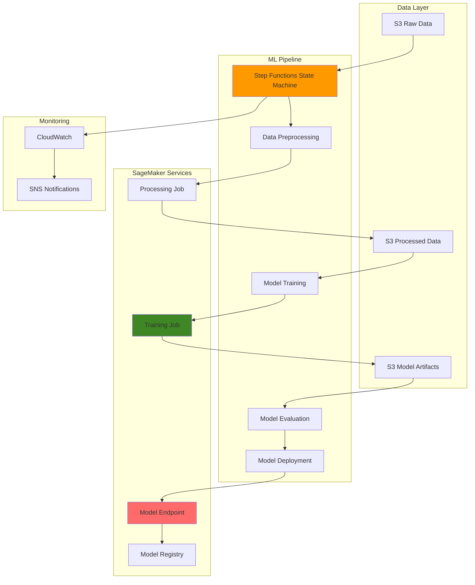

# SageMaker ML Workflows with Step Functions

## Problem

Enterprise data science teams struggle with operationalizing machine learning models at scale, facing challenges in coordinating complex workflows that span data preprocessing, model training, validation, and deployment. Manual orchestration leads to inconsistent processes, delayed deployments, and difficulty tracking model performance across different environments. Organizations need automated, reliable pipelines that can handle the entire ML lifecycle while providing visibility into each stage of the process.

## Solution

This solution creates an end-to-end ML pipeline using Amazon SageMaker for model training and deployment, orchestrated by AWS Step Functions for workflow management. The pipeline automates data preprocessing, model training with hyperparameter tuning, model evaluation, and conditional deployment based on performance metrics, while providing comprehensive monitoring and rollback capabilities.

## Architecture Diagram



## Prerequisites

1. AWS account with appropriate permissions for SageMaker, Step Functions, S3, and IAM
2. AWS CLI v2 installed and configured (or AWS CloudShell)
3. Basic knowledge of machine learning concepts and Python
4. Understanding of containerization and Docker concepts
5. Estimated cost: $50-100 for training jobs and endpoints during testing

> **Note**: This recipe uses SageMaker training instances and endpoints which incur charges. Ensure you complete the cleanup steps to avoid ongoing costs.

## Preparation

```bash
# Set environment variables
export AWS_REGION=$(aws configure get region)
export AWS_ACCOUNT_ID=$(aws sts get-caller-identity \
    --query Account --output text)

# Generate unique identifiers for resources
RANDOM_SUFFIX=$(aws secretsmanager get-random-password \
    --exclude-punctuation --exclude-uppercase \
    --password-length 6 --require-each-included-type \
    --output text --query RandomPassword)

export ML_PIPELINE_NAME="ml-pipeline-${RANDOM_SUFFIX}"
export S3_BUCKET_NAME="ml-pipeline-bucket-${RANDOM_SUFFIX}"
export SAGEMAKER_ROLE_NAME="SageMakerMLPipelineRole-${RANDOM_SUFFIX}"
export STEP_FUNCTIONS_ROLE_NAME="StepFunctionsMLRole-${RANDOM_SUFFIX}"

# Create S3 bucket for ML artifacts
aws s3 mb s3://${S3_BUCKET_NAME} --region ${AWS_REGION}

# Create folder structure in S3
aws s3api put-object --bucket ${S3_BUCKET_NAME} \
    --key raw-data/
aws s3api put-object --bucket ${S3_BUCKET_NAME} \
    --key processed-data/
aws s3api put-object --bucket ${S3_BUCKET_NAME} \
    --key model-artifacts/
aws s3api put-object --bucket ${S3_BUCKET_NAME} \
    --key code/

echo "✅ S3 bucket and folder structure created"
```

## Steps

1. **Create IAM Roles for SageMaker and Step Functions**:

   IAM roles provide the secure foundation for our ML pipeline by establishing least-privilege access patterns. SageMaker requires specific permissions to access S3 data, create training jobs, and manage model artifacts, while Step Functions needs permissions to orchestrate the entire workflow. Understanding these role relationships is crucial for enterprise ML operations where security and compliance are paramount.

   ```bash
   # Create SageMaker execution role
   cat > sagemaker-trust-policy.json << EOF
   {
     "Version": "2012-10-17",
     "Statement": [
       {
         "Effect": "Allow",
         "Principal": {
           "Service": "sagemaker.amazonaws.com"
         },
         "Action": "sts:AssumeRole"
       }
     ]
   }
   EOF
   
   aws iam create-role --role-name ${SAGEMAKER_ROLE_NAME} \
       --assume-role-policy-document file://sagemaker-trust-policy.json
   
   # Attach managed policies to SageMaker role
   aws iam attach-role-policy --role-name ${SAGEMAKER_ROLE_NAME} \
       --policy-arn arn:aws:iam::aws:policy/AmazonSageMakerFullAccess
   
   aws iam attach-role-policy --role-name ${SAGEMAKER_ROLE_NAME} \
       --policy-arn arn:aws:iam::aws:policy/AmazonS3FullAccess
   
   export SAGEMAKER_ROLE_ARN=$(aws iam get-role \
       --role-name ${SAGEMAKER_ROLE_NAME} \
       --query Role.Arn --output text)
   
   echo "✅ SageMaker role created: ${SAGEMAKER_ROLE_ARN}"
   ```

   The SageMaker role is now established with the necessary permissions to access S3 resources and manage ML jobs. This role enables SageMaker to securely access training data, store model artifacts, and execute processing jobs without requiring hardcoded credentials in your code.

2. **Create Step Functions Execution Role**:

   Step Functions serves as the orchestration layer for our ML pipeline, requiring permissions to invoke SageMaker services, manage S3 resources, and coordinate workflow execution. This separation of concerns allows Step Functions to act as the conductor while SageMaker handles the heavy lifting of ML operations, creating a scalable and maintainable architecture.

   ```bash
   # Create Step Functions trust policy
   cat > step-functions-trust-policy.json << EOF
   {
     "Version": "2012-10-17",
     "Statement": [
       {
         "Effect": "Allow",
         "Principal": {
           "Service": "states.amazonaws.com"
         },
         "Action": "sts:AssumeRole"
       }
     ]
   }
   EOF
   
   aws iam create-role --role-name ${STEP_FUNCTIONS_ROLE_NAME} \
       --assume-role-policy-document file://step-functions-trust-policy.json
   
   # Create custom policy for Step Functions SageMaker integration
   cat > step-functions-sagemaker-policy.json << EOF
   {
     "Version": "2012-10-17",
     "Statement": [
       {
         "Effect": "Allow",
         "Action": [
           "sagemaker:CreateProcessingJob",
           "sagemaker:CreateTrainingJob",
           "sagemaker:CreateModel",
           "sagemaker:CreateEndpointConfig",
           "sagemaker:CreateEndpoint",
           "sagemaker:UpdateEndpoint",
           "sagemaker:DeleteEndpoint",
           "sagemaker:DescribeProcessingJob",
           "sagemaker:DescribeTrainingJob",
           "sagemaker:DescribeModel",
           "sagemaker:DescribeEndpoint",
           "sagemaker:ListTags",
           "sagemaker:AddTags"
         ],
         "Resource": "*"
       },
       {
         "Effect": "Allow",
         "Action": [
           "s3:GetObject",
           "s3:PutObject",
           "s3:DeleteObject",
           "s3:ListBucket"
         ],
         "Resource": [
           "arn:aws:s3:::${S3_BUCKET_NAME}",
           "arn:aws:s3:::${S3_BUCKET_NAME}/*"
         ]
       },
       {
         "Effect": "Allow",
         "Action": [
           "iam:PassRole"
         ],
         "Resource": "${SAGEMAKER_ROLE_ARN}"
       },
       {
         "Effect": "Allow",
         "Action": [
           "sns:Publish"
         ],
         "Resource": "*"
       }
     ]
   }
   EOF
   
   aws iam create-policy --policy-name StepFunctionsSageMakerPolicy \
       --policy-document file://step-functions-sagemaker-policy.json
   
   aws iam attach-role-policy --role-name ${STEP_FUNCTIONS_ROLE_NAME} \
       --policy-arn arn:aws:iam::${AWS_ACCOUNT_ID}:policy/StepFunctionsSageMakerPolicy
   
   export STEP_FUNCTIONS_ROLE_ARN=$(aws iam get-role \
       --role-name ${STEP_FUNCTIONS_ROLE_NAME} \
       --query Role.Arn --output text)
   
   echo "✅ Step Functions role created: ${STEP_FUNCTIONS_ROLE_ARN}"
   ```

   The Step Functions orchestration role is now configured with the precise permissions needed to manage the entire ML workflow. This role enables secure delegation of tasks to SageMaker while maintaining audit trails and ensuring compliance with security best practices.

3. **Create Sample Training Data and Upload to S3**:

   High-quality training data forms the foundation of any successful ML pipeline. For this example, we'll use the Boston Housing dataset to demonstrate regression techniques, but the pipeline architecture supports any dataset format. Understanding data preparation and storage patterns is essential for scaling ML operations across different domains and use cases.

   ```bash
   # Create sample dataset (Boston Housing for regression)
   cat > generate_sample_data.py << 'EOF'
   import pandas as pd
   import numpy as np
   from sklearn.datasets import load_boston
   from sklearn.model_selection import train_test_split
   
   # Load Boston Housing dataset
   boston = load_boston()
   X, y = boston.data, boston.target
   
   # Create DataFrame
   df = pd.DataFrame(X, columns=boston.feature_names)
   df['target'] = y
   
   # Split into train and test sets
   train_df, test_df = train_test_split(df, test_size=0.2, random_state=42)
   
   # Save to CSV files
   train_df.to_csv('train.csv', index=False)
   test_df.to_csv('test.csv', index=False)
   
   print(f"Training data shape: {train_df.shape}")
   print(f"Test data shape: {test_df.shape}")
   EOF
   
   python generate_sample_data.py
   
   # Upload data to S3
   aws s3 cp train.csv s3://${S3_BUCKET_NAME}/raw-data/
   aws s3 cp test.csv s3://${S3_BUCKET_NAME}/raw-data/
   
   echo "✅ Sample data uploaded to S3"
   ```

   The training and test datasets are now stored in S3, establishing the data foundation for our ML pipeline. S3 provides 99.999999999% (11 9's) durability and serves as the single source of truth for all ML artifacts, enabling reproducible experiments and model versioning.

4. **Create Data Preprocessing Script**:

   Data preprocessing standardizes input features and ensures consistent model performance across different datasets. SageMaker Processing Jobs provide managed infrastructure for these transformations, allowing data scientists to focus on business logic rather than infrastructure management. This approach scales automatically and integrates seamlessly with the broader ML workflow.

   ```bash
   # Create preprocessing script
   cat > preprocessing.py << 'EOF'
   import pandas as pd
   import numpy as np
   import argparse
   import os
   from sklearn.preprocessing import StandardScaler
   import joblib
   
   def main():
       parser = argparse.ArgumentParser()
       parser.add_argument('--input-data', type=str, required=True)
       parser.add_argument('--output-data', type=str, required=True)
       
       args = parser.parse_args()
       
       # Read data
       df = pd.read_csv(args.input_data)
       
       # Separate features and target
       X = df.drop('target', axis=1)
       y = df['target']
       
       # Apply preprocessing
       scaler = StandardScaler()
       X_scaled = scaler.fit_transform(X)
       
       # Create processed DataFrame
       processed_df = pd.DataFrame(X_scaled, columns=X.columns)
       processed_df['target'] = y.values
       
       # Save processed data
       processed_df.to_csv(args.output_data, index=False)
       
       # Save scaler for inference
       scaler_path = os.path.join(os.path.dirname(args.output_data), 'scaler.pkl')
       joblib.dump(scaler, scaler_path)
       
       print(f"Processed data saved to: {args.output_data}")
       print(f"Scaler saved to: {scaler_path}")
   
   if __name__ == '__main__':
       main()
   EOF
   
   # Upload preprocessing script to S3
   aws s3 cp preprocessing.py s3://${S3_BUCKET_NAME}/code/
   
   echo "✅ Preprocessing script uploaded to S3"
   ```

   The preprocessing script is now available in S3 and ready for execution by SageMaker Processing Jobs. This script standardizes features using scikit-learn's StandardScaler and saves the scaler artifact for consistent transformations during inference, ensuring model predictions remain accurate in production.

5. **Create Training Script with Model Evaluation**:

   Model training and evaluation form the core of the ML pipeline, where algorithms learn patterns from data and generate performance metrics. This script implements best practices including separate training/testing, comprehensive metrics calculation, and artifact management. Understanding these patterns enables reliable model development and deployment decisions.

   ```bash
   # Create training script
   cat > training.py << 'EOF'
   import pandas as pd
   import numpy as np
   import argparse
   import os
   import joblib
   import json
   from sklearn.ensemble import RandomForestRegressor
   from sklearn.linear_model import LinearRegression
   from sklearn.metrics import mean_squared_error, r2_score
   import tarfile
   
   def main():
       parser = argparse.ArgumentParser()
       parser.add_argument('--model-dir', type=str, default=os.environ.get('SM_MODEL_DIR'))
       parser.add_argument('--train', type=str, default=os.environ.get('SM_CHANNEL_TRAIN'))
       parser.add_argument('--test', type=str, default=os.environ.get('SM_CHANNEL_TEST'))
       parser.add_argument('--output-data-dir', type=str, default=os.environ.get('SM_OUTPUT_DATA_DIR'))
       
       args = parser.parse_args()
       
       # Read training data
       train_df = pd.read_csv(os.path.join(args.train, 'train.csv'))
       test_df = pd.read_csv(os.path.join(args.test, 'test.csv'))
       
       # Prepare features and targets
       X_train = train_df.drop('target', axis=1)
       y_train = train_df['target']
       X_test = test_df.drop('target', axis=1)
       y_test = test_df['target']
       
       # Train Random Forest model
       rf_model = RandomForestRegressor(n_estimators=100, random_state=42)
       rf_model.fit(X_train, y_train)
       
       # Make predictions
       y_pred_train = rf_model.predict(X_train)
       y_pred_test = rf_model.predict(X_test)
       
       # Calculate metrics
       train_rmse = np.sqrt(mean_squared_error(y_train, y_pred_train))
       test_rmse = np.sqrt(mean_squared_error(y_test, y_pred_test))
       train_r2 = r2_score(y_train, y_pred_train)
       test_r2 = r2_score(y_test, y_pred_test)
       
       # Save model
       model_path = os.path.join(args.model_dir, 'model.pkl')
       joblib.dump(rf_model, model_path)
       
       # Save evaluation metrics
       metrics = {
           'train_rmse': float(train_rmse),
           'test_rmse': float(test_rmse),
           'train_r2': float(train_r2),
           'test_r2': float(test_r2)
       }
       
       metrics_path = os.path.join(args.output_data_dir, 'evaluation.json')
       with open(metrics_path, 'w') as f:
           json.dump(metrics, f, indent=2)
       
       print(f"Model saved to: {model_path}")
       print(f"Evaluation metrics: {metrics}")
   
   if __name__ == '__main__':
       main()
   EOF
   
   # Upload training script to S3
   aws s3 cp training.py s3://${S3_BUCKET_NAME}/code/
   
   echo "✅ Training script uploaded to S3"
   ```

   The training script implements a Random Forest regressor with comprehensive evaluation metrics including RMSE and R² scores for both training and test sets. These metrics enable automated decision-making in the pipeline, ensuring only high-quality models proceed to deployment while maintaining detailed audit trails.

> **Warning**: Model evaluation thresholds should be carefully tuned based on business requirements. A test R² score threshold of 0.7 is used in this example, but production systems may require different performance criteria.

6. **Create Model Inference Script**:

   Model inference scripts define how trained models process new data in production environments. SageMaker endpoints use these scripts to handle HTTP requests, perform predictions, and return results in the expected format. Understanding inference patterns is crucial for deploying models that meet production performance and reliability requirements.

   ```bash
   # Create inference script
   cat > inference.py << 'EOF'
   import joblib
   import json
   import numpy as np
   import pandas as pd
   
   def model_fn(model_dir):
       """Load model for inference"""
       model = joblib.load(f"{model_dir}/model.pkl")
       return model
   
   def input_fn(request_body, request_content_type):
       """Parse input data for inference"""
       if request_content_type == 'application/json':
           input_data = json.loads(request_body)
           return np.array(input_data['instances'])
       elif request_content_type == 'text/csv':
           return pd.read_csv(request_body).values
       else:
           raise ValueError(f"Unsupported content type: {request_content_type}")
   
   def predict_fn(input_data, model):
       """Make prediction"""
       predictions = model.predict(input_data)
       return predictions
   
   def output_fn(predictions, accept):
       """Format output"""
       if accept == 'application/json':
           return json.dumps({'predictions': predictions.tolist()})
       else:
           return str(predictions)
   EOF
   
   # Upload inference script to S3
   aws s3 cp inference.py s3://${S3_BUCKET_NAME}/code/
   
   echo "✅ Inference script uploaded to S3"
   ```

   The inference script is now configured to handle multiple input formats and provide consistent prediction outputs. This flexible approach supports various client applications and integration patterns while maintaining optimal performance for real-time inference scenarios.

7. **Create Step Functions State Machine Definition**:

   Step Functions provides visual workflow orchestration with built-in error handling, retry logic, and monitoring capabilities. This state machine definition creates a robust ML pipeline that coordinates preprocessing, training, evaluation, and deployment while implementing conditional logic based on model performance. Understanding state machine patterns enables scalable and reliable ML operations.

   ```bash
   # Create state machine definition
   cat > ml-pipeline-state-machine.json << EOF
   {
     "Comment": "ML Pipeline with SageMaker and Step Functions",
     "StartAt": "DataPreprocessing",
     "States": {
       "DataPreprocessing": {
         "Type": "Task",
         "Resource": "arn:aws:states:::sagemaker:createProcessingJob.sync",
         "Parameters": {
           "ProcessingJobName.$": "$.PreprocessingJobName",
           "RoleArn": "${SAGEMAKER_ROLE_ARN}",
           "AppSpecification": {
             "ImageUri": "683313688378.dkr.ecr.${AWS_REGION}.amazonaws.com/sagemaker-scikit-learn:1.0-1-cpu-py3",
             "ContainerEntrypoint": [
               "python3",
               "/opt/ml/processing/input/code/preprocessing.py"
             ],
             "ContainerArguments": [
               "--input-data",
               "/opt/ml/processing/input/data/train.csv",
               "--output-data",
               "/opt/ml/processing/output/train_processed.csv"
             ]
           },
           "ProcessingInputs": [
             {
               "InputName": "data",
               "S3Input": {
                 "S3Uri": "s3://${S3_BUCKET_NAME}/raw-data",
                 "LocalPath": "/opt/ml/processing/input/data",
                 "S3DataType": "S3Prefix"
               }
             },
             {
               "InputName": "code",
               "S3Input": {
                 "S3Uri": "s3://${S3_BUCKET_NAME}/code",
                 "LocalPath": "/opt/ml/processing/input/code",
                 "S3DataType": "S3Prefix"
               }
             }
           ],
           "ProcessingOutputs": [
             {
               "OutputName": "processed_data",
               "S3Output": {
                 "S3Uri": "s3://${S3_BUCKET_NAME}/processed-data",
                 "LocalPath": "/opt/ml/processing/output"
               }
             }
           ],
           "ProcessingResources": {
             "ClusterConfig": {
               "InstanceCount": 1,
               "InstanceType": "ml.m5.large",
               "VolumeSizeInGB": 30
             }
           }
         },
         "Next": "ModelTraining",
         "Catch": [
           {
             "ErrorEquals": ["States.ALL"],
             "Next": "ProcessingJobFailed"
           }
         ]
       },
       "ModelTraining": {
         "Type": "Task",
         "Resource": "arn:aws:states:::sagemaker:createTrainingJob.sync",
         "Parameters": {
           "TrainingJobName.$": "$.TrainingJobName",
           "RoleArn": "${SAGEMAKER_ROLE_ARN}",
           "AlgorithmSpecification": {
             "TrainingImage": "683313688378.dkr.ecr.${AWS_REGION}.amazonaws.com/sagemaker-scikit-learn:1.0-1-cpu-py3",
             "TrainingInputMode": "File"
           },
           "InputDataConfig": [
             {
               "ChannelName": "train",
               "DataSource": {
                 "S3DataSource": {
                   "S3DataType": "S3Prefix",
                   "S3Uri": "s3://${S3_BUCKET_NAME}/processed-data",
                   "S3DataDistributionType": "FullyReplicated"
                 }
               }
             },
             {
               "ChannelName": "test",
               "DataSource": {
                 "S3DataSource": {
                   "S3DataType": "S3Prefix",
                   "S3Uri": "s3://${S3_BUCKET_NAME}/raw-data",
                   "S3DataDistributionType": "FullyReplicated"
                 }
               }
             },
             {
               "ChannelName": "code",
               "DataSource": {
                 "S3DataSource": {
                   "S3DataType": "S3Prefix",
                   "S3Uri": "s3://${S3_BUCKET_NAME}/code",
                   "S3DataDistributionType": "FullyReplicated"
                 }
               }
             }
           ],
           "OutputDataConfig": {
             "S3OutputPath": "s3://${S3_BUCKET_NAME}/model-artifacts"
           },
           "ResourceConfig": {
             "InstanceType": "ml.m5.large",
             "InstanceCount": 1,
             "VolumeSizeInGB": 30
           },
           "StoppingCondition": {
             "MaxRuntimeInSeconds": 3600
           },
           "HyperParameters": {
             "sagemaker_program": "training.py",
             "sagemaker_submit_directory": "/opt/ml/input/data/code"
           }
         },
         "Next": "ModelEvaluation",
         "Catch": [
           {
             "ErrorEquals": ["States.ALL"],
             "Next": "TrainingJobFailed"
           }
         ]
       },
       "ModelEvaluation": {
         "Type": "Task",
         "Resource": "arn:aws:states:::lambda:invoke",
         "Parameters": {
           "FunctionName": "EvaluateModel",
           "Payload": {
             "TrainingJobName.$": "$.TrainingJobName",
             "S3Bucket": "${S3_BUCKET_NAME}"
           }
         },
         "Next": "CheckModelPerformance"
       },
       "CheckModelPerformance": {
         "Type": "Choice",
         "Choices": [
           {
             "Variable": "$.Payload.test_r2",
             "NumericGreaterThan": 0.7,
             "Next": "CreateModel"
           }
         ],
         "Default": "ModelPerformanceInsufficient"
       },
       "CreateModel": {
         "Type": "Task",
         "Resource": "arn:aws:states:::sagemaker:createModel",
         "Parameters": {
           "ModelName.$": "$.ModelName",
           "ExecutionRoleArn": "${SAGEMAKER_ROLE_ARN}",
           "PrimaryContainer": {
             "Image": "683313688378.dkr.ecr.${AWS_REGION}.amazonaws.com/sagemaker-scikit-learn:1.0-1-cpu-py3",
             "ModelDataUrl.$": "$.ModelDataUrl",
             "Environment": {
               "SAGEMAKER_PROGRAM": "inference.py",
               "SAGEMAKER_SUBMIT_DIRECTORY": "/opt/ml/code"
             }
           }
         },
         "Next": "CreateEndpointConfig"
       },
       "CreateEndpointConfig": {
         "Type": "Task",
         "Resource": "arn:aws:states:::sagemaker:createEndpointConfig",
         "Parameters": {
           "EndpointConfigName.$": "$.EndpointConfigName",
           "ProductionVariants": [
             {
               "VariantName": "primary",
               "ModelName.$": "$.ModelName",
               "InitialInstanceCount": 1,
               "InstanceType": "ml.t2.medium",
               "InitialVariantWeight": 1
             }
           ]
         },
         "Next": "CreateEndpoint"
       },
       "CreateEndpoint": {
         "Type": "Task",
         "Resource": "arn:aws:states:::sagemaker:createEndpoint",
         "Parameters": {
           "EndpointName.$": "$.EndpointName",
           "EndpointConfigName.$": "$.EndpointConfigName"
         },
         "Next": "MLPipelineComplete"
       },
       "MLPipelineComplete": {
         "Type": "Succeed",
         "Result": "ML Pipeline completed successfully"
       },
       "ProcessingJobFailed": {
         "Type": "Fail",
         "Error": "ProcessingJobFailed",
         "Cause": "The data preprocessing job failed"
       },
       "TrainingJobFailed": {
         "Type": "Fail",
         "Error": "TrainingJobFailed",
         "Cause": "The model training job failed"
       },
       "ModelPerformanceInsufficient": {
         "Type": "Fail",
         "Error": "ModelPerformanceInsufficient",
         "Cause": "Model performance does not meet the required threshold"
       }
     }
   }
   EOF
   
   echo "✅ State machine definition created"
   ```

   The Step Functions state machine is now defined with comprehensive error handling and conditional deployment logic. This orchestration pattern ensures only high-performing models reach production while providing clear visibility into pipeline execution status and failure points.

8. **Create Lambda Function for Model Evaluation**:

   Lambda functions provide serverless compute for custom business logic within the ML pipeline. This evaluation function implements quality gates by analyzing model performance metrics and determining deployment eligibility. Understanding serverless integration patterns enables flexible and cost-effective pipeline customization.

   ```bash
   # Create Lambda function for model evaluation
   cat > evaluate_model.py << 'EOF'
   import json
   import boto3
   import os
   
   def lambda_handler(event, context):
       s3 = boto3.client('s3')
       
       # Get training job name and S3 bucket from event
       training_job_name = event['TrainingJobName']
       s3_bucket = event['S3Bucket']
       
       try:
           # Download evaluation metrics from S3
           evaluation_key = f"model-artifacts/{training_job_name}/output/evaluation.json"
           response = s3.get_object(Bucket=s3_bucket, Key=evaluation_key)
           evaluation_data = json.loads(response['Body'].read())
           
           return {
               'statusCode': 200,
               'body': evaluation_data
           }
       
       except Exception as e:
           return {
               'statusCode': 500,
               'body': {'error': str(e)}
           }
   EOF
   
   # Create deployment package
   zip -r evaluate_model.zip evaluate_model.py
   
   # Create Lambda function
   LAMBDA_ROLE_ARN=$(aws iam create-role \
       --role-name LambdaEvaluateModelRole \
       --assume-role-policy-document '{
         "Version": "2012-10-17",
         "Statement": [
           {
             "Effect": "Allow",
             "Principal": {
               "Service": "lambda.amazonaws.com"
             },
             "Action": "sts:AssumeRole"
           }
         ]
       }' \
       --query 'Role.Arn' --output text)
   
   # Attach basic execution policy
   aws iam attach-role-policy \
       --role-name LambdaEvaluateModelRole \
       --policy-arn arn:aws:iam::aws:policy/service-role/AWSLambdaBasicExecutionRole
   
   # Attach S3 read policy
   aws iam attach-role-policy \
       --role-name LambdaEvaluateModelRole \
       --policy-arn arn:aws:iam::aws:policy/AmazonS3ReadOnlyAccess
   
   # Wait for role to be ready
   sleep 10
   
   aws lambda create-function \
       --function-name EvaluateModel \
       --runtime python3.9 \
       --role ${LAMBDA_ROLE_ARN} \
       --handler evaluate_model.lambda_handler \
       --zip-file fileb://evaluate_model.zip \
       --timeout 30
   
   echo "✅ Lambda function created for model evaluation"
   ```

   The Lambda evaluation function is now deployed and ready to process model metrics from S3. This serverless component enables dynamic decision-making based on model performance, implementing quality gates that prevent poor-performing models from reaching production environments.

9. **Create and Deploy Step Functions State Machine**:

   Deploying the Step Functions state machine activates the ML pipeline orchestration layer. This visual workflow provides comprehensive monitoring, retry logic, and execution history while coordinating complex multi-service interactions. The state machine serves as the central control plane for all ML operations.

   ```bash
   # Create Step Functions state machine
   aws stepfunctions create-state-machine \
       --name ${ML_PIPELINE_NAME} \
       --definition file://ml-pipeline-state-machine.json \
       --role-arn ${STEP_FUNCTIONS_ROLE_ARN}
   
   # Get state machine ARN
   export STATE_MACHINE_ARN=$(aws stepfunctions list-state-machines \
       --query "stateMachines[?name=='${ML_PIPELINE_NAME}'].stateMachineArn" \
       --output text)
   
   echo "✅ Step Functions state machine created: ${STATE_MACHINE_ARN}"
   ```

   The Step Functions state machine is now active and ready to orchestrate ML pipeline executions. This provides a scalable foundation for automated model training and deployment with built-in monitoring and error handling capabilities.

10. **Execute the ML Pipeline**:

    Pipeline execution triggers the complete ML workflow from data preprocessing through model deployment. Understanding execution patterns and monitoring strategies enables reliable operations and troubleshooting of complex ML workflows. This end-to-end automation reduces manual errors and ensures consistent model deployment processes.

    ```bash
    # Generate unique job names
    TIMESTAMP=$(date +%Y%m%d%H%M%S)
    PREPROCESSING_JOB_NAME="preprocessing-${TIMESTAMP}"
    TRAINING_JOB_NAME="training-${TIMESTAMP}"
    MODEL_NAME="model-${TIMESTAMP}"
    ENDPOINT_CONFIG_NAME="endpoint-config-${TIMESTAMP}"
    ENDPOINT_NAME="endpoint-${TIMESTAMP}"
    
    # Create input for pipeline execution
    cat > pipeline-input.json << EOF
    {
      "PreprocessingJobName": "${PREPROCESSING_JOB_NAME}",
      "TrainingJobName": "${TRAINING_JOB_NAME}",
      "ModelName": "${MODEL_NAME}",
      "EndpointConfigName": "${ENDPOINT_CONFIG_NAME}",
      "EndpointName": "${ENDPOINT_NAME}",
      "ModelDataUrl": "s3://${S3_BUCKET_NAME}/model-artifacts/${TRAINING_JOB_NAME}/output/model.tar.gz"
    }
    EOF
    
    # Execute the pipeline
    EXECUTION_ARN=$(aws stepfunctions start-execution \
        --state-machine-arn ${STATE_MACHINE_ARN} \
        --name "execution-${TIMESTAMP}" \
        --input file://pipeline-input.json \
        --query 'executionArn' --output text)
    
    echo "✅ Pipeline execution started: ${EXECUTION_ARN}"
    echo "Monitor execution in AWS Console or use:"
    echo "aws stepfunctions describe-execution --execution-arn ${EXECUTION_ARN}"
    ```

    The ML pipeline execution is now running, coordinating data preprocessing, model training, evaluation, and conditional deployment. The unique execution identifier enables tracking and monitoring throughout the workflow lifecycle.

11. **Monitor Pipeline Execution**:

    Monitoring pipeline execution provides visibility into workflow progress and enables proactive issue resolution. Step Functions provides detailed execution history and state transitions, while CloudWatch logs capture detailed information from each stage. Understanding monitoring patterns is essential for maintaining reliable ML operations.

    ```bash
    # Function to check execution status
    check_execution_status() {
        aws stepfunctions describe-execution \
            --execution-arn ${EXECUTION_ARN} \
            --query 'status' --output text
    }
    
    # Wait for execution to complete
    echo "Monitoring pipeline execution..."
    while true; do
        STATUS=$(check_execution_status)
        echo "Current status: ${STATUS}"
        
        if [ "$STATUS" = "SUCCEEDED" ]; then
            echo "✅ Pipeline execution completed successfully!"
            break
        elif [ "$STATUS" = "FAILED" ]; then
            echo "❌ Pipeline execution failed"
            aws stepfunctions describe-execution \
                --execution-arn ${EXECUTION_ARN} \
                --query 'error' --output text
            break
        elif [ "$STATUS" = "TIMED_OUT" ]; then
            echo "❌ Pipeline execution timed out"
            break
        fi
        
        sleep 30
    done
    ```

    The monitoring loop provides real-time visibility into pipeline execution status, enabling immediate response to success or failure conditions. This proactive monitoring approach ensures rapid identification and resolution of any pipeline issues.

12. **Test the Deployed Model Endpoint**:

    Testing the deployed model endpoint validates the complete ML pipeline functionality and ensures the model is ready for production use. SageMaker endpoints provide real-time inference capabilities with automatic scaling and monitoring. Understanding inference testing patterns ensures reliable model deployment and performance validation.

    ```bash
    # Test the deployed model endpoint
    cat > test-prediction.json << 'EOF'
    {
      "instances": [
        [0.02729, 0.0, 7.07, 0, 0.469, 7.185, 61.1, 4.9671, 2, 242, 17.8, 392.83, 4.03]
      ]
    }
    EOF
    
    # Make prediction request
    aws sagemaker-runtime invoke-endpoint \
        --endpoint-name ${ENDPOINT_NAME} \
        --content-type application/json \
        --body file://test-prediction.json \
        prediction-output.json
    
    echo "✅ Prediction result:"
    cat prediction-output.json
    ```

    The model endpoint is now validated and ready for production inference requests. This successful test confirms the entire ML pipeline functions correctly from data preprocessing through real-time prediction serving.

> **Tip**: Consider implementing automated endpoint health checks and performance monitoring using CloudWatch alarms to ensure continuous model availability and optimal response times in production environments.

## Validation & Testing

1. **Verify Pipeline Execution History**:

   ```bash
   # List all executions for the state machine
   aws stepfunctions list-executions \
       --state-machine-arn ${STATE_MACHINE_ARN} \
       --query 'executions[*].[name,status,startDate]' \
       --output table
   ```

   Expected output: Table showing execution history with SUCCEEDED status

2. **Check Model Artifacts in S3**:

   ```bash
   # List model artifacts
   aws s3 ls s3://${S3_BUCKET_NAME}/model-artifacts/ --recursive
   
   # Check processed data
   aws s3 ls s3://${S3_BUCKET_NAME}/processed-data/
   ```

3. **Verify SageMaker Endpoint Status**:

   ```bash
   # Check endpoint status
   aws sagemaker describe-endpoint \
       --endpoint-name ${ENDPOINT_NAME} \
       --query 'EndpointStatus' --output text
   ```

   Expected output: `InService`

4. **Test Model Performance**:

   ```bash
   # Download and check evaluation metrics
   aws s3 cp s3://${S3_BUCKET_NAME}/model-artifacts/${TRAINING_JOB_NAME}/output/evaluation.json .
   
   echo "Model evaluation metrics:"
   cat evaluation.json
   ```

## Cleanup

1. **Delete SageMaker Endpoint and Configuration**:

   ```bash
   # Delete endpoint
   aws sagemaker delete-endpoint \
       --endpoint-name ${ENDPOINT_NAME}
   
   # Delete endpoint configuration
   aws sagemaker delete-endpoint-config \
       --endpoint-config-name ${ENDPOINT_CONFIG_NAME}
   
   # Delete model
   aws sagemaker delete-model \
       --model-name ${MODEL_NAME}
   
   echo "✅ SageMaker resources deleted"
   ```

2. **Delete Step Functions State Machine**:

   ```bash
   # Delete state machine
   aws stepfunctions delete-state-machine \
       --state-machine-arn ${STATE_MACHINE_ARN}
   
   echo "✅ Step Functions state machine deleted"
   ```

3. **Delete Lambda Function**:

   ```bash
   # Delete Lambda function
   aws lambda delete-function \
       --function-name EvaluateModel
   
   echo "✅ Lambda function deleted"
   ```

4. **Delete IAM Roles and Policies**:

   ```bash
   # Detach and delete SageMaker role
   aws iam detach-role-policy \
       --role-name ${SAGEMAKER_ROLE_NAME} \
       --policy-arn arn:aws:iam::aws:policy/AmazonSageMakerFullAccess
   
   aws iam detach-role-policy \
       --role-name ${SAGEMAKER_ROLE_NAME} \
       --policy-arn arn:aws:iam::aws:policy/AmazonS3FullAccess
   
   aws iam delete-role --role-name ${SAGEMAKER_ROLE_NAME}
   
   # Detach and delete Step Functions role
   aws iam detach-role-policy \
       --role-name ${STEP_FUNCTIONS_ROLE_NAME} \
       --policy-arn arn:aws:iam::${AWS_ACCOUNT_ID}:policy/StepFunctionsSageMakerPolicy
   
   aws iam delete-role --role-name ${STEP_FUNCTIONS_ROLE_NAME}
   
   # Delete custom policy
   aws iam delete-policy \
       --policy-arn arn:aws:iam::${AWS_ACCOUNT_ID}:policy/StepFunctionsSageMakerPolicy
   
   # Delete Lambda role
   aws iam detach-role-policy \
       --role-name LambdaEvaluateModelRole \
       --policy-arn arn:aws:iam::aws:policy/service-role/AWSLambdaBasicExecutionRole
   
   aws iam detach-role-policy \
       --role-name LambdaEvaluateModelRole \
       --policy-arn arn:aws:iam::aws:policy/AmazonS3ReadOnlyAccess
   
   aws iam delete-role --role-name LambdaEvaluateModelRole
   
   echo "✅ IAM roles and policies deleted"
   ```

5. **Delete S3 Bucket and Contents**:

   ```bash
   # Delete all objects in bucket
   aws s3 rm s3://${S3_BUCKET_NAME} --recursive
   
   # Delete bucket
   aws s3 rb s3://${S3_BUCKET_NAME}
   
   echo "✅ S3 bucket and contents deleted"
   ```

6. **Clean Up Local Files**:

   ```bash
   # Remove local files
   rm -f sagemaker-trust-policy.json
   rm -f step-functions-trust-policy.json
   rm -f step-functions-sagemaker-policy.json
   rm -f generate_sample_data.py
   rm -f preprocessing.py
   rm -f training.py
   rm -f inference.py
   rm -f ml-pipeline-state-machine.json
   rm -f evaluate_model.py
   rm -f evaluate_model.zip
   rm -f pipeline-input.json
   rm -f test-prediction.json
   rm -f prediction-output.json
   rm -f evaluation.json
   rm -f train.csv
   rm -f test.csv
   
   echo "✅ Local files cleaned up"
   ```

## Discussion

This comprehensive ML pipeline solution demonstrates the power of combining Amazon SageMaker's machine learning capabilities with AWS Step Functions' workflow orchestration to create robust, production-ready ML pipelines. The architecture separates concerns by using SageMaker for ML-specific tasks while Step Functions handles the coordination and conditional logic, creating a scalable and maintainable system that can adapt to changing business requirements.

The pipeline implements several MLOps best practices including automated data preprocessing, model evaluation with performance thresholds, conditional deployment based on model quality, and comprehensive error handling. The use of Step Functions provides visual monitoring of pipeline execution and makes it easy to identify bottlenecks or failures in the ML workflow, while SageMaker's managed services reduce operational overhead and enable data scientists to focus on model development rather than infrastructure management.

Key architectural decisions include using SageMaker Processing Jobs for data preprocessing to leverage managed infrastructure, implementing model evaluation as a Lambda function for custom logic, and using conditional steps in Step Functions to ensure only high-quality models are deployed. The pipeline also demonstrates how to integrate different AWS services seamlessly through Step Functions' native service integrations, creating a cohesive workflow that spans multiple services while maintaining clear separation of responsibilities.

The solution is designed for scalability and can be extended to handle larger datasets, more complex preprocessing steps, and advanced ML techniques like hyperparameter tuning and ensemble methods. The modular design makes it easy to swap out components or add new steps without affecting the overall pipeline structure, enabling iterative improvement and customization for specific business use cases. This approach reduces deployment risks and ensures consistent model quality across different environments.

> **Tip**: Consider implementing automated model monitoring and retraining triggers by adding CloudWatch alarms that monitor model performance metrics and automatically trigger pipeline executions when performance degrades.

## Challenge

Extend this ML pipeline by implementing these advanced enhancements:

1. **Add Hyperparameter Tuning**: Integrate SageMaker Hyperparameter Tuning Jobs to automatically optimize model parameters before training the final model.

2. **Implement A/B Testing**: Create a multi-variant endpoint deployment that splits traffic between the new model and the previous version, with automated rollback based on performance metrics.

3. **Add Model Registry Integration**: Enhance the pipeline to register models in SageMaker Model Registry with approval workflows for production deployment.

4. **Create Multi-Environment Pipeline**: Extend the pipeline to support deployment across development, staging, and production environments with different approval gates.

5. **Implement Real-time Monitoring**: Add CloudWatch custom metrics and alarms to monitor model drift, data quality, and endpoint performance with automated alerting and remediation.

## Infrastructure Code

*Infrastructure code will be generated after recipe approval.*