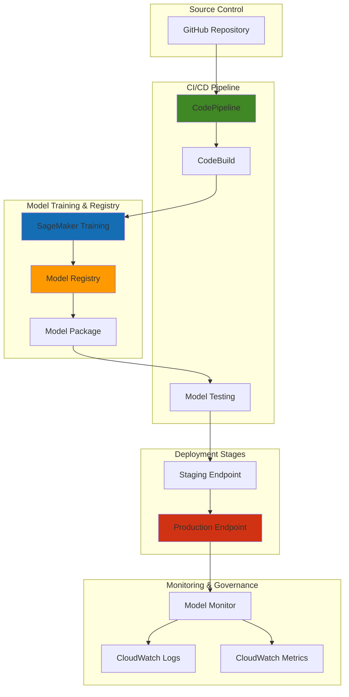

# SageMaker MLOps Pipeline with CodePipeline

## Problem

Organizations developing machine learning models face significant challenges in moving models from development to production environments. Manual deployment processes are error-prone, time-consuming, and lack proper versioning and rollback capabilities. Data science teams often struggle with inconsistent model performance between development and production environments, while DevOps teams find it difficult to integrate ML workflows into existing CI/CD pipelines. Without proper MLOps practices, model updates can take weeks to deploy, and there's no automated way to validate model performance before production deployment.

## Solution

This solution implements a comprehensive MLOps pipeline using Amazon SageMaker and AWS CodePipeline to automate model training, validation, and deployment. The pipeline integrates SageMaker Model Registry for version management, CodeBuild for automated testing, and multi-stage deployments with automated rollback capabilities. The solution provides continuous integration and deployment for machine learning models while maintaining governance, reproducibility, and monitoring throughout the model lifecycle.

## Architecture Diagram



## Prerequisites

1. AWS account with SageMaker, CodePipeline, CodeBuild, and S3 permissions
2. AWS CLI v2 installed and configured (or AWS CloudShell)
3. Knowledge of machine learning concepts and Python programming
4. Basic understanding of CI/CD principles and AWS services
5. GitHub account for source code repository
6. Estimated cost: $50-100 for training jobs, endpoints, and pipeline executions

> **Warning**: This recipe creates billable resources including SageMaker training jobs and endpoints. Clean up resources after testing to avoid ongoing charges.

> **Note**: SageMaker Model Registry provides comprehensive model lineage tracking and metadata management. For detailed model governance capabilities, see the [SageMaker Model Registry documentation](https://docs.aws.amazon.com/sagemaker/latest/dg/model-registry.html).

## Preparation

```bash
# Set environment variables
export AWS_REGION=$(aws configure get region)
export AWS_ACCOUNT_ID=$(aws sts get-caller-identity \
    --query Account --output text)

# Generate unique identifiers for resources
RANDOM_SUFFIX=$(aws secretsmanager get-random-password \
    --exclude-punctuation --exclude-uppercase \
    --password-length 6 --require-each-included-type \
    --output text --query RandomPassword)

export PROJECT_NAME="mlops-pipeline-${RANDOM_SUFFIX}"
export BUCKET_NAME="sagemaker-mlops-${AWS_REGION}-${RANDOM_SUFFIX}"
export MODEL_PACKAGE_GROUP_NAME="fraud-detection-models"
export PIPELINE_NAME="ml-deployment-pipeline-${RANDOM_SUFFIX}"

# Create S3 bucket for artifacts
aws s3 mb s3://${BUCKET_NAME} --region ${AWS_REGION}

# Create IAM roles for SageMaker and CodePipeline
aws iam create-role \
    --role-name SageMakerExecutionRole-${RANDOM_SUFFIX} \
    --assume-role-policy-document '{
        "Version": "2012-10-17",
        "Statement": [
            {
                "Effect": "Allow",
                "Principal": {
                    "Service": "sagemaker.amazonaws.com"
                },
                "Action": "sts:AssumeRole"
            }
        ]
    }'

aws iam attach-role-policy \
    --role-name SageMakerExecutionRole-${RANDOM_SUFFIX} \
    --policy-arn arn:aws:iam::aws:policy/AmazonSageMakerFullAccess

aws iam attach-role-policy \
    --role-name SageMakerExecutionRole-${RANDOM_SUFFIX} \
    --policy-arn arn:aws:iam::aws:policy/AmazonS3FullAccess

export SAGEMAKER_ROLE_ARN=$(aws iam get-role \
    --role-name SageMakerExecutionRole-${RANDOM_SUFFIX} \
    --query Role.Arn --output text)

echo "✅ Created S3 bucket: ${BUCKET_NAME}"
echo "✅ Created SageMaker execution role: ${SAGEMAKER_ROLE_ARN}"
```

## Steps

1. **Create SageMaker Model Package Group**:

   SageMaker Model Registry provides centralized model versioning and governance capabilities, enabling organizations to track model lineage, manage approvals, and maintain compliance throughout the ML lifecycle. Creating a Model Package Group establishes the foundation for organized model management, allowing teams to associate metadata, track performance metrics, and implement approval workflows that ensure only validated models reach production environments.

   ```bash
   # Create model package group for version management
   aws sagemaker create-model-package-group \
       --model-package-group-name ${MODEL_PACKAGE_GROUP_NAME} \
       --model-package-group-description "Fraud detection model packages" \
       --tags Key=Project,Value=${PROJECT_NAME}
   
   echo "✅ Created model package group: ${MODEL_PACKAGE_GROUP_NAME}"
   ```

   The Model Package Group is now established and ready to receive model versions from training jobs. This centralized registry becomes the single source of truth for model artifacts, enabling cross-team collaboration and ensuring proper governance controls are enforced before models reach production endpoints.

2. **Create CodeBuild Project for Model Training**:

   AWS CodeBuild provides fully managed build environments that scale automatically and integrate seamlessly with CI/CD pipelines. For ML workflows, CodeBuild serves as the execution engine for model training, testing, and validation tasks. By creating dedicated service roles, we follow the principle of least privilege while enabling CodeBuild to orchestrate SageMaker training jobs and manage artifacts in S3.

   ```bash
   # Create CodeBuild service role
   aws iam create-role \
       --role-name CodeBuildServiceRole-${RANDOM_SUFFIX} \
       --assume-role-policy-document '{
           "Version": "2012-10-17",
           "Statement": [
               {
                   "Effect": "Allow",
                   "Principal": {
                       "Service": "codebuild.amazonaws.com"
                   },
                   "Action": "sts:AssumeRole"
               }
           ]
       }'
   
   # Attach policies to CodeBuild role
   aws iam attach-role-policy \
       --role-name CodeBuildServiceRole-${RANDOM_SUFFIX} \
       --policy-arn arn:aws:iam::aws:policy/AmazonSageMakerFullAccess
   
   aws iam attach-role-policy \
       --role-name CodeBuildServiceRole-${RANDOM_SUFFIX} \
       --policy-arn arn:aws:iam::aws:policy/AmazonS3FullAccess
   
   aws iam attach-role-policy \
       --role-name CodeBuildServiceRole-${RANDOM_SUFFIX} \
       --policy-arn arn:aws:iam::aws:policy/CloudWatchLogsFullAccess
   
   export CODEBUILD_ROLE_ARN=$(aws iam get-role \
       --role-name CodeBuildServiceRole-${RANDOM_SUFFIX} \
       --query Role.Arn --output text)
   
   echo "✅ Created CodeBuild service role: ${CODEBUILD_ROLE_ARN}"
   ```

   The CodeBuild service role is now configured with appropriate permissions to execute ML training workflows. This role enables CodeBuild to launch SageMaker training jobs, access training data in S3, and register trained models in the Model Registry, establishing the foundational security layer for automated ML operations.

3. **Create Training BuildSpec Configuration**:

   BuildSpec files define the build phases and commands that CodeBuild executes during the training pipeline. This configuration automates the entire model training workflow, from environment setup to model registration in the SageMaker Model Registry. The script demonstrates MLOps best practices by automating model training, validation, and registration while maintaining traceability through build numbers and metadata.

   ```bash
   # Create buildspec for model training
   cat > /tmp/buildspec-train.yml << 'EOF'
   version: 0.2
   phases:
     install:
       runtime-versions:
         python: 3.12
       commands:
         - pip install boto3 scikit-learn pandas numpy sagemaker
     build:
       commands:
         - echo "Starting model training..."
         - |
           python << 'PYTHON_EOF'
           import boto3
           import sagemaker
           import json
           import os
           from sagemaker.sklearn.estimator import SKLearn
           from sagemaker.model_package import ModelPackage
           
           # Initialize SageMaker session
           session = sagemaker.Session()
           role = os.environ['SAGEMAKER_ROLE_ARN']
           
           # Create training job
           sklearn_estimator = SKLearn(
               entry_point='train.py',
               role=role,
               instance_type='ml.m5.large',
               framework_version='1.2-1',
               py_version='py3',
               hyperparameters={
                   'n_estimators': 100,
                   'max_depth': 10
               }
           )
           
           # Submit training job
           training_job_name = f"fraud-detection-{os.environ['CODEBUILD_BUILD_NUMBER']}"
           sklearn_estimator.fit(
               inputs={'training': f"s3://{os.environ['BUCKET_NAME']}/training-data/"},
               job_name=training_job_name,
               wait=True
           )
           
           # Register model in Model Registry
           model_package = sklearn_estimator.create_model_package(
               model_package_group_name=os.environ['MODEL_PACKAGE_GROUP_NAME'],
               approval_status='PendingManualApproval',
               description=f"Fraud detection model trained from build {os.environ['CODEBUILD_BUILD_NUMBER']}"
           )
           
           # Save model package ARN for next stage
           with open('model_package_arn.txt', 'w') as f:
               f.write(model_package.model_package_arn)
           
           print(f"Model package created: {model_package.model_package_arn}")
           PYTHON_EOF
   artifacts:
     files:
       - model_package_arn.txt
   EOF
   
   # Upload buildspec to S3
   aws s3 cp /tmp/buildspec-train.yml s3://${BUCKET_NAME}/buildspecs/
   
   echo "✅ Created training buildspec configuration"
   ```

   The training BuildSpec is now configured and stored in S3, ready to orchestrate automated model training workflows. This configuration enables reproducible training jobs with proper hyperparameter management and automatic model registration, creating a seamless bridge between code changes and model deployment.

4. **Create Model Training Script**:

   The training script implements a scikit-learn-based fraud detection model using best practices for SageMaker training jobs. The script demonstrates proper argument parsing for hyperparameters, synthetic data generation for demonstration purposes, and model persistence using joblib. This approach ensures the model can be properly loaded and used for inference in production environments.

   ```bash
   # Create training script
   cat > /tmp/train.py << 'EOF'
   import argparse
   import pandas as pd
   import numpy as np
   from sklearn.ensemble import RandomForestClassifier
   from sklearn.model_selection import train_test_split
   from sklearn.metrics import accuracy_score, classification_report
   import joblib
   import os
   
   def main():
       parser = argparse.ArgumentParser()
       parser.add_argument('--n_estimators', type=int, default=100)
       parser.add_argument('--max_depth', type=int, default=10)
       parser.add_argument('--model_dir', type=str, default=os.environ.get('SM_MODEL_DIR'))
       parser.add_argument('--train', type=str, default=os.environ.get('SM_CHANNEL_TRAINING'))
       
       args = parser.parse_args()
       
       # Generate synthetic training data for demonstration
       np.random.seed(42)
       n_samples = 10000
       n_features = 20
       
       # Create synthetic features
       X = np.random.randn(n_samples, n_features)
       # Create target with some correlation to features
       y = (X[:, 0] + X[:, 1] + np.random.randn(n_samples) * 0.1 > 0).astype(int)
       
       # Split data
       X_train, X_test, y_train, y_test = train_test_split(
           X, y, test_size=0.2, random_state=42
       )
       
       # Train model
       model = RandomForestClassifier(
           n_estimators=args.n_estimators,
           max_depth=args.max_depth,
           random_state=42
       )
       model.fit(X_train, y_train)
       
       # Evaluate model
       y_pred = model.predict(X_test)
       accuracy = accuracy_score(y_test, y_pred)
       
       print(f"Model accuracy: {accuracy:.4f}")
       print(classification_report(y_test, y_pred))
       
       # Save model
       joblib.dump(model, os.path.join(args.model_dir, 'model.joblib'))
       
       # Save model metrics
       metrics = {
           'accuracy': accuracy,
           'n_estimators': args.n_estimators,
           'max_depth': args.max_depth
       }
       
       with open(os.path.join(args.model_dir, 'metrics.json'), 'w') as f:
           import json
           json.dump(metrics, f)
   
   if __name__ == '__main__':
       main()
   EOF
   
   # Upload training script to S3
   aws s3 cp /tmp/train.py s3://${BUCKET_NAME}/code/
   
   echo "✅ Created and uploaded training script"
   ```

   The training script is now uploaded to S3 and ready to be used by SageMaker training jobs. This script follows SageMaker conventions for argument parsing and model persistence, ensuring compatibility with the automated training pipeline.

5. **Create Model Testing BuildSpec**:

   The testing BuildSpec implements comprehensive model validation by deploying models to temporary endpoints and performing functional testing. This stage ensures model quality before production deployment by validating prediction capabilities and model integrity. The automated testing approach reduces manual validation overhead while maintaining high confidence in model reliability.

   ```bash
   # Create buildspec for model testing
   cat > /tmp/buildspec-test.yml << 'EOF'
   version: 0.2
   phases:
     install:
       runtime-versions:
         python: 3.12
       commands:
         - pip install boto3 sagemaker pandas numpy scikit-learn
     build:
       commands:
         - echo "Starting model testing..."
         - |
           python << 'PYTHON_EOF'
           import boto3
           import sagemaker
           import json
           import os
           import time
           from sagemaker.model_package import ModelPackage
           
           # Read model package ARN from previous stage
           with open('model_package_arn.txt', 'r') as f:
               model_package_arn = f.read().strip()
           
           print(f"Testing model package: {model_package_arn}")
           
           # Initialize SageMaker session
           session = sagemaker.Session()
           
           # Create model package object
           model_package = ModelPackage(
               model_package_arn=model_package_arn,
               sagemaker_session=session
           )
           
           # Create test endpoint configuration
           endpoint_config_name = f"test-config-{int(time.time())}"
           endpoint_name = f"test-endpoint-{int(time.time())}"
           
           # Deploy model to test endpoint
           predictor = model_package.deploy(
               initial_instance_count=1,
               instance_type='ml.t2.medium',
               endpoint_name=endpoint_name,
               wait=True
           )
           
           # Perform model testing
           import numpy as np
           test_data = np.random.randn(10, 20).tolist()
           
           try:
               # Test predictions
               predictions = predictor.predict(test_data)
               print(f"Test predictions successful: {len(predictions)} predictions made")
               
               # Basic validation - check if predictions are within expected range
               if all(isinstance(p, (int, float)) for p in predictions):
                   print("✅ Model test passed - predictions are valid")
                   test_result = "PASSED"
               else:
                   print("❌ Model test failed - invalid predictions")
                   test_result = "FAILED"
                   
           except Exception as e:
               print(f"❌ Model test failed with error: {str(e)}")
               test_result = "FAILED"
           
           finally:
               # Clean up test endpoint
               predictor.delete_endpoint()
               print("✅ Cleaned up test endpoint")
           
           # Save test results
           with open('test_results.json', 'w') as f:
               json.dump({
                   'test_status': test_result,
                   'model_package_arn': model_package_arn,
                   'timestamp': time.time()
               }, f)
           
           # If tests passed, approve the model
           if test_result == "PASSED":
               client = boto3.client('sagemaker')
               client.update_model_package(
                   ModelPackageArn=model_package_arn,
                   ModelApprovalStatus='Approved'
               )
               print("✅ Model approved for deployment")
           else:
               raise Exception("Model failed testing - deployment blocked")
           PYTHON_EOF
   artifacts:
     files:
       - test_results.json
       - model_package_arn.txt
   EOF
   
   # Upload test buildspec to S3
   aws s3 cp /tmp/buildspec-test.yml s3://${BUCKET_NAME}/buildspecs/
   
   echo "✅ Created testing buildspec configuration"
   ```

   The testing BuildSpec is now configured to perform automated model validation. This configuration ensures that only models passing functional tests are approved for production deployment, significantly reducing the risk of deploying faulty models.

6. **Create CodeBuild Projects**:

   CodeBuild projects provide the execution environments for model training and testing phases within our MLOps pipeline. By separating training and testing into distinct projects, we achieve better isolation, easier debugging, and more granular control over resource allocation. Each project is configured with appropriate compute resources and environment settings optimized for ML workloads.

   ```bash
   # Create training CodeBuild project
   aws codebuild create-project \
       --name "${PROJECT_NAME}-train" \
       --description "ML model training project" \
       --source type=CODEPIPELINE,buildspec=buildspecs/buildspec-train.yml \
       --artifacts type=CODEPIPELINE \
       --environment type=LINUX_CONTAINER,image=aws/codebuild/standard:7.0,computeType=BUILD_GENERAL1_MEDIUM \
       --service-role ${CODEBUILD_ROLE_ARN} \
       --tags Key=Project,Value=${PROJECT_NAME}
   
   # Create testing CodeBuild project
   aws codebuild create-project \
       --name "${PROJECT_NAME}-test" \
       --description "ML model testing project" \
       --source type=CODEPIPELINE,buildspec=buildspecs/buildspec-test.yml \
       --artifacts type=CODEPIPELINE \
       --environment type=LINUX_CONTAINER,image=aws/codebuild/standard:7.0,computeType=BUILD_GENERAL1_MEDIUM \
       --service-role ${CODEBUILD_ROLE_ARN} \
       --tags Key=Project,Value=${PROJECT_NAME}
   
   echo "✅ Created CodeBuild projects for training and testing"
   ```

   Both CodeBuild projects are now established with dedicated roles and configurations. These projects will automatically scale compute resources based on workload demands and provide detailed logging through CloudWatch, enabling comprehensive monitoring and debugging of ML training and testing workflows.

7. **Create CodePipeline Service Role**:

   The CodePipeline service role enables the pipeline to orchestrate multi-stage workflows by granting permissions to interact with S3, CodeBuild, and SageMaker services. This role follows AWS security best practices by implementing least privilege access while providing the necessary permissions for pipeline operations. The custom policy ensures secure access to artifacts and build resources.

   ```bash
   # Create CodePipeline service role
   aws iam create-role \
       --role-name CodePipelineServiceRole-${RANDOM_SUFFIX} \
       --assume-role-policy-document '{
           "Version": "2012-10-17",
           "Statement": [
               {
                   "Effect": "Allow",
                   "Principal": {
                       "Service": "codepipeline.amazonaws.com"
                   },
                   "Action": "sts:AssumeRole"
               }
           ]
       }'
   
   # Create and attach custom policy for CodePipeline
   cat > /tmp/codepipeline-policy.json << 'EOF'
   {
       "Version": "2012-10-17",
       "Statement": [
           {
               "Effect": "Allow",
               "Action": [
                   "s3:GetObject",
                   "s3:GetObjectVersion",
                   "s3:PutObject",
                   "s3:ListBucket"
               ],
               "Resource": "*"
           },
           {
               "Effect": "Allow",
               "Action": [
                   "codebuild:BatchGetBuilds",
                   "codebuild:StartBuild"
               ],
               "Resource": "*"
           },
           {
               "Effect": "Allow",
               "Action": [
                   "lambda:InvokeFunction"
               ],
               "Resource": "*"
           },
           {
               "Effect": "Allow",
               "Action": [
                   "sagemaker:*"
               ],
               "Resource": "*"
           }
       ]
   }
   EOF
   
   aws iam put-role-policy \
       --role-name CodePipelineServiceRole-${RANDOM_SUFFIX} \
       --policy-name CodePipelineServicePolicy \
       --policy-document file:///tmp/codepipeline-policy.json
   
   export CODEPIPELINE_ROLE_ARN=$(aws iam get-role \
       --role-name CodePipelineServiceRole-${RANDOM_SUFFIX} \
       --query Role.Arn --output text)
   
   echo "✅ Created CodePipeline service role: ${CODEPIPELINE_ROLE_ARN}"
   ```

   The CodePipeline service role is now configured with appropriate permissions to orchestrate the entire MLOps workflow. This role enables seamless integration between different AWS services while maintaining security boundaries through granular permission management.

8. **Create Deployment Lambda Function**:

   The deployment Lambda function provides a serverless mechanism for deploying approved models to production endpoints. This approach enables custom deployment logic, error handling, and integration with external systems while maintaining the automated nature of the pipeline. The function demonstrates how to extract artifacts from CodePipeline and interact with SageMaker for production deployments.

   ```bash
   # Create Lambda execution role
   aws iam create-role \
       --role-name LambdaExecutionRole-${RANDOM_SUFFIX} \
       --assume-role-policy-document '{
           "Version": "2012-10-17",
           "Statement": [
               {
                   "Effect": "Allow",
                   "Principal": {
                       "Service": "lambda.amazonaws.com"
                   },
                   "Action": "sts:AssumeRole"
               }
           ]
       }'
   
   aws iam attach-role-policy \
       --role-name LambdaExecutionRole-${RANDOM_SUFFIX} \
       --policy-arn arn:aws:iam::aws:policy/service-role/AWSLambdaBasicExecutionRole
   
   aws iam attach-role-policy \
       --role-name LambdaExecutionRole-${RANDOM_SUFFIX} \
       --policy-arn arn:aws:iam::aws:policy/AmazonSageMakerFullAccess
   
   # Create deployment Lambda function
   cat > /tmp/deploy_function.py << 'EOF'
   import json
   import boto3
   import os
   import time
   
   def lambda_handler(event, context):
       codepipeline = boto3.client('codepipeline')
       sagemaker = boto3.client('sagemaker')
       
       # Get job details from CodePipeline
       job_id = event['CodePipeline.job']['id']
       
       try:
           # Get input artifacts
           input_artifacts = event['CodePipeline.job']['data']['inputArtifacts']
           
           # Extract model package ARN from artifacts
           # This is a simplified deployment - in practice you'd read
           # the model package ARN from the test results artifacts
           model_package_arn = os.environ.get('MODEL_PACKAGE_ARN')
           
           if not model_package_arn:
               # In a real implementation, you would extract this from artifacts
               print("Model package ARN not provided in environment")
           
           # Deploy model to production endpoint
           endpoint_name = f"fraud-detection-prod-{int(time.time())}"
           
           # Create endpoint configuration
           endpoint_config_name = f"fraud-detection-config-{int(time.time())}"
           
           # This is a simplified deployment - in practice you'd create
           # endpoint configurations and deploy the model
           print(f"Deploying model package: {model_package_arn}")
           print(f"Target endpoint: {endpoint_name}")
           
           # Signal success to CodePipeline
           codepipeline.put_job_success_result(jobId=job_id)
           
           return {
               'statusCode': 200,
               'body': json.dumps('Deployment successful')
           }
           
       except Exception as e:
           print(f"Deployment failed: {str(e)}")
           codepipeline.put_job_failure_result(
               jobId=job_id,
               failureDetails={'message': str(e)}
           )
           raise e
   EOF
   
   # Create deployment package
   cd /tmp
   zip deploy_function.zip deploy_function.py
   
   export LAMBDA_ROLE_ARN=$(aws iam get-role \
       --role-name LambdaExecutionRole-${RANDOM_SUFFIX} \
       --query Role.Arn --output text)
   
   # Create Lambda function
   aws lambda create-function \
       --function-name "${PROJECT_NAME}-deploy" \
       --runtime python3.12 \
       --role ${LAMBDA_ROLE_ARN} \
       --handler deploy_function.lambda_handler \
       --zip-file fileb://deploy_function.zip \
       --description "Deploy ML model to production" \
       --timeout 300
   
   echo "✅ Created deployment Lambda function"
   ```

   The deployment Lambda function is now ready to handle production model deployments. This serverless approach provides flexibility for custom deployment logic while integrating seamlessly with the CodePipeline workflow.

9. **Create Source Repository Structure**:

   The source repository structure organizes all pipeline artifacts in a logical hierarchy that supports version control and collaborative development. This structure includes training scripts, build configurations, and documentation, enabling teams to maintain and evolve the MLOps pipeline efficiently. The organized structure facilitates code reviews and ensures reproducibility across different environments.

   ```bash
   # Create source code structure
   mkdir -p /tmp/ml-source-code
   cd /tmp/ml-source-code
   
   # Copy training script
   cp /tmp/train.py .
   
   # Copy buildspecs
   mkdir -p buildspecs
   cp /tmp/buildspec-train.yml buildspecs/
   cp /tmp/buildspec-test.yml buildspecs/
   
   # Create README
   cat > README.md << 'EOF'
   # ML Model Deployment Pipeline
   
   This repository contains the source code for an automated ML model deployment pipeline.
   
   ## Structure
   - `train.py` - Model training script
   - `buildspecs/` - CodeBuild configuration files
   - `README.md` - This file
   
   ## Pipeline Stages
   1. Source - Code changes trigger pipeline
   2. Build - Model training with SageMaker
   3. Test - Automated model validation
   4. Deploy - Production deployment
   EOF
   
   # Upload source code to S3
   zip -r ml-source-code.zip .
   aws s3 cp ml-source-code.zip s3://${BUCKET_NAME}/source/
   
   echo "✅ Created and uploaded source code structure"
   ```

   The source code structure is now organized and uploaded to S3, ready to trigger the automated MLOps pipeline. This organized approach enables collaborative development and maintains clear separation between different pipeline components.

10. **Create CodePipeline**:

    AWS CodePipeline orchestrates the complete MLOps workflow, providing automated triggers and stage-gate approvals that ensure quality and governance. This pipeline implements a four-stage deployment process: Source → Build → Test → Deploy, with each stage serving as a quality gate that must pass before proceeding. The pipeline configuration demonstrates enterprise-grade MLOps practices with proper artifact management and environment variable injection.

    ```bash
    # Create pipeline definition
    cat > /tmp/pipeline.json << EOF
    {
        "pipeline": {
            "name": "${PIPELINE_NAME}",
            "roleArn": "${CODEPIPELINE_ROLE_ARN}",
            "artifactStore": {
                "type": "S3",
                "location": "${BUCKET_NAME}"
            },
            "stages": [
                {
                    "name": "Source",
                    "actions": [
                        {
                            "name": "SourceAction",
                            "actionTypeId": {
                                "category": "Source",
                                "owner": "AWS",
                                "provider": "S3",
                                "version": "1"
                            },
                            "configuration": {
                                "S3Bucket": "${BUCKET_NAME}",
                                "S3ObjectKey": "source/ml-source-code.zip"
                            },
                            "outputArtifacts": [
                                {
                                    "name": "SourceOutput"
                                }
                            ]
                        }
                    ]
                },
                {
                    "name": "Build",
                    "actions": [
                        {
                            "name": "TrainModel",
                            "actionTypeId": {
                                "category": "Build",
                                "owner": "AWS",
                                "provider": "CodeBuild",
                                "version": "1"
                            },
                            "configuration": {
                                "ProjectName": "${PROJECT_NAME}-train",
                                "EnvironmentVariables": "[{\"name\":\"SAGEMAKER_ROLE_ARN\",\"value\":\"${SAGEMAKER_ROLE_ARN}\"},{\"name\":\"BUCKET_NAME\",\"value\":\"${BUCKET_NAME}\"},{\"name\":\"MODEL_PACKAGE_GROUP_NAME\",\"value\":\"${MODEL_PACKAGE_GROUP_NAME}\"}]"
                            },
                            "inputArtifacts": [
                                {
                                    "name": "SourceOutput"
                                }
                            ],
                            "outputArtifacts": [
                                {
                                    "name": "BuildOutput"
                                }
                            ]
                        }
                    ]
                },
                {
                    "name": "Test",
                    "actions": [
                        {
                            "name": "TestModel",
                            "actionTypeId": {
                                "category": "Build",
                                "owner": "AWS",
                                "provider": "CodeBuild",
                                "version": "1"
                            },
                            "configuration": {
                                "ProjectName": "${PROJECT_NAME}-test"
                            },
                            "inputArtifacts": [
                                {
                                    "name": "BuildOutput"
                                }
                            ],
                            "outputArtifacts": [
                                {
                                    "name": "TestOutput"
                                }
                            ]
                        }
                    ]
                },
                {
                    "name": "Deploy",
                    "actions": [
                        {
                            "name": "DeployModel",
                            "actionTypeId": {
                                "category": "Invoke",
                                "owner": "AWS",
                                "provider": "Lambda",
                                "version": "1"
                            },
                            "configuration": {
                                "FunctionName": "${PROJECT_NAME}-deploy"
                            },
                            "inputArtifacts": [
                                {
                                    "name": "TestOutput"
                                }
                            ]
                        }
                    ]
                }
            ]
        }
    }
    EOF
    
    # Create the pipeline
    aws codepipeline create-pipeline \
        --cli-input-json file:///tmp/pipeline.json
    
    echo "✅ Created CodePipeline: ${PIPELINE_NAME}"
    ```

    The MLOps pipeline is now fully configured and ready to automate model training, testing, and deployment workflows. This pipeline establishes a production-ready CI/CD process for machine learning that includes quality gates, artifact management, and automated approvals, enabling rapid and reliable model deployments while maintaining governance and traceability.

11. **Create Training Data**:

    The synthetic training data generation demonstrates realistic fraud detection features while maintaining data privacy. This approach enables testing the complete MLOps pipeline without requiring sensitive financial data. The generated dataset includes features commonly used in fraud detection models, such as transaction amounts, timing patterns, and user behavior indicators.

    ```bash
    # Create synthetic training data
    python3 << 'EOF'
    import pandas as pd
    import numpy as np
    
    # Generate synthetic credit card transaction data
    np.random.seed(42)
    n_samples = 50000
    
    # Create features that might indicate fraud
    data = {
        'amount': np.random.exponential(50, n_samples),
        'hour': np.random.randint(0, 24, n_samples),
        'day_of_week': np.random.randint(0, 7, n_samples),
        'merchant_category': np.random.randint(0, 20, n_samples),
        'distance_from_home': np.random.exponential(10, n_samples),
        'online_transaction': np.random.choice([0, 1], n_samples, p=[0.7, 0.3]),
        'previous_failures': np.random.poisson(0.1, n_samples),
        'account_age_days': np.random.randint(30, 3650, n_samples),
        'credit_limit': np.random.normal(5000, 2000, n_samples),
        'current_balance': np.random.normal(2000, 1500, n_samples)
    }
    
    # Create additional derived features
    for i in range(10):
        data[f'feature_{i}'] = np.random.randn(n_samples)
    
    # Create target variable (fraud indicator)
    # Higher amounts, late hours, and high distances more likely to be fraud
    fraud_probability = (
        (data['amount'] > 200) * 0.3 +
        (data['hour'] > 22) * 0.2 +
        (data['distance_from_home'] > 50) * 0.25 +
        (data['online_transaction'] == 1) * 0.1 +
        np.random.random(n_samples) * 0.15
    )
    
    data['is_fraud'] = (fraud_probability > 0.5).astype(int)
    
    # Create DataFrame and save
    df = pd.DataFrame(data)
    df.to_csv('/tmp/training_data.csv', index=False)
    
    print(f"Generated {len(df)} samples with {df['is_fraud'].sum()} fraud cases")
    print(f"Fraud rate: {df['is_fraud'].mean():.2%}")
    EOF
    
    # Upload training data to S3
    aws s3 cp /tmp/training_data.csv s3://${BUCKET_NAME}/training-data/
    
    echo "✅ Created and uploaded training data"
    ```

    The synthetic training data is now available in S3 and ready for use by the automated training pipeline. This dataset provides realistic fraud detection patterns that enable comprehensive testing of the MLOps workflow.

12. **Execute Pipeline**:

    The pipeline execution initiates the complete MLOps workflow, demonstrating the automated nature of the solution. Once started, the pipeline proceeds through each stage automatically, with built-in quality gates ensuring only validated models reach production. The provided console URL enables real-time monitoring of pipeline progress and troubleshooting.

    ```bash
    # Start the pipeline execution
    aws codepipeline start-pipeline-execution \
        --name ${PIPELINE_NAME}
    
    echo "✅ Started pipeline execution: ${PIPELINE_NAME}"
    echo "Monitor pipeline progress in AWS Console:"
    echo "https://console.aws.amazon.com/codesuite/codepipeline/pipelines/${PIPELINE_NAME}/view"
    ```

    The MLOps pipeline is now executing and will automatically progress through training, testing, and deployment stages. This demonstrates the fully automated nature of modern MLOps practices.

## Validation & Testing

1. **Verify Model Package Group Creation**:

   ```bash
   # Check model package group
   aws sagemaker describe-model-package-group \
       --model-package-group-name ${MODEL_PACKAGE_GROUP_NAME}
   ```

   Expected output: Model package group details with `ModelPackageGroupStatus: "Completed"`

2. **Monitor Pipeline Execution**:

   ```bash
   # Check pipeline execution status
   aws codepipeline get-pipeline-state \
       --name ${PIPELINE_NAME}
   
   # Get execution history
   aws codepipeline list-pipeline-executions \
       --pipeline-name ${PIPELINE_NAME} \
       --max-items 5
   ```

3. **Verify Model Registry**:

   ```bash
   # List model packages in the group
   aws sagemaker list-model-packages \
       --model-package-group-name ${MODEL_PACKAGE_GROUP_NAME} \
       --sort-by CreationTime \
       --sort-order Descending
   ```

4. **Check CodeBuild Logs**:

   ```bash
   # Get recent build logs for training project
   BUILD_ID=$(aws codebuild list-builds-for-project \
       --project-name ${PROJECT_NAME}-train \
       --query 'ids[0]' --output text)
   
   if [ "$BUILD_ID" != "None" ]; then
       aws logs get-log-events \
           --log-group-name /aws/codebuild/${PROJECT_NAME}-train \
           --log-stream-name ${BUILD_ID} \
           --limit 50
   fi
   ```

5. **Test Model Deployment**:

   ```bash
   # Check for approved model packages
   LATEST_MODEL_PACKAGE=$(aws sagemaker list-model-packages \
       --model-package-group-name ${MODEL_PACKAGE_GROUP_NAME} \
       --model-approval-status Approved \
       --sort-by CreationTime \
       --sort-order Descending \
       --max-items 1 \
       --query 'ModelPackageSummaryList[0].ModelPackageArn' \
       --output text)
   
   if [ "$LATEST_MODEL_PACKAGE" != "None" ]; then
       echo "✅ Found approved model package: $LATEST_MODEL_PACKAGE"
   else
       echo "❌ No approved model packages found"
   fi
   ```

## Cleanup

1. **Stop Pipeline Execution**:

   ```bash
   # Stop any running pipeline executions
   EXECUTION_ID=$(aws codepipeline list-pipeline-executions \
       --pipeline-name ${PIPELINE_NAME} \
       --query 'pipelineExecutionSummaries[0].pipelineExecutionId' \
       --output text)
   
   if [ "$EXECUTION_ID" != "None" ]; then
       aws codepipeline stop-pipeline-execution \
           --pipeline-name ${PIPELINE_NAME} \
           --pipeline-execution-id ${EXECUTION_ID}
   fi
   
   echo "✅ Stopped pipeline execution"
   ```

2. **Delete Pipeline and CodeBuild Projects**:

   ```bash
   # Delete CodePipeline
   aws codepipeline delete-pipeline \
       --name ${PIPELINE_NAME}
   
   # Delete CodeBuild projects
   aws codebuild delete-project \
       --name ${PROJECT_NAME}-train
   
   aws codebuild delete-project \
       --name ${PROJECT_NAME}-test
   
   echo "✅ Deleted pipeline and CodeBuild projects"
   ```

3. **Delete SageMaker Resources**:

   ```bash
   # Delete model package group (this will fail if it contains packages)
   aws sagemaker delete-model-package-group \
       --model-package-group-name ${MODEL_PACKAGE_GROUP_NAME} || true
   
   # List and delete any endpoints created during testing
   aws sagemaker list-endpoints \
       --name-contains fraud-detection \
       --query 'Endpoints[].EndpointName' \
       --output text | xargs -I {} aws sagemaker delete-endpoint \
       --endpoint-name {} || true
   
   echo "✅ Deleted SageMaker resources"
   ```

4. **Delete Lambda Function**:

   ```bash
   # Delete Lambda function
   aws lambda delete-function \
       --function-name ${PROJECT_NAME}-deploy
   
   echo "✅ Deleted Lambda function"
   ```

5. **Delete IAM Roles**:

   ```bash
   # Detach and delete SageMaker role
   aws iam detach-role-policy \
       --role-name SageMakerExecutionRole-${RANDOM_SUFFIX} \
       --policy-arn arn:aws:iam::aws:policy/AmazonSageMakerFullAccess
   
   aws iam detach-role-policy \
       --role-name SageMakerExecutionRole-${RANDOM_SUFFIX} \
       --policy-arn arn:aws:iam::aws:policy/AmazonS3FullAccess
   
   aws iam delete-role \
       --role-name SageMakerExecutionRole-${RANDOM_SUFFIX}
   
   # Delete CodeBuild role
   aws iam detach-role-policy \
       --role-name CodeBuildServiceRole-${RANDOM_SUFFIX} \
       --policy-arn arn:aws:iam::aws:policy/AmazonSageMakerFullAccess
   
   aws iam detach-role-policy \
       --role-name CodeBuildServiceRole-${RANDOM_SUFFIX} \
       --policy-arn arn:aws:iam::aws:policy/AmazonS3FullAccess
   
   aws iam detach-role-policy \
       --role-name CodeBuildServiceRole-${RANDOM_SUFFIX} \
       --policy-arn arn:aws:iam::aws:policy/CloudWatchLogsFullAccess
   
   aws iam delete-role \
       --role-name CodeBuildServiceRole-${RANDOM_SUFFIX}
   
   # Delete CodePipeline role
   aws iam delete-role-policy \
       --role-name CodePipelineServiceRole-${RANDOM_SUFFIX} \
       --policy-name CodePipelineServicePolicy
   
   aws iam delete-role \
       --role-name CodePipelineServiceRole-${RANDOM_SUFFIX}
   
   # Delete Lambda role
   aws iam detach-role-policy \
       --role-name LambdaExecutionRole-${RANDOM_SUFFIX} \
       --policy-arn arn:aws:iam::aws:policy/service-role/AWSLambdaBasicExecutionRole
   
   aws iam detach-role-policy \
       --role-name LambdaExecutionRole-${RANDOM_SUFFIX} \
       --policy-arn arn:aws:iam::aws:policy/AmazonSageMakerFullAccess
   
   aws iam delete-role \
       --role-name LambdaExecutionRole-${RANDOM_SUFFIX}
   
   echo "✅ Deleted IAM roles"
   ```

6. **Delete S3 Bucket**:

   ```bash
   # Empty and delete S3 bucket
   aws s3 rm s3://${BUCKET_NAME} --recursive
   aws s3 rb s3://${BUCKET_NAME}
   
   echo "✅ Deleted S3 bucket: ${BUCKET_NAME}"
   ```

## Discussion

This solution demonstrates a comprehensive MLOps pipeline that addresses the critical challenges of machine learning model deployment in production environments. The architecture leverages AWS SageMaker for model training and management, while CodePipeline orchestrates the entire deployment workflow with automated testing and validation stages. This approach follows AWS Well-Architected Framework principles for machine learning workloads, emphasizing automation, security, and operational excellence.

The SageMaker Model Registry serves as the central hub for model versioning and governance, enabling teams to track model lineage, associate metadata with model versions, and manage approval workflows. This is crucial for maintaining compliance and ensuring only validated models reach production environments. The integration with CodePipeline provides the automation layer that traditional software development teams expect, bridging the gap between data science and DevOps practices. For comprehensive MLOps guidance, see the [AWS Well-Architected Machine Learning Lens](https://docs.aws.amazon.com/wellarchitected/latest/machine-learning-lens/welcome.html).

The pipeline implements several MLOps best practices including automated model testing, staged deployments, and artifact management. The testing stage validates model performance before production deployment, while the approval process in Model Registry ensures human oversight where needed. This approach significantly reduces the risk of deploying faulty models and provides rollback capabilities through model versioning. The solution also demonstrates proper CI/CD integration for ML workflows, enabling continuous delivery of model improvements while maintaining quality gates.

Cost optimization is achieved through the use of appropriately sized instances for training jobs and right-sized endpoints for different environments. The solution also demonstrates how to implement automated resource cleanup and lifecycle management for ML resources. Organizations can extend this pattern to include A/B testing frameworks, automated model performance monitoring with [SageMaker Model Monitor](https://docs.aws.amazon.com/sagemaker/latest/dg/model-monitor.html), and multi-region deployments to create a complete MLOps ecosystem that scales with business needs.

> **Tip**: Use SageMaker Experiments to track different model versions and compare performance metrics across training runs. This provides valuable insights for model improvement and debugging. See the [SageMaker Experiments documentation](https://docs.aws.amazon.com/sagemaker/latest/dg/experiments.html) for implementation guidance.

> **Warning**: Always implement proper data validation in production ML pipelines to detect data drift and model performance degradation. Consider integrating SageMaker Model Monitor for automated monitoring capabilities that can trigger retraining workflows when performance degrades.

## Challenge

Extend this solution by implementing these enhancements:

1. **Multi-Environment Deployment**: Add staging and production environments with different approval gates and endpoint configurations for each stage, implementing blue-green deployment strategies for zero-downtime model updates.

2. **Model Monitoring Integration**: Implement SageMaker Model Monitor to detect data drift and model performance degradation in production, with automatic alerts and retraining triggers that maintain model quality over time.

3. **A/B Testing Framework**: Create a canary deployment strategy that gradually shifts traffic between model versions and automatically promotes the better-performing model based on business metrics and statistical significance.

4. **Cross-Region Deployment**: Extend the pipeline to deploy models across multiple AWS regions for disaster recovery and improved latency, implementing global model versioning and synchronization.

5. **Advanced Security**: Implement VPC endpoints, encryption at rest and in transit, and fine-grained IAM policies for production-grade security requirements, including model artifact encryption and network isolation.

## Infrastructure Code

*Infrastructure code will be generated after recipe approval.*