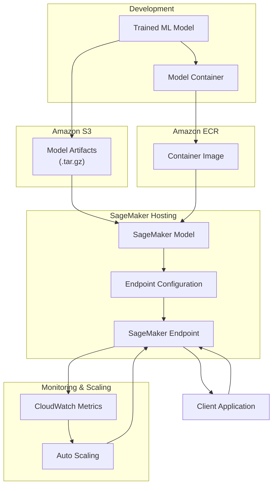

# SageMaker Model Endpoints for ML Inference

## Problem

Your data science team has trained and validated machine learning models in development environments, but you need to deploy these models to production with reliable, scalable inference capabilities. You require endpoints that can handle variable traffic loads, provide low-latency predictions, and integrate seamlessly with your existing applications while maintaining security and monitoring best practices.

## Solution

Deploy machine learning models as scalable, managed endpoints using Amazon SageMaker real-time hosting services. SageMaker endpoints provide fully managed infrastructure with automatic scaling, built-in monitoring, and support for A/B testing. The solution includes model packaging in containers, endpoint configuration with auto-scaling policies, and comprehensive monitoring dashboards.



## Prerequisites

1. AWS account with SageMaker, ECR, and IAM permissions
2. Trained machine learning model (pickle, joblib, or framework-specific format)
3. Docker installed locally for containerization
4. Python 3.8+ with boto3 and sagemaker SDK installed
5. AWS CLI version 2 configured with appropriate credentials
6. Estimated cost: $2-10 per hour depending on instance type and traffic

## Preparation

Set up the foundational infrastructure and prepare your model for deployment:

```bash
# Set up environment variables
REGION=${AWS_REGION:-us-east-1}
ACCOUNT_ID=$AWS_ACCOUNT_ID
MODEL_NAME="sklearn-iris-classifier"
ENDPOINT_NAME="iris-prediction-endpoint"
ECR_REPOSITORY_NAME="sagemaker-sklearn-inference"

# Create ECR repository for our custom inference image
aws ecr create-repository \
	--repository-name $ECR_REPOSITORY_NAME \
	--image-scanning-configuration scanOnPush=true \
	--region $REGION

# Get ECR login credentials
aws ecr get-login-password --region $REGION | \
	docker login --username AWS --password-stdin \
	$ACCOUNT_ID.dkr.ecr.$REGION.amazonaws.com

# Create S3 bucket for model artifacts
BUCKET_NAME="sagemaker-models-$(aws secretsmanager \
	get-random-password --exclude-punctuation \
	--exclude-uppercase --password-length 8 \
	--query 'RandomPassword' --output text)"

aws s3 mb s3://$BUCKET_NAME --region $REGION

# Export variables for later steps
export REGION ACCOUNT_ID MODEL_NAME ENDPOINT_NAME
export ECR_REPOSITORY_NAME BUCKET_NAME
```

Create the SageMaker execution role:

```bash
# Create trust policy for SageMaker
cat > sagemaker-trust-policy.json << 'EOF'
{
  "Version": "2012-10-17",
  "Statement": [
    {
      "Effect": "Allow",
      "Principal": {
        "Service": "sagemaker.amazonaws.com"
      },
      "Action": "sts:AssumeRole"
    }
  ]
}
EOF

# Create SageMaker execution role
ROLE_NAME="SageMakerExecutionRole-$(date +%s)"
aws iam create-role \
	--role-name $ROLE_NAME \
	--assume-role-policy-document file://sagemaker-trust-policy.json

# Attach necessary policies
aws iam attach-role-policy \
	--role-name $ROLE_NAME \
	--policy-arn arn:aws:iam::aws:policy/AmazonSageMakerFullAccess

aws iam attach-role-policy \
	--role-name $ROLE_NAME \
	--policy-arn arn:aws:iam::aws:policy/AmazonS3FullAccess

# Get role ARN
ROLE_ARN=$(aws iam get-role --role-name $ROLE_NAME \
	--query 'Role.Arn' --output text)

export ROLE_NAME ROLE_ARN
```

## Steps

1. **Create and containerize your inference code with a sample scikit-learn model**:

   This step demonstrates how to train a machine learning model and prepare it for production deployment. We'll use a classic iris classification problem to create a robust model that showcases real-world ML deployment patterns including proper model serialization and validation.

   ```bash
   # Create model training script
   mkdir -p model-training
   cat > model-training/train_model.py << 'EOF'
   import pickle
   import numpy as np
   from sklearn.datasets import load_iris
   from sklearn.ensemble import RandomForestClassifier
   from sklearn.model_selection import train_test_split
   from sklearn.metrics import accuracy_score
   
   # Load and prepare data
   iris = load_iris()
   X_train, X_test, y_train, y_test = train_test_split(
       iris.data, iris.target, test_size=0.2, random_state=42
   )
   
   # Train model
   model = RandomForestClassifier(n_estimators=100, random_state=42)
   model.fit(X_train, y_train)
   
   # Validate model
   predictions = model.predict(X_test)
   accuracy = accuracy_score(y_test, predictions)
   print(f"Model accuracy: {accuracy:.3f}")
   
   # Save model
   with open('model.pkl', 'wb') as f:
       pickle.dump(model, f)
   
   print("Model saved as model.pkl")
   EOF
   
   # Train and save the model
   cd model-training
   python train_model.py
   cd ..
   ```

2. **Create the inference container with custom prediction logic**:

   Building a custom inference container gives you complete control over the prediction pipeline, including preprocessing, model loading, and response formatting. This approach enables integration with any ML framework while maintaining production-grade standards for error handling and logging.

   ```bash
   # Create container directory structure
   mkdir -p container/code
   
   # Create inference script
   cat > container/code/predictor.py << 'EOF'
   import pickle
   import json
   import numpy as np
   import os
   from flask import Flask, request, jsonify
   import logging
   
   # Configure logging
   logging.basicConfig(level=logging.INFO)
   logger = logging.getLogger(__name__)
   
   app = Flask(__name__)
   
   class ModelHandler:
       def __init__(self):
           self.model = None
           self.class_names = ['setosa', 'versicolor', 'virginica']
       
       def load_model(self):
           """Load the model from the model directory"""
           model_path = '/opt/ml/model/model.pkl'
           if os.path.exists(model_path):
               with open(model_path, 'rb') as f:
                   self.model = pickle.load(f)
               logger.info("Model loaded successfully")
           else:
               raise Exception(f"Model file not found at {model_path}")
       
       def predict(self, data):
           """Make predictions on input data"""
           if self.model is None:
               raise Exception("Model not loaded")
           
           # Convert input to numpy array
           input_data = np.array(data).reshape(-1, 4)
           
           # Make predictions
           predictions = self.model.predict(input_data)
           probabilities = self.model.predict_proba(input_data)
           
           # Format results
           results = []
           for i, pred in enumerate(predictions):
               results.append({
                   'predicted_class': self.class_names[pred],
                   'predicted_class_index': int(pred),
                   'probabilities': {
                       self.class_names[j]: float(prob) 
                       for j, prob in enumerate(probabilities[i])
                   }
               })
           
           return results
   
   # Initialize model handler
   model_handler = ModelHandler()
   
   @app.route('/ping', methods=['GET'])
   def ping():
       """Health check endpoint"""
       status = 200 if model_handler.model is not None else 404
       return '', status
   
   @app.route('/invocations', methods=['POST'])
   def invocations():
       """Prediction endpoint"""
       try:
           # Parse input data
           input_data = request.get_json()
           
           if 'instances' not in input_data:
               return jsonify({'error': 'Input must contain "instances" key'}), 400
           
           # Make predictions
           predictions = model_handler.predict(input_data['instances'])
           
           return jsonify({'predictions': predictions})
       
       except Exception as e:
           logger.error(f"Prediction error: {str(e)}")
           return jsonify({'error': str(e)}), 500
   
   if __name__ == '__main__':
       # Load model at startup
       model_handler.load_model()
       
       # Start Flask server
       app.run(host='0.0.0.0', port=8080)
   EOF
   
   # Create Dockerfile
   cat > container/Dockerfile << 'EOF'
   FROM python:3.9-slim
   
   # Install system dependencies
   RUN apt-get update && apt-get install -y \
       build-essential \
       && rm -rf /var/lib/apt/lists/*
   
   # Install Python dependencies
   RUN pip install --no-cache-dir \
       flask==2.3.3 \
       scikit-learn==1.3.0 \
       numpy==1.24.3 \
       gunicorn==21.2.0
   
   # Copy prediction code
   COPY code /opt/ml/code
   WORKDIR /opt/ml/code
   
   # Set environment variables
   ENV PYTHONUNBUFFERED=TRUE
   ENV PYTHONDONTWRITEBYTECODE=TRUE
   ENV PATH="/opt/ml/code:${PATH}"
   
   # Expose port
   EXPOSE 8080
   
   # Define entrypoint
   ENTRYPOINT ["python", "predictor.py"]
   EOF
   ```

   > **Note**: The inference container follows SageMaker conventions with `/ping` for health checks and `/invocations` for predictions. The model is loaded from `/opt/ml/model/` where SageMaker automatically extracts your model artifacts. Learn more about [SageMaker inference containers](https://docs.aws.amazon.com/sagemaker/latest/dg/your-algorithms-inference-code.html).

3. **Build and push the container image to Amazon ECR**:

   Amazon ECR provides a secure, scalable container registry that integrates seamlessly with SageMaker. By storing your inference containers in ECR, you ensure they're available across your AWS environment with proper access controls and vulnerability scanning. This containerization approach enables consistent deployments across development, staging, and production environments while maintaining version control of your ML inference code.

   ```bash
   # Build the container image
   docker build -t $ECR_REPOSITORY_NAME container/
   
   # Tag for ECR
   ECR_IMAGE_URI="$ACCOUNT_ID.dkr.ecr.$REGION.amazonaws.com/$ECR_REPOSITORY_NAME:latest"
   docker tag $ECR_REPOSITORY_NAME:latest $ECR_IMAGE_URI
   
   # Push to ECR
   docker push $ECR_IMAGE_URI
   
   echo "Container image pushed to: $ECR_IMAGE_URI"
   export ECR_IMAGE_URI
   ```

   The container image is now stored in ECR and ready for SageMaker deployment. ECR automatically scans for vulnerabilities and provides immutable image tags, ensuring your production inference environment maintains security and consistency standards required for enterprise ML deployments.

4. **Package and upload the trained model to S3**:

   Model artifacts must be packaged as tar.gz files for SageMaker deployment. This standardized format ensures consistent model loading across different runtime environments and enables version control of your trained models.

   ```bash
   # Create model archive
   cd model-training
   tar -czf model.tar.gz model.pkl
   aws s3 cp model.tar.gz s3://$BUCKET_NAME/model.tar.gz
   cd ..
   
   MODEL_DATA_URL="s3://$BUCKET_NAME/model.tar.gz"
   echo "Model uploaded to: $MODEL_DATA_URL"
   export MODEL_DATA_URL
   ```

5. **Create the SageMaker model**:

   The SageMaker model object combines your container image with your trained model artifacts. This creates a deployable unit that can be used across multiple endpoint configurations, enabling A/B testing and blue-green deployments.

   ```bash
   aws sagemaker create-model \
   	--model-name $MODEL_NAME \
   	--primary-container Image=$ECR_IMAGE_URI,ModelDataUrl=$MODEL_DATA_URL \
   	--execution-role-arn $ROLE_ARN \
   	--region $REGION
   
   echo "SageMaker model created: $MODEL_NAME"
   ```

6. **Create an endpoint configuration with auto-scaling settings**:

   Endpoint configurations define the infrastructure specifications for your model hosting, including instance types, initial capacity, and traffic distribution. This separation between model definition and hosting configuration enables flexible deployment strategies like A/B testing, canary deployments, and blue-green rollouts. The configuration acts as a blueprint that can be reused across multiple endpoints, promoting consistency and operational efficiency in your ML deployment pipeline.

   ```bash
   ENDPOINT_CONFIG_NAME="${MODEL_NAME}-config"
   
   aws sagemaker create-endpoint-config \
   	--endpoint-config-name $ENDPOINT_CONFIG_NAME \
   	--production-variants \
   	VariantName=primary,ModelName=$MODEL_NAME,InitialInstanceCount=1,InstanceType=ml.t2.medium,InitialVariantWeight=1.0 \
   	--region $REGION
   
   echo "Endpoint configuration created: $ENDPOINT_CONFIG_NAME"
   export ENDPOINT_CONFIG_NAME
   ```

   The endpoint configuration is now established with specifications for hosting your model. This configuration determines the compute resources, scaling behavior, and traffic allocation, providing the foundation for reliable, production-ready inference services that can adapt to changing business demands.

   > **Warning**: Choose appropriate instance types based on your model's computational requirements. ml.t2.medium is suitable for lightweight models, but complex deep learning models may require compute-optimized or GPU instances like ml.c5.xlarge or ml.p3.2xlarge.

7. **Deploy the endpoint**:

   Endpoint deployment typically takes 5-10 minutes as SageMaker provisions instances, downloads your container image, and performs health checks. During this time, SageMaker ensures your endpoint is ready to handle production traffic with proper load balancing and failover capabilities.

   ```bash
   aws sagemaker create-endpoint \
   	--endpoint-name $ENDPOINT_NAME \
   	--endpoint-config-name $ENDPOINT_CONFIG_NAME \
   	--region $REGION
   
   echo "Creating endpoint: $ENDPOINT_NAME"
   echo "This will take 5-10 minutes..."
   
   # Wait for endpoint to be in service
   aws sagemaker wait endpoint-in-service \
   	--endpoint-name $ENDPOINT_NAME \
   	--region $REGION
   
   echo "Endpoint is now in service!"
   ```

8. **Configure auto-scaling for the endpoint**:

   Auto-scaling ensures your endpoints can handle traffic spikes while minimizing costs during low-usage periods. SageMaker uses CloudWatch metrics to automatically add or remove instances based on invocation patterns, maintaining consistent performance across varying workloads.

   ```bash
   # Register scalable target
   aws application-autoscaling register-scalable-target \
   	--service-namespace sagemaker \
   	--resource-id endpoint/$ENDPOINT_NAME/variant/primary \
   	--scalable-dimension sagemaker:variant:DesiredInstanceCount \
   	--min-capacity 1 \
   	--max-capacity 5 \
   	--region $REGION
   
   # Create scaling policy
   aws application-autoscaling put-scaling-policy \
   	--service-namespace sagemaker \
   	--resource-id endpoint/$ENDPOINT_NAME/variant/primary \
   	--scalable-dimension sagemaker:variant:DesiredInstanceCount \
   	--policy-name iris-endpoint-scaling-policy \
   	--policy-type TargetTrackingScaling \
   	--target-tracking-scaling-policy-configuration \
   	'{"TargetValue":70.0,"PredefinedMetricSpecification":{"PredefinedMetricType":"SageMakerVariantInvocationsPerInstance"}}' \
   	--region $REGION
   
   echo "Auto-scaling configured for endpoint"
   ```

   > **Tip**: Monitor your scaling events through CloudWatch to fine-tune scaling policies. Consider using custom metrics for more sophisticated scaling decisions based on application-specific metrics like request queue length or response time. Learn more about [SageMaker endpoint auto-scaling](https://docs.aws.amazon.com/sagemaker/latest/dg/endpoint-auto-scaling.html).

## Validation & Testing

Verify that your SageMaker endpoint is working correctly:

1. **Test the endpoint with sample predictions**:

   ```bash
   # Create test data
   cat > test_payload.json << 'EOF'
   {
     "instances": [
       [5.1, 3.5, 1.4, 0.2],
       [6.7, 3.1, 4.4, 1.4],
       [6.3, 3.3, 6.0, 2.5]
     ]
   }
   EOF
   
   # Test prediction via AWS CLI
   aws sagemaker-runtime invoke-endpoint \
   	--endpoint-name $ENDPOINT_NAME \
   	--content-type application/json \
   	--body fileb://test_payload.json \
   	--region $REGION \
   	prediction_output.json
   
   # Display results
   echo "Prediction results:"
   cat prediction_output.json | python -m json.tool
   ```

   Expected output:
   ```json
   {
     "predictions": [
       {
         "predicted_class": "setosa",
         "predicted_class_index": 0,
         "probabilities": {
           "setosa": 1.0,
           "versicolor": 0.0,
           "virginica": 0.0
         }
       },
       {
         "predicted_class": "versicolor",
         "predicted_class_index": 1,
         "probabilities": {
           "setosa": 0.0,
           "versicolor": 0.97,
           "virginica": 0.03
         }
       },
       {
         "predicted_class": "virginica",
         "predicted_class_index": 2,
         "probabilities": {
           "setosa": 0.0,
           "versicolor": 0.02,
           "virginica": 0.98
         }
       }
     ]
   }
   ```

2. **Verify endpoint metrics in CloudWatch**:

   ```bash
   # Check endpoint status
   aws sagemaker describe-endpoint \
   	--endpoint-name $ENDPOINT_NAME \
   	--query 'EndpointStatus' \
   	--output text
   
   # View recent invocations metric
   aws cloudwatch get-metric-statistics \
   	--namespace AWS/SageMaker \
   	--metric-name Invocations \
   	--dimensions Name=EndpointName,Value=$ENDPOINT_NAME Name=VariantName,Value=primary \
   	--start-time $(date -u -d '1 hour ago' +%Y-%m-%dT%H:%M:%S) \
   	--end-time $(date -u +%Y-%m-%dT%H:%M:%S) \
   	--period 300 \
   	--statistics Sum \
   	--region $REGION
   ```

## Cleanup

Remove all created resources to avoid ongoing charges:

```bash
# Delete the endpoint (this stops billing for inference instances)
aws sagemaker delete-endpoint \
	--endpoint-name $ENDPOINT_NAME \
	--region $REGION

echo "Waiting for endpoint deletion..."
aws sagemaker wait endpoint-deleted \
	--endpoint-name $ENDPOINT_NAME \
	--region $REGION

# Delete endpoint configuration
aws sagemaker delete-endpoint-config \
	--endpoint-config-name $ENDPOINT_CONFIG_NAME \
	--region $REGION

# Delete the model
aws sagemaker delete-model \
	--model-name $MODEL_NAME \
	--region $REGION

# Delete auto-scaling configuration
aws application-autoscaling deregister-scalable-target \
	--service-namespace sagemaker \
	--resource-id endpoint/$ENDPOINT_NAME/variant/primary \
	--scalable-dimension sagemaker:variant:DesiredInstanceCount \
	--region $REGION

# Delete S3 bucket and contents
aws s3 rm s3://$BUCKET_NAME --recursive
aws s3 rb s3://$BUCKET_NAME

# Delete ECR repository
aws ecr delete-repository \
	--repository-name $ECR_REPOSITORY_NAME \
	--force \
	--region $REGION

# Delete IAM role and policies
aws iam detach-role-policy \
	--role-name $ROLE_NAME \
	--policy-arn arn:aws:iam::aws:policy/AmazonSageMakerFullAccess

aws iam detach-role-policy \
	--role-name $ROLE_NAME \
	--policy-arn arn:aws:iam::aws:policy/AmazonS3FullAccess

aws iam delete-role --role-name $ROLE_NAME

# Clean up local files
rm -rf container/ model-training/ *.json *.gz
```

## Discussion

Amazon SageMaker provides a comprehensive platform for deploying machine learning models at scale without the operational overhead of managing underlying infrastructure. The managed endpoint service handles provisioning, scaling, patching, and monitoring of the compute instances that serve your models. This abstraction allows data science teams to focus on model development and performance rather than infrastructure management.

The containerization approach demonstrated in this recipe provides maximum flexibility for model deployment. By creating custom inference containers, you can control the entire prediction pipeline, implement complex pre-processing logic, and integrate with existing frameworks and libraries. SageMaker's support for custom containers means you're not limited to specific frameworks - you can deploy TensorFlow, PyTorch, scikit-learn, XGBoost, or even proprietary models using the same infrastructure.

Auto-scaling capabilities ensure that your endpoints can handle variable traffic patterns cost-effectively. SageMaker automatically adjusts the number of instances based on traffic patterns, which is crucial for production applications with unpredictable loads. The integration with CloudWatch provides comprehensive monitoring and alerting capabilities, enabling proactive response to performance issues. For organizations implementing MLOps practices, SageMaker endpoints integrate seamlessly with CI/CD pipelines, enabling automated model deployment and A/B testing workflows.

Consider the cost implications of your instance choices. While larger instances provide better performance, they also cost more. Monitor your endpoint metrics to right-size your instances and optimize the balance between performance and cost. For variable workloads, consider implementing multiple endpoint configurations or using SageMaker Serverless Inference for truly on-demand scaling.

> **Warning**: Always implement proper error handling and input validation in your inference code. Malformed requests can cause endpoint failures that impact all traffic to that endpoint.

## Challenge

Implement a multi-model endpoint that can serve multiple versions of your iris classifier simultaneously, enabling A/B testing between different algorithms (e.g., Random Forest vs. Gradient Boosting). Add comprehensive logging and metrics collection to compare model performance, and create a simple web interface that demonstrates real-time predictions with confidence intervals and model explainability features using SHAP values.

## Infrastructure Code

*Infrastructure code will be generated after recipe approval.*