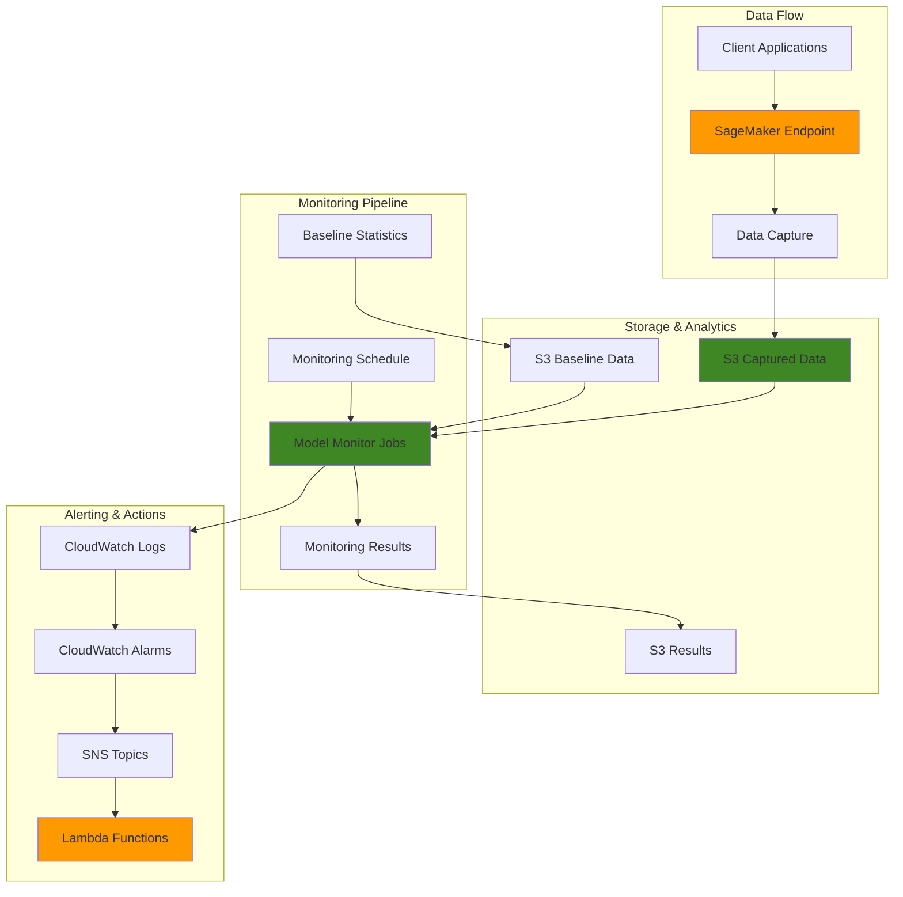

# SageMaker Model Monitoring and Drift Detection

## Problem

Organizations deploying machine learning models in production face significant challenges in maintaining model accuracy over time. As real-world data evolves, models often experience degradation in performance due to data drift, concept drift, or changes in underlying data distributions. Without continuous monitoring, businesses risk making decisions based on inaccurate predictions, leading to financial losses, customer dissatisfaction, and reduced operational efficiency. Manual monitoring is impractical for production environments where models serve thousands of predictions daily.

## Solution

Amazon SageMaker Model Monitor provides an automated solution for continuous monitoring of ML models in production. This solution implements comprehensive monitoring capabilities including data quality tracking, drift detection, and automated alerting. The architecture combines SageMaker's built-in monitoring capabilities with CloudWatch alarms and Lambda functions to create a complete MLOps monitoring pipeline that automatically detects when models need retraining or intervention.

## Architecture Diagram



## Prerequisites

1. AWS account with SageMaker, CloudWatch, S3, Lambda, and SNS permissions
2. AWS CLI v2 installed and configured (or AWS CloudShell)
3. Knowledge of machine learning concepts and SageMaker endpoints
4. An existing SageMaker model endpoint or ability to create one
5. Understanding of Python for Lambda functions
6. Estimated cost: $50-100 for resources created during this recipe

> **Note**: This recipe assumes you have basic familiarity with SageMaker and MLOps concepts. Some monitoring jobs may take 20-30 minutes to complete.

## Preparation

```bash
# Set environment variables
export AWS_REGION=$(aws configure get region)
export AWS_ACCOUNT_ID=$(aws sts get-caller-identity \
    --query Account --output text)

# Generate unique identifiers for resources
RANDOM_SUFFIX=$(aws secretsmanager get-random-password \
    --exclude-punctuation --exclude-uppercase \
    --password-length 6 --require-each-included-type \
    --output text --query RandomPassword)

# Set resource names
export MODEL_MONITOR_ROLE_NAME="ModelMonitorRole-${RANDOM_SUFFIX}"
export MODEL_MONITOR_BUCKET="model-monitor-${RANDOM_SUFFIX}"
export MONITORING_SCHEDULE_NAME="model-monitor-schedule-${RANDOM_SUFFIX}"
export BASELINE_JOB_NAME="model-monitor-baseline-${RANDOM_SUFFIX}"
export SNS_TOPIC_NAME="model-monitor-alerts-${RANDOM_SUFFIX}"
export LAMBDA_FUNCTION_NAME="model-monitor-handler-${RANDOM_SUFFIX}"

# Create S3 bucket for monitoring artifacts
aws s3 mb s3://${MODEL_MONITOR_BUCKET} \
    --region ${AWS_REGION}

# Create directory structure for monitoring data
aws s3api put-object \
    --bucket ${MODEL_MONITOR_BUCKET} \
    --key baseline-data/ \
    --region ${AWS_REGION}

aws s3api put-object \
    --bucket ${MODEL_MONITOR_BUCKET} \
    --key captured-data/ \
    --region ${AWS_REGION}

aws s3api put-object \
    --bucket ${MODEL_MONITOR_BUCKET} \
    --key monitoring-results/ \
    --region ${AWS_REGION}

echo "✅ Preparation complete"
```

## Steps

1. **Create IAM Role for Model Monitor**:

   IAM roles enable secure, temporary credential delegation to AWS services without hardcoding secrets. SageMaker Model Monitor requires specific permissions to access S3 buckets for data storage, CloudWatch for logging, and processing resources for analysis. The principle of least privilege ensures the monitoring service can only access the resources necessary for its operation, reducing security attack surfaces while maintaining operational functionality.

   ```bash
   # Create trust policy for Model Monitor
   cat > model-monitor-trust-policy.json << 'EOF'
   {
     "Version": "2012-10-17",
     "Statement": [
       {
         "Effect": "Allow",
         "Principal": {
           "Service": "sagemaker.amazonaws.com"
         },
         "Action": "sts:AssumeRole"
       }
     ]
   }
   EOF
   
   # Create the IAM role
   aws iam create-role \
       --role-name ${MODEL_MONITOR_ROLE_NAME} \
       --assume-role-policy-document file://model-monitor-trust-policy.json
   
   # Attach managed policies
   aws iam attach-role-policy \
       --role-name ${MODEL_MONITOR_ROLE_NAME} \
       --policy-arn arn:aws:iam::aws:policy/AmazonSageMakerFullAccess
   
   # Create custom policy for Model Monitor
   cat > model-monitor-policy.json << EOF
   {
     "Version": "2012-10-17",
     "Statement": [
       {
         "Effect": "Allow",
         "Action": [
           "s3:GetObject",
           "s3:PutObject",
           "s3:DeleteObject",
           "s3:ListBucket"
         ],
         "Resource": [
           "arn:aws:s3:::${MODEL_MONITOR_BUCKET}",
           "arn:aws:s3:::${MODEL_MONITOR_BUCKET}/*"
         ]
       },
       {
         "Effect": "Allow",
         "Action": [
           "logs:CreateLogGroup",
           "logs:CreateLogStream",
           "logs:PutLogEvents"
         ],
         "Resource": "*"
       }
     ]
   }
   EOF
   
   aws iam put-role-policy \
       --role-name ${MODEL_MONITOR_ROLE_NAME} \
       --policy-name ModelMonitorCustomPolicy \
       --policy-document file://model-monitor-policy.json
   
   # Get role ARN
   export MODEL_MONITOR_ROLE_ARN=$(aws iam get-role \
       --role-name ${MODEL_MONITOR_ROLE_NAME} \
       --query Role.Arn --output text)
   
   echo "✅ Created Model Monitor IAM role: ${MODEL_MONITOR_ROLE_ARN}"
   ```

   The IAM role is now established with scoped permissions for Model Monitor operations. This security foundation enables the monitoring service to process data and generate insights while maintaining strict access controls to your AWS resources.

2. **Create and Deploy a Sample Model Endpoint**:

   SageMaker endpoints provide real-time inference capabilities with automatic scaling, load balancing, and high availability. Data capture is essential for monitoring as it logs all inference requests and responses, creating the data foundation for drift detection. Enabling 100% sampling ensures comprehensive monitoring coverage, while the endpoint configuration establishes the runtime environment for model execution and data collection.

   ```bash
   # Create a simple model package for demonstration
   mkdir -p model-artifacts
   
   # Create a simple model script
   cat > model-artifacts/inference.py << 'EOF'
   import joblib
   import json
   import numpy as np
   
   def model_fn(model_dir):
       # Load a simple model (for demo purposes)
       return {"type": "demo_model"}
   
   def input_fn(request_body, request_content_type):
       if request_content_type == 'application/json':
           data = json.loads(request_body)
           return np.array(data['instances'])
       else:
           raise ValueError(f"Unsupported content type: {request_content_type}")
   
   def predict_fn(input_data, model):
       # Simple prediction logic for demo
       predictions = np.random.random(len(input_data))
       return predictions
   
   def output_fn(prediction, content_type):
       if content_type == 'application/json':
           return json.dumps({"predictions": prediction.tolist()})
       else:
           raise ValueError(f"Unsupported content type: {content_type}")
   EOF
   
   # Create model tarball
   cd model-artifacts
   tar -czf model.tar.gz inference.py
   cd ..
   
   # Upload model to S3
   aws s3 cp model-artifacts/model.tar.gz \
       s3://${MODEL_MONITOR_BUCKET}/model-artifacts/model.tar.gz
   
   # Create SageMaker model
   export MODEL_NAME="demo-model-${RANDOM_SUFFIX}"
   aws sagemaker create-model \
       --model-name ${MODEL_NAME} \
       --primary-container Image=763104351884.dkr.ecr.${AWS_REGION}.amazonaws.com/sklearn-inference:0.23-1-cpu-py3,ModelDataUrl=s3://${MODEL_MONITOR_BUCKET}/model-artifacts/model.tar.gz \
       --execution-role-arn ${MODEL_MONITOR_ROLE_ARN}
   
   # Create endpoint configuration with data capture
   export ENDPOINT_CONFIG_NAME="demo-endpoint-config-${RANDOM_SUFFIX}"
   aws sagemaker create-endpoint-config \
       --endpoint-config-name ${ENDPOINT_CONFIG_NAME} \
       --production-variants VariantName=Primary,ModelName=${MODEL_NAME},InitialInstanceCount=1,InstanceType=ml.t2.medium,InitialVariantWeight=1.0 \
       --data-capture-config EnableCapture=true,InitialSamplingPercentage=100,DestinationS3Uri=s3://${MODEL_MONITOR_BUCKET}/captured-data,KmsKeyId=,CaptureOptions=[{CaptureMode=Input},{CaptureMode=Output}],CaptureContentTypeHeader={}
   
   # Create endpoint
   export ENDPOINT_NAME="demo-endpoint-${RANDOM_SUFFIX}"
   aws sagemaker create-endpoint \
       --endpoint-name ${ENDPOINT_NAME} \
       --endpoint-config-name ${ENDPOINT_CONFIG_NAME}
   
   # Wait for endpoint to be in service
   aws sagemaker wait endpoint-in-service \
       --endpoint-name ${ENDPOINT_NAME}
   
   echo "✅ Created SageMaker endpoint: ${ENDPOINT_NAME}"
   ```

   The endpoint is now active and capturing all inference data to S3. This establishes the production inference environment and begins generating the captured data stream essential for monitoring model behavior and detecting potential drift over time.

3. **Create Baseline Statistics and Constraints**:

   Baseline establishment is the foundation of effective drift detection. Model Monitor analyzes historical training data to calculate statistical properties like mean, standard deviation, data types, and ranges for each feature. These baseline statistics serve as the reference point for comparing future inference data. Constraints define acceptable limits for data quality, enabling automated violation detection when incoming data deviates from expected patterns.

   ```bash
   # Create sample baseline data
   cat > baseline-data.csv << 'EOF'
   feature_1,feature_2,feature_3,target
   0.1,0.2,0.3,0.15
   0.2,0.3,0.4,0.25
   0.3,0.4,0.5,0.35
   0.4,0.5,0.6,0.45
   0.5,0.6,0.7,0.55
   0.6,0.7,0.8,0.65
   0.7,0.8,0.9,0.75
   0.8,0.9,1.0,0.85
   0.9,1.0,1.1,0.95
   1.0,1.1,1.2,1.05
   EOF
   
   # Upload baseline data to S3
   aws s3 cp baseline-data.csv \
       s3://${MODEL_MONITOR_BUCKET}/baseline-data/baseline-data.csv
   
   # Create baseline job using the built-in model monitor analyzer image
   MONITOR_IMAGE_URI="${AWS_ACCOUNT_ID}.dkr.ecr.${AWS_REGION}.amazonaws.com/sagemaker-model-monitor-analyzer"
   
   aws sagemaker create-processing-job \
       --processing-job-name ${BASELINE_JOB_NAME} \
       --processing-inputs Source=s3://${MODEL_MONITOR_BUCKET}/baseline-data,Destination=/opt/ml/processing/input,S3DataType=S3Prefix,S3InputMode=File,S3DataDistributionType=FullyReplicated,S3CompressionType=None \
       --processing-output-config Outputs=[{OutputName=statistics,S3Output={S3Uri=s3://${MODEL_MONITOR_BUCKET}/monitoring-results/statistics,LocalPath=/opt/ml/processing/output/statistics,S3UploadMode=EndOfJob}},{OutputName=constraints,S3Output={S3Uri=s3://${MODEL_MONITOR_BUCKET}/monitoring-results/constraints,LocalPath=/opt/ml/processing/output/constraints,S3UploadMode=EndOfJob}}] \
       --app-specification ImageUri=${MONITOR_IMAGE_URI} \
       --role-arn ${MODEL_MONITOR_ROLE_ARN} \
       --processing-resources ClusterConfig={InstanceType=ml.m5.xlarge,InstanceCount=1,VolumeSizeInGB=20}
   
   # Wait for baseline job to complete
   aws sagemaker wait processing-job-completed-or-stopped \
       --processing-job-name ${BASELINE_JOB_NAME}
   
   # Check job status
   aws sagemaker describe-processing-job \
       --processing-job-name ${BASELINE_JOB_NAME} \
       --query 'ProcessingJobStatus' --output text
   
   echo "✅ Baseline statistics and constraints created"
   ```

   The baseline processing job has generated comprehensive statistical profiles and constraints for your training data. These artifacts now provide the analytical foundation for ongoing drift detection, enabling Model Monitor to identify when production data patterns diverge from the expected baseline distributions.

4. **Generate Sample Traffic to Create Captured Data**:

   Captured data forms the operational dataset that Model Monitor analyzes for drift detection. By generating realistic inference traffic, we create the production data stream that will be compared against baseline statistics. Data variation in the requests simulates real-world usage patterns, ensuring the monitoring system has sufficient data diversity to demonstrate its analytical capabilities and establish meaningful drift detection thresholds.

   ```bash
   # Create sample inference data
   cat > sample-requests.json << 'EOF'
   {"instances": [[0.1, 0.2, 0.3], [0.4, 0.5, 0.6], [0.7, 0.8, 0.9]]}
   EOF
   
   # Send several requests to generate captured data
   for i in {1..10}; do
       aws sagemaker-runtime invoke-endpoint \
           --endpoint-name ${ENDPOINT_NAME} \
           --content-type application/json \
           --body fileb://sample-requests.json \
           response-${i}.json
       
       # Add some variation to the data
       python3 -c "
   import json
   import random
   data = {'instances': [[random.uniform(0, 1), random.uniform(0, 1), random.uniform(0, 1)] for _ in range(3)]}
   with open('sample-requests.json', 'w') as f:
       json.dump(data, f)
   "
       sleep 2
   done
   
   # Wait for data capture to process
   sleep 30
   
   # Verify captured data exists
   aws s3 ls s3://${MODEL_MONITOR_BUCKET}/captured-data/ --recursive
   
   echo "✅ Generated sample traffic and captured data"
   ```

   The endpoint has successfully captured inference data to S3, creating the operational dataset required for monitoring analysis. This captured data stream enables Model Monitor to perform statistical comparisons and identify data quality issues or distribution shifts in real-time production usage.

5. **Create Data Quality Monitoring Schedule**:

   Monitoring schedules automate the drift detection process by running regular analysis jobs on captured data. The hourly schedule ensures timely detection of data quality issues while balancing computational costs. This schedule compares current inference data against established baselines, generating violation reports when statistical drift exceeds acceptable thresholds. Automated scheduling eliminates manual monitoring overhead and provides consistent surveillance of model performance.

   ```bash
   # Create monitoring schedule configuration
   cat > monitoring-schedule-config.json << EOF
   {
     "MonitoringScheduleName": "${MONITORING_SCHEDULE_NAME}",
     "MonitoringScheduleConfig": {
       "ScheduleConfig": {
         "ScheduleExpression": "cron(0 * * * ? *)"
       },
       "MonitoringJobDefinition": {
         "MonitoringInputs": [
           {
             "EndpointInput": {
               "EndpointName": "${ENDPOINT_NAME}",
               "LocalPath": "/opt/ml/processing/input/endpoint",
               "S3InputMode": "File",
               "S3DataDistributionType": "FullyReplicated"
             }
           }
         ],
         "MonitoringOutputConfig": {
           "MonitoringOutputs": [
             {
               "S3Output": {
                 "S3Uri": "s3://${MODEL_MONITOR_BUCKET}/monitoring-results/data-quality",
                 "LocalPath": "/opt/ml/processing/output",
                 "S3UploadMode": "EndOfJob"
               }
             }
           ]
         },
         "MonitoringResources": {
           "ClusterConfig": {
             "InstanceType": "ml.m5.xlarge",
             "InstanceCount": 1,
             "VolumeSizeInGB": 20
           }
         },
         "MonitoringAppSpecification": {
           "ImageUri": "${MONITOR_IMAGE_URI}"
         },
         "BaselineConfig": {
           "StatisticsResource": {
             "S3Uri": "s3://${MODEL_MONITOR_BUCKET}/monitoring-results/statistics"
           },
           "ConstraintsResource": {
             "S3Uri": "s3://${MODEL_MONITOR_BUCKET}/monitoring-results/constraints"
           }
         },
         "RoleArn": "${MODEL_MONITOR_ROLE_ARN}"
       }
     }
   }
   EOF
   
   # Create the monitoring schedule
   aws sagemaker create-monitoring-schedule \
       --cli-input-json file://monitoring-schedule-config.json
   
   echo "✅ Created data quality monitoring schedule"
   ```

   The data quality monitoring schedule is now active and will execute hourly analysis jobs to detect drift patterns. This automated surveillance system continuously evaluates incoming data against baseline expectations, providing early warning signals when model inputs deviate from expected distributions.

6. **Create SNS Topic for Alerts**:

   Amazon SNS provides reliable message delivery for real-time alerting when drift is detected. Email subscriptions ensure immediate notification of monitoring violations, enabling rapid response to model performance issues. This notification system integrates with CloudWatch alarms to create a comprehensive alerting pipeline that connects drift detection events to human operators and automated response systems, forming the critical communication backbone for MLOps incident management.

   ```bash
   # Create SNS topic
   export SNS_TOPIC_ARN=$(aws sns create-topic \
       --name ${SNS_TOPIC_NAME} \
       --query TopicArn --output text)
   
   # Subscribe your email to the topic (replace with your email)
   read -p "Enter your email address for alerts: " EMAIL_ADDRESS
   aws sns subscribe \
       --topic-arn ${SNS_TOPIC_ARN} \
       --protocol email \
       --notification-endpoint ${EMAIL_ADDRESS}
   
   echo "✅ Created SNS topic: ${SNS_TOPIC_ARN}"
   echo "Check your email and confirm the subscription"
   ```

   The SNS topic is configured and ready to deliver real-time alerts. This notification infrastructure ensures that drift detection events are immediately communicated to stakeholders, enabling rapid response to model performance degradation and maintaining service quality standards.

7. **Create Lambda Function for Automated Response**:

   AWS Lambda enables serverless event-driven responses to monitoring alerts, providing automatic scaling and cost-effective execution. This function processes CloudWatch alarm notifications and can trigger additional automated responses like retraining pipelines or incident escalation. Serverless architecture ensures the response system is always available without infrastructure management overhead, while environment variables securely provide configuration data without hardcoding sensitive information in function code.

   ```bash
   # Create Lambda function code
   cat > lambda-function.py << 'EOF'
   import json
   import boto3
   import os
   
   def lambda_handler(event, context):
       """
       Lambda function to handle Model Monitor alerts
       """
       sns = boto3.client('sns')
       sagemaker = boto3.client('sagemaker')
       
       # Parse the CloudWatch alarm from SNS
       message = json.loads(event['Records'][0]['Sns']['Message'])
       
       alarm_name = message['AlarmName']
       alarm_description = message['AlarmDescription']
       new_state = message['NewStateValue']
       
       print(f"Received alarm: {alarm_name} - {new_state}")
       
       # Check if this is a model drift alarm
       if new_state == 'ALARM' and 'ModelMonitor' in alarm_name:
           # Log the drift detection
           print(f"Model drift detected: {alarm_description}")
           
           # Send notification
           notification_message = f"""
           Model Monitor Alert:
           
           Alarm: {alarm_name}
           Status: {new_state}
           Description: {alarm_description}
           
           Action Required: Review monitoring results and consider retraining the model.
           """
           
           sns.publish(
               TopicArn=os.environ['SNS_TOPIC_ARN'],
               Subject='Model Monitor Alert - Action Required',
               Message=notification_message
           )
           
           # Additional automated actions could be added here:
           # - Trigger model retraining pipeline
           # - Update model endpoint configuration
           # - Send alerts to monitoring systems
           
       return {
           'statusCode': 200,
           'body': json.dumps('Alert processed successfully')
       }
   EOF
   
   # Create Lambda deployment package
   zip lambda-function.zip lambda-function.py
   
   # Create Lambda execution role
   cat > lambda-trust-policy.json << 'EOF'
   {
     "Version": "2012-10-17",
     "Statement": [
       {
         "Effect": "Allow",
         "Principal": {
           "Service": "lambda.amazonaws.com"
         },
         "Action": "sts:AssumeRole"
       }
     ]
   }
   EOF
   
   export LAMBDA_ROLE_NAME="ModelMonitorLambdaRole-${RANDOM_SUFFIX}"
   aws iam create-role \
       --role-name ${LAMBDA_ROLE_NAME} \
       --assume-role-policy-document file://lambda-trust-policy.json
   
   # Attach basic Lambda execution policy
   aws iam attach-role-policy \
       --role-name ${LAMBDA_ROLE_NAME} \
       --policy-arn arn:aws:iam::aws:policy/service-role/AWSLambdaBasicExecutionRole
   
   # Create custom policy for Lambda
   cat > lambda-policy.json << EOF
   {
     "Version": "2012-10-17",
     "Statement": [
       {
         "Effect": "Allow",
         "Action": [
           "sns:Publish"
         ],
         "Resource": "${SNS_TOPIC_ARN}"
       },
       {
         "Effect": "Allow",
         "Action": [
           "sagemaker:DescribeMonitoringSchedule",
           "sagemaker:DescribeProcessingJob"
         ],
         "Resource": "*"
       }
     ]
   }
   EOF
   
   aws iam put-role-policy \
       --role-name ${LAMBDA_ROLE_NAME} \
       --policy-name ModelMonitorLambdaPolicy \
       --policy-document file://lambda-policy.json
   
   # Get Lambda role ARN
   export LAMBDA_ROLE_ARN=$(aws iam get-role \
       --role-name ${LAMBDA_ROLE_NAME} \
       --query Role.Arn --output text)
   
   # Wait for role propagation
   sleep 10
   
   # Create Lambda function
   aws lambda create-function \
       --function-name ${LAMBDA_FUNCTION_NAME} \
       --runtime python3.9 \
       --role ${LAMBDA_ROLE_ARN} \
       --handler lambda-function.lambda_handler \
       --zip-file fileb://lambda-function.zip \
       --environment Variables={SNS_TOPIC_ARN=${SNS_TOPIC_ARN}}
   
   echo "✅ Created Lambda function for automated response"
   ```

   The Lambda function is now deployed and ready to process monitoring alerts. This serverless response system can be extended to implement sophisticated incident response workflows, including automatic model retraining, endpoint traffic shifting, or integration with external monitoring systems for comprehensive MLOps automation.

8. **Create CloudWatch Alarms for Monitoring**:

   CloudWatch alarms provide intelligent threshold monitoring by evaluating metrics against defined criteria and triggering automated responses. These alarms monitor constraint violations and job failures to ensure comprehensive coverage of monitoring health. The integration with SNS and Lambda creates an event-driven alerting pipeline that responds immediately to drift detection, minimizing the time between issue identification and remediation actions.

   ```bash
   # Create CloudWatch alarm for constraint violations
   aws cloudwatch put-metric-alarm \
       --alarm-name "ModelMonitor-ConstraintViolations-${RANDOM_SUFFIX}" \
       --alarm-description "Alert when model monitor detects constraint violations" \
       --metric-name "constraint_violations" \
       --namespace "AWS/SageMaker/ProcessingJob" \
       --statistic Sum \
       --period 300 \
       --threshold 1 \
       --comparison-operator GreaterThanOrEqualToThreshold \
       --evaluation-periods 1 \
       --alarm-actions ${SNS_TOPIC_ARN} \
       --dimensions Name=ProcessingJobName,Value=${MONITORING_SCHEDULE_NAME}
   
   # Create alarm for monitoring job failures
   aws cloudwatch put-metric-alarm \
       --alarm-name "ModelMonitor-JobFailures-${RANDOM_SUFFIX}" \
       --alarm-description "Alert when model monitor jobs fail" \
       --metric-name "Failures" \
       --namespace "AWS/SageMaker/ProcessingJob" \
       --statistic Sum \
       --period 300 \
       --threshold 1 \
       --comparison-operator GreaterThanOrEqualToThreshold \
       --evaluation-periods 1 \
       --alarm-actions ${SNS_TOPIC_ARN} \
       --dimensions Name=ProcessingJobName,Value=${MONITORING_SCHEDULE_NAME}
   
   # Subscribe Lambda to SNS topic
   export LAMBDA_ARN=$(aws lambda get-function \
       --function-name ${LAMBDA_FUNCTION_NAME} \
       --query Configuration.FunctionArn --output text)
   
   aws sns subscribe \
       --topic-arn ${SNS_TOPIC_ARN} \
       --protocol lambda \
       --notification-endpoint ${LAMBDA_ARN}
   
   # Add permission for SNS to invoke Lambda
   aws lambda add-permission \
       --function-name ${LAMBDA_FUNCTION_NAME} \
       --statement-id sns-invoke \
       --action lambda:InvokeFunction \
       --principal sns.amazonaws.com \
       --source-arn ${SNS_TOPIC_ARN}
   
   echo "✅ Created CloudWatch alarms and connected to Lambda"
   ```

   The CloudWatch alarms are now actively monitoring for constraint violations and job failures. This creates a robust alerting system that detects both data quality issues and operational problems, ensuring comprehensive monitoring coverage and rapid incident response through automated Lambda function execution.

9. **Create Model Quality Monitoring Schedule**:

   Model quality monitoring extends beyond data drift to evaluate prediction accuracy when ground truth labels become available. This complementary monitoring approach measures model performance degradation by comparing predictions against actual outcomes. Daily scheduling provides sufficient frequency for performance trend analysis while reducing computational costs compared to the hourly data quality monitoring, creating a balanced monitoring strategy that covers both input data quality and output prediction accuracy.

   ```bash
   # Create model quality monitoring schedule
   export MODEL_QUALITY_SCHEDULE_NAME="model-quality-schedule-${RANDOM_SUFFIX}"
   
   cat > model-quality-schedule.json << EOF
   {
     "MonitoringScheduleName": "${MODEL_QUALITY_SCHEDULE_NAME}",
     "MonitoringScheduleConfig": {
       "ScheduleConfig": {
         "ScheduleExpression": "cron(0 6 * * ? *)"
       },
       "MonitoringJobDefinition": {
         "MonitoringInputs": [
           {
             "EndpointInput": {
               "EndpointName": "${ENDPOINT_NAME}",
               "LocalPath": "/opt/ml/processing/input/endpoint",
               "S3InputMode": "File",
               "S3DataDistributionType": "FullyReplicated"
             }
           }
         ],
         "MonitoringOutputConfig": {
           "MonitoringOutputs": [
             {
               "S3Output": {
                 "S3Uri": "s3://${MODEL_MONITOR_BUCKET}/monitoring-results/model-quality",
                 "LocalPath": "/opt/ml/processing/output",
                 "S3UploadMode": "EndOfJob"
               }
             }
           ]
         },
         "MonitoringResources": {
           "ClusterConfig": {
             "InstanceType": "ml.m5.xlarge",
             "InstanceCount": 1,
             "VolumeSizeInGB": 20
           }
         },
         "MonitoringAppSpecification": {
           "ImageUri": "${MONITOR_IMAGE_URI}"
         },
         "RoleArn": "${MODEL_MONITOR_ROLE_ARN}"
       }
     }
   }
   EOF
   
   aws sagemaker create-monitoring-schedule \
       --cli-input-json file://model-quality-schedule.json
   
   echo "✅ Created model quality monitoring schedule"
   ```

   The model quality monitoring schedule complements data quality monitoring by focusing on prediction accuracy. This dual-monitoring approach provides comprehensive model health surveillance, enabling detection of both input data changes and model performance degradation for complete MLOps visibility.

10. **Set Up Custom Metrics and Dashboards**:

    CloudWatch Dashboards provide centralized visibility into model monitoring metrics and logs, enabling rapid analysis of monitoring trends and quick identification of performance issues. Custom dashboards combine quantitative metrics with qualitative log analysis, creating a comprehensive view of model health. This visual monitoring approach accelerates incident response by presenting complex monitoring data in easily interpretable formats for both technical teams and business stakeholders.

    ```bash
    # Create custom CloudWatch dashboard
    cat > dashboard-config.json << EOF
    {
      "widgets": [
        {
          "type": "metric",
          "properties": {
            "metrics": [
              [ "AWS/SageMaker/ProcessingJob", "Failures", "ProcessingJobName", "${MONITORING_SCHEDULE_NAME}" ]
            ],
            "period": 300,
            "stat": "Sum",
            "region": "${AWS_REGION}",
            "title": "Model Monitor Job Failures"
          }
        },
        {
          "type": "log",
          "properties": {
            "query": "SOURCE '/aws/sagemaker/ProcessingJobs' | fields @timestamp, @message | filter @message like /constraint/ | sort @timestamp desc",
            "region": "${AWS_REGION}",
            "title": "Model Monitor Constraint Violations"
          }
        }
      ]
    }
    EOF
    
    # Create the dashboard
    aws cloudwatch put-dashboard \
        --dashboard-name "ModelMonitor-Dashboard-${RANDOM_SUFFIX}" \
        --dashboard-body file://dashboard-config.json
    
    echo "✅ Created CloudWatch dashboard for monitoring"
    ```

    The monitoring dashboard provides real-time visibility into model performance metrics and operational logs. This centralized view enables rapid identification of trends, anomalies, and system health issues, supporting proactive model management and efficient incident response workflows.

11. **Test the Monitoring System**:

    System testing validates the complete monitoring pipeline by generating synthetic drift scenarios and verifying automated response mechanisms. Anomalous data injection simulates real-world drift conditions, testing the system's ability to detect distribution changes and trigger appropriate alerts. This end-to-end validation ensures the monitoring infrastructure performs correctly under operational conditions and confirms that alert pathways function as designed for production readiness.

    ```bash
    # Generate some anomalous data to test drift detection
    python3 -c "
    import json
    import random
    
    # Create significantly different data patterns
    anomalous_data = {
        'instances': [
            [random.uniform(10, 20), random.uniform(10, 20), random.uniform(10, 20)]
            for _ in range(5)
        ]
    }
    
    with open('anomalous-requests.json', 'w') as f:
        json.dump(anomalous_data, f)
    "
    
    # Send anomalous requests
    for i in {1..10}; do
        aws sagemaker-runtime invoke-endpoint \
            --endpoint-name ${ENDPOINT_NAME} \
            --content-type application/json \
            --body fileb://anomalous-requests.json \
            anomalous-response-${i}.json
        sleep 1
    done
    
    # Wait for data capture to process
    sleep 30
    
    # Manually trigger a monitoring job to test the system
    MANUAL_JOB_NAME="manual-monitor-test-${RANDOM_SUFFIX}"
    
    cat > manual-monitor-job.json << EOF
    {
      "ProcessingJobName": "${MANUAL_JOB_NAME}",
      "ProcessingInputs": [
        {
          "InputName": "endpoint_input",
          "S3Input": {
            "S3Uri": "s3://${MODEL_MONITOR_BUCKET}/captured-data",
            "LocalPath": "/opt/ml/processing/input/endpoint",
            "S3DataType": "S3Prefix",
            "S3InputMode": "File",
            "S3DataDistributionType": "FullyReplicated"
          }
        },
        {
          "InputName": "baseline",
          "S3Input": {
            "S3Uri": "s3://${MODEL_MONITOR_BUCKET}/monitoring-results/statistics",
            "LocalPath": "/opt/ml/processing/baseline/stats",
            "S3DataType": "S3Prefix",
            "S3InputMode": "File",
            "S3DataDistributionType": "FullyReplicated"
          }
        },
        {
          "InputName": "constraints",
          "S3Input": {
            "S3Uri": "s3://${MODEL_MONITOR_BUCKET}/monitoring-results/constraints",
            "LocalPath": "/opt/ml/processing/baseline/constraints",
            "S3DataType": "S3Prefix",
            "S3InputMode": "File",
            "S3DataDistributionType": "FullyReplicated"
          }
        }
      ],
      "ProcessingOutputConfig": {
        "Outputs": [
          {
            "OutputName": "result",
            "S3Output": {
              "S3Uri": "s3://${MODEL_MONITOR_BUCKET}/monitoring-results/manual-test",
              "LocalPath": "/opt/ml/processing/output",
              "S3UploadMode": "EndOfJob"
            }
          }
        ]
      },
      "ProcessingResources": {
        "ClusterConfig": {
          "InstanceType": "ml.m5.xlarge",
          "InstanceCount": 1,
          "VolumeSizeInGB": 20
        }
      },
      "AppSpecification": {
        "ImageUri": "${MONITOR_IMAGE_URI}"
      },
      "RoleArn": "${MODEL_MONITOR_ROLE_ARN}"
    }
    EOF
    
    aws sagemaker create-processing-job \
        --cli-input-json file://manual-monitor-job.json
    
    echo "✅ Sent anomalous data and triggered manual monitoring job"
    echo "Monitor the processing job status in the AWS console"
    ```

    The monitoring system has been tested with artificially generated drift patterns. This validates the complete pipeline from data capture through drift detection to automated alerting, confirming the system is ready for production deployment and will effectively monitor real-world model performance.

> **Warning**: CloudWatch alarms may take several minutes to activate after creation. Monitor alarm states in the AWS console to verify proper configuration and metric data availability.

## Validation & Testing

1. **Verify monitoring schedule is active**:

   ```bash
   # Check monitoring schedule status
   aws sagemaker describe-monitoring-schedule \
       --monitoring-schedule-name ${MONITORING_SCHEDULE_NAME} \
       --query '{Status: MonitoringScheduleStatus, LastExecution: LastMonitoringExecutionSummary}'
   ```

   Expected output: Status should be "Scheduled" and show last execution details.

2. **Check captured data and monitoring results**:

   ```bash
   # Verify captured data exists
   aws s3 ls s3://${MODEL_MONITOR_BUCKET}/captured-data/ --recursive
   
   # Check monitoring results
   aws s3 ls s3://${MODEL_MONITOR_BUCKET}/monitoring-results/ --recursive
   ```

   Expected output: Should show captured data files and monitoring result files.

3. **Test CloudWatch alarms and notifications**:

   ```bash
   # Check CloudWatch alarms
   aws cloudwatch describe-alarms \
       --alarm-names "ModelMonitor-ConstraintViolations-${RANDOM_SUFFIX}" \
       --query 'MetricAlarms[0].{State: StateValue, Reason: StateReason}'
   
   # Test SNS notification
   aws sns publish \
       --topic-arn ${SNS_TOPIC_ARN} \
       --message "Test message from Model Monitor setup" \
       --subject "Model Monitor Test"
   ```

4. **Verify Lambda function integration**:

   ```bash
   # Check Lambda function logs
   aws logs describe-log-groups \
       --log-group-name-prefix "/aws/lambda/${LAMBDA_FUNCTION_NAME}"
   
   # Test Lambda function directly
   aws lambda invoke \
       --function-name ${LAMBDA_FUNCTION_NAME} \
       --payload '{"Records":[{"Sns":{"Message":"{\"AlarmName\":\"TestAlarm\",\"AlarmDescription\":\"Test drift detection\",\"NewStateValue\":\"ALARM\"}"}}]}' \
       test-response.json
   ```

## Cleanup

1. **Delete monitoring schedules**:

   ```bash
   # Stop and delete monitoring schedules
   aws sagemaker stop-monitoring-schedule \
       --monitoring-schedule-name ${MONITORING_SCHEDULE_NAME}
   
   aws sagemaker delete-monitoring-schedule \
       --monitoring-schedule-name ${MONITORING_SCHEDULE_NAME}
   
   aws sagemaker stop-monitoring-schedule \
       --monitoring-schedule-name ${MODEL_QUALITY_SCHEDULE_NAME}
   
   aws sagemaker delete-monitoring-schedule \
       --monitoring-schedule-name ${MODEL_QUALITY_SCHEDULE_NAME}
   
   echo "✅ Deleted monitoring schedules"
   ```

2. **Delete SageMaker resources**:

   ```bash
   # Delete endpoint
   aws sagemaker delete-endpoint \
       --endpoint-name ${ENDPOINT_NAME}
   
   # Delete endpoint configuration
   aws sagemaker delete-endpoint-config \
       --endpoint-config-name ${ENDPOINT_CONFIG_NAME}
   
   # Delete model
   aws sagemaker delete-model \
       --model-name ${MODEL_NAME}
   
   echo "✅ Deleted SageMaker resources"
   ```

3. **Delete CloudWatch resources**:

   ```bash
   # Delete CloudWatch alarms
   aws cloudwatch delete-alarms \
       --alarm-names "ModelMonitor-ConstraintViolations-${RANDOM_SUFFIX}" \
                    "ModelMonitor-JobFailures-${RANDOM_SUFFIX}"
   
   # Delete CloudWatch dashboard
   aws cloudwatch delete-dashboards \
       --dashboard-names "ModelMonitor-Dashboard-${RANDOM_SUFFIX}"
   
   echo "✅ Deleted CloudWatch resources"
   ```

4. **Delete Lambda function and IAM roles**:

   ```bash
   # Delete Lambda function
   aws lambda delete-function \
       --function-name ${LAMBDA_FUNCTION_NAME}
   
   # Delete IAM roles and policies
   aws iam delete-role-policy \
       --role-name ${LAMBDA_ROLE_NAME} \
       --policy-name ModelMonitorLambdaPolicy
   
   aws iam detach-role-policy \
       --role-name ${LAMBDA_ROLE_NAME} \
       --policy-arn arn:aws:iam::aws:policy/service-role/AWSLambdaBasicExecutionRole
   
   aws iam delete-role \
       --role-name ${LAMBDA_ROLE_NAME}
   
   aws iam delete-role-policy \
       --role-name ${MODEL_MONITOR_ROLE_NAME} \
       --policy-name ModelMonitorCustomPolicy
   
   aws iam detach-role-policy \
       --role-name ${MODEL_MONITOR_ROLE_NAME} \
       --policy-arn arn:aws:iam::aws:policy/AmazonSageMakerFullAccess
   
   aws iam delete-role \
       --role-name ${MODEL_MONITOR_ROLE_NAME}
   
   echo "✅ Deleted Lambda and IAM resources"
   ```

5. **Delete SNS topic and S3 bucket**:

   ```bash
   # Delete SNS topic
   aws sns delete-topic \
       --topic-arn ${SNS_TOPIC_ARN}
   
   # Delete S3 bucket contents and bucket
   aws s3 rm s3://${MODEL_MONITOR_BUCKET} --recursive
   aws s3 rb s3://${MODEL_MONITOR_BUCKET}
   
   # Clean up local files
   rm -f *.json *.py *.zip *.csv
   rm -rf model-artifacts/
   
   echo "✅ Cleanup complete"
   ```

## Discussion

Amazon SageMaker Model Monitor provides a comprehensive solution for maintaining ML model performance in production environments. This implementation demonstrates several key aspects of production ML monitoring that are critical for successful MLOps practices, following AWS Well-Architected Framework principles for operational excellence, security, and reliability.

The architecture separates concerns between data capture, baseline establishment, monitoring execution, and alerting. Data capture occurs continuously at the endpoint level, ensuring that all inference requests and responses are logged for analysis. The baseline establishment process is crucial as it defines the expected statistical properties of the training data, which serves as the reference point for drift detection. Regular monitoring jobs compare current data distributions against these baselines using statistical tests and constraint checking, implementing the [Deequ data quality framework](https://github.com/awslabs/deequ) for robust statistical analysis.

The integration with CloudWatch and Lambda enables automated responses to detected drift, which is essential for maintaining model performance without constant manual intervention. The Lambda function can be extended to trigger automated retraining pipelines, update model configurations, or integrate with existing incident management systems. This automation reduces the time between drift detection and remediation, minimizing the impact on business operations while following AWS security best practices for serverless computing.

Model Monitor supports multiple types of monitoring including data quality, model quality, bias drift, and feature attribution drift. Each type addresses different aspects of model degradation. Data quality monitoring focuses on statistical properties of input features, while model quality monitoring evaluates prediction accuracy when ground truth labels are available. The scheduling flexibility allows organizations to balance monitoring frequency with computational costs, with more critical models receiving more frequent monitoring as outlined in the [SageMaker Model Monitor documentation](https://docs.aws.amazon.com/sagemaker/latest/dg/model-monitor.html).

> **Tip**: Configure monitoring schedules based on your data velocity and business requirements. High-frequency trading models may need hourly monitoring, while batch processing models might only need daily checks. Consider using SageMaker's spot instances for cost-effective monitoring job execution.

> **Note**: Model Monitor generates detailed JSON reports for each monitoring job. These reports contain statistical analysis, constraint violations, and drift measurements that can be integrated with external analytics platforms for advanced modeling and trend analysis using tools like Amazon QuickSight or third-party business intelligence solutions.

## Challenge

Extend this monitoring solution with these advanced capabilities:

1. **Multi-Model Monitoring Dashboard**: Create a centralized dashboard that monitors multiple models simultaneously, comparing their drift patterns and performance metrics across different model versions and endpoints using CloudWatch custom metrics and QuickSight integration.

2. **Automated Retraining Pipeline**: Implement a AWS Step Functions workflow that automatically triggers model retraining when drift is detected, including data preparation, model training, evaluation, and deployment stages with approval gates using SageMaker Pipelines.

3. **Advanced Drift Detection**: Enhance the monitoring system with custom drift detection algorithms using statistical tests like Kolmogorov-Smirnov or Jensen-Shannon divergence, and implement population stability index (PSI) calculations for more sophisticated drift analysis using custom SageMaker Processing jobs.

4. **Cross-Account Monitoring**: Configure Model Monitor to work across multiple AWS accounts, centralizing monitoring results and alerts while maintaining security boundaries between development, staging, and production environments using AWS Organizations and cross-account IAM roles.

5. **Real-time Drift Detection**: Implement near real-time drift detection using Amazon Kinesis Data Streams and Lambda functions to process inference data streams, providing immediate alerts for sudden distribution changes rather than waiting for scheduled monitoring jobs.

## Infrastructure Code

### Available Infrastructure as Code:

- [Infrastructure Code Overview](code/README.md) - Detailed description of all infrastructure components
- [AWS CDK (Python)](code/cdk-python/) - AWS CDK Python implementation
- [AWS CDK (TypeScript)](code/cdk-typescript/) - AWS CDK TypeScript implementation
- [CloudFormation](code/cloudformation.yaml) - AWS CloudFormation template
- [Bash CLI Scripts](code/scripts/) - Example bash scripts using AWS CLI commands to deploy infrastructure
- [Terraform](code/terraform/) - Terraform configuration files