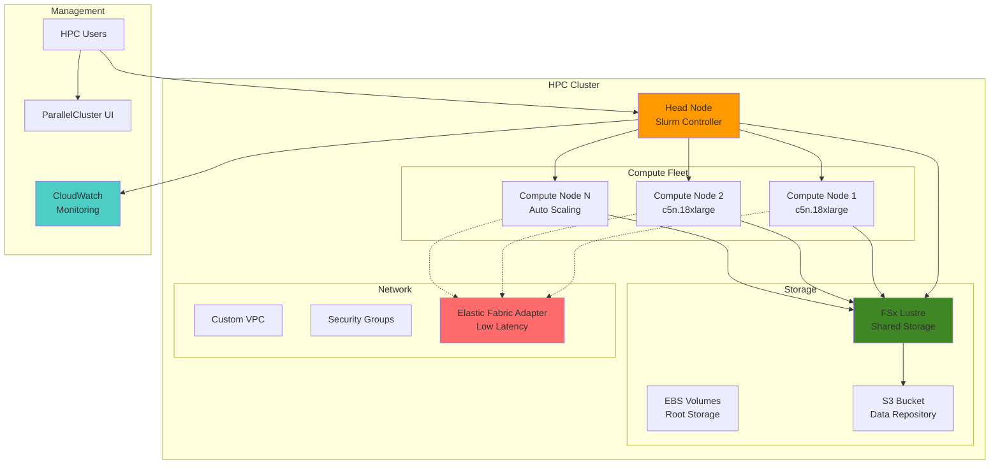

# Scalable HPC Cluster with Auto-Scaling

## Problem

Scientific research organizations and engineering firms require massive computational resources to run complex simulations, molecular dynamics calculations, and large-scale data processing jobs. Traditional on-premises HPC clusters are expensive to maintain, difficult to scale, and often sit idle between workloads. Organizations need a way to provision high-performance computing resources on-demand, optimize costs through auto-scaling, and integrate with existing scientific workflows while maintaining the performance characteristics required for tightly-coupled parallel applications.

## Solution

AWS ParallelCluster provides a fully managed HPC cluster deployment service that automatically provisions compute resources, configures job schedulers, and sets up shared filesystems. This solution leverages Slurm workload manager for job scheduling, EC2 instances with high-performance networking, and shared storage systems to create a scalable HPC environment that can handle both tightly-coupled MPI applications and embarrassingly parallel workloads.

## Architecture Diagram



## Prerequisites

1. AWS account with administrative permissions for EC2, VPC, IAM, and CloudFormation
2. AWS CLI v2 installed and configured (or AWS CloudShell)
3. Python 3.8+ installed for ParallelCluster CLI
4. Basic understanding of HPC concepts, job schedulers, and MPI applications
5. Familiarity with Linux system administration and command-line tools
6. Estimated cost: $50-200/hour depending on instance types and cluster size

> **Warning**: HPC instances can be expensive. Monitor usage carefully and follow cleanup procedures to avoid unexpected charges.

## Preparation

```bash
# Set environment variables
export AWS_REGION=$(aws configure get region)
export AWS_ACCOUNT_ID=$(aws sts get-caller-identity \
    --query Account --output text)

# Generate unique identifiers for resources
RANDOM_SUFFIX=$(aws secretsmanager get-random-password \
    --exclude-punctuation --exclude-uppercase \
    --password-length 6 --require-each-included-type \
    --output text --query RandomPassword)

export CLUSTER_NAME="hpc-cluster-${RANDOM_SUFFIX}"
export VPC_NAME="hpc-vpc-${RANDOM_SUFFIX}"
export KEYPAIR_NAME="hpc-keypair-${RANDOM_SUFFIX}"
export S3_BUCKET_NAME="hpc-data-${RANDOM_SUFFIX}-${AWS_ACCOUNT_ID}"

# Install ParallelCluster CLI
pip3 install aws-parallelcluster

# Verify installation
pcluster version

# Create SSH key pair for cluster access
aws ec2 create-key-pair \
    --key-name ${KEYPAIR_NAME} \
    --query 'KeyMaterial' \
    --output text > ~/.ssh/${KEYPAIR_NAME}.pem

chmod 600 ~/.ssh/${KEYPAIR_NAME}.pem

echo "✅ ParallelCluster CLI installed and key pair created"
```

## Steps

1. **Create VPC and Networking Infrastructure**:

   HPC clusters require isolated networking environments to ensure secure communication between nodes and optimal network performance. A custom VPC provides complete control over the network topology, enabling configuration of subnets that separate management traffic (head node) from compute traffic while maintaining security boundaries. This foundation is critical for HPC workloads that rely on high-bandwidth, low-latency inter-node communication.

   ```bash
   # Create VPC for HPC cluster
   VPC_ID=$(aws ec2 create-vpc \
       --cidr-block 10.0.0.0/16 \
       --tag-specifications 'ResourceType=vpc,Tags=[{Key=Name,Value='${VPC_NAME}'}]' \
       --query 'Vpc.VpcId' --output text)
   
   # Create public subnet for head node
   PUBLIC_SUBNET_ID=$(aws ec2 create-subnet \
       --vpc-id ${VPC_ID} \
       --cidr-block 10.0.1.0/24 \
       --availability-zone ${AWS_REGION}a \
       --tag-specifications 'ResourceType=subnet,Tags=[{Key=Name,Value='${VPC_NAME}'-public}]' \
       --query 'Subnet.SubnetId' --output text)
   
   # Create private subnet for compute nodes
   PRIVATE_SUBNET_ID=$(aws ec2 create-subnet \
       --vpc-id ${VPC_ID} \
       --cidr-block 10.0.2.0/24 \
       --availability-zone ${AWS_REGION}a \
       --tag-specifications 'ResourceType=subnet,Tags=[{Key=Name,Value='${VPC_NAME}'-private}]' \
       --query 'Subnet.SubnetId' --output text)
   
   # Create and attach internet gateway
   IGW_ID=$(aws ec2 create-internet-gateway \
       --tag-specifications 'ResourceType=internet-gateway,Tags=[{Key=Name,Value='${VPC_NAME}'-igw}]' \
       --query 'InternetGateway.InternetGatewayId' --output text)
   
   aws ec2 attach-internet-gateway \
       --internet-gateway-id ${IGW_ID} \
       --vpc-id ${VPC_ID}
   
   echo "✅ VPC and subnets created: ${VPC_ID}"
   ```

   The VPC infrastructure now provides the isolated network foundation required for HPC clusters. The public subnet will host the head node for external access, while the private subnet ensures compute nodes remain secure while maintaining internet access through NAT Gateway for software updates and package installations.

2. **Configure Route Tables and NAT Gateway**:

   NAT Gateway configuration is essential for HPC compute nodes to access external resources while maintaining security. Compute nodes in the private subnet need internet access for downloading software packages, accessing container registries, and synchronizing with time servers, but should not be directly accessible from the internet. This configuration ensures secure outbound connectivity while preventing unauthorized inbound access.

   ```bash
   # Create NAT Gateway for private subnet internet access
   NAT_ALLOCATION_ID=$(aws ec2 allocate-address \
       --domain vpc \
       --query 'AllocationId' --output text)
   
   NAT_GW_ID=$(aws ec2 create-nat-gateway \
       --subnet-id ${PUBLIC_SUBNET_ID} \
       --allocation-id ${NAT_ALLOCATION_ID} \
       --tag-specifications 'ResourceType=nat-gateway,Tags=[{Key=Name,Value='${VPC_NAME}'-nat}]' \
       --query 'NatGateway.NatGatewayId' --output text)
   
   # Wait for NAT Gateway to be available
   aws ec2 wait nat-gateway-available \
       --nat-gateway-ids ${NAT_GW_ID}
   
   # Update route table for public subnet
   PUBLIC_RT_ID=$(aws ec2 describe-route-tables \
       --filters "Name=vpc-id,Values=${VPC_ID}" \
       --query 'RouteTables[0].RouteTableId' --output text)
   
   aws ec2 create-route \
       --route-table-id ${PUBLIC_RT_ID} \
       --destination-cidr-block 0.0.0.0/0 \
       --gateway-id ${IGW_ID}
   
   # Create and configure private route table
   PRIVATE_RT_ID=$(aws ec2 create-route-table \
       --vpc-id ${VPC_ID} \
       --tag-specifications 'ResourceType=route-table,Tags=[{Key=Name,Value='${VPC_NAME}'-private}]' \
       --query 'RouteTable.RouteTableId' --output text)
   
   aws ec2 create-route \
       --route-table-id ${PRIVATE_RT_ID} \
       --destination-cidr-block 0.0.0.0/0 \
       --nat-gateway-id ${NAT_GW_ID}
   
   aws ec2 associate-route-table \
       --route-table-id ${PRIVATE_RT_ID} \
       --subnet-id ${PRIVATE_SUBNET_ID}
   
   echo "✅ NAT Gateway and routing configured"
   ```

   The routing infrastructure is now configured to provide secure internet access for compute nodes while maintaining network isolation. This setup enables compute nodes to download necessary software and access external services while preventing direct external access, which is crucial for HPC security best practices.

3. **Create S3 Bucket for Data Storage**:

   S3 provides the durable, scalable storage foundation essential for HPC data workflows. With 99.999999999% (11 9's) durability, S3 serves as both the initial data repository and the long-term archive for research outputs. FSx Lustre can automatically hydrate data from S3 at job runtime and export results back, creating seamless data lifecycle management that combines S3's cost-effectiveness with high-performance computing requirements.

   ```bash
   # Create S3 bucket for HPC data storage
   aws s3 mb s3://${S3_BUCKET_NAME} \
       --region ${AWS_REGION}
   
   # Create folder structure for HPC workloads
   echo "Sample HPC input data" > input.txt
   aws s3 cp input.txt s3://${S3_BUCKET_NAME}/input/
   
   # Create sample job script
   cat > sample_job.sh << 'EOF'
   #!/bin/bash
   #SBATCH --job-name=hpc-test
   #SBATCH --nodes=2
   #SBATCH --ntasks-per-node=8
   #SBATCH --time=00:10:00
   #SBATCH --output=output_%j.log
   
   module load openmpi
   mpirun hostname
   EOF
   
   aws s3 cp sample_job.sh s3://${S3_BUCKET_NAME}/jobs/
   rm input.txt sample_job.sh
   
   echo "✅ S3 bucket created: ${S3_BUCKET_NAME}"
   ```

   The S3 data repository is now established with sample input data and job scripts. This creates the foundation for data-driven HPC workflows where large datasets can be efficiently transferred to high-performance storage during job execution and results can be automatically archived for long-term retention.

4. **Create ParallelCluster Configuration**:

   ParallelCluster configuration defines the entire HPC infrastructure declaratively, including compute resources, storage systems, and networking. This YAML configuration enables repeatable deployments and version control of cluster definitions. The configuration specifies Slurm as the job scheduler, enables Elastic Fabric Adapter for low-latency networking, and integrates FSx Lustre for high-performance shared storage with automatic S3 integration.

   ```bash
   # Create ParallelCluster configuration file
   cat > cluster-config.yaml << EOF
   Region: ${AWS_REGION}
   Image:
     Os: alinux2
   HeadNode:
     InstanceType: m5.large
     Networking:
       SubnetId: ${PUBLIC_SUBNET_ID}
     Ssh:
       KeyName: ${KEYPAIR_NAME}
     LocalStorage:
       RootVolume:
         Size: 50
         VolumeType: gp3
   Scheduling:
     Scheduler: slurm
     SlurmQueues:
       - Name: compute
         ComputeResources:
           - Name: compute-nodes
             InstanceType: c5n.large
             MinCount: 0
             MaxCount: 10
             DisableSimultaneousMultithreading: true
             Efa:
               Enabled: true
         Networking:
           SubnetIds:
             - ${PRIVATE_SUBNET_ID}
         ComputeSettings:
           LocalStorage:
             RootVolume:
               Size: 50
               VolumeType: gp3
   SharedStorage:
     - MountDir: /shared
       Name: shared-storage
       StorageType: Ebs
       EbsSettings:
         Size: 100
         VolumeType: gp3
         Encrypted: true
     - MountDir: /fsx
       Name: fsx-storage
       StorageType: FsxLustre
       FsxLustreSettings:
         StorageCapacity: 1200
         DeploymentType: SCRATCH_2
         ImportPath: s3://${S3_BUCKET_NAME}/
         ExportPath: s3://${S3_BUCKET_NAME}/output/
   Monitoring:
     CloudWatch:
       Enabled: true
       DashboardName: ${CLUSTER_NAME}-dashboard
   EOF
   
   echo "✅ ParallelCluster configuration created"
   ```

   The cluster configuration now defines a complete HPC environment with auto-scaling compute resources, high-performance storage, and integrated monitoring. This declarative approach ensures consistent deployments and enables infrastructure-as-code practices for HPC environments.

5. **Deploy ParallelCluster**:

   ParallelCluster deployment orchestrates the creation of all infrastructure components including EC2 instances, security groups, IAM roles, and storage systems. The service uses CloudFormation under the hood to ensure consistent, repeatable deployments with proper dependency management. This process typically takes 10-15 minutes as it provisions and configures all cluster components including the Slurm scheduler and shared storage mounts.

   ```bash
   # Create the HPC cluster
   pcluster create-cluster \
       --cluster-name ${CLUSTER_NAME} \
       --cluster-configuration cluster-config.yaml \
       --rollback-on-failure false
   
   # Wait for cluster creation to complete (this takes 10-15 minutes)
   echo "Waiting for cluster creation to complete..."
   pcluster describe-cluster \
       --cluster-name ${CLUSTER_NAME} \
       --query 'clusterStatus' --output text
   
   # Store head node IP for later use
   HEAD_NODE_IP=$(pcluster describe-cluster \
       --cluster-name ${CLUSTER_NAME} \
       --query 'headNode.publicIpAddress' --output text)
   
   echo "✅ HPC cluster created successfully"
   echo "Head node IP: ${HEAD_NODE_IP}"
   ```

   The HPC cluster is now fully operational with a configured head node running the Slurm scheduler. The head node serves as the cluster management interface where users submit jobs, monitor resource usage, and access shared storage systems. Auto-scaling is enabled, allowing the cluster to dynamically provision compute nodes based on job queue demand.

6. **Configure Slurm Job Scheduler**:

   Slurm (Simple Linux Utility for Resource Management) provides enterprise-grade job scheduling with features like fair-share scheduling, resource limits, and job priorities. The configuration optimizes resource allocation for HPC workloads by enabling core-level resource tracking and memory-aware scheduling. These settings ensure efficient utilization of compute resources and prevent job interference in multi-user environments.

   ```bash
   # Connect to head node and configure Slurm
   ssh -i ~/.ssh/${KEYPAIR_NAME}.pem ec2-user@${HEAD_NODE_IP} << 'EOF'
   
   # Check Slurm status
   sinfo
   
   # Create custom Slurm configuration
   sudo tee -a /opt/slurm/etc/slurm.conf << 'SLURM_EOF'
   # Custom HPC settings
   SelectType=select/cons_tres
   SelectTypeParameters=CR_Core_Memory
   PreemptType=preempt/partition_prio
   PreemptMode=REQUEUE
   DefMemPerCPU=1000
   SLURM_EOF
   
   # Restart Slurm services
   sudo systemctl restart slurmctld
   sudo systemctl restart slurmd
   
   # Set up job submission directory
   mkdir -p /shared/jobs
   chmod 755 /shared/jobs
   
   exit
   EOF
   
   echo "✅ Slurm scheduler configured"
   ```

   Slurm is now configured with advanced resource management capabilities including core-aware scheduling and memory allocation tracking. The shared job directory provides a central location for job scripts and outputs, accessible across all cluster nodes through the shared filesystem.

7. **Install HPC Software Stack**:

   HPC applications require specialized software including MPI libraries, compilers, and scientific computing tools. OpenMPI provides the Message Passing Interface implementation essential for parallel computing, while environment modules enable users to load different software versions dynamically. This standardized approach ensures consistent software environments across all compute nodes and simplifies application deployment.

   ```bash
   # Install common HPC applications and libraries
   ssh -i ~/.ssh/${KEYPAIR_NAME}.pem ec2-user@${HEAD_NODE_IP} << 'EOF'
   
   # Update system packages
   sudo yum update -y
   
   # Install development tools
   sudo yum groupinstall -y "Development Tools"
   sudo yum install -y gcc-gfortran openmpi-devel
   
   # Install Intel MPI (if needed for specific applications)
   wget https://registrationcenter.intel.com/en/forms/?productid=3918 \
       -O /tmp/intel-mpi-setup.sh
   
   # Set up environment modules
   sudo yum install -y environment-modules
   
   # Create module file for OpenMPI
   sudo mkdir -p /usr/share/modulefiles/mpi
   sudo tee /usr/share/modulefiles/mpi/openmpi << 'MODULE_EOF'
   #%Module1.0
   proc ModulesHelp { } {
       puts stderr "OpenMPI MPI implementation"
   }
   module-whatis "OpenMPI MPI implementation"
   
   set root /usr/lib64/openmpi
   prepend-path PATH $root/bin
   prepend-path LD_LIBRARY_PATH $root/lib
   prepend-path MANPATH $root/share/man
   setenv MPI_HOME $root
   MODULE_EOF
   
   # Test module loading
   module load mpi/openmpi
   which mpirun
   
   exit
   EOF
   
   echo "✅ HPC software stack installed"
   ```

   The HPC software environment is now configured with OpenMPI and environment modules, providing the foundation for parallel scientific applications. Users can now load MPI libraries and development tools using the module system, ensuring consistent software environments across all cluster nodes.

8. **Set Up Monitoring and Logging**:

   Comprehensive monitoring is essential for HPC cluster management, providing insights into resource utilization, job performance, and system health. CloudWatch integration enables real-time monitoring of CPU, memory, and network metrics across all cluster nodes. Custom dashboards and alarms help administrators optimize resource allocation and proactively address performance issues before they impact running jobs.

   ```bash
   # Create CloudWatch dashboard for cluster monitoring
   cat > dashboard-config.json << EOF
   {
       "widgets": [
           {
               "type": "metric",
               "properties": {
                   "metrics": [
                       ["AWS/EC2", "CPUUtilization", "ClusterName", "${CLUSTER_NAME}"],
                       ["AWS/EC2", "NetworkIn", "ClusterName", "${CLUSTER_NAME}"],
                       ["AWS/EC2", "NetworkOut", "ClusterName", "${CLUSTER_NAME}"]
                   ],
                   "period": 300,
                   "stat": "Average",
                   "region": "${AWS_REGION}",
                   "title": "HPC Cluster Metrics"
               }
           }
       ]
   }
   EOF
   
   aws cloudwatch put-dashboard \
       --dashboard-name ${CLUSTER_NAME}-performance \
       --dashboard-body file://dashboard-config.json
   
   # Set up CloudWatch alarms for cluster health
   aws cloudwatch put-metric-alarm \
       --alarm-name "${CLUSTER_NAME}-high-cpu" \
       --alarm-description "High CPU utilization on HPC cluster" \
       --metric-name CPUUtilization \
       --namespace AWS/EC2 \
       --statistic Average \
       --period 300 \
       --threshold 80 \
       --comparison-operator GreaterThanThreshold \
       --evaluation-periods 2
   
   echo "✅ Monitoring and alerting configured"
   ```

   Monitoring infrastructure is now established with real-time dashboards and automated alerts. This enables proactive cluster management and helps optimize resource utilization by providing visibility into compute patterns and potential bottlenecks.

9. **Configure Auto-Scaling Policies**:

   Auto-scaling configuration optimizes cost efficiency by automatically adjusting cluster size based on job queue demand. The ScaledownIdletime setting determines how quickly idle nodes are terminated, while MaxCount limits prevent runaway scaling. This configuration enables HPC clusters to scale from zero to hundreds of nodes automatically, providing significant cost savings compared to static cluster sizing.

   ```bash
   # Update cluster configuration for advanced scaling
   cat > scaling-config.yaml << EOF
   Region: ${AWS_REGION}
   Image:
     Os: alinux2
   HeadNode:
     InstanceType: m5.large
     Networking:
       SubnetId: ${PUBLIC_SUBNET_ID}
     Ssh:
       KeyName: ${KEYPAIR_NAME}
   Scheduling:
     Scheduler: slurm
     SlurmSettings:
       ScaledownIdletime: 5
       QueueUpdateStrategy: TERMINATE
     SlurmQueues:
       - Name: compute
         ComputeResources:
           - Name: compute-nodes
             InstanceType: c5n.large
             MinCount: 0
             MaxCount: 20
             DisableSimultaneousMultithreading: true
             Efa:
               Enabled: true
         Networking:
           SubnetIds:
             - ${PRIVATE_SUBNET_ID}
         ComputeSettings:
           LocalStorage:
             RootVolume:
               Size: 50
               VolumeType: gp3
   SharedStorage:
     - MountDir: /shared
       Name: shared-storage
       StorageType: Ebs
       EbsSettings:
         Size: 100
         VolumeType: gp3
         Encrypted: true
   Monitoring:
     CloudWatch:
       Enabled: true
   EOF
   
   echo "✅ Auto-scaling configuration prepared"
   ```

   Advanced auto-scaling policies are now configured to optimize both performance and cost. The cluster can scale up rapidly when jobs are queued and scale down quickly when idle, providing the elasticity that makes cloud HPC cost-effective for variable workloads.

10. **Test HPC Workload Submission**:

    Testing job submission validates the complete HPC workflow from job creation to execution across multiple nodes. MPI test jobs verify that inter-node communication is working correctly and that the job scheduler can distribute tasks across the compute fleet. This validation ensures the cluster is ready for production scientific workloads requiring parallel processing capabilities.

    ```bash
    # Copy sample job to head node and submit
    scp -i ~/.ssh/${KEYPAIR_NAME}.pem cluster-config.yaml \
        ec2-user@${HEAD_NODE_IP}:/shared/jobs/
    
    # Submit test job
    ssh -i ~/.ssh/${KEYPAIR_NAME}.pem ec2-user@${HEAD_NODE_IP} << 'EOF'
    
    # Create MPI test job
    cat > /shared/jobs/mpi-test.sh << 'JOB_EOF'
    #!/bin/bash
    #SBATCH --job-name=mpi-test
    #SBATCH --nodes=2
    #SBATCH --ntasks-per-node=4
    #SBATCH --time=00:05:00
    #SBATCH --output=/shared/jobs/mpi-test-%j.out
    #SBATCH --error=/shared/jobs/mpi-test-%j.err
    
    module load mpi/openmpi
    
    echo "Starting MPI test job at $(date)"
    echo "Running on nodes: $SLURM_JOB_NODELIST"
    
    mpirun -np $SLURM_NTASKS hostname
    
    echo "MPI test completed at $(date)"
    JOB_EOF
    
    # Submit the job
    sbatch /shared/jobs/mpi-test.sh
    
    # Check job status
    squeue
    
    exit
    EOF
    
    echo "✅ Test HPC workload submitted"
    ```

    The MPI test job demonstrates successful parallel job execution across multiple nodes, validating that the cluster's networking, scheduling, and compute resources are functioning correctly. This confirms the cluster is ready for production HPC workloads.

11. **Configure Data Transfer and Storage**:

    High-performance data transfer is critical for HPC workflows that process large datasets. AWS CLI with parallel transfer capabilities and FSx Lustre's S3 integration provide efficient data movement between long-term storage and high-performance computing resources. This configuration enables automatic data staging and result archival, streamlining the research data lifecycle.

    ```bash
    # Set up data transfer utilities on head node
    ssh -i ~/.ssh/${KEYPAIR_NAME}.pem ec2-user@${HEAD_NODE_IP} << 'EOF'
    
    # Install AWS CLI and data transfer tools
    sudo yum install -y awscli parallel
    
    # Create data transfer script
    cat > /shared/jobs/data-transfer.sh << 'TRANSFER_EOF'
    #!/bin/bash
    # High-performance data transfer script
    
    # Download data from S3 to FSx
    aws s3 sync s3://S3_BUCKET_NAME/input/ /fsx/input/ \
        --exclude="*" --include="*.dat" --include="*.txt"
    
    # Upload results back to S3
    aws s3 sync /fsx/output/ s3://S3_BUCKET_NAME/output/ \
        --exclude="*" --include="*.out" --include="*.log"
    TRANSFER_EOF
    
    # Replace S3 bucket placeholder
    sed -i "s/S3_BUCKET_NAME/${S3_BUCKET_NAME}/g" /shared/jobs/data-transfer.sh
    chmod +x /shared/jobs/data-transfer.sh
    
    exit
    EOF
    
    echo "✅ Data transfer utilities configured"
    ```

    Data transfer infrastructure is now optimized for HPC workflows with automated scripts for moving data between S3 and the high-performance FSx filesystem. This enables efficient data staging and result archival without manual intervention.

12. **Implement Job Queue Management**:

    Sophisticated job management tools simplify HPC cluster operations for researchers and system administrators. These wrapper scripts provide standardized interfaces for job submission with configurable resource requirements and comprehensive monitoring capabilities. The monitoring tools integrate with Slurm's accounting system to provide detailed job history and cluster utilization metrics essential for optimizing HPC resource allocation.

    ```bash
    # Create job management scripts
    ssh -i ~/.ssh/${KEYPAIR_NAME}.pem ec2-user@${HEAD_NODE_IP} << 'EOF'
    
    # Create job submission wrapper
    cat > /shared/jobs/submit-hpc-job.sh << 'SUBMIT_EOF'
    #!/bin/bash
    # HPC job submission wrapper
    
    if [ $# -lt 1 ]; then
        echo "Usage: $0 <job-script> [nodes] [tasks-per-node] [time]"
        exit 1
    fi
    
    JOB_SCRIPT=$1
    NODES=${2:-1}
    TASKS_PER_NODE=${3:-4}
    TIME=${4:-01:00:00}
    
    # Submit job with parameters
    sbatch --nodes=$NODES \
           --ntasks-per-node=$TASKS_PER_NODE \
           --time=$TIME \
           --output=/shared/jobs/output_%j.log \
           --error=/shared/jobs/error_%j.log \
           $JOB_SCRIPT
    
    echo "Job submitted with $NODES nodes, $TASKS_PER_NODE tasks per node"
    squeue -u $USER
    SUBMIT_EOF
    
    chmod +x /shared/jobs/submit-hpc-job.sh
    
    # Create job monitoring script
    cat > /shared/jobs/monitor-jobs.sh << 'MONITOR_EOF'
    #!/bin/bash
    # Job monitoring and reporting
    
    echo "=== Active Jobs ==="
    squeue -u $USER
    
    echo -e "\n=== Node Status ==="
    sinfo
    
    echo -e "\n=== Recent Job History ==="
    sacct -u $USER --starttime=today --format=JobID,JobName,State,ExitCode,Start,End
    
    echo -e "\n=== Cluster Utilization ==="
    scontrol show partition
    MONITOR_EOF
    
    chmod +x /shared/jobs/monitor-jobs.sh
    
    exit
    EOF
    
    echo "✅ Job queue management configured"
    ```

    Advanced job management tools are now available, providing simplified interfaces for job submission and comprehensive monitoring capabilities. These tools enable researchers to efficiently utilize cluster resources while providing administrators with detailed utilization analytics.

## Validation & Testing

1. **Verify Cluster Status**:

   ```bash
   # Check cluster health
   pcluster describe-cluster \
       --cluster-name ${CLUSTER_NAME} \
       --query 'clusterStatus'
   
   # Expected output: "CREATE_COMPLETE"
   
   # Verify compute fleet
   pcluster describe-compute-fleet \
       --cluster-name ${CLUSTER_NAME}
   ```

2. **Test Job Scheduler**:

   ```bash
   # Connect to head node and test Slurm
   ssh -i ~/.ssh/${KEYPAIR_NAME}.pem ec2-user@${HEAD_NODE_IP} << 'EOF'
   
   # Check Slurm configuration
   sinfo -s
   
   # Test job submission
   echo "#!/bin/bash" > /tmp/test-job.sh
   echo "echo 'Hello from HPC cluster'" >> /tmp/test-job.sh
   echo "hostname" >> /tmp/test-job.sh
   
   sbatch --nodes=1 --ntasks=1 --time=00:01:00 /tmp/test-job.sh
   
   # Check job queue
   squeue
   
   exit
   EOF
   ```

3. **Test Storage Performance**:

   ```bash
   # Test FSx Lustre performance
   ssh -i ~/.ssh/${KEYPAIR_NAME}.pem ec2-user@${HEAD_NODE_IP} << 'EOF'
   
   # Create test file for I/O performance
   dd if=/dev/zero of=/fsx/test-file bs=1M count=1000
   
   # Test read performance
   time dd if=/fsx/test-file of=/dev/null bs=1M
   
   # Clean up test file
   rm /fsx/test-file
   
   exit
   EOF
   ```

4. **Validate Auto-Scaling**:

   ```bash
   # Submit multiple jobs to trigger scaling
   ssh -i ~/.ssh/${KEYPAIR_NAME}.pem ec2-user@${HEAD_NODE_IP} << 'EOF'
   
   # Submit several jobs to trigger auto-scaling
   for i in {1..5}; do
       sbatch --nodes=2 --ntasks=8 --time=00:05:00 \
              --job-name=scale-test-$i \
              --wrap="sleep 300; echo 'Job $i completed'"
   done
   
   # Monitor scaling activity
   squeue
   
   exit
   EOF
   
   # Check EC2 instances being launched
   aws ec2 describe-instances \
       --filters "Name=tag:Application,Values=parallelcluster" \
       --query 'Reservations[].Instances[].{ID:InstanceId,State:State.Name,Type:InstanceType}'
   ```

## Cleanup

1. **Delete ParallelCluster**:

   ```bash
   # Delete the HPC cluster (this will terminate all instances)
   pcluster delete-cluster \
       --cluster-name ${CLUSTER_NAME}
   
   # Wait for deletion to complete
   echo "Waiting for cluster deletion to complete..."
   while [[ $(pcluster describe-cluster --cluster-name ${CLUSTER_NAME} --query 'clusterStatus' --output text 2>/dev/null || echo "DELETED") != "DELETED" ]]; do
       sleep 30
       echo "Still deleting..."
   done
   
   echo "✅ Cluster deleted successfully"
   ```

2. **Remove CloudWatch Resources**:

   ```bash
   # Delete CloudWatch dashboard
   aws cloudwatch delete-dashboards \
       --dashboard-names ${CLUSTER_NAME}-performance
   
   # Delete CloudWatch alarms
   aws cloudwatch delete-alarms \
       --alarm-names "${CLUSTER_NAME}-high-cpu"
   
   echo "✅ CloudWatch resources cleaned up"
   ```

3. **Clean Up Networking Resources**:

   ```bash
   # Delete NAT Gateway
   aws ec2 delete-nat-gateway \
       --nat-gateway-id ${NAT_GW_ID}
   
   # Wait for NAT Gateway deletion
   aws ec2 wait nat-gateway-deleted \
       --nat-gateway-ids ${NAT_GW_ID}
   
   # Release Elastic IP
   aws ec2 release-address \
       --allocation-id ${NAT_ALLOCATION_ID}
   
   # Delete route tables
   aws ec2 delete-route-table \
       --route-table-id ${PRIVATE_RT_ID}
   
   # Detach and delete internet gateway
   aws ec2 detach-internet-gateway \
       --internet-gateway-id ${IGW_ID} \
       --vpc-id ${VPC_ID}
   
   aws ec2 delete-internet-gateway \
       --internet-gateway-id ${IGW_ID}
   
   # Delete subnets
   aws ec2 delete-subnet --subnet-id ${PUBLIC_SUBNET_ID}
   aws ec2 delete-subnet --subnet-id ${PRIVATE_SUBNET_ID}
   
   # Delete VPC
   aws ec2 delete-vpc --vpc-id ${VPC_ID}
   
   echo "✅ Networking resources cleaned up"
   ```

4. **Remove S3 Bucket and Key Pair**:

   ```bash
   # Empty and delete S3 bucket
   aws s3 rm s3://${S3_BUCKET_NAME} --recursive
   aws s3 rb s3://${S3_BUCKET_NAME}
   
   # Delete EC2 key pair
   aws ec2 delete-key-pair --key-name ${KEYPAIR_NAME}
   rm ~/.ssh/${KEYPAIR_NAME}.pem
   
   # Clean up configuration files
   rm -f cluster-config.yaml scaling-config.yaml dashboard-config.json
   
   echo "✅ All resources cleaned up successfully"
   ```

## Discussion

AWS ParallelCluster provides a powerful platform for deploying and managing HPC workloads in the cloud, offering significant advantages over traditional on-premises solutions. The service automatically handles the complex orchestration of compute resources, storage systems, and job scheduling software, allowing researchers and engineers to focus on their applications rather than infrastructure management.

The architecture leverages several key AWS services working in concert. EC2 instances provide the compute power, with support for high-performance instance types like C5n that include enhanced networking capabilities. The Elastic Fabric Adapter (EFA) enables ultra-low latency communication between instances, crucial for tightly-coupled MPI applications. FSx Lustre provides high-performance shared storage that can scale to thousands of nodes, while S3 integration enables seamless data ingestion and archival workflows.

One of the most compelling aspects of this solution is its cost optimization through auto-scaling. Unlike traditional HPC clusters that require constant provisioning for peak workloads, ParallelCluster can scale from zero to hundreds of nodes based on job queue demand. This elasticity, combined with support for Spot instances, can reduce compute costs by up to 90% for fault-tolerant workloads. The Slurm scheduler integration provides sophisticated job queuing, resource allocation, and fair-share scheduling that HPC users expect.

The storage architecture deserves special attention, as I/O performance is often the bottleneck in HPC workloads. FSx Lustre can deliver over 1 TB/s of aggregate throughput and millions of IOPS, with the ability to hydrate data directly from S3 buckets. This creates a seamless workflow where datasets can be stored cost-effectively in S3 and automatically cached in high-performance storage when jobs run.

> **Note**: FSx Lustre performance scales linearly with storage capacity. For optimal I/O performance, size your filesystem based on bandwidth requirements rather than just storage needs. See [FSx Lustre performance documentation](https://docs.aws.amazon.com/fsx/latest/LustreGuide/performance.html) for detailed sizing guidance.

> **Tip**: Use FSx Lustre's data repository associations to automatically sync results back to S3, enabling hybrid workflows that combine cloud elasticity with long-term data persistence.

## Challenge

Extend this solution by implementing these advanced HPC capabilities:

1. **Multi-Queue Configuration**: Set up separate queues for different workload types (CPU-intensive, memory-intensive, GPU-accelerated) with different instance types and scaling policies for each queue.

2. **Hybrid Cloud Integration**: Implement job bursting from an on-premises Slurm cluster to AWS ParallelCluster during peak demand periods, using tools like AWS Direct Connect for secure connectivity.

3. **Container-Based Workloads**: Integrate Singularity or Docker containers for portable application deployment, including building custom container images with pre-installed scientific software and libraries.

4. **Advanced Monitoring**: Implement comprehensive monitoring with custom CloudWatch metrics, Slurm accounting database integration, and cost tracking per research group or project using AWS Cost Explorer APIs.

5. **Fault-Tolerant Checkpointing**: Implement automatic checkpointing and restart capabilities for long-running jobs, using S3 for checkpoint storage and Lambda functions for job recovery automation.

## Infrastructure Code

*Infrastructure code will be generated after recipe approval.*