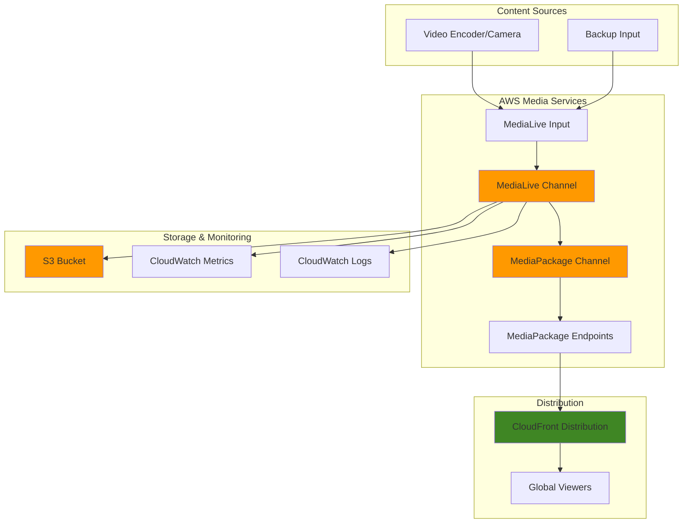

# Scalable Live Streaming with Elemental MediaLive

## Problem

A global sports broadcasting company needs to deliver live events to millions of viewers worldwide with minimal latency and high reliability. The current on-premises streaming infrastructure cannot handle peak viewing demand during major sporting events, leading to buffering, dropped connections, and poor viewing experiences that damage the brand reputation and reduce advertising revenue. The company also struggles with high infrastructure costs and the complexity of managing multiple streaming protocols for different devices and regions.

## Solution

Build a scalable live streaming solution using AWS Elemental MediaLive to ingest and transcode live video content into multiple adaptive bitrate streams. Integrate with AWS Elemental MediaPackage for content packaging and delivery, and use Amazon CloudFront for global content distribution with low latency. This solution provides automatic scaling, built-in redundancy, and support for multiple streaming protocols while reducing operational overhead and infrastructure costs.

## Architecture Diagram



## Prerequisites

1. AWS account with appropriate permissions for MediaLive, MediaPackage, CloudFront, and S3
2. AWS CLI v2 installed and configured (or AWS CloudShell)
3. Video streaming knowledge and understanding of HLS/DASH protocols
4. Video encoder or streaming software capable of RTMP output
5. Network bandwidth sufficient for streaming (minimum 5 Mbps upload)
6. Estimated cost: $50-200/hour for HD streaming (varies by bitrate and duration)

> **Note**: MediaLive pricing is based on input resolution, output bitrates, and channel runtime. Always monitor costs and stop channels when not in use. Review [MediaLive pricing](https://docs.aws.amazon.com/medialive/latest/ug/pricing.html) for detailed cost information.

## Preparation

```bash
# Set environment variables
export AWS_REGION=$(aws configure get region)
export AWS_ACCOUNT_ID=$(aws sts get-caller-identity \
    --query Account --output text)

# Generate unique identifiers for resources
RANDOM_SUFFIX=$(aws secretsmanager get-random-password \
    --exclude-punctuation --exclude-uppercase \
    --password-length 6 --require-each-included-type \
    --output text --query RandomPassword)

export STREAM_NAME="live-stream-${RANDOM_SUFFIX}"
export CHANNEL_NAME="live-channel-${RANDOM_SUFFIX}"
export PACKAGE_CHANNEL_NAME="package-channel-${RANDOM_SUFFIX}"
export DISTRIBUTION_NAME="live-distribution-${RANDOM_SUFFIX}"
export BUCKET_NAME="live-streaming-${RANDOM_SUFFIX}"

# Create S3 bucket for archive storage
aws s3 mb s3://${BUCKET_NAME} --region ${AWS_REGION}

# Enable S3 bucket versioning for data protection
aws s3api put-bucket-versioning \
    --bucket ${BUCKET_NAME} \
    --versioning-configuration Status=Enabled

echo "✅ Environment prepared with unique identifiers"
```

## Steps

1. **Create MediaLive Input Security Group**:

   MediaLive input security groups act as network-level firewalls that control which IP addresses can send video streams to your MediaLive inputs. This security layer is essential for protecting your streaming infrastructure from unauthorized access and ensuring only legitimate content sources can contribute to your live streams. Each input security group can contain up to 10 CIDR block rules.

   ```bash
   # Create input security group to allow RTMP input
   SECURITY_GROUP_ID=$(aws medialive create-input-security-group \
       --region ${AWS_REGION} \
       --whitelist-rules Cidr=0.0.0.0/0 \
       --query 'SecurityGroup.Id' --output text)
   
   echo "✅ Created input security group: ${SECURITY_GROUP_ID}"
   ```

   The security group is now configured and ready to control access to your streaming inputs. This foundational security component will be attached to MediaLive inputs to ensure controlled access to your live streaming infrastructure.

   > **Warning**: The 0.0.0.0/0 CIDR allows global access to your RTMP input. For production environments, restrict this to specific IP ranges of your streaming equipment. Use a CIDR calculator to define precise IP ranges (e.g., 203.0.113.0/24 for your office network). Learn more about [MediaLive security best practices](https://docs.aws.amazon.com/medialive/latest/ug/security.html).

2. **Create MediaLive RTMP Push Input**:

   MediaLive inputs define how external video sources connect to AWS for live streaming. RTMP (Real-Time Messaging Protocol) push inputs are ideal for live broadcasting scenarios where encoders or streaming software actively send video streams to AWS. MediaLive automatically provisions redundant input endpoints across multiple Availability Zones for high availability and fault tolerance.

   ```bash
   # Create RTMP input for live stream ingestion
   INPUT_ID=$(aws medialive create-input \
       --region ${AWS_REGION} \
       --name "${STREAM_NAME}-input" \
       --type RTMP_PUSH \
       --input-security-groups ${SECURITY_GROUP_ID} \
       --query 'Input.Id' --output text)
   
   # Store input destinations for streaming
   PRIMARY_RTMP_URL=$(aws medialive describe-input \
       --region ${AWS_REGION} \
       --input-id ${INPUT_ID} \
       --query 'Destinations[0].Url' --output text)
   
   BACKUP_RTMP_URL=$(aws medialive describe-input \
       --region ${AWS_REGION} \
       --input-id ${INPUT_ID} \
       --query 'Destinations[1].Url' --output text)
   
   echo "✅ Created MediaLive input: ${INPUT_ID}"
   echo "Primary RTMP URL: ${PRIMARY_RTMP_URL}"
   echo "Backup RTMP URL: ${BACKUP_RTMP_URL}"
   ```

   The RTMP input endpoint is now established with dual redundant destinations for high availability. MediaLive automatically provides primary and backup endpoints in different Availability Zones, ensuring your live streams remain stable even if one endpoint experiences issues.

3. **Create MediaPackage Channel**:

   AWS Elemental MediaPackage serves as the content packaging and delivery layer in our streaming architecture. While MediaLive handles video encoding and transcoding, MediaPackage dynamically packages the content into multiple streaming formats (HLS, DASH, CMAF) without requiring separate encoding processes. This just-in-time packaging approach reduces storage costs and enables serving diverse client devices from a single source.

   ```bash
   # Create MediaPackage channel for content packaging
   aws mediapackage create-channel \
       --region ${AWS_REGION} \
       --id ${PACKAGE_CHANNEL_NAME} \
       --description "Live streaming package channel"
   
   # Get MediaPackage channel ingest details
   PACKAGE_URL=$(aws mediapackage describe-channel \
       --region ${AWS_REGION} \
       --id ${PACKAGE_CHANNEL_NAME} \
       --query 'HlsIngest.IngestEndpoints[0].Url' --output text)
   
   PACKAGE_USERNAME=$(aws mediapackage describe-channel \
       --region ${AWS_REGION} \
       --id ${PACKAGE_CHANNEL_NAME} \
       --query 'HlsIngest.IngestEndpoints[0].Username' --output text)
   
   PACKAGE_PASSWORD=$(aws mediapackage describe-channel \
       --region ${AWS_REGION} \
       --id ${PACKAGE_CHANNEL_NAME} \
       --query 'HlsIngest.IngestEndpoints[0].Password' --output text)
   
   echo "✅ Created MediaPackage channel: ${PACKAGE_CHANNEL_NAME}"
   ```

   The MediaPackage channel now provides the foundation for content delivery across multiple protocols. This channel will receive encoded video from MediaLive and dynamically create the appropriate streaming formats for different client types, ensuring optimal playback experiences across various devices and network conditions.

4. **Create MediaPackage Origin Endpoints**:

   Origin endpoints in MediaPackage define how packaged content is delivered to viewers and CDNs. Different endpoints support different streaming protocols, allowing you to serve the same content in multiple formats. HLS (HTTP Live Streaming) works best for iOS and Safari browsers, while DASH (Dynamic Adaptive Streaming over HTTP) provides broader compatibility across other browsers and devices.

   ```bash
   # Create HLS endpoint for iOS/Safari compatibility
   aws mediapackage create-origin-endpoint \
       --region ${AWS_REGION} \
       --channel-id ${PACKAGE_CHANNEL_NAME} \
       --id "${PACKAGE_CHANNEL_NAME}-hls" \
       --manifest-name "index.m3u8" \
       --hls-package SegmentDurationSeconds=6,PlaylistWindowSeconds=60,PlaylistType=EVENT,AdMarkers=NONE
   
   # Create DASH endpoint for broader browser compatibility
   aws mediapackage create-origin-endpoint \
       --region ${AWS_REGION} \
       --channel-id ${PACKAGE_CHANNEL_NAME} \
       --id "${PACKAGE_CHANNEL_NAME}-dash" \
       --manifest-name "index.mpd" \
       --dash-package SegmentDurationSeconds=6,MinBufferTimeSeconds=30,MinUpdatePeriodSeconds=15,SuggestedPresentationDelaySeconds=25
   
   # Get endpoint URLs for distribution
   HLS_ENDPOINT=$(aws mediapackage describe-origin-endpoint \
       --region ${AWS_REGION} \
       --id "${PACKAGE_CHANNEL_NAME}-hls" \
       --query 'Url' --output text)
   
   DASH_ENDPOINT=$(aws mediapackage describe-origin-endpoint \
       --region ${AWS_REGION} \
       --id "${PACKAGE_CHANNEL_NAME}-dash" \
       --query 'Url' --output text)
   
   echo "✅ Created MediaPackage endpoints"
   echo "HLS: ${HLS_ENDPOINT}"
   echo "DASH: ${DASH_ENDPOINT}"
   ```

   MediaPackage creates multiple protocol endpoints from a single input stream, allowing you to serve HLS for iOS/Safari and DASH for other browsers. The segment duration settings (6 seconds) balance between latency and quality, while buffer settings ensure smooth playback across varying network conditions.

   > **Note**: Shorter segment durations reduce latency but increase manifest update frequency and CDN requests. For ultra-low latency streaming, consider using [Low-Latency HLS (LL-HLS)](https://docs.aws.amazon.com/mediapackage/latest/ug/llatency.html) which can achieve sub-second latency.

5. **Create IAM Role for MediaLive**:

   MediaLive requires an IAM service role to access other AWS services on your behalf, particularly for writing outputs to MediaPackage, S3, and CloudWatch. This role implements the principle of least privilege by granting only the specific permissions MediaLive needs to operate, ensuring secure inter-service communication while maintaining operational functionality.

   ```bash
   # Create trust policy for MediaLive service
   cat > medialive-trust-policy.json << EOF
   {
       "Version": "2012-10-17",
       "Statement": [
           {
               "Effect": "Allow",
               "Principal": {
                   "Service": "medialive.amazonaws.com"
               },
               "Action": "sts:AssumeRole"
           }
       ]
   }
   EOF
   
   # Create IAM role for MediaLive
   aws iam create-role \
       --role-name MediaLiveAccessRole-${RANDOM_SUFFIX} \
       --assume-role-policy-document file://medialive-trust-policy.json
   
   # Attach AWS managed policy for MediaLive access
   aws iam attach-role-policy \
       --role-name MediaLiveAccessRole-${RANDOM_SUFFIX} \
       --policy-arn arn:aws:iam::aws:policy/MediaLiveFullAccess
   
   # Wait for role to be fully created
   sleep 10
   
   # Get role ARN for channel configuration
   ROLE_ARN=$(aws iam get-role \
       --role-name MediaLiveAccessRole-${RANDOM_SUFFIX} \
       --query 'Role.Arn' --output text)
   
   echo "✅ Created MediaLive IAM role: ${ROLE_ARN}"
   ```

   The IAM role is now configured to enable secure service-to-service communication within your streaming pipeline. MediaLive can now access MediaPackage, S3, and CloudWatch services using temporary, automatically rotated credentials, eliminating the need for hardcoded access keys while maintaining strong security posture according to AWS security best practices.

6. **Create MediaLive Channel with Multi-Bitrate Output**:

   The MediaLive channel is the core processing engine that ingests live video, applies encoding configurations, and outputs multiple bitrate streams for adaptive playback. Multi-bitrate encoding ensures viewers receive the optimal quality level based on their device capabilities and network conditions, providing smooth streaming experiences from mobile devices on cellular networks to 4K displays on high-speed connections.

   ```bash
   # Create comprehensive channel configuration
   cat > channel-config.json << EOF
   {
       "Name": "${CHANNEL_NAME}",
       "RoleArn": "${ROLE_ARN}",
       "InputSpecification": {
           "Codec": "AVC",
           "Resolution": "HD",
           "MaximumBitrate": "MAX_10_MBPS"
       },
       "InputAttachments": [
           {
               "InputId": "${INPUT_ID}",
               "InputAttachmentName": "primary-input",
               "InputSettings": {
                   "SourceEndBehavior": "CONTINUE"
               }
           }
       ],
       "Destinations": [
           {
               "Id": "destination1",
               "MediaPackageSettings": [
                   {
                       "ChannelId": "${PACKAGE_CHANNEL_NAME}"
                   }
               ]
           }
       ],
       "EncoderSettings": {
           "AudioDescriptions": [
               {
                   "Name": "audio_1",
                   "AudioSelectorName": "default",
                   "CodecSettings": {
                       "AacSettings": {
                           "Bitrate": 96000,
                           "CodingMode": "CODING_MODE_2_0",
                           "SampleRate": 48000
                       }
                   }
               }
           ],
           "VideoDescriptions": [
               {
                   "Name": "video_1080p",
                   "CodecSettings": {
                       "H264Settings": {
                           "Bitrate": 6000000,
                           "FramerateControl": "SPECIFIED",
                           "FramerateNumerator": 30,
                           "FramerateDenominator": 1,
                           "GopBReference": "DISABLED",
                           "GopClosedCadence": 1,
                           "GopNumBFrames": 2,
                           "GopSize": 90,
                           "GopSizeUnits": "FRAMES",
                           "Profile": "MAIN",
                           "RateControlMode": "CBR",
                           "Syntax": "DEFAULT"
                       }
                   },
                   "Width": 1920,
                   "Height": 1080,
                   "RespondToAfd": "NONE",
                   "Sharpness": 50,
                   "ScalingBehavior": "DEFAULT"
               },
               {
                   "Name": "video_720p",
                   "CodecSettings": {
                       "H264Settings": {
                           "Bitrate": 3000000,
                           "FramerateControl": "SPECIFIED",
                           "FramerateNumerator": 30,
                           "FramerateDenominator": 1,
                           "GopBReference": "DISABLED",
                           "GopClosedCadence": 1,
                           "GopNumBFrames": 2,
                           "GopSize": 90,
                           "GopSizeUnits": "FRAMES",
                           "Profile": "MAIN",
                           "RateControlMode": "CBR",
                           "Syntax": "DEFAULT"
                       }
                   },
                   "Width": 1280,
                   "Height": 720,
                   "RespondToAfd": "NONE",
                   "Sharpness": 50,
                   "ScalingBehavior": "DEFAULT"
               },
               {
                   "Name": "video_480p",
                   "CodecSettings": {
                       "H264Settings": {
                           "Bitrate": 1500000,
                           "FramerateControl": "SPECIFIED",
                           "FramerateNumerator": 30,
                           "FramerateDenominator": 1,
                           "GopBReference": "DISABLED",
                           "GopClosedCadence": 1,
                           "GopNumBFrames": 2,
                           "GopSize": 90,
                           "GopSizeUnits": "FRAMES",
                           "Profile": "MAIN",
                           "RateControlMode": "CBR",
                           "Syntax": "DEFAULT"
                       }
                   },
                   "Width": 854,
                   "Height": 480,
                   "RespondToAfd": "NONE",
                   "Sharpness": 50,
                   "ScalingBehavior": "DEFAULT"
               }
           ],
           "OutputGroups": [
               {
                   "Name": "MediaPackage",
                   "OutputGroupSettings": {
                       "MediaPackageGroupSettings": {
                           "Destination": {
                               "DestinationRefId": "destination1"
                           }
                       }
                   },
                   "Outputs": [
                       {
                           "OutputName": "1080p",
                           "VideoDescriptionName": "video_1080p",
                           "AudioDescriptionNames": ["audio_1"],
                           "OutputSettings": {
                               "MediaPackageOutputSettings": {}
                           }
                       },
                       {
                           "OutputName": "720p",
                           "VideoDescriptionName": "video_720p",
                           "AudioDescriptionNames": ["audio_1"],
                           "OutputSettings": {
                               "MediaPackageOutputSettings": {}
                           }
                       },
                       {
                           "OutputName": "480p",
                           "VideoDescriptionName": "video_480p",
                           "AudioDescriptionNames": ["audio_1"],
                           "OutputSettings": {
                               "MediaPackageOutputSettings": {}
                           }
                       }
                   ]
               }
           ],
           "TimecodeConfig": {
               "Source": "EMBEDDED"
           }
       }
   }
   EOF
   
   # Create MediaLive channel
   CHANNEL_ID=$(aws medialive create-channel \
       --region ${AWS_REGION} \
       --cli-input-json file://channel-config.json \
       --query 'Channel.Id' --output text)
   
   echo "✅ Created MediaLive channel: ${CHANNEL_ID}"
   ```

   The MediaLive channel is now configured with professional broadcast-quality encoding settings. The channel uses constant bitrate (CBR) encoding with optimized GOP (Group of Pictures) settings for consistent quality. The three output renditions (1080p at 6Mbps, 720p at 3Mbps, 480p at 1.5Mbps) provide adaptive streaming capabilities that automatically adjust to viewer bandwidth and device capabilities.

7. **Create CloudFront Distribution**:

   Amazon CloudFront provides global content delivery network (CDN) capabilities that cache streaming content at edge locations worldwide, dramatically reducing latency for viewers. For live streaming, CloudFront's optimized caching policies ensure manifest files are cached for minimal duration while video segments benefit from edge caching, maintaining low latency while reducing origin load.

   ```bash
   # Extract domain names from MediaPackage endpoints
   HLS_DOMAIN=$(echo ${HLS_ENDPOINT} | cut -d'/' -f3)
   HLS_PATH="/$(echo ${HLS_ENDPOINT} | cut -d'/' -f4- | sed 's|/[^/]*$||')"
   DASH_DOMAIN=$(echo ${DASH_ENDPOINT} | cut -d'/' -f3)
   DASH_PATH="/$(echo ${DASH_ENDPOINT} | cut -d'/' -f4- | sed 's|/[^/]*$||')"
   
   # Create CloudFront distribution configuration
   cat > distribution-config.json << EOF
   {
       "CallerReference": "${DISTRIBUTION_NAME}-$(date +%s)",
       "Comment": "Live streaming distribution for ${CHANNEL_NAME}",
       "DefaultCacheBehavior": {
           "TargetOriginId": "MediaPackage-HLS",
           "ViewerProtocolPolicy": "redirect-to-https",
           "TrustedSigners": {
               "Enabled": false,
               "Quantity": 0
           },
           "ForwardedValues": {
               "QueryString": false,
               "Cookies": {
                   "Forward": "none"
               },
               "Headers": {
                   "Quantity": 3,
                   "Items": ["Origin", "Access-Control-Request-Headers", "Access-Control-Request-Method"]
               }
           },
           "MinTTL": 0,
           "DefaultTTL": 5,
           "MaxTTL": 60,
           "Compress": false
       },
       "Origins": {
           "Quantity": 2,
           "Items": [
               {
                   "Id": "MediaPackage-HLS",
                   "DomainName": "${HLS_DOMAIN}",
                   "OriginPath": "${HLS_PATH}",
                   "CustomOriginConfig": {
                       "HTTPPort": 443,
                       "HTTPSPort": 443,
                       "OriginProtocolPolicy": "https-only",
                       "OriginSslProtocols": {
                           "Quantity": 1,
                           "Items": ["TLSv1.2"]
                       }
                   }
               },
               {
                   "Id": "MediaPackage-DASH",
                   "DomainName": "${DASH_DOMAIN}",
                   "OriginPath": "${DASH_PATH}",
                   "CustomOriginConfig": {
                       "HTTPPort": 443,
                       "HTTPSPort": 443,
                       "OriginProtocolPolicy": "https-only",
                       "OriginSslProtocols": {
                           "Quantity": 1,
                           "Items": ["TLSv1.2"]
                       }
                   }
               }
           ]
       },
       "CacheBehaviors": {
           "Quantity": 2,
           "Items": [
               {
                   "PathPattern": "*.mpd",
                   "TargetOriginId": "MediaPackage-DASH",
                   "ViewerProtocolPolicy": "redirect-to-https",
                   "TrustedSigners": {
                       "Enabled": false,
                       "Quantity": 0
                   },
                   "ForwardedValues": {
                       "QueryString": false,
                       "Cookies": {
                           "Forward": "none"
                       },
                       "Headers": {
                           "Quantity": 3,
                           "Items": ["Origin", "Access-Control-Request-Headers", "Access-Control-Request-Method"]
                       }
                   },
                   "MinTTL": 0,
                   "DefaultTTL": 5,
                   "MaxTTL": 30,
                   "Compress": false
               },
               {
                   "PathPattern": "*.m3u8",
                   "TargetOriginId": "MediaPackage-HLS",
                   "ViewerProtocolPolicy": "redirect-to-https",
                   "TrustedSigners": {
                       "Enabled": false,
                       "Quantity": 0
                   },
                   "ForwardedValues": {
                       "QueryString": false,
                       "Cookies": {
                           "Forward": "none"
                       },
                       "Headers": {
                           "Quantity": 3,
                           "Items": ["Origin", "Access-Control-Request-Headers", "Access-Control-Request-Method"]
                       }
                   },
                   "MinTTL": 0,
                   "DefaultTTL": 5,
                   "MaxTTL": 30,
                   "Compress": false
               }
           ]
       },
       "Enabled": true,
       "PriceClass": "PriceClass_All"
   }
   EOF
   
   # Create CloudFront distribution
   DISTRIBUTION_ID=$(aws cloudfront create-distribution \
       --distribution-config file://distribution-config.json \
       --query 'Distribution.Id' --output text)
   
   echo "✅ Created CloudFront distribution: ${DISTRIBUTION_ID}"
   
   # Get distribution domain name
   DISTRIBUTION_DOMAIN=$(aws cloudfront get-distribution \
       --id ${DISTRIBUTION_ID} \
       --query 'Distribution.DomainName' --output text)
   
   echo "Distribution domain: ${DISTRIBUTION_DOMAIN}"
   echo "Note: Distribution deployment may take 10-15 minutes to complete"
   ```

   The CloudFront distribution is now configured to deliver your live streams globally with optimized caching policies for streaming content. The distribution uses specific cache behaviors for manifest files (.m3u8, .mpd) with shorter TTL values and enables CORS headers for cross-origin streaming requests. This configuration ensures optimal performance while maintaining low latency for live content.

8. **Configure CloudWatch Monitoring**:

   Comprehensive monitoring is essential for live streaming operations where downtime directly impacts viewer experience and business revenue. CloudWatch alarms enable proactive detection of streaming issues such as input failures, encoding errors, and video quality problems. These automated alerts ensure rapid response to potential issues before they significantly impact the viewer experience.

   ```bash
   # Create SNS topic for MediaLive alerts
   ALERT_TOPIC_ARN=$(aws sns create-topic \
       --name medialive-alerts-${RANDOM_SUFFIX} \
       --query 'TopicArn' --output text)
   
   echo "✅ Created SNS topic: ${ALERT_TOPIC_ARN}"
   
   # Create CloudWatch alarm for MediaLive channel errors
   aws cloudwatch put-metric-alarm \
       --alarm-name "MediaLive-${CHANNEL_NAME}-Errors" \
       --alarm-description "MediaLive channel error alarm" \
       --metric-name "4xxErrors" \
       --namespace "AWS/MediaLive" \
       --statistic "Sum" \
       --period 300 \
       --threshold 1 \
       --comparison-operator "GreaterThanOrEqualToThreshold" \
       --evaluation-periods 2 \
       --dimensions Name=ChannelId,Value=${CHANNEL_ID} \
       --alarm-actions ${ALERT_TOPIC_ARN}
   
   # Create CloudWatch alarm for input video freeze
   aws cloudwatch put-metric-alarm \
       --alarm-name "MediaLive-${CHANNEL_NAME}-InputVideoFreeze" \
       --alarm-description "MediaLive input video freeze alarm" \
       --metric-name "InputVideoFreeze" \
       --namespace "AWS/MediaLive" \
       --statistic "Maximum" \
       --period 300 \
       --threshold 0.5 \
       --comparison-operator "GreaterThanThreshold" \
       --evaluation-periods 1 \
       --dimensions Name=ChannelId,Value=${CHANNEL_ID} \
       --alarm-actions ${ALERT_TOPIC_ARN}
   
   # Create CloudWatch alarm for dropped frames
   aws cloudwatch put-metric-alarm \
       --alarm-name "MediaLive-${CHANNEL_NAME}-DroppedFrames" \
       --alarm-description "MediaLive dropped frames alarm" \
       --metric-name "DroppedFrames" \
       --namespace "AWS/MediaLive" \
       --statistic "Sum" \
       --period 300 \
       --threshold 10 \
       --comparison-operator "GreaterThanThreshold" \
       --evaluation-periods 2 \
       --dimensions Name=ChannelId,Value=${CHANNEL_ID} \
       --alarm-actions ${ALERT_TOPIC_ARN}
   
   echo "✅ Created CloudWatch monitoring alarms"
   ```

   CloudWatch monitoring is now actively tracking your streaming infrastructure health and performance. The configured alarms will detect channel errors, input video freezes, and dropped frames, enabling immediate notification and response to streaming issues. This proactive monitoring approach is critical for maintaining high-quality live streaming services and meeting SLA requirements.

   > **Tip**: Subscribe to the SNS topic with `aws sns subscribe --topic-arn ${ALERT_TOPIC_ARN} --protocol email --notification-endpoint your-email@example.com` and confirm the subscription to receive real-time alerts about streaming issues.

9. **Start the MediaLive Channel**:

   Starting the MediaLive channel activates the entire encoding pipeline and begins the process of accepting live video inputs. MediaLive performs initialization checks, establishes connections to output destinations, and prepares the encoding engines. This startup process typically takes 2-3 minutes as the service provisions compute resources and validates all configuration parameters.

   ```bash
   # Start the MediaLive channel
   aws medialive start-channel \
       --region ${AWS_REGION} \
       --channel-id ${CHANNEL_ID}
   
   echo "✅ Started MediaLive channel"
   echo "Starting channel initialization (this may take 2-3 minutes)..."
   
   # Wait for channel to be running
   aws medialive wait channel-running \
       --region ${AWS_REGION} \
       --channel-id ${CHANNEL_ID}
   
   echo "✅ Channel is now running and ready for streaming"
   
   # Verify channel state
   CHANNEL_STATE=$(aws medialive describe-channel \
       --region ${AWS_REGION} \
       --channel-id ${CHANNEL_ID} \
       --query 'State' --output text)
   
   echo "Channel state: ${CHANNEL_STATE}"
   ```

   The MediaLive channel is now active and ready to receive live video content from your encoders. The encoding pipeline is fully operational, with all output destinations connected and monitoring systems active. You can now begin sending live video content to the RTMP input endpoints to start streaming.

10. **Create Test Player and Display Stream Information**:

    Creating a test player validates that your entire streaming pipeline functions correctly and provides an easy way to verify video quality and playback performance. The HTML5 video player with Video.js provides adaptive bitrate streaming capabilities and demonstrates how viewers will experience your live stream across different devices and browsers.

    ```bash
    # Create comprehensive HTML player for testing
    cat > test-player.html << EOF
    <!DOCTYPE html>
    <html lang="en">
    <head>
        <meta charset="UTF-8">
        <meta name="viewport" content="width=device-width, initial-scale=1.0">
        <title>Live Stream Test Player - ${CHANNEL_NAME}</title>
        <script src="https://vjs.zencdn.net/8.6.1/video.js"></script>
        <link href="https://vjs.zencdn.net/8.6.1/video-js.css" rel="stylesheet">
        <style>
            body { font-family: Arial, sans-serif; margin: 20px; }
            .container { max-width: 1280px; margin: 0 auto; }
            .stream-info { background: #f5f5f5; padding: 15px; margin: 20px 0; border-radius: 5px; }
            .stream-urls { font-family: monospace; font-size: 12px; }
        </style>
    </head>
    <body>
        <div class="container">
            <h1>Live Stream Test Player</h1>
            <video
                id="live-player"
                class="video-js vjs-default-skin"
                controls
                preload="auto"
                width="1280"
                height="720"
                data-setup='{"fluid": true, "responsive": true, "liveui": true}'>
                <source src="https://${DISTRIBUTION_DOMAIN}${HLS_PATH}/index.m3u8" type="application/x-mpegURL">
                <p class="vjs-no-js">
                    To view this video please enable JavaScript, and consider upgrading to a web browser that
                    <a href="https://videojs.com/html5-video-support/" target="_blank">supports HTML5 video</a>.
                </p>
            </video>
            
            <div class="stream-info">
                <h3>Stream Information</h3>
                <div class="stream-urls">
                    <p><strong>HLS URL:</strong> https://${DISTRIBUTION_DOMAIN}${HLS_PATH}/index.m3u8</p>
                    <p><strong>DASH URL:</strong> https://${DISTRIBUTION_DOMAIN}${DASH_PATH}/index.mpd</p>
                    <p><strong>Channel ID:</strong> ${CHANNEL_ID}</p>
                </div>
            </div>
        </div>
        
        <script>
            var player = videojs('live-player', {
                html5: {
                    hls: {
                        enableLowInitialPlaylist: true,
                        smoothQualityChange: true,
                        overrideNative: true
                    }
                }
            });
            
            player.ready(function() {
                console.log('Video.js player is ready');
            });
        </script>
    </body>
    </html>
    EOF
    
    # Upload test player to S3 with public read access
    aws s3 cp test-player.html s3://${BUCKET_NAME}/test-player.html \
        --content-type "text/html"
    
    # Configure S3 bucket for static website hosting
    aws s3 website s3://${BUCKET_NAME} \
        --index-document test-player.html
    
    # Set public read policy for the test player
    cat > bucket-policy.json << EOF
    {
        "Version": "2012-10-17",
        "Statement": [
            {
                "Sid": "PublicReadGetObject",
                "Effect": "Allow",
                "Principal": "*",
                "Action": "s3:GetObject",
                "Resource": "arn:aws:s3:::${BUCKET_NAME}/*"
            }
        ]
    }
    EOF
    
    aws s3api put-bucket-policy \
        --bucket ${BUCKET_NAME} \
        --policy file://bucket-policy.json
    
    echo "✅ Created test player with enhanced features"
    echo ""
    echo "========================================="
    echo "STREAMING SETUP COMPLETE"
    echo "========================================="
    echo ""
    echo "RTMP Streaming Details:"
    echo "Primary Input URL: ${PRIMARY_RTMP_URL}"
    echo "Backup Input URL: ${BACKUP_RTMP_URL}"
    echo "Stream Key: live"
    echo ""
    echo "Playback URLs:"
    echo "HLS (via CloudFront): https://${DISTRIBUTION_DOMAIN}${HLS_PATH}/index.m3u8"
    echo "DASH (via CloudFront): https://${DISTRIBUTION_DOMAIN}${DASH_PATH}/index.mpd"
    echo ""
    echo "Test Player: http://${BUCKET_NAME}.s3-website.${AWS_REGION}.amazonaws.com/"
    echo ""
    echo "Channel ID: ${CHANNEL_ID}"
    echo "Channel State: ${CHANNEL_STATE}"
    echo "Distribution ID: ${DISTRIBUTION_ID}"
    echo "SNS Alert Topic: ${ALERT_TOPIC_ARN}"
    ```

    Your complete live streaming infrastructure is now operational with all components connected and monitoring active. The enhanced test player provides immediate validation of the streaming pipeline with adaptive bitrate controls, and the displayed URLs enable integration with any compatible video player or streaming application.

## Validation & Testing

1. **Verify MediaLive Channel Status**:

   ```bash
   # Check comprehensive channel status
   aws medialive describe-channel \
       --region ${AWS_REGION} \
       --channel-id ${CHANNEL_ID} \
       --query '{State:State,ChannelClass:ChannelClass,InputAttachments:InputAttachments[0].InputId,Destinations:Destinations[0].Id}'
   ```

   Expected output: Channel should be in "RUNNING" state with "STANDARD" channel class

2. **Test Stream Ingestion with FFmpeg**:

   ```bash
   # Get RTMP URL for testing
   RTMP_URL=$(aws medialive describe-input \
       --region ${AWS_REGION} \
       --input-id ${INPUT_ID} \
       --query 'Destinations[0].Url' --output text)
   
   echo "To test streaming with FFmpeg, use this command:"
   echo "ffmpeg -re -f lavfi -i testsrc2=size=1920x1080:rate=30 \\"
   echo "    -f lavfi -i sine=frequency=1000:sample_rate=48000 \\"
   echo "    -c:v libx264 -preset veryfast -tune zerolatency \\"
   echo "    -c:a aac -ar 48000 -b:a 128k \\"
   echo "    -f flv ${RTMP_URL}/live"
   echo ""
   echo "Or with a video file:"
   echo "ffmpeg -re -i your-video-file.mp4 -c copy -f flv ${RTMP_URL}/live"
   ```

3. **Verify MediaPackage Endpoints**:

   ```bash
   # Check HLS endpoint status
   aws mediapackage describe-origin-endpoint \
       --region ${AWS_REGION} \
       --id "${PACKAGE_CHANNEL_NAME}-hls" \
       --query '{Id:Id,Url:Url,HlsPackage:HlsPackage.SegmentDurationSeconds}'
   
   # Check DASH endpoint status
   aws mediapackage describe-origin-endpoint \
       --region ${AWS_REGION} \
       --id "${PACKAGE_CHANNEL_NAME}-dash" \
       --query '{Id:Id,Url:Url,DashPackage:DashPackage.SegmentDurationSeconds}'
   ```

4. **Test CloudFront Distribution**:

   ```bash
   # Check CloudFront distribution deployment status
   aws cloudfront get-distribution \
       --id ${DISTRIBUTION_ID} \
       --query '{Status:Distribution.Status,Enabled:Distribution.DistributionConfig.Enabled,DomainName:Distribution.DomainName}'
   
   # Test manifest file accessibility
   echo "Testing HLS manifest accessibility:"
   curl -I "https://${DISTRIBUTION_DOMAIN}${HLS_PATH}/index.m3u8"
   
   echo "Testing DASH manifest accessibility:"
   curl -I "https://${DISTRIBUTION_DOMAIN}${DASH_PATH}/index.mpd"
   ```

5. **Monitor CloudWatch Metrics**:

   ```bash
   # Check recent MediaLive channel metrics
   aws cloudwatch get-metric-statistics \
       --namespace "AWS/MediaLive" \
       --metric-name "ActiveOutputs" \
       --dimensions Name=ChannelId,Value=${CHANNEL_ID} \
       --start-time $(date -u -d '30 minutes ago' +%Y-%m-%dT%H:%M:%S) \
       --end-time $(date -u +%Y-%m-%dT%H:%M:%S) \
       --period 300 \
       --statistics Average
   
   # Check input video freeze metrics
   aws cloudwatch get-metric-statistics \
       --namespace "AWS/MediaLive" \
       --metric-name "InputVideoFreeze" \
       --dimensions Name=ChannelId,Value=${CHANNEL_ID} \
       --start-time $(date -u -d '30 minutes ago' +%Y-%m-%dT%H:%M:%S) \
       --end-time $(date -u +%Y-%m-%dT%H:%M:%S) \
       --period 300 \
       --statistics Maximum
   ```

## Cleanup

1. **Stop MediaLive Channel**:

   ```bash
   # Stop the MediaLive channel
   aws medialive stop-channel \
       --region ${AWS_REGION} \
       --channel-id ${CHANNEL_ID}
   
   echo "✅ Stopped MediaLive channel"
   
   # Wait for channel to stop completely
   echo "Waiting for channel to stop..."
   aws medialive wait channel-stopped \
       --region ${AWS_REGION} \
       --channel-id ${CHANNEL_ID}
   
   echo "✅ Channel stopped successfully"
   ```

2. **Delete MediaLive Resources**:

   ```bash
   # Delete MediaLive channel
   aws medialive delete-channel \
       --region ${AWS_REGION} \
       --channel-id ${CHANNEL_ID}
   
   # Delete MediaLive input
   aws medialive delete-input \
       --region ${AWS_REGION} \
       --input-id ${INPUT_ID}
   
   # Delete input security group
   aws medialive delete-input-security-group \
       --region ${AWS_REGION} \
       --input-security-group-id ${SECURITY_GROUP_ID}
   
   echo "✅ Deleted MediaLive resources"
   ```

3. **Delete MediaPackage Resources**:

   ```bash
   # Delete MediaPackage origin endpoints
   aws mediapackage delete-origin-endpoint \
       --region ${AWS_REGION} \
       --id "${PACKAGE_CHANNEL_NAME}-hls"
   
   aws mediapackage delete-origin-endpoint \
       --region ${AWS_REGION} \
       --id "${PACKAGE_CHANNEL_NAME}-dash"
   
   # Delete MediaPackage channel
   aws mediapackage delete-channel \
       --region ${AWS_REGION} \
       --id ${PACKAGE_CHANNEL_NAME}
   
   echo "✅ Deleted MediaPackage resources"
   ```

4. **Delete CloudWatch Alarms**:

   ```bash
   # Delete CloudWatch alarms
   aws cloudwatch delete-alarms \
       --alarm-names \
       "MediaLive-${CHANNEL_NAME}-Errors" \
       "MediaLive-${CHANNEL_NAME}-InputVideoFreeze" \
       "MediaLive-${CHANNEL_NAME}-DroppedFrames"
   
   echo "✅ Deleted CloudWatch alarms"
   ```

5. **Delete CloudFront Distribution**:

   ```bash
   # Get distribution configuration
   aws cloudfront get-distribution-config \
       --id ${DISTRIBUTION_ID} \
       --query 'DistributionConfig' > temp-config.json
   
   # Update configuration to disable distribution
   cat temp-config.json | jq '.Enabled = false' > disabled-config.json
   
   # Get ETag for update
   ETAG=$(aws cloudfront get-distribution-config \
       --id ${DISTRIBUTION_ID} \
       --query 'ETag' --output text)
   
   # Update distribution to disabled state
   aws cloudfront update-distribution \
       --id ${DISTRIBUTION_ID} \
       --distribution-config file://disabled-config.json \
       --if-match ${ETAG}
   
   echo "✅ Disabled CloudFront distribution"
   echo "Note: Complete deletion requires waiting for deployment and manual deletion"
   ```

6. **Remove S3 Bucket, SNS Topic, and IAM Role**:

   ```bash
   # Delete S3 bucket policy and contents
   aws s3api delete-bucket-policy --bucket ${BUCKET_NAME}
   aws s3 rm s3://${BUCKET_NAME} --recursive
   aws s3 rb s3://${BUCKET_NAME}
   
   # Delete SNS topic
   aws sns delete-topic --topic-arn ${ALERT_TOPIC_ARN}
   
   # Delete IAM role and policy
   aws iam detach-role-policy \
       --role-name MediaLiveAccessRole-${RANDOM_SUFFIX} \
       --policy-arn arn:aws:iam::aws:policy/MediaLiveFullAccess
   
   aws iam delete-role \
       --role-name MediaLiveAccessRole-${RANDOM_SUFFIX}
   
   # Clean up local configuration files
   rm -f medialive-trust-policy.json channel-config.json \
         distribution-config.json test-player.html \
         temp-config.json disabled-config.json bucket-policy.json
   
   echo "✅ Cleaned up all resources"
   ```

## Discussion

AWS Elemental MediaLive provides a robust, scalable solution for live video streaming that eliminates the complexity of managing on-premises encoding infrastructure. The service automatically handles input failover, adaptive bitrate encoding, and integration with other AWS media services, making it ideal for mission-critical live broadcasting applications. MediaLive follows the AWS Well-Architected Framework principles by providing automatic scaling, built-in redundancy, and comprehensive monitoring capabilities.

The multi-bitrate adaptive streaming approach ensures optimal viewing experiences across diverse network conditions and device capabilities. By creating multiple output renditions (1080p, 720p, 480p), viewers with different bandwidth constraints can automatically receive the appropriate quality level. This approach reduces buffering and provides smooth playback experiences, which is crucial for maintaining viewer engagement during live events. The H.264 encoding with CBR (Constant Bit Rate) ensures consistent quality and predictable bandwidth usage.

Integration with AWS Elemental MediaPackage adds just-in-time packaging capabilities, allowing the same encoded content to be delivered in multiple formats (HLS, DASH, CMAF) without requiring separate encoding processes. This flexibility supports various client applications and reduces infrastructure costs while maintaining high quality. The combination with Amazon CloudFront provides global content distribution with edge caching, significantly reducing latency for worldwide audiences. CloudFront's optimized caching policies for streaming content ensure manifest files and video segments are efficiently distributed.

The solution's built-in monitoring and alerting capabilities through CloudWatch enable proactive management of streaming quality and availability. Metrics such as input video freeze detection, error rates, dropped frames, and output quality can trigger automated responses or notifications, ensuring rapid response to potential issues during live broadcasts. This monitoring approach aligns with AWS operational excellence practices by providing comprehensive observability into your streaming infrastructure.

> **Tip**: Enable input redundancy by configuring multiple inputs with automatic failover to ensure continuous streaming even if one input source fails. This is critical for high-stakes live events. Consider using [AWS Elemental MediaLive input switching](https://docs.aws.amazon.com/medialive/latest/ug/input-switching.html) for advanced failover scenarios.

## Challenge

Extend this solution by implementing these enhancements:

1. **Advanced Input Redundancy**: Configure automatic input failover with multiple RTMP sources and implement health checking mechanisms to detect and switch between primary and backup video feeds seamlessly. Add input switching schedules for planned failover testing.

2. **Dynamic Ad Insertion**: Integrate with AWS Elemental MediaTailor to enable server-side ad insertion, allowing real-time personalized advertising during live streams while maintaining video quality and viewer experience. Implement SCTE-35 markers for precise ad placement.

3. **Multi-Region Deployment**: Deploy the streaming infrastructure across multiple AWS regions with cross-region replication for disaster recovery and improved global performance, including automated failover mechanisms using Route 53 health checks and failover routing.

4. **Advanced Analytics Integration**: Implement comprehensive viewer analytics using Amazon Kinesis Data Analytics to track viewer engagement, playback quality, geographic distribution, and real-time viewer counts, feeding insights back into content optimization strategies and CDN caching policies.

5. **Security and DRM**: Add content protection using AWS Elemental MediaPackage with DRM encryption (Widevine, PlayReady, FairPlay) and implement token-based authentication using AWS Lambda authorizers for secure content delivery to authorized viewers only. Include geo-blocking and time-based access controls.

## Infrastructure Code

*Infrastructure code will be generated after recipe approval.*