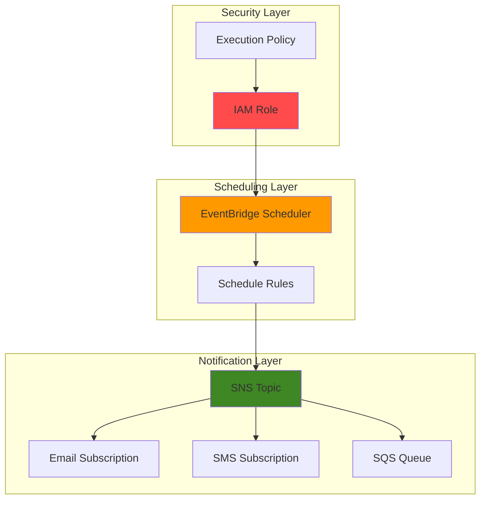

# Scheduling Notifications with EventBridge Scheduler and SNS

## Problem

Modern businesses need reliable, automated notification systems for routine tasks like daily sales reports, weekly inventory updates, and monthly compliance reminders. Manual notification processes are error-prone, inconsistent, and don't scale effectively across growing organizations. Without automated scheduling, critical business communications are often delayed or forgotten, leading to missed deadlines and operational inefficiencies.

## Solution

Build a serverless notification system using EventBridge Scheduler and SNS that automatically sends business notifications on predefined schedules. EventBridge Scheduler provides precise timing control with cron expressions, while SNS ensures reliable message delivery to multiple subscribers including email, SMS, and integrated systems, creating a cost-effective and scalable business automation solution.

## Architecture Diagram



## Prerequisites

1. AWS account with permissions to create EventBridge Scheduler schedules, SNS topics, and IAM roles
2. AWS CLI installed and configured (version 2.x recommended)
3. Basic understanding of cron expressions and JSON formatting
4. Valid email address for receiving test notifications
5. Estimated cost: $0.01-$0.50 per month for basic business notifications (depends on message volume)

> **Note**: EventBridge Scheduler pricing is $1.00 per million schedule invocations, making it highly cost-effective for business notifications.

## Preparation

EventBridge Scheduler and SNS work together to create reliable, serverless notification systems. EventBridge Scheduler provides enterprise-grade scheduling with built-in retry mechanisms and flexible time windows, while SNS ensures durable message delivery to multiple endpoints. This combination eliminates infrastructure management while providing the reliability businesses need for critical communications.

```bash
# Set environment variables
export AWS_REGION=$(aws configure get region)
export AWS_ACCOUNT_ID=$(aws sts get-caller-identity \
    --query Account --output text)

# Generate unique identifiers for resources
RANDOM_SUFFIX=$(aws secretsmanager get-random-password \
    --exclude-punctuation --exclude-uppercase \
    --password-length 6 --require-each-included-type \
    --output text --query RandomPassword)

# Set resource names
export TOPIC_NAME="business-notifications-${RANDOM_SUFFIX}"
export SCHEDULE_GROUP_NAME="business-schedules-${RANDOM_SUFFIX}"
export ROLE_NAME="eventbridge-scheduler-role-${RANDOM_SUFFIX}"

echo "✅ AWS environment configured with unique identifiers"
echo "Topic Name: ${TOPIC_NAME}"
echo "Schedule Group: ${SCHEDULE_GROUP_NAME}"
echo "IAM Role: ${ROLE_NAME}"
```

## Steps

1. **Create SNS Topic for Business Notifications**:

   Amazon SNS provides a fully managed pub/sub messaging service that forms the foundation of our notification system. Creating a standard SNS topic establishes the communication hub that will receive messages from EventBridge Scheduler and distribute them to all subscribers with 99.9% availability and built-in fault tolerance. The topic acts as a decoupling layer, allowing you to add or remove notification endpoints without affecting the scheduling logic.

   ```bash
   # Create SNS topic for business notifications
   aws sns create-topic \
       --name ${TOPIC_NAME} \
       --attributes DisplayName="Business Notifications" \
       --tags Key=Purpose,Value=BusinessNotifications \
              Key=Environment,Value=Production

   # Store topic ARN for later use
   export TOPIC_ARN=$(aws sns get-topic-attributes \
       --topic-arn arn:aws:sns:${AWS_REGION}:${AWS_ACCOUNT_ID}:${TOPIC_NAME} \
       --query Attributes.TopicArn --output text)

   echo "✅ SNS topic created: ${TOPIC_ARN}"
   ```

   The SNS topic is now ready to receive messages from EventBridge Scheduler and distribute them to subscribers. SNS provides built-in durability, retry mechanisms, and dead letter queue support, ensuring business-critical notifications are reliably delivered even if individual endpoints are temporarily unavailable.

2. **Create Email Subscription for Notifications**:

   Email subscriptions provide a reliable delivery mechanism for business notifications that stakeholders can access from any device. SNS handles the subscription confirmation process automatically through email verification, ensuring secure and authenticated delivery. This subscription model allows you to easily add or remove recipients without modifying the underlying scheduling infrastructure.

   ```bash
   # Create email subscription (replace with your email address)
   read -p "Enter your email address for notifications: " \
       EMAIL_ADDRESS
   
   aws sns subscribe \
       --topic-arn ${TOPIC_ARN} \
       --protocol email \
       --notification-endpoint ${EMAIL_ADDRESS}

   echo "✅ Email subscription created for ${EMAIL_ADDRESS}"
   echo "📧 Please check your email and confirm the subscription"
   ```

   Check your email inbox and click the confirmation link to activate the subscription. This security measure ensures that only authorized recipients receive business notifications, protecting sensitive information and maintaining compliance with email delivery standards.

3. **Create IAM Role for EventBridge Scheduler**:

   EventBridge Scheduler requires specific IAM permissions to publish messages to SNS topics on your behalf. Creating a dedicated execution role follows the AWS Well-Architected Framework's principle of least privilege, granting only the necessary permissions for the scheduler to function. This role ensures secure, auditable access to your notification infrastructure while maintaining proper security boundaries.

   ```bash
   # Create trust policy for EventBridge Scheduler
   cat > scheduler-trust-policy.json << 'EOF'
   {
     "Version": "2012-10-17",
     "Statement": [
       {
         "Effect": "Allow",
         "Principal": {
           "Service": "scheduler.amazonaws.com"
         },
         "Action": "sts:AssumeRole"
       }
     ]
   }
   EOF

   # Create IAM role for EventBridge Scheduler
   aws iam create-role \
       --role-name ${ROLE_NAME} \
       --assume-role-policy-document file://scheduler-trust-policy.json \
       --description "Execution role for EventBridge Scheduler"

   # Store role ARN for later use
   export ROLE_ARN=$(aws iam get-role \
       --role-name ${ROLE_NAME} \
       --query Role.Arn --output text)

   echo "✅ IAM role created: ${ROLE_ARN}"
   ```

   The IAM role provides the security foundation for automated notifications, ensuring that EventBridge Scheduler can only access the specific resources it needs to function. This approach maintains security while enabling reliable automation of business processes.

4. **Create IAM Policy for SNS Access**:

   The IAM policy defines the specific permissions EventBridge Scheduler needs to publish messages to your SNS topic. This policy follows AWS security best practices by implementing the principle of least privilege, ensuring that the scheduler can only publish to the designated topic while maintaining strict access controls and comprehensive audit logging.

   ```bash
   # Create IAM policy for SNS publishing
   cat > sns-publish-policy.json << EOF
   {
     "Version": "2012-10-17",
     "Statement": [
       {
         "Effect": "Allow",
         "Action": [
           "sns:Publish"
         ],
         "Resource": "${TOPIC_ARN}"
       }
     ]
   }
   EOF

   # Create and attach the policy to the role
   aws iam create-policy \
       --policy-name ${ROLE_NAME}-sns-policy \
       --policy-document file://sns-publish-policy.json \
       --description "Policy for EventBridge Scheduler to publish to SNS"

   # Store policy ARN
   export POLICY_ARN=$(aws iam list-policies \
       --query "Policies[?PolicyName=='${ROLE_NAME}-sns-policy'].Arn" \
       --output text)

   # Attach policy to role
   aws iam attach-role-policy \
       --role-name ${ROLE_NAME} \
       --policy-arn ${POLICY_ARN}

   echo "✅ IAM policy created and attached to role"
   ```

   The policy is now attached to the execution role, providing EventBridge Scheduler with the precise permissions needed to publish notifications. This configuration ensures secure, automated message delivery while maintaining strict access controls.

5. **Create Schedule Group for Organization**:

   Schedule groups provide logical organization for related schedules, enabling consistent management and tagging of business notification schedules. Creating a dedicated group simplifies administration, cost tracking, and access control for your notification infrastructure. Groups also support batch operations and unified monitoring across related schedules.

   ```bash
   # Create schedule group for business notifications
   aws scheduler create-schedule-group \
       --name ${SCHEDULE_GROUP_NAME} \
       --tags Purpose=BusinessNotifications,Environment=Production

   echo "✅ Schedule group created: ${SCHEDULE_GROUP_NAME}"
   ```

   The schedule group provides organizational structure for your notification schedules, making it easier to manage permissions, monitor costs, and maintain consistency across related business processes.

6. **Create Daily Business Report Schedule**:

   EventBridge Scheduler enables precise scheduling using cron expressions, providing enterprise-grade reliability for business-critical notifications. Creating a daily schedule demonstrates how to automate recurring business processes, ensuring consistent communication without manual intervention. The scheduler includes built-in retry mechanisms and flexible time windows for reliable delivery.

   ```bash
   # Create daily business report schedule (9 AM on weekdays)
   aws scheduler create-schedule \
       --name "daily-business-report" \
       --group-name ${SCHEDULE_GROUP_NAME} \
       --schedule-expression "cron(0 9 ? * MON-FRI *)" \
       --schedule-expression-timezone "America/New_York" \
       --description "Daily business report notification" \
       --target '{
         "Arn": "'"${TOPIC_ARN}"'",
         "RoleArn": "'"${ROLE_ARN}"'",
         "SnsParameters": {
           "Subject": "Daily Business Report - Ready for Review",
           "Message": "Good morning! Your daily business report is ready for review. Please check the dashboard for key metrics including sales performance, customer engagement, and operational status. Have a great day!"
         }
       }' \
       --flexible-time-window '{
         "Mode": "FLEXIBLE",
         "MaximumWindowInMinutes": 15
       }'

   echo "✅ Daily business report schedule created"
   ```

   The schedule is now active and will automatically send daily business report notifications at 9 AM on weekdays. The flexible time window allows EventBridge Scheduler to optimize delivery within a 15-minute window, improving system efficiency while maintaining business requirements.

7. **Create Weekly Summary Schedule**:

   Weekly schedules provide regular cadence for comprehensive business reviews and planning activities. This schedule demonstrates how to configure different notification frequencies for various business processes, enabling organizations to maintain consistent communication rhythms that align with their operational cycles.

   ```bash
   # Create weekly summary schedule (Monday 8 AM)
   aws scheduler create-schedule \
       --name "weekly-summary" \
       --group-name ${SCHEDULE_GROUP_NAME} \
       --schedule-expression "cron(0 8 ? * MON *)" \
       --schedule-expression-timezone "America/New_York" \
       --description "Weekly business summary notification" \
       --target '{
         "Arn": "'"${TOPIC_ARN}"'",
         "RoleArn": "'"${ROLE_ARN}"'",
         "SnsParameters": {
           "Subject": "Weekly Business Summary - New Week Ahead",
           "Message": "Good Monday morning! Here is your weekly business summary with key achievements from last week and priorities for the week ahead. Review the quarterly goals progress and upcoming milestones. Let us make this week productive!"
         }
       }' \
       --flexible-time-window '{
         "Mode": "FLEXIBLE",
         "MaximumWindowInMinutes": 30
       }'

   echo "✅ Weekly summary schedule created"
   ```

   The weekly schedule provides regular business rhythm with comprehensive summaries, helping teams stay aligned on priorities and progress. The 30-minute flexible window provides additional scheduling flexibility for this less time-sensitive communication.

8. **Create Monthly Reminder Schedule**:

   Monthly schedules support longer-term business processes like compliance reviews, strategic planning, and quarterly preparations. This schedule demonstrates how to configure different message content and timing for various business cycles, ensuring important monthly tasks receive appropriate attention and follow-through.

   ```bash
   # Create monthly reminder schedule (1st of each month at 10 AM)
   aws scheduler create-schedule \
       --name "monthly-reminder" \
       --group-name ${SCHEDULE_GROUP_NAME} \
       --schedule-expression "cron(0 10 1 * ? *)" \
       --schedule-expression-timezone "America/New_York" \
       --description "Monthly business reminder notification" \
       --target '{
         "Arn": "'"${TOPIC_ARN}"'",
         "RoleArn": "'"${ROLE_ARN}"'",
         "SnsParameters": {
           "Subject": "Monthly Business Reminder - Important Tasks",
           "Message": "Welcome to a new month! This is your monthly reminder for important business tasks: review financial reports, update quarterly projections, conduct team performance reviews, and assess goal progress. Schedule time for strategic planning and process improvements."
         }
       }' \
       --flexible-time-window '{
         "Mode": "OFF"
       }'

   echo "✅ Monthly reminder schedule created"
   ```

   The monthly schedule ensures important business processes receive consistent attention, helping maintain operational excellence and strategic focus. The fixed timing (no flexible window) ensures precise delivery for time-sensitive monthly activities.

## Validation & Testing

1. **Verify SNS Topic and Subscription**:

   ```bash
   # Check SNS topic attributes
   aws sns get-topic-attributes \
       --topic-arn ${TOPIC_ARN} \
       --query Attributes

   # List subscriptions for the topic
   aws sns list-subscriptions-by-topic \
       --topic-arn ${TOPIC_ARN} \
       --query Subscriptions
   ```

   Expected output: Topic attributes should show DisplayName and policy information. Subscriptions should show your email address with "Confirmed" status.

2. **Test Manual SNS Message Publishing**:

   ```bash
   # Send test message to verify notification delivery
   aws sns publish \
       --topic-arn ${TOPIC_ARN} \
       --subject "Test Business Notification" \
       --message "This is a test message to verify your business notification system is working correctly."
   ```

   Expected output: You should receive an email within 1-2 minutes with the test message.

3. **Verify EventBridge Scheduler Schedules**:

   ```bash
   # List all schedules in the group
   aws scheduler list-schedules \
       --group-name ${SCHEDULE_GROUP_NAME} \
       --query Schedules

   # Get details for a specific schedule
   aws scheduler get-schedule \
       --name "daily-business-report" \
       --group-name ${SCHEDULE_GROUP_NAME}
   ```

   Expected output: Should show all three schedules (daily, weekly, monthly) with their configurations and next execution times.

4. **Verify IAM Role Permissions**:

   ```bash
   # Check role trust policy
   aws iam get-role \
       --role-name ${ROLE_NAME} \
       --query Role.AssumeRolePolicyDocument

   # List attached policies
   aws iam list-attached-role-policies \
       --role-name ${ROLE_NAME}
   ```

   Expected output: Trust policy should show scheduler.amazonaws.com as trusted entity. Attached policies should include the SNS publishing policy.

## Cleanup

1. **Delete EventBridge Scheduler Schedules**:

   ```bash
   # Delete all schedules in the group
   aws scheduler delete-schedule \
       --name "daily-business-report" \
       --group-name ${SCHEDULE_GROUP_NAME}
   
   aws scheduler delete-schedule \
       --name "weekly-summary" \
       --group-name ${SCHEDULE_GROUP_NAME}
   
   aws scheduler delete-schedule \
       --name "monthly-reminder" \
       --group-name ${SCHEDULE_GROUP_NAME}

   echo "✅ All schedules deleted"
   ```

2. **Delete Schedule Group**:

   ```bash
   # Delete the schedule group
   aws scheduler delete-schedule-group \
       --name ${SCHEDULE_GROUP_NAME}

   echo "✅ Schedule group deleted"
   ```

3. **Delete IAM Role and Policy**:

   ```bash
   # Detach policy from role
   aws iam detach-role-policy \
       --role-name ${ROLE_NAME} \
       --policy-arn ${POLICY_ARN}

   # Delete the policy
   aws iam delete-policy \
       --policy-arn ${POLICY_ARN}

   # Delete the role
   aws iam delete-role \
       --role-name ${ROLE_NAME}

   echo "✅ IAM role and policy deleted"
   ```

4. **Delete SNS Topic and Subscriptions**:

   ```bash
   # Delete SNS topic (automatically removes subscriptions)
   aws sns delete-topic \
       --topic-arn ${TOPIC_ARN}

   echo "✅ SNS topic and subscriptions deleted"
   ```

5. **Clean up local files**:

   ```bash
   # Remove temporary policy files
   rm -f scheduler-trust-policy.json sns-publish-policy.json

   echo "✅ Local files cleaned up"
   ```

## Discussion

This solution demonstrates how EventBridge Scheduler and SNS work together to create reliable, serverless business notification systems. EventBridge Scheduler provides enterprise-grade scheduling capabilities with precise cron expression support, built-in retry mechanisms, and flexible time windows that ensure notifications are delivered reliably even during peak AWS usage periods. The service automatically handles infrastructure scaling, eliminating the need to manage servers or containers for scheduling tasks.

Amazon SNS complements EventBridge Scheduler by providing durable, scalable message delivery to multiple endpoints simultaneously. The pub/sub model allows you to easily add or remove notification recipients without modifying the scheduling logic, supporting organizational changes and communication preferences. SNS also provides built-in retry mechanisms and dead letter queue support, ensuring that critical business notifications reach their intended recipients even when individual endpoints are temporarily unavailable.

The serverless architecture demonstrated in this recipe follows AWS Well-Architected Framework principles by implementing automated scaling, built-in fault tolerance, and pay-per-use pricing that aligns costs with actual usage. This approach eliminates the operational overhead of managing notification infrastructure while providing enterprise-grade reliability for business-critical communications. The solution scales automatically from a few notifications per day to millions of messages without requiring infrastructure changes or capacity planning.

Security is implemented through IAM roles and policies that follow the principle of least privilege, ensuring that EventBridge Scheduler can only access the specific SNS topics it needs to function. This approach maintains strict access controls while enabling reliable automation of business processes. The solution also supports advanced features like message filtering, encryption at rest and in transit, and integration with AWS CloudTrail for comprehensive audit logging.

> **Tip**: Use SNS message filtering to create targeted notifications for different business units or roles without creating multiple topics. This approach reduces complexity while providing personalized communication experiences.

**Documentation Sources:**

- [Amazon EventBridge Scheduler User Guide](https://docs.aws.amazon.com/scheduler/latest/UserGuide/what-is-scheduler.html)
- [Amazon SNS Developer Guide](https://docs.aws.amazon.com/sns/latest/dg/welcome.html)
- [EventBridge Scheduler IAM Permissions](https://docs.aws.amazon.com/scheduler/latest/UserGuide/security_iam_service-with-iam.html)
- [SNS Message Filtering](https://docs.aws.amazon.com/sns/latest/dg/sns-message-filtering.html)
- [AWS Well-Architected Framework](https://docs.aws.amazon.com/wellarchitected/latest/framework/welcome.html)

## Challenge

Extend this solution by implementing these enhancements:

1. **Add SMS Notifications**: Configure SMS subscriptions to SNS topics for urgent business alerts, implementing different message content for mobile devices with character limits and actionable information.

2. **Implement Message Filtering**: Create subscription filters to send different notifications to different teams based on message attributes, enabling personalized communication without multiple topics.

3. **Add SQS Integration**: Connect an SQS queue to the SNS topic for reliable message queuing and processing, enabling downstream systems to process notifications asynchronously with built-in retry mechanisms.

4. **Create Dynamic Scheduling**: Use Lambda functions to dynamically create and modify schedules based on business events, enabling adaptive notification systems that respond to changing business requirements.

5. **Build Monitoring Dashboard**: Implement CloudWatch dashboards to monitor notification delivery rates, failures, and costs, providing visibility into system performance and business communication effectiveness.

## Infrastructure Code

### Available Infrastructure as Code:

- [Infrastructure Code Overview](code/README.md) - Detailed description of all infrastructure components
- [AWS CDK (Python)](code/cdk-python/) - AWS CDK Python implementation
- [AWS CDK (TypeScript)](code/cdk-typescript/) - AWS CDK TypeScript implementation
- [CloudFormation](code/cloudformation.yaml) - AWS CloudFormation template
- [Bash CLI Scripts](code/scripts/) - Example bash scripts using AWS CLI commands to deploy infrastructure
- [Terraform](code/terraform/) - Terraform configuration files