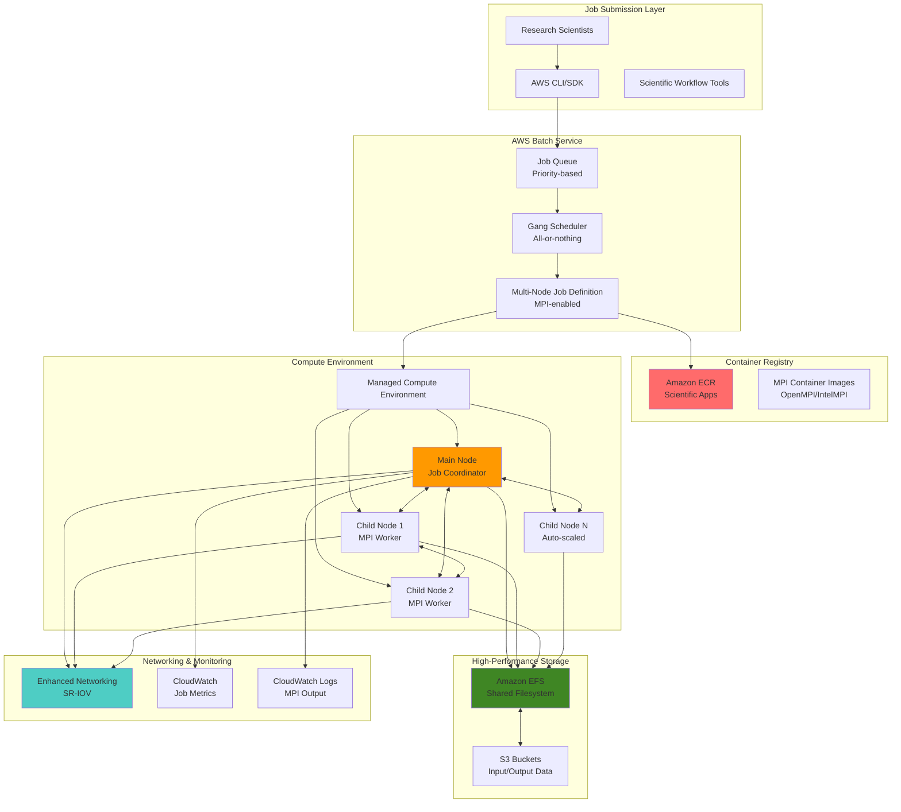

# Implementing Distributed Scientific Computing with AWS Batch Multi-Node Jobs

## Problem

Scientific research organizations and engineering teams need to execute large-scale computational workloads that require tightly-coupled parallel processing across multiple nodes. Traditional single-node jobs cannot handle complex molecular dynamics simulations, weather modeling, or computational fluid dynamics that require Message Passing Interface (MPI) communication between nodes. Researchers struggle with manually configuring cluster networking, managing job dependencies, and optimizing resource allocation for distributed workloads while maintaining cost efficiency and fault tolerance.

## Solution

AWS Batch multi-node parallel jobs enable distributed scientific computing by automatically provisioning and coordinating multiple EC2 instances for tightly-coupled workloads. This solution leverages gang scheduling to ensure all nodes start simultaneously, provides MPI-ready networking with enhanced networking capabilities, and integrates with shared storage systems to handle large datasets efficiently while automatically managing resource lifecycle and cost optimization.

## Architecture Diagram



## Prerequisites

1. AWS account with permissions for Batch, EC2, ECR, EFS, VPC, and IAM
2. AWS CLI v2 installed and configured (or AWS CloudShell)
3. Docker installed for building container images
4. Understanding of MPI programming concepts and parallel computing
5. Familiarity with scientific computing workflows and job scheduling
6. Estimated cost: $2-10/hour depending on instance types and node count

> **Warning**: Multi-node parallel jobs use dedicated instances and can be expensive. Always monitor costs and follow cleanup procedures to avoid unexpected charges.

## Preparation

```bash
# Set environment variables
export AWS_REGION=$(aws configure get region)
export AWS_ACCOUNT_ID=$(aws sts get-caller-identity \
    --query Account --output text)

# Generate unique identifiers for resources
RANDOM_SUFFIX=$(aws secretsmanager get-random-password \
    --exclude-punctuation --exclude-uppercase \
    --password-length 6 --require-each-included-type \
    --output text --query RandomPassword)

export CLUSTER_NAME="sci-computing-${RANDOM_SUFFIX}"
export JOB_QUEUE_NAME="scientific-queue-${RANDOM_SUFFIX}"
export COMPUTE_ENV_NAME="sci-compute-env-${RANDOM_SUFFIX}"
export ECR_REPO_NAME="scientific-mpi-${RANDOM_SUFFIX}"
export EFS_NAME="sci-data-${RANDOM_SUFFIX}"
export VPC_NAME="sci-vpc-${RANDOM_SUFFIX}"

# Create VPC for the compute environment
VPC_ID=$(aws ec2 create-vpc \
    --cidr-block 10.0.0.0/16 \
    --tag-specifications 'ResourceType=vpc,Tags=[{Key=Name,Value='${VPC_NAME}'}]' \
    --query 'Vpc.VpcId' --output text)

# Create subnet for Batch compute environment
SUBNET_ID=$(aws ec2 create-subnet \
    --vpc-id ${VPC_ID} \
    --cidr-block 10.0.1.0/24 \
    --availability-zone ${AWS_REGION}a \
    --tag-specifications 'ResourceType=subnet,Tags=[{Key=Name,Value='${VPC_NAME}'-subnet}]' \
    --query 'Subnet.SubnetId' --output text)

echo "✅ Basic infrastructure created"
```

## Steps

1. **Create and Configure Networking Infrastructure**:

   Multi-node parallel jobs require high-performance networking between compute nodes to enable efficient MPI communication. AWS Enhanced Networking with SR-IOV provides the low-latency, high-bandwidth connectivity essential for distributed scientific computing workloads. This step establishes the networking foundation that enables nodes to communicate with minimal overhead, directly impacting the performance of tightly-coupled parallel applications.

   ```bash
   # Create internet gateway and attach to VPC
   IGW_ID=$(aws ec2 create-internet-gateway \
       --tag-specifications 'ResourceType=internet-gateway,Tags=[{Key=Name,Value='${VPC_NAME}'-igw}]' \
       --query 'InternetGateway.InternetGatewayId' --output text)
   
   aws ec2 attach-internet-gateway \
       --internet-gateway-id ${IGW_ID} \
       --vpc-id ${VPC_ID}
   
   # Create and configure route table
   ROUTE_TABLE_ID=$(aws ec2 describe-route-tables \
       --filters "Name=vpc-id,Values=${VPC_ID}" \
       --query 'RouteTables[0].RouteTableId' --output text)
   
   aws ec2 create-route \
       --route-table-id ${ROUTE_TABLE_ID} \
       --destination-cidr-block 0.0.0.0/0 \
       --gateway-id ${IGW_ID}
   
   # Enable auto-assign public IPs for the subnet
   aws ec2 modify-subnet-attribute \
       --subnet-id ${SUBNET_ID} \
       --map-public-ip-on-launch
   
   echo "✅ Networking configured for multi-node communication"
   ```

   The networking infrastructure is now established with internet access and proper routing. This configuration enables Batch compute instances to communicate with each other and external services, including downloading container images from ECR and accessing shared storage. The public subnet configuration allows nodes to reach the internet for package downloads and service communication while maintaining the ability to communicate privately within the cluster.

2. **Create Security Group for MPI Communication**:

   Security groups act as virtual firewalls that control network traffic for MPI communication between compute nodes. MPI applications require unrestricted communication between nodes on all ports and protocols to coordinate parallel tasks effectively. This security configuration follows the principle of least privilege while enabling the necessary inter-node communication patterns that distributed scientific applications depend on.

   ```bash
   # Create security group for Batch multi-node jobs
   SG_ID=$(aws ec2 create-security-group \
       --group-name ${CLUSTER_NAME}-batch-sg \
       --description "Security group for multi-node Batch jobs" \
       --vpc-id ${VPC_ID} \
       --tag-specifications 'ResourceType=security-group,Tags=[{Key=Name,Value='${CLUSTER_NAME}'-batch-sg}]' \
       --query 'GroupId' --output text)
   
   # Allow all traffic within security group for MPI communication
   aws ec2 authorize-security-group-ingress \
       --group-id ${SG_ID} \
       --protocol all \
       --source-group ${SG_ID}
   
   # Allow SSH access for debugging (optional)
   aws ec2 authorize-security-group-ingress \
       --group-id ${SG_ID} \
       --protocol tcp \
       --port 22 \
       --cidr 0.0.0.0/0
   
   # Allow EFS NFS traffic
   aws ec2 authorize-security-group-ingress \
       --group-id ${SG_ID} \
       --protocol tcp \
       --port 2049 \
       --source-group ${SG_ID}
   
   echo "✅ Security group configured for MPI and EFS"
   ```

   The security group now enables secure communication between compute nodes while maintaining isolation from external networks. The self-referencing security group rule allows all instances within the same security group to communicate freely, which is essential for MPI job coordination. This configuration provides the network security foundation needed for both parallel computing communication and shared storage access.

3. **Create EFS Filesystem for Shared Data**:

   Amazon EFS provides POSIX-compliant shared storage that automatically scales and delivers consistent performance across multiple compute nodes. For distributed scientific computing, shared storage is critical for accessing input datasets, sharing intermediate results, and storing final outputs. EFS eliminates the need for complex distributed file system setup while providing the high-throughput, low-latency access patterns required by parallel computing workloads.

   ```bash
   # Create EFS filesystem
   EFS_ID=$(aws efs create-file-system \
       --creation-token ${EFS_NAME}-token \
       --performance-mode generalPurpose \
       --throughput-mode provisioned \
       --provisioned-throughput-in-mibps 100 \
       --encrypted \
       --tags Key=Name,Value=${EFS_NAME} \
       --query 'FileSystemId' --output text)
   
   # Wait for filesystem to become available
   aws efs wait file-system-available \
       --file-system-id ${EFS_ID}
   
   # Create mount target in subnet
   MOUNT_TARGET_ID=$(aws efs create-mount-target \
       --file-system-id ${EFS_ID} \
       --subnet-id ${SUBNET_ID} \
       --security-groups ${SG_ID} \
       --query 'MountTargetId' --output text)
   
   # Wait for mount target to become available
   aws efs wait mount-target-available \
       --mount-target-id ${MOUNT_TARGET_ID}
   
   echo "✅ EFS filesystem created: ${EFS_ID}"
   ```

   The EFS filesystem is now ready to serve as shared storage for all compute nodes in the cluster. The provisioned throughput mode ensures predictable performance for data-intensive scientific applications. This shared storage layer enables complex workflows where nodes must access common datasets, share intermediate computational results, and coordinate through file-based communication patterns essential for many scientific computing applications.

4. **Create ECR Repository and Build MPI Container Image**:

   Container-based deployment ensures reproducible scientific computing environments across all nodes while simplifying dependency management. Amazon ECR provides secure, scalable container image storage integrated with AWS Batch. This approach packages MPI libraries, scientific applications, and all dependencies into a single, portable container image that can be deployed consistently across the distributed computing cluster, eliminating "works on my machine" issues common in scientific computing.

   ```bash
   # Create ECR repository
   ECR_URI=$(aws ecr create-repository \
       --repository-name ${ECR_REPO_NAME} \
       --image-scanning-configuration scanOnPush=true \
       --query 'repository.repositoryUri' --output text)
   
   # Get ECR login token
   aws ecr get-login-password --region ${AWS_REGION} | \
       docker login --username AWS --password-stdin ${ECR_URI}
   
   # Create Dockerfile for MPI-enabled scientific computing
   mkdir -p /tmp/mpi-container
   cat > /tmp/mpi-container/Dockerfile << 'EOF'
   FROM ubuntu:20.04
   
   # Prevent interactive prompts during package installation
   ENV DEBIAN_FRONTEND=noninteractive
   
   # Install essential packages and MPI
   RUN apt-get update && apt-get install -y \
       build-essential \
       gfortran \
       openmpi-bin \
       openmpi-common \
       libopenmpi-dev \
       python3 \
       python3-pip \
       python3-numpy \
       python3-scipy \
       nfs-common \
       curl \
       wget \
       vim \
       && rm -rf /var/lib/apt/lists/*
   
   # Install additional scientific libraries
   RUN pip3 install mpi4py matplotlib pandas
   
   # Set up MPI environment
   ENV OMPI_ALLOW_RUN_AS_ROOT=1
   ENV OMPI_ALLOW_RUN_AS_ROOT_CONFIRM=1
   
   # Create working directory
   WORKDIR /app
   
   # Copy MPI test applications
   COPY mpi_test.py /app/
   COPY run_mpi_job.sh /app/
   
   # Make script executable
   RUN chmod +x /app/run_mpi_job.sh
   
   # Default command
   CMD ["/app/run_mpi_job.sh"]
   EOF
   
   # Create MPI test application
   cat > /tmp/mpi-container/mpi_test.py << 'EOF'
   #!/usr/bin/env python3
   """
   Simple MPI test application for scientific computing validation
   """
   import sys
   import time
   import numpy as np
   from mpi4py import MPI
   
   def main():
       # Initialize MPI
       comm = MPI.COMM_WORLD
       rank = comm.Get_rank()
       size = comm.Get_size()
       
       print(f"Process {rank} of {size} on node {MPI.Get_processor_name()}")
       
       # Simple computational workload
       if rank == 0:
           print("Starting distributed computation...")
           start_time = time.time()
       
       # Each process computes part of a larger matrix operation
       local_size = 1000
       local_matrix = np.random.rand(local_size, local_size)
       local_result = np.dot(local_matrix, local_matrix.T)
       
       # Gather results at root
       results = comm.gather(np.sum(local_result), root=0)
       
       if rank == 0:
           total_sum = sum(results)
           end_time = time.time()
           print(f"Computation completed in {end_time - start_time:.2f} seconds")
           print(f"Total sum across all processes: {total_sum:.2e}")
           print("✅ MPI job completed successfully")
   
   if __name__ == "__main__":
       main()
   EOF
   
   # Create job runner script
   cat > /tmp/mpi-container/run_mpi_job.sh << 'EOF'
   #!/bin/bash
   set -e
   
   echo "=== MPI Multi-Node Job Starting ==="
   echo "AWS Batch Job ID: ${AWS_BATCH_JOB_ID}"
   echo "Main node index: ${AWS_BATCH_JOB_MAIN_NODE_INDEX}"
   echo "Current node index: ${AWS_BATCH_JOB_NODE_INDEX}"
   echo "Number of nodes: ${AWS_BATCH_JOB_NUM_NODES}"
   
   # Mount EFS if available
   if [ ! -z "${EFS_MOUNT_POINT}" ]; then
       echo "Mounting EFS filesystem..."
       mkdir -p ${EFS_MOUNT_POINT}
       mount -t nfs4 -o nfsvers=4.1,rsize=1048576,wsize=1048576,hard,intr,timeo=600 \
           ${EFS_DNS_NAME}:/ ${EFS_MOUNT_POINT}
       echo "EFS mounted at ${EFS_MOUNT_POINT}"
   fi
   
   # Only run on main node
   if [ "${AWS_BATCH_JOB_NODE_INDEX}" = "${AWS_BATCH_JOB_MAIN_NODE_INDEX}" ]; then
       echo "Running MPI application from main node..."
       
       # Wait for all nodes to be ready (simple coordination)
       sleep 30
       
       # Run MPI job across all nodes
       mpirun --allow-run-as-root \
              --host ${AWS_BATCH_JOB_NODE_LIST} \
              -np ${AWS_BATCH_JOB_NUM_NODES} \
              python3 /app/mpi_test.py
   else
       echo "Child node waiting for MPI coordinator..."
       # Child nodes wait for main node to coordinate
       while true; do
           sleep 10
       done
   fi
   EOF
   
   # Build and push container image
   cd /tmp/mpi-container
   docker build -t ${ECR_REPO_NAME} .
   docker tag ${ECR_REPO_NAME}:latest ${ECR_URI}:latest
   docker push ${ECR_URI}:latest
   
   echo "✅ MPI container image built and pushed to ECR"
   ```

   The MPI-enabled container image is now available in ECR and ready for deployment across multiple compute nodes. This containerized approach provides environment consistency, simplifies deployment, and enables version control of the entire software stack. The image includes OpenMPI, Python scientific libraries, and a sample distributed computing application that demonstrates the gang scheduling and inter-node communication patterns essential for scientific computing workflows.

5. **Create IAM Roles for Batch**:

   IAM roles provide secure, temporary credentials for AWS services to interact with other AWS resources without hardcoding access keys. AWS Batch requires specific service roles to manage compute environments, launch EC2 instances, and coordinate job execution. Following the principle of least privilege, these roles grant only the minimum permissions necessary for Batch to function, ensuring secure access to compute resources while maintaining operational flexibility.

   ```bash
   # Create Batch service role
   cat > /tmp/batch-service-role-trust.json << EOF
   {
       "Version": "2012-10-17",
       "Statement": [
           {
               "Effect": "Allow",
               "Principal": {
                   "Service": "batch.amazonaws.com"
               },
               "Action": "sts:AssumeRole"
           }
       ]
   }
   EOF
   
   aws iam create-role \
       --role-name ${CLUSTER_NAME}-batch-service-role \
       --assume-role-policy-document file:///tmp/batch-service-role-trust.json
   
   aws iam attach-role-policy \
       --role-name ${CLUSTER_NAME}-batch-service-role \
       --policy-arn arn:aws:iam::aws:policy/service-role/AWSBatchServiceRole
   
   # Create instance role for EC2 instances
   cat > /tmp/batch-instance-role-trust.json << EOF
   {
       "Version": "2012-10-17",
       "Statement": [
           {
               "Effect": "Allow",
               "Principal": {
                   "Service": "ec2.amazonaws.com"
               },
               "Action": "sts:AssumeRole"
           }
       ]
   }
   EOF
   
   aws iam create-role \
       --role-name ${CLUSTER_NAME}-batch-instance-role \
       --assume-role-policy-document file:///tmp/batch-instance-role-trust.json
   
   aws iam attach-role-policy \
       --role-name ${CLUSTER_NAME}-batch-instance-role \
       --policy-arn arn:aws:iam::aws:policy/service-role/AmazonEC2ContainerServiceforEC2Role
   
   # Create instance profile
   aws iam create-instance-profile \
       --instance-profile-name ${CLUSTER_NAME}-batch-instance-profile
   
   aws iam add-role-to-instance-profile \
       --instance-profile-name ${CLUSTER_NAME}-batch-instance-profile \
       --role-name ${CLUSTER_NAME}-batch-instance-role
   
   echo "✅ IAM roles and instance profile created"
   ```

   The IAM roles and instance profile provide secure credentials for the Batch service to manage compute resources and for EC2 instances to communicate with other AWS services. This security foundation enables automatic instance provisioning, container image retrieval, and service coordination while maintaining the principle of least privilege. The roles ensure that compute nodes can access necessary resources without exposing long-term credentials.

6. **Create Batch Compute Environment**:

   AWS Batch managed compute environments automatically provision and manage EC2 instances based on job queue demand. For scientific computing workloads, the compute environment handles the complex orchestration of launching multiple instances simultaneously for multi-node parallel jobs. This eliminates the operational burden of cluster management while providing the gang scheduling capability essential for tightly-coupled parallel applications that require all nodes to start and communicate from the beginning.

   ```bash
   # Create compute environment configuration
   cat > /tmp/compute-environment.json << EOF
   {
       "computeEnvironmentName": "${COMPUTE_ENV_NAME}",
       "type": "MANAGED",
       "state": "ENABLED",
       "computeResources": {
           "type": "EC2",
           "minvCpus": 0,
           "maxvCpus": 256,
           "desiredvCpus": 0,
           "instanceTypes": ["c5.large", "c5.xlarge", "c5.2xlarge"],
           "subnets": ["${SUBNET_ID}"],
           "securityGroupIds": ["${SG_ID}"],
           "instanceRole": "arn:aws:iam::${AWS_ACCOUNT_ID}:instance-profile/${CLUSTER_NAME}-batch-instance-profile",
           "tags": {
               "Environment": "scientific-computing",
               "Project": "${CLUSTER_NAME}"
           }
       },
       "serviceRole": "arn:aws:iam::${AWS_ACCOUNT_ID}:role/${CLUSTER_NAME}-batch-service-role"
   }
   EOF
   
   # Create the compute environment
   aws batch create-compute-environment \
       --cli-input-json file:///tmp/compute-environment.json
   
   # Wait for compute environment to be valid
   echo "Waiting for compute environment to be ready..."
   aws batch wait compute-environment-in-service \
       --compute-environments ${COMPUTE_ENV_NAME}
   
   echo "✅ Batch compute environment created and ready"
   ```

   The managed compute environment is now ready to automatically provision EC2 instances for multi-node parallel jobs. This configuration enables elastic scaling from 0 to 256 vCPUs based on job queue demand, providing cost-effective resource utilization for scientific computing workloads. The compute environment uses enhanced networking-capable instance types (C5 family) that support SR-IOV for optimal MPI performance in distributed computing scenarios.

   > **Note**: Multi-node parallel jobs require enhanced networking (SR-IOV) enabled instance types for optimal MPI performance. Review [AWS Batch networking](https://docs.aws.amazon.com/batch/latest/userguide/multi-node-parallel-jobs.html) for best practices.

7. **Create Job Queue and Job Definition**:

   Job queues manage the submission and scheduling of batch jobs, while job definitions specify the requirements and configuration for multi-node parallel jobs. The job definition enables gang scheduling, ensuring all nodes for a job start simultaneously - a critical requirement for MPI applications where nodes must coordinate from the beginning. This configuration defines the container image, resource requirements, and node coordination parameters necessary for distributed scientific computing.

   ```bash
   # Create job queue
   aws batch create-job-queue \
       --job-queue-name ${JOB_QUEUE_NAME} \
       --state ENABLED \
       --priority 1 \
       --compute-environment-order order=1,computeEnvironment=${COMPUTE_ENV_NAME}
   
   # Wait for job queue to be valid
   aws batch wait job-queue-in-service \
       --job-queues ${JOB_QUEUE_NAME}
   
   # Create multi-node parallel job definition
   cat > /tmp/job-definition.json << EOF
   {
       "jobDefinitionName": "${CLUSTER_NAME}-mpi-job",
       "type": "multinode",
       "nodeProperties": {
           "mainNode": 0,
           "numNodes": 2,
           "nodeRangeProperties": [
               {
                   "targetNodes": "0:",
                   "container": {
                       "image": "${ECR_URI}:latest",
                       "vcpus": 2,
                       "memory": 4096,
                       "environment": [
                           {
                               "name": "EFS_DNS_NAME",
                               "value": "${EFS_ID}.efs.${AWS_REGION}.amazonaws.com"
                           },
                           {
                               "name": "EFS_MOUNT_POINT",
                               "value": "/mnt/efs"
                           }
                       ],
                       "mountPoints": [
                           {
                               "sourceVolume": "tmp",
                               "containerPath": "/tmp"
                           }
                       ],
                       "volumes": [
                           {
                               "name": "tmp",
                               "host": {
                                   "sourcePath": "/tmp"
                               }
                           }
                       ],
                       "privileged": true
                   }
               }
           ]
       },
       "retryStrategy": {
           "attempts": 1
       },
       "timeout": {
           "attemptDurationSeconds": 3600
       }
   }
   EOF
   
   # Register the job definition
   JOB_DEF_ARN=$(aws batch register-job-definition \
       --cli-input-json file:///tmp/job-definition.json \
       --query 'jobDefinitionArn' --output text)
   
   echo "✅ Job queue and multi-node job definition created"
   echo "Job Definition ARN: ${JOB_DEF_ARN}"
   ```

   The job queue and multi-node job definition are now ready to coordinate distributed scientific computing workloads. The job definition specifies the "multinode" type, which enables gang scheduling where all nodes start simultaneously. This configuration ensures that MPI applications can establish communication between nodes immediately upon launch, enabling the tight coupling required for parallel scientific algorithms and distributed computational workflows.

8. **Submit Test Multi-Node Job**:

   Job submission triggers the gang scheduling process where AWS Batch coordinates the simultaneous launch of multiple EC2 instances for parallel execution. This demonstrates the complete multi-node parallel job lifecycle, from resource provisioning through job execution to resource cleanup. The test job validates that MPI communication works correctly across nodes and that the distributed computing infrastructure is properly configured for scientific workloads.

   ```bash
   # Submit a multi-node parallel job
   JOB_ID=$(aws batch submit-job \
       --job-name ${CLUSTER_NAME}-test-job \
       --job-queue ${JOB_QUEUE_NAME} \
       --job-definition ${CLUSTER_NAME}-mpi-job \
       --query 'jobId' --output text)
   
   echo "✅ Multi-node job submitted with ID: ${JOB_ID}"
   echo "Monitor job status with:"
   echo "aws batch describe-jobs --jobs ${JOB_ID}"
   
   # Wait for job to start (optional)
   echo "Waiting for job to start..."
   aws batch wait job-status-running --job-id ${JOB_ID}
   
   echo "✅ Job is now running across multiple nodes"
   ```

   The multi-node parallel job is now executing across multiple EC2 instances with coordinated MPI communication. AWS Batch has automatically provisioned the required compute resources, deployed the container image to all nodes, and established the networking necessary for distributed computing. This demonstrates the complete automation of complex cluster management tasks that would traditionally require significant manual configuration and ongoing maintenance.

9. **Create Advanced Job Definition with Parameter Support**:

   ```bash
   # Create advanced job definition with parameterization
   cat > /tmp/advanced-job-definition.json << EOF
   {
       "jobDefinitionName": "${CLUSTER_NAME}-parameterized-mpi",
       "type": "multinode",
       "parameters": {
           "inputDataPath": "/mnt/efs/input",
           "outputDataPath": "/mnt/efs/output",
           "computeIntensity": "medium"
       },
       "nodeProperties": {
           "mainNode": 0,
           "numNodes": 4,
           "nodeRangeProperties": [
               {
                   "targetNodes": "0:",
                   "container": {
                       "image": "${ECR_URI}:latest",
                       "vcpus": 4,
                       "memory": 8192,
                       "environment": [
                           {
                               "name": "EFS_DNS_NAME",
                               "value": "${EFS_ID}.efs.${AWS_REGION}.amazonaws.com"
                           },
                           {
                               "name": "EFS_MOUNT_POINT",
                               "value": "/mnt/efs"
                           },
                           {
                               "name": "INPUT_PATH",
                               "value": "Ref::inputDataPath"
                           },
                           {
                               "name": "OUTPUT_PATH",
                               "value": "Ref::outputDataPath"
                           },
                           {
                               "name": "COMPUTE_INTENSITY",
                               "value": "Ref::computeIntensity"
                           }
                       ],
                       "mountPoints": [
                           {
                               "sourceVolume": "tmp",
                               "containerPath": "/tmp"
                           }
                       ],
                       "volumes": [
                           {
                               "name": "tmp",
                               "host": {
                                   "sourcePath": "/tmp"
                               }
                           }
                       ],
                       "privileged": true
                   }
               }
           ]
       },
       "retryStrategy": {
           "attempts": 2
       },
       "timeout": {
           "attemptDurationSeconds": 7200
       }
   }
   EOF
   
   # Register advanced job definition
   ADVANCED_JOB_DEF_ARN=$(aws batch register-job-definition \
       --cli-input-json file:///tmp/advanced-job-definition.json \
       --query 'jobDefinitionArn' --output text)
   
   echo "✅ Advanced parameterized job definition created"
   echo "Advanced Job Definition ARN: ${ADVANCED_JOB_DEF_ARN}"
   ```

10. **Set Up Job Monitoring and Logging**:

    Comprehensive monitoring and logging enable researchers to track job performance, debug issues, and optimize resource usage for scientific computing workloads. CloudWatch provides real-time metrics and centralized logging for distributed jobs, while custom dashboards offer visibility into job queues, resource utilization, and application-specific metrics. This observability foundation is essential for managing large-scale scientific computing operations and ensuring reliable job execution.

    ```bash
    # Create CloudWatch dashboard for monitoring
    cat > /tmp/dashboard.json << EOF
    {
        "widgets": [
            {
                "type": "metric",
                "properties": {
                    "metrics": [
                        ["AWS/Batch", "SubmittedJobs", "JobQueue", "${JOB_QUEUE_NAME}"],
                        [".", "RunnableJobs", ".", "."],
                        [".", "RunningJobs", ".", "."]
                    ],
                    "period": 300,
                    "stat": "Sum",
                    "region": "${AWS_REGION}",
                    "title": "Batch Job Status - ${JOB_QUEUE_NAME}"
                }
            },
            {
                "type": "log",
                "properties": {
                    "query": "SOURCE '/aws/batch/job' | fields @timestamp, @message | filter @message like /MPI/ | sort @timestamp desc | limit 100",
                    "region": "${AWS_REGION}",
                    "title": "MPI Job Logs",
                    "view": "table"
                }
            }
        ]
    }
    EOF
    
    aws cloudwatch put-dashboard \
        --dashboard-name ${CLUSTER_NAME}-monitoring \
        --dashboard-body file:///tmp/dashboard.json
    
    # Create CloudWatch alarm for failed jobs
    aws cloudwatch put-metric-alarm \
        --alarm-name "${CLUSTER_NAME}-failed-jobs" \
        --alarm-description "Alert when jobs fail" \
        --metric-name FailedJobs \
        --namespace AWS/Batch \
        --statistic Sum \
        --period 300 \
        --threshold 1 \
        --comparison-operator GreaterThanOrEqualToThreshold \
        --dimensions Name=JobQueue,Value=${JOB_QUEUE_NAME} \
        --evaluation-periods 1
    
    echo "✅ Monitoring and alerting configured"
    ```

    The monitoring infrastructure now provides comprehensive visibility into job performance and resource utilization. The CloudWatch dashboard displays real-time metrics for job queues, enabling proactive management of scientific computing workloads. Automated alerts notify administrators of job failures, ensuring rapid response to computational issues that could impact research timelines and resource costs.

11. **Create Job Submission Script for Researchers**:

    A user-friendly job submission script abstracts the complexity of AWS Batch job submission, enabling researchers to focus on their scientific work rather than infrastructure management. This script provides a simplified interface for common job parameters while maintaining the flexibility to customize resource requirements based on computational needs. By standardizing job submission processes, research teams can ensure consistent resource allocation and improve reproducibility across different scientific computing workflows.

    ```bash
    # Create helper script for job submission
    cat > /tmp/submit-scientific-job.sh << 'EOF'
    #!/bin/bash
    
    # Scientific job submission script
    set -e
    
    # Default parameters
    JOB_NAME="scientific-computation"
    NODE_COUNT=2
    VCPUS_PER_NODE=2
    MEMORY_PER_NODE=4096
    INPUT_PATH="/mnt/efs/input"
    OUTPUT_PATH="/mnt/efs/output"
    
    # Parse command line arguments
    while [[ $# -gt 0 ]]; do
        case $1 in
            --job-name)
                JOB_NAME="$2"
                shift 2
                ;;
            --nodes)
                NODE_COUNT="$2"
                shift 2
                ;;
            --vcpus)
                VCPUS_PER_NODE="$2"
                shift 2
                ;;
            --memory)
                MEMORY_PER_NODE="$2"
                shift 2
                ;;
            --input-path)
                INPUT_PATH="$2"
                shift 2
                ;;
            --output-path)
                OUTPUT_PATH="$2"
                shift 2
                ;;
            *)
                echo "Unknown parameter: $1"
                exit 1
                ;;
        esac
    done
    
    echo "Submitting scientific job with parameters:"
    echo "  Job Name: ${JOB_NAME}"
    echo "  Nodes: ${NODE_COUNT}"
    echo "  vCPUs per node: ${VCPUS_PER_NODE}"
    echo "  Memory per node: ${MEMORY_PER_NODE} MB"
    echo "  Input path: ${INPUT_PATH}"
    echo "  Output path: ${OUTPUT_PATH}"
    
    # Submit job with parameters
    JOB_ID=$(aws batch submit-job \
        --job-name "${JOB_NAME}" \
        --job-queue "REPLACE_WITH_QUEUE_NAME" \
        --job-definition "REPLACE_WITH_JOB_DEFINITION" \
        --parameters inputDataPath="${INPUT_PATH}",outputDataPath="${OUTPUT_PATH}" \
        --node-overrides numNodes=${NODE_COUNT},nodePropertyOverrides='[{targetNodes="0:",container={vcpus='${VCPUS_PER_NODE}',memory='${MEMORY_PER_NODE}'}}]' \
        --query 'jobId' --output text)
    
    echo "Job submitted successfully!"
    echo "Job ID: ${JOB_ID}"
    echo "Monitor with: aws batch describe-jobs --jobs ${JOB_ID}"
    EOF
    
    # Replace placeholders in submission script
    sed -i "s/REPLACE_WITH_QUEUE_NAME/${JOB_QUEUE_NAME}/g" /tmp/submit-scientific-job.sh
    sed -i "s/REPLACE_WITH_JOB_DEFINITION/${CLUSTER_NAME}-parameterized-mpi/g" /tmp/submit-scientific-job.sh
    
    chmod +x /tmp/submit-scientific-job.sh
    
    echo "✅ Job submission script created at /tmp/submit-scientific-job.sh"
    echo "Usage example:"
    echo "/tmp/submit-scientific-job.sh --job-name my-simulation --nodes 4 --vcpus 4"
    ```

    The job submission script is now ready for researchers to use for streamlined job submission. This tool democratizes access to high-performance computing resources by providing a simple command-line interface that handles the complexities of AWS Batch job configuration. Researchers can now focus on their scientific algorithms and data analysis rather than learning intricate cloud infrastructure management commands.

12. **Test Scaling and Performance**:

    Performance testing validates that the distributed computing infrastructure can handle multiple concurrent jobs and scale resources appropriately. This testing phase demonstrates the elastic nature of AWS Batch compute environments and helps establish performance baselines for different workload patterns. Understanding scaling behavior is crucial for optimizing resource allocation and cost management in production scientific computing environments.

    ```bash
    # Submit multiple jobs to test scaling
    echo "Testing cluster scaling with multiple jobs..."
    
    for i in {1..3}; do
        SCALE_JOB_ID=$(aws batch submit-job \
            --job-name "${CLUSTER_NAME}-scale-test-${i}" \
            --job-queue ${JOB_QUEUE_NAME} \
            --job-definition ${CLUSTER_NAME}-mpi-job \
            --node-overrides numNodes=2 \
            --query 'jobId' --output text)
        
        echo "Scale test job ${i} submitted: ${SCALE_JOB_ID}"
    done
    
    # Monitor scaling activity
    echo "Monitoring compute environment scaling..."
    aws batch describe-compute-environments \
        --compute-environments ${COMPUTE_ENV_NAME} \
        --query 'computeEnvironments[0].computeResources.{Min:minvCpus,Max:maxvCpus,Desired:desiredvCpus}'
    
    echo "✅ Scaling tests completed"
    ```

    The scaling tests demonstrate AWS Batch's ability to automatically provision compute resources based on job queue demand. Multiple concurrent jobs trigger the compute environment to scale up, validating the infrastructure's ability to handle varying workloads efficiently. This elastic scaling capability ensures that scientific computing resources are available when needed while minimizing costs during idle periods.

## Validation & Testing

1. **Verify Job Execution**:

   ```bash
   # Check job status
   aws batch describe-jobs --jobs ${JOB_ID} \
       --query 'jobs[0].{Status:status,StartedAt:startedAt,StoppedAt:stoppedAt}'
   
   # Expected output: Status should be "SUCCEEDED"
   
   # Check job logs
   aws logs describe-log-groups \
       --log-group-name-prefix "/aws/batch/job" \
       --query 'logGroups[0].logGroupName'
   ```

2. **Test Multi-Node Communication**:

   ```bash
   # Submit job with more nodes to test MPI scaling
   LARGE_JOB_ID=$(aws batch submit-job \
       --job-name "${CLUSTER_NAME}-large-test" \
       --job-queue ${JOB_QUEUE_NAME} \
       --job-definition ${CLUSTER_NAME}-mpi-job \
       --node-overrides numNodes=4 \
       --query 'jobId' --output text)
   
   echo "Large job submitted: ${LARGE_JOB_ID}"
   
   # Monitor node status
   aws batch describe-jobs --jobs ${LARGE_JOB_ID} \
       --query 'jobs[0].nodeDetails[].{NodeIndex:nodeIndex,ExitCode:exitCode,Status:status}'
   ```

3. **Verify EFS Shared Storage**:

   ```bash
   # Check EFS mount targets
   aws efs describe-mount-targets \
       --file-system-id ${EFS_ID} \
       --query 'MountTargets[0].{State:lifeCycleState,IP:ipAddress}'
   
   # Expected output: State should be "available"
   
   # Test file system performance
   aws efs describe-file-systems \
       --file-system-id ${EFS_ID} \
       --query 'FileSystems[0].{Performance:performanceMode,Throughput:throughputMode}'
   ```

4. **Validate Resource Scaling**:

   ```bash
   # Check compute environment scaling
   aws batch describe-compute-environments \
       --compute-environments ${COMPUTE_ENV_NAME} \
       --query 'computeEnvironments[0].{Status:status,State:state,Type:type}'
   
   # Check running instances
   aws ec2 describe-instances \
       --filters "Name=tag:aws:batch:compute-environment,Values=${COMPUTE_ENV_NAME}" \
       --query 'Reservations[].Instances[].{State:State.Name,Type:InstanceType,Launch:LaunchTime}'
   ```

## Cleanup

1. **Cancel Running Jobs and Disable Queue**:

   ```bash
   # List and cancel any running jobs
   RUNNING_JOBS=$(aws batch list-jobs \
       --job-queue ${JOB_QUEUE_NAME} \
       --job-status RUNNING \
       --query 'jobSummaryList[].jobId' --output text)
   
   for job in $RUNNING_JOBS; do
       aws batch terminate-job \
           --job-id $job \
           --reason "Cleanup - terminating for resource deletion"
   done
   
   # Disable job queue
   aws batch update-job-queue \
       --job-queue ${JOB_QUEUE_NAME} \
       --state DISABLED
   
   echo "✅ Jobs cancelled and queue disabled"
   ```

2. **Delete Batch Resources**:

   ```bash
   # Wait for jobs to finish terminating
   echo "Waiting for jobs to terminate..."
   sleep 60
   
   # Delete job queue
   aws batch delete-job-queue \
       --job-queue ${JOB_QUEUE_NAME}
   
   # Disable and delete compute environment
   aws batch update-compute-environment \
       --compute-environment ${COMPUTE_ENV_NAME} \
       --state DISABLED
   
   # Wait for compute environment to be disabled
   sleep 30
   
   aws batch delete-compute-environment \
       --compute-environment ${COMPUTE_ENV_NAME}
   
   echo "✅ Batch resources deleted"
   ```

3. **Clean Up Storage and Container Images**:

   ```bash
   # Delete EFS filesystem
   aws efs delete-mount-target \
       --mount-target-id ${MOUNT_TARGET_ID}
   
   # Wait for mount target deletion
   sleep 30
   
   aws efs delete-file-system \
       --file-system-id ${EFS_ID}
   
   # Delete ECR repository
   aws ecr delete-repository \
       --repository-name ${ECR_REPO_NAME} \
       --force
   
   echo "✅ Storage and container resources cleaned up"
   ```

4. **Remove IAM Roles and Networking**:

   ```bash
   # Remove IAM resources
   aws iam remove-role-from-instance-profile \
       --instance-profile-name ${CLUSTER_NAME}-batch-instance-profile \
       --role-name ${CLUSTER_NAME}-batch-instance-role
   
   aws iam delete-instance-profile \
       --instance-profile-name ${CLUSTER_NAME}-batch-instance-profile
   
   aws iam detach-role-policy \
       --role-name ${CLUSTER_NAME}-batch-instance-role \
       --policy-arn arn:aws:iam::aws:policy/service-role/AmazonEC2ContainerServiceforEC2Role
   
   aws iam delete-role \
       --role-name ${CLUSTER_NAME}-batch-instance-role
   
   aws iam detach-role-policy \
       --role-name ${CLUSTER_NAME}-batch-service-role \
       --policy-arn arn:aws:iam::aws:policy/service-role/AWSBatchServiceRole
   
   aws iam delete-role \
       --role-name ${CLUSTER_NAME}-batch-service-role
   
   # Delete networking resources
   aws ec2 delete-security-group \
       --group-id ${SG_ID}
   
   aws ec2 detach-internet-gateway \
       --internet-gateway-id ${IGW_ID} \
       --vpc-id ${VPC_ID}
   
   aws ec2 delete-internet-gateway \
       --internet-gateway-id ${IGW_ID}
   
   aws ec2 delete-subnet \
       --subnet-id ${SUBNET_ID}
   
   aws ec2 delete-vpc \
       --vpc-id ${VPC_ID}
   
   # Delete CloudWatch resources
   aws cloudwatch delete-dashboards \
       --dashboard-names ${CLUSTER_NAME}-monitoring
   
   aws cloudwatch delete-alarms \
       --alarm-names "${CLUSTER_NAME}-failed-jobs"
   
   # Clean up temporary files
   rm -rf /tmp/mpi-container
   rm -f /tmp/batch-*.json /tmp/compute-environment.json
   rm -f /tmp/job-definition.json /tmp/advanced-job-definition.json
   rm -f /tmp/dashboard.json /tmp/submit-scientific-job.sh
   
   echo "✅ All resources cleaned up successfully"
   ```

## Discussion

AWS Batch multi-node parallel jobs revolutionize scientific computing by providing elastic, managed infrastructure for tightly-coupled workloads that traditionally required dedicated HPC clusters. The gang scheduling capability ensures all nodes for a job start simultaneously, which is critical for MPI applications where nodes must coordinate from the beginning. This eliminates the complexity of manually managing cluster provisioning, job scheduling, and inter-node communication setup.

The architecture leverages several sophisticated AWS services working in concert. Enhanced networking capabilities ensure low-latency communication essential for MPI workloads, while EFS provides shared storage that all nodes can access simultaneously. The container-based approach using ECR enables reproducible environments and simplifies dependency management, allowing researchers to package their entire software stack including MPI libraries, scientific applications, and custom algorithms.

Cost optimization is achieved through automatic scaling and the ability to use Spot instances for fault-tolerant workloads. Unlike traditional HPC clusters that require constant resource provisioning for peak workloads, Batch scales from zero to hundreds of nodes based on job queue demand. The service automatically handles instance lifecycle, job placement, and failure recovery, reducing operational overhead significantly.

The EFS integration deserves special attention as it provides POSIX-compliant shared storage that scales automatically and delivers consistent performance across all compute nodes. This enables complex workflows where intermediate results must be shared between nodes or where large datasets need to be accessible from any node in the cluster. The provisioned throughput mode ensures predictable I/O performance for data-intensive scientific applications.

> **Tip**: Use EFS Intelligent Tiering to automatically move infrequently accessed data to lower-cost storage classes, and consider FSx for Lustre for workloads requiring extreme I/O performance with S3 integration.

## Challenge

Extend this solution by implementing these advanced scientific computing capabilities:

1. **Hybrid MPI/GPU Computing**: Modify the job definition to use GPU-enabled instance types (p3, p4) and create container images with CUDA and MPI libraries for distributed GPU computing across multiple nodes.

2. **Checkpoint/Restart Mechanisms**: Implement automatic checkpointing using S3 for long-running simulations, allowing jobs to resume from the last checkpoint if interrupted, with Lambda functions managing checkpoint scheduling and recovery.

3. **Dynamic Resource Allocation**: Create intelligent job scheduling that analyzes historical performance data to automatically determine optimal node count and instance types for different scientific workload patterns using CloudWatch metrics and Lambda.

4. **Scientific Workflow Orchestration**: Integrate with AWS Step Functions to create complex scientific workflows with dependencies, parallel stages, and conditional execution paths, handling multi-stage simulations and data processing pipelines.

5. **Cost-Optimized Spot Integration**: Implement sophisticated Spot Fleet management with automatic fallback to On-Demand instances for critical phases, using job priority queues and custom retry logic for fault-tolerant scientific computing.

## Infrastructure Code

*Infrastructure code will be generated after recipe approval.*