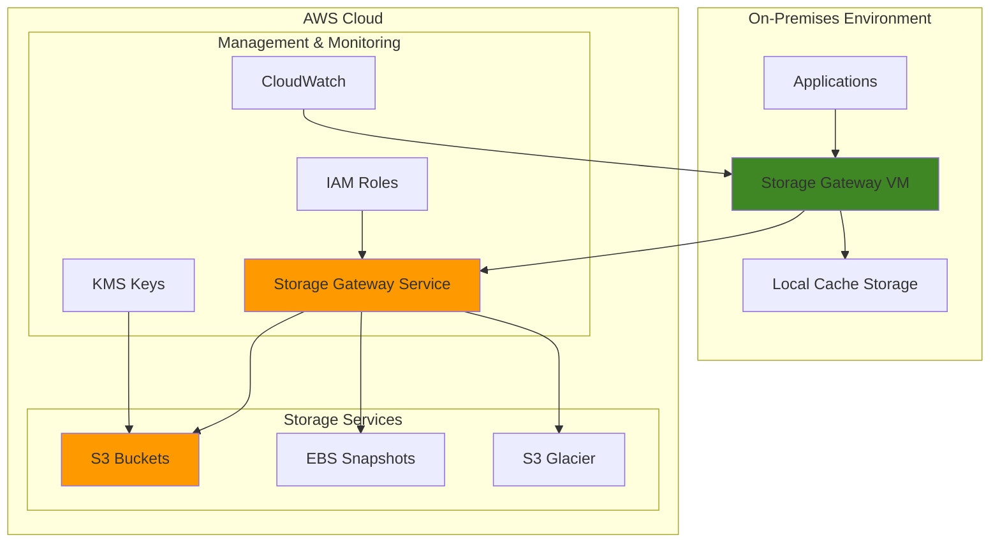

# Seamless Hybrid Cloud Storage with AWS Storage Gateway

## Problem

Organizations operating in hybrid cloud environments struggle with seamless data integration between on-premises infrastructure and cloud storage. Traditional file systems lack native cloud integration capabilities, leading to complex backup procedures, limited scalability, and difficulty maintaining consistent data access patterns. Companies need a solution that bridges on-premises storage systems with cloud-based storage while maintaining existing workflows and providing transparent access to data regardless of location.

## Solution

AWS Storage Gateway provides a hybrid cloud storage service that connects on-premises environments to AWS cloud storage services through a virtual appliance. The solution offers three gateway types: File Gateway for NFS/SMB file shares backed by S3, Volume Gateway for block storage with cached or stored volumes, and Tape Gateway for virtual tape library (VTL) integration. This approach enables organizations to gradually migrate to cloud storage while maintaining existing applications and workflows.

## Architecture Diagram



## Prerequisites

1. AWS account with Storage Gateway, S3, and CloudWatch permissions
2. AWS CLI v2 installed and configured (or AWS CloudShell)
3. VMware vSphere, Hyper-V, or KVM hypervisor for VM deployment
4. Understanding of file systems, iSCSI, and NFS/SMB protocols
5. On-premises network connectivity to AWS (Direct Connect or VPN recommended)
6. Estimated cost: $30-80/month for gateway resources and S3 storage

> **Note**: This recipe demonstrates multiple gateway types. You can implement only the type(s) relevant to your use case.

## Preparation

```bash
# Set environment variables
export AWS_REGION=$(aws configure get region)
export AWS_ACCOUNT_ID=$(aws sts get-caller-identity \
    --query Account --output text)

# Generate unique identifiers for resources
RANDOM_SUFFIX=$(aws secretsmanager get-random-password \
    --exclude-punctuation --exclude-uppercase \
    --password-length 6 --require-each-included-type \
    --output text --query RandomPassword)

export GATEWAY_NAME="hybrid-gateway-${RANDOM_SUFFIX}"
export S3_BUCKET_NAME="storage-gateway-bucket-${RANDOM_SUFFIX}"
export KMS_KEY_ALIAS="alias/storage-gateway-key-${RANDOM_SUFFIX}"

# Create S3 bucket for File Gateway (handle us-east-1 special case)
if [ "$AWS_REGION" = "us-east-1" ]; then
    aws s3api create-bucket --bucket ${S3_BUCKET_NAME} --region ${AWS_REGION}
else
    aws s3api create-bucket \
        --bucket ${S3_BUCKET_NAME} \
        --region ${AWS_REGION} \
        --create-bucket-configuration LocationConstraint=${AWS_REGION}
fi

# Enable versioning on S3 bucket
aws s3api put-bucket-versioning \
    --bucket ${S3_BUCKET_NAME} \
    --versioning-configuration Status=Enabled

# Create KMS key for encryption
KMS_KEY_ID=$(aws kms create-key \
    --description "Storage Gateway encryption key" \
    --query KeyMetadata.KeyId --output text)

aws kms create-alias \
    --alias-name ${KMS_KEY_ALIAS} \
    --target-key-id ${KMS_KEY_ID}

export KMS_KEY_ID

echo "✅ Environment prepared with bucket: ${S3_BUCKET_NAME}"
echo "✅ KMS key created: ${KMS_KEY_ID}"
```

## Steps

1. **Create IAM Role for Storage Gateway**:

   IAM roles enable secure, temporary credential delegation without hardcoding secrets in application code. Storage Gateway requires specific permissions to access S3 buckets, CloudWatch logs, and other AWS services on your behalf. This principle of least privilege ensures the gateway accesses only the resources it needs while maintaining operational security.

   ```bash
   # Create trust policy document
   cat > storage-gateway-trust-policy.json << EOF
   {
       "Version": "2012-10-17",
       "Statement": [
           {
               "Effect": "Allow",
               "Principal": {
                   "Service": "storagegateway.amazonaws.com"
               },
               "Action": "sts:AssumeRole"
           }
       ]
   }
   EOF
   
   # Create IAM role
   aws iam create-role \
       --role-name StorageGatewayRole-${RANDOM_SUFFIX} \
       --assume-role-policy-document file://storage-gateway-trust-policy.json
   
   # Attach required policies
   aws iam attach-role-policy \
       --role-name StorageGatewayRole-${RANDOM_SUFFIX} \
       --policy-arn arn:aws:iam::aws:policy/service-role/StorageGatewayServiceRole
   
   GATEWAY_ROLE_ARN=$(aws iam get-role \
       --role-name StorageGatewayRole-${RANDOM_SUFFIX} \
       --query Role.Arn --output text)
   
   export GATEWAY_ROLE_ARN
   
   echo "✅ IAM role created: ${GATEWAY_ROLE_ARN}"
   ```

   The IAM role is now established with the necessary permissions to manage S3 objects and CloudWatch logs. This security foundation enables your Storage Gateway to interact with AWS services using temporary, rotatable credentials rather than permanent access keys.

2. **Deploy Storage Gateway VM (EC2 Instance)**:

   AWS Storage Gateway runs as a VM appliance that bridges on-premises environments with cloud storage. Deploying the gateway as an EC2 instance provides a cloud-based hybrid solution, ideal for testing or scenarios where on-premises hypervisors aren't available. The gateway requires specific network ports open for communication with AWS services and on-premises clients.

   ```bash
   # Find the latest Storage Gateway AMI
   GATEWAY_AMI=$(aws ec2 describe-images \
       --owners amazon \
       --filters "Name=name,Values=aws-storage-gateway-*" \
       --query 'Images | sort_by(@, &CreationDate) | [-1].ImageId' \
       --output text)
   
   # Create security group for Storage Gateway
   SG_ID=$(aws ec2 create-security-group \
       --group-name storage-gateway-sg-${RANDOM_SUFFIX} \
       --description "Security group for Storage Gateway" \
       --query GroupId --output text)
   
   # Add required inbound rules for Storage Gateway operation
   aws ec2 authorize-security-group-ingress \
       --group-id ${SG_ID} \
       --protocol tcp --port 80 \
       --cidr 0.0.0.0/0
   
   aws ec2 authorize-security-group-ingress \
       --group-id ${SG_ID} \
       --protocol tcp --port 443 \
       --cidr 0.0.0.0/0
   
   aws ec2 authorize-security-group-ingress \
       --group-id ${SG_ID} \
       --protocol tcp --port 2049 \
       --cidr 10.0.0.0/8
   
   aws ec2 authorize-security-group-ingress \
       --group-id ${SG_ID} \
       --protocol tcp --port 445 \
       --cidr 10.0.0.0/8
   
   # Launch Storage Gateway instance
   INSTANCE_ID=$(aws ec2 run-instances \
       --image-id ${GATEWAY_AMI} \
       --instance-type m5.large \
       --security-group-ids ${SG_ID} \
       --tag-specifications \
       'ResourceType=instance,Tags=[{Key=Name,Value=StorageGateway-'${RANDOM_SUFFIX}'}]' \
       --query 'Instances[0].InstanceId' \
       --output text)
   
   export INSTANCE_ID
   export SG_ID
   
   echo "✅ Storage Gateway instance launched: ${INSTANCE_ID}"
   ```

   The Storage Gateway EC2 instance is now running and configured with appropriate security group rules. The instance will boot the Storage Gateway software and prepare for activation. Ports 80/443 enable communication with AWS services, while ports 2049 (NFS) and 445 (SMB) allow client access to file shares.

3. **Wait for Instance and Get Activation Key**:

   Storage Gateway activation establishes the secure connection between your deployed appliance and the AWS Storage Gateway service. The activation key is unique to your gateway deployment and contains the necessary information for AWS to recognize and manage your gateway. This process typically takes several minutes as the gateway initializes its services.

   ```bash
   # Wait for instance to be running
   aws ec2 wait instance-running --instance-ids ${INSTANCE_ID}
   
   # Get public IP address
   GATEWAY_IP=$(aws ec2 describe-instances \
       --instance-ids ${INSTANCE_ID} \
       --query 'Reservations[0].Instances[0].PublicIpAddress' \
       --output text)
   
   export GATEWAY_IP
   
   echo "Gateway IP: ${GATEWAY_IP}"
   
   # Wait for Storage Gateway to be ready (this may take 5-10 minutes)
   echo "Waiting for Storage Gateway to be ready..."
   sleep 300
   
   # Get activation key using proper method
   ACTIVATION_KEY=$(curl -f -s -S -w '%{redirect_url}' \
       "http://${GATEWAY_IP}/?activationRegion=${AWS_REGION}&gatewayType=FILE_S3" | \
       grep -o 'activationKey=[^&]*' | cut -d'=' -f2)
   
   export ACTIVATION_KEY
   
   echo "✅ Activation key obtained: ${ACTIVATION_KEY}"
   ```

   The activation key represents the successful initialization of your Storage Gateway appliance. With this key, AWS can now establish secure communication channels and begin managing the gateway as part of your hybrid storage infrastructure.

4. **Activate Storage Gateway**:

   Gateway activation registers your appliance with the AWS Storage Gateway service, establishing the management connection that enables file share creation, monitoring, and configuration. The FILE_S3 type optimizes the gateway for file-based workloads with S3 as the backend storage, providing NFS and SMB protocol support.

   ```bash
   # Activate the gateway
   GATEWAY_ARN=$(aws storagegateway activate-gateway \
       --activation-key ${ACTIVATION_KEY} \
       --gateway-name ${GATEWAY_NAME} \
       --gateway-timezone GMT-5:00 \
       --gateway-region ${AWS_REGION} \
       --gateway-type FILE_S3 \
       --query GatewayARN --output text)
   
   export GATEWAY_ARN
   
   echo "✅ Storage Gateway activated: ${GATEWAY_ARN}"
   ```

   Your Storage Gateway is now fully activated and ready for file share configuration. The gateway ARN serves as the unique identifier for all subsequent operations, and AWS can now monitor the gateway's health and performance metrics.

5. **Configure Local Storage for Gateway**:

   Local cache storage is essential for Storage Gateway performance, providing low-latency access to frequently accessed data. The cache acts as a buffer between on-premises applications and S3, dramatically improving read performance for hot data while seamlessly handling uploads to cloud storage in the background.

   ```bash
   # Create and attach additional EBS volume for cache
   VOLUME_ID=$(aws ec2 create-volume \
       --size 100 \
       --volume-type gp3 \
       --availability-zone $(aws ec2 describe-instances \
           --instance-ids ${INSTANCE_ID} \
           --query 'Reservations[0].Instances[0].Placement.AvailabilityZone' \
           --output text) \
       --tag-specifications \
       'ResourceType=volume,Tags=[{Key=Name,Value=StorageGateway-Cache-'${RANDOM_SUFFIX}'}]' \
       --query VolumeId --output text)
   
   # Wait for volume to be available
   aws ec2 wait volume-available --volume-ids ${VOLUME_ID}
   
   # Attach volume to instance
   aws ec2 attach-volume \
       --volume-id ${VOLUME_ID} \
       --instance-id ${INSTANCE_ID} \
       --device /dev/sdf
   
   # Wait for attachment
   sleep 30
   
   export VOLUME_ID
   
   echo "✅ Additional storage volume attached: ${VOLUME_ID}"
   ```

   The additional EBS volume provides dedicated cache storage separate from the root volume. This separation ensures optimal performance and prevents cache operations from impacting the gateway's operating system. The gateway will now recognize this storage for cache configuration.

6. **Add Cache Storage to Gateway**:

   Configuring cache storage enables the gateway to provide high-performance access to frequently used files while maintaining seamless integration with S3. The cache follows a least-recently-used (LRU) eviction policy, automatically managing which data remains locally accessible versus what gets stored exclusively in S3.

   ```bash
   # Get disk ID for the attached volume
   DISK_ID=$(aws storagegateway list-local-disks \
       --gateway-arn ${GATEWAY_ARN} \
       --query 'Disks[?DiskPath==`/dev/sdf`].DiskId' \
       --output text)
   
   # Add disk as cache storage
   aws storagegateway add-cache \
       --gateway-arn ${GATEWAY_ARN} \
       --disk-ids ${DISK_ID}
   
   echo "✅ Cache storage configured with disk: ${DISK_ID}"
   ```

   Cache storage is now active and ready to improve file access performance. The gateway will intelligently cache frequently accessed files locally while uploading all data to S3, providing the best of both worlds: cloud durability and local performance.

7. **Create NFS File Share**:

   NFS file shares enable UNIX/Linux environments to access S3 storage using standard file system operations. The share maps directly to an S3 bucket, with file operations automatically translated to S3 object operations. Root squashing enhances security by preventing remote root access while maintaining appropriate file permissions.

   ```bash
   # Create NFS file share
   FILE_SHARE_ARN=$(aws storagegateway create-nfs-file-share \
       --client-token $(date +%s) \
       --gateway-arn ${GATEWAY_ARN} \
       --location-arn arn:aws:s3:::${S3_BUCKET_NAME}/nfs-share \
       --role ${GATEWAY_ROLE_ARN} \
       --default-storage-class S3_STANDARD \
       --nfs-file-share-defaults \
       '{"FileMode":"0644","DirectoryMode":"0755","GroupId":65534,"OwnerId":65534}' \
       --client-list "10.0.0.0/8" \
       --squash RootSquash \
       --query FileShareARN --output text)
   
   export FILE_SHARE_ARN
   
   echo "✅ NFS file share created: ${FILE_SHARE_ARN}"
   ```

   The NFS file share is now available for mounting on UNIX/Linux clients. Files written to this share will appear as objects in your S3 bucket, enabling seamless integration between traditional file-based applications and cloud storage scalability.

8. **Create SMB File Share**:

   SMB file shares provide Windows-compatible file access to S3 storage, enabling Windows applications and users to interact with cloud storage using familiar drive mapping and file explorer interfaces. Guest access simplifies testing while production deployments typically integrate with Active Directory for authentication.

   ```bash
   # Create SMB file share
   SMB_SHARE_ARN=$(aws storagegateway create-smb-file-share \
       --client-token $(date +%s) \
       --gateway-arn ${GATEWAY_ARN} \
       --location-arn arn:aws:s3:::${S3_BUCKET_NAME}/smb-share \
       --role ${GATEWAY_ROLE_ARN} \
       --default-storage-class S3_STANDARD \
       --authentication GuestAccess \
       --query FileShareARN --output text)
   
   export SMB_SHARE_ARN
   
   echo "✅ SMB file share created: ${SMB_SHARE_ARN}"
   ```

   The SMB file share extends your hybrid storage to Windows environments, allowing standard Windows file operations to seamlessly interact with S3 storage. This enables legacy Windows applications to benefit from cloud storage without modification.

9. **Configure CloudWatch Monitoring**:

   CloudWatch monitoring provides essential visibility into Storage Gateway performance, including cache hit ratios, throughput metrics, and operational health. Comprehensive monitoring enables proactive performance optimization and helps identify when cache sizing or network bandwidth adjustments are needed.

   ```bash
   # Create CloudWatch log group
   aws logs create-log-group \
       --log-group-name /aws/storagegateway/${GATEWAY_NAME}
   
   # Enable CloudWatch metrics
   aws storagegateway update-gateway-information \
       --gateway-arn ${GATEWAY_ARN} \
       --cloudwatch-log-group-arn \
       arn:aws:logs:${AWS_REGION}:${AWS_ACCOUNT_ID}:log-group:/aws/storagegateway/${GATEWAY_NAME}
   
   echo "✅ CloudWatch monitoring configured"
   ```

   CloudWatch monitoring is now capturing gateway performance metrics and operational logs. This telemetry data enables you to track cache efficiency, identify performance bottlenecks, and set up automated alerts for operational issues.

10. **Test File Share Connectivity**:

    Validating file share connectivity ensures your Storage Gateway is properly configured and accessible from client systems. The gateway exposes file shares through standard network protocols, allowing seamless integration with existing applications and workflows without requiring application modifications.

    ```bash
    # Get file share details
    aws storagegateway describe-nfs-file-shares \
        --file-share-arn-list ${FILE_SHARE_ARN}
    
    # Get gateway network interface
    GATEWAY_NETWORK_INTERFACE=$(aws storagegateway describe-gateway-information \
        --gateway-arn ${GATEWAY_ARN} \
        --query 'NetworkInterfaces[0].Ipv4Address' \
        --output text)
    
    # Get NFS file share path
    NFS_PATH=$(aws storagegateway describe-nfs-file-shares \
        --file-share-arn-list ${FILE_SHARE_ARN} \
        --query 'NFSFileShareInfoList[0].Path' --output text)
    
    echo "NFS mount command: sudo mount -t nfs ${GATEWAY_NETWORK_INTERFACE}:${NFS_PATH} /local/mount/point"
    echo "SMB mount command: net use Z: \\\\${GATEWAY_NETWORK_INTERFACE}\\smb-share"
    
    echo "✅ File shares ready for mounting"
    ```

    Your file shares are now operational and ready for client access. Applications can mount these shares using standard NFS or SMB protocols, with all file operations transparently mapped to S3 object storage while benefiting from local cache performance.

## Validation & Testing

1. **Verify Gateway Status**:

   ```bash
   # Check gateway status
   aws storagegateway describe-gateway-information \
       --gateway-arn ${GATEWAY_ARN}
   ```

   Expected output: Gateway should show `RUNNING` status with proper network configuration.

2. **Test File Share Access**:

   ```bash
   # List file shares
   aws storagegateway list-file-shares \
       --gateway-arn ${GATEWAY_ARN}
   
   # Check file share status
   aws storagegateway describe-nfs-file-shares \
       --file-share-arn-list ${FILE_SHARE_ARN}
   ```

   Expected output: File shares should show `AVAILABLE` status.

3. **Verify S3 Integration**:

   ```bash
   # Check S3 bucket contents
   aws s3 ls s3://${S3_BUCKET_NAME}/ --recursive
   
   # Test file upload through S3 (simulates file share operation)
   echo "Test file from S3" > test-file.txt
   aws s3 cp test-file.txt s3://${S3_BUCKET_NAME}/test-file.txt
   aws s3 ls s3://${S3_BUCKET_NAME}/
   ```

4. **Monitor Gateway Performance**:

   ```bash
   # Check CloudWatch metrics
   aws cloudwatch get-metric-statistics \
       --namespace AWS/StorageGateway \
       --metric-name CacheHitPercent \
       --dimensions Name=GatewayName,Value=${GATEWAY_NAME} \
       --start-time $(date -u -d '1 hour ago' +%Y-%m-%dT%H:%M:%S) \
       --end-time $(date -u +%Y-%m-%dT%H:%M:%S) \
       --period 300 \
       --statistics Average
   ```

## Cleanup

1. **Delete File Shares**:

   ```bash
   # Delete NFS file share
   aws storagegateway delete-file-share \
       --file-share-arn ${FILE_SHARE_ARN}
   
   # Delete SMB file share
   aws storagegateway delete-file-share \
       --file-share-arn ${SMB_SHARE_ARN}
   
   echo "✅ File shares deleted"
   ```

2. **Delete Storage Gateway**:

   ```bash
   # Delete gateway
   aws storagegateway delete-gateway \
       --gateway-arn ${GATEWAY_ARN}
   
   echo "✅ Storage Gateway deleted"
   ```

3. **Remove AWS Resources**:

   ```bash
   # Detach and delete EBS volume
   aws ec2 detach-volume --volume-id ${VOLUME_ID}
   aws ec2 wait volume-available --volume-ids ${VOLUME_ID}
   aws ec2 delete-volume --volume-id ${VOLUME_ID}
   
   # Terminate EC2 instance
   aws ec2 terminate-instances --instance-ids ${INSTANCE_ID}
   
   # Delete security group (wait for instance termination)
   aws ec2 wait instance-terminated --instance-ids ${INSTANCE_ID}
   aws ec2 delete-security-group --group-id ${SG_ID}
   
   # Delete S3 bucket contents and bucket
   aws s3 rm s3://${S3_BUCKET_NAME} --recursive
   aws s3api delete-bucket --bucket ${S3_BUCKET_NAME}
   
   echo "✅ EC2 instance, EBS volume, and S3 bucket removed"
   ```

4. **Clean up IAM and KMS resources**:

   ```bash
   # Detach and delete IAM role
   aws iam detach-role-policy \
       --role-name StorageGatewayRole-${RANDOM_SUFFIX} \
       --policy-arn arn:aws:iam::aws:policy/service-role/StorageGatewayServiceRole
   
   aws iam delete-role --role-name StorageGatewayRole-${RANDOM_SUFFIX}
   
   # Delete KMS key alias and schedule key deletion
   aws kms delete-alias --alias-name ${KMS_KEY_ALIAS}
   aws kms schedule-key-deletion --key-id ${KMS_KEY_ID} --pending-window-in-days 7
   
   echo "✅ IAM role and KMS resources cleaned up"
   ```

5. **Remove CloudWatch logs**:

   ```bash
   # Delete CloudWatch log group
   aws logs delete-log-group \
       --log-group-name /aws/storagegateway/${GATEWAY_NAME}
   
   # Clean up local files
   rm -f storage-gateway-trust-policy.json test-file.txt
   
   echo "✅ CloudWatch logs and local files cleaned up"
   ```

## Discussion

AWS Storage Gateway provides a powerful solution for hybrid cloud storage scenarios by creating a seamless bridge between on-premises environments and AWS cloud storage services. The service addresses common challenges in hybrid architectures including data synchronization, backup automation, and gradual cloud migration strategies.

File Gateway offers the most straightforward approach for organizations looking to extend their file-based storage to the cloud. By presenting S3 buckets as NFS or SMB shares, applications can continue using standard file protocols while benefiting from cloud storage scalability and durability. The local cache ensures frequently accessed data remains readily available, while less frequently used data is efficiently stored in S3 with configurable storage classes for cost optimization.

Volume Gateway provides block-level storage integration, supporting both stored volumes for low-latency access to frequently used data and cached volumes for frequently accessed data subsets. This flexibility allows organizations to optimize for either performance or cost based on their specific use cases. The integration with EBS snapshots enables point-in-time recovery and disaster recovery scenarios.

The architecture supports multiple deployment models including on-premises VM deployment, hardware appliance deployment, and cloud-based deployment using EC2 instances. This flexibility enables organizations to choose the most appropriate deployment model based on their infrastructure constraints and requirements. The [AWS Storage Gateway User Guide](https://docs.aws.amazon.com/storagegateway/latest/userguide/) provides comprehensive guidance for advanced configuration scenarios and best practices for production deployments.

> **Tip**: Use CloudWatch metrics to monitor cache hit ratios and optimize local storage allocation for better performance. Cache hit ratios above 80% typically indicate well-sized cache storage.

> **Warning**: Ensure adequate network bandwidth between your gateway and AWS to prevent performance bottlenecks during large file transfers or initial data sync operations.

## Challenge

Extend this solution by implementing these enhancements:

1. **Multi-Site Deployment**: Configure Storage Gateway across multiple on-premises locations with centralized S3 storage and implement cross-site replication strategies using S3 Cross-Region Replication.

2. **Advanced Monitoring**: Set up comprehensive CloudWatch dashboards with custom metrics, alarms for cache performance, and automated scaling responses for EC2-based deployments using Auto Scaling Groups.

3. **Disaster Recovery Integration**: Implement automated backup and restore procedures using EBS snapshots and cross-region replication for Volume Gateway configurations with AWS Backup.

4. **Performance Optimization**: Configure multiple cache disks, implement bandwidth throttling, and optimize storage classes based on access patterns using S3 Intelligent Tiering and S3 Analytics.

5. **Enterprise Integration**: Integrate with existing backup solutions using Tape Gateway, implement Active Directory authentication for SMB shares, and configure VPC endpoints for private connectivity.

## Infrastructure Code

### Available Infrastructure as Code:

- [Infrastructure Code Overview](code/README.md) - Detailed description of all infrastructure components
- [AWS CDK (Python)](code/cdk-python/) - AWS CDK Python implementation
- [AWS CDK (TypeScript)](code/cdk-typescript/) - AWS CDK TypeScript implementation
- [CloudFormation](code/cloudformation.yaml) - AWS CloudFormation template
- [Bash CLI Scripts](code/scripts/) - Example bash scripts using AWS CLI commands to deploy infrastructure
- [Terraform](code/terraform/) - Terraform configuration files