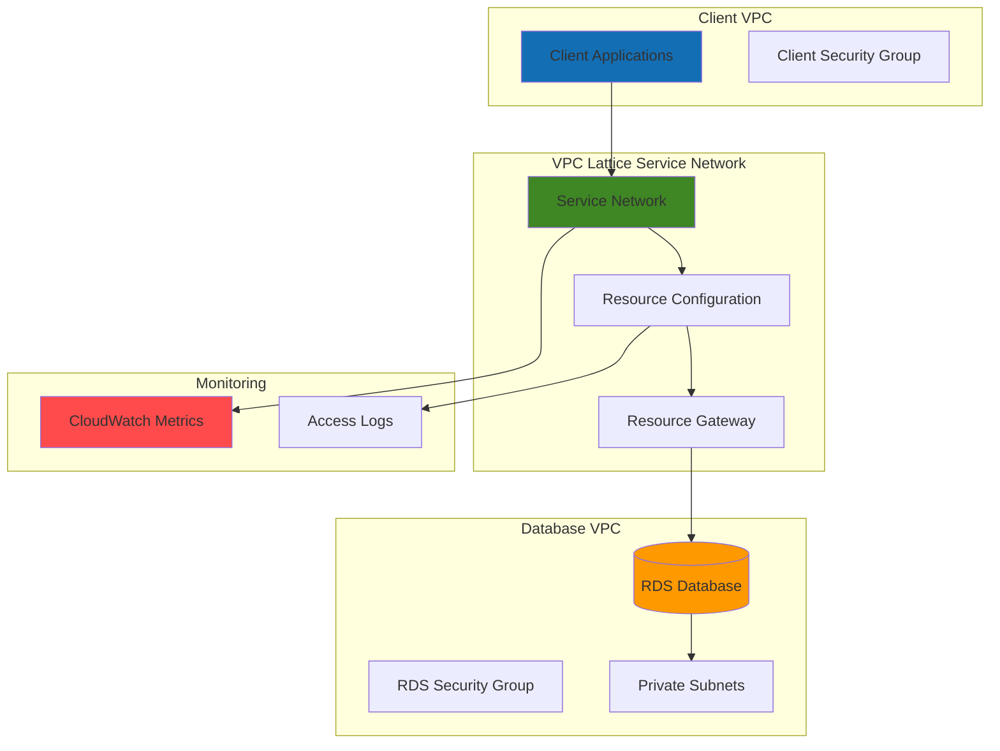

# Secure Database Access with VPC Lattice and RDS

## Problem

Organizations often need secure database connectivity across multiple VPCs and AWS accounts without the complexity of VPC peering or transit gateways. Traditional approaches require complex routing configurations, security group management across peering connections, and careful CIDR planning to avoid IP conflicts. This becomes especially challenging when different teams manage separate VPCs and need controlled access to shared database resources without exposing databases to the public internet.

## Solution

AWS VPC Lattice provides a modern application networking service that enables secure, cross-VPC database connectivity through resource configurations and service networks. By creating a VPC Lattice service network with RDS resource configurations, we can establish controlled database access across VPCs using TCP connectivity without complex routing or VPC peering. This approach centralizes access control through IAM policies and provides comprehensive monitoring through CloudWatch.

## Architecture Diagram



## Prerequisites

1. AWS CLI v2 installed and configured with appropriate permissions for VPC Lattice, RDS, EC2, and CloudWatch
2. Two VPCs (client and database) with private subnets configured and tagged appropriately
3. Understanding of VPC Lattice concepts: service networks, resource configurations, and resource gateways
4. IAM permissions for VPC Lattice (`vpc-lattice:*`), RDS (`rds:*`), and CloudWatch (`cloudwatch:*`, `logs:*`) services
5. Estimated cost: $15-25/day for RDS instance, plus VPC Lattice data processing charges (approximately $0.025 per GB)

> **Note**: VPC Lattice charges for data processing and hourly resource usage. Review [VPC Lattice pricing](https://aws.amazon.com/vpc-lattice/pricing/) for detailed cost information.

## Preparation

```bash
# Set environment variables
export AWS_REGION=$(aws configure get region)
export AWS_ACCOUNT_ID=$(aws sts get-caller-identity \
    --query Account --output text)

# Generate unique identifiers for resources
RANDOM_SUFFIX=$(aws secretsmanager get-random-password \
    --exclude-punctuation --exclude-uppercase \
    --password-length 6 --require-each-included-type \
    --output text --query RandomPassword)

# Set resource names
export SERVICE_NETWORK_NAME="database-access-network-${RANDOM_SUFFIX}"
export RESOURCE_CONFIG_NAME="rds-access-config-${RANDOM_SUFFIX}"
export DB_INSTANCE_ID="secure-database-${RANDOM_SUFFIX}"
export DB_SUBNET_GROUP="db-subnet-group-${RANDOM_SUFFIX}"

# Get existing VPC information (assuming VPCs exist)
export CLIENT_VPC_ID=$(aws ec2 describe-vpcs \
    --filters "Name=tag:Name,Values=client-vpc" \
    --query 'Vpcs[0].VpcId' --output text)
    
export DATABASE_VPC_ID=$(aws ec2 describe-vpcs \
    --filters "Name=tag:Name,Values=database-vpc" \
    --query 'Vpcs[0].VpcId' --output text)

echo "✅ Environment variables configured"
echo "Service Network: ${SERVICE_NETWORK_NAME}"
echo "Client VPC: ${CLIENT_VPC_ID}"
echo "Database VPC: ${DATABASE_VPC_ID}"
```

## Steps

1. **Create Database Security Group and Subnet Group**:

   Security groups control network access to RDS instances at the protocol and port level. For VPC Lattice connectivity, we need to allow inbound connections from the VPC Lattice service on the database port. This approach provides granular network-level security while enabling cross-VPC access through the service network.

   ```bash
   # Create security group for RDS database
   DB_SECURITY_GROUP_ID=$(aws ec2 create-security-group \
       --group-name "rds-lattice-access-${RANDOM_SUFFIX}" \
       --description "Security group for RDS access via VPC Lattice" \
       --vpc-id ${DATABASE_VPC_ID} \
       --query 'GroupId' --output text)
   
   # Allow MySQL/Aurora access from VPC Lattice managed prefix list
   aws ec2 authorize-security-group-ingress \
       --group-id ${DB_SECURITY_GROUP_ID} \
       --protocol tcp \
       --port 3306 \
       --source-group ${DB_SECURITY_GROUP_ID}
   
   # Get private subnet IDs from database VPC
   SUBNET_IDS=$(aws ec2 describe-subnets \
       --filters "Name=vpc-id,Values=${DATABASE_VPC_ID}" \
                 "Name=tag:Type,Values=private" \
       --query 'Subnets[].SubnetId' --output text)
   
   # Create DB subnet group
   aws rds create-db-subnet-group \
       --db-subnet-group-name ${DB_SUBNET_GROUP} \
       --db-subnet-group-description "Subnet group for secure database access" \
       --subnet-ids ${SUBNET_IDS}
   
   echo "✅ Database security group and subnet group created"
   echo "Security Group ID: ${DB_SECURITY_GROUP_ID}"
   ```

2. **Create RDS Database Instance**:

   AWS RDS provides managed relational database services with built-in security, backup, and monitoring capabilities. Creating the database in private subnets ensures it's not directly accessible from the internet, while VPC Lattice will provide controlled cross-VPC access through the service network architecture.

   ```bash
   # Create RDS MySQL instance
   aws rds create-db-instance \
       --db-instance-identifier ${DB_INSTANCE_ID} \
       --db-instance-class db.t3.micro \
       --engine mysql \
       --master-username admin \
       --master-user-password SecurePassword123! \
       --allocated-storage 20 \
       --vpc-security-group-ids ${DB_SECURITY_GROUP_ID} \
       --db-subnet-group-name ${DB_SUBNET_GROUP} \
       --no-publicly-accessible \
       --backup-retention-period 7 \
       --storage-encrypted \
       --deletion-protection
   
   # Wait for database to become available
   echo "⏳ Waiting for RDS instance to become available..."
   aws rds wait db-instance-available \
       --db-instance-identifier ${DB_INSTANCE_ID}
   
   # Get database endpoint
   DB_ENDPOINT=$(aws rds describe-db-instances \
       --db-instance-identifier ${DB_INSTANCE_ID} \
       --query 'DBInstances[0].Endpoint.Address' --output text)
   
   echo "✅ RDS database instance created and available"
   echo "Database endpoint: ${DB_ENDPOINT}"
   ```

3. **Create VPC Lattice Service Network**:

   VPC Lattice service networks provide a logical boundary for organizing services and resources that need to communicate securely. The service network abstracts the underlying VPC networking complexity and enables fine-grained access control through authentication and authorization policies.

   ```bash
   # Create VPC Lattice service network
   SERVICE_NETWORK_ID=$(aws vpc-lattice create-service-network \
       --name ${SERVICE_NETWORK_NAME} \
       --auth-type AWS_IAM \
       --query 'id' --output text)
   
   # Associate client VPC with service network
   CLIENT_ASSOCIATION_ID=$(aws vpc-lattice create-service-network-vpc-association \
       --service-network-identifier ${SERVICE_NETWORK_ID} \
       --vpc-identifier ${CLIENT_VPC_ID} \
       --query 'id' --output text)
   
   # Associate database VPC with service network
   DATABASE_ASSOCIATION_ID=$(aws vpc-lattice create-service-network-vpc-association \
       --service-network-identifier ${SERVICE_NETWORK_ID} \
       --vpc-identifier ${DATABASE_VPC_ID} \
       --query 'id' --output text)
   
   echo "✅ VPC Lattice service network created and VPCs associated"
   echo "Service Network ID: ${SERVICE_NETWORK_ID}"
   echo "Client VPC Association: ${CLIENT_ASSOCIATION_ID}"
   echo "Database VPC Association: ${DATABASE_ASSOCIATION_ID}"
   ```

4. **Create Resource Gateway and Configuration**:

   Resource gateways provide the ingress point for VPC Lattice to access resources within a VPC. The resource configuration defines how external clients can access the database through the service network, including port mappings and access controls for TCP connectivity.

   ```bash
   # Get a subnet from database VPC for resource gateway
   DB_SUBNET_ID=$(aws ec2 describe-subnets \
       --filters "Name=vpc-id,Values=${DATABASE_VPC_ID}" \
                 "Name=tag:Type,Values=private" \
       --query 'Subnets[0].SubnetId' --output text)
   
   # Create resource gateway in database VPC
   RESOURCE_GATEWAY_ID=$(aws vpc-lattice create-resource-gateway \
       --name "db-gateway-${RANDOM_SUFFIX}" \
       --vpc-identifier ${DATABASE_VPC_ID} \
       --subnet-ids ${DB_SUBNET_ID} \
       --query 'id' --output text)
   
   # Wait for resource gateway to be active
   echo "⏳ Waiting for resource gateway to become active..."
   aws vpc-lattice wait resource-gateway-active \
       --resource-gateway-identifier ${RESOURCE_GATEWAY_ID}
   
   # Create resource configuration for RDS access
   RESOURCE_CONFIG_ID=$(aws vpc-lattice create-resource-configuration \
       --name ${RESOURCE_CONFIG_NAME} \
       --type SINGLE \
       --resource-gateway-identifier ${RESOURCE_GATEWAY_ID} \
       --resource-configuration-definition "ipResource={ipAddress=${DB_ENDPOINT}}" \
       --port-ranges "3306-3306" \
       --protocol TCP \
       --query 'id' --output text)
   
   echo "✅ Resource gateway and configuration created"
   echo "Resource Gateway ID: ${RESOURCE_GATEWAY_ID}"
   echo "Resource Configuration ID: ${RESOURCE_CONFIG_ID}"
   ```

5. **Associate Resource Configuration with Service Network**:

   Associating the resource configuration with the service network enables clients in associated VPCs to discover and access the database resource. This step establishes the connectivity path through VPC Lattice while maintaining security through IAM-based access controls.

   ```bash
   # Associate resource configuration with service network
   RESOURCE_ASSOCIATION_ID=$(aws vpc-lattice create-service-network-resource-association \
       --resource-configuration-identifier ${RESOURCE_CONFIG_ID} \
       --service-network-identifier ${SERVICE_NETWORK_ID} \
       --query 'id' --output text)
   
   # Get resource configuration DNS name for client access
   RESOURCE_DNS_NAME=$(aws vpc-lattice get-resource-configuration \
       --resource-configuration-identifier ${RESOURCE_CONFIG_ID} \
       --query 'dnsEntry.domainName' --output text)
   
   echo "✅ Resource configuration associated with service network"
   echo "Resource Association ID: ${RESOURCE_ASSOCIATION_ID}"
   echo "Resource DNS Name: ${RESOURCE_DNS_NAME}"
   ```

6. **Create IAM Policy for Database Access**:

   IAM policies provide fine-grained access control for VPC Lattice resources. This policy ensures that only authorized principals can access the database through the service network, implementing the principle of least privilege while enabling secure cross-VPC connectivity.

   ```bash
   # Create IAM policy document for VPC Lattice resource access
   cat > lattice-db-policy.json << EOF
   {
     "Version": "2012-10-17",
     "Statement": [
       {
         "Effect": "Allow",
         "Principal": "*",
         "Action": "vpc-lattice-svcs:Invoke",
         "Resource": "arn:aws:vpc-lattice:${AWS_REGION}:${AWS_ACCOUNT_ID}:resourceconfiguration/${RESOURCE_CONFIG_ID}",
         "Condition": {
           "StringEquals": {
             "vpc-lattice-svcs:SourceVpc": "${CLIENT_VPC_ID}"
           }
         }
       }
     ]
   }
   EOF
   
   # Apply auth policy to resource configuration
   aws vpc-lattice put-resource-policy \
       --resource-arn "arn:aws:vpc-lattice:${AWS_REGION}:${AWS_ACCOUNT_ID}:resourceconfiguration/${RESOURCE_CONFIG_ID}" \
       --policy file://lattice-db-policy.json
   
   echo "✅ IAM policy applied to resource configuration"
   echo "Policy allows access from client VPC: ${CLIENT_VPC_ID}"
   ```

7. **Configure CloudWatch Monitoring**:

   CloudWatch provides comprehensive monitoring and logging for VPC Lattice connectivity, enabling operational visibility into database access patterns, performance metrics, and security events. This monitoring is essential for troubleshooting and compliance requirements.

   ```bash
   # Enable access logging for resource configuration
   aws logs create-log-group \
       --log-group-name "/aws/vpclattice/resourceconfig/${RESOURCE_CONFIG_NAME}" \
       --retention-in-days 7
   
   # Create CloudWatch dashboard for monitoring
   aws cloudwatch put-dashboard \
       --dashboard-name "VPCLattice-Database-Access-${RANDOM_SUFFIX}" \
       --dashboard-body "{
         \"widgets\": [
           {
             \"type\": \"metric\",
             \"x\": 0,
             \"y\": 0,
             \"width\": 12,
             \"height\": 6,
             \"properties\": {
               \"metrics\": [
                 [\"AWS/VpcLattice\", \"RequestCount\", \"ServiceNetwork\", \"${SERVICE_NETWORK_ID}\"]
               ],
               \"period\": 300,
               \"stat\": \"Sum\",
               \"region\": \"${AWS_REGION}\",
               \"title\": \"VPC Lattice Request Count\"
             }
           }
         ]
       }"
   
   echo "✅ CloudWatch monitoring configured"
   echo "Log Group: /aws/vpclattice/resourceconfig/${RESOURCE_CONFIG_NAME}"
   ```

8. **Test Database Connectivity**:

   Testing connectivity validates that the VPC Lattice configuration enables secure database access across VPCs. This verification step ensures that clients can resolve the resource DNS name and establish TCP connections to the database through the service network.

   ```bash
   # Create test client security group in client VPC
   CLIENT_SG_ID=$(aws ec2 create-security-group \
       --group-name "lattice-client-${RANDOM_SUFFIX}" \
       --description "Security group for VPC Lattice database clients" \
       --vpc-id ${CLIENT_VPC_ID} \
       --query 'GroupId' --output text)
   
   # Allow outbound connections to database port
   aws ec2 authorize-security-group-egress \
       --group-id ${CLIENT_SG_ID} \
       --protocol tcp \
       --port 3306 \
       --cidr 0.0.0.0/0
   
   # Test DNS resolution of resource configuration
   echo "Testing DNS resolution for resource: ${RESOURCE_DNS_NAME}"
   
   # Output connection information for testing
   echo "✅ Database connectivity configuration complete"
   echo "Resource DNS Name: ${RESOURCE_DNS_NAME}"
   echo "Database Port: 3306"
   echo "Client Security Group: ${CLIENT_SG_ID}"
   ```

## Validation & Testing

1. **Verify VPC Lattice Service Network Status**:

   ```bash
   # Check service network status
   aws vpc-lattice get-service-network \
       --service-network-identifier ${SERVICE_NETWORK_ID} \
       --query 'status' --output text
   ```

   Expected output: `ACTIVE`

2. **Validate Resource Configuration**:

   ```bash
   # Verify resource configuration is operational
   aws vpc-lattice get-resource-configuration \
       --resource-configuration-identifier ${RESOURCE_CONFIG_ID} \
       --query '{Status: status, DNS: dnsEntry.domainName, Port: portRanges[0]}'
   ```

   Expected output shows status as "ACTIVE" with DNS name and port configuration.

3. **Test Database Connection from Client VPC**:

   ```bash
   # Test MySQL connection using resource DNS name
   # (This requires mysql client installed on test instance)
   mysql -h ${RESOURCE_DNS_NAME} -P 3306 -u admin -p
   ```

   Connection should succeed using the VPC Lattice resource DNS name.

4. **Monitor CloudWatch Metrics**:

   ```bash
   # Check VPC Lattice metrics
   aws cloudwatch get-metric-statistics \
       --namespace AWS/VpcLattice \
       --metric-name RequestCount \
       --dimensions Name=ServiceNetwork,Value=${SERVICE_NETWORK_ID} \
       --start-time $(date -u -d '1 hour ago' +%Y-%m-%dT%H:%M:%S) \
       --end-time $(date -u +%Y-%m-%dT%H:%M:%S) \
       --period 300 \
       --statistics Sum
   ```

## Cleanup

1. **Remove IAM Policies and CloudWatch Resources**:

   ```bash
   # Delete CloudWatch dashboard
   aws cloudwatch delete-dashboards \
       --dashboard-names "VPCLattice-Database-Access-${RANDOM_SUFFIX}"
   
   # Delete log group
   aws logs delete-log-group \
       --log-group-name "/aws/vpclattice/resourceconfig/${RESOURCE_CONFIG_NAME}"
   
   # Remove policy file
   rm -f lattice-db-policy.json
   
   echo "✅ Monitoring resources deleted"
   ```

2. **Remove VPC Lattice Resources**:

   ```bash
   # Delete resource configuration association
   aws vpc-lattice delete-service-network-resource-association \
       --service-network-resource-association-identifier ${RESOURCE_ASSOCIATION_ID}
   
   # Delete resource configuration
   aws vpc-lattice delete-resource-configuration \
       --resource-configuration-identifier ${RESOURCE_CONFIG_ID}
   
   # Delete resource gateway
   aws vpc-lattice delete-resource-gateway \
       --resource-gateway-identifier ${RESOURCE_GATEWAY_ID}
   
   echo "✅ VPC Lattice resource configuration deleted"
   ```

3. **Remove Service Network and Associations**:

   ```bash
   # Delete VPC associations
   aws vpc-lattice delete-service-network-vpc-association \
       --service-network-vpc-association-identifier ${CLIENT_ASSOCIATION_ID}
   
   aws vpc-lattice delete-service-network-vpc-association \
       --service-network-vpc-association-identifier ${DATABASE_ASSOCIATION_ID}
   
   # Delete service network
   aws vpc-lattice delete-service-network \
       --service-network-identifier ${SERVICE_NETWORK_ID}
   
   echo "✅ VPC Lattice service network deleted"
   ```

4. **Remove Database and Security Resources**:

   ```bash
   # Disable deletion protection first
   aws rds modify-db-instance \
       --db-instance-identifier ${DB_INSTANCE_ID} \
       --no-deletion-protection \
       --apply-immediately
   
   # Wait for modification to complete
   aws rds wait db-instance-available \
       --db-instance-identifier ${DB_INSTANCE_ID}
   
   # Delete RDS instance
   aws rds delete-db-instance \
       --db-instance-identifier ${DB_INSTANCE_ID} \
       --skip-final-snapshot
   
   # Wait for deletion to complete
   aws rds wait db-instance-deleted \
       --db-instance-identifier ${DB_INSTANCE_ID}
   
   # Delete DB subnet group
   aws rds delete-db-subnet-group \
       --db-subnet-group-name ${DB_SUBNET_GROUP}
   
   # Delete security groups
   aws ec2 delete-security-group --group-id ${DB_SECURITY_GROUP_ID}
   aws ec2 delete-security-group --group-id ${CLIENT_SG_ID}
   
   echo "✅ Database and security resources deleted"
   ```

## Discussion

Amazon VPC Lattice represents a significant advancement in AWS networking services, providing application-layer connectivity that abstracts traditional VPC networking complexities. Unlike VPC peering or transit gateways that operate at the network layer, VPC Lattice enables service-to-service communication through a centralized service network that supports fine-grained access controls and comprehensive monitoring. This approach follows the AWS Well-Architected Framework's networking pillar by providing secure, scalable connectivity patterns.

The resource configuration feature specifically addresses database connectivity challenges by allowing TCP-based resources like RDS instances to be shared across VPCs without complex routing configurations. This approach eliminates the need for VPC peering mesh architectures or transit gateway route tables, significantly simplifying network management for organizations with multiple VPCs and accounts. The DNS-based service discovery automatically handles endpoint resolution, while IAM-based authentication provides enterprise-grade security controls that align with zero-trust architecture principles.

From a security perspective, this architecture implements defense-in-depth principles by combining network-level security groups, application-level IAM policies, and VPC-level isolation. The resource gateway acts as a controlled entry point, while CloudWatch logging provides comprehensive audit trails for compliance requirements. This design pattern is particularly valuable for organizations implementing zero-trust networking principles or managing multi-tenant database access across development, staging, and production environments. The combination of encryption in transit and IAM-based access controls ensures data protection throughout the connectivity path.

Performance considerations include VPC Lattice's built-in load balancing and health checking capabilities, which can automatically route traffic away from unhealthy database instances when using Multi-AZ RDS deployments. The service mesh architecture also enables traffic engineering and observability features that traditional VPC networking cannot provide, making it easier to implement circuit breaker patterns and distributed tracing for database connections. For detailed guidance on optimizing database performance through VPC Lattice, see the [AWS Database Best Practices Guide](https://docs.aws.amazon.com/AmazonRDS/latest/UserGuide/CHAP_BestPractices.html).

> **Tip**: VPC Lattice charges for data processing and resource hours. Consider implementing connection pooling and efficient database query patterns to optimize costs. Review the [AWS Well-Architected Framework](https://docs.aws.amazon.com/wellarchitected/latest/framework/welcome.html) for additional cost optimization strategies.

## Challenge

Extend this solution by implementing these enhancements:

1. **Multi-Region Database Access**: Configure VPC Lattice cross-region connectivity to access RDS read replicas in different regions for disaster recovery and read scaling scenarios using global replication.

2. **Advanced IAM Authentication**: Implement RDS IAM database authentication to eliminate password-based authentication, using IAM roles and temporary credentials for enhanced security compliance.

3. **Connection Pooling**: Deploy RDS Proxy as an intermediate service to manage database connections efficiently and reduce connection overhead for high-traffic applications while maintaining security.

4. **Automated Failover**: Create a Lambda function that monitors RDS health and automatically updates VPC Lattice resource configurations to point to standby database instances during failover events.

5. **Advanced Monitoring**: Implement custom CloudWatch metrics and alarms for database connection latency, query performance, and security events using VPC Lattice access logs and RDS Performance Insights integration.

## Infrastructure Code

*Infrastructure code will be generated after recipe approval.*