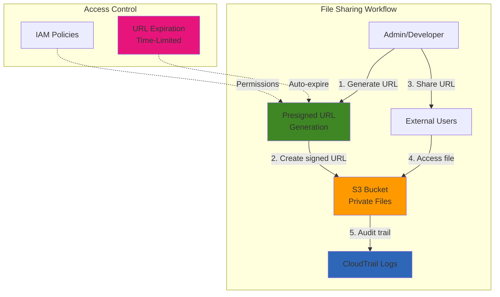

# Secure File Sharing with S3 Presigned URLs

## Problem

Your organization needs to securely share files with external partners, clients, or team members without granting them direct access to your AWS account or S3 buckets. Traditional file sharing methods require complex user management, permanent access credentials, or expensive third-party solutions. You need a solution that provides temporary, time-limited access to specific files while maintaining security controls and audit trails. Additionally, you want to avoid the overhead of managing user accounts for every person who needs occasional file access.

## Solution

Implement a secure file sharing system using Amazon S3 presigned URLs that provide temporary, time-limited access to specific objects without requiring AWS credentials. This solution leverages S3's built-in security model to generate URLs that embed authentication information, allowing controlled access to private files for a specified duration. The approach supports both file downloads and uploads, includes automatic expiration for security, and provides complete audit trails through CloudTrail. This eliminates the need for complex user management while maintaining enterprise-grade security controls.

## Architecture Diagram



## Prerequisites

1. AWS account with permissions to create S3 buckets and generate presigned URLs
2. AWS CLI v2 installed and configured with appropriate credentials
3. IAM user or role with S3 permissions (s3:GetObject, s3:PutObject)
4. Python 3.x installed for upload presigned URL generation
5. Files ready to share or test upload scenarios
6. Basic understanding of S3 bucket policies and IAM permissions
7. Estimated cost: S3 storage (~$0.023/GB), requests (~$0.0004/1000 requests)

> **Note**: Presigned URLs inherit the permissions of the user who generates them, so ensure proper IAM policies are in place. The AWS CLI `s3 presign` command only supports GET operations; upload URLs require AWS SDK tools.

## Preparation

```bash
# Set environment variables
export AWS_REGION=$(aws configure get region)
export AWS_ACCOUNT_ID=$(aws sts get-caller-identity \
    --query Account --output text)

# Generate unique bucket name
RANDOM_SUFFIX=$(aws secretsmanager get-random-password \
    --exclude-punctuation --exclude-uppercase \
    --password-length 6 --require-each-included-type \
    --output text --query RandomPassword)

export BUCKET_NAME="file-sharing-demo-${RANDOM_SUFFIX}"
export SAMPLE_FILE="sample-document.txt"

# Create S3 bucket for file sharing
aws s3 mb s3://${BUCKET_NAME} --region ${AWS_REGION}

# Block public access (files will be shared via presigned URLs only)
aws s3api put-public-access-block \
    --bucket ${BUCKET_NAME} \
    --public-access-block-configuration \
    BlockPublicAcls=true,IgnorePublicAcls=true,\
BlockPublicPolicy=true,RestrictPublicBuckets=true

echo "✅ Created private S3 bucket: ${BUCKET_NAME}"
```

## Steps

1. **Create sample files for sharing**:

   Before implementing presigned URLs, we need content to share. S3 objects are private by default, which is crucial for our security model. This step establishes the foundational data that will demonstrate how presigned URLs enable controlled access to private content without compromising bucket security.

   ```bash
   # Create a sample document to share
   cat > ${SAMPLE_FILE} << 'EOF'
   # Sample Document for File Sharing
   
   This is a confidential document that demonstrates 
   secure file sharing using S3 presigned URLs.
   
   Document ID: DEMO-2025-001
   Created: $(date)
   Status: For demonstration purposes only
   EOF
   
   # Upload the file to S3 (private by default)
   aws s3 cp ${SAMPLE_FILE} s3://${BUCKET_NAME}/documents/
   
   echo "✅ Uploaded sample file to S3"
   ```

   The file is now stored in S3 with private access controls, establishing the secure foundation for our file sharing system. This private-by-default approach ensures that only authorized users with valid presigned URLs can access the content.

2. **Generate presigned URL for file download**:

   Presigned URLs are the core mechanism that makes secure file sharing possible. AWS S3 generates these URLs using your IAM credentials and the AWS Signature Version 4 algorithm, embedding authentication information directly into the URL. This eliminates the need for recipients to have AWS accounts or credentials while maintaining strict access controls.

   ```bash
   # Generate a presigned URL valid for 1 hour (3600 seconds)
   DOWNLOAD_URL=$(aws s3 presign \
       s3://${BUCKET_NAME}/documents/${SAMPLE_FILE} \
       --expires-in 3600)
   
   echo "Download URL (valid for 1 hour):"
   echo "${DOWNLOAD_URL}"
   echo ""
   
   # Store URL for later use
   echo "${DOWNLOAD_URL}" > download_url.txt
   
   echo "✅ Generated presigned download URL"
   ```

   The generated URL contains cryptographic signatures that prove authenticity and prevent tampering. The 1-hour expiration provides a security balance between usability and risk minimization, automatically invalidating access after the specified timeframe.

3. **Test the download URL**:

   Testing the presigned URL validates that our security model works correctly. This step simulates the end-user experience, demonstrating how external parties can access files without AWS credentials. The successful download proves that the URL correctly bypasses normal S3 access controls while maintaining audit trails.

   ```bash
   # Test downloading the file using the presigned URL
   curl -o "downloaded_${SAMPLE_FILE}" "${DOWNLOAD_URL}"
   
   # Verify the download worked
   if [ -f "downloaded_${SAMPLE_FILE}" ]; then
       echo "✅ File downloaded successfully via presigned URL"
       echo "File size: $(wc -c < downloaded_${SAMPLE_FILE}) bytes"
   else
       echo "❌ Download failed"
   fi
   ```

   The successful download confirms that the presigned URL mechanism is working properly. S3 validated the embedded signature, verified the expiration time, and granted temporary access to the private object. This demonstrates the seamless user experience that presigned URLs provide.

4. **Create Python script for upload presigned URLs**:

   Upload presigned URLs enable secure file submission workflows where external users can contribute content to your S3 bucket without requiring write permissions. The AWS CLI `s3 presign` command only supports GET operations, so we need to use the AWS SDK (boto3) to generate PUT presigned URLs as recommended in the [AWS documentation](https://docs.aws.amazon.com/AmazonS3/latest/userguide/PresignedUrlUploadObject.html).

   ```bash
   # Create Python script for generating upload presigned URLs
   cat > generate_upload_url.py << 'EOF'
   #!/usr/bin/env python3
   import boto3
   import sys
   from botocore.exceptions import ClientError
   
   def generate_presigned_url(s3_client, client_method, method_parameters, expires_in):
       """
       Generate a presigned Amazon S3 URL that can be used to perform an action.
       
       :param s3_client: A Boto3 Amazon S3 client.
       :param client_method: The name of the client method that the URL performs.
       :param method_parameters: The parameters of the specified client method.
       :param expires_in: The number of seconds the presigned URL is valid for.
       :return: The presigned URL.
       """
       try:
           url = s3_client.generate_presigned_url(
               ClientMethod=client_method,
               Params=method_parameters,
               ExpiresIn=expires_in
           )
       except ClientError:
           print(f"Couldn't get a presigned URL for client method '{client_method}'.")
           raise
       return url
   
   def main():
       if len(sys.argv) != 4:
           print("Usage: python3 generate_upload_url.py <bucket-name> <object-key> <expiry-seconds>")
           sys.exit(1)
       
       bucket_name = sys.argv[1]
       object_key = sys.argv[2]
       expires_in = int(sys.argv[3])
       
       # Create S3 client
       s3_client = boto3.client('s3')
       
       # Generate presigned URL for PUT operation
       url = generate_presigned_url(
           s3_client, 
           "put_object", 
           {"Bucket": bucket_name, "Key": object_key}, 
           expires_in
       )
       
       print(url)
   
   if __name__ == "__main__":
       main()
   EOF
   
   chmod +x generate_upload_url.py
   
   echo "✅ Created upload URL generator script"
   ```

   This Python script uses the AWS SDK (boto3) to generate presigned URLs for PUT operations, which is the recommended approach according to AWS documentation. The script provides the same functionality as the AWS CLI but supports upload operations.

5. **Generate presigned URL for file upload**:

   Using our Python script, we can now generate secure upload URLs that allow external users to contribute content to specific paths in our S3 bucket. The HTTP PUT method ensures atomic uploads and prevents partial file corruption.

   ```bash
   # Install boto3 if not already available
   pip3 install boto3 2>/dev/null || echo "boto3 already installed or using system package"
   
   # Generate a presigned URL for uploading a new file (30 minutes = 1800 seconds)
   UPLOAD_FILE="upload-test.txt"
   UPLOAD_URL=$(python3 generate_upload_url.py \
       "${BUCKET_NAME}" \
       "uploads/${UPLOAD_FILE}" \
       1800)
   
   echo "Upload URL (valid for 30 minutes):"
   echo "${UPLOAD_URL}"
   echo ""
   
   # Store URL for later use
   echo "${UPLOAD_URL}" > upload_url.txt
   
   echo "✅ Generated presigned upload URL"
   ```

   The upload URL grants time-limited PUT permissions to a specific object path, enabling controlled content submission. The shorter 30-minute expiration for uploads provides enhanced security for write operations while still allowing reasonable time for file transfers.

> **Warning**: Upload presigned URLs should use shorter expiration times than download URLs to minimize the risk window for unauthorized uploads. Always validate uploaded content before making it available to other users.

6. **Test the upload URL**:

   Testing the upload functionality validates bidirectional file sharing capabilities. This simulates scenarios where external partners submit documents, reports, or other content to your organization. The successful upload demonstrates how presigned URLs can replace complex FTP servers or user account management systems.

   ```bash
   # Create a test file to upload
   echo "This file was uploaded using a presigned URL at $(date)" > test-upload.txt
   
   # Upload using the presigned URL
   curl -X PUT -T test-upload.txt "${UPLOAD_URL}"
   
   # Verify the upload worked
   aws s3 ls s3://${BUCKET_NAME}/uploads/
   
   echo "✅ File uploaded successfully via presigned URL"
   ```

   The successful upload confirms that external users can contribute content securely without compromising bucket permissions. S3 automatically applies your bucket's default encryption and access policies to uploaded objects, maintaining consistent security controls.

7. **Create a batch presigned URL generator script**:

   Batch URL generation enables efficient distribution of multiple files simultaneously, which is essential for scenarios like quarterly reports, project documentation bundles, or media asset sharing. This automation reduces manual effort and ensures consistent expiration policies across all shared content.

   ```bash
   # Create a script for generating multiple presigned URLs
   cat > generate_presigned_urls.sh << 'EOF'
   #!/bin/bash
   
   BUCKET_NAME=$1
   EXPIRY_HOURS=${2:-24}
   EXPIRY_SECONDS=$((EXPIRY_HOURS * 3600))
   
   if [ -z "$BUCKET_NAME" ]; then
       echo "Usage: $0 <bucket-name> [expiry-hours]"
       exit 1
   fi
   
   echo "Generating presigned URLs for bucket: $BUCKET_NAME"
   echo "Expiry time: $EXPIRY_HOURS hours"
   echo "----------------------------------------"
   
   # List all objects and generate presigned URLs
   aws s3api list-objects-v2 --bucket "$BUCKET_NAME" \
       --query 'Contents[].Key' --output text | \
   while read -r object_key; do
       if [ -n "$object_key" ]; then
           presigned_url=$(aws s3 presign \
               "s3://$BUCKET_NAME/$object_key" \
               --expires-in $EXPIRY_SECONDS)
           echo "File: $object_key"
           echo "URL: $presigned_url"
           echo ""
       fi
   done
   EOF
   
   chmod +x generate_presigned_urls.sh
   
   echo "✅ Created batch URL generator script"
   ```

   This script provides operational scalability by automating URL generation for entire buckets or prefixes. Organizations can integrate this into notification systems, content management workflows, or scheduled distribution processes.

8. **Set up URL expiration monitoring**:

   URL expiration monitoring provides operational visibility and prevents user frustration from expired links. Understanding expiration mechanics helps administrators plan distribution timing and implement proactive renewal processes. This monitoring capability is crucial for maintaining reliable file sharing services.

   ```bash
   # Create a script to check URL expiration
   cat > check_url_expiry.py << 'EOF'
   #!/usr/bin/env python3
   import urllib.parse
   import datetime
   import sys
   
   def check_presigned_url_expiry(url):
       """Check when a presigned URL expires"""
       try:
           parsed = urllib.parse.urlparse(url)
           params = urllib.parse.parse_qs(parsed.query)
           
           if 'X-Amz-Expires' in params and 'X-Amz-Date' in params:
               expires_seconds = int(params['X-Amz-Expires'][0])
               amz_date = params['X-Amz-Date'][0]
               
               # Parse the AMZ date format
               created_time = datetime.datetime.strptime(
                   amz_date, '%Y%m%dT%H%M%SZ'
               )
               expiry_time = created_time + datetime.timedelta(
                   seconds=expires_seconds
               )
               
               now = datetime.datetime.utcnow()
               time_remaining = expiry_time - now
               
               print(f"URL created: {created_time} UTC")
               print(f"URL expires: {expiry_time} UTC")
               
               if time_remaining.total_seconds() > 0:
                   print(f"Time remaining: {time_remaining}")
                   print("Status: VALID")
               else:
                   print("Status: EXPIRED")
           else:
               print("Not a valid presigned URL")
               
       except Exception as e:
           print(f"Error parsing URL: {e}")
   
   if __name__ == "__main__":
       if len(sys.argv) != 2:
           print("Usage: python3 check_url_expiry.py <presigned-url>")
           sys.exit(1)
       
       check_presigned_url_expiry(sys.argv[1])
   EOF
   
   echo "✅ Created URL expiration checker"
   ```

   This monitoring script decodes the AWS signature parameters to extract creation and expiration timestamps. Organizations can integrate this into monitoring dashboards, alerting systems, or automated renewal workflows to maintain seamless file sharing operations.

> **Tip**: Integrate this expiration checker into your CI/CD pipelines or monitoring systems to proactively alert users before URLs expire. Consider implementing automated re-generation for frequently accessed files using AWS Lambda and EventBridge.

## Validation & Testing

1. **Verify bucket security configuration**:

   ```bash
   # Check that public access is blocked
   aws s3api get-public-access-block --bucket ${BUCKET_NAME}
   
   # Try to access file without presigned URL (should fail)
   PUBLIC_URL="https://${BUCKET_NAME}.s3.${AWS_REGION}.amazonaws.com/documents/${SAMPLE_FILE}"
   echo "Testing public access (should fail):"
   curl -I "${PUBLIC_URL}" 2>/dev/null || echo "✅ Public access correctly blocked"
   ```

2. **Test URL expiration**:

   ```bash
   # Generate a URL that expires in 10 seconds for testing
   SHORT_URL=$(aws s3 presign \
       s3://${BUCKET_NAME}/documents/${SAMPLE_FILE} \
       --expires-in 10)
   
   echo "Testing URL expiration..."
   echo "URL valid for 10 seconds: ${SHORT_URL}"
   
   # Test immediate access
   curl -I "${SHORT_URL}" && echo "✅ URL works immediately"
   
   # Wait and test expiration
   echo "Waiting 15 seconds for URL to expire..."
   sleep 15
   curl -I "${SHORT_URL}" 2>/dev/null || echo "✅ URL correctly expired"
   ```

3. **Validate upload functionality**:

   ```bash
   # Check uploaded files
   echo "Files in uploads folder:"
   aws s3 ls s3://${BUCKET_NAME}/uploads/ --human-readable
   
   # Download and verify uploaded content
   aws s3 cp s3://${BUCKET_NAME}/uploads/${UPLOAD_FILE} \
       downloaded-upload.txt
   
   echo "Uploaded file content:"
   cat downloaded-upload.txt
   ```

## Cleanup

1. **Remove all uploaded files**:

   ```bash
   # Delete all objects in the bucket
   aws s3 rm s3://${BUCKET_NAME} --recursive
   
   echo "✅ Deleted all files from bucket"
   ```

2. **Delete the S3 bucket**:

   ```bash
   # Delete the bucket
   aws s3 rb s3://${BUCKET_NAME}
   
   echo "✅ Deleted S3 bucket: ${BUCKET_NAME}"
   ```

3. **Clean up local files**:

   ```bash
   # Remove local test files and scripts
   rm -f ${SAMPLE_FILE} downloaded_${SAMPLE_FILE} test-upload.txt
   rm -f downloaded-upload.txt download_url.txt upload_url.txt
   rm -f generate_presigned_urls.sh check_url_expiry.py generate_upload_url.py
   
   # Clear environment variables
   unset BUCKET_NAME SAMPLE_FILE UPLOAD_FILE
   unset DOWNLOAD_URL UPLOAD_URL
   
   echo "✅ Cleaned up local files and variables"
   ```

## Discussion

S3 presigned URLs provide a powerful mechanism for secure, temporary file sharing without the complexity of user management or the security risks of public buckets. The solution leverages AWS's built-in authentication and authorization systems while providing fine-grained control over access duration and permissions. This approach follows the [AWS Well-Architected Framework](https://docs.aws.amazon.com/wellarchitected/latest/framework/welcome.html) security pillar by implementing the principle of least privilege and defense in depth.

The key advantage of presigned URLs is that they inherit the permissions of the user who generates them, ensuring that access is limited to what the URL creator is authorized to do. This creates a secure delegation model where administrators can grant temporary access without sharing credentials or modifying bucket policies. According to the [AWS S3 User Guide](https://docs.aws.amazon.com/AmazonS3/latest/userguide/using-presigned-url.html), presigned URLs can be valid for up to 7 days, providing flexibility for various use cases while maintaining security boundaries.

For enterprise use cases, consider implementing additional security measures such as IP address restrictions through bucket policies, integration with AWS CloudTrail for comprehensive audit logging, and automated URL generation through Lambda functions triggered by business workflows. The solution scales naturally with S3's global infrastructure and can handle everything from occasional file sharing to high-volume document distribution systems. For enhanced security monitoring, integrate with [AWS Security Hub](https://docs.aws.amazon.com/securityhub/latest/userguide/what-is-securityhub.html) to detect and respond to suspicious access patterns.

> **Note**: This implementation follows AWS security best practices by using private buckets, time-limited access, and comprehensive audit logging. For production deployments, consider implementing additional controls such as content scanning and approval workflows.

## Challenge

Extend this solution by implementing these enhancements:

1. **Build a web interface** using Lambda and API Gateway that allows users to request presigned URLs through a simple form with approval workflows and email notifications
2. **Implement IP-based restrictions** by adding bucket policies that limit presigned URL access to specific IP ranges or VPC endpoints for enhanced security
3. **Create automated expiration notifications** using EventBridge and SNS to alert users when shared URLs are about to expire, with automatic renewal options
4. **Add virus scanning integration** using Lambda to scan uploaded files with ClamAV or third-party services before they become available for download
5. **Build a file sharing dashboard** with CloudWatch metrics and QuickSight to track usage patterns, popular files, security events, and cost optimization opportunities

## Infrastructure Code

### Available Infrastructure as Code:

- [Infrastructure Code Overview](code/README.md) - Detailed description of all infrastructure components
- [AWS CDK (Python)](code/cdk-python/) - AWS CDK Python implementation
- [AWS CDK (TypeScript)](code/cdk-typescript/) - AWS CDK TypeScript implementation
- [CloudFormation](code/cloudformation.yaml) - AWS CloudFormation template
- [Bash CLI Scripts](code/scripts/) - Example bash scripts using AWS CLI commands to deploy infrastructure
- [Terraform](code/terraform/) - Terraform configuration files