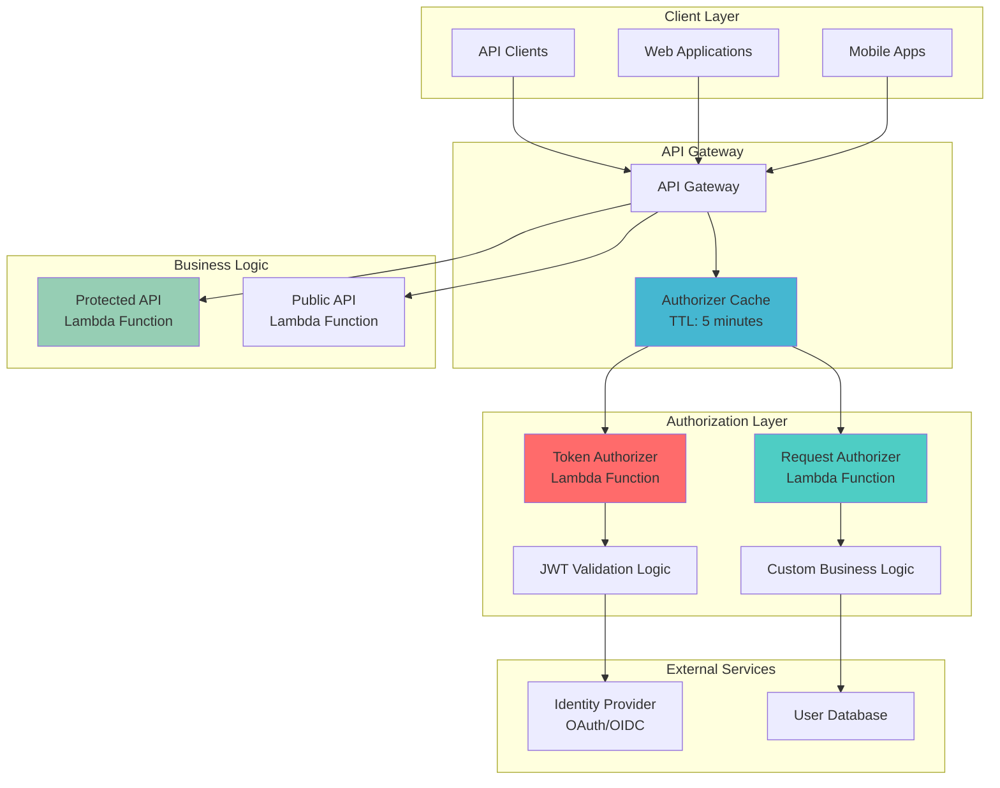

# Securing APIs with Lambda Authorizers and API Gateway

## Problem

Organizations building serverless APIs face complex authentication and authorization challenges when protecting diverse endpoints with varying security requirements. Traditional API security approaches often involve managing separate authentication servers, complex token validation logic, and inconsistent security policies across different services. Development teams need flexible, scalable authorization patterns that can handle custom business logic, integrate with existing identity systems, and provide fine-grained access control without maintaining separate infrastructure components.

## Solution

Implement comprehensive serverless API security using AWS API Gateway with custom Lambda authorizers to create flexible authentication and authorization patterns. This approach leverages Lambda functions to execute custom authorization logic, supports multiple token types, and integrates seamlessly with API Gateway's built-in caching and throttling features. The solution demonstrates both TOKEN and REQUEST authorizer patterns, enabling sophisticated access control scenarios while maintaining serverless principles.

## Architecture Diagram



## Prerequisites

1. AWS account with permissions for API Gateway, Lambda, IAM, and CloudWatch
2. AWS CLI v2 installed and configured (or AWS CloudShell)
3. Basic understanding of JWT tokens and API authentication concepts
4. Familiarity with serverless architecture patterns
5. Estimated cost: $2-8 for testing resources (API Gateway requests, Lambda invocations)

> **Note**: Lambda authorizers are cached by API Gateway for improved performance, with configurable TTL settings

## Preparation

```bash
# Set environment variables
export AWS_REGION=$(aws configure get region)
export AWS_ACCOUNT_ID=$(aws sts get-caller-identity \
    --query Account --output text)

# Generate unique identifiers for resources
RANDOM_SUFFIX=$(aws secretsmanager get-random-password \
    --exclude-punctuation --exclude-uppercase \
    --password-length 6 --require-each-included-type \
    --output text --query RandomPassword)

export API_NAME="secure-api-${RANDOM_SUFFIX}"
export TOKEN_AUTH_FUNCTION="token-authorizer-${RANDOM_SUFFIX}"
export REQUEST_AUTH_FUNCTION="request-authorizer-${RANDOM_SUFFIX}"
export PROTECTED_FUNCTION="protected-api-${RANDOM_SUFFIX}"
export PUBLIC_FUNCTION="public-api-${RANDOM_SUFFIX}"
export ROLE_NAME="api-auth-role-${RANDOM_SUFFIX}"

echo "API Name: $API_NAME"
echo "Token Authorizer: $TOKEN_AUTH_FUNCTION"
echo "Request Authorizer: $REQUEST_AUTH_FUNCTION"
```

## Steps

1. **Create IAM Role for Lambda Functions**:

   IAM roles provide secure, temporary credential delegation for AWS services, eliminating the need for hardcoded access keys. Lambda functions require an execution role that grants necessary permissions while following the principle of least privilege. This foundational security step establishes the trust relationship between Lambda and other AWS services.

   ```bash
   # Create trust policy for Lambda service
   cat > lambda-trust-policy.json << EOF
   {
     "Version": "2012-10-17",
     "Statement": [
       {
         "Effect": "Allow",
         "Principal": {
           "Service": "lambda.amazonaws.com"
         },
         "Action": "sts:AssumeRole"
       }
     ]
   }
   EOF
   
   # Create the IAM role
   aws iam create-role \
       --role-name $ROLE_NAME \
       --assume-role-policy-document file://lambda-trust-policy.json
   
   # Attach basic execution policy
   aws iam attach-role-policy \
       --role-name $ROLE_NAME \
       --policy-arn arn:aws:iam::aws:policy/service-role/AWSLambdaBasicExecutionRole
   
   export ROLE_ARN="arn:aws:iam::${AWS_ACCOUNT_ID}:role/${ROLE_NAME}"
   
   echo "✅ Created IAM role: $ROLE_ARN"
   ```

   The IAM role is now established with basic execution permissions, enabling Lambda functions to write logs to CloudWatch. This security foundation ensures all Lambda functions operate with appropriate permissions for monitoring and debugging while maintaining secure access controls.

2. **Create Token-Based Lambda Authorizer**:

   Token-based authorizers validate standardized authentication tokens like JWTs, providing the first layer of API security. This authorizer pattern focuses specifically on token validation logic, receiving only the authorization token and method ARN from API Gateway. The lightweight design enables efficient caching and fast authorization decisions for high-throughput APIs.

   ```bash
   # Create token authorizer function code
   cat > token_authorizer.py << 'EOF'
   import json
   import re
   
   def lambda_handler(event, context):
       """
       Token-based authorizer that validates Bearer tokens
       """
       print(f"Token Authorizer Event: {json.dumps(event)}")
       
       # Extract token from event
       token = event.get('authorizationToken', '')
       method_arn = event.get('methodArn', '')
       
       # Validate token format (Bearer <token>)
       if not token.startswith('Bearer '):
           raise Exception('Unauthorized')
       
       # Extract actual token
       actual_token = token.replace('Bearer ', '')
       
       # Validate token (simplified validation)
       # In production, validate JWT signature, expiration, etc.
       valid_tokens = {
           'admin-token': {
               'principalId': 'admin-user',
               'effect': 'Allow',
               'context': {
                   'role': 'admin',
                   'permissions': 'read,write,delete'
               }
           },
           'user-token': {
               'principalId': 'regular-user', 
               'effect': 'Allow',
               'context': {
                   'role': 'user',
                   'permissions': 'read'
               }
           }
       }
       
       # Check if token is valid
       if actual_token not in valid_tokens:
           raise Exception('Unauthorized')
       
       token_info = valid_tokens[actual_token]
       
       # Generate policy
       policy = generate_policy(
           token_info['principalId'],
           token_info['effect'],
           method_arn,
           token_info['context']
       )
       
       print(f"Generated Policy: {json.dumps(policy)}")
       return policy
   
   def generate_policy(principal_id, effect, resource, context=None):
       """Generate IAM policy for API Gateway"""
       policy = {
           'principalId': principal_id,
           'policyDocument': {
               'Version': '2012-10-17',
               'Statement': [
                   {
                       'Action': 'execute-api:Invoke',
                       'Effect': effect,
                       'Resource': resource
                   }
               ]
           }
       }
       
       # Add context for passing additional information
       if context:
           policy['context'] = context
           
       return policy
   EOF
   
   # Package token authorizer
   zip token-authorizer.zip token_authorizer.py
   
   # Create token authorizer Lambda function
   aws lambda create-function \
       --function-name $TOKEN_AUTH_FUNCTION \
       --runtime python3.9 \
       --role $ROLE_ARN \
       --handler token_authorizer.lambda_handler \
       --zip-file fileb://token-authorizer.zip \
       --description "Token-based API Gateway authorizer" \
       --timeout 30
   
   # Wait for function to be ready
   aws lambda wait function-active --function-name $TOKEN_AUTH_FUNCTION
   
   export TOKEN_AUTH_ARN="arn:aws:lambda:${AWS_REGION}:${AWS_ACCOUNT_ID}:function:${TOKEN_AUTH_FUNCTION}"
   
   echo "✅ Created token authorizer function: $TOKEN_AUTH_ARN"
   ```

   The token authorizer function is now deployed and ready to validate bearer tokens. This Lambda function will be invoked by API Gateway for each request to protected endpoints, returning IAM policies that grant or deny access based on token validation results. The authorizer supports custom context passing, enabling fine-grained authorization decisions.

3. **Create Request-Based Lambda Authorizer**:

   Request-based authorizers provide maximum flexibility by analyzing the complete request context, including headers, query parameters, source IP addresses, and user agent strings. This pattern enables sophisticated authorization scenarios like IP whitelisting, custom authentication schemes, and multi-factor validation workflows that require access to the full HTTP request details.

   ```bash
   # Create request authorizer function code
   cat > request_authorizer.py << 'EOF'
   import json
   import base64
   from urllib.parse import parse_qs
   
   def lambda_handler(event, context):
       """
       Request-based authorizer that validates based on request context
       """
       print(f"Request Authorizer Event: {json.dumps(event)}")
       
       # Extract request details
       headers = event.get('headers', {})
       query_params = event.get('queryStringParameters', {}) or {}
       method_arn = event.get('methodArn', '')
       source_ip = event.get('requestContext', {}).get('identity', {}).get('sourceIp', '')
       
       # Check for API key in query parameters
       api_key = query_params.get('api_key', '')
       
       # Check for custom authentication header
       custom_auth = headers.get('X-Custom-Auth', '')
       
       # Validate based on multiple criteria
       principal_id = 'unknown'
       effect = 'Deny'
       context = {}
       
       # API Key validation
       if api_key == 'secret-api-key-123':
           principal_id = 'api-key-user'
           effect = 'Allow'
           context = {
               'authType': 'api-key',
               'sourceIp': source_ip,
               'permissions': 'read,write'
           }
       # Custom header validation
       elif custom_auth == 'custom-auth-value':
           principal_id = 'custom-user'
           effect = 'Allow'
           context = {
               'authType': 'custom-header',
               'sourceIp': source_ip,
               'permissions': 'read'
           }
       # IP-based validation (example)
       elif source_ip.startswith('10.') or source_ip.startswith('172.'):
           principal_id = 'internal-user'
           effect = 'Allow'
           context = {
               'authType': 'ip-whitelist',
               'sourceIp': source_ip,
               'permissions': 'read,write,delete'
           }
       
       # Generate policy
       policy = generate_policy(principal_id, effect, method_arn, context)
       
       print(f"Generated Policy: {json.dumps(policy)}")
       return policy
   
   def generate_policy(principal_id, effect, resource, context=None):
       """Generate IAM policy for API Gateway"""
       policy = {
           'principalId': principal_id,
           'policyDocument': {
               'Version': '2012-10-17',
               'Statement': [
                   {
                       'Action': 'execute-api:Invoke',
                       'Effect': effect,
                       'Resource': resource
                   }
               ]
           }
       }
       
       if context:
           policy['context'] = context
           
       return policy
   EOF
   
   # Package request authorizer
   zip request-authorizer.zip request_authorizer.py
   
   # Create request authorizer Lambda function
   aws lambda create-function \
       --function-name $REQUEST_AUTH_FUNCTION \
       --runtime python3.9 \
       --role $ROLE_ARN \
       --handler request_authorizer.lambda_handler \
       --zip-file fileb://request-authorizer.zip \
       --description "Request-based API Gateway authorizer" \
       --timeout 30
   
   # Wait for function to be ready
   aws lambda wait function-active --function-name $REQUEST_AUTH_FUNCTION
   
   export REQUEST_AUTH_ARN="arn:aws:lambda:${AWS_REGION}:${AWS_ACCOUNT_ID}:function:${REQUEST_AUTH_FUNCTION}"
   
   echo "✅ Created request authorizer function: $REQUEST_AUTH_ARN"
   ```

   The request authorizer function now provides comprehensive request-based validation capabilities. This function can implement complex business logic for authorization decisions, supporting multiple authentication methods and enabling contextual access control based on request characteristics, user location, and security requirements.

4. **Create Business Logic Lambda Functions**:

   Business logic functions represent the core API functionality that serves client requests after successful authorization. These functions receive enriched request context from the authorizers, including user identity, permissions, and custom attributes. Separating authorization from business logic enables better code organization, testing, and maintenance of security policies.

   ```bash
   # Create protected API function
   cat > protected_api.py << 'EOF'
   import json
   
   def lambda_handler(event, context):
       """Protected API that requires authorization"""
       
       # Extract authorization context
       auth_context = event.get('requestContext', {}).get('authorizer', {})
       principal_id = auth_context.get('principalId', 'unknown')
       
       # Get additional context passed from authorizer
       role = auth_context.get('role', 'unknown')
       permissions = auth_context.get('permissions', 'none')
       auth_type = auth_context.get('authType', 'token')
       source_ip = auth_context.get('sourceIp', 'unknown')
       
       response_data = {
           'message': 'Access granted to protected resource',
           'user': {
               'principalId': principal_id,
               'role': role,
               'permissions': permissions.split(',') if permissions != 'none' else [],
               'authType': auth_type,
               'sourceIp': source_ip
           },
           'timestamp': context.aws_request_id,
           'protected_data': {
               'secret_value': 'This is confidential information',
               'access_level': role
           }
       }
       
       return {
           'statusCode': 200,
           'headers': {
               'Content-Type': 'application/json',
               'Access-Control-Allow-Origin': '*'
           },
           'body': json.dumps(response_data, indent=2)
       }
   EOF
   
   # Create public API function
   cat > public_api.py << 'EOF'
   import json
   import time
   
   def lambda_handler(event, context):
       """Public API that doesn't require authorization"""
       
       response_data = {
           'message': 'Welcome to the public API',
           'status': 'operational',
           'timestamp': int(time.time()),
           'request_id': context.aws_request_id,
           'public_data': {
               'api_version': '1.0',
               'available_endpoints': [
                   '/public/status',
                   '/protected/data (requires auth)',
                   '/protected/admin (requires admin auth)'
               ]
           }
       }
       
       return {
           'statusCode': 200,
           'headers': {
               'Content-Type': 'application/json',
               'Access-Control-Allow-Origin': '*'
           },
           'body': json.dumps(response_data, indent=2)
       }
   EOF
   
   # Package and create protected API function
   zip protected-api.zip protected_api.py
   aws lambda create-function \
       --function-name $PROTECTED_FUNCTION \
       --runtime python3.9 \
       --role $ROLE_ARN \
       --handler protected_api.lambda_handler \
       --zip-file fileb://protected-api.zip \
       --description "Protected API requiring authorization"
   
   # Package and create public API function
   zip public-api.zip public_api.py
   aws lambda create-function \
       --function-name $PUBLIC_FUNCTION \
       --runtime python3.9 \
       --role $ROLE_ARN \
       --handler public_api.lambda_handler \
       --zip-file fileb://public-api.zip \
       --description "Public API without authorization"
   
   # Wait for functions to be ready
   aws lambda wait function-active --function-name $PROTECTED_FUNCTION
   aws lambda wait function-active --function-name $PUBLIC_FUNCTION
   
   echo "✅ Created business logic functions"
   ```

   Both public and protected API functions are now deployed and configured. The protected function can access authorization context passed from the authorizers, enabling personalized responses based on user roles and permissions. This separation of concerns allows business logic to focus on functionality while security remains centralized in the authorizer layer.

5. **Create API Gateway REST API**:

   API Gateway serves as the managed front door for serverless APIs, providing features like request routing, throttling, caching, and monitoring. Creating a hierarchical resource structure enables logical organization of endpoints with different security requirements. The REST API model supports flexible routing patterns and integrates seamlessly with Lambda authorizers.

   ```bash
   # Create REST API
   API_ID=$(aws apigateway create-rest-api \
       --name $API_NAME \
       --description "Serverless API with Lambda authorizers demo" \
       --query id --output text)
   
   # Get root resource ID
   ROOT_RESOURCE_ID=$(aws apigateway get-resources \
       --rest-api-id $API_ID \
       --query 'items[?path==`/`].id' --output text)
   
   # Create /public resource
   PUBLIC_RESOURCE_ID=$(aws apigateway create-resource \
       --rest-api-id $API_ID \
       --parent-id $ROOT_RESOURCE_ID \
       --path-part public \
       --query id --output text)
   
   # Create /protected resource
   PROTECTED_RESOURCE_ID=$(aws apigateway create-resource \
       --rest-api-id $API_ID \
       --parent-id $ROOT_RESOURCE_ID \
       --path-part protected \
       --query id --output text)
   
   # Create /protected/admin resource
   ADMIN_RESOURCE_ID=$(aws apigateway create-resource \
       --rest-api-id $API_ID \
       --parent-id $PROTECTED_RESOURCE_ID \
       --path-part admin \
       --query id --output text)
   
   export API_ID
   export ROOT_RESOURCE_ID
   export PUBLIC_RESOURCE_ID
   export PROTECTED_RESOURCE_ID
   export ADMIN_RESOURCE_ID
   
   echo "✅ Created API Gateway: $API_ID"
   ```

   The API Gateway structure is now established with hierarchical resources supporting different authorization patterns. The `/public` endpoint requires no authentication, `/protected` uses token-based authorization, and `/protected/admin` demonstrates request-based authorization. This structure enables testing multiple authorization scenarios within a single API.

6. **Create API Gateway Authorizers**:

   API Gateway authorizers define how Lambda functions integrate with the authorization process, including identity sources, caching configuration, and result TTL settings. The identity source configuration determines which request elements are used for cache keys, directly impacting performance and security. Proper TTL settings balance authorization freshness with API response times.

   ```bash
   # Create token-based authorizer
   TOKEN_AUTHORIZER_ID=$(aws apigateway create-authorizer \
       --rest-api-id $API_ID \
       --name "TokenAuthorizer" \
       --type TOKEN \
       --authorizer-uri "arn:aws:apigateway:${AWS_REGION}:lambda:path/2015-03-31/functions/${TOKEN_AUTH_ARN}/invocations" \
       --identity-source "method.request.header.Authorization" \
       --authorizer-result-ttl-in-seconds 300 \
       --query id --output text)
   
   # Create request-based authorizer
   REQUEST_AUTHORIZER_ID=$(aws apigateway create-authorizer \
       --rest-api-id $API_ID \
       --name "RequestAuthorizer" \
       --type REQUEST \
       --authorizer-uri "arn:aws:apigateway:${AWS_REGION}:lambda:path/2015-03-31/functions/${REQUEST_AUTH_ARN}/invocations" \
       --identity-source "method.request.header.X-Custom-Auth,method.request.querystring.api_key" \
       --authorizer-result-ttl-in-seconds 300 \
       --query id --output text)
   
   export TOKEN_AUTHORIZER_ID
   export REQUEST_AUTHORIZER_ID
   
   echo "✅ Created authorizers - Token: $TOKEN_AUTHORIZER_ID, Request: $REQUEST_AUTHORIZER_ID"
   ```

   Both authorizer types are now configured with 5-minute cache TTL for optimal performance. The token authorizer uses the Authorization header as its identity source, while the request authorizer combines multiple sources for cache key generation. This configuration enables efficient authorization caching while maintaining security requirements.

7. **Configure API Methods and Integrations**:

   API methods define the HTTP operations available on each resource, along with their authorization requirements. Configuring different authorization types demonstrates the flexibility of API Gateway's security model. Each method can use different authorizers, enabling fine-grained security policies across API endpoints.

   ```bash
   # Create public GET method (no authorization)
   aws apigateway put-method \
       --rest-api-id $API_ID \
       --resource-id $PUBLIC_RESOURCE_ID \
       --http-method GET \
       --authorization-type NONE
   
   # Create protected GET method with token authorization
   aws apigateway put-method \
       --rest-api-id $API_ID \
       --resource-id $PROTECTED_RESOURCE_ID \
       --http-method GET \
       --authorization-type CUSTOM \
       --authorizer-id $TOKEN_AUTHORIZER_ID
   
   # Create admin GET method with request authorization
   aws apigateway put-method \
       --rest-api-id $API_ID \
       --resource-id $ADMIN_RESOURCE_ID \
       --http-method GET \
       --authorization-type CUSTOM \
       --authorizer-id $REQUEST_AUTHORIZER_ID
   
   echo "✅ Created API methods with authorization"
   ```

   The API methods are now configured with appropriate authorization types, demonstrating three different security patterns: no authorization for public endpoints, token-based authorization for user data, and request-based authorization for administrative functions. This configuration showcases the flexibility of API Gateway's authorization framework.

8. **Configure Lambda Integrations**:

   Lambda proxy integrations enable seamless communication between API Gateway and Lambda functions, automatically forwarding HTTP request details and authorization context. The AWS_PROXY integration type handles request/response transformation, allowing Lambda functions to receive complete HTTP context and return properly formatted responses.

   ```bash
   # Configure public API integration
   aws apigateway put-integration \
       --rest-api-id $API_ID \
       --resource-id $PUBLIC_RESOURCE_ID \
       --http-method GET \
       --type AWS_PROXY \
       --integration-http-method POST \
       --uri "arn:aws:apigateway:${AWS_REGION}:lambda:path/2015-03-31/functions/arn:aws:lambda:${AWS_REGION}:${AWS_ACCOUNT_ID}:function:${PUBLIC_FUNCTION}/invocations"
   
   # Configure protected API integration  
   aws apigateway put-integration \
       --rest-api-id $API_ID \
       --resource-id $PROTECTED_RESOURCE_ID \
       --http-method GET \
       --type AWS_PROXY \
       --integration-http-method POST \
       --uri "arn:aws:apigateway:${AWS_REGION}:lambda:path/2015-03-31/functions/arn:aws:lambda:${AWS_REGION}:${AWS_ACCOUNT_ID}:function:${PROTECTED_FUNCTION}/invocations"
   
   # Configure admin API integration
   aws apigateway put-integration \
       --rest-api-id $API_ID \
       --resource-id $ADMIN_RESOURCE_ID \
       --http-method GET \
       --type AWS_PROXY \
       --integration-http-method POST \
       --uri "arn:aws:apigateway:${AWS_REGION}:lambda:path/2015-03-31/functions/arn:aws:lambda:${AWS_REGION}:${AWS_ACCOUNT_ID}:function:${PROTECTED_FUNCTION}/invocations"
   
   echo "✅ Configured Lambda integrations"
   ```

   All API endpoints are now connected to their respective Lambda functions through proxy integrations. This configuration ensures that authorization context, HTTP headers, query parameters, and request bodies are properly forwarded to the business logic functions, enabling comprehensive request processing and personalized responses.

9. **Grant API Gateway Permission to Invoke Lambda Functions**:

   Resource-based policies grant API Gateway permission to invoke Lambda functions, establishing the trust relationship required for serverless API operations. These permissions are essential for both business logic functions and authorizer functions, enabling API Gateway to execute the complete request processing pipeline. Proper permission scoping ensures security while enabling necessary functionality.

   ```bash
   # Grant permission for public API function
   aws lambda add-permission \
       --function-name $PUBLIC_FUNCTION \
       --statement-id api-gateway-public \
       --action lambda:InvokeFunction \
       --principal apigateway.amazonaws.com \
       --source-arn "arn:aws:execute-api:${AWS_REGION}:${AWS_ACCOUNT_ID}:${API_ID}/*/*"
   
   # Grant permission for protected API function
   aws lambda add-permission \
       --function-name $PROTECTED_FUNCTION \
       --statement-id api-gateway-protected \
       --action lambda:InvokeFunction \
       --principal apigateway.amazonaws.com \
       --source-arn "arn:aws:execute-api:${AWS_REGION}:${AWS_ACCOUNT_ID}:${API_ID}/*/*"
   
   # Grant permission for token authorizer
   aws lambda add-permission \
       --function-name $TOKEN_AUTH_FUNCTION \
       --statement-id api-gateway-token-auth \
       --action lambda:InvokeFunction \
       --principal apigateway.amazonaws.com \
       --source-arn "arn:aws:execute-api:${AWS_REGION}:${AWS_ACCOUNT_ID}:${API_ID}/authorizers/${TOKEN_AUTHORIZER_ID}"
   
   # Grant permission for request authorizer
   aws lambda add-permission \
       --function-name $REQUEST_AUTH_FUNCTION \
       --statement-id api-gateway-request-auth \
       --action lambda:InvokeFunction \
       --principal apigateway.amazonaws.com \
       --source-arn "arn:aws:execute-api:${AWS_REGION}:${AWS_ACCOUNT_ID}:${API_ID}/authorizers/${REQUEST_AUTHORIZER_ID}"
   
   echo "✅ Granted API Gateway permissions"
   ```

   All necessary permissions are now configured, enabling API Gateway to invoke Lambda functions for both authorization and business logic processing. These resource-based policies complement the IAM execution roles, creating a comprehensive security model that supports the complete serverless API workflow while maintaining least-privilege access controls.

10. **Deploy API and Test Different Authorization Patterns**:

    API deployment creates a versioned stage that makes the API accessible to clients, enabling comprehensive testing of authorization patterns. The deployment process validates the complete configuration and makes the API publicly available through the generated endpoint URL. Testing multiple authorization scenarios validates the security implementation and demonstrates real-world usage patterns.

    ```bash
    # Deploy API
    aws apigateway create-deployment \
        --rest-api-id $API_ID \
        --stage-name prod \
        --description "Production deployment with authorizers"
    
    # Set API endpoint
    export API_URL="https://${API_ID}.execute-api.${AWS_REGION}.amazonaws.com/prod"
    
    echo "API URL: $API_URL"
    
    # Test public endpoint (no authorization required)
    echo "=== Testing Public Endpoint ==="
    curl -s "$API_URL/public" | jq .
    
    # Test protected endpoint with valid token
    echo "=== Testing Protected Endpoint with Valid Token ==="
    curl -s -H "Authorization: Bearer user-token" "$API_URL/protected" | jq .
    
    # Test protected endpoint with admin token
    echo "=== Testing Protected Endpoint with Admin Token ==="
    curl -s -H "Authorization: Bearer admin-token" "$API_URL/protected" | jq .
    
    # Test admin endpoint with API key
    echo "=== Testing Admin Endpoint with API Key ==="
    curl -s "$API_URL/protected/admin?api_key=secret-api-key-123" | jq .
    
    # Test admin endpoint with custom header
    echo "=== Testing Admin Endpoint with Custom Header ==="
    curl -s -H "X-Custom-Auth: custom-auth-value" "$API_URL/protected/admin" | jq .
    
    # Test unauthorized access
    echo "=== Testing Unauthorized Access ==="
    curl -s "$API_URL/protected" || echo "Access denied (expected)"
    
    echo "✅ API deployed and tested successfully"
    ```

    The API is now fully deployed and tested across multiple authorization scenarios. The testing demonstrates token-based authentication, request-based authorization with API keys and custom headers, and proper denial of unauthorized requests. This comprehensive validation ensures the authorization framework functions correctly in production scenarios.

## Validation & Testing

1. **Verify API Gateway Configuration**:

   ```bash
   # Check authorizer configuration
   aws apigateway get-authorizers --rest-api-id $API_ID \
       --query 'items[*].[name,type,authorizerResultTtlInSeconds]' \
       --output table
   
   # Verify method authorization settings
   aws apigateway get-method \
       --rest-api-id $API_ID \
       --resource-id $PROTECTED_RESOURCE_ID \
       --http-method GET \
       --query '[authorizationType,authorizerId]' \
       --output table
   ```

   Expected output: Shows TOKEN and REQUEST authorizers with 300 second TTL

2. **Test Authorization Caching**:

   ```bash
   # Make multiple requests to test caching
   echo "Testing authorizer caching (should be faster on subsequent calls):"
   time curl -s -H "Authorization: Bearer admin-token" \
       "$API_URL/protected" > /dev/null
   time curl -s -H "Authorization: Bearer admin-token" \
       "$API_URL/protected" > /dev/null
   ```

   Expected behavior: Second request should be noticeably faster due to caching

3. **Validate CloudWatch Logs**:

   ```bash
   # Get recent Lambda function logs
   echo "Recent token authorizer logs:"
   aws logs describe-log-groups \
       --log-group-name-prefix "/aws/lambda/$TOKEN_AUTH_FUNCTION" \
       --query 'logGroups[0].logGroupName' --output text
   
   echo "Recent request authorizer logs:"
   aws logs describe-log-groups \
       --log-group-name-prefix "/aws/lambda/$REQUEST_AUTH_FUNCTION" \
       --query 'logGroups[0].logGroupName' --output text
   ```

## Cleanup

1. **Delete API Gateway Resources**:

   ```bash
   # Delete API Gateway
   aws apigateway delete-rest-api --rest-api-id $API_ID
   
   echo "✅ Deleted API Gateway"
   ```

2. **Delete Lambda Functions**:

   ```bash
   # Delete all Lambda functions
   aws lambda delete-function --function-name $TOKEN_AUTH_FUNCTION
   aws lambda delete-function --function-name $REQUEST_AUTH_FUNCTION
   aws lambda delete-function --function-name $PROTECTED_FUNCTION
   aws lambda delete-function --function-name $PUBLIC_FUNCTION
   
   echo "✅ Deleted Lambda functions"
   ```

3. **Delete IAM Role**:

   ```bash
   # Detach policy from role
   aws iam detach-role-policy \
       --role-name $ROLE_NAME \
       --policy-arn arn:aws:iam::aws:policy/service-role/AWSLambdaBasicExecutionRole
   
   # Delete IAM role
   aws iam delete-role --role-name $ROLE_NAME
   
   echo "✅ Deleted IAM role"
   ```

4. **Clean up local files**:

   ```bash
   # Remove temporary files
   rm -f lambda-trust-policy.json *.py *.zip
   
   echo "✅ Cleaned up local files"
   ```

## Discussion

This recipe demonstrates sophisticated API authorization patterns using Lambda authorizers, showcasing the flexibility and power of serverless security architectures. The implementation covers both TOKEN and REQUEST authorizer types, each serving different use cases and security requirements.

**TOKEN Authorizers** excel at validating standardized tokens like JWTs, providing efficient caching mechanisms and simple integration with existing OAuth/OIDC identity providers. The token-based pattern is ideal for user-facing applications where clients can obtain and present bearer tokens for API access. The authorizer receives only the token and method ARN, making it lightweight and focused on token validation logic.

**REQUEST Authorizers** offer maximum flexibility by providing access to the complete request context, including headers, query parameters, source IP, and other request metadata. This pattern enables complex authorization scenarios such as IP whitelisting, custom authentication schemes, rate limiting based on user context, and multi-factor authentication workflows. The trade-off is increased complexity and potentially higher latency due to more extensive context processing.

**Caching Strategy** is critical for production performance, as API Gateway caches authorizer responses based on the identity source configuration. The TTL setting balances security freshness with performance optimization. For TOKEN authorizers, the cache key is the token value, while REQUEST authorizers use a combination of all identity source values. Understanding this caching behavior is essential for designing effective authorization patterns.

The combination of these patterns with Lambda's serverless execution model provides scalable, cost-effective API security that can handle varying load patterns without infrastructure management overhead. The solution integrates seamlessly with AWS monitoring and logging services, enabling comprehensive security audit trails and performance optimization.

> **Note**: Lambda authorizers support context passing, allowing you to inject user attributes, permissions, and custom data into downstream Lambda functions. See the [API Gateway Lambda Authorizer documentation](https://docs.aws.amazon.com/apigateway/latest/developerguide/api-gateway-lambda-authorizer-lambda-function-create.html) for advanced context usage patterns.

> **Tip**: Use different TTL values for different security levels - shorter TTL for high-security endpoints and longer TTL for less sensitive resources to optimize performance.

> **Warning**: Always validate tokens cryptographically in production environments. The simplified validation in this recipe is for demonstration purposes only.

## Challenge

Extend this solution by implementing these enhancements:

1. **JWT Token Validation**: Implement proper JWT token validation with signature verification, expiration checking, and claims validation using libraries like PyJWT or jose-python.

2. **Database Integration**: Add DynamoDB integration to store user permissions, API quotas, and authorization policies, enabling dynamic permission management without code changes.

3. **Multi-Factor Authentication**: Implement step-up authentication requiring additional verification for sensitive operations, using SMS or TOTP codes.

4. **Rate Limiting and Quotas**: Add per-user rate limiting and quota management using DynamoDB or ElastiCache to prevent API abuse and ensure fair usage.

5. **Integration with External Identity Providers**: Connect with external OAuth/OIDC providers, SAML identity providers, or corporate directories like Active Directory for enterprise authentication scenarios.

## Infrastructure Code

*Infrastructure code will be generated after recipe approval.*