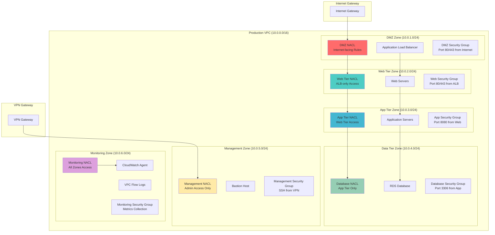

# Securing Networks with Micro-Segmentation using NACLs and Security Groups

## Problem

Enterprise organizations must implement granular network security controls to prevent lateral movement of threats and ensure compliance with regulatory frameworks like PCI DSS, HIPAA, and SOC 2. Traditional network security approaches often rely on perimeter-based defenses that allow broad access within the network, creating security vulnerabilities when an attacker gains initial access. Modern enterprise applications require fine-grained network segmentation that isolates different tiers, environments, and data classification levels while maintaining operational efficiency and application performance.

## Solution

This solution implements a comprehensive micro-segmentation strategy using Network Access Control Lists (NACLs) for subnet-level enforcement and advanced security group configurations for instance-level controls. The architecture creates multiple security zones with layered defenses, automated traffic monitoring, and zero-trust networking principles that ensure every network connection is explicitly authorized and continuously validated.

## Architecture Diagram



## Prerequisites

1. AWS account with appropriate permissions for VPC, EC2, RDS, CloudWatch, and IAM operations
2. AWS CLI v2 installed and configured (or AWS CloudShell)
3. Understanding of network security principles, CIDR blocks, and multi-tier architectures
4. Familiarity with security group and NACL rule precedence and evaluation order
5. Estimated cost: $200-300/month for EC2 instances, RDS, and CloudWatch monitoring

> **Note**: This recipe demonstrates advanced security concepts. Test thoroughly in a non-production environment before implementing in production workloads.

## Preparation

```bash
# Set environment variables
export AWS_REGION=$(aws configure get region)
export AWS_ACCOUNT_ID=$(aws sts get-caller-identity \
    --query Account --output text)

# Generate unique identifiers for resources
RANDOM_SUFFIX=$(aws secretsmanager get-random-password \
    --exclude-punctuation --exclude-uppercase \
    --password-length 6 --require-each-included-type \
    --output text --query RandomPassword)

# Set resource names
export VPC_NAME="microseg-vpc-${RANDOM_SUFFIX}"
export KEY_PAIR_NAME="microseg-key-${RANDOM_SUFFIX}"

# Create VPC for micro-segmentation
aws ec2 create-vpc \
    --cidr-block 10.0.0.0/16 \
    --tag-specifications "ResourceType=vpc,Tags=[{Key=Name,Value=${VPC_NAME}},{Key=Environment,Value=production}]" \
    --query 'Vpc.VpcId' --output text > /tmp/vpc-id

export VPC_ID=$(cat /tmp/vpc-id)

# Create Internet Gateway
aws ec2 create-internet-gateway \
    --tag-specifications "ResourceType=internet-gateway,Tags=[{Key=Name,Value=${VPC_NAME}-igw}]" \
    --query 'InternetGateway.InternetGatewayId' --output text > /tmp/igw-id

export IGW_ID=$(cat /tmp/igw-id)

# Attach Internet Gateway to VPC
aws ec2 attach-internet-gateway \
    --internet-gateway-id $IGW_ID \
    --vpc-id $VPC_ID

# Create key pair for EC2 instances
aws ec2 create-key-pair \
    --key-name $KEY_PAIR_NAME \
    --key-type rsa \
    --query 'KeyMaterial' --output text > /tmp/${KEY_PAIR_NAME}.pem

chmod 400 /tmp/${KEY_PAIR_NAME}.pem

echo "✅ Created VPC infrastructure for micro-segmentation"
```

## Steps

1. **Create Subnets for Each Security Zone**:

   Network micro-segmentation begins with subnet-level isolation, where each subnet acts as a distinct security boundary. By creating separate subnets for different functional tiers (DMZ, web, application, database, management, and monitoring), we establish the foundation for implementing zero-trust networking principles. Each subset will have unique CIDR blocks that enable precise traffic control and prevent unauthorized lateral movement between security zones.

   ```bash
   # Create DMZ subnet (public-facing)
   aws ec2 create-subnet \
       --vpc-id $VPC_ID \
       --cidr-block 10.0.1.0/24 \
       --availability-zone ${AWS_REGION}a \
       --tag-specifications "ResourceType=subnet,Tags=[{Key=Name,Value=dmz-subnet},{Key=Zone,Value=dmz}]" \
       --query 'Subnet.SubnetId' --output text > /tmp/dmz-subnet-id
   
   # Create Web Tier subnet
   aws ec2 create-subnet \
       --vpc-id $VPC_ID \
       --cidr-block 10.0.2.0/24 \
       --availability-zone ${AWS_REGION}a \
       --tag-specifications "ResourceType=subnet,Tags=[{Key=Name,Value=web-subnet},{Key=Zone,Value=web}]" \
       --query 'Subnet.SubnetId' --output text > /tmp/web-subnet-id
   
   # Create Application Tier subnet
   aws ec2 create-subnet \
       --vpc-id $VPC_ID \
       --cidr-block 10.0.3.0/24 \
       --availability-zone ${AWS_REGION}a \
       --tag-specifications "ResourceType=subnet,Tags=[{Key=Name,Value=app-subnet},{Key=Zone,Value=app}]" \
       --query 'Subnet.SubnetId' --output text > /tmp/app-subnet-id
   
   # Create Database Tier subnet
   aws ec2 create-subnet \
       --vpc-id $VPC_ID \
       --cidr-block 10.0.4.0/24 \
       --availability-zone ${AWS_REGION}a \
       --tag-specifications "ResourceType=subnet,Tags=[{Key=Name,Value=db-subnet},{Key=Zone,Value=database}]" \
       --query 'Subnet.SubnetId' --output text > /tmp/db-subnet-id
   
   # Create Management subnet
   aws ec2 create-subnet \
       --vpc-id $VPC_ID \
       --cidr-block 10.0.5.0/24 \
       --availability-zone ${AWS_REGION}a \
       --tag-specifications "ResourceType=subnet,Tags=[{Key=Name,Value=mgmt-subnet},{Key=Zone,Value=management}]" \
       --query 'Subnet.SubnetId' --output text > /tmp/mgmt-subnet-id
   
   # Create Monitoring subnet
   aws ec2 create-subnet \
       --vpc-id $VPC_ID \
       --cidr-block 10.0.6.0/24 \
       --availability-zone ${AWS_REGION}a \
       --tag-specifications "ResourceType=subnet,Tags=[{Key=Name,Value=mon-subnet},{Key=Zone,Value=monitoring}]" \
       --query 'Subnet.SubnetId' --output text > /tmp/mon-subnet-id
   
   # Store subnet IDs in variables
   export DMZ_SUBNET_ID=$(cat /tmp/dmz-subnet-id)
   export WEB_SUBNET_ID=$(cat /tmp/web-subnet-id)
   export APP_SUBNET_ID=$(cat /tmp/app-subnet-id)
   export DB_SUBNET_ID=$(cat /tmp/db-subnet-id)
   export MGMT_SUBNET_ID=$(cat /tmp/mgmt-subnet-id)
   export MON_SUBNET_ID=$(cat /tmp/mon-subnet-id)
   
   echo "✅ Created subnets for each security zone"
   ```

   The subnet architecture is now established with clear boundaries between functional tiers. Each subnet operates in the same availability zone to simplify initial implementation, with dedicated CIDR ranges that allow for precise network access control. This foundational segmentation enables the application of different security policies to each tier based on their specific security requirements and data sensitivity levels.

2. **Create Custom NACLs for Subnet-Level Control**:

   Network Access Control Lists (NACLs) provide stateless, subnet-level traffic filtering that acts as the first line of defense in our micro-segmentation strategy. Unlike the default NACL which allows all traffic, custom NACLs enable us to implement explicit allow/deny rules for each security zone. NACLs evaluate traffic before it reaches instances, providing an additional security layer that complements instance-level security groups.

   ```bash
   # Create DMZ NACL (Internet-facing)
   aws ec2 create-network-acl \
       --vpc-id $VPC_ID \
       --tag-specifications "ResourceType=network-acl,Tags=[{Key=Name,Value=dmz-nacl},{Key=Zone,Value=dmz}]" \
       --query 'NetworkAcl.NetworkAclId' --output text > /tmp/dmz-nacl-id
   
   # Create Web Tier NACL
   aws ec2 create-network-acl \
       --vpc-id $VPC_ID \
       --tag-specifications "ResourceType=network-acl,Tags=[{Key=Name,Value=web-nacl},{Key=Zone,Value=web}]" \
       --query 'NetworkAcl.NetworkAclId' --output text > /tmp/web-nacl-id
   
   # Create App Tier NACL
   aws ec2 create-network-acl \
       --vpc-id $VPC_ID \
       --tag-specifications "ResourceType=network-acl,Tags=[{Key=Name,Value=app-nacl},{Key=Zone,Value=app}]" \
       --query 'NetworkAcl.NetworkAclId' --output text > /tmp/app-nacl-id
   
   # Create Database NACL
   aws ec2 create-network-acl \
       --vpc-id $VPC_ID \
       --tag-specifications "ResourceType=network-acl,Tags=[{Key=Name,Value=db-nacl},{Key=Zone,Value=database}]" \
       --query 'NetworkAcl.NetworkAclId' --output text > /tmp/db-nacl-id
   
   # Create Management NACL
   aws ec2 create-network-acl \
       --vpc-id $VPC_ID \
       --tag-specifications "ResourceType=network-acl,Tags=[{Key=Name,Value=mgmt-nacl},{Key=Zone,Value=management}]" \
       --query 'NetworkAcl.NetworkAclId' --output text > /tmp/mgmt-nacl-id
   
   # Create Monitoring NACL
   aws ec2 create-network-acl \
       --vpc-id $VPC_ID \
       --tag-specifications "ResourceType=network-acl,Tags=[{Key=Name,Value=mon-nacl},{Key=Zone,Value=monitoring}]" \
       --query 'NetworkAcl.NetworkAclId' --output text > /tmp/mon-nacl-id
   
   # Store NACL IDs in variables
   export DMZ_NACL_ID=$(cat /tmp/dmz-nacl-id)
   export WEB_NACL_ID=$(cat /tmp/web-nacl-id)
   export APP_NACL_ID=$(cat /tmp/app-nacl-id)
   export DB_NACL_ID=$(cat /tmp/db-nacl-id)
   export MGMT_NACL_ID=$(cat /tmp/mgmt-nacl-id)
   export MON_NACL_ID=$(cat /tmp/mon-nacl-id)
   
   echo "✅ Created custom NACLs for each security zone"
   ```

   Each security zone now has its own dedicated NACL that will enforce traffic policies at the subnet level. These NACLs start with default deny-all rules, requiring us to explicitly configure allowed traffic patterns. This zero-trust approach ensures that only authorized network flows are permitted between different security zones, significantly reducing the attack surface and potential for lateral movement.

3. **Configure DMZ NACL Rules (Internet-Facing Zone)**:

   The DMZ (Demilitarized Zone) represents the most exposed part of our network architecture, requiring carefully controlled access from the internet while preventing direct access to internal tiers. These NACL rules implement the principle of least privilege by allowing only essential HTTP/HTTPS traffic inbound and controlling outbound communication to internal subnets. The ephemeral port range (1024-65535) accommodates return traffic for established connections, as NACLs are stateless and don't automatically handle response traffic.

   ```bash
   # DMZ Inbound Rules - Allow HTTP/HTTPS from Internet
   aws ec2 create-network-acl-entry \
       --network-acl-id $DMZ_NACL_ID \
       --rule-number 100 \
       --protocol tcp \
       --port-range From=80,To=80 \
       --cidr-block 0.0.0.0/0 \
       --rule-action allow
   
   aws ec2 create-network-acl-entry \
       --network-acl-id $DMZ_NACL_ID \
       --rule-number 110 \
       --protocol tcp \
       --port-range From=443,To=443 \
       --cidr-block 0.0.0.0/0 \
       --rule-action allow
   
   # DMZ Inbound - Allow ephemeral ports for return traffic
   aws ec2 create-network-acl-entry \
       --network-acl-id $DMZ_NACL_ID \
       --rule-number 120 \
       --protocol tcp \
       --port-range From=1024,To=65535 \
       --cidr-block 0.0.0.0/0 \
       --rule-action allow
   
   # DMZ Outbound Rules - Allow to Web Tier
   aws ec2 create-network-acl-entry \
       --network-acl-id $DMZ_NACL_ID \
       --rule-number 100 \
       --protocol tcp \
       --port-range From=80,To=80 \
       --cidr-block 10.0.2.0/24 \
       --rule-action allow \
       --egress
   
   aws ec2 create-network-acl-entry \
       --network-acl-id $DMZ_NACL_ID \
       --rule-number 110 \
       --protocol tcp \
       --port-range From=443,To=443 \
       --cidr-block 10.0.2.0/24 \
       --rule-action allow \
       --egress
   
   # DMZ Outbound - Allow ephemeral ports to Internet
   aws ec2 create-network-acl-entry \
       --network-acl-id $DMZ_NACL_ID \
       --rule-number 120 \
       --protocol tcp \
       --port-range From=1024,To=65535 \
       --cidr-block 0.0.0.0/0 \
       --rule-action allow \
       --egress
   
   echo "✅ Configured DMZ NACL rules for internet-facing traffic"
   ```

   The DMZ NACL now enforces strict traffic policies that allow internet users to access web services while preventing direct access to internal network segments. The inbound rules permit standard web traffic (HTTP/HTTPS) and return traffic on ephemeral ports, while outbound rules restrict communication to only the web tier and necessary internet responses. This configuration creates a controlled entry point that filters malicious traffic before it can reach internal systems.

4. **Configure Web Tier NACL Rules**:

   The web tier operates as a critical security boundary between the public-facing DMZ and internal application logic. These NACL rules implement strict source-based access control, allowing traffic only from the DMZ subnet and management subnet for administrative access. The monitoring port (161) enables SNMP-based performance monitoring while maintaining security isolation. This tier serves as a reverse proxy or web server layer that processes user requests before forwarding them to the application tier.

   ```bash
   # Web Tier Inbound - Allow from DMZ only
   aws ec2 create-network-acl-entry \
       --network-acl-id $WEB_NACL_ID \
       --rule-number 100 \
       --protocol tcp \
       --port-range From=80,To=80 \
       --cidr-block 10.0.1.0/24 \
       --rule-action allow
   
   aws ec2 create-network-acl-entry \
       --network-acl-id $WEB_NACL_ID \
       --rule-number 110 \
       --protocol tcp \
       --port-range From=443,To=443 \
       --cidr-block 10.0.1.0/24 \
       --rule-action allow
   
   # Web Tier Inbound - Allow SSH from Management
   aws ec2 create-network-acl-entry \
       --network-acl-id $WEB_NACL_ID \
       --rule-number 120 \
       --protocol tcp \
       --port-range From=22,To=22 \
       --cidr-block 10.0.5.0/24 \
       --rule-action allow
   
   # Web Tier Inbound - Allow monitoring from Monitoring zone
   aws ec2 create-network-acl-entry \
       --network-acl-id $WEB_NACL_ID \
       --rule-number 130 \
       --protocol udp \
       --port-range From=161,To=161 \
       --cidr-block 10.0.6.0/24 \
       --rule-action allow
   
   # Web Tier Outbound - Allow to App Tier
   aws ec2 create-network-acl-entry \
       --network-acl-id $WEB_NACL_ID \
       --rule-number 100 \
       --protocol tcp \
       --port-range From=8080,To=8080 \
       --cidr-block 10.0.3.0/24 \
       --rule-action allow \
       --egress
   
   # Web Tier Outbound - Allow return traffic to DMZ
   aws ec2 create-network-acl-entry \
       --network-acl-id $WEB_NACL_ID \
       --rule-number 110 \
       --protocol tcp \
       --port-range From=1024,To=65535 \
       --cidr-block 10.0.1.0/24 \
       --rule-action allow \
       --egress
   
   # Web Tier Outbound - Allow HTTPS to Internet for updates
   aws ec2 create-network-acl-entry \
       --network-acl-id $WEB_NACL_ID \
       --rule-number 120 \
       --protocol tcp \
       --port-range From=443,To=443 \
       --cidr-block 0.0.0.0/0 \
       --rule-action allow \
       --egress
   
   echo "✅ Configured Web Tier NACL rules"
   ```

   The web tier NACL creates a secure intermediary layer that processes incoming requests from the DMZ while maintaining strict access controls to the application tier. These rules ensure that web servers can only receive traffic from authorized sources (DMZ load balancers and management hosts) and can only communicate with specific downstream services. The HTTPS outbound rule enables the web tier to download security updates and patches while maintaining network isolation.

5. **Configure Application Tier NACL Rules**:

   The application tier contains the core business logic and represents a high-value target for attackers, making it critical to implement the most restrictive access controls possible. These NACL rules ensure that application servers can only receive traffic from the web tier on port 8080 (typical application server port) and management systems for administrative access. The outbound rules allow database connectivity and external API calls while preventing direct internet access for enhanced security.

   ```bash
   # App Tier Inbound - Allow from Web Tier only
   aws ec2 create-network-acl-entry \
       --network-acl-id $APP_NACL_ID \
       --rule-number 100 \
       --protocol tcp \
       --port-range From=8080,To=8080 \
       --cidr-block 10.0.2.0/24 \
       --rule-action allow
   
   # App Tier Inbound - Allow SSH from Management
   aws ec2 create-network-acl-entry \
       --network-acl-id $APP_NACL_ID \
       --rule-number 110 \
       --protocol tcp \
       --port-range From=22,To=22 \
       --cidr-block 10.0.5.0/24 \
       --rule-action allow
   
   # App Tier Inbound - Allow monitoring
   aws ec2 create-network-acl-entry \
       --network-acl-id $APP_NACL_ID \
       --rule-number 120 \
       --protocol udp \
       --port-range From=161,To=161 \
       --cidr-block 10.0.6.0/24 \
       --rule-action allow
   
   # App Tier Outbound - Allow to Database
   aws ec2 create-network-acl-entry \
       --network-acl-id $APP_NACL_ID \
       --rule-number 100 \
       --protocol tcp \
       --port-range From=3306,To=3306 \
       --cidr-block 10.0.4.0/24 \
       --rule-action allow \
       --egress
   
   # App Tier Outbound - Allow return traffic to Web Tier
   aws ec2 create-network-acl-entry \
       --network-acl-id $APP_NACL_ID \
       --rule-number 110 \
       --protocol tcp \
       --port-range From=1024,To=65535 \
       --cidr-block 10.0.2.0/24 \
       --rule-action allow \
       --egress
   
   # App Tier Outbound - Allow HTTPS for external APIs
   aws ec2 create-network-acl-entry \
       --network-acl-id $APP_NACL_ID \
       --rule-number 120 \
       --protocol tcp \
       --port-range From=443,To=443 \
       --cidr-block 0.0.0.0/0 \
       --rule-action allow \
       --egress
   
   echo "✅ Configured Application Tier NACL rules"
   ```

   The application tier NACL establishes a highly secure environment for business logic processing, with strict controls on both inbound and outbound traffic. Application servers can now only receive requests from authenticated web tier sources and can only communicate with the database tier for data operations. The limited HTTPS access enables integration with external APIs and services while preventing unauthorized internet access that could be exploited for data exfiltration.

> **Warning**: NACL rules are processed in numerical order (lowest to highest), and the first matching rule determines the action. Ensure rule numbers are properly sequenced to avoid unintended traffic blocking or allowing.

6. **Configure Database Tier NACL Rules (Most Restrictive)**:

   The database tier requires the most stringent security controls as it contains sensitive business data and represents the highest value target for attackers. These NACL rules implement a zero-trust model where database access is restricted exclusively to application servers on port 3306 (MySQL/MariaDB). Management access is carefully controlled through the dedicated management subnet, and monitoring capabilities are preserved while maintaining strict security isolation from all other network segments.

   ```bash
   # Database Tier Inbound - Allow from App Tier only
   aws ec2 create-network-acl-entry \
       --network-acl-id $DB_NACL_ID \
       --rule-number 100 \
       --protocol tcp \
       --port-range From=3306,To=3306 \
       --cidr-block 10.0.3.0/24 \
       --rule-action allow
   
   # Database Tier Inbound - Allow SSH from Management only
   aws ec2 create-network-acl-entry \
       --network-acl-id $DB_NACL_ID \
       --rule-number 110 \
       --protocol tcp \
       --port-range From=22,To=22 \
       --cidr-block 10.0.5.0/24 \
       --rule-action allow
   
   # Database Tier Inbound - Allow monitoring
   aws ec2 create-network-acl-entry \
       --network-acl-id $DB_NACL_ID \
       --rule-number 120 \
       --protocol udp \
       --port-range From=161,To=161 \
       --cidr-block 10.0.6.0/24 \
       --rule-action allow
   
   # Database Tier Outbound - Allow return traffic to App Tier
   aws ec2 create-network-acl-entry \
       --network-acl-id $DB_NACL_ID \
       --rule-number 100 \
       --protocol tcp \
       --port-range From=1024,To=65535 \
       --cidr-block 10.0.3.0/24 \
       --rule-action allow \
       --egress
   
   # Database Tier Outbound - Allow HTTPS for patches (restricted)
   aws ec2 create-network-acl-entry \
       --network-acl-id $DB_NACL_ID \
       --rule-number 110 \
       --protocol tcp \
       --port-range From=443,To=443 \
       --cidr-block 0.0.0.0/0 \
       --rule-action allow \
       --egress
   
   echo "✅ Configured Database Tier NACL rules (most restrictive)"
   ```

   The database tier NACL creates the most secure network environment in our architecture, implementing defense-in-depth principles that protect critical data assets. Database servers can now only accept connections from authorized application servers and management systems, with no direct internet access except for essential security updates. This configuration prevents data exfiltration attempts and unauthorized database access while maintaining operational capabilities for legitimate business functions.

7. **Associate NACLs with Respective Subnets**:

   NACL association is the critical step that activates our network security policies, replacing the default permissive NACL with our custom restrictive configurations. Each subnet can only be associated with one NACL at a time, and this association immediately begins filtering all traffic entering and leaving the subnet. This step transforms our network from a flat, permissive architecture to a segmented, zero-trust environment where every network flow must be explicitly authorized.

   ```bash
   # Associate each NACL with its respective subnet
   aws ec2 associate-network-acl \
       --network-acl-id $DMZ_NACL_ID \
       --subnet-id $DMZ_SUBNET_ID
   
   aws ec2 associate-network-acl \
       --network-acl-id $WEB_NACL_ID \
       --subnet-id $WEB_SUBNET_ID
   
   aws ec2 associate-network-acl \
       --network-acl-id $APP_NACL_ID \
       --subnet-id $APP_SUBNET_ID
   
   aws ec2 associate-network-acl \
       --network-acl-id $DB_NACL_ID \
       --subnet-id $DB_SUBNET_ID
   
   aws ec2 associate-network-acl \
       --network-acl-id $MGMT_NACL_ID \
       --subnet-id $MGMT_SUBNET_ID
   
   aws ec2 associate-network-acl \
       --network-acl-id $MON_NACL_ID \
       --subnet-id $MON_SUBNET_ID
   
   echo "✅ Associated NACLs with respective subnets"
   ```

   The subnet-level security policies are now active and enforcing traffic restrictions throughout the VPC. Each subnet operates under its own security ruleset, creating isolated network zones that prevent unauthorized lateral movement. This association establishes the first layer of our defense-in-depth strategy, with NACLs providing broad traffic filtering that will be refined further by instance-level security groups.

8. **Create Advanced Security Groups with Layered Rules**:

   Security groups provide stateful, instance-level traffic filtering that complements our NACL-based subnet security. Unlike NACLs which filter at the subnet boundary, security groups attach directly to instances and automatically handle return traffic for established connections. These security groups implement fine-grained access control using both CIDR blocks and security group references, enabling dynamic and scalable security policies that adapt as instances are added or removed from the environment.

   ```bash
   # Create DMZ Security Group (Load Balancer)
   aws ec2 create-security-group \
       --group-name "dmz-alb-sg" \
       --description "Security group for Application Load Balancer in DMZ" \
       --vpc-id $VPC_ID \
       --tag-specifications "ResourceType=security-group,Tags=[{Key=Name,Value=dmz-alb-sg},{Key=Zone,Value=dmz}]" \
       --query 'GroupId' --output text > /tmp/dmz-sg-id
   
   # Create Web Tier Security Group
   aws ec2 create-security-group \
       --group-name "web-tier-sg" \
       --description "Security group for Web Tier instances" \
       --vpc-id $VPC_ID \
       --tag-specifications "ResourceType=security-group,Tags=[{Key=Name,Value=web-tier-sg},{Key=Zone,Value=web}]" \
       --query 'GroupId' --output text > /tmp/web-sg-id
   
   # Create App Tier Security Group
   aws ec2 create-security-group \
       --group-name "app-tier-sg" \
       --description "Security group for Application Tier instances" \
       --vpc-id $VPC_ID \
       --tag-specifications "ResourceType=security-group,Tags=[{Key=Name,Value=app-tier-sg},{Key=Zone,Value=app}]" \
       --query 'GroupId' --output text > /tmp/app-sg-id
   
   # Create Database Security Group
   aws ec2 create-security-group \
       --group-name "db-tier-sg" \
       --description "Security group for Database Tier" \
       --vpc-id $VPC_ID \
       --tag-specifications "ResourceType=security-group,Tags=[{Key=Name,Value=db-tier-sg},{Key=Zone,Value=database}]" \
       --query 'GroupId' --output text > /tmp/db-sg-id
   
   # Create Management Security Group
   aws ec2 create-security-group \
       --group-name "mgmt-sg" \
       --description "Security group for Management resources" \
       --vpc-id $VPC_ID \
       --tag-specifications "ResourceType=security-group,Tags=[{Key=Name,Value=mgmt-sg},{Key=Zone,Value=management}]" \
       --query 'GroupId' --output text > /tmp/mgmt-sg-id
   
   # Store Security Group IDs
   export DMZ_SG_ID=$(cat /tmp/dmz-sg-id)
   export WEB_SG_ID=$(cat /tmp/web-sg-id)
   export APP_SG_ID=$(cat /tmp/app-sg-id)
   export DB_SG_ID=$(cat /tmp/db-sg-id)
   export MGMT_SG_ID=$(cat /tmp/mgmt-sg-id)
   
   echo "✅ Created security groups for each tier"
   ```

   The security group framework is now established, providing the second layer of our defense-in-depth strategy. Each functional tier has its own dedicated security group that will enforce instance-level access controls based on application requirements. These security groups will work in conjunction with NACLs to create comprehensive network protection, with NACLs providing broad subnet-level filtering and security groups providing precise instance-level controls.

9. **Configure Security Group Rules with Source Group References**:

   Security group rules using source group references create dynamic, maintainable security policies that automatically adapt as instances are launched or terminated. Instead of hardcoding IP addresses, these rules reference other security groups, meaning that any instance assigned to the referenced security group automatically gains the specified access. This approach enables elastic scaling while maintaining consistent security policies and reduces the administrative overhead of managing static IP-based rules.

   ```bash
   # DMZ Security Group Rules (ALB)
   aws ec2 authorize-security-group-ingress \
       --group-id $DMZ_SG_ID \
       --protocol tcp \
       --port 80 \
       --cidr 0.0.0.0/0
   
   aws ec2 authorize-security-group-ingress \
       --group-id $DMZ_SG_ID \
       --protocol tcp \
       --port 443 \
       --cidr 0.0.0.0/0
   
   # Web Tier Security Group Rules
   aws ec2 authorize-security-group-ingress \
       --group-id $WEB_SG_ID \
       --protocol tcp \
       --port 80 \
       --source-group $DMZ_SG_ID
   
   aws ec2 authorize-security-group-ingress \
       --group-id $WEB_SG_ID \
       --protocol tcp \
       --port 443 \
       --source-group $DMZ_SG_ID
   
   aws ec2 authorize-security-group-ingress \
       --group-id $WEB_SG_ID \
       --protocol tcp \
       --port 22 \
       --source-group $MGMT_SG_ID
   
   # App Tier Security Group Rules
   aws ec2 authorize-security-group-ingress \
       --group-id $APP_SG_ID \
       --protocol tcp \
       --port 8080 \
       --source-group $WEB_SG_ID
   
   aws ec2 authorize-security-group-ingress \
       --group-id $APP_SG_ID \
       --protocol tcp \
       --port 22 \
       --source-group $MGMT_SG_ID
   
   # Database Security Group Rules (most restrictive)
   aws ec2 authorize-security-group-ingress \
       --group-id $DB_SG_ID \
       --protocol tcp \
       --port 3306 \
       --source-group $APP_SG_ID
   
   aws ec2 authorize-security-group-ingress \
       --group-id $DB_SG_ID \
       --protocol tcp \
       --port 22 \
       --source-group $MGMT_SG_ID
   
   # Management Security Group Rules (VPN access)
   aws ec2 authorize-security-group-ingress \
       --group-id $MGMT_SG_ID \
       --protocol tcp \
       --port 22 \
       --cidr 10.0.0.0/8
   
   echo "✅ Configured security group rules with source group references"
   ```

   The instance-level security policies are now active and enforcing precise access controls based on functional roles rather than static IP addresses. This security group configuration creates a dynamic, self-managing security architecture where instances automatically inherit appropriate network permissions based on their assigned security groups. The layered approach of NACLs plus security groups provides comprehensive protection that addresses both broad network threats and specific application security requirements.

> **Note**: Security groups are stateful, meaning return traffic is automatically allowed for established connections. This differs from NACLs which require explicit inbound and outbound rules for bidirectional communication. See [AWS Security Groups Documentation](https://docs.aws.amazon.com/vpc/latest/userguide/VPC_SecurityGroups.html) for detailed implementation guidance.

10. **Set Up VPC Flow Logs for Traffic Monitoring**:

    VPC Flow Logs provide essential network visibility by capturing metadata about all network traffic flowing through the VPC, including accepted and rejected connections. This monitoring capability enables security teams to detect anomalous behavior, unauthorized access attempts, and potential data exfiltration activities. The integration with CloudWatch creates a centralized logging and alerting system that can automatically respond to suspicious network patterns, making our micro-segmentation strategy observable and actionable.

    ```bash
    # Create IAM role for VPC Flow Logs
    aws iam create-role \
        --role-name VPCFlowLogsRole \
        --assume-role-policy-document '{
            "Version": "2012-10-17",
            "Statement": [
                {
                    "Effect": "Allow",
                    "Principal": {
                        "Service": "vpc-flow-logs.amazonaws.com"
                    },
                    "Action": "sts:AssumeRole"
                }
            ]
        }'
    
    # Attach policy to role
    aws iam attach-role-policy \
        --role-name VPCFlowLogsRole \
        --policy-arn arn:aws:iam::aws:policy/service-role/VPCFlowLogsDeliveryRolePolicy
    
    # Create CloudWatch Log Group for Flow Logs
    aws logs create-log-group \
        --log-group-name /aws/vpc/microsegmentation/flowlogs
    
    # Enable VPC Flow Logs for the entire VPC
    aws ec2 create-flow-logs \
        --resource-type VPC \
        --resource-ids $VPC_ID \
        --traffic-type ALL \
        --log-destination-type cloud-watch-logs \
        --log-group-name /aws/vpc/microsegmentation/flowlogs \
        --deliver-logs-permission-arn "arn:aws:iam::${AWS_ACCOUNT_ID}:role/VPCFlowLogsRole" \
        --query 'FlowLogIds[0]' --output text > /tmp/flow-log-id
    
    # Create CloudWatch alarms for suspicious traffic patterns
    aws cloudwatch put-metric-alarm \
        --alarm-name "VPC-Rejected-Traffic-High" \
        --alarm-description "High number of rejected packets in VPC" \
        --metric-name "FlowLogRejectedPackets" \
        --namespace "AWS/VPC" \
        --statistic Sum \
        --period 300 \
        --threshold 1000 \
        --comparison-operator GreaterThanThreshold \
        --dimensions Name=VpcId,Value=$VPC_ID
    
    echo "✅ Configured VPC Flow Logs and CloudWatch monitoring"
    ```

    The network monitoring and alerting infrastructure is now operational, providing continuous visibility into network traffic patterns and security events. VPC Flow Logs capture every network connection attempt, while CloudWatch alarms automatically detect and alert on suspicious activities such as high numbers of rejected connections. This monitoring capability transforms our micro-segmentation from a static security configuration into a dynamic, observable system that can detect and respond to threats in real-time.

## Validation & Testing

1. **Verify NACL Configuration**:

   ```bash
   # Check NACL associations
   aws ec2 describe-network-acls \
       --network-acl-ids $WEB_NACL_ID \
       --query 'NetworkAcls[0].Associations[*].SubnetId'
   ```

   Expected output: Should show the Web subnet ID

2. **Test Security Group Rules**:

   ```bash
   # Verify security group rules
   aws ec2 describe-security-groups \
       --group-ids $WEB_SG_ID \
       --query 'SecurityGroups[0].IpPermissions[*].[IpProtocol,FromPort,ToPort,UserIdGroupPairs[0].GroupId]' \
       --output table
   ```

   Expected output: Should show rules referencing DMZ and Management security groups

3. **Validate VPC Flow Logs**:

   ```bash
   # Check Flow Logs status
   aws ec2 describe-flow-logs \
       --flow-log-ids $(cat /tmp/flow-log-id) \
       --query 'FlowLogs[0].FlowLogStatus'
   ```

   Expected output: `"ACTIVE"`

4. **Test Network Connectivity Between Tiers**:

   ```bash
   # Check effective routes for each subnet
   aws ec2 describe-route-tables \
       --filters "Name=association.subnet-id,Values=$WEB_SUBNET_ID" \
       --query 'RouteTables[0].Routes[*].[DestinationCidrBlock,GatewayId]' \
       --output table
   ```

   Expected output: Should show local VPC routes and IGW route

5. **Verify NACL Rule Precedence**:

   ```bash
   # Check NACL entries for proper rule ordering
   aws ec2 describe-network-acls \
       --network-acl-ids $APP_NACL_ID \
       --query 'NetworkAcls[0].Entries[*].[RuleNumber,Protocol,RuleAction,CidrBlock,PortRange]' \
       --output table
   ```

   Expected output: Rules should be in ascending order with proper protocols and ports

## Cleanup

1. **Remove Flow Logs and CloudWatch Resources**:

   ```bash
   # Delete Flow Logs
   aws ec2 delete-flow-logs \
       --flow-log-ids $(cat /tmp/flow-log-id)
   
   # Delete CloudWatch alarms
   aws cloudwatch delete-alarms \
       --alarm-names "VPC-Rejected-Traffic-High"
   
   # Delete CloudWatch Log Group
   aws logs delete-log-group \
       --log-group-name /aws/vpc/microsegmentation/flowlogs
   
   # Delete IAM role and policies
   aws iam detach-role-policy \
       --role-name VPCFlowLogsRole \
       --policy-arn arn:aws:iam::aws:policy/service-role/VPCFlowLogsDeliveryRolePolicy
   
   aws iam delete-role --role-name VPCFlowLogsRole
   
   echo "✅ Removed monitoring and logging resources"
   ```

2. **Delete Security Groups**:

   ```bash
   # Delete security groups (order matters due to dependencies)
   aws ec2 delete-security-group --group-id $DB_SG_ID
   aws ec2 delete-security-group --group-id $APP_SG_ID
   aws ec2 delete-security-group --group-id $WEB_SG_ID
   aws ec2 delete-security-group --group-id $DMZ_SG_ID
   aws ec2 delete-security-group --group-id $MGMT_SG_ID
   
   echo "✅ Deleted security groups"
   ```

3. **Remove NACL Associations and Delete Custom NACLs**:

   ```bash
   # Get default NACL ID for re-association
   DEFAULT_NACL_ID=$(aws ec2 describe-network-acls \
       --filters "Name=vpc-id,Values=$VPC_ID" "Name=default,Values=true" \
       --query 'NetworkAcls[0].NetworkAclId' --output text)
   
   # Re-associate subnets with default NACL
   for subnet_id in $DMZ_SUBNET_ID $WEB_SUBNET_ID $APP_SUBNET_ID $DB_SUBNET_ID $MGMT_SUBNET_ID $MON_SUBNET_ID; do
       aws ec2 associate-network-acl \
           --network-acl-id $DEFAULT_NACL_ID \
           --subnet-id $subnet_id
   done
   
   # Delete custom NACLs
   for nacl_id in $DMZ_NACL_ID $WEB_NACL_ID $APP_NACL_ID $DB_NACL_ID $MGMT_NACL_ID $MON_NACL_ID; do
       aws ec2 delete-network-acl --network-acl-id $nacl_id
   done
   
   echo "✅ Removed custom NACLs and restored default associations"
   ```

4. **Delete Subnets and VPC Infrastructure**:

   ```bash
   # Delete subnets
   for subnet_id in $DMZ_SUBNET_ID $WEB_SUBNET_ID $APP_SUBNET_ID $DB_SUBNET_ID $MGMT_SUBNET_ID $MON_SUBNET_ID; do
       aws ec2 delete-subnet --subnet-id $subnet_id
   done
   
   # Detach and delete Internet Gateway
   aws ec2 detach-internet-gateway \
       --internet-gateway-id $IGW_ID \
       --vpc-id $VPC_ID
   
   aws ec2 delete-internet-gateway \
       --internet-gateway-id $IGW_ID
   
   # Delete VPC
   aws ec2 delete-vpc --vpc-id $VPC_ID
   
   # Delete key pair
   aws ec2 delete-key-pair --key-name $KEY_PAIR_NAME
   
   # Clean up temporary files
   rm -f /tmp/*-id /tmp/*-subnet-id /tmp/*-nacl-id /tmp/*-sg-id /tmp/${KEY_PAIR_NAME}.pem
   
   echo "✅ Deleted all VPC infrastructure and cleaned up temporary files"
   ```

## Discussion

Network micro-segmentation represents a fundamental shift from traditional perimeter-based security to a zero-trust model where every network connection must be explicitly authorized. This recipe demonstrates how to implement defense-in-depth using both NACLs and security groups to create multiple layers of network security controls. NACLs operate at the subnet level and provide stateless filtering, while security groups operate at the instance level with stateful filtering, creating complementary security layers that significantly reduce the attack surface.

The layered security approach implemented here follows the AWS Well-Architected Framework's security pillar by implementing the principle of least privilege, where each tier only has access to the specific resources and ports required for its function. The DMZ zone is isolated to handle only internet-facing traffic, the web tier can only communicate with the application tier on specific ports, and the database tier is completely isolated except for necessary database connections. This segmentation prevents lateral movement of attackers and contains potential security breaches within specific network zones, following defense-in-depth principles outlined in the [AWS Well-Architected Security Pillar](https://docs.aws.amazon.com/wellarchitected/latest/security-pillar/welcome.html).

VPC Flow Logs provide essential visibility into network traffic patterns and enable security teams to detect anomalous behavior, unauthorized access attempts, and potential data exfiltration. The integration with CloudWatch allows for real-time monitoring and automated alerting based on traffic patterns, rejected connections, and unusual data volumes. Organizations should establish baseline traffic patterns and implement automated responses to security events to maximize the effectiveness of this monitoring approach, as described in the [AWS VPC Flow Logs documentation](https://docs.aws.amazon.com/vpc/latest/userguide/flow-logs.html).

The use of security group references instead of hard-coded IP addresses creates a more maintainable and scalable security architecture that aligns with AWS cloud-native principles. When instances are launched or terminated, the security group memberships automatically adjust the access controls without requiring manual rule updates. This approach is particularly valuable in dynamic environments where instances frequently scale up or down based on demand, supporting elastic architectures while maintaining consistent security postures.

> **Tip**: Regularly audit your NACL and security group rules using AWS Config and AWS Security Hub to ensure compliance with your organization's security policies and detect any unauthorized changes. The [AWS Config Rules for VPC Security](https://docs.aws.amazon.com/config/latest/developerguide/vpc-sg-open-only-to-authorized-ports.html) can automate this monitoring process.

## Challenge

Extend this solution by implementing these enhancements:

1. **Implement Automated Security Response**: Create Lambda functions triggered by CloudWatch Events that automatically isolate compromised instances by modifying their security group memberships and creating forensic snapshots for investigation.

2. **Deploy Network Intrusion Detection**: Integrate Amazon GuardDuty with VPC Flow Logs analysis to detect malicious network activity patterns and automatically create response workflows using Step Functions.

3. **Build Dynamic Segmentation**: Implement tag-based automated security group assignment using Lambda and AWS Config rules that dynamically adjust network access based on instance metadata and compliance status.

4. **Create Traffic Analysis Dashboard**: Build a comprehensive network security dashboard using Amazon OpenSearch Service and Kibana to visualize traffic patterns, security events, and compliance metrics across all network segments.

5. **Implement Network Compliance Automation**: Develop automated compliance checking using AWS Config rules that validate NACL and security group configurations against organizational security standards and automatically remediate non-compliant configurations.

## Infrastructure Code

### Available Infrastructure as Code:

- [Infrastructure Code Overview](code/README.md) - Detailed description of all infrastructure components
- [AWS CDK (Python)](code/cdk-python/) - AWS CDK Python implementation
- [AWS CDK (TypeScript)](code/cdk-typescript/) - AWS CDK TypeScript implementation
- [CloudFormation](code/cloudformation.yaml) - AWS CloudFormation template
- [Bash CLI Scripts](code/scripts/) - Example bash scripts using AWS CLI commands to deploy infrastructure
- [Terraform](code/terraform/) - Terraform configuration files