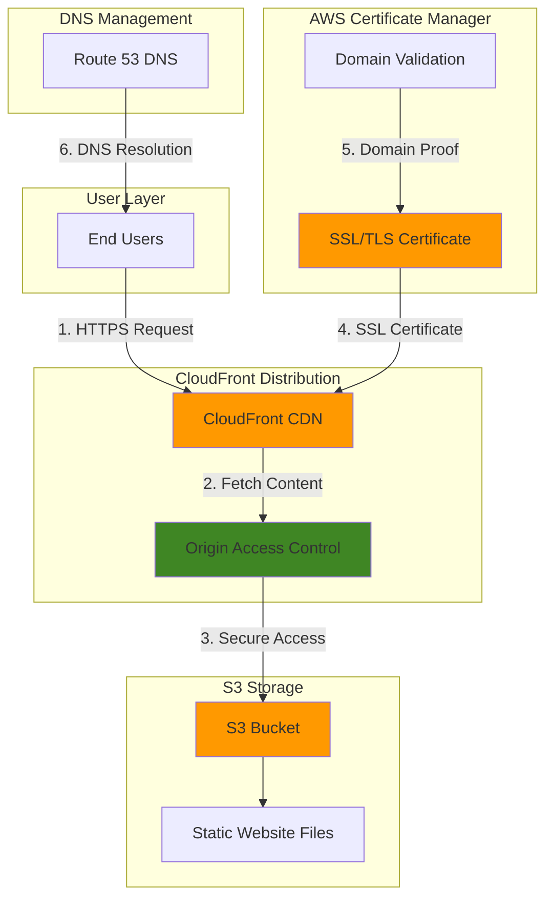

# Securing Websites with SSL Certificates

## Problem

Many organizations host static websites on S3 but struggle with implementing secure HTTPS connections for their custom domains. Without proper SSL/TLS certificates, websites remain vulnerable to man-in-the-middle attacks, fail to meet modern security standards, and receive poor search engine rankings. Manual certificate management introduces complexity, renewal risks, and potential downtime that can impact business operations and customer trust.

## Solution

Implement a fully managed SSL/TLS certificate solution using AWS Certificate Manager (ACM) integrated with CloudFront and S3. This approach provides automatic certificate provisioning, validation, and renewal while ensuring secure HTTPS connections for static websites with custom domains and global content delivery performance.

## Architecture Diagram



## Prerequisites

1. AWS account with appropriate permissions for Certificate Manager, CloudFront, S3, and Route 53
2. AWS CLI installed and configured (or use AWS CloudShell)
3. A registered domain name with DNS management access
4. Basic understanding of SSL/TLS certificates and DNS validation
5. Estimated cost: $0.50-$2.00 per month for CloudFront data transfer (Certificate Manager certificates are free)

> **Note**: ACM certificates are provided at no additional charge, but you pay for CloudFront data transfer and requests.

## Preparation

```bash
# Set environment variables
export AWS_REGION=$(aws configure get region)
export AWS_ACCOUNT_ID=$(aws sts get-caller-identity \
    --query Account --output text)

# Generate unique identifiers for resources
RANDOM_SUFFIX=$(aws secretsmanager get-random-password \
    --exclude-punctuation --exclude-uppercase \
    --password-length 6 --require-each-included-type \
    --output text --query RandomPassword)

# Set your domain name (replace with your actual domain)
export DOMAIN_NAME="example.com"
export SUBDOMAIN="www.${DOMAIN_NAME}"

# Create S3 bucket for static website
export BUCKET_NAME="static-website-${RANDOM_SUFFIX}"

echo "✅ AWS environment configured for region: ${AWS_REGION}"
echo "✅ Domain configured: ${DOMAIN_NAME}"
echo "✅ Bucket name: ${BUCKET_NAME}"
```

## Steps

1. **Create S3 Bucket for Static Website Hosting**:

   Amazon S3 provides the foundational storage layer for our static website with 99.999999999% (11 9's) durability. Configuring S3 for static website hosting enables it to serve HTML, CSS, JavaScript, and other web assets directly to users while supporting custom error pages and index document routing.

   ```bash
   # Create S3 bucket with versioning enabled
   aws s3 mb s3://${BUCKET_NAME} --region ${AWS_REGION}
   
   # Enable versioning for better file management
   aws s3api put-bucket-versioning \
       --bucket ${BUCKET_NAME} \
       --versioning-configuration Status=Enabled
   
   # Configure bucket for static website hosting
   aws s3api put-bucket-website \
       --bucket ${BUCKET_NAME} \
       --website-configuration \
       'IndexDocument={Suffix=index.html},ErrorDocument={Key=error.html}'
   
   echo "✅ S3 bucket created and configured for static website hosting"
   ```

   The S3 bucket is now configured with static website hosting capabilities, providing the origin for our CloudFront distribution while supporting proper indexing and error handling.

2. **Upload Sample Website Content**:

   Creating sample website content allows us to test the SSL certificate implementation and verify HTTPS functionality. This content demonstrates the secure connection established between users and the CloudFront distribution.

   ```bash
   # Create basic HTML files for testing
   cat > index.html << 'EOF'
<!DOCTYPE html>
<html>
<head>
    <title>Secure Static Website</title>
    <style>
        body { font-family: Arial, sans-serif; margin: 50px; }
        .secure { color: green; font-weight: bold; }
    </style>
</head>
<body>
    <h1>Welcome to Your <span class="secure">Secure</span> Website</h1>
    <p>This website is served over HTTPS using AWS Certificate Manager.</p>
    <p>SSL/TLS certificate automatically managed by AWS ACM.</p>
</body>
</html>
EOF
   
   cat > error.html << 'EOF'
<!DOCTYPE html>
<html>
<head>
    <title>Page Not Found</title>
</head>
<body>
    <h1>404 - Page Not Found</h1>
    <p>The requested page could not be found.</p>
</body>
</html>
EOF
   
   # Upload files to S3 bucket
   aws s3 cp index.html s3://${BUCKET_NAME}/
   aws s3 cp error.html s3://${BUCKET_NAME}/
   
   echo "✅ Sample website content uploaded to S3 bucket"
   ```

3. **Request SSL Certificate from AWS Certificate Manager**:

   AWS Certificate Manager (ACM) provides free SSL/TLS certificates that automatically renew before expiration. For CloudFront distributions, certificates must be requested in the us-east-1 region regardless of your default region, as CloudFront globally distributes certificates from this region.

   ```bash
   # Request SSL certificate (must be in us-east-1 for CloudFront)
   CERTIFICATE_ARN=$(aws acm request-certificate \
       --domain-name ${DOMAIN_NAME} \
       --subject-alternative-names ${SUBDOMAIN} \
       --validation-method DNS \
       --region us-east-1 \
       --query CertificateArn \
       --output text)
   
   echo "Certificate ARN: ${CERTIFICATE_ARN}"
   
   # Get DNS validation records
   aws acm describe-certificate \
       --certificate-arn ${CERTIFICATE_ARN} \
       --region us-east-1 \
       --query 'Certificate.DomainValidationOptions' \
       --output table
   
   echo "✅ SSL certificate requested - DNS validation records displayed above"
   ```

   The certificate is now requested and awaiting DNS validation. The validation records must be added to your domain's DNS to prove ownership before the certificate can be issued.

4. **Create CloudFront Origin Access Control (OAC)**:

   Origin Access Control (OAC) provides secure access to S3 buckets by ensuring content is only accessible through CloudFront, not directly from S3. This security measure prevents bypass of CloudFront's caching and security features while maintaining proper access controls.

   ```bash
   # Create Origin Access Control
   OAC_ID=$(aws cloudfront create-origin-access-control \
       --origin-access-control-config \
       Name=OAC-${RANDOM_SUFFIX},\
       Description="Origin Access Control for ${BUCKET_NAME}",\
       OriginAccessControlOriginType=s3,\
       SigningBehavior=always,\
       SigningProtocol=sigv4 \
       --query 'OriginAccessControl.Id' \
       --output text)
   
   echo "Origin Access Control ID: ${OAC_ID}"
   echo "✅ Origin Access Control created successfully"
   ```

5. **Create CloudFront Distribution with SSL Certificate**:

   CloudFront provides a global content delivery network that caches and serves content from edge locations worldwide. Integrating the ACM certificate enables HTTPS connections while Origin Access Control ensures secure communication between CloudFront and S3.

   ```bash
   # Wait for certificate to be validated before proceeding
   echo "⏳ Waiting for certificate validation..."
   aws acm wait certificate-validated \
       --certificate-arn ${CERTIFICATE_ARN} \
       --region us-east-1
   
   echo "✅ Certificate validated successfully"
   
   # Create CloudFront distribution configuration file
   cat > distribution-config.json << EOF
{
    "CallerReference": "static-website-${RANDOM_SUFFIX}",
    "DefaultRootObject": "index.html",
    "Origins": {
        "Quantity": 1,
        "Items": [
            {
                "Id": "S3-${BUCKET_NAME}",
                "DomainName": "${BUCKET_NAME}.s3.${AWS_REGION}.amazonaws.com",
                "OriginAccessControlId": "${OAC_ID}",
                "S3OriginConfig": {
                    "OriginAccessIdentity": ""
                }
            }
        ]
    },
    "DefaultCacheBehavior": {
        "TargetOriginId": "S3-${BUCKET_NAME}",
        "ViewerProtocolPolicy": "redirect-to-https",
        "AllowedMethods": {
            "Quantity": 2,
            "Items": ["HEAD", "GET"],
            "CachedMethods": {
                "Quantity": 2,
                "Items": ["HEAD", "GET"]
            }
        },
        "ForwardedValues": {
            "QueryString": false,
            "Cookies": {
                "Forward": "none"
            }
        },
        "TrustedSigners": {
            "Enabled": false,
            "Quantity": 0
        },
        "MinTTL": 0,
        "DefaultTTL": 86400,
        "MaxTTL": 31536000,
        "Compress": true
    },
    "Comment": "CloudFront distribution for ${DOMAIN_NAME}",
    "Enabled": true,
    "ViewerCertificate": {
        "ACMCertificateArn": "${CERTIFICATE_ARN}",
        "SSLSupportMethod": "sni-only",
        "MinimumProtocolVersion": "TLSv1.2_2021"
    },
    "Aliases": {
        "Quantity": 2,
        "Items": ["${DOMAIN_NAME}", "${SUBDOMAIN}"]
    }
}
EOF
   
   # Create CloudFront distribution
   DISTRIBUTION_ID=$(aws cloudfront create-distribution \
       --distribution-config file://distribution-config.json \
       --query 'Distribution.Id' \
       --output text)
   
   echo "Distribution ID: ${DISTRIBUTION_ID}"
   echo "✅ CloudFront distribution created with SSL certificate"
   ```

   The CloudFront distribution is now created with HTTPS enforcement and will serve content securely once the certificate validation is complete.

6. **Update S3 Bucket Policy for CloudFront Access**:

   The S3 bucket policy ensures that only the specific CloudFront distribution can access the bucket content through Origin Access Control. This configuration follows the principle of least privilege by restricting access to the cloudfront.amazonaws.com service principal with a condition that validates the source ARN matches our distribution.

   ```bash
   # Create bucket policy for CloudFront access
   cat > bucket-policy.json << EOF
{
    "Version": "2012-10-17",
    "Statement": [
        {
            "Sid": "AllowCloudFrontServicePrincipal",
            "Effect": "Allow",
            "Principal": {
                "Service": "cloudfront.amazonaws.com"
            },
            "Action": "s3:GetObject",
            "Resource": "arn:aws:s3:::${BUCKET_NAME}/*",
            "Condition": {
                "StringEquals": {
                    "AWS:SourceArn": "arn:aws:cloudfront::${AWS_ACCOUNT_ID}:distribution/${DISTRIBUTION_ID}"
                }
            }
        }
    ]
}
EOF
   
   # Apply bucket policy
   aws s3api put-bucket-policy \
       --bucket ${BUCKET_NAME} \
       --policy file://bucket-policy.json
   
   echo "✅ S3 bucket policy updated for CloudFront access"
   ```

7. **Get CloudFront Distribution Domain Name**:

   ```bash
   # Get CloudFront distribution domain name
   CLOUDFRONT_DOMAIN=$(aws cloudfront get-distribution \
       --id ${DISTRIBUTION_ID} \
       --query 'Distribution.DomainName' \
       --output text)
   
   echo "CloudFront Domain: ${CLOUDFRONT_DOMAIN}"
   echo "✅ CloudFront distribution domain retrieved"
   ```

8. **Configure DNS Records**:

   Route 53 DNS configuration creates alias records that point your custom domain to the CloudFront distribution. The hardcoded hosted zone ID "Z2FDTNDATAQYW2" is the universal CloudFront hosted zone ID used for all alias records pointing to CloudFront distributions.

   ```bash
   # Get hosted zone ID for the domain
   HOSTED_ZONE_ID=$(aws route53 list-hosted-zones-by-name \
       --dns-name ${DOMAIN_NAME} \
       --query 'HostedZones[0].Id' \
       --output text | cut -d'/' -f3)
   
   # Create DNS records for custom domain
   cat > dns-records.json << EOF
{
    "Changes": [
        {
            "Action": "CREATE",
            "ResourceRecordSet": {
                "Name": "${DOMAIN_NAME}",
                "Type": "A",
                "AliasTarget": {
                    "DNSName": "${CLOUDFRONT_DOMAIN}",
                    "EvaluateTargetHealth": false,
                    "HostedZoneId": "Z2FDTNDATAQYW2"
                }
            }
        },
        {
            "Action": "CREATE",
            "ResourceRecordSet": {
                "Name": "${SUBDOMAIN}",
                "Type": "A",
                "AliasTarget": {
                    "DNSName": "${CLOUDFRONT_DOMAIN}",
                    "EvaluateTargetHealth": false,
                    "HostedZoneId": "Z2FDTNDATAQYW2"
                }
            }
        }
    ]
}
EOF
   
   # Update DNS records
   aws route53 change-resource-record-sets \
       --hosted-zone-id ${HOSTED_ZONE_ID} \
       --change-batch file://dns-records.json
   
   echo "✅ DNS records configured for custom domain"
   ```

## Validation & Testing

1. **Verify Certificate Status**:

   ```bash
   # Check certificate validation status
   aws acm describe-certificate \
       --certificate-arn ${CERTIFICATE_ARN} \
       --region us-east-1 \
       --query 'Certificate.Status' \
       --output text
   ```

   Expected output: `ISSUED` (after DNS validation is complete)

2. **Check CloudFront Distribution Status**:

   ```bash
   # Check distribution deployment status
   aws cloudfront get-distribution \
       --id ${DISTRIBUTION_ID} \
       --query 'Distribution.Status' \
       --output text
   ```

   Expected output: `Deployed` (may take 15-20 minutes)

3. **Test HTTPS Connection**:

   ```bash
   # Test CloudFront domain directly
   curl -I https://${CLOUDFRONT_DOMAIN}
   
   # Test custom domain (after DNS propagation)
   curl -I https://${DOMAIN_NAME}
   
   # Verify HTTPS redirect
   curl -I http://${DOMAIN_NAME}
   ```

   Expected output: HTTP/2 200 response with proper SSL headers and redirects

4. **Verify SSL Certificate Details**:

   ```bash
   # Check SSL certificate information
   openssl s_client -connect ${CLOUDFRONT_DOMAIN}:443 \
       -servername ${CLOUDFRONT_DOMAIN} < /dev/null 2>/dev/null | \
       openssl x509 -text -noout | grep -A 2 "Subject:"
   ```

5. **Test Website Functionality**:

   ```bash
   # Test 404 error page
   curl -I https://${DOMAIN_NAME}/nonexistent-page
   
   # Verify security headers (may not be present by default)
   curl -I https://${DOMAIN_NAME} | grep -i "strict-transport-security"
   ```

## Cleanup

1. **Delete CloudFront Distribution**:

   ```bash
   # Get distribution configuration and ETag
   DISTRIBUTION_CONFIG=$(aws cloudfront get-distribution-config \
       --id ${DISTRIBUTION_ID} \
       --query 'DistributionConfig' \
       --output json)
   
   ETAG=$(aws cloudfront get-distribution-config \
       --id ${DISTRIBUTION_ID} \
       --query 'ETag' \
       --output text)
   
   # Disable distribution first
   echo "${DISTRIBUTION_CONFIG}" | jq '.Enabled = false' > disabled-config.json
   
   aws cloudfront update-distribution \
       --id ${DISTRIBUTION_ID} \
       --distribution-config file://disabled-config.json \
       --if-match ${ETAG}
   
   # Wait for distribution to be disabled
   aws cloudfront wait distribution-deployed \
       --id ${DISTRIBUTION_ID}
   
   # Get new ETag after update
   NEW_ETAG=$(aws cloudfront get-distribution-config \
       --id ${DISTRIBUTION_ID} \
       --query 'ETag' \
       --output text)
   
   # Delete distribution
   aws cloudfront delete-distribution \
       --id ${DISTRIBUTION_ID} \
       --if-match ${NEW_ETAG}
   
   echo "✅ CloudFront distribution deleted"
   ```

2. **Delete SSL Certificate**:

   ```bash
   # Delete ACM certificate
   aws acm delete-certificate \
       --certificate-arn ${CERTIFICATE_ARN} \
       --region us-east-1
   
   echo "✅ SSL certificate deleted"
   ```

3. **Remove DNS Records**:

   ```bash
   # Remove DNS records
   cat > dns-delete.json << EOF
{
    "Changes": [
        {
            "Action": "DELETE",
            "ResourceRecordSet": {
                "Name": "${DOMAIN_NAME}",
                "Type": "A",
                "AliasTarget": {
                    "DNSName": "${CLOUDFRONT_DOMAIN}",
                    "EvaluateTargetHealth": false,
                    "HostedZoneId": "Z2FDTNDATAQYW2"
                }
            }
        },
        {
            "Action": "DELETE",
            "ResourceRecordSet": {
                "Name": "${SUBDOMAIN}",
                "Type": "A",
                "AliasTarget": {
                    "DNSName": "${CLOUDFRONT_DOMAIN}",
                    "EvaluateTargetHealth": false,
                    "HostedZoneId": "Z2FDTNDATAQYW2"
                }
            }
        }
    ]
}
EOF
   
   aws route53 change-resource-record-sets \
       --hosted-zone-id ${HOSTED_ZONE_ID} \
       --change-batch file://dns-delete.json
   
   echo "✅ DNS records removed"
   ```

4. **Delete S3 Bucket and Contents**:

   ```bash
   # Remove all objects from bucket
   aws s3 rm s3://${BUCKET_NAME} --recursive
   
   # Delete bucket
   aws s3 rb s3://${BUCKET_NAME}
   
   echo "✅ S3 bucket and contents deleted"
   ```

5. **Clean Up Local Files**:

   ```bash
   # Remove local configuration files
   rm -f index.html error.html bucket-policy.json \
       dns-records.json dns-delete.json disabled-config.json \
       distribution-config.json
   
   echo "✅ Local files cleaned up"
   ```

## Discussion

This solution demonstrates the implementation of enterprise-grade SSL/TLS security for static websites using AWS Certificate Manager's fully managed certificate service. The integration between ACM, CloudFront, and S3 provides several key advantages over traditional certificate management approaches. First, ACM handles the entire certificate lifecycle including issuance, renewal, and revocation without manual intervention, eliminating the operational overhead and security risks associated with expired certificates.

The CloudFront integration enables global content delivery with SSL termination at edge locations, reducing latency while maintaining security. Origin Access Control (OAC) ensures that S3 content is only accessible through CloudFront, preventing direct S3 access that could bypass security controls or caching optimizations. This architecture follows [AWS Well-Architected Framework](https://docs.aws.amazon.com/wellarchitected/latest/framework/welcome.html) principles for security, reliability, and performance efficiency.

Cost optimization is achieved through ACM's free certificate service combined with CloudFront's pay-per-use pricing model. The solution scales automatically based on traffic patterns without requiring infrastructure provisioning or capacity planning. For additional security enhancements, consider implementing [AWS WAF](https://docs.aws.amazon.com/waf/latest/developerguide/waf-chapter.html) with CloudFront to protect against common web exploits and DDoS attacks.

The [DNS validation method](https://docs.aws.amazon.com/acm/latest/userguide/dns-validation.html) provides automated domain ownership verification without requiring email-based validation, making it suitable for automated deployment pipelines. Certificate renewal occurs automatically 60 days before expiration, ensuring continuous availability without manual intervention as documented in the [ACM User Guide](https://docs.aws.amazon.com/acm/latest/userguide/acm-renewal.html).

> **Tip**: Monitor certificate expiration dates using CloudWatch alarms and ACM certificate status to ensure continuous HTTPS availability.

## Challenge

Extend this solution by implementing these security and performance enhancements:

1. **Add AWS WAF Integration**: Configure AWS WAF with CloudFront to implement rate limiting, IP allowlisting, and protection against common web exploits like SQL injection and XSS attacks.

2. **Implement Content Security Policy**: Add security headers using CloudFront Functions to implement CSP, HSTS, and other security headers that enhance browser-side protection.

3. **Configure Multi-Region Failover**: Create a secondary S3 bucket in another region with Route 53 health checks to provide automatic failover capabilities for improved reliability.

4. **Add Real-time Monitoring**: Implement CloudWatch dashboards and alarms to monitor certificate health, CloudFront performance metrics, and security events with automated notifications.

5. **Implement Blue-Green Deployments**: Create a deployment pipeline using CodePipeline and CodeDeploy that supports blue-green deployments for zero-downtime updates to the static website content.

## Infrastructure Code

*Infrastructure code will be generated after recipe approval.*