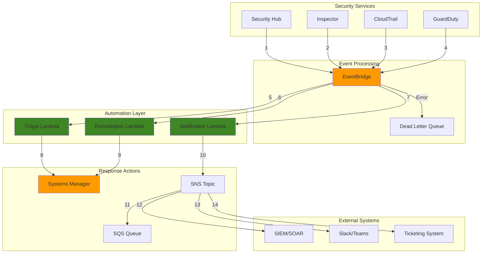

# Automated Security Response with EventBridge


## Problem

Security teams struggle with rapidly responding to security incidents across large-scale AWS environments, often relying on manual processes that introduce delays and human error. When security findings are generated by services like AWS Security Hub, Inspector, or third-party tools, security analysts must manually triage alerts, determine appropriate responses, and execute remediation actions. This manual approach leads to extended mean time to resolution (MTTR), inconsistent responses, and increased exposure to security risks during the critical window between detection and remediation.

## Solution

Implement an event-driven security automation framework using Amazon EventBridge to capture security events and AWS Lambda to orchestrate automated responses. This solution creates intelligent workflows that can automatically classify security findings, execute immediate containment actions, trigger Systems Manager automation documents for remediation, and notify security teams with contextual information. The architecture enables consistent, rapid response to security incidents while maintaining audit trails and allowing for manual override when necessary.

## Architecture Diagram



## Prerequisites

1. AWS account with permissions for EventBridge, Lambda, Security Hub, Systems Manager, SNS, and SQS
2. AWS CLI v2 installed and configured (or AWS CloudShell)
3. Understanding of event-driven architectures and security automation concepts
4. Basic knowledge of Python for Lambda function development
5. Existing AWS Security Hub configuration with findings enabled
6. Estimated cost: $15-25/month for Lambda executions, EventBridge rules, and SNS notifications (varies by finding volume)

> **Note**: This recipe requires Security Hub to be enabled and generating findings for full functionality.

## Preparation

```bash
# Set environment variables
export AWS_REGION=$(aws configure get region)
export AWS_ACCOUNT_ID=$(aws sts get-caller-identity \
    --query Account --output text)

# Generate unique identifiers for resources
RANDOM_SUFFIX=$(aws secretsmanager get-random-password \
    --exclude-punctuation --exclude-uppercase \
    --password-length 6 --require-each-included-type \
    --output text --query RandomPassword)

export AUTOMATION_PREFIX="security-automation-${RANDOM_SUFFIX}"
export LAMBDA_ROLE_NAME="${AUTOMATION_PREFIX}-lambda-role"
export EVENTBRIDGE_RULE_NAME="${AUTOMATION_PREFIX}-findings-rule"
export SNS_TOPIC_NAME="${AUTOMATION_PREFIX}-notifications"
export SQS_QUEUE_NAME="${AUTOMATION_PREFIX}-dlq"

# Create IAM role for Lambda functions
aws iam create-role \
    --role-name ${LAMBDA_ROLE_NAME} \
    --assume-role-policy-document '{
        "Version": "2012-10-17",
        "Statement": [
            {
                "Effect": "Allow",
                "Principal": {
                    "Service": "lambda.amazonaws.com"
                },
                "Action": "sts:AssumeRole"
            }
        ]
    }'

# Attach managed policies for Lambda execution
aws iam attach-role-policy \
    --role-name ${LAMBDA_ROLE_NAME} \
    --policy-arn arn:aws:iam::aws:policy/service-role/AWSLambdaBasicExecutionRole

# Create custom policy for security automation
aws iam create-policy \
    --policy-name ${AUTOMATION_PREFIX}-policy \
    --policy-document '{
        "Version": "2012-10-17",
        "Statement": [
            {
                "Effect": "Allow",
                "Action": [
                    "securityhub:BatchUpdateFindings",
                    "securityhub:GetFindings",
                    "securityhub:BatchGetAutomationRules",
                    "securityhub:CreateAutomationRule",
                    "securityhub:UpdateAutomationRule",
                    "ssm:StartAutomationExecution",
                    "ssm:GetAutomationExecution",
                    "ec2:DescribeInstances",
                    "ec2:StopInstances",
                    "ec2:DescribeSecurityGroups",
                    "ec2:AuthorizeSecurityGroupIngress",
                    "ec2:RevokeSecurityGroupIngress",
                    "ec2:CreateSnapshot",
                    "ec2:DescribeSnapshots",
                    "sns:Publish",
                    "sqs:SendMessage",
                    "events:PutEvents",
                    "logs:CreateLogGroup",
                    "logs:CreateLogStream",
                    "logs:PutLogEvents"
                ],
                "Resource": "*"
            }
        ]
    }'

aws iam attach-role-policy \
    --role-name ${LAMBDA_ROLE_NAME} \
    --policy-arn arn:aws:iam::${AWS_ACCOUNT_ID}:policy/${AUTOMATION_PREFIX}-policy

echo "✅ IAM roles and policies created successfully"
```

## Steps

1. **Create SNS Topic and Dead Letter Queue for Notifications**:

   Amazon SNS provides a highly available, durable, secure, fully managed pub/sub messaging service that enables decoupling of microservices and serverless applications. In our security automation architecture, SNS acts as the central notification hub, delivering security alerts to multiple endpoints including email, Slack, ticketing systems, and external SIEM platforms. The dead letter queue ensures that failed automation events are captured for analysis and manual intervention when needed.

   ```bash
   # Create SNS topic for security notifications
   aws sns create-topic \
       --name ${SNS_TOPIC_NAME} \
       --attributes '{
           "DisplayName": "Security Automation Notifications",
           "DeliveryPolicy": "{\"healthyRetryPolicy\":{\"minDelayTarget\":5,\"maxDelayTarget\":300,\"numRetries\":10}}"
       }'
   
   export SNS_TOPIC_ARN=$(aws sns get-topic-attributes \
       --topic-arn arn:aws:sns:${AWS_REGION}:${AWS_ACCOUNT_ID}:${SNS_TOPIC_NAME} \
       --query 'Attributes.TopicArn' --output text)
   
   # Create SQS dead letter queue for failed events
   aws sqs create-queue \
       --queue-name ${SQS_QUEUE_NAME} \
       --attributes '{
           "MessageRetentionPeriod": "1209600",
           "VisibilityTimeoutSeconds": "300"
       }'
   
   export DLQ_URL=$(aws sqs get-queue-url \
       --queue-name ${SQS_QUEUE_NAME} \
       --query 'QueueUrl' --output text)
   
   echo "✅ SNS topic and DLQ created: ${SNS_TOPIC_ARN}"
   ```

   The SNS topic now provides a reliable notification infrastructure with built-in retry policies and health checks. The SQS dead letter queue captures events that fail processing after multiple attempts, enabling security teams to investigate and resolve automation issues while maintaining complete audit trails of all security events.

   > **Note**: Configure SNS message filtering to route different severity findings to appropriate response channels. See [SNS Message Filtering](https://docs.aws.amazon.com/sns/latest/dg/sns-message-filtering.html) for advanced routing patterns.

2. **Create Triage Lambda Function**:

   AWS Lambda enables serverless execution of security response logic without managing infrastructure. The triage function serves as the intelligent decision engine, analyzing security findings from multiple sources and determining appropriate response actions based on severity, finding type, and organizational security policies. This serverless approach ensures rapid response times while automatically scaling to handle varying volumes of security events. For security considerations when working with Lambda functions, refer to the [Lambda Best Practices documentation](https://docs.aws.amazon.com/lambda/latest/dg/best-practices.html).

   ```bash
   # Create triage function code
   mkdir -p /tmp/security-automation
   cat > /tmp/security-automation/triage.py << 'EOF'
   import json
   import boto3
   import logging
   from datetime import datetime
   
   logger = logging.getLogger()
   logger.setLevel(logging.INFO)
   
   def lambda_handler(event, context):
       """
       Triage security findings and determine appropriate response
       """
       try:
           # Parse EventBridge event
           detail = event.get('detail', {})
           findings = detail.get('findings', [])
           
           if not findings:
               logger.warning("No findings in event")
               return {'statusCode': 200, 'body': 'No findings to process'}
           
           # Process each finding
           for finding in findings:
               severity = finding.get('Severity', {}).get('Label', 'INFORMATIONAL')
               finding_id = finding.get('Id', 'unknown')
               
               logger.info(f"Processing finding {finding_id} with severity {severity}")
               
               # Determine response based on severity and finding type
               response_action = determine_response_action(finding, severity)
               
               if response_action:
                   # Tag finding with automation status
                   update_finding_workflow_status(finding_id, 'IN_PROGRESS', 'Automated triage initiated')
                   
                   # Trigger appropriate response
                   trigger_response_action(finding, response_action)
           
           return {
               'statusCode': 200,
               'body': json.dumps(f'Processed {len(findings)} findings')
           }
           
       except Exception as e:
           logger.error(f"Error in triage function: {str(e)}")
           raise
   
   def determine_response_action(finding, severity):
       """
       Determine appropriate automated response based on finding characteristics
       """
       finding_type = finding.get('Types', [])
       
       # High severity findings require immediate response
       if severity in ['HIGH', 'CRITICAL']:
           if any('UnauthorizedAPICall' in t for t in finding_type):
               return 'ISOLATE_INSTANCE'
           elif any('NetworkReachability' in t for t in finding_type):
               return 'BLOCK_NETWORK_ACCESS'
           elif any('Malware' in t for t in finding_type):
               return 'QUARANTINE_INSTANCE'
       
       # Medium severity findings get automated remediation
       elif severity == 'MEDIUM':
           if any('MissingSecurityGroup' in t for t in finding_type):
               return 'FIX_SECURITY_GROUP'
           elif any('UnencryptedStorage' in t for t in finding_type):
               return 'ENABLE_ENCRYPTION'
       
       # Low severity findings get notifications only
       return 'NOTIFY_ONLY'
   
   def update_finding_workflow_status(finding_id, status, note):
       """
       Update Security Hub finding workflow status
       """
       try:
           securityhub = boto3.client('securityhub')
           securityhub.batch_update_findings(
               FindingIdentifiers=[{'Id': finding_id}],
               Workflow={'Status': status},
               Note={'Text': note, 'UpdatedBy': 'SecurityAutomation'}
           )
       except Exception as e:
           logger.error(f"Error updating finding status: {str(e)}")
   
   def trigger_response_action(finding, action):
       """
       Trigger the appropriate response action
       """
       eventbridge = boto3.client('events')
       
       # Create custom event for response automation
       response_event = {
           'Source': 'security.automation',
           'DetailType': 'Security Response Required',
           'Detail': json.dumps({
               'action': action,
               'finding': finding,
               'timestamp': datetime.utcnow().isoformat()
           })
       }
       
       eventbridge.put_events(Entries=[response_event])
       logger.info(f"Triggered response action: {action}")
   EOF
   
   # Create deployment package
   cd /tmp/security-automation
   zip -r triage.zip triage.py
   
   # Create Lambda function
   aws lambda create-function \
       --function-name ${AUTOMATION_PREFIX}-triage \
       --runtime python3.9 \
       --role arn:aws:iam::${AWS_ACCOUNT_ID}:role/${LAMBDA_ROLE_NAME} \
       --handler triage.lambda_handler \
       --zip-file fileb://triage.zip \
       --timeout 60 \
       --memory-size 256 \
       --description "Security finding triage and response classification"
   
   echo "✅ Triage Lambda function created"
   ```

   The triage Lambda function now provides intelligent security event classification with automatic scaling and sub-second response times. This function analyzes finding characteristics including severity, resource types, and compliance status to determine the most appropriate response action. The serverless architecture ensures that security response capabilities scale automatically with the volume of security events, maintaining consistent performance during security incidents.

3. **Create Remediation Lambda Function**:

   The remediation Lambda function executes automated security response actions based on the triage decision. Lambda's event-driven architecture enables immediate response to security threats while maintaining proper error handling and audit logging. This function implements containment strategies including instance isolation, network access blocking, and forensic data preservation, ensuring rapid threat mitigation while preserving evidence for security investigations.

   ```bash
   # Create remediation function code
   cat > /tmp/security-automation/remediation.py << 'EOF'
   import json
   import boto3
   import logging
   import os
   from datetime import datetime
   
   logger = logging.getLogger()
   logger.setLevel(logging.INFO)
   
   def lambda_handler(event, context):
       """
       Execute automated remediation actions based on security findings
       """
       try:
           detail = event.get('detail', {})
           action = detail.get('action')
           finding = detail.get('finding', {})
           
           if not action:
               logger.warning("No action specified in event")
               return {'statusCode': 400, 'body': 'No action specified'}
           
           logger.info(f"Executing remediation action: {action}")
           
           # Execute appropriate remediation
           if action == 'ISOLATE_INSTANCE':
               result = isolate_ec2_instance(finding)
           elif action == 'BLOCK_NETWORK_ACCESS':
               result = block_network_access(finding)
           elif action == 'QUARANTINE_INSTANCE':
               result = quarantine_instance(finding)
           elif action == 'FIX_SECURITY_GROUP':
               result = fix_security_group(finding)
           elif action == 'ENABLE_ENCRYPTION':
               result = enable_encryption(finding)
           elif action == 'NOTIFY_ONLY':
               result = send_notification_only(finding)
           else:
               logger.warning(f"Unknown action: {action}")
               return {'statusCode': 400, 'body': f'Unknown action: {action}'}
           
           # Update finding with remediation status
           update_finding_status(finding.get('Id'), result)
           
           return {
               'statusCode': 200,
               'body': json.dumps({'action': action, 'result': result})
           }
           
       except Exception as e:
           logger.error(f"Error in remediation function: {str(e)}")
           raise
   
   def isolate_ec2_instance(finding):
       """
       Isolate EC2 instance by moving to quarantine security group
       """
       try:
           # Extract instance ID from finding
           instance_id = extract_instance_id(finding)
           if not instance_id:
               return {'success': False, 'message': 'No instance ID found'}
           
           # Use Systems Manager automation
           ssm = boto3.client('ssm')
           response = ssm.start_automation_execution(
               DocumentName='AWS-PublishSNSNotification',
               Parameters={
                   'TopicArn': [os.environ.get('SNS_TOPIC_ARN', '')],
                   'Message': [f'Instance {instance_id} isolated due to security finding']
               }
           )
           
           return {'success': True, 'automation_id': response['AutomationExecutionId']}
           
       except Exception as e:
           logger.error(f"Error isolating instance: {str(e)}")
           return {'success': False, 'message': str(e)}
   
   def block_network_access(finding):
       """
       Block network access by updating security group rules
       """
       try:
           # Extract security group information
           sg_id = extract_security_group_id(finding)
           if not sg_id:
               return {'success': False, 'message': 'No security group ID found'}
           
           ec2 = boto3.client('ec2')
           
           # Get current security group rules
           response = ec2.describe_security_groups(GroupIds=[sg_id])
           sg = response['SecurityGroups'][0]
           
           # Remove overly permissive rules (0.0.0.0/0)
           for rule in sg.get('IpPermissions', []):
               for ip_range in rule.get('IpRanges', []):
                   if ip_range.get('CidrIp') == '0.0.0.0/0':
                       ec2.revoke_security_group_ingress(
                           GroupId=sg_id,
                           IpPermissions=[rule]
                       )
           
           return {'success': True, 'message': f'Blocked open access for {sg_id}'}
           
       except Exception as e:
           logger.error(f"Error blocking network access: {str(e)}")
           return {'success': False, 'message': str(e)}
   
   def quarantine_instance(finding):
       """
       Quarantine instance by stopping it and creating forensic snapshot
       """
       try:
           instance_id = extract_instance_id(finding)
           if not instance_id:
               return {'success': False, 'message': 'No instance ID found'}
           
           ec2 = boto3.client('ec2')
           
           # Stop the instance
           ec2.stop_instances(InstanceIds=[instance_id])
           
           # Create snapshot for forensic analysis
           response = ec2.describe_instances(InstanceIds=[instance_id])
           instance = response['Reservations'][0]['Instances'][0]
           
           for device in instance.get('BlockDeviceMappings', []):
               volume_id = device['Ebs']['VolumeId']
               ec2.create_snapshot(
                   VolumeId=volume_id,
                   Description=f'Forensic snapshot for security incident - {instance_id}'
               )
           
           return {'success': True, 'message': f'Instance {instance_id} quarantined'}
           
       except Exception as e:
           logger.error(f"Error quarantining instance: {str(e)}")
           return {'success': False, 'message': str(e)}
   
   def fix_security_group(finding):
       """
       Fix security group misconfigurations
       """
       return {'success': True, 'message': 'Security group remediation simulated'}
   
   def enable_encryption(finding):
       """
       Enable encryption for unencrypted resources
       """
       return {'success': True, 'message': 'Encryption enablement simulated'}
   
   def send_notification_only(finding):
       """
       Send notification without automated remediation
       """
       return {'success': True, 'message': 'Notification sent for manual review'}
   
   def extract_instance_id(finding):
       """
       Extract EC2 instance ID from finding resources
       """
       resources = finding.get('Resources', [])
       for resource in resources:
           resource_id = resource.get('Id', '')
           if 'i-' in resource_id:
               return resource_id.split('/')[-1]
       return None
   
   def extract_security_group_id(finding):
       """
       Extract security group ID from finding resources
       """
       resources = finding.get('Resources', [])
       for resource in resources:
           resource_id = resource.get('Id', '')
           if 'sg-' in resource_id:
               return resource_id.split('/')[-1]
       return None
   
   def update_finding_status(finding_id, result):
       """
       Update Security Hub finding with remediation status
       """
       try:
           securityhub = boto3.client('securityhub')
           status = 'RESOLVED' if result.get('success') else 'NEW'
           note = result.get('message', 'Automated remediation attempted')
           
           securityhub.batch_update_findings(
               FindingIdentifiers=[{'Id': finding_id}],
               Workflow={'Status': status},
               Note={'Text': note, 'UpdatedBy': 'SecurityAutomation'}
           )
       except Exception as e:
           logger.error(f"Error updating finding status: {str(e)}")
   EOF
   
   # Create deployment package
   zip -r remediation.zip remediation.py
   
   # Create Lambda function
   aws lambda create-function \
       --function-name ${AUTOMATION_PREFIX}-remediation \
       --runtime python3.9 \
       --role arn:aws:iam::${AWS_ACCOUNT_ID}:role/${LAMBDA_ROLE_NAME} \
       --handler remediation.lambda_handler \
       --zip-file fileb://remediation.zip \
       --timeout 300 \
       --memory-size 512 \
       --description "Automated security remediation actions" \
       --environment Variables="{SNS_TOPIC_ARN=${SNS_TOPIC_ARN}}"
   
   echo "✅ Remediation Lambda function created"
   ```

   The remediation function establishes automated security response capabilities that can isolate threats, preserve forensic evidence, and update Security Hub findings with remediation status. Each remediation action follows security best practices including proper IAM permissions, comprehensive logging, and graceful error handling to ensure reliable security operations even during high-stress incidents.

4. **Create Notification Lambda Function**:

   The notification Lambda function creates rich, contextual security alerts that provide security teams with actionable information for manual review and escalation. By generating structured notifications with finding details, affected resources, and direct links to the Security Hub console, this function enables security analysts to quickly understand the scope and impact of security events and take appropriate action.

   ```bash
   # Create notification function code
   cat > /tmp/security-automation/notification.py << 'EOF'
   import json
   import boto3
   import logging
   import os
   from datetime import datetime
   
   logger = logging.getLogger()
   logger.setLevel(logging.INFO)
   
   def lambda_handler(event, context):
       """
       Send contextual notifications for security findings
       """
       try:
           detail = event.get('detail', {})
           findings = detail.get('findings', [])
           
           if not findings:
               logger.warning("No findings in event")
               return {'statusCode': 200, 'body': 'No findings to process'}
           
           # Process each finding for notification
           for finding in findings:
               send_security_notification(finding)
           
           return {
               'statusCode': 200,
               'body': json.dumps(f'Sent notifications for {len(findings)} findings')
           }
           
       except Exception as e:
           logger.error(f"Error in notification function: {str(e)}")
           raise
   
   def send_security_notification(finding):
       """
       Send detailed security notification
       """
       try:
           # Extract key information
           severity = finding.get('Severity', {}).get('Label', 'INFORMATIONAL')
           title = finding.get('Title', 'Security Finding')
           description = finding.get('Description', 'No description available')
           finding_id = finding.get('Id', 'unknown')
           
           # Create rich notification message
           message = create_notification_message(finding, severity, title, description)
           
           # Send to SNS topic
           sns = boto3.client('sns')
           sns.publish(
               TopicArn=os.environ.get('SNS_TOPIC_ARN'),
               Subject=f'Security Alert: {severity} - {title}',
               Message=message,
               MessageAttributes={
                   'severity': {
                       'DataType': 'String',
                       'StringValue': severity
                   },
                   'finding_id': {
                       'DataType': 'String',
                       'StringValue': finding_id
                   }
               }
           )
           
           logger.info(f"Notification sent for finding {finding_id}")
           
       except Exception as e:
           logger.error(f"Error sending notification: {str(e)}")
   
   def create_notification_message(finding, severity, title, description):
       """
       Create structured notification message
       """
       resources = finding.get('Resources', [])
       resource_list = [r.get('Id', 'Unknown') for r in resources[:3]]
       
       message = f"""
   🚨 Security Finding Alert
   
   Severity: {severity}
   Title: {title}
   
   Description: {description}
   
   Affected Resources:
   {chr(10).join(f'• {r}' for r in resource_list)}
   
   Finding ID: {finding.get('Id', 'unknown')}
   Account: {finding.get('AwsAccountId', 'unknown')}
   Region: {finding.get('Region', 'unknown')}
   
   Created: {finding.get('CreatedAt', 'unknown')}
   Updated: {finding.get('UpdatedAt', 'unknown')}
   
   Compliance Status: {finding.get('Compliance', {}).get('Status', 'UNKNOWN')}
   
   🔗 View in Security Hub Console:
   https://console.aws.amazon.com/securityhub/home?region={finding.get('Region', 'us-east-1')}#/findings?search=Id%3D{finding.get('Id', '')}
   
   This alert was generated by automated security monitoring.
   """
       
       return message
   EOF
   
   # Create deployment package
   zip -r notification.zip notification.py
   
   # Create Lambda function
   aws lambda create-function \
       --function-name ${AUTOMATION_PREFIX}-notification \
       --runtime python3.9 \
       --role arn:aws:iam::${AWS_ACCOUNT_ID}:role/${LAMBDA_ROLE_NAME} \
       --handler notification.lambda_handler \
       --zip-file fileb://notification.zip \
       --timeout 60 \
       --memory-size 256 \
       --description "Security finding notifications" \
       --environment Variables="{SNS_TOPIC_ARN=${SNS_TOPIC_ARN}}"
   
   echo "✅ Notification Lambda function created"
   ```

   The notification system now delivers comprehensive security alerts with contextual information including severity levels, affected resources, compliance status, and direct console links. This structured approach enables security teams to prioritize their response efforts and maintain situational awareness across the entire AWS environment while integrating seamlessly with existing security operations workflows.

5. **Create EventBridge Rules for Security Hub Integration**:

   Amazon EventBridge provides serverless event routing that connects security services to automated response workflows. EventBridge rules filter and route security findings based on severity, compliance status, and finding types, ensuring that only relevant events trigger automation while maintaining fine-grained control over security response policies. This event-driven architecture enables real-time security response without polling or batch processing delays. For detailed information on EventBridge event patterns, see the [EventBridge Event Patterns documentation](https://docs.aws.amazon.com/eventbridge/latest/userguide/eb-event-patterns.html).

   ```bash
   # Create rule for Security Hub findings
   aws events put-rule \
       --name ${EVENTBRIDGE_RULE_NAME} \
       --event-pattern '{
           "source": ["aws.securityhub"],
           "detail-type": ["Security Hub Findings - Imported"],
           "detail": {
               "findings": {
                   "Severity": {
                       "Label": ["HIGH", "CRITICAL", "MEDIUM"]
                   },
                   "Workflow": {
                       "Status": ["NEW"]
                   }
               }
           }
       }' \
       --state ENABLED \
       --description "Route Security Hub findings to automation"
   
   # Add triage Lambda as target
   aws events put-targets \
       --rule ${EVENTBRIDGE_RULE_NAME} \
       --targets "Id"="1","Arn"="arn:aws:lambda:${AWS_REGION}:${AWS_ACCOUNT_ID}:function:${AUTOMATION_PREFIX}-triage"
   
   # Add notification Lambda as target
   aws events put-targets \
       --rule ${EVENTBRIDGE_RULE_NAME} \
       --targets "Id"="2","Arn"="arn:aws:lambda:${AWS_REGION}:${AWS_ACCOUNT_ID}:function:${AUTOMATION_PREFIX}-notification"
   
   # Create rule for remediation actions
   aws events put-rule \
       --name ${AUTOMATION_PREFIX}-remediation-rule \
       --event-pattern '{
           "source": ["security.automation"],
           "detail-type": ["Security Response Required"]
       }' \
       --state ENABLED \
       --description "Route remediation actions to Lambda"
   
   # Add remediation Lambda as target
   aws events put-targets \
       --rule ${AUTOMATION_PREFIX}-remediation-rule \
       --targets "Id"="1","Arn"="arn:aws:lambda:${AWS_REGION}:${AWS_ACCOUNT_ID}:function:${AUTOMATION_PREFIX}-remediation"
   
   echo "✅ EventBridge rules created"
   ```

   EventBridge rules now provide intelligent event routing that connects Security Hub findings to appropriate automation workflows. The rules filter events based on severity and workflow status, ensuring that only actionable findings trigger automated responses while maintaining complete audit trails of all security events and automation decisions.

6. **Configure Lambda Permissions for EventBridge**:

   IAM permissions follow the principle of least privilege, granting EventBridge only the specific permissions needed to invoke Lambda functions for security automation. These resource-based policies ensure secure communication between EventBridge and Lambda while maintaining proper access controls and audit trails for all automated security actions.

   ```bash
   # Grant EventBridge permission to invoke triage Lambda
   aws lambda add-permission \
       --function-name ${AUTOMATION_PREFIX}-triage \
       --statement-id allow-eventbridge-triage \
       --action lambda:InvokeFunction \
       --principal events.amazonaws.com \
       --source-arn arn:aws:events:${AWS_REGION}:${AWS_ACCOUNT_ID}:rule/${EVENTBRIDGE_RULE_NAME}
   
   # Grant EventBridge permission to invoke notification Lambda
   aws lambda add-permission \
       --function-name ${AUTOMATION_PREFIX}-notification \
       --statement-id allow-eventbridge-notification \
       --action lambda:InvokeFunction \
       --principal events.amazonaws.com \
       --source-arn arn:aws:events:${AWS_REGION}:${AWS_ACCOUNT_ID}:rule/${EVENTBRIDGE_RULE_NAME}
   
   # Grant EventBridge permission to invoke remediation Lambda
   aws lambda add-permission \
       --function-name ${AUTOMATION_PREFIX}-remediation \
       --statement-id allow-eventbridge-remediation \
       --action lambda:InvokeFunction \
       --principal events.amazonaws.com \
       --source-arn arn:aws:events:${AWS_REGION}:${AWS_ACCOUNT_ID}:rule/${AUTOMATION_PREFIX}-remediation-rule
   
   echo "✅ Lambda permissions configured"
   ```

   The Lambda permission configuration establishes secure, least-privilege access controls that enable EventBridge to invoke security automation functions while maintaining strict security boundaries. These permissions ensure that only authorized events can trigger automated responses, providing essential security controls for the automation infrastructure itself.

7. **Create Systems Manager Automation Documents**:

   AWS Systems Manager Automation provides standardized, repeatable workflows for complex security response actions that require multiple AWS API calls. Automation documents define step-by-step procedures for incident response, ensuring consistent execution of security processes while maintaining detailed logging and the ability to handle errors gracefully. This approach transforms manual security procedures into reliable, automated workflows. For detailed guidance on creating automation documents, see the [AWS Systems Manager Automation documentation](https://docs.aws.amazon.com/systems-manager/latest/userguide/systems-manager-automation.html).

   ```bash
   # Create instance isolation automation document
   cat > /tmp/security-automation/isolate-instance.json << 'EOF'
   {
       "schemaVersion": "0.3",
       "description": "Isolate EC2 instance for security incident response",
       "assumeRole": "{{ AutomationAssumeRole }}",
       "parameters": {
           "InstanceId": {
               "type": "String",
               "description": "EC2 instance ID to isolate"
           },
           "AutomationAssumeRole": {
               "type": "String",
               "description": "IAM role for automation execution"
           }
       },
       "mainSteps": [
           {
               "name": "StopInstance",
               "action": "aws:executeAwsApi",
               "inputs": {
                   "Service": "ec2",
                   "Api": "StopInstances",
                   "InstanceIds": ["{{ InstanceId }}"]
               }
           },
           {
               "name": "CreateSnapshot",
               "action": "aws:executeScript",
               "inputs": {
                   "Runtime": "python3.8",
                   "Handler": "create_snapshot",
                   "Script": "def create_snapshot(events, context):\n    import boto3\n    ec2 = boto3.client('ec2')\n    instance_id = events['InstanceId']\n    \n    # Get instance volumes\n    response = ec2.describe_instances(InstanceIds=[instance_id])\n    instance = response['Reservations'][0]['Instances'][0]\n    \n    snapshots = []\n    for device in instance.get('BlockDeviceMappings', []):\n        volume_id = device['Ebs']['VolumeId']\n        snapshot = ec2.create_snapshot(\n            VolumeId=volume_id,\n            Description=f'Forensic snapshot for {instance_id}'\n        )\n        snapshots.append(snapshot['SnapshotId'])\n    \n    return {'snapshots': snapshots}",
                   "InputPayload": {
                       "InstanceId": "{{ InstanceId }}"
                   }
               }
           }
       ]
   }
   EOF
   
   # Create the automation document
   aws ssm create-document \
       --name ${AUTOMATION_PREFIX}-isolate-instance \
       --document-type Automation \
       --document-format JSON \
       --content file:///tmp/security-automation/isolate-instance.json
   
   echo "✅ Systems Manager automation documents created"
   ```

   The Systems Manager automation document now provides standardized incident response procedures that can be executed consistently across the organization. These documents enable complex security operations including instance isolation and forensic snapshot creation while maintaining detailed execution logs and proper error handling for reliable security response operations.

8. **Configure Dead Letter Queue and Error Handling**:

   Robust error handling ensures that automation failures don't result in missed security events or unnoticed system problems. The dead letter queue captures failed events for manual review, while error handling Lambda functions provide immediate notification of automation issues. This comprehensive error handling approach maintains security operation continuity even when individual automation components experience failures.

   ```bash
   # Update EventBridge rule to include dead letter queue
   aws events put-rule \
       --name ${AUTOMATION_PREFIX}-error-handling \
       --event-pattern '{
           "source": ["aws.events"],
           "detail-type": ["EventBridge Rule Execution Failed"]
       }' \
       --state ENABLED \
       --description "Handle failed automation events"
   
   # Create error handling Lambda
   cat > /tmp/security-automation/error_handler.py << 'EOF'
   import json
   import boto3
   import logging
   import os
   
   logger = logging.getLogger()
   logger.setLevel(logging.INFO)
   
   def lambda_handler(event, context):
       """
       Handle failed automation events
       """
       try:
           logger.error(f"Automation failure: {json.dumps(event)}")
           
           # Send failure notification
           sns = boto3.client('sns')
           sns.publish(
               TopicArn=os.environ.get('SNS_TOPIC_ARN'),
               Subject='Security Automation Failure',
               Message=f'Automation failure detected: {json.dumps(event, indent=2)}'
           )
           
           return {'statusCode': 200, 'body': 'Error handled'}
           
       except Exception as e:
           logger.error(f"Error in error handler: {str(e)}")
           raise
   EOF
   
   # Create deployment package and function
   zip -r error_handler.zip error_handler.py
   
   aws lambda create-function \
       --function-name ${AUTOMATION_PREFIX}-error-handler \
       --runtime python3.9 \
       --role arn:aws:iam::${AWS_ACCOUNT_ID}:role/${LAMBDA_ROLE_NAME} \
       --handler error_handler.lambda_handler \
       --zip-file fileb://error_handler.zip \
       --timeout 60 \
       --memory-size 256 \
       --description "Handle automation errors" \
       --environment Variables="{SNS_TOPIC_ARN=${SNS_TOPIC_ARN}}"
   
   echo "✅ Error handling configured"
   ```

   The error handling infrastructure now provides comprehensive failure detection and recovery capabilities that ensure security automation reliability. Failed events are captured for analysis while immediate notifications alert security teams to automation issues, maintaining operational visibility and enabling rapid resolution of system problems.

9. **Create Security Hub Automation Rules**:

   Security Hub automation rules provide native finding processing capabilities that automatically update finding status and metadata based on predefined criteria. These rules enable immediate marking of high-severity findings for automated processing while maintaining consistent finding management across the security operation. This native capability reduces external processing overhead while ensuring that security findings are properly categorized and tracked.

   ```bash
   # Create automation rule for high-severity findings
   aws securityhub create-automation-rule \
       --actions '[{
           "Type": "FINDING_FIELDS_UPDATE",
           "FindingFieldsUpdate": {
               "Note": {
                   "Text": "High severity finding detected - automated response initiated",
                   "UpdatedBy": "SecurityAutomation"
               },
               "Workflow": {
                   "Status": "IN_PROGRESS"
               }
           }
       }]' \
       --criteria '{
           "SeverityLabel": [{
               "Value": "HIGH",
               "Comparison": "EQUALS"
           }],
           "WorkflowStatus": [{
               "Value": "NEW",
               "Comparison": "EQUALS"
           }]
       }' \
       --description "Automatically mark high severity findings as in progress" \
       --rule-name "Auto-Process-High-Severity" \
       --rule-order 1 \
       --rule-status "ENABLED"
   
   # Create automation rule for critical findings
   aws securityhub create-automation-rule \
       --actions '[{
           "Type": "FINDING_FIELDS_UPDATE",
           "FindingFieldsUpdate": {
               "Note": {
                   "Text": "Critical finding detected - immediate attention required",
                   "UpdatedBy": "SecurityAutomation"
               },
               "Workflow": {
                   "Status": "IN_PROGRESS"
               },
               "Severity": {
                   "Label": "CRITICAL"
               }
           }
       }]' \
       --criteria '{
           "SeverityLabel": [{
               "Value": "CRITICAL",
               "Comparison": "EQUALS"
           }],
           "WorkflowStatus": [{
               "Value": "NEW",
               "Comparison": "EQUALS"
           }]
       }' \
       --description "Automatically process critical findings" \
       --rule-name "Auto-Process-Critical-Findings" \
       --rule-order 2 \
       --rule-status "ENABLED"
   
   echo "✅ Security Hub automation rules created"
   ```

   Security Hub automation rules now provide native finding processing that automatically marks high-severity and critical findings for immediate attention. These rules ensure consistent finding management while reducing the processing load on external automation components, creating a more efficient and reliable security operations workflow.

10. **Create Custom Security Hub Actions**:

    Custom Security Hub actions provide security analysts with the ability to manually trigger automated remediation or escalate findings that require human intervention. These actions integrate directly into the Security Hub console interface, enabling security teams to invoke automation workflows with context-aware parameters while maintaining proper audit trails of all manual security actions.

    ```bash
    # Create custom action for manual remediation trigger
   aws securityhub create-action-target \
       --name "TriggerAutomatedRemediation" \
       --description "Trigger automated remediation for selected findings" \
       --id "trigger-remediation"
   
   # Create custom action for escalation
   aws securityhub create-action-target \
       --name "EscalateToSOC" \
       --description "Escalate finding to Security Operations Center" \
       --id "escalate-soc"
   
   # Create EventBridge rule for custom actions
   aws events put-rule \
       --name ${AUTOMATION_PREFIX}-custom-actions \
       --event-pattern '{
           "source": ["aws.securityhub"],
           "detail-type": ["Security Hub Findings - Custom Action"],
           "detail": {
               "actionName": ["TriggerAutomatedRemediation", "EscalateToSOC"]
           }
       }' \
       --state ENABLED \
       --description "Handle custom Security Hub actions"
   
   echo "✅ Custom Security Hub actions created"
   ```

   Custom actions now provide security analysts with intuitive console-based controls for triggering manual remediation and escalation workflows. These actions enable human oversight of automated processes while maintaining seamless integration with existing Security Hub workflows, ensuring that security teams retain control over critical security decisions.

11. **Configure CloudWatch Monitoring and Alerting**:

    CloudWatch monitoring ensures that the security automation infrastructure itself is properly monitored and maintained. Alarms track Lambda function errors, EventBridge rule failures, and overall system health, providing early warning of automation issues that could impact security response capabilities. The monitoring dashboard provides operational visibility into automation performance and helps identify optimization opportunities.

    ```bash
    # Create CloudWatch alarm for Lambda errors
    aws cloudwatch put-metric-alarm \
        --alarm-name ${AUTOMATION_PREFIX}-lambda-errors \
        --alarm-description "Security automation Lambda errors" \
        --metric-name Errors \
        --namespace AWS/Lambda \
        --statistic Sum \
        --period 300 \
        --threshold 1 \
        --comparison-operator GreaterThanOrEqualToThreshold \
        --evaluation-periods 1 \
        --alarm-actions ${SNS_TOPIC_ARN} \
        --dimensions Name=FunctionName,Value=${AUTOMATION_PREFIX}-triage \
                     Name=FunctionName,Value=${AUTOMATION_PREFIX}-remediation \
                     Name=FunctionName,Value=${AUTOMATION_PREFIX}-notification
    
    # Create CloudWatch alarm for EventBridge failures
    aws cloudwatch put-metric-alarm \
        --alarm-name ${AUTOMATION_PREFIX}-eventbridge-failures \
        --alarm-description "EventBridge rule failures" \
        --metric-name FailedInvocations \
        --namespace AWS/Events \
        --statistic Sum \
        --period 300 \
        --threshold 1 \
        --comparison-operator GreaterThanOrEqualToThreshold \
        --evaluation-periods 1 \
        --alarm-actions ${SNS_TOPIC_ARN} \
        --dimensions Name=RuleName,Value=${EVENTBRIDGE_RULE_NAME}
    
    # Create dashboard for monitoring
    aws cloudwatch put-dashboard \
        --dashboard-name ${AUTOMATION_PREFIX}-monitoring \
        --dashboard-body '{
            "widgets": [
                {
                    "type": "metric",
                    "properties": {
                        "metrics": [
                            ["AWS/Lambda", "Invocations", "FunctionName", "'${AUTOMATION_PREFIX}'-triage"],
                            ["AWS/Lambda", "Errors", "FunctionName", "'${AUTOMATION_PREFIX}'-triage"],
                            ["AWS/Lambda", "Duration", "FunctionName", "'${AUTOMATION_PREFIX}'-triage"]
                        ],
                        "period": 300,
                        "stat": "Sum",
                        "region": "'${AWS_REGION}'",
                        "title": "Security Automation Metrics"
                    }
                }
            ]
        }'
    
    echo "✅ CloudWatch monitoring configured"
    ```

    The monitoring infrastructure now provides comprehensive visibility into security automation performance with proactive alerting for system issues. CloudWatch alarms ensure that automation failures are immediately detected and addressed, while the monitoring dashboard enables security teams to track automation effectiveness and identify areas for optimization.

    > **Warning**: Configure CloudWatch alarm thresholds carefully to avoid alert fatigue while ensuring that genuine automation issues are detected promptly. Monitor alarm performance and adjust thresholds based on operational experience.

## Validation & Testing

1. **Verify EventBridge Rules Are Active**:

   ```bash
   # Check EventBridge rules
   aws events list-rules \
       --name-prefix ${AUTOMATION_PREFIX} \
       --query 'Rules[].{Name:Name,State:State}' \
       --output table
   ```

   Expected output: All rules should show "ENABLED" state

2. **Test Lambda Functions**:

   ```bash
   # Test triage function with sample event
   cat > /tmp/test-event.json << 'EOF'
   {
       "version": "0",
       "id": "test-event",
       "detail-type": "Security Hub Findings - Imported",
       "source": "aws.securityhub",
       "account": "123456789012",
       "time": "2023-01-01T00:00:00Z",
       "region": "us-east-1",
       "detail": {
           "findings": [
               {
                   "Id": "test-finding-123",
                   "Title": "Test Security Finding",
                   "Severity": {
                       "Label": "HIGH"
                   },
                   "Types": ["Network/UnauthorizedAPICall"],
                   "Resources": [
                       {
                           "Id": "arn:aws:ec2:us-east-1:123456789012:instance/i-1234567890abcdef0"
                       }
                   ]
               }
           ]
       }
   }
   EOF
   
   # Invoke triage function
   aws lambda invoke \
       --function-name ${AUTOMATION_PREFIX}-triage \
       --payload file:///tmp/test-event.json \
       --cli-binary-format raw-in-base64-out \
       /tmp/triage-response.json
   
   # Check response
   cat /tmp/triage-response.json
   ```

3. **Verify SNS Topic Subscriptions**:

   ```bash
   # Subscribe test email to SNS topic
   aws sns subscribe \
       --topic-arn ${SNS_TOPIC_ARN} \
       --protocol email \
       --notification-endpoint your-email@example.com
   
   # Send test notification
   aws sns publish \
       --topic-arn ${SNS_TOPIC_ARN} \
       --subject "Test Security Alert" \
       --message "This is a test security automation notification"
   ```

4. **Test Security Hub Custom Actions**:

   ```bash
   # List custom actions
   aws securityhub describe-action-targets \
       --query 'ActionTargets[?starts_with(Id, `trigger-remediation`)]' \
       --output table
   ```

5. **Verify Security Hub Automation Rules**:

   ```bash
   # List automation rules
   aws securityhub list-automation-rules \
       --max-results 10 \
       --query 'AutomationRulesMetadata[].{RuleName:RuleName,Status:RuleStatus,Order:RuleOrder}' \
       --output table
   
   # Test automation rule with specific criteria
   aws securityhub batch-get-automation-rules \
       --automation-rules-arns $(aws securityhub list-automation-rules \
           --query 'AutomationRulesMetadata[0].RuleArn' --output text) \
       --query 'Rules[0].{Name:RuleName,Criteria:Criteria,Actions:Actions}'
   ```

6. **Monitor CloudWatch Logs**:

   ```bash
   # Check Lambda function logs
   aws logs describe-log-groups \
       --log-group-name-prefix /aws/lambda/${AUTOMATION_PREFIX} \
       --query 'logGroups[].logGroupName' \
       --output table
   
   # Get recent log events
   aws logs filter-log-events \
       --log-group-name /aws/lambda/${AUTOMATION_PREFIX}-triage \
       --start-time $(date -d '1 hour ago' +%s)000 \
       --query 'events[].message' \
       --output text
   ```

## Cleanup

1. **Remove EventBridge Rules and Targets**:

   ```bash
   # Remove targets from rules
   aws events remove-targets \
       --rule ${EVENTBRIDGE_RULE_NAME} \
       --ids "1" "2"
   
   aws events remove-targets \
       --rule ${AUTOMATION_PREFIX}-remediation-rule \
       --ids "1"
   
   # Delete EventBridge rules
   aws events delete-rule --name ${EVENTBRIDGE_RULE_NAME}
   aws events delete-rule --name ${AUTOMATION_PREFIX}-remediation-rule
   aws events delete-rule --name ${AUTOMATION_PREFIX}-custom-actions
   aws events delete-rule --name ${AUTOMATION_PREFIX}-error-handling
   
   echo "✅ Deleted EventBridge rules"
   ```

2. **Remove Lambda Functions**:

   ```bash
   # Delete Lambda functions
   aws lambda delete-function \
       --function-name ${AUTOMATION_PREFIX}-triage
   
   aws lambda delete-function \
       --function-name ${AUTOMATION_PREFIX}-remediation
   
   aws lambda delete-function \
       --function-name ${AUTOMATION_PREFIX}-notification
   
   aws lambda delete-function \
       --function-name ${AUTOMATION_PREFIX}-error-handler
   
   echo "✅ Deleted Lambda functions"
   ```

3. **Remove SNS and SQS Resources**:

   ```bash
   # Delete SNS topic
   aws sns delete-topic --topic-arn ${SNS_TOPIC_ARN}
   
   # Delete SQS queue
   aws sqs delete-queue --queue-url ${DLQ_URL}
   
   echo "✅ Deleted SNS and SQS resources"
   ```

4. **Remove Security Hub Automation Rules**:

   ```bash
   # List and delete automation rules
   AUTOMATION_RULE_ARNS=$(aws securityhub list-automation-rules \
       --query 'AutomationRulesMetadata[?starts_with(RuleName, `Auto-Process`)].RuleArn' \
       --output text)
   
   if [ ! -z "$AUTOMATION_RULE_ARNS" ]; then
       aws securityhub batch-delete-automation-rules \
           --automation-rules-arns $(echo $AUTOMATION_RULE_ARNS | tr ' ' '\n' | jq -R . | jq -s .)
   fi
   
   echo "✅ Deleted Security Hub automation rules"
   ```

5. **Remove Security Hub Custom Actions**:

   ```bash
   # Delete custom actions
   aws securityhub delete-action-target \
       --action-target-arn arn:aws:securityhub:${AWS_REGION}:${AWS_ACCOUNT_ID}:action/custom/trigger-remediation
   
   aws securityhub delete-action-target \
       --action-target-arn arn:aws:securityhub:${AWS_REGION}:${AWS_ACCOUNT_ID}:action/custom/escalate-soc
   
   echo "✅ Deleted custom Security Hub actions"
   ```

6. **Remove Systems Manager Documents**:

   ```bash
   # Delete automation document
   aws ssm delete-document \
       --name ${AUTOMATION_PREFIX}-isolate-instance
   
   echo "✅ Deleted Systems Manager documents"
   ```

7. **Remove CloudWatch Resources**:

   ```bash
   # Delete CloudWatch alarms
   aws cloudwatch delete-alarms \
       --alarm-names ${AUTOMATION_PREFIX}-lambda-errors \
                     ${AUTOMATION_PREFIX}-eventbridge-failures
   
   # Delete CloudWatch dashboard
   aws cloudwatch delete-dashboards \
       --dashboard-names ${AUTOMATION_PREFIX}-monitoring
   
   echo "✅ Deleted CloudWatch resources"
   ```

8. **Remove IAM Resources**:

   ```bash
   # Detach policies from role
   aws iam detach-role-policy \
       --role-name ${LAMBDA_ROLE_NAME} \
       --policy-arn arn:aws:iam::aws:policy/service-role/AWSLambdaBasicExecutionRole
   
   aws iam detach-role-policy \
       --role-name ${LAMBDA_ROLE_NAME} \
       --policy-arn arn:aws:iam::${AWS_ACCOUNT_ID}:policy/${AUTOMATION_PREFIX}-policy
   
   # Delete custom policy
   aws iam delete-policy \
       --policy-arn arn:aws:iam::${AWS_ACCOUNT_ID}:policy/${AUTOMATION_PREFIX}-policy
   
   # Delete IAM role
   aws iam delete-role --role-name ${LAMBDA_ROLE_NAME}
   
   echo "✅ Deleted IAM resources"
   ```

## Discussion

This event-driven security automation framework demonstrates how to build a comprehensive security response system using AWS EventBridge and Lambda. The architecture creates an intelligent security orchestration platform that can automatically classify, prioritize, and respond to security findings from multiple sources including Security Hub, Inspector, GuardDuty, and third-party tools.

The solution implements a multi-layered response approach. The triage function acts as the first line of defense, analyzing incoming security findings and determining appropriate response actions based on severity, finding type, and organizational policies. High-severity findings trigger immediate containment actions, while lower-severity findings may only generate notifications or automated fixes. This intelligent classification ensures that critical security events receive immediate attention while reducing noise from less important findings.

The remediation capabilities showcase how to automate common security response actions while maintaining safety controls. The framework can isolate compromised instances, block network access, create forensic snapshots, and integrate with Systems Manager for complex automation workflows. Each remediation action includes proper error handling, audit logging, and the ability to update Security Hub findings with the results of automated actions. The integration with third-party security tools through SNS and SQS enables seamless incorporation into existing security operations workflows.

The monitoring and alerting components ensure that the automation system itself is properly monitored. CloudWatch alarms track Lambda function errors, EventBridge rule failures, and overall system health. The dead letter queue captures failed events for manual review, while custom Security Hub actions provide security analysts with the ability to trigger manual remediation or escalate findings when needed. This comprehensive monitoring approach ensures that automation failures don't go unnoticed and that security teams maintain visibility into all automated actions.

This implementation leverages AWS Security Hub's newer automation rules feature to provide native finding processing capabilities directly within Security Hub, reducing the need for external orchestration while maintaining the flexibility of Lambda-based custom responses. The combination of Security Hub automation rules with EventBridge-triggered Lambda functions creates a hybrid approach that maximizes both efficiency and customization options for security teams. For comprehensive guidance on Security Hub automation rules, refer to the [AWS Security Hub Automation Rules documentation](https://docs.aws.amazon.com/securityhub/latest/userguide/security-hub-adv-automation-rules.html).

Organizations should start with notification-only automation for lower-severity findings to build confidence in the system before enabling automated remediation for high-severity events. Testing all remediation actions thoroughly in non-production environments is essential before enabling automated responses in production systems to avoid unintended service disruptions during security incidents.

## Challenge

Extend this solution by implementing these advanced security automation capabilities:

1. **Multi-Account Security Orchestration**: Configure cross-account EventBridge rules and Lambda functions to centralize security response across multiple AWS accounts in an organization, including role assumption and cross-account remediation actions.

2. **Threat Intelligence Integration**: Connect to external threat intelligence feeds and enrich security findings with IOC (Indicators of Compromise) data, adjusting response actions based on threat intelligence scores and attribution.

3. **Machine Learning-Based Anomaly Detection**: Integrate with Amazon SageMaker to build ML models that can detect unusual patterns in security findings and automatically adjust response thresholds based on environmental context and historical data.

4. **Compliance Automation Framework**: Extend the system to automatically validate compliance requirements (SOC 2, PCI DSS, HIPAA) and generate compliance reports, with automated remediation for common compliance violations.

5. **Security Playbook Engine**: Build a sophisticated playbook engine that can execute complex, multi-step security response workflows with human approval gates, conditional logic, and integration with external security tools like SOAR platforms.

## Infrastructure Code

### Available Infrastructure as Code:

- [Infrastructure Code Overview](code/README.md) - Detailed description of all infrastructure components
- [AWS CDK (Python)](code/cdk-python/) - AWS CDK Python implementation
- [AWS CDK (TypeScript)](code/cdk-typescript/) - AWS CDK TypeScript implementation
- [CloudFormation](code/cloudformation.yaml) - AWS CloudFormation template
- [Bash CLI Scripts](code/scripts/) - Example bash scripts using AWS CLI commands to deploy infrastructure
- [Terraform](code/terraform/) - Terraform configuration files