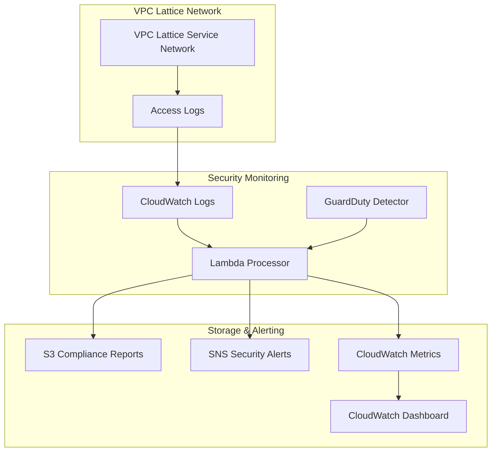

# Security Compliance Auditing with VPC Lattice and GuardDuty - Terraform

This directory contains Terraform Infrastructure as Code (IaC) for deploying a comprehensive security compliance auditing system that monitors VPC Lattice access logs and correlates them with Amazon GuardDuty threat intelligence.

## Overview

The infrastructure deploys:

- **Amazon GuardDuty**: Intelligent threat detection service
- **AWS Lambda**: Function to process and analyze VPC Lattice access logs
- **Amazon S3**: Encrypted storage for compliance reports and audit trails
- **Amazon SNS**: Real-time security alert notifications
- **Amazon CloudWatch**: Centralized logging, metrics, and monitoring dashboard
- **VPC Lattice**: Optional demo service network for testing
- **IAM Roles**: Least-privilege security roles for all components

## Architecture



## Prerequisites

- **Terraform**: Version >= 1.0
- **AWS CLI**: Configured with appropriate permissions
- **AWS Account**: With permissions for VPC Lattice, GuardDuty, Lambda, CloudWatch, S3, SNS, and IAM
- **Python**: Version 3.9+ (for Lambda function)

### Required AWS Permissions

The deploying user/role needs permissions for:
- `guardduty:*`
- `lambda:*`
- `iam:*`
- `s3:*`
- `sns:*`
- `logs:*`
- `cloudwatch:*`
- `vpc-lattice:*` (if creating demo resources)

## Quick Start

### 1. Clone and Navigate

```bash
cd aws/security-compliance-auditing-lattice-guardduty/code/terraform/
```

### 2. Initialize Terraform

```bash
terraform init
```

### 3. Configure Variables

Create a `terraform.tfvars` file:

```hcl
# Basic Configuration
aws_region         = "us-east-1"
environment        = "prod"
notification_email = "security-team@yourcompany.com"

# Security Configuration
guardduty_finding_frequency = "FIFTEEN_MINUTES"
error_rate_threshold        = 5

# Optional: Disable demo VPC Lattice for production
create_demo_vpc_lattice = false
```

### 4. Plan and Apply

```bash
# Review the deployment plan
terraform plan

# Deploy the infrastructure
terraform apply
```

### 5. Confirm Email Subscription

If you provided a `notification_email`, check your email and confirm the SNS subscription to receive security alerts.

## Configuration Options

### Core Variables

| Variable | Description | Default | Required |
|----------|-------------|---------|----------|
| `aws_region` | AWS region for deployment | `us-east-1` | No |
| `environment` | Environment name (dev/staging/prod) | `dev` | No |
| `notification_email` | Email for security alerts | `""` | No |

### Security Variables

| Variable | Description | Default |
|----------|-------------|---------|
| `guardduty_finding_frequency` | GuardDuty finding frequency | `FIFTEEN_MINUTES` |
| `error_rate_threshold` | CloudWatch alarm threshold | `10` |
| `log_retention_days` | Log retention period | `90` |

### Lambda Configuration

| Variable | Description | Default |
|----------|-------------|---------|
| `lambda_runtime` | Python runtime version | `python3.12` |
| `lambda_timeout` | Function timeout (seconds) | `60` |
| `lambda_memory_size` | Memory allocation (MB) | `256` |
| `lambda_log_level` | Log level (DEBUG/INFO/WARNING/ERROR) | `INFO` |

### Feature Flags

| Variable | Description | Default |
|----------|-------------|---------|
| `create_demo_vpc_lattice` | Create demo VPC Lattice resources | `true` |
| `enable_enhanced_monitoring` | Enable additional CloudWatch alarms | `true` |
| `s3_lifecycle_enabled` | Enable S3 lifecycle policies | `true` |

## Outputs

After deployment, Terraform provides useful outputs:

```bash
# View all outputs
terraform output

# Specific outputs
terraform output s3_bucket_name
terraform output cloudwatch_dashboard_url
terraform output sns_topic_arn
terraform output guardduty_detector_id
```

### Key Outputs

- **CloudWatch Dashboard URL**: Direct link to security monitoring dashboard
- **S3 Bucket Name**: Where compliance reports are stored
- **GuardDuty Detector ID**: For manual GuardDuty operations
- **Integration Guide**: Instructions for connecting existing VPC Lattice networks

## Post-Deployment Setup

### 1. Integrate Existing VPC Lattice Networks

To monitor existing VPC Lattice service networks, configure access logging:

```bash
# Get the log group ARN from Terraform output
LOG_GROUP_ARN=$(terraform output -raw cloudwatch_log_group_arn)

# Configure existing service network logging
aws vpc-lattice create-access-log-subscription \
    --resource-identifier <your-service-network-id> \
    --destination-arn $LOG_GROUP_ARN
```

### 2. Test the System

```bash
# Test Lambda function
aws lambda invoke \
    --function-name $(terraform output -raw lambda_function_name) \
    --payload file://test-payload.json \
    response.json

# View Lambda logs
aws logs tail $(terraform output -raw lambda_log_group_name) --follow

# Check custom metrics
aws cloudwatch get-metric-statistics \
    --namespace Security/VPCLattice \
    --metric-name RequestCount \
    --start-time $(date -u -d '1 hour ago' '+%Y-%m-%dT%H:%M:%SZ') \
    --end-time $(date -u '+%Y-%m-%dT%H:%M:%SZ') \
    --period 300 \
    --statistics Sum
```

### 3. Access Monitoring Dashboard

```bash
# Open the CloudWatch dashboard
echo "Dashboard URL: $(terraform output cloudwatch_dashboard_url)"
```

## Security Features

### Encryption

- **S3**: Server-side encryption with AES-256
- **SNS**: Encryption at rest with AWS managed keys
- **CloudWatch Logs**: Optional KMS encryption (configure via variable)
- **Lambda**: Environment variables encrypted at rest

### IAM Security

- **Least Privilege**: Lambda role follows principle of least privilege
- **Resource-Specific Permissions**: Policies restricted to specific resources
- **No Wildcard Permissions**: All permissions are explicitly scoped

### Network Security

- **VPC Configuration**: Optional VPC deployment for Lambda
- **Security Groups**: Configurable security group rules
- **Private Subnets**: Support for private subnet deployment

## Monitoring and Alerting

### CloudWatch Alarms

The infrastructure creates several CloudWatch alarms:

1. **High Error Rate**: Triggers when VPC Lattice error count exceeds threshold
2. **Lambda Errors**: Monitors Lambda function execution errors
3. **GuardDuty Findings**: (Optional) Custom alarm for GuardDuty findings

### Custom Metrics

The Lambda function publishes custom metrics to the `Security/VPCLattice` namespace:

- `RequestCount`: Total number of processed requests
- `ErrorCount`: Number of error responses (4xx/5xx)
- `AverageResponseTime`: Average response time in milliseconds
- `ProcessingErrors`: Number of log processing errors

### Compliance Reports

Compliance reports are automatically generated and stored in S3 with:

- **Organized Structure**: `compliance-reports/YYYY/MM/DD/HH/`
- **Lifecycle Policies**: Automatic archiving to Glacier and Deep Archive
- **Retention**: 7-year default retention for regulatory compliance
- **Encryption**: AES-256 server-side encryption

## Troubleshooting

### Common Issues

#### 1. Lambda Function Errors

```bash
# Check Lambda logs
aws logs tail /aws/lambda/security-compliance-processor --follow

# Check Lambda metrics
aws cloudwatch get-metric-statistics \
    --namespace AWS/Lambda \
    --metric-name Errors \
    --dimensions Name=FunctionName,Value=security-compliance-processor \
    --start-time $(date -u -d '1 hour ago' '+%Y-%m-%dT%H:%M:%SZ') \
    --end-time $(date -u '+%Y-%m-%dT%H:%M:%SZ') \
    --period 300 \
    --statistics Sum
```

#### 2. GuardDuty Integration Issues

```bash
# Verify GuardDuty detector status
aws guardduty get-detector --detector-id $(terraform output -raw guardduty_detector_id)

# List recent findings
aws guardduty list-findings --detector-id $(terraform output -raw guardduty_detector_id)
```

#### 3. S3 Access Issues

```bash
# Check S3 bucket permissions
aws s3api get-bucket-policy --bucket $(terraform output -raw s3_bucket_name)

# List compliance reports
aws s3 ls s3://$(terraform output -raw s3_bucket_name)/compliance-reports/ --recursive
```

### Debug Mode

Enable debug logging by updating the Lambda environment variable:

```hcl
# In terraform.tfvars
lambda_log_level = "DEBUG"
```

Then apply the changes:

```bash
terraform apply -var="lambda_log_level=DEBUG"
```

## Cost Optimization

### Estimated Monthly Costs

- **GuardDuty**: ~$4-6 (varies by data volume)
- **Lambda**: ~$2-5 (based on execution frequency)
- **CloudWatch**: ~$2-3 (logs and metrics)
- **S3**: ~$1-2 (with lifecycle policies)
- **SNS**: ~$0.50 (moderate alert volume)
- **Total**: ~$10-16 per month

### Cost Optimization Features

1. **S3 Lifecycle Policies**: Automatic archiving to reduce storage costs
2. **CloudWatch Log Retention**: Configurable retention periods
3. **Lambda Memory Optimization**: Right-sized memory allocation
4. **GuardDuty Data Sources**: Selective data source enablement

## Maintenance

### Regular Tasks

1. **Review Compliance Reports**: Weekly review of stored reports
2. **Update Lambda Dependencies**: Monthly security updates
3. **Adjust Alarm Thresholds**: Based on operational patterns
4. **Clean Up Test Data**: Remove test VPC Lattice resources if not needed

### Updates and Upgrades

```bash
# Update Terraform providers
terraform init -upgrade

# Plan updates
terraform plan

# Apply updates
terraform apply
```

## Advanced Configuration

### Custom Lambda Environment Variables

```hcl
custom_lambda_environment_variables = {
  "CUSTOM_SETTING_1" = "value1"
  "CUSTOM_SETTING_2" = "value2"
}
```

### VPC Deployment

```hcl
vpc_config = {
  subnet_ids         = ["subnet-12345", "subnet-67890"]
  security_group_ids = ["sg-abcdef"]
}
```

### Cross-Region Replication

```hcl
enable_cross_region_replication = true
```

## Support and Contributing

### Documentation

- [AWS VPC Lattice Documentation](https://docs.aws.amazon.com/vpc-lattice/)
- [Amazon GuardDuty User Guide](https://docs.aws.amazon.com/guardduty/latest/ug/)
- [Terraform AWS Provider](https://registry.terraform.io/providers/hashicorp/aws/latest/docs)

### Getting Help

1. Check the troubleshooting section above
2. Review CloudWatch logs and metrics
3. Verify IAM permissions
4. Check AWS service quotas and limits

## Cleanup

To remove all resources:

```bash
# Destroy all infrastructure
terraform destroy

# Confirm when prompted
# Type: yes
```

⚠️ **Warning**: This will permanently delete all resources including compliance reports stored in S3. Ensure you have backups if needed.

## Security Considerations

1. **Secrets Management**: Use AWS Secrets Manager for sensitive configuration
2. **Network Isolation**: Deploy in private subnets when possible
3. **Monitoring**: Enable AWS CloudTrail for API audit trails
4. **Access Control**: Use IAM policies to restrict access to resources
5. **Encryption**: All data is encrypted at rest and in transit

## License

This code is provided as part of the AWS security compliance auditing recipe. Please review and test thoroughly before using in production environments.