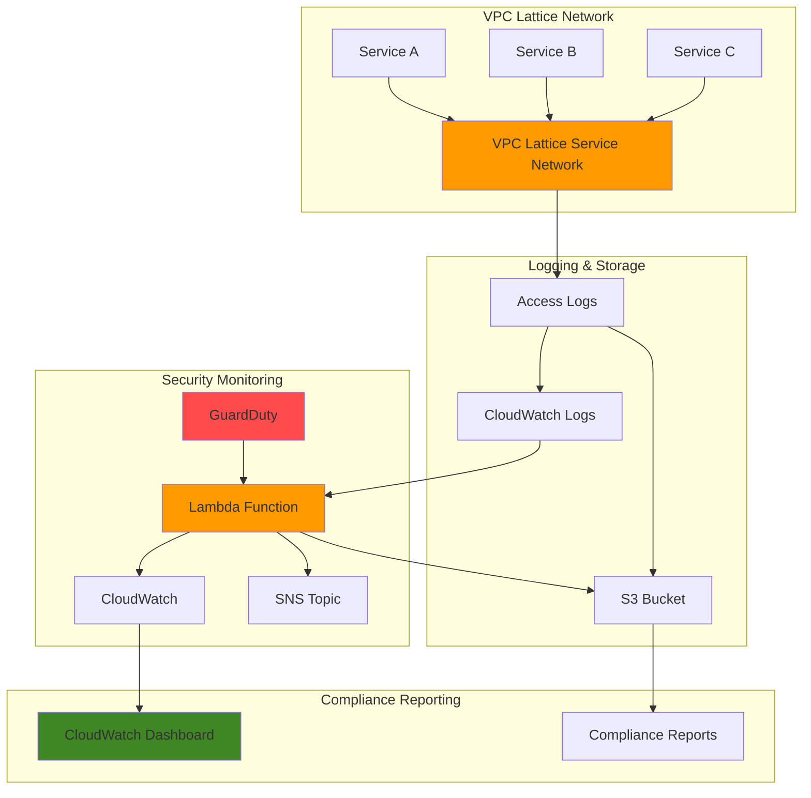

# Security Compliance Auditing with VPC Lattice and GuardDuty

## Problem

Enterprise organizations struggle to maintain continuous security compliance monitoring across their microservices architecture, especially when service-to-service communication flows through VPC Lattice. Manual security audits are time-consuming, error-prone, and cannot detect threats in real-time, leaving organizations vulnerable to security breaches and compliance violations. Without automated threat detection and compliance reporting, security teams lack visibility into suspicious network patterns and cannot respond quickly to potential security incidents.

## Solution

Build an automated security compliance auditing system that continuously monitors VPC Lattice access logs, integrates with GuardDuty threat intelligence, and generates real-time compliance reports. The solution uses Lambda functions to process access logs, correlate them with GuardDuty findings, and create automated alerts through CloudWatch, enabling proactive threat detection and streamlined compliance reporting for enterprise security requirements.

## Architecture Diagram



## Prerequisites

1. AWS account with administrative permissions for VPC Lattice, GuardDuty, Lambda, CloudWatch, and S3
2. AWS CLI installed and configured (version 2.0 or later) or AWS CloudShell access
3. Basic understanding of AWS security services and JSON log analysis
4. Existing VPC Lattice service network or permissions to create one for testing
5. Estimated cost: $15-25 per month for GuardDuty, $5-10 for Lambda executions, $2-5 for CloudWatch logs and metrics

> **Note**: GuardDuty pricing varies by region and data volume. The first 30 days include a free trial for new accounts.

## Preparation

```bash
# Set environment variables
export AWS_REGION=$(aws configure get region)
export AWS_ACCOUNT_ID=$(aws sts get-caller-identity \
    --query Account --output text)

# Generate unique identifiers for resources
RANDOM_SUFFIX=$(aws secretsmanager get-random-password \
    --exclude-punctuation --exclude-uppercase \
    --password-length 6 --require-each-included-type \
    --output text --query RandomPassword)

# Set resource names
export BUCKET_NAME="security-audit-logs-${RANDOM_SUFFIX}"
export LOG_GROUP_NAME="/aws/vpclattice/security-audit"
export LAMBDA_FUNCTION_NAME="security-compliance-processor"
export SNS_TOPIC_NAME="security-alerts-${RANDOM_SUFFIX}"

# Create S3 bucket for log storage and compliance reports
aws s3 mb s3://${BUCKET_NAME} --region ${AWS_REGION}

aws s3api put-bucket-encryption \
    --bucket ${BUCKET_NAME} \
    --server-side-encryption-configuration \
    'Rules=[{ApplyServerSideEncryptionByDefault:{SSEAlgorithm:AES256}}]'

# Create CloudWatch log group for VPC Lattice access logs
aws logs create-log-group \
    --log-group-name ${LOG_GROUP_NAME} \
    --region ${AWS_REGION}

echo "✅ AWS environment configured with security-enabled resources"
```

## Steps

1. **Enable Amazon GuardDuty for Threat Detection**:

   Amazon GuardDuty provides intelligent threat detection using machine learning, anomaly detection, and integrated threat intelligence to identify malicious activities in your AWS environment. Enabling GuardDuty creates a baseline for threat detection that will correlate with our VPC Lattice access logs to identify suspicious network patterns and potential security incidents.

   ```bash
   # Enable GuardDuty detector
   DETECTOR_ID=$(aws guardduty create-detector \
       --enable \
       --finding-publishing-frequency FIFTEEN_MINUTES \
       --query DetectorId --output text)
   
   # Store detector ID for later use
   echo "export GUARDDUTY_DETECTOR_ID=${DETECTOR_ID}" >> ~/.bashrc
   export GUARDDUTY_DETECTOR_ID=${DETECTOR_ID}
   
   echo "✅ GuardDuty enabled with detector ID: ${DETECTOR_ID}"
   ```

   GuardDuty is now actively monitoring your AWS environment for malicious activities and will generate findings that our Lambda function can process and correlate with VPC Lattice access patterns.

2. **Create SNS Topic for Security Alerts**:

   Amazon SNS enables real-time notifications for security incidents and compliance violations. This topic will receive alerts from our security monitoring system and can be configured to send notifications via email, SMS, or integrate with security incident response platforms like PagerDuty or Slack.

   ```bash
   # Create SNS topic for security alerts
   SNS_TOPIC_ARN=$(aws sns create-topic \
       --name ${SNS_TOPIC_NAME} \
       --query TopicArn --output text)
   
   # Subscribe to the topic with your email (replace with your email)
   aws sns subscribe \
       --topic-arn ${SNS_TOPIC_ARN} \
       --protocol email \
       --notification-endpoint security-admin@yourcompany.com
   
   echo "✅ SNS topic created: ${SNS_TOPIC_ARN}"
   echo "⚠️ Please confirm the email subscription to receive alerts"
   ```

   The SNS topic is configured to deliver immediate notifications when security threats or compliance violations are detected, enabling rapid incident response.

3. **Create IAM Role for Lambda Security Processor**:

   The Lambda function requires specific permissions to read VPC Lattice access logs, query GuardDuty findings, publish metrics to CloudWatch, and send alerts through SNS. This IAM role follows the principle of least privilege while providing necessary access for security monitoring operations.

   ```bash
   # Create trust policy for Lambda
   cat > lambda-trust-policy.json << 'EOF'
   {
       "Version": "2012-10-17",
       "Statement": [
           {
               "Effect": "Allow",
               "Principal": {
                   "Service": "lambda.amazonaws.com"
               },
               "Action": "sts:AssumeRole"
           }
       ]
   }
   EOF
   
   # Create IAM role
   aws iam create-role \
       --role-name SecurityComplianceProcessorRole \
       --assume-role-policy-document file://lambda-trust-policy.json
   
   # Create and attach custom policy
   cat > lambda-security-policy.json << 'EOF'
   {
       "Version": "2012-10-17",
       "Statement": [
           {
               "Effect": "Allow",
               "Action": [
                   "logs:CreateLogGroup",
                   "logs:CreateLogStream",
                   "logs:PutLogEvents",
                   "logs:DescribeLogStreams",
                   "logs:FilterLogEvents"
               ],
               "Resource": "*"
           },
           {
               "Effect": "Allow",
               "Action": [
                   "guardduty:GetDetector",
                   "guardduty:GetFindings",
                   "guardduty:ListFindings"
               ],
               "Resource": "*"
           },
           {
               "Effect": "Allow",
               "Action": [
                   "s3:GetObject",
                   "s3:PutObject",
                   "s3:ListBucket"
               ],
               "Resource": [
                   "arn:aws:s3:::${BUCKET_NAME}",
                   "arn:aws:s3:::${BUCKET_NAME}/*"
               ]
           },
           {
               "Effect": "Allow",
               "Action": [
                   "sns:Publish"
               ],
               "Resource": "${SNS_TOPIC_ARN}"
           },
           {
               "Effect": "Allow",
               "Action": [
                   "cloudwatch:PutMetricData"
               ],
               "Resource": "*"
           }
       ]
   }
   EOF
   
   aws iam put-role-policy \
       --role-name SecurityComplianceProcessorRole \
       --policy-name SecurityCompliancePolicy \
       --policy-document file://lambda-security-policy.json
   
   # Get role ARN
   LAMBDA_ROLE_ARN=$(aws iam get-role \
       --role-name SecurityComplianceProcessorRole \
       --query Role.Arn --output text)
   
   echo "✅ IAM role created: ${LAMBDA_ROLE_ARN}"
   ```

   The IAM role provides secure access to all required AWS services while maintaining the principle of least privilege for enhanced security.

4. **Create Lambda Function for Security Log Processing**:

   This Lambda function processes VPC Lattice access logs, correlates them with GuardDuty findings, and generates security metrics and alerts. The function analyzes network traffic patterns, identifies anomalies, and creates compliance reports for auditing purposes.

   ```bash
   # Create Lambda function code
   cat > security_processor.py << 'EOF'
   import json
   import boto3
   import os
   from datetime import datetime, timedelta
   import gzip
   import base64
   
   # Initialize AWS clients
   guardduty = boto3.client('guardduty')
   cloudwatch = boto3.client('cloudwatch')
   sns = boto3.client('sns')
   s3 = boto3.client('s3')
   
   def lambda_handler(event, context):
       try:
           # Process CloudWatch Logs events
           cw_data = event['awslogs']['data']
           compressed_payload = base64.b64decode(cw_data)
           uncompressed_payload = gzip.decompress(compressed_payload)
           log_data = json.loads(uncompressed_payload)
           
           suspicious_activities = []
           metrics_data = []
           
           # Process each log event
           for log_event in log_data['logEvents']:
               try:
                   log_entry = json.loads(log_event['message'])
                   
                   # Analyze access patterns
                   analysis_result = analyze_access_log(log_entry)
                   
                   if analysis_result['is_suspicious']:
                       suspicious_activities.append(analysis_result)
                   
                   # Collect metrics
                   metrics_data.append(extract_metrics(log_entry))
                   
               except json.JSONDecodeError:
                   print(f"Failed to parse log entry: {log_event['message']}")
                   continue
           
           # Correlate with GuardDuty findings
           recent_findings = get_recent_guardduty_findings()
           
           # Generate compliance report
           compliance_report = generate_compliance_report(
               suspicious_activities, metrics_data, recent_findings
           )
           
           # Store report in S3
           store_compliance_report(compliance_report)
           
           # Send alerts if necessary
           if suspicious_activities:
               send_security_alert(suspicious_activities, recent_findings)
           
           # Publish metrics to CloudWatch
           publish_metrics(metrics_data)
           
           return {
               'statusCode': 200,
               'body': json.dumps(f'Processed {len(log_data["logEvents"])} log events')
           }
           
       except Exception as e:
           print(f"Error processing logs: {str(e)}")
           return {
               'statusCode': 500,
               'body': json.dumps(f'Error: {str(e)}')
           }
   
   def analyze_access_log(log_entry):
       """Analyze VPC Lattice access log for suspicious patterns"""
       is_suspicious = False
       risk_score = 0
       reasons = []
       
       # Check for high error rates
       if log_entry.get('responseCode', 0) >= 400:
           risk_score += 20
           reasons.append('HTTP error response')
       
       # Check for unusual request patterns
       if log_entry.get('requestMethod') in ['PUT', 'DELETE', 'PATCH']:
           risk_score += 10
           reasons.append('Potentially sensitive operation')
       
       # Check for authentication failures
       if log_entry.get('authDeniedReason'):
           risk_score += 30
           reasons.append('Authentication failure')
       
       # Check for unusual response times
       duration = log_entry.get('duration', 0)
       if duration > 10000:  # More than 10 seconds
           risk_score += 15
           reasons.append('Unusually long response time')
       
       # Mark as suspicious if risk score exceeds threshold
       if risk_score >= 25:
           is_suspicious = True
       
       return {
           'is_suspicious': is_suspicious,
           'risk_score': risk_score,
           'reasons': reasons,
           'log_entry': log_entry,
           'timestamp': log_entry.get('startTime')
       }
   
   def get_recent_guardduty_findings():
       """Retrieve recent GuardDuty findings"""
       detector_id = os.environ.get('GUARDDUTY_DETECTOR_ID')
       if not detector_id:
           return []
       
       try:
           # Get findings from the last hour
           end_time = datetime.utcnow()
           start_time = end_time - timedelta(hours=1)
           
           response = guardduty.list_findings(
               DetectorId=detector_id,
               FindingCriteria={
                   'Criterion': {
                       'updatedAt': {
                           'Gte': int(start_time.timestamp() * 1000),
                           'Lte': int(end_time.timestamp() * 1000)
                       }
                   }
               }
           )
           
           if response['FindingIds']:
               findings_response = guardduty.get_findings(
                   DetectorId=detector_id,
                   FindingIds=response['FindingIds']
               )
               return findings_response['Findings']
           
           return []
           
       except Exception as e:
           print(f"Error retrieving GuardDuty findings: {str(e)}")
           return []
   
   def generate_compliance_report(suspicious_activities, metrics_data, guardduty_findings):
       """Generate comprehensive compliance report"""
       report = {
           'timestamp': datetime.utcnow().isoformat(),
           'summary': {
               'total_requests': len(metrics_data),
               'suspicious_activities': len(suspicious_activities),
               'guardduty_findings': len(guardduty_findings),
               'compliance_status': 'COMPLIANT' if len(suspicious_activities) == 0 else 'NON_COMPLIANT'
           },
           'suspicious_activities': suspicious_activities,
           'guardduty_findings': guardduty_findings,
           'metrics': calculate_summary_metrics(metrics_data)
       }
       
       return report
   
   def store_compliance_report(report):
       """Store compliance report in S3"""
       bucket_name = os.environ.get('BUCKET_NAME')
       if not bucket_name:
           return
       
       timestamp = datetime.utcnow().strftime('%Y/%m/%d/%H')
       key = f"compliance-reports/{timestamp}/report-{int(datetime.utcnow().timestamp())}.json"
       
       try:
           s3.put_object(
               Bucket=bucket_name,
               Key=key,
               Body=json.dumps(report, indent=2),
               ContentType='application/json'
           )
           print(f"Compliance report stored: s3://{bucket_name}/{key}")
       except Exception as e:
           print(f"Error storing compliance report: {str(e)}")
   
   def send_security_alert(suspicious_activities, guardduty_findings):
       """Send security alert via SNS"""
       topic_arn = os.environ.get('SNS_TOPIC_ARN')
       if not topic_arn:
           return
       
       alert_message = {
           'timestamp': datetime.utcnow().isoformat(),
           'alert_type': 'SECURITY_VIOLATION',
           'suspicious_count': len(suspicious_activities),
           'guardduty_count': len(guardduty_findings),
           'details': {
               'suspicious_activities': suspicious_activities[:5],  # Limit to first 5
               'recent_guardduty_findings': [f['Title'] for f in guardduty_findings[:3]]
           }
       }
       
       try:
           sns.publish(
               TopicArn=topic_arn,
               Subject='Security Compliance Alert - Suspicious Activity Detected',
               Message=json.dumps(alert_message, indent=2)
           )
           print("Security alert sent successfully")
       except Exception as e:
           print(f"Error sending security alert: {str(e)}")
   
   def extract_metrics(log_entry):
       """Extract metrics from log entry"""
       return {
           'response_code': log_entry.get('responseCode', 0),
           'duration': log_entry.get('duration', 0),
           'bytes_sent': log_entry.get('bytesSent', 0),
           'bytes_received': log_entry.get('bytesReceived', 0),
           'method': log_entry.get('requestMethod', 'UNKNOWN')
       }
   
   def calculate_summary_metrics(metrics_data):
       """Calculate summary metrics"""
       if not metrics_data:
           return {}
       
       total_requests = len(metrics_data)
       error_count = sum(1 for m in metrics_data if m['response_code'] >= 400)
       avg_duration = sum(m['duration'] for m in metrics_data) / total_requests
       total_bytes = sum(m['bytes_sent'] + m['bytes_received'] for m in metrics_data)
       
       return {
           'total_requests': total_requests,
           'error_rate': (error_count / total_requests) * 100,
           'average_duration_ms': round(avg_duration, 2),
           'total_bytes_transferred': total_bytes
       }
   
   def publish_metrics(metrics_data):
       """Publish custom metrics to CloudWatch"""
       if not metrics_data:
           return
       
       try:
           # Calculate and publish key metrics
           error_count = sum(1 for m in metrics_data if m['response_code'] >= 400)
           avg_duration = sum(m['duration'] for m in metrics_data) / len(metrics_data)
           
           cloudwatch.put_metric_data(
               Namespace='Security/VPCLattice',
               MetricData=[
                   {
                       'MetricName': 'RequestCount',
                       'Value': len(metrics_data),
                       'Unit': 'Count'
                   },
                   {
                       'MetricName': 'ErrorCount',
                       'Value': error_count,
                       'Unit': 'Count'
                   },
                   {
                       'MetricName': 'AverageResponseTime',
                       'Value': avg_duration,
                       'Unit': 'Milliseconds'
                   }
               ]
           )
           print("Metrics published to CloudWatch")
       except Exception as e:
           print(f"Error publishing metrics: {str(e)}")
   EOF
   
   # Package Lambda function
   zip -r security-processor.zip security_processor.py
   
   # Create Lambda function
   aws lambda create-function \
       --function-name ${LAMBDA_FUNCTION_NAME} \
       --runtime python3.12 \
       --role ${LAMBDA_ROLE_ARN} \
       --handler security_processor.lambda_handler \
       --zip-file fileb://security-processor.zip \
       --timeout 60 \
       --memory-size 256 \
       --environment Variables="{GUARDDUTY_DETECTOR_ID=${GUARDDUTY_DETECTOR_ID},BUCKET_NAME=${BUCKET_NAME},SNS_TOPIC_ARN=${SNS_TOPIC_ARN}}"
   
   echo "✅ Lambda function created for security log processing"
   ```

   The Lambda function is now configured to process VPC Lattice access logs, analyze them for security threats, correlate with GuardDuty findings, and generate comprehensive compliance reports.

5. **Create CloudWatch Log Subscription Filter**:

   CloudWatch Log Subscription Filters enable real-time processing of log streams by triggering our Lambda function whenever new VPC Lattice access logs are written. This creates an automated pipeline that processes security logs as they arrive, enabling immediate threat detection and response.

   ```bash
   # Wait for IAM role propagation
   sleep 30
   
   # Create log subscription filter to trigger Lambda
   aws logs put-subscription-filter \
       --log-group-name ${LOG_GROUP_NAME} \
       --filter-name "SecurityComplianceFilter" \
       --filter-pattern "" \
       --destination-arn "arn:aws:lambda:${AWS_REGION}:${AWS_ACCOUNT_ID}:function:${LAMBDA_FUNCTION_NAME}"
   
   # Grant CloudWatch Logs permission to invoke Lambda
   aws lambda add-permission \
       --function-name ${LAMBDA_FUNCTION_NAME} \
       --statement-id "AllowCWLogsInvocation" \
       --action lambda:InvokeFunction \
       --principal logs.amazonaws.com \
       --source-arn "arn:aws:logs:${AWS_REGION}:${AWS_ACCOUNT_ID}:log-group:${LOG_GROUP_NAME}:*"
   
   echo "✅ CloudWatch log subscription filter configured"
   ```

   The subscription filter ensures that every VPC Lattice access log entry is immediately processed by our security monitoring system, providing real-time threat detection capabilities.

6. **Create CloudWatch Dashboard for Security Monitoring**:

   A comprehensive CloudWatch dashboard provides real-time visibility into security metrics, compliance status, and threat detection activities. This centralized view enables security teams to monitor the health of their compliance monitoring system and quickly identify potential security incidents.

   ```bash
   # Create CloudWatch dashboard
   cat > dashboard-config.json << 'EOF'
   {
       "widgets": [
           {
               "type": "metric",
               "x": 0,
               "y": 0,
               "width": 12,
               "height": 6,
               "properties": {
                   "metrics": [
                       [ "Security/VPCLattice", "RequestCount" ],
                       [ ".", "ErrorCount" ]
                   ],
                   "period": 300,
                   "stat": "Sum",
                   "region": "us-east-1",
                   "title": "VPC Lattice Traffic Overview"
               }
           },
           {
               "type": "metric",
               "x": 12,
               "y": 0,
               "width": 12,
               "height": 6,
               "properties": {
                   "metrics": [
                       [ "Security/VPCLattice", "AverageResponseTime" ]
                   ],
                   "period": 300,
                   "stat": "Average",
                   "region": "us-east-1",
                   "title": "Average Response Time"
               }
           },
           {
               "type": "log",
               "x": 0,
               "y": 6,
               "width": 24,
               "height": 6,
               "properties": {
                   "query": "SOURCE '/aws/lambda/security-compliance-processor' | fields @timestamp, @message\n| filter @message like /SECURITY_VIOLATION/\n| sort @timestamp desc\n| limit 20",
                   "region": "us-east-1",
                   "title": "Recent Security Alerts",
                   "view": "table"
               }
           }
       ]
   }
   EOF
   
   # Create dashboard
   aws cloudwatch put-dashboard \
       --dashboard-name "SecurityComplianceDashboard" \
       --dashboard-body file://dashboard-config.json
   
   echo "✅ CloudWatch dashboard created for security monitoring"
   ```

   The dashboard provides a comprehensive view of security metrics, recent alerts, and system health, enabling proactive security monitoring and incident response.

7. **Set Up VPC Lattice Access Logging** (Demo Configuration):

   For demonstration purposes, we'll configure VPC Lattice access logging to send logs to our CloudWatch log group. In a production environment, you would configure this for your existing VPC Lattice service networks and services.

   ```bash
   # Create a demo VPC Lattice service network for testing
   SERVICE_NETWORK_ID=$(aws vpc-lattice create-service-network \
       --name "security-demo-network-${RANDOM_SUFFIX}" \
       --query ServiceNetwork.Id --output text)
   
   # Configure access logging for the service network
   aws vpc-lattice create-access-log-subscription \
       --resource-identifier ${SERVICE_NETWORK_ID} \
       --destination-arn "arn:aws:logs:${AWS_REGION}:${AWS_ACCOUNT_ID}:log-group:${LOG_GROUP_NAME}"
   
   echo "✅ VPC Lattice access logging configured"
   echo "Service Network ID: ${SERVICE_NETWORK_ID}"
   ```

   VPC Lattice access logging is now configured to send all network traffic logs to our security monitoring system for real-time analysis and compliance reporting.

## Validation & Testing

1. **Verify GuardDuty is Active and Monitoring**:

   ```bash
   # Check GuardDuty detector status
   aws guardduty get-detector \
       --detector-id ${GUARDDUTY_DETECTOR_ID} \
       --query 'Status'
   ```

   Expected output: `"ENABLED"`

2. **Test Lambda Function with Sample Log Data**:

   ```bash
   # Create test log event
   cat > test-log-event.json << 'EOF'
   {
       "awslogs": {
           "data": "H4sIAAAAAAAAAHWPwQrCMBBEf2WYc03ShJbepPTWH7A9BDdJk+wHdZLY0uI/CQK9vHng7bznBLI5QnGZO+gtSgVrDmOsOoJ3N5o7nF0DIemCFmL8FULSKJm8gEWVOMLsXrOzJ5RrQGnQhJRAKOvOr5v8K5EhUMcLKJ/yXF5m0jKAoJcg+gXmxqVEEhUgb5G5p6sI8MirnKzGhJCi4DqhFxuG1VhFz7K3YvnTh6/6SWPQLMkWR9WQZz0E9KnfvXwvOLyHEIjM7vPf9v+R1Vg4vf1HgzOJJ7kbU9xjx6F4iQeCMGeDcqDdRmQ8wd8EAFQD5B4AAAA="
       }
   }
   EOF
   
   # Invoke Lambda function
   aws lambda invoke \
       --function-name ${LAMBDA_FUNCTION_NAME} \
       --payload file://test-log-event.json \
       response.json
   
   # Check response
   cat response.json
   ```

   Expected output: Successful processing message with status code 200.

3. **Verify CloudWatch Metrics are Being Published**:

   ```bash
   # Check custom metrics
   aws cloudwatch get-metric-statistics \
       --namespace Security/VPCLattice \
       --metric-name RequestCount \
       --start-time $(date -u -d '1 hour ago' +%Y-%m-%dT%H:%M:%SZ) \
       --end-time $(date -u +%Y-%m-%dT%H:%M:%SZ) \
       --period 300 \
       --statistics Sum
   ```

4. **Check Compliance Reports in S3**:

   ```bash
   # List compliance reports
   aws s3 ls s3://${BUCKET_NAME}/compliance-reports/ --recursive
   
   # Download and view latest report
   LATEST_REPORT=$(aws s3 ls s3://${BUCKET_NAME}/compliance-reports/ \
       --recursive | tail -1 | awk '{print $4}')
   aws s3 cp s3://${BUCKET_NAME}/${LATEST_REPORT} latest-report.json
   cat latest-report.json
   ```

## Cleanup

1. **Remove VPC Lattice Resources**:

   ```bash
   # Delete access log subscription
   aws vpc-lattice delete-access-log-subscription \
       --access-log-subscription-identifier ${SERVICE_NETWORK_ID}
   
   # Delete service network
   aws vpc-lattice delete-service-network \
       --service-network-identifier ${SERVICE_NETWORK_ID}
   
   echo "✅ VPC Lattice resources deleted"
   ```

2. **Remove Lambda Function and IAM Role**:

   ```bash
   # Delete Lambda function
   aws lambda delete-function \
       --function-name ${LAMBDA_FUNCTION_NAME}
   
   # Delete IAM role and policy
   aws iam delete-role-policy \
       --role-name SecurityComplianceProcessorRole \
       --policy-name SecurityCompliancePolicy
   
   aws iam delete-role \
       --role-name SecurityComplianceProcessorRole
   
   echo "✅ Lambda function and IAM role deleted"
   ```

3. **Remove CloudWatch Resources**:

   ```bash
   # Delete log subscription filter
   aws logs delete-subscription-filter \
       --log-group-name ${LOG_GROUP_NAME} \
       --filter-name "SecurityComplianceFilter"
   
   # Delete log group
   aws logs delete-log-group \
       --log-group-name ${LOG_GROUP_NAME}
   
   # Delete dashboard
   aws cloudwatch delete-dashboards \
       --dashboard-names SecurityComplianceDashboard
   
   echo "✅ CloudWatch resources deleted"
   ```

4. **Remove GuardDuty Detector and SNS Topic**:

   ```bash
   # Disable GuardDuty detector
   aws guardduty delete-detector \
       --detector-id ${GUARDDUTY_DETECTOR_ID}
   
   # Delete SNS topic
   aws sns delete-topic \
       --topic-arn ${SNS_TOPIC_ARN}
   
   echo "✅ GuardDuty and SNS resources deleted"
   ```

5. **Remove S3 Bucket and Local Files**:

   ```bash
   # Empty and delete S3 bucket
   aws s3 rm s3://${BUCKET_NAME} --recursive
   aws s3 rb s3://${BUCKET_NAME}
   
   # Clean up local files
   rm -f lambda-trust-policy.json lambda-security-policy.json
   rm -f security_processor.py security-processor.zip
   rm -f dashboard-config.json test-log-event.json
   rm -f response.json latest-report.json
   
   echo "✅ S3 bucket and local files cleaned up"
   ```

## Discussion

This recipe demonstrates how to build a comprehensive security compliance auditing system that combines the power of VPC Lattice access logs with GuardDuty threat intelligence. The solution addresses the critical need for real-time security monitoring in modern microservices architectures where service-to-service communication requires continuous oversight for compliance and threat detection.

The architecture leverages several key AWS services in an integrated approach. VPC Lattice provides detailed access logs that capture every request and response flowing through your service network, including authentication details, response codes, and timing information. This granular visibility is essential for identifying unusual patterns that may indicate security threats or compliance violations. GuardDuty adds machine learning-powered threat detection that analyzes multiple data sources to identify sophisticated attacks that traditional signature-based systems might miss.

The Lambda-based processing engine serves as the intelligence layer that correlates VPC Lattice access patterns with GuardDuty findings, creating a more comprehensive threat detection capability than either service provides alone. This correlation is crucial because network-level anomalies in VPC Lattice logs can be enhanced with threat intelligence from GuardDuty to reduce false positives and provide more accurate threat assessment. The automated compliance reporting feature generates timestamped reports that can be used for regulatory audits and help demonstrate continuous security monitoring to compliance officers.

The CloudWatch integration provides both real-time alerting and historical analysis capabilities. Custom metrics enable security teams to establish baselines for normal traffic patterns and set up automated alerts when unusual activity is detected. The dashboard provides a centralized view that combines operational metrics with security insights, making it easier for teams to maintain situational awareness of their security posture. For organizations with mature DevSecOps practices, these metrics can be integrated into existing monitoring and alerting systems to create a unified security operations center view.

> **Tip**: Consider implementing additional correlation rules in your Lambda function to detect patterns like failed authentication attempts followed by successful access from the same source, which could indicate compromised credentials.

**Documentation Sources:**
- [Amazon VPC Lattice Access Logs Documentation](https://docs.aws.amazon.com/vpc-lattice/latest/ug/monitoring-access-logs.html)
- [Amazon GuardDuty User Guide](https://docs.aws.amazon.com/guardduty/latest/ug/what-is-guardduty.html)
- [AWS Well-Architected Security Pillar](https://docs.aws.amazon.com/wellarchitected/latest/security-pillar/welcome.html)
- [Processing GuardDuty Findings with EventBridge](https://docs.aws.amazon.com/guardduty/latest/ug/guardduty_findings_eventbridge.html)
- [AWS Lambda Best Practices](https://docs.aws.amazon.com/lambda/latest/dg/best-practices.html)

## Challenge

Extend this security compliance auditing solution by implementing these enhancements:

1. **Advanced Threat Correlation**: Implement machine learning models using SageMaker to identify complex attack patterns by analyzing the temporal relationships between VPC Lattice access patterns and GuardDuty findings over extended time periods.

2. **Multi-Region Security Monitoring**: Expand the solution to aggregate security data from multiple AWS regions, creating a global view of threats and compliance status across your entire infrastructure footprint.

3. **Integration with AWS Security Hub**: Connect the compliance reports to AWS Security Hub to create a centralized security findings management system that integrates with other security tools and provides standardized finding formats.

4. **Automated Incident Response**: Implement AWS Systems Manager Automation documents that can automatically respond to specific types of security violations, such as blocking suspicious IP addresses or isolating compromised resources.

5. **Custom Compliance Frameworks**: Extend the reporting engine to generate compliance reports for specific frameworks like SOC 2, PCI DSS, or GDPR by mapping detected activities to specific compliance requirements and control objectives.

## Infrastructure Code

### Available Infrastructure as Code:

- [Infrastructure Code Overview](code/README.md) - Detailed description of all infrastructure components
- [AWS CDK (Python)](code/cdk-python/) - AWS CDK Python implementation
- [AWS CDK (TypeScript)](code/cdk-typescript/) - AWS CDK TypeScript implementation
- [CloudFormation](code/cloudformation.yaml) - AWS CloudFormation template
- [Bash CLI Scripts](code/scripts/) - Example bash scripts using AWS CLI commands to deploy infrastructure
- [Terraform](code/terraform/) - Terraform configuration files