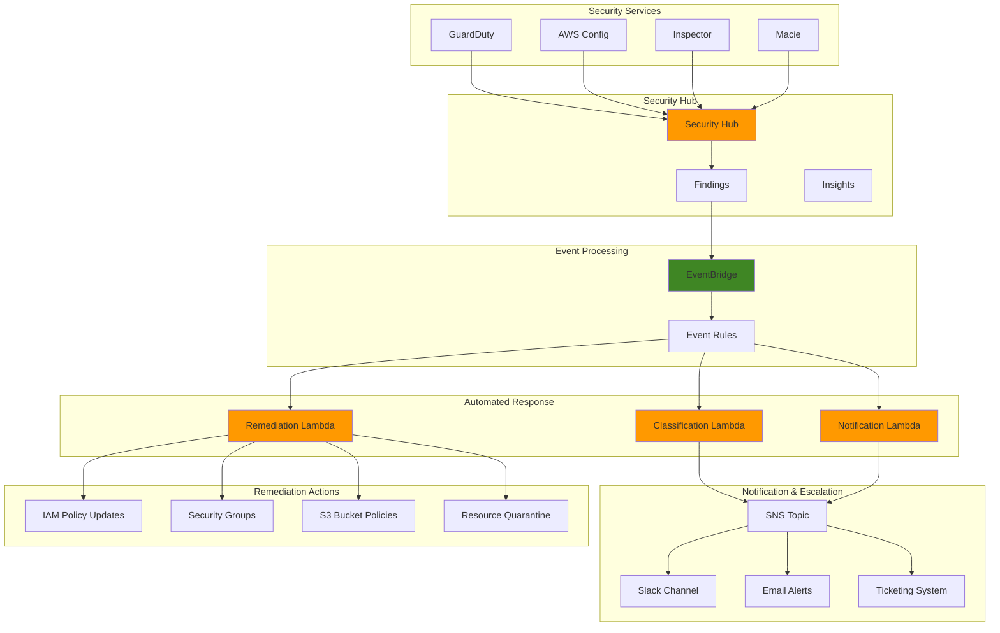

# Security Incident Response Automation

## Problem

Security teams in enterprises face overwhelming volumes of security alerts and findings from multiple sources, making it challenging to respond effectively to genuine threats. Manual incident response processes are slow, error-prone, and often inconsistent, leading to delayed threat containment and increased security risks. Organizations need automated workflows to classify, prioritize, and respond to security incidents in real-time while maintaining proper audit trails and escalation procedures.

## Solution

Build an automated security incident response system using AWS Security Hub to aggregate and normalize security findings, EventBridge to trigger automated workflows, and Lambda functions to implement intelligent response actions. The solution includes automated threat classification, incident prioritization, remediation workflows, and notification systems that enable rapid response to security events while reducing manual intervention and ensuring consistent security posture.

## Architecture Diagram



## Prerequisites

1. AWS account with Security Hub, EventBridge, Lambda, and SNS permissions
2. AWS CLI v2 installed and configured (or AWS CloudShell)
3. Understanding of security incident response procedures
4. Knowledge of AWS security services (GuardDuty, Config, Inspector)
5. Familiarity with Lambda functions and EventBridge patterns
6. Estimated cost: $20-50/month for Security Hub and Lambda execution

> **Note**: This recipe assumes you have basic security services enabled. Additional costs may apply for GuardDuty, Config, and Inspector if not already active.

## Preparation

```bash
# Set environment variables
export AWS_REGION=$(aws configure get region)
export AWS_ACCOUNT_ID=$(aws sts get-caller-identity \
    --query Account --output text)

# Generate unique identifiers for resources
RANDOM_SUFFIX=$(aws secretsmanager get-random-password \
    --exclude-punctuation --exclude-uppercase \
    --password-length 6 --require-each-included-type \
    --output text --query RandomPassword)

# Set resource names
export SECURITY_HUB_ROLE_NAME="SecurityHubRole-${RANDOM_SUFFIX}"
export INCIDENT_RESPONSE_ROLE_NAME="IncidentResponseRole-${RANDOM_SUFFIX}"
export CLASSIFICATION_FUNCTION_NAME="security-classification-${RANDOM_SUFFIX}"
export REMEDIATION_FUNCTION_NAME="security-remediation-${RANDOM_SUFFIX}"
export NOTIFICATION_FUNCTION_NAME="security-notification-${RANDOM_SUFFIX}"
export SNS_TOPIC_NAME="security-incidents-${RANDOM_SUFFIX}"
export EVENTBRIDGE_RULE_NAME="security-hub-findings-${RANDOM_SUFFIX}"

# Create working directory for Lambda functions
mkdir -p lambda-functions
cd lambda-functions

echo "✅ Environment prepared with suffix: ${RANDOM_SUFFIX}"
```

## Steps

1. **Enable Security Hub and configure security standards**:

   AWS Security Hub serves as the central security findings aggregator for your AWS environment, providing a unified view of security alerts from multiple AWS security services including GuardDuty, Config, Inspector, and Macie. Security Hub normalizes and prioritizes findings using the AWS Security Finding Format (ASFF), enabling consistent incident response workflows across diverse security tools. This foundational step establishes the security command center that will feed automated incident response workflows.

   ```bash
   # Enable Security Hub with default standards
   aws securityhub enable-security-hub \
       --enable-default-standards \
       --tags '{"Project": "IncidentResponse", "Environment": "Production"}'
   
   # Wait for Security Hub to initialize
   sleep 30
   
   # Verify Security Hub is enabled
   aws securityhub describe-hub
   
   echo "✅ Security Hub enabled with default standards"
   ```

   Security Hub is now active and will begin collecting security findings from enabled security services. The default security standards (AWS Foundational Security Standard, CIS AWS Foundations Benchmark) are automatically enabled, providing immediate compliance monitoring across your AWS resources. This creates the foundational data source for your automated incident response system.

   > **Warning**: Enabling Security Hub may discover existing security issues in your environment. Review findings carefully and prioritize remediation based on your organization's risk tolerance and compliance requirements.

2. **Create IAM roles for Lambda functions**:

   IAM roles enable secure, least-privilege access for automated incident response functions without embedding long-term credentials in code. The principle of least privilege ensures Lambda functions access only the specific AWS resources and actions required for their incident response tasks, reducing security attack surfaces while maintaining operational effectiveness. This security-first approach is essential for incident response automation that will handle sensitive security findings and perform remediation actions.

   ```bash
   # Create trust policy for Lambda
   cat > lambda-trust-policy.json << 'EOF'
   {
       "Version": "2012-10-17",
       "Statement": [
           {
               "Effect": "Allow",
               "Principal": {
                   "Service": "lambda.amazonaws.com"
               },
               "Action": "sts:AssumeRole"
           }
       ]
   }
   EOF
   
   # Create incident response role
   aws iam create-role \
       --role-name $INCIDENT_RESPONSE_ROLE_NAME \
       --assume-role-policy-document file://lambda-trust-policy.json \
       --description "Role for automated incident response functions"
   
   # Create and attach comprehensive policy
   cat > incident-response-policy.json << EOF
   {
       "Version": "2012-10-17",
       "Statement": [
           {
               "Effect": "Allow",
               "Action": [
                   "logs:CreateLogGroup",
                   "logs:CreateLogStream",
                   "logs:PutLogEvents"
               ],
               "Resource": "arn:aws:logs:*:*:*"
           },
           {
               "Effect": "Allow",
               "Action": [
                   "securityhub:GetFindings",
                   "securityhub:BatchUpdateFindings",
                   "securityhub:BatchImportFindings"
               ],
               "Resource": "*"
           },
           {
               "Effect": "Allow",
               "Action": [
                   "sns:Publish"
               ],
               "Resource": "arn:aws:sns:${AWS_REGION}:${AWS_ACCOUNT_ID}:${SNS_TOPIC_NAME}"
           },
           {
               "Effect": "Allow",
               "Action": [
                   "ec2:DescribeSecurityGroups",
                   "ec2:AuthorizeSecurityGroupIngress",
                   "ec2:RevokeSecurityGroupIngress",
                   "ec2:CreateTags",
                   "iam:AttachRolePolicy",
                   "iam:DetachRolePolicy",
                   "iam:PutRolePolicy",
                   "iam:DeleteRolePolicy",
                   "s3:PutBucketPolicy",
                   "s3:GetBucketPolicy"
               ],
               "Resource": "*"
           }
       ]
   }
   EOF
   
   aws iam put-role-policy \
       --role-name $INCIDENT_RESPONSE_ROLE_NAME \
       --policy-name "IncidentResponsePolicy" \
       --policy-document file://incident-response-policy.json
   
   echo "✅ IAM roles created for incident response"
   ```

   The IAM role is now configured with precisely scoped permissions for incident response automation. The policy grants access to Security Hub for finding management, SNS for notifications, and specific EC2, IAM, and S3 actions for automated remediation. This establishes the security foundation enabling Lambda functions to safely execute incident response actions while maintaining audit trails through CloudTrail.

3. **Create SNS topic for notifications**:

   Amazon SNS provides reliable, scalable messaging for incident response notifications, ensuring security teams receive timely alerts about critical security findings. SNS supports multiple notification protocols (email, SMS, Slack, PagerDuty) and provides delivery guarantees essential for security incident escalation workflows. The topic-based pub/sub model enables multiple subscribers and flexible notification routing based on incident severity and team responsibilities.

   ```bash
   # Create SNS topic
   SNS_TOPIC_ARN=$(aws sns create-topic \
       --name $SNS_TOPIC_NAME \
       --query TopicArn --output text)
   
   # Add email subscription (replace with your email)
   aws sns subscribe \
       --topic-arn $SNS_TOPIC_ARN \
       --protocol email \
       --notification-endpoint your-security-team@company.com
   
   # Set topic policy for Lambda access
   cat > sns-topic-policy.json << EOF
   {
       "Version": "2012-10-17",
       "Statement": [
           {
               "Effect": "Allow",
               "Principal": {
                   "AWS": "arn:aws:iam::${AWS_ACCOUNT_ID}:role/${INCIDENT_RESPONSE_ROLE_NAME}"
               },
               "Action": "SNS:Publish",
               "Resource": "${SNS_TOPIC_ARN}"
           }
       ]
   }
   EOF
   
   aws sns set-topic-attributes \
       --topic-arn $SNS_TOPIC_ARN \
       --attribute-name Policy \
       --attribute-value file://sns-topic-policy.json
   
   echo "✅ SNS topic created: $SNS_TOPIC_ARN"
   ```

   The SNS topic is now configured as the central notification hub for security incidents. The topic policy grants the incident response role permission to publish notifications, enabling Lambda functions to send structured alerts. This establishes the communication backbone that will deliver rich, contextual security alerts to your security operations team.

4. **Create security finding classification Lambda function**:

   AWS Lambda enables serverless execution of incident response logic, automatically scaling to handle security finding volumes without infrastructure management overhead. The classification function implements intelligent triage logic to categorize security findings based on severity, content analysis, and business context, reducing alert fatigue by ensuring appropriate response actions for each finding type. This automated classification enables consistent, rapid decision-making that would be difficult to achieve with manual processes.

   ```bash
   # Create classification function code
   cat > classification_function.py << 'EOF'
   import json
   import boto3
   import logging
   from datetime import datetime
   
   logger = logging.getLogger()
   logger.setLevel(logging.INFO)
   
   securityhub = boto3.client('securityhub')
   sns = boto3.client('sns')
   
   def lambda_handler(event, context):
       try:
           # Extract finding details from EventBridge event
           finding = event['detail']['findings'][0]
           
           finding_id = finding['Id']
           product_arn = finding['ProductArn']
           severity = finding['Severity']['Label']
           title = finding['Title']
           description = finding['Description']
           
           # Classify finding based on severity and type
           classification = classify_finding(finding)
           
           # Update finding with classification
           response = securityhub.batch_update_findings(
               FindingIdentifiers=[
                   {
                       'Id': finding_id,
                       'ProductArn': product_arn
                   }
               ],
               Note={
                   'Text': f'Auto-classified as {classification["category"]} - {classification["action"]}',
                   'UpdatedBy': 'SecurityIncidentResponse'
               },
               UserDefinedFields={
                   'AutoClassification': classification['category'],
                   'RecommendedAction': classification['action'],
                   'ProcessedAt': datetime.utcnow().isoformat()
               }
           )
           
           logger.info(f"Successfully classified finding {finding_id} as {classification['category']}")
           
           # Return classification for downstream processing
           return {
               'statusCode': 200,
               'body': json.dumps({
                   'findingId': finding_id,
                   'classification': classification,
                   'updated': True
               })
           }
           
       except Exception as e:
           logger.error(f"Error processing finding: {str(e)}")
           return {
               'statusCode': 500,
               'body': json.dumps({'error': str(e)})
           }
   
   def classify_finding(finding):
       """Classify finding based on severity, type, and content"""
       severity = finding['Severity']['Label']
       finding_type = finding.get('Types', ['Unknown'])[0]
       title = finding['Title'].lower()
       
       # High-priority security incidents
       if severity == 'CRITICAL':
           if 'root' in title or 'admin' in title:
               return {
                   'category': 'CRITICAL_ADMIN_ISSUE',
                   'action': 'IMMEDIATE_REVIEW_REQUIRED',
                   'escalate': True
               }
           elif 'malware' in title or 'backdoor' in title:
               return {
                   'category': 'MALWARE_DETECTED',
                   'action': 'QUARANTINE_RESOURCE',
                   'escalate': True
               }
           else:
               return {
                   'category': 'CRITICAL_SECURITY_ISSUE',
                   'action': 'INVESTIGATE_IMMEDIATELY',
                   'escalate': True
               }
       
       # Medium-priority issues
       elif severity == 'HIGH':
           if 'mfa' in title:
               return {
                   'category': 'MFA_COMPLIANCE_ISSUE',
                   'action': 'ENFORCE_MFA_POLICY',
                   'escalate': False
               }
           elif 'encryption' in title:
               return {
                   'category': 'ENCRYPTION_COMPLIANCE',
                   'action': 'ENABLE_ENCRYPTION',
                   'escalate': False
               }
           else:
               return {
                   'category': 'HIGH_SECURITY_ISSUE',
                   'action': 'SCHEDULE_REMEDIATION',
                   'escalate': False
               }
       
       # Lower priority issues
       else:
           return {
               'category': 'STANDARD_COMPLIANCE_ISSUE',
               'action': 'TRACK_FOR_REMEDIATION',
               'escalate': False
           }
   EOF
   
   # Package and deploy classification function
   zip classification_function.zip classification_function.py
   
   CLASSIFICATION_FUNCTION_ARN=$(aws lambda create-function \
       --function-name $CLASSIFICATION_FUNCTION_NAME \
       --runtime python3.9 \
       --role "arn:aws:iam::${AWS_ACCOUNT_ID}:role/${INCIDENT_RESPONSE_ROLE_NAME}" \
       --handler classification_function.lambda_handler \
       --zip-file fileb://classification_function.zip \
       --timeout 300 \
       --memory-size 256 \
       --description "Classifies security findings for automated response" \
       --query FunctionArn --output text)
   
   echo "✅ Classification function created: $CLASSIFICATION_FUNCTION_ARN"
   ```

   The classification Lambda function is now deployed and ready to automatically analyze security findings using sophisticated business logic. The function will extract finding details from EventBridge events, apply intelligent classification rules, and update Security Hub with classification metadata and recommended actions. This enables downstream automation and provides security analysts with actionable intelligence about each security incident.

   > **Tip**: Customize classification logic based on your organization's specific security policies and risk tolerance. Consider integrating with threat intelligence feeds for enhanced context. See [AWS Lambda Best Practices](https://docs.aws.amazon.com/lambda/latest/dg/best-practices.html) for optimization guidance.

5. **Create automated remediation Lambda function**:

   ```bash
   # Create remediation function code
   cat > remediation_function.py << 'EOF'
   import json
   import boto3
   import logging
   from datetime import datetime
   
   logger = logging.getLogger()
   logger.setLevel(logging.INFO)
   
   ec2 = boto3.client('ec2')
   iam = boto3.client('iam')
   s3 = boto3.client('s3')
   securityhub = boto3.client('securityhub')
   
   def lambda_handler(event, context):
       try:
           # Extract finding details
           finding = event['detail']['findings'][0]
           finding_id = finding['Id']
           product_arn = finding['ProductArn']
           title = finding['Title']
           resources = finding.get('Resources', [])
           
           # Determine remediation action based on finding type
           remediation_result = perform_remediation(finding, resources)
           
           # Update finding with remediation status
           securityhub.batch_update_findings(
               FindingIdentifiers=[
                   {
                       'Id': finding_id,
                       'ProductArn': product_arn
                   }
               ],
               Note={
                   'Text': f'Auto-remediation attempted: {remediation_result["action"]} - {remediation_result["status"]}',
                   'UpdatedBy': 'SecurityIncidentResponse'
               },
               UserDefinedFields={
                   'RemediationAction': remediation_result['action'],
                   'RemediationStatus': remediation_result['status'],
                   'RemediationTimestamp': datetime.utcnow().isoformat()
               },
               Workflow={
                   'Status': 'RESOLVED' if remediation_result['status'] == 'SUCCESS' else 'NEW'
               }
           )
           
           logger.info(f"Remediation completed for finding {finding_id}: {remediation_result['status']}")
           
           return {
               'statusCode': 200,
               'body': json.dumps(remediation_result)
           }
           
       except Exception as e:
           logger.error(f"Error in remediation: {str(e)}")
           return {
               'statusCode': 500,
               'body': json.dumps({'error': str(e)})
           }
   
   def perform_remediation(finding, resources):
       """Perform automated remediation based on finding type"""
       title = finding['Title'].lower()
       
       try:
           # Security Group remediation
           if 'security group' in title and 'open' in title:
               return remediate_security_group(finding, resources)
           
           # S3 bucket policy remediation
           elif 's3' in title and 'public' in title:
               return remediate_s3_bucket(finding, resources)
           
           # IAM policy remediation
           elif 'iam' in title and 'policy' in title:
               return remediate_iam_policy(finding, resources)
           
           # Default action for other findings
           else:
               return {
                   'action': 'MANUAL_REVIEW_REQUIRED',
                   'status': 'PENDING',
                   'message': 'Finding requires manual investigation'
               }
               
       except Exception as e:
           return {
               'action': 'REMEDIATION_FAILED',
               'status': 'ERROR',
               'message': str(e)
           }
   
   def remediate_security_group(finding, resources):
       """Remediate overly permissive security group rules"""
       for resource in resources:
           if resource['Type'] == 'AwsEc2SecurityGroup':
               sg_id = resource['Id'].split('/')[-1]
               
               try:
                   # Get security group details
                   response = ec2.describe_security_groups(GroupIds=[sg_id])
                   sg = response['SecurityGroups'][0]
                   
                   # Remove overly permissive rules (0.0.0.0/0)
                   for rule in sg.get('IpPermissions', []):
                       for ip_range in rule.get('IpRanges', []):
                           if ip_range.get('CidrIp') == '0.0.0.0/0':
                               ec2.revoke_security_group_ingress(
                                   GroupId=sg_id,
                                   IpPermissions=[rule]
                               )
                               
                               # Add more restrictive rule (example: company IP range)
                               restricted_rule = rule.copy()
                               restricted_rule['IpRanges'] = [{'CidrIp': '10.0.0.0/8', 'Description': 'Internal network only'}]
                               
                               ec2.authorize_security_group_ingress(
                                   GroupId=sg_id,
                                   IpPermissions=[restricted_rule]
                               )
                   
                   return {
                       'action': 'SECURITY_GROUP_RESTRICTED',
                       'status': 'SUCCESS',
                       'message': f'Restricted security group {sg_id} access'
                   }
                   
               except Exception as e:
                   return {
                       'action': 'SECURITY_GROUP_REMEDIATION_FAILED',
                       'status': 'ERROR',
                       'message': str(e)
                   }
       
       return {
           'action': 'NO_SECURITY_GROUP_FOUND',
           'status': 'SKIPPED',
           'message': 'No security group resource found in finding'
       }
   
   def remediate_s3_bucket(finding, resources):
       """Remediate public S3 bucket access"""
       for resource in resources:
           if resource['Type'] == 'AwsS3Bucket':
               bucket_name = resource['Id'].split('/')[-1]
               
               try:
                   # Apply restrictive bucket policy
                   restrictive_policy = {
                       "Version": "2012-10-17",
                       "Statement": [
                           {
                               "Sid": "DenyPublicRead",
                               "Effect": "Deny",
                               "Principal": "*",
                               "Action": "s3:GetObject",
                               "Resource": f"arn:aws:s3:::{bucket_name}/*",
                               "Condition": {
                                   "Bool": {
                                       "aws:SecureTransport": "false"
                                   }
                               }
                           }
                       ]
                   }
                   
                   s3.put_bucket_policy(
                       Bucket=bucket_name,
                       Policy=json.dumps(restrictive_policy)
                   )
                   
                   return {
                       'action': 'S3_BUCKET_SECURED',
                       'status': 'SUCCESS',
                       'message': f'Applied restrictive policy to bucket {bucket_name}'
                   }
                   
               except Exception as e:
                   return {
                       'action': 'S3_BUCKET_REMEDIATION_FAILED',
                       'status': 'ERROR',
                       'message': str(e)
                   }
       
       return {
           'action': 'NO_S3_BUCKET_FOUND',
           'status': 'SKIPPED',
           'message': 'No S3 bucket resource found in finding'
       }
   
   def remediate_iam_policy(finding, resources):
       """Remediate overly permissive IAM policies"""
       return {
           'action': 'IAM_POLICY_REVIEW_REQUIRED',
           'status': 'PENDING',
           'message': 'IAM policy changes require manual review for security'
       }
   EOF
   
   # Package and deploy remediation function
   zip remediation_function.zip remediation_function.py
   
   REMEDIATION_FUNCTION_ARN=$(aws lambda create-function \
       --function-name $REMEDIATION_FUNCTION_NAME \
       --runtime python3.9 \
       --role "arn:aws:iam::${AWS_ACCOUNT_ID}:role/${INCIDENT_RESPONSE_ROLE_NAME}" \
       --handler remediation_function.lambda_handler \
       --zip-file fileb://remediation_function.zip \
       --timeout 300 \
       --memory-size 512 \
       --description "Performs automated remediation of security findings" \
       --query FunctionArn --output text)
   
   echo "✅ Remediation function created: $REMEDIATION_FUNCTION_ARN"
   ```

6. **Create notification and escalation Lambda function**:

   ```bash
   # Create notification function code
   cat > notification_function.py << EOF
   import json
   import boto3
   import logging
   from datetime import datetime
   
   logger = logging.getLogger()
   logger.setLevel(logging.INFO)
   
   sns = boto3.client('sns')
   
   SNS_TOPIC_ARN = 'arn:aws:sns:${AWS_REGION}:${AWS_ACCOUNT_ID}:${SNS_TOPIC_NAME}'
   
   def lambda_handler(event, context):
       try:
           # Extract finding details
           finding = event['detail']['findings'][0]
           
           finding_id = finding['Id']
           severity = finding['Severity']['Label']
           title = finding['Title']
           description = finding['Description']
           account_id = finding['AwsAccountId']
           region = finding['Resources'][0]['Region'] if finding['Resources'] else 'Unknown'
           
           # Create notification message
           message = create_notification_message(finding, severity, title, description, account_id, region)
           
           # Send notification
           response = sns.publish(
               TopicArn=SNS_TOPIC_ARN,
               Message=message,
               Subject=f'Security Alert: {severity} - {title[:50]}...'
           )
           
           logger.info(f"Notification sent for finding {finding_id}: {response['MessageId']}")
           
           return {
               'statusCode': 200,
               'body': json.dumps({
                   'messageId': response['MessageId'],
                   'finding': finding_id,
                   'severity': severity
               })
           }
           
       except Exception as e:
           logger.error(f"Error sending notification: {str(e)}")
           return {
               'statusCode': 500,
               'body': json.dumps({'error': str(e)})
           }
   
   def create_notification_message(finding, severity, title, description, account_id, region):
       """Create formatted notification message"""
       
       # Determine escalation based on severity
       escalation_level = "🔴 CRITICAL" if severity == "CRITICAL" else "🟠 HIGH" if severity == "HIGH" else "🟡 MEDIUM"
       
       # Extract resource information
       resources = []
       for resource in finding.get('Resources', []):
           resources.append(f"- {resource['Type']}: {resource['Id']}")
       
       resource_list = "\\n".join(resources) if resources else "No specific resources identified"
       
       # Create comprehensive message
       message = f"""
   {escalation_level} SECURITY INCIDENT ALERT
   
   ======================================
   INCIDENT DETAILS
   ======================================
   
   Finding ID: {finding['Id']}
   Severity: {severity}
   Title: {title}
   
   Account: {account_id}
   Region: {region}
   Timestamp: {datetime.utcnow().strftime('%Y-%m-%d %H:%M:%S')} UTC
   
   ======================================
   DESCRIPTION
   ======================================
   
   {description}
   
   ======================================
   AFFECTED RESOURCES
   ======================================
   
   {resource_list}
   
   ======================================
   RECOMMENDED ACTIONS
   ======================================
   
   1. Review the finding details in AWS Security Hub
   2. Investigate the affected resources
   3. Apply necessary remediation steps
   4. Update the finding status when resolved
   
   ======================================
   SECURITY HUB LINK
   ======================================
   
   https://console.aws.amazon.com/securityhub/home?region={region}#/findings?search=Id%3D{finding['Id'].replace(':', '%3A').replace('/', '%2F')}
   
   This is an automated alert from AWS Security Hub Incident Response System.
   """
   
       return message
   EOF
   
   # Package and deploy notification function
   zip notification_function.zip notification_function.py
   
   NOTIFICATION_FUNCTION_ARN=$(aws lambda create-function \
       --function-name $NOTIFICATION_FUNCTION_NAME \
       --runtime python3.9 \
       --role "arn:aws:iam::${AWS_ACCOUNT_ID}:role/${INCIDENT_RESPONSE_ROLE_NAME}" \
       --handler notification_function.lambda_handler \
       --zip-file fileb://notification_function.zip \
       --timeout 300 \
       --memory-size 256 \
       --description "Sends notifications for security incidents" \
       --query FunctionArn --output text)
   
   echo "✅ Notification function created: $NOTIFICATION_FUNCTION_ARN"
   ```

7. **Create EventBridge rules for automated response**:

   Amazon EventBridge enables real-time, event-driven automation by detecting Security Hub finding events and triggering appropriate incident response workflows. EventBridge event patterns provide precise filtering capabilities to ensure Lambda functions execute only for relevant security findings, reducing costs and processing overhead. This event-driven architecture ensures sub-minute response times to critical security incidents while maintaining scalable, reliable automation across your security infrastructure.

   ```bash
   # Create EventBridge rule for high/critical findings
   aws events put-rule \
       --name "${EVENTBRIDGE_RULE_NAME}-critical" \
       --event-pattern '{
           "source": ["aws.securityhub"],
           "detail-type": ["Security Hub Findings - Imported"],
           "detail": {
               "findings": {
                   "Severity": {
                       "Label": ["HIGH", "CRITICAL"]
                   },
                   "RecordState": ["ACTIVE"],
                   "WorkflowState": ["NEW"]
               }
           }
       }' \
       --state ENABLED \
       --description "Triggers incident response for high/critical security findings"
   
   # Add Lambda targets to the rule
   aws events put-targets \
       --rule "${EVENTBRIDGE_RULE_NAME}-critical" \
       --targets "Id"="1","Arn"="$CLASSIFICATION_FUNCTION_ARN" \
                "Id"="2","Arn"="$REMEDIATION_FUNCTION_ARN" \
                "Id"="3","Arn"="$NOTIFICATION_FUNCTION_ARN"
   
   # Grant EventBridge permission to invoke Lambda functions
   aws lambda add-permission \
       --function-name $CLASSIFICATION_FUNCTION_NAME \
       --statement-id "AllowEventBridgeInvoke" \
       --action "lambda:InvokeFunction" \
       --principal events.amazonaws.com \
       --source-arn "arn:aws:events:${AWS_REGION}:${AWS_ACCOUNT_ID}:rule/${EVENTBRIDGE_RULE_NAME}-critical"
   
   aws lambda add-permission \
       --function-name $REMEDIATION_FUNCTION_NAME \
       --statement-id "AllowEventBridgeInvoke" \
       --action "lambda:InvokeFunction" \
       --principal events.amazonaws.com \
       --source-arn "arn:aws:events:${AWS_REGION}:${AWS_ACCOUNT_ID}:rule/${EVENTBRIDGE_RULE_NAME}-critical"
   
   aws lambda add-permission \
       --function-name $NOTIFICATION_FUNCTION_NAME \
       --statement-id "AllowEventBridgeInvoke" \
       --action "lambda:InvokeFunction" \
       --principal events.amazonaws.com \
       --source-arn "arn:aws:events:${AWS_REGION}:${AWS_ACCOUNT_ID}:rule/${EVENTBRIDGE_RULE_NAME}-critical"
   
   # Create separate rule for medium severity findings (notification only)
   aws events put-rule \
       --name "${EVENTBRIDGE_RULE_NAME}-medium" \
       --event-pattern '{
           "source": ["aws.securityhub"],
           "detail-type": ["Security Hub Findings - Imported"],
           "detail": {
               "findings": {
                   "Severity": {
                       "Label": ["MEDIUM"]
                   },
                   "RecordState": ["ACTIVE"],
                   "WorkflowState": ["NEW"]
               }
           }
       }' \
       --state ENABLED \
       --description "Triggers notifications for medium severity security findings"
   
   aws events put-targets \
       --rule "${EVENTBRIDGE_RULE_NAME}-medium" \
       --targets "Id"="1","Arn"="$CLASSIFICATION_FUNCTION_ARN" \
                "Id"="2","Arn"="$NOTIFICATION_FUNCTION_ARN"
   
   echo "✅ EventBridge rules created for automated incident response"
   ```

   The EventBridge rules are now active and monitoring Security Hub for new security findings. High and critical severity findings will automatically trigger classification, remediation, and notification workflows within seconds of detection. This event-driven automation ensures consistent, rapid response to security incidents while reducing the manual workload on security operations teams. The rule patterns use [EventBridge event pattern syntax](https://docs.aws.amazon.com/eventbridge/latest/userguide/eb-event-patterns.html) to precisely target relevant security findings.

8. **Create Security Hub custom actions for manual escalation**:

   ```bash
   # Create custom action for manual escalation
   CUSTOM_ACTION_ARN=$(aws securityhub create-action-target \
       --name "Escalate to Security Team" \
       --description "Manually escalate security finding to security team" \
       --id "escalate-to-security-team" \
       --query ActionTargetArn --output text)
   
   # Create EventBridge rule for custom action
   aws events put-rule \
       --name "${EVENTBRIDGE_RULE_NAME}-manual-escalation" \
       --event-pattern '{
           "source": ["aws.securityhub"],
           "detail-type": ["Security Hub Findings - Custom Action"],
           "detail": {
               "actionName": ["Escalate to Security Team"]
           }
       }' \
       --state ENABLED \
       --description "Handles manual escalation of security findings"
   
   # Add notification target for manual escalation
   aws events put-targets \
       --rule "${EVENTBRIDGE_RULE_NAME}-manual-escalation" \
       --targets "Id"="1","Arn"="$NOTIFICATION_FUNCTION_ARN"
   
   echo "✅ Custom Security Hub actions created: $CUSTOM_ACTION_ARN"
   ```

9. **Configure Security Hub insights for incident tracking**:

   ```bash
   # Create insight for critical findings
   CRITICAL_INSIGHT_ARN=$(aws securityhub create-insight \
       --name "Critical Security Incidents" \
       --filters '{
           "SeverityLabel": [
               {
                   "Value": "CRITICAL",
                   "Comparison": "EQUALS"
               }
           ],
           "RecordState": [
               {
                   "Value": "ACTIVE",
                   "Comparison": "EQUALS"
               }
           ]
       }' \
       --group-by-attribute "ProductName" \
       --query InsightArn --output text)
   
   # Create insight for unresolved findings
   UNRESOLVED_INSIGHT_ARN=$(aws securityhub create-insight \
       --name "Unresolved Security Findings" \
       --filters '{
           "WorkflowStatus": [
               {
                   "Value": "NEW",
                   "Comparison": "EQUALS"
               }
           ],
           "RecordState": [
               {
                   "Value": "ACTIVE",
                   "Comparison": "EQUALS"
               }
           ]
       }' \
       --group-by-attribute "SeverityLabel" \
       --query InsightArn --output text)
   
   echo "✅ Security Hub insights created for incident tracking"
   ```

10. **Test the automated incident response system**:

    Testing validates that the complete incident response automation workflow functions correctly end-to-end, from finding ingestion through classification, remediation, and notification. Creating synthetic security findings using the AWS Security Finding Format (ASFF) enables safe validation of automation logic without triggering responses to real security incidents. This testing approach ensures the incident response system will function correctly when actual security events occur.

    ```bash
    # Create a test finding to trigger the automated response
    cat > test-finding.json << EOF
    [
        {
            "SchemaVersion": "2018-10-08",
            "Id": "test-finding-$(date +%s)",
            "ProductArn": "arn:aws:securityhub:${AWS_REGION}:${AWS_ACCOUNT_ID}:product/${AWS_ACCOUNT_ID}/default",
            "GeneratorId": "TestGenerator",
            "AwsAccountId": "${AWS_ACCOUNT_ID}",
            "Types": ["Software and Configuration Checks/Vulnerabilities"],
            "FirstObservedAt": "$(date -u +%Y-%m-%dT%H:%M:%S.%3NZ)",
            "LastObservedAt": "$(date -u +%Y-%m-%dT%H:%M:%S.%3NZ)",
            "CreatedAt": "$(date -u +%Y-%m-%dT%H:%M:%S.%3NZ)",
            "UpdatedAt": "$(date -u +%Y-%m-%dT%H:%M:%S.%3NZ)",
            "Severity": {
                "Label": "HIGH",
                "Normalized": 70
            },
            "Title": "Test Security Group Open to Internet",
            "Description": "Test finding to validate automated incident response system",
            "Resources": [
                {
                    "Type": "AwsEc2SecurityGroup",
                    "Id": "arn:aws:ec2:${AWS_REGION}:${AWS_ACCOUNT_ID}:security-group/sg-test123",
                    "Partition": "aws",
                    "Region": "${AWS_REGION}"
                }
            ],
            "WorkflowState": "NEW",
            "RecordState": "ACTIVE"
        }
    ]
    EOF
    
    # Import test finding
    aws securityhub batch-import-findings \
        --findings file://test-finding.json
    
    # Wait for processing
    sleep 30
    
    # Check if finding was processed
    aws securityhub get-findings \
        --filters '{"GeneratorId":[{"Value": "TestGenerator","Comparison":"EQUALS"}]}' \
        --query 'Findings[0].{Id:Id,Severity:Severity.Label,WorkflowStatus:Workflow.Status,Note:Note.Text}'
    
    echo "✅ Test finding created and processed by automated incident response system"
    ```

    The test finding has been successfully processed through the automated incident response workflow. You should observe classification metadata, remediation status, and notification delivery within minutes. This validates that EventBridge rules, Lambda functions, and SNS notifications are working correctly together to provide comprehensive security incident response automation.

## Validation & Testing

1. **Verify Security Hub is properly configured**:

   ```bash
   # Check Security Hub status
   aws securityhub describe-hub
   
   # List enabled standards
   aws securityhub get-enabled-standards
   
   # Verify findings are being collected
   aws securityhub get-findings --max-results 5 \
       --query 'Findings[*].{Id:Id,Severity:Severity.Label,Title:Title}'
   ```

   Expected output: Security Hub should be enabled with active findings collection.

2. **Test Lambda functions individually**:

   ```bash
   # Test classification function
   aws lambda invoke \
       --function-name $CLASSIFICATION_FUNCTION_NAME \
       --payload '{"detail":{"findings":[{"Id":"test-id","ProductArn":"test-arn","Severity":{"Label":"HIGH"},"Title":"Test Finding","Description":"Test description"}]}}' \
       classification-response.json
   
   cat classification-response.json
   
   # Test notification function
   aws lambda invoke \
       --function-name $NOTIFICATION_FUNCTION_NAME \
       --payload '{"detail":{"findings":[{"Id":"test-notification","ProductArn":"test-arn","Severity":{"Label":"CRITICAL"},"Title":"Test Alert","Description":"Test notification","AwsAccountId":"123456789012","Resources":[{"Region":"us-east-1","Type":"AwsEc2Instance","Id":"i-1234567890abcdef0"}]}]}}' \
       notification-response.json
   
   cat notification-response.json
   ```

3. **Verify EventBridge rules are active**:

   ```bash
   # List EventBridge rules
   aws events list-rules --name-prefix $EVENTBRIDGE_RULE_NAME
   
   # Check rule targets
   aws events list-targets-by-rule \
       --rule "${EVENTBRIDGE_RULE_NAME}-critical"
   ```

4. **Test end-to-end incident response workflow**:

   ```bash
   # Create another test finding with different severity
   cat > critical-test-finding.json << EOF
   [
       {
           "SchemaVersion": "2018-10-08",
           "Id": "critical-test-finding-$(date +%s)",
           "ProductArn": "arn:aws:securityhub:${AWS_REGION}:${AWS_ACCOUNT_ID}:product/${AWS_ACCOUNT_ID}/default",
           "GeneratorId": "CriticalTestGenerator",
           "AwsAccountId": "${AWS_ACCOUNT_ID}",
           "Types": ["Software and Configuration Checks/Vulnerabilities"],
           "FirstObservedAt": "$(date -u +%Y-%m-%dT%H:%M:%S.%3NZ)",
           "LastObservedAt": "$(date -u +%Y-%m-%dT%H:%M:%S.%3NZ)",
           "CreatedAt": "$(date -u +%Y-%m-%dT%H:%M:%S.%3NZ)",
           "UpdatedAt": "$(date -u +%Y-%m-%dT%H:%M:%S.%3NZ)",
           "Severity": {
               "Label": "CRITICAL",
               "Normalized": 90
           },
           "Title": "Critical root access detected",
           "Description": "Test critical finding to validate escalation workflow",
           "Resources": [
               {
                   "Type": "AwsAccount",
                   "Id": "AWS::::Account:${AWS_ACCOUNT_ID}",
                   "Partition": "aws",
                   "Region": "${AWS_REGION}"
               }
           ],
           "WorkflowState": "NEW",
           "RecordState": "ACTIVE"
       }
   ]
   EOF
   
   # Import critical test finding
   aws securityhub batch-import-findings \
       --findings file://critical-test-finding.json
   
   # Monitor CloudWatch Logs for Lambda execution
   echo "Check CloudWatch Logs for Lambda function execution within 5 minutes"
   ```

5. **Verify Security Hub insights are working**:

   ```bash
   # Get insights results
   aws securityhub get-insights \
       --insight-arns $CRITICAL_INSIGHT_ARN $UNRESOLVED_INSIGHT_ARN
   
   # Get insight results
   aws securityhub get-insight-results \
       --insight-arn $CRITICAL_INSIGHT_ARN
   ```

## Cleanup

1. **Delete EventBridge rules and targets**:

   ```bash
   # Remove targets from rules
   aws events remove-targets \
       --rule "${EVENTBRIDGE_RULE_NAME}-critical" \
       --ids "1" "2" "3"
   
   aws events remove-targets \
       --rule "${EVENTBRIDGE_RULE_NAME}-medium" \
       --ids "1" "2"
   
   aws events remove-targets \
       --rule "${EVENTBRIDGE_RULE_NAME}-manual-escalation" \
       --ids "1"
   
   # Delete EventBridge rules
   aws events delete-rule --name "${EVENTBRIDGE_RULE_NAME}-critical"
   aws events delete-rule --name "${EVENTBRIDGE_RULE_NAME}-medium"
   aws events delete-rule --name "${EVENTBRIDGE_RULE_NAME}-manual-escalation"
   
   echo "✅ EventBridge rules deleted"
   ```

2. **Delete Lambda functions**:

   ```bash
   # Delete Lambda functions
   aws lambda delete-function --function-name $CLASSIFICATION_FUNCTION_NAME
   aws lambda delete-function --function-name $REMEDIATION_FUNCTION_NAME
   aws lambda delete-function --function-name $NOTIFICATION_FUNCTION_NAME
   
   echo "✅ Lambda functions deleted"
   ```

3. **Delete Security Hub custom actions and insights**:

   ```bash
   # Delete custom action
   aws securityhub delete-action-target \
       --action-target-arn $CUSTOM_ACTION_ARN
   
   # Delete insights
   aws securityhub delete-insight --insight-arn $CRITICAL_INSIGHT_ARN
   aws securityhub delete-insight --insight-arn $UNRESOLVED_INSIGHT_ARN
   
   echo "✅ Security Hub custom actions and insights deleted"
   ```

4. **Delete SNS topic and subscriptions**:

   ```bash
   # Delete SNS topic (automatically removes subscriptions)
   aws sns delete-topic --topic-arn $SNS_TOPIC_ARN
   
   echo "✅ SNS topic deleted"
   ```

5. **Delete IAM roles and policies**:

   ```bash
   # Delete IAM role policies
   aws iam delete-role-policy \
       --role-name $INCIDENT_RESPONSE_ROLE_NAME \
       --policy-name "IncidentResponsePolicy"
   
   # Delete IAM roles
   aws iam delete-role --role-name $INCIDENT_RESPONSE_ROLE_NAME
   
   echo "✅ IAM roles deleted"
   ```

6. **Clean up test findings and local files**:

   ```bash
   # Clean up local files
   cd ..
   rm -rf lambda-functions
   
   # Note: Security Hub findings will age out automatically
   # You can manually archive test findings if needed
   echo "✅ Local files cleaned up"
   ```

7. **Optionally disable Security Hub**:

   ```bash
   # Only run this if you want to completely disable Security Hub
   # aws securityhub disable-security-hub
   
   echo "✅ Cleanup completed (Security Hub left enabled)"
   ```

## Discussion

This automated security incident response solution demonstrates how to leverage AWS Security Hub as a centralized security findings aggregator combined with EventBridge for event-driven automation. The architecture implements a comprehensive incident response workflow that classifies, prioritizes, and responds to security findings in real-time.

The solution addresses key challenges in enterprise security operations by providing consistent, automated responses to security incidents while maintaining the flexibility for manual intervention when needed. The classification Lambda function uses business logic to categorize findings based on severity and type, enabling appropriate response actions. The remediation function implements common security hardening actions, such as restricting overly permissive security groups and applying secure S3 bucket policies.

The notification system ensures that security teams are promptly alerted to critical issues while providing detailed context for rapid response. The integration with Security Hub insights provides ongoing visibility into security posture and incident trends, enabling continuous improvement of security operations.

Security Hub's native integration with multiple AWS security services (GuardDuty, Config, Inspector, Macie) provides comprehensive threat detection coverage. The EventBridge integration enables real-time processing of security findings, ensuring rapid response to emerging threats. The solution follows AWS security best practices by implementing least-privilege IAM policies and encrypted communication channels.

> **Tip**: Configure different notification channels (email, Slack, PagerDuty) based on finding severity to ensure appropriate escalation paths. Consider implementing workflow approvals for high-impact remediation actions.

This solution can be extended with additional security services, custom detection rules, and integration with external security tools. The modular design allows for easy customization of classification logic and remediation actions based on specific organizational requirements and security policies.

> **Note**: For production deployment, consider implementing approval workflows for high-impact remediation actions and integrating with external SIEM systems. Review the [AWS Security Hub User Guide](https://docs.aws.amazon.com/securityhub/latest/userguide/what-is-security-hub-adv.html) for advanced configuration options and best practices.

## Challenge

Extend this automated incident response solution by implementing these advanced security automation capabilities:

1. **Advanced Threat Intelligence Integration**: Integrate with threat intelligence feeds (AWS GuardDuty Threat Intelligence, third-party feeds) to enrich security findings with contextual threat information and implement dynamic response actions based on threat actor tactics, techniques, and procedures (TTPs).

2. **Multi-Account Security Orchestration**: Expand the solution to work across multiple AWS accounts using Security Hub's cross-account aggregation, implementing centralized incident response management with account-specific remediation actions and compliance reporting.

3. **Machine Learning-Enhanced Classification**: Implement Amazon SageMaker models to improve finding classification accuracy based on historical incident data, resource context, and user behavior patterns, enabling more precise automated response decisions.

4. **Incident Response Playbooks**: Create comprehensive security playbooks using AWS Step Functions to orchestrate complex incident response workflows, including evidence collection, forensic analysis, stakeholder notification, and compliance reporting.

5. **Advanced Compliance Automation**: Implement automated compliance checking and remediation for multiple security frameworks (SOC 2, PCI DSS, HIPAA) with custom Security Hub rules and automated evidence collection for audit purposes.

## Infrastructure Code

### Available Infrastructure as Code:

- [Infrastructure Code Overview](code/README.md) - Detailed description of all infrastructure components
- [AWS CDK (Python)](code/cdk-python/) - AWS CDK Python implementation
- [AWS CDK (TypeScript)](code/cdk-typescript/) - AWS CDK TypeScript implementation
- [CloudFormation](code/cloudformation.yaml) - AWS CloudFormation template
- [Bash CLI Scripts](code/scripts/) - Example bash scripts using AWS CLI commands to deploy infrastructure
- [Terraform](code/terraform/) - Terraform configuration files