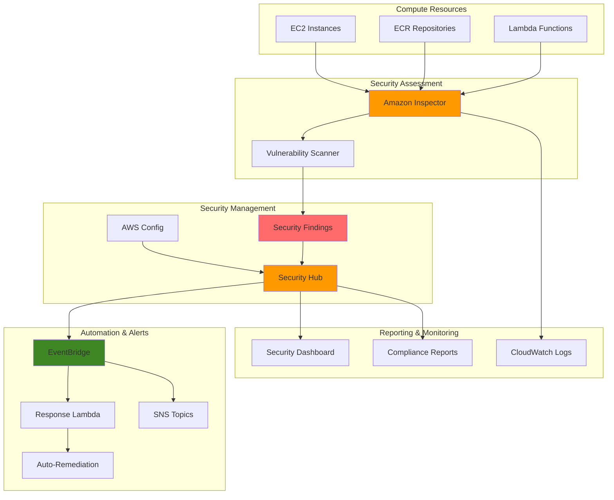

# Security Scanning Automation with Inspector


## Problem

Organizations struggle with continuous security assessment across their AWS environments, often relying on manual processes that are time-consuming and error-prone. Security teams need immediate visibility into vulnerabilities across EC2 instances, container images, and Lambda functions, but lack centralized reporting and automated remediation capabilities. Without automated security scanning, critical vulnerabilities may remain undetected for extended periods, exposing the organization to potential breaches and compliance violations.

## Solution

This solution implements an automated security scanning pipeline using Amazon Inspector for vulnerability assessment and AWS Security Hub for centralized security findings management. Inspector continuously scans EC2 instances, ECR container images, and Lambda functions for software vulnerabilities, while Security Hub aggregates and prioritizes findings from multiple security services. The integration includes automated workflows for compliance reporting, notification systems, and remediation triggers through EventBridge and Lambda functions.

## Architecture Diagram



## Prerequisites

1. AWS account with appropriate permissions for Inspector, Security Hub, EventBridge, and Lambda
2. AWS CLI v2 installed and configured (or AWS CloudShell)
3. Basic understanding of AWS security services and compliance frameworks
4. At least one EC2 instance, ECR repository, or Lambda function to scan
5. Estimated cost: $50-100/month for scanning 50 EC2 instances, 20 ECR repositories, and 10 Lambda functions

> **Note**: Inspector charges are based on the number of resources scanned. Security Hub charges are based on the number of security findings ingested and compliance checks performed.

## Preparation

```bash
# Set environment variables
export AWS_REGION=$(aws configure get region)
export AWS_ACCOUNT_ID=$(aws sts get-caller-identity \
    --query Account --output text)

# Generate unique identifiers for resources
RANDOM_SUFFIX=$(aws secretsmanager get-random-password \
    --exclude-punctuation --exclude-uppercase \
    --password-length 6 --require-each-included-type \
    --output text --query RandomPassword)

export SECURITY_HUB_ROLE_NAME="SecurityHubRole-${RANDOM_SUFFIX}"
export INSPECTOR_ROLE_NAME="InspectorRole-${RANDOM_SUFFIX}"
export LAMBDA_FUNCTION_NAME="security-response-handler-${RANDOM_SUFFIX}"
export SNS_TOPIC_NAME="security-alerts-${RANDOM_SUFFIX}"
export EVENTBRIDGE_RULE_NAME="security-findings-rule-${RANDOM_SUFFIX}"

# Create IAM trust policy for Security Hub
cat > security-hub-trust-policy.json << EOF
{
  "Version": "2012-10-17",
  "Statement": [
    {
      "Effect": "Allow",
      "Principal": {
        "Service": "securityhub.amazonaws.com"
      },
      "Action": "sts:AssumeRole"
    }
  ]
}
EOF

# Create IAM policy for Lambda response function
cat > lambda-response-policy.json << EOF
{
  "Version": "2012-10-17",
  "Statement": [
    {
      "Effect": "Allow",
      "Action": [
        "logs:CreateLogGroup",
        "logs:CreateLogStream",
        "logs:PutLogEvents",
        "securityhub:BatchImportFindings",
        "securityhub:BatchUpdateFindings",
        "sns:Publish",
        "inspector2:ListFindings",
        "inspector2:BatchGetFinding",
        "ec2:CreateTags",
        "ec2:DescribeInstances"
      ],
      "Resource": "*"
    }
  ]
}
EOF

echo "✅ Environment variables set and policy documents created"
```

## Steps

1. **Enable Security Hub and Inspector**:

   AWS Security Hub serves as the central security findings aggregator, providing a single pane of glass for security posture management across your AWS environment. Security Hub normalizes findings from multiple security services into the AWS Security Finding Format (ASFF), enabling consistent analysis and reporting. Amazon Inspector provides continuous vulnerability assessment for your compute resources, automatically scanning EC2 instances, container images in ECR, and Lambda functions for software vulnerabilities and network reachability issues.

   ```bash
   # Enable Security Hub
   aws securityhub enable-security-hub \
       --enable-default-standards \
       --region $AWS_REGION
   
   # Enable Inspector for EC2, ECR, and Lambda scanning
   aws inspector2 enable \
       --resource-types EC2 ECR LAMBDA \
       --region $AWS_REGION
   
   # Wait for services to initialize
   sleep 30
   
   echo "✅ Security Hub and Inspector enabled"
   ```

   Security Hub is now active and will begin collecting findings from Inspector and other integrated security services. Inspector will start scanning your resources for vulnerabilities, with findings automatically flowing into Security Hub for centralized management. This foundational step establishes the core security monitoring infrastructure required for automated vulnerability detection and response.

   > **Note**: Amazon Inspector provides continuous security vulnerability assessments without requiring agent installation on most resources. For detailed information about Inspector's scanning capabilities, see the [Amazon Inspector User Guide](https://docs.aws.amazon.com/inspector/latest/user/).

2. **Create SNS topic for security alerts**:

   Amazon Simple Notification Service (SNS) provides reliable, scalable messaging for distributing security alerts to stakeholders in real-time. By establishing dedicated notification channels, security teams can ensure immediate awareness of critical vulnerabilities and compliance violations. SNS supports multiple delivery protocols including email, SMS, and webhook endpoints, enabling flexible alerting strategies that integrate with existing incident response workflows.

   ```bash
   # Create SNS topic
   SNS_TOPIC_ARN=$(aws sns create-topic \
       --name $SNS_TOPIC_NAME \
       --query TopicArn --output text)
   
   # Subscribe an email address to the topic
   read -p "Enter email address for security alerts: " EMAIL_ADDRESS
   aws sns subscribe \
       --topic-arn $SNS_TOPIC_ARN \
       --protocol email \
       --notification-endpoint $EMAIL_ADDRESS
   
   echo "✅ SNS topic created: $SNS_TOPIC_ARN"
   ```

   The SNS topic is now configured and ready to receive security findings from our automated response system. The email subscription ensures that security teams receive immediate notifications for high-severity findings, enabling rapid response to critical vulnerabilities. This notification infrastructure forms a crucial component of the incident response pipeline.

3. **Create Lambda function for automated response**:

   AWS Lambda enables serverless execution of security response logic, providing cost-effective automation that scales automatically with the volume of security findings. The Lambda function acts as the orchestration hub for automated remediation workflows, processing Security Hub findings and triggering appropriate responses based on severity levels and resource types. This approach ensures consistent, rapid response to security threats while reducing manual intervention and human error.

   ```bash
   # Create Lambda function code
   cat > security-response-handler.py << 'EOF'
import json
import boto3
import logging
import os
from datetime import datetime

logger = logging.getLogger()
logger.setLevel(logging.INFO)

def lambda_handler(event, context):
    """
    Process Security Hub findings and trigger appropriate responses
    """
    try:
        # Parse the EventBridge event
        detail = event.get('detail', {})
        findings = detail.get('findings', [])
        
        sns = boto3.client('sns')
        securityhub = boto3.client('securityhub')
        
        for finding in findings:
            severity = finding.get('Severity', {}).get('Label', 'UNKNOWN')
            title = finding.get('Title', 'Security Finding')
            description = finding.get('Description', '')
            resource_id = finding.get('Resources', [{}])[0].get('Id', 'Unknown')
            
            # Create alert message
            message = {
                'timestamp': datetime.utcnow().isoformat(),
                'severity': severity,
                'title': title,
                'description': description,
                'resource': resource_id,
                'finding_id': finding.get('Id', ''),
                'aws_account': finding.get('AwsAccountId', ''),
                'region': finding.get('Region', '')
            }
            
            # Send notification for HIGH and CRITICAL findings
            if severity in ['HIGH', 'CRITICAL']:
                sns.publish(
                    TopicArn=os.environ['SNS_TOPIC_ARN'],
                    Subject=f"Security Alert: {severity} - {title}",
                    Message=json.dumps(message, indent=2)
                )
                logger.info(f"Sent alert for {severity} finding: {title}")
            
            # Auto-remediation logic for specific finding types
            if 'EC2' in resource_id and 'vulnerability' in title.lower():
                # Tag resources for remediation
                try:
                    ec2 = boto3.client('ec2')
                    instance_id = resource_id.split('/')[-1]
                    ec2.create_tags(
                        Resources=[instance_id],
                        Tags=[
                            {'Key': 'SecurityStatus', 'Value': 'RequiresPatching'},
                            {'Key': 'LastSecurityScan', 'Value': datetime.utcnow().isoformat()}
                        ]
                    )
                    logger.info(f"Tagged EC2 instance {instance_id} for remediation")
                except Exception as e:
                    logger.error(f"Failed to tag EC2 instance: {str(e)}")
        
        return {
            'statusCode': 200,
            'body': json.dumps({
                'message': f'Processed {len(findings)} security findings',
                'timestamp': datetime.utcnow().isoformat()
            })
        }
        
    except Exception as e:
        logger.error(f"Error processing security findings: {str(e)}")
        return {
            'statusCode': 500,
            'body': json.dumps({'error': str(e)})
        }
EOF

   # Create Lambda execution trust policy
   cat > lambda-execution-trust-policy.json << EOF
{
  "Version": "2012-10-17",
  "Statement": [
    {
      "Effect": "Allow",
      "Principal": {
        "Service": "lambda.amazonaws.com"
      },
      "Action": "sts:AssumeRole"
    }
  ]
}
EOF
   
   # Create IAM role for Lambda
   aws iam create-role \
       --role-name $LAMBDA_FUNCTION_NAME-role \
       --assume-role-policy-document file://lambda-execution-trust-policy.json
   
   # Attach basic Lambda execution policy
   aws iam attach-role-policy \
       --role-name $LAMBDA_FUNCTION_NAME-role \
       --policy-arn arn:aws:iam::aws:policy/service-role/AWSLambdaBasicExecutionRole
   
   # Create custom policy for Lambda
   LAMBDA_POLICY_ARN=$(aws iam create-policy \
       --policy-name $LAMBDA_FUNCTION_NAME-policy \
       --policy-document file://lambda-response-policy.json \
       --query Policy.Arn --output text)
   
   aws iam attach-role-policy \
       --role-name $LAMBDA_FUNCTION_NAME-role \
       --policy-arn $LAMBDA_POLICY_ARN
   
   # Wait for role to be available
   sleep 10
   
   # Create deployment package
   zip security-response-handler.zip security-response-handler.py
   
   # Create Lambda function
   LAMBDA_ARN=$(aws lambda create-function \
       --function-name $LAMBDA_FUNCTION_NAME \
       --runtime python3.9 \
       --role arn:aws:iam::$AWS_ACCOUNT_ID:role/$LAMBDA_FUNCTION_NAME-role \
       --handler security-response-handler.lambda_handler \
       --zip-file fileb://security-response-handler.zip \
       --environment Variables="{SNS_TOPIC_ARN=$SNS_TOPIC_ARN}" \
       --timeout 300 \
       --query FunctionArn --output text)
   
   echo "✅ Lambda function created: $LAMBDA_ARN"
   ```

   The automated response Lambda function is now deployed and configured with the necessary IAM permissions to process security findings and execute remediation actions. This function will automatically process incoming security findings, send notifications for critical issues, and tag affected resources for remediation tracking. The serverless architecture ensures the response system scales automatically with your security workload.

4. **Create EventBridge rule for Security Hub findings**:

   Amazon EventBridge provides event-driven integration between Security Hub and our automated response system. By creating targeted event rules, we ensure that only high-severity findings trigger immediate automated responses, optimizing resource usage and reducing alert fatigue. EventBridge's reliable event delivery and dead letter queue capabilities ensure that critical security events are never lost, while the rule-based filtering enables precise targeting of response actions.

   ```bash
   # Create EventBridge rule
   aws events put-rule \
       --name $EVENTBRIDGE_RULE_NAME \
       --event-pattern '{
         "source": ["aws.securityhub"],
         "detail-type": ["Security Hub Findings - Imported"],
         "detail": {
           "findings": {
             "Severity": {
               "Label": ["HIGH", "CRITICAL"]
             }
           }
         }
       }' \
       --description "Route high severity security findings to Lambda"
   
   # Add Lambda function as target
   aws events put-targets \
       --rule $EVENTBRIDGE_RULE_NAME \
       --targets "Id"="1","Arn"="$LAMBDA_ARN"
   
   # Give EventBridge permission to invoke Lambda
   aws lambda add-permission \
       --function-name $LAMBDA_FUNCTION_NAME \
       --statement-id "AllowEventBridge" \
       --action "lambda:InvokeFunction" \
       --principal events.amazonaws.com \
       --source-arn "arn:aws:events:$AWS_REGION:$AWS_ACCOUNT_ID:rule/$EVENTBRIDGE_RULE_NAME"
   
   echo "✅ EventBridge rule created and configured"
   ```

   EventBridge is now configured to automatically route high-severity security findings to our Lambda response function. This real-time integration enables immediate processing of critical vulnerabilities, ensuring rapid threat response and automated remediation actions. The event-driven architecture provides scalable, reliable security automation that responds within seconds of vulnerability detection.

   > **Warning**: EventBridge rules filter events based on exact pattern matching. Ensure your event patterns align with Security Hub's finding format to prevent missed alerts. For detailed information on EventBridge integration with Security Hub, see [Using EventBridge for automated response and remediation](https://docs.aws.amazon.com/securityhub/latest/userguide/securityhub-cloudwatch-events.html).

5. **Enable additional security standards in Security Hub**:

   Security Hub's compliance standards provide automated assessment against industry best practices and regulatory frameworks. The AWS Foundational Security Best Practices standard includes over 40 security controls covering IAM, encryption, networking, and logging configurations. The CIS AWS Foundations Benchmark provides additional controls based on the Center for Internet Security's recommendations, ensuring comprehensive coverage of security configurations across your AWS environment.

   ```bash
   # Enable AWS Foundational Security Best Practices
   aws securityhub batch-enable-standards \
       --standards-subscription-requests '[
         {
           "StandardsArn": "arn:aws:securityhub:'"$AWS_REGION"'::standard/aws-foundational-security-best-practices/v/1.0.0"
         },
         {
           "StandardsArn": "arn:aws:securityhub:'"$AWS_REGION"'::standard/cis-aws-foundations-benchmark/v/1.2.0"
         }
       ]'
   
   echo "✅ Additional security standards enabled"
   ```

   Security Hub will now continuously assess your AWS resources against multiple compliance frameworks, generating findings for any configuration drift or policy violations. These automated compliance checks provide ongoing validation of your security posture and help maintain adherence to industry standards and regulatory requirements.

6. **Configure Inspector scanning settings**:

   Amazon Inspector's hybrid scanning mode combines agentless and agent-based scanning techniques to provide comprehensive vulnerability coverage across your EC2 fleet. The hybrid approach automatically determines the optimal scanning method based on instance configuration and operating system, ensuring thorough assessment without manual agent management. ECR repository scanning with 30-day rescan intervals ensures container images are continuously monitored for newly discovered vulnerabilities.

   ```bash
   # Configure Inspector to scan EC2 instances with specific tags
   aws inspector2 update-configuration \
       --ec2-configuration '{
         "scanMode": "EC2_HYBRID"
       }' \
       --ecr-configuration '{
         "rescanDuration": "DAYS_30"
       }'
   
   # Create a test EC2 instance if none exists
   if ! aws ec2 describe-instances \
       --filters "Name=instance-state-name,Values=running" \
       --query 'Reservations[0].Instances[0].InstanceId' \
       --output text | grep -q "i-"; then
       
       # Get default VPC and subnet
       VPC_ID=$(aws ec2 describe-vpcs \
           --filters "Name=isDefault,Values=true" \
           --query 'Vpcs[0].VpcId' --output text)
       
       SUBNET_ID=$(aws ec2 describe-subnets \
           --filters "Name=vpc-id,Values=$VPC_ID" \
           --query 'Subnets[0].SubnetId' --output text)
       
       # Launch test instance
       INSTANCE_ID=$(aws ec2 run-instances \
           --image-id ami-0abcdef1234567890 \
           --instance-type t2.micro \
           --subnet-id $SUBNET_ID \
           --tag-specifications \
               'ResourceType=instance,Tags=[{Key=Name,Value=SecurityTestInstance},{Key=Environment,Value=Test}]' \
           --query 'Instances[0].InstanceId' --output text)
       
       echo "✅ Test EC2 instance created: $INSTANCE_ID"
   fi
   
   echo "✅ Inspector scanning configuration updated"
   ```

   Inspector is now configured for optimal scanning coverage with hybrid mode enabling both agentless and agent-based assessment capabilities. The 30-day ECR rescan interval ensures container images are regularly reassessed for new vulnerabilities as threat intelligence is updated. This configuration provides comprehensive visibility into your compute resources' security posture while minimizing operational overhead.

7. **Create Security Hub custom insights**:

   Security Hub insights provide customizable views of security findings, enabling security teams to focus on specific threat patterns and compliance requirements. Custom insights aggregate findings based on user-defined criteria, creating dashboard views that highlight priority security issues. These insights support data-driven security decision making by providing trending analysis and resource-specific vulnerability tracking.

   ```bash
   # Create custom insight for critical vulnerabilities
   aws securityhub create-insight \
       --name "Critical Vulnerabilities by Resource" \
       --filters '{
         "SeverityLabel": [{"Value": "CRITICAL", "Comparison": "EQUALS"}],
         "RecordState": [{"Value": "ACTIVE", "Comparison": "EQUALS"}]
       }' \
       --group-by-attribute "ResourceType"
   
   # Create insight for unpatched EC2 instances
   aws securityhub create-insight \
       --name "Unpatched EC2 Instances" \
       --filters '{
         "ResourceType": [{"Value": "AwsEc2Instance", "Comparison": "EQUALS"}],
         "ComplianceStatus": [{"Value": "FAILED", "Comparison": "EQUALS"}]
       }' \
       --group-by-attribute "ResourceId"
   
   echo "✅ Security Hub custom insights created"
   ```

   Custom insights are now configured to provide focused views of critical security issues and compliance violations. These insights will automatically update as new findings are discovered, providing real-time visibility into your most important security metrics. The resource-based grouping enables targeted remediation efforts and helps prioritize security team efforts based on asset criticality.

8. **Set up automated compliance reporting**:

   Automated compliance reporting ensures continuous visibility into security posture trends and regulatory compliance status. The weekly reporting schedule provides regular security metrics to stakeholders while maintaining historical tracking of vulnerability remediation progress. EventBridge's scheduled event capability enables reliable, cost-effective automation that operates independently of user intervention, ensuring consistent reporting cadence for compliance audits and security reviews.

   ```bash
   # Create Lambda function for compliance reporting
   cat > compliance-report-generator.py << 'EOF'
import json
import boto3
import csv
from datetime import datetime, timedelta
from io import StringIO

def lambda_handler(event, context):
    """
    Generate compliance report from Security Hub findings
    """
    try:
        securityhub = boto3.client('securityhub')
        s3 = boto3.client('s3')
        
        # Get findings from last 7 days
        end_time = datetime.utcnow()
        start_time = end_time - timedelta(days=7)
        
        paginator = securityhub.get_paginator('get_findings')
        findings = []
        
        for page in paginator.paginate(
            Filters={
                'CreatedAt': [
                    {
                        'Start': start_time.isoformat(),
                        'End': end_time.isoformat()
                    }
                ]
            }
        ):
            findings.extend(page['Findings'])
        
        # Generate CSV report
        csv_buffer = StringIO()
        writer = csv.writer(csv_buffer)
        
        # Write header
        writer.writerow([
            'Finding ID', 'Title', 'Severity', 'Resource Type', 
            'Resource ID', 'Compliance Status', 'Created Date'
        ])
        
        # Write findings
        for finding in findings:
            writer.writerow([
                finding.get('Id', ''),
                finding.get('Title', ''),
                finding.get('Severity', {}).get('Label', ''),
                finding.get('Resources', [{}])[0].get('Type', ''),
                finding.get('Resources', [{}])[0].get('Id', ''),
                finding.get('Compliance', {}).get('Status', ''),
                finding.get('CreatedAt', '')
            ])
        
        # Save report to S3 (optional)
        report_key = f"compliance-reports/security-findings-{datetime.utcnow().strftime('%Y%m%d')}.csv"
        
        return {
            'statusCode': 200,
            'body': json.dumps({
                'message': f'Generated compliance report with {len(findings)} findings',
                'report_size': len(findings),
                'timestamp': datetime.utcnow().isoformat()
            })
        }
        
    except Exception as e:
        return {
            'statusCode': 500,
            'body': json.dumps({'error': str(e)})
        }
EOF
   
   # Create compliance reporting Lambda function
   zip compliance-report-generator.zip compliance-report-generator.py
   
   COMPLIANCE_LAMBDA_ARN=$(aws lambda create-function \
       --function-name "compliance-report-generator-${RANDOM_SUFFIX}" \
       --runtime python3.9 \
       --role arn:aws:iam::$AWS_ACCOUNT_ID:role/$LAMBDA_FUNCTION_NAME-role \
       --handler compliance-report-generator.lambda_handler \
       --zip-file fileb://compliance-report-generator.zip \
       --timeout 300 \
       --query FunctionArn --output text)
   
   # Create EventBridge rule for weekly reporting
   aws events put-rule \
       --name "weekly-compliance-report-${RANDOM_SUFFIX}" \
       --schedule-expression "rate(7 days)" \
       --description "Generate weekly compliance report"
   
   # Add Lambda as target
   aws events put-targets \
       --rule "weekly-compliance-report-${RANDOM_SUFFIX}" \
       --targets "Id"="1","Arn"="$COMPLIANCE_LAMBDA_ARN"
   
   # Give EventBridge permission to invoke Lambda
   aws lambda add-permission \
       --function-name "compliance-report-generator-${RANDOM_SUFFIX}" \
       --statement-id "AllowEventBridgeWeekly" \
       --action "lambda:InvokeFunction" \
       --principal events.amazonaws.com \
       --source-arn "arn:aws:events:$AWS_REGION:$AWS_ACCOUNT_ID:rule/weekly-compliance-report-${RANDOM_SUFFIX}"
   
   echo "✅ Compliance reporting configured"
   ```

   Automated compliance reporting is now operational, providing weekly security posture summaries and vulnerability trend analysis. The Lambda-based reporting system will generate comprehensive security metrics and finding summaries, enabling data-driven security management and supporting regulatory compliance documentation requirements.

   > **Tip**: Configure CloudWatch Events with dead letter queues for critical scheduled tasks to ensure compliance reporting continues even during service disruptions. This ensures regulatory reporting requirements are consistently met.

## Validation & Testing

1. **Verify Inspector is scanning resources**:

   Amazon Inspector requires several minutes to begin scanning after enablement. The coverage statistics provide visibility into which resources are actively being assessed for vulnerabilities, while the coverage list shows the detailed scanning status for each resource type.

   ```bash
   # Check Inspector coverage statistics
   aws inspector2 get-coverage-statistics \
       --filter-criteria '{
         "resourceType": [{"comparison": "EQUALS", "value": "EC2_INSTANCE"}]
       }'
   
   # List active scans and their status
   aws inspector2 list-coverage \
       --filter-criteria '{
         "scanStatusCode": [{"comparison": "EQUALS", "value": "ACTIVE"}]
       }'
   
   # Verify Inspector is enabled for all resource types
   aws inspector2 batch-get-account-status \
       --account-ids $AWS_ACCOUNT_ID
   ```

   Expected output: Coverage statistics showing resources being scanned with ACTIVE status

2. **Check Security Hub findings**:

   Security Hub aggregates findings from Inspector and other security services, normalizing them into the AWS Security Finding Format (ASFF). This validation ensures that Inspector findings are properly flowing into Security Hub and being processed by the automated response system.

   ```bash
   # Get recent findings from Security Hub
   aws securityhub get-findings \
       --filters '{
         "CreatedAt": [
           {
             "Start": "'$(date -u -d '1 hour ago' '+%Y-%m-%dT%H:%M:%S.%3NZ')'",
             "End": "'$(date -u '+%Y-%m-%dT%H:%M:%S.%3NZ')'"
           }
         ]
       }' \
       --query 'Findings[*].[Title,Severity.Label,Resources[0].Type,ProductArn]' \
       --output table
   
   # Check Security Hub status and enabled standards
   aws securityhub get-enabled-standards \
       --query 'StandardsSubscriptions[*].[StandardsArn,StandardsStatus]' \
       --output table
   ```

   Expected output: Table showing recent security findings with their severity levels and source services

3. **Test EventBridge rule and Lambda function**:

   EventBridge rules require proper event formatting to trigger successfully. This test simulates a high-severity Security Hub finding to validate the entire automated response pipeline, from event detection through Lambda execution and SNS notification.

   ```bash
   # Trigger a test event to simulate Security Hub finding
   aws events put-events \
       --entries '[
         {
           "Source": "aws.securityhub",
           "DetailType": "Security Hub Findings - Imported",
           "Detail": "{\"findings\":[{\"Id\":\"test-finding-123\",\"Title\":\"Test Security Finding\",\"Description\":\"Test vulnerability for validation\",\"Severity\":{\"Label\":\"HIGH\"},\"Resources\":[{\"Id\":\"arn:aws:ec2:us-east-1:123456789012:instance/i-1234567890abcdef0\",\"Type\":\"AwsEc2Instance\"}],\"AwsAccountId\":\"$AWS_ACCOUNT_ID\",\"Region\":\"$AWS_REGION\"}]}"
         }
       ]'
   
   # Wait for processing
   sleep 10
   
   # Check Lambda function logs for execution
   aws logs describe-log-groups \
       --log-group-name-prefix "/aws/lambda/$LAMBDA_FUNCTION_NAME"
   
   # Get recent Lambda invocation logs
   LOG_GROUP="/aws/lambda/$LAMBDA_FUNCTION_NAME"
   aws logs filter-log-events \
       --log-group-name $LOG_GROUP \
       --start-time $(date -d '5 minutes ago' +%s)000 \
       --query 'events[*].message'
   ```

4. **Verify Security Hub insights**:

   Security Hub insights provide aggregated views of security findings, enabling rapid identification of trends and priority issues. These custom insights help security teams focus on the most critical vulnerabilities across their environment.

   ```bash
   # List all custom insights
   aws securityhub get-insights \
       --query 'Insights[*].[Name,GroupByAttribute,Filters]' \
       --output table
   
   # Get results from the first custom insight
   INSIGHT_ARN=$(aws securityhub get-insights \
       --query 'Insights[0].InsightArn' --output text)
   
   if [ "$INSIGHT_ARN" != "None" ]; then
       aws securityhub get-insight-results \
           --insight-arn "$INSIGHT_ARN" \
           --query 'InsightResults.ResultValues[*].[GroupByAttributeValue,Count]' \
           --output table
   fi
   
   # Verify Security Hub configuration
   aws securityhub describe-hub \
       --query '{HubArn:HubArn,SubscribedAt:SubscribedAt,AutoEnableControls:AutoEnableControls}'
   ```

## Cleanup

1. **Disable Inspector scanning**:

   ```bash
   # Disable Inspector
   aws inspector2 disable \
       --resource-types EC2 ECR LAMBDA
   
   echo "✅ Inspector scanning disabled"
   ```

2. **Remove EventBridge rules and Lambda functions**:

   ```bash
   # Remove EventBridge targets
   aws events remove-targets \
       --rule $EVENTBRIDGE_RULE_NAME \
       --ids "1"
   
   aws events remove-targets \
       --rule "weekly-compliance-report-${RANDOM_SUFFIX}" \
       --ids "1"
   
   # Delete EventBridge rules
   aws events delete-rule \
       --name $EVENTBRIDGE_RULE_NAME
   
   aws events delete-rule \
       --name "weekly-compliance-report-${RANDOM_SUFFIX}"
   
   # Delete Lambda functions
   aws lambda delete-function \
       --function-name $LAMBDA_FUNCTION_NAME
   
   aws lambda delete-function \
       --function-name "compliance-report-generator-${RANDOM_SUFFIX}"
   
   echo "✅ EventBridge rules and Lambda functions deleted"
   ```

3. **Remove IAM roles and policies**:

   ```bash
   # Detach and delete policies
   aws iam detach-role-policy \
       --role-name $LAMBDA_FUNCTION_NAME-role \
       --policy-arn arn:aws:iam::aws:policy/service-role/AWSLambdaBasicExecutionRole
   
   aws iam detach-role-policy \
       --role-name $LAMBDA_FUNCTION_NAME-role \
       --policy-arn $LAMBDA_POLICY_ARN
   
   aws iam delete-policy \
       --policy-arn $LAMBDA_POLICY_ARN
   
   aws iam delete-role \
       --role-name $LAMBDA_FUNCTION_NAME-role
   
   echo "✅ IAM roles and policies cleaned up"
   ```

4. **Delete SNS topic and disable Security Hub**:

   ```bash
   # Delete SNS topic
   aws sns delete-topic \
       --topic-arn $SNS_TOPIC_ARN
   
   # Disable Security Hub (optional - keeps historical data)
   aws securityhub disable-security-hub
   
   # Clean up local files
   rm -f security-hub-trust-policy.json
   rm -f lambda-response-policy.json
   rm -f security-response-handler.py
   rm -f security-response-handler.zip
   rm -f compliance-report-generator.py
   rm -f compliance-report-generator.zip
   
   echo "✅ All resources cleaned up"
   ```

## Discussion

This automated security scanning solution provides organizations with comprehensive visibility into their AWS security posture through the integration of Amazon Inspector and AWS Security Hub. The architecture enables continuous monitoring of vulnerabilities across EC2 instances, container images, and Lambda functions, while providing centralized management of security findings and automated response capabilities.

Amazon Inspector's hybrid scanning approach combines agent-based and agentless scanning methods to provide thorough vulnerability assessment without requiring manual installation of agents on every resource. The service automatically scans for software vulnerabilities and network reachability issues, providing detailed findings that include severity levels, affected packages, and remediation guidance. Security Hub acts as the central security findings aggregator, normalizing data from multiple sources into the AWS Security Finding Format (ASFF) for consistent analysis and reporting.

The EventBridge integration enables real-time automated responses to security findings, allowing organizations to implement immediate remediation actions for critical vulnerabilities. The Lambda-based response system can perform various automated tasks, from tagging affected resources to triggering patch management workflows. This automation reduces the mean time to remediation (MTTR) and ensures consistent response to security threats across the organization.

The solution's compliance reporting capabilities provide regular visibility into security posture trends and help organizations meet regulatory requirements. Custom insights in Security Hub allow security teams to create tailored views of their security data, focusing on specific resource types, severity levels, or compliance standards. For additional guidance on security automation, see the [AWS Security Hub User Guide](https://docs.aws.amazon.com/securityhub/latest/userguide/) and [Amazon Inspector User Guide](https://docs.aws.amazon.com/inspector/latest/user/). For specific guidance on vulnerability management programs, reference the [AWS Prescriptive Guidance on using Security Hub in vulnerability management](https://docs.aws.amazon.com/prescriptive-guidance/latest/vulnerability-management/aws-security-hub.html).

> **Tip**: Configure Inspector to run deep inspection on Linux instances to identify vulnerabilities in application dependencies and runtime packages that standard scanning might miss.

## Challenge

Extend this solution by implementing these enhancements:

1. **Multi-Account Security Hub Integration**: Configure Security Hub as a delegated administrator in AWS Organizations to aggregate findings across multiple AWS accounts and enable centralized security management.

2. **Custom Security Standards**: Create custom Security Hub standards that align with your organization's specific security policies and compliance requirements, including custom controls and automated remediation rules.

3. **Advanced Remediation Workflows**: Implement Step Functions workflows that orchestrate complex remediation processes, including patch management, resource isolation, and approval workflows for critical infrastructure changes.

4. **Security Metrics Dashboard**: Build a CloudWatch dashboard that displays key security metrics, vulnerability trends, and compliance posture using custom metrics generated from Security Hub findings.

5. **Integration with External Security Tools**: Connect Security Hub findings to external SIEM systems, ticketing platforms, or security orchestration tools through EventBridge custom event buses and API integrations.

## Infrastructure Code

*Infrastructure code will be generated after recipe approval.*