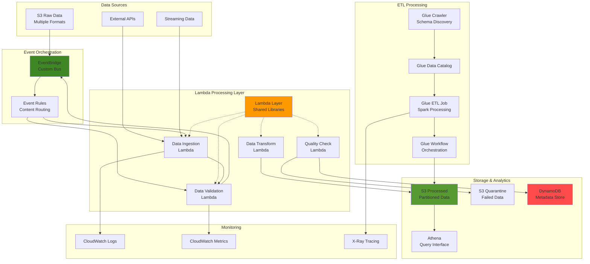

# Implementing Advanced Serverless Data Lake Architecture with Lambda Layers, Glue, and EventBridge

## Problem

Enterprise organizations struggle to build scalable data lake architectures that can handle complex data processing workflows while maintaining code reusability and efficient dependency management. Traditional approaches often result in duplicated code across multiple Lambda functions, large deployment packages, and tightly coupled data processing pipelines that are difficult to maintain and scale. Companies need a sophisticated serverless architecture that leverages shared libraries through Lambda layers, orchestrates complex ETL workflows, and provides event-driven processing capabilities while ensuring cost optimization and operational efficiency.

## Solution

Implement an advanced serverless data lake architecture using AWS Lambda layers for shared dependencies, AWS Glue for scalable ETL processing, and Amazon EventBridge for event-driven orchestration. This solution demonstrates enterprise-grade patterns including Lambda layer management for code reuse, automated data quality validation, cross-service communication through custom events, and intelligent data routing based on content and metadata. The architecture supports multiple data formats, provides real-time processing capabilities, and includes comprehensive monitoring and error handling mechanisms.

## Architecture Diagram



## Prerequisites

1. AWS account with appropriate permissions for Lambda, Glue, EventBridge, S3, DynamoDB, IAM, and CloudWatch
2. AWS CLI v2 installed and configured (or AWS CloudShell)
3. Advanced understanding of serverless architectures and data processing patterns
4. Python 3.9+ knowledge for Lambda function development
5. Understanding of ETL concepts and data lake architectures
6. Estimated cost: $15-25 for 4-6 hours of testing (includes Glue job execution time)

> **Note**: This recipe creates multiple AWS resources that will incur charges. Ensure you follow the cleanup steps to avoid ongoing costs.

## Preparation

```bash
# Set environment variables
export AWS_REGION=$(aws configure get region)
export AWS_ACCOUNT_ID=$(aws sts get-caller-identity \
    --query Account --output text)

# Generate unique identifiers
RANDOM_SUFFIX=$(aws secretsmanager get-random-password \
    --exclude-punctuation --exclude-uppercase \
    --password-length 6 --require-each-included-type \
    --output text --query RandomPassword)

export PROJECT_NAME="advanced-serverless-datalake-${RANDOM_SUFFIX}"
export LAMBDA_LAYER_NAME="${PROJECT_NAME}-shared-layer"
export CUSTOM_EVENT_BUS="${PROJECT_NAME}-event-bus"
export S3_BUCKET_RAW="${PROJECT_NAME}-raw-data"
export S3_BUCKET_PROCESSED="${PROJECT_NAME}-processed-data"
export S3_BUCKET_QUARANTINE="${PROJECT_NAME}-quarantine-data"
export DYNAMODB_METADATA_TABLE="${PROJECT_NAME}-metadata"
export GLUE_DATABASE="${PROJECT_NAME}_catalog"

# Create S3 buckets for data lake
aws s3 mb s3://${S3_BUCKET_RAW} --region ${AWS_REGION}
aws s3 mb s3://${S3_BUCKET_PROCESSED} --region ${AWS_REGION}
aws s3 mb s3://${S3_BUCKET_QUARANTINE} --region ${AWS_REGION}

echo "✅ Created S3 buckets for data lake"

# Create DynamoDB table for metadata
aws dynamodb create-table \
    --table-name ${DYNAMODB_METADATA_TABLE} \
    --attribute-definitions \
        AttributeName=ProcessId,AttributeType=S \
        AttributeName=Timestamp,AttributeType=S \
    --key-schema \
        AttributeName=ProcessId,KeyType=HASH \
        AttributeName=Timestamp,KeyType=RANGE \
    --billing-mode PAY_PER_REQUEST \
    --stream-specification StreamEnabled=true,StreamViewType=NEW_AND_OLD_IMAGES

echo "✅ Created DynamoDB metadata table"

# Wait for DynamoDB table to be active
aws dynamodb wait table-exists --table-name ${DYNAMODB_METADATA_TABLE}
```

## Steps

1. **Create IAM Roles for Lambda and Glue Services**:

   AWS Identity and Access Management (IAM) provides the security foundation for our serverless data lake architecture, implementing the principle of least privilege for resource access. Lambda functions require specific permissions to interact with S3, DynamoDB, EventBridge, and other AWS services, while Glue services need permissions for data catalog operations and S3 access. Properly configured IAM roles ensure secure service-to-service communication while preventing unauthorized access to sensitive data resources. Following [AWS IAM best practices](https://docs.aws.amazon.com/IAM/latest/UserGuide/best-practices.html), we create dedicated roles with minimal required permissions for each service component.

   ```bash
   # Create IAM role for Lambda functions
   cat > lambda-trust-policy.json << 'EOF'
   {
       "Version": "2012-10-17",
       "Statement": [
           {
               "Effect": "Allow",
               "Principal": {
                   "Service": "lambda.amazonaws.com"
               },
               "Action": "sts:AssumeRole"
           }
       ]
   }
   EOF
   
   aws iam create-role \
       --role-name ${PROJECT_NAME}-lambda-role \
       --assume-role-policy-document file://lambda-trust-policy.json
   
   # Create comprehensive Lambda policy
   cat > lambda-policy.json << EOF
   {
       "Version": "2012-10-17",
       "Statement": [
           {
               "Effect": "Allow",
               "Action": [
                   "logs:CreateLogGroup",
                   "logs:CreateLogStream",
                   "logs:PutLogEvents",
                   "logs:DescribeLogGroups",
                   "logs:DescribeLogStreams"
               ],
               "Resource": "arn:aws:logs:${AWS_REGION}:${AWS_ACCOUNT_ID}:*"
           },
           {
               "Effect": "Allow",
               "Action": [
                   "s3:GetObject",
                   "s3:PutObject",
                   "s3:DeleteObject",
                   "s3:ListBucket"
               ],
               "Resource": [
                   "arn:aws:s3:::${S3_BUCKET_RAW}/*",
                   "arn:aws:s3:::${S3_BUCKET_PROCESSED}/*",
                   "arn:aws:s3:::${S3_BUCKET_QUARANTINE}/*",
                   "arn:aws:s3:::${S3_BUCKET_RAW}",
                   "arn:aws:s3:::${S3_BUCKET_PROCESSED}",
                   "arn:aws:s3:::${S3_BUCKET_QUARANTINE}"
               ]
           },
           {
               "Effect": "Allow",
               "Action": [
                   "dynamodb:PutItem",
                   "dynamodb:GetItem",
                   "dynamodb:UpdateItem",
                   "dynamodb:Query",
                   "dynamodb:Scan"
               ],
               "Resource": "arn:aws:dynamodb:${AWS_REGION}:${AWS_ACCOUNT_ID}:table/${DYNAMODB_METADATA_TABLE}"
           },
           {
               "Effect": "Allow",
               "Action": [
                   "events:PutEvents"
               ],
               "Resource": "arn:aws:events:${AWS_REGION}:${AWS_ACCOUNT_ID}:event-bus/${CUSTOM_EVENT_BUS}"
           },
           {
               "Effect": "Allow",
               "Action": [
                   "glue:StartJobRun",
                   "glue:GetJobRun",
                   "glue:StartWorkflowRun",
                   "glue:GetWorkflowRun"
               ],
               "Resource": "*"
           },
           {
               "Effect": "Allow",
               "Action": [
                   "xray:PutTraceSegments",
                   "xray:PutTelemetryRecords"
               ],
               "Resource": "*"
           },
           {
               "Effect": "Allow",
               "Action": [
                   "cloudwatch:PutMetricData"
               ],
               "Resource": "*"
           }
       ]
   }
   EOF
   
   aws iam put-role-policy \
       --role-name ${PROJECT_NAME}-lambda-role \
       --policy-name ${PROJECT_NAME}-lambda-policy \
       --policy-document file://lambda-policy.json
   
   echo "✅ Created Lambda IAM role and policy"
   ```

   The IAM roles establish the security framework for our data lake architecture, ensuring each service component operates with appropriate permissions while maintaining strict security boundaries. These roles enable secure service-to-service communication and provide the authorization foundation necessary for Lambda functions to access S3 data, publish events to EventBridge, and store metadata in DynamoDB. The comprehensive policy configuration supports all data processing operations while adhering to AWS security best practices.

2. **Create Lambda Layer with Shared Libraries**:

   Lambda layers revolutionize serverless architecture by enabling code sharing across multiple functions, dramatically reducing deployment package sizes and ensuring consistent library versions throughout the data processing pipeline. This architectural pattern addresses the critical challenge of code duplication in enterprise serverless applications where similar data processing logic appears across multiple functions. Our shared layer includes common utilities for data validation, quality assessment, and event publishing, creating a reusable foundation that improves maintainability and development efficiency. According to the [AWS Lambda layers documentation](https://docs.aws.amazon.com/lambda/latest/dg/chapter-layers.html), layers provide separation between application logic and dependencies, enabling more efficient and maintainable serverless deployments.

   ```bash
   # Create directory structure for Lambda layer
   mkdir -p lambda-layer/python/lib/python3.9/site-packages
   
   # Create shared utilities module
   cat > lambda-layer/python/data_utils.py << 'EOF'
   import json
   import boto3
   import uuid
   import hashlib
   from datetime import datetime
   from typing import Dict, Any, List, Optional
   
   class DataProcessor:
       def __init__(self):
           self.s3_client = boto3.client('s3')
           self.dynamodb = boto3.resource('dynamodb')
           self.events_client = boto3.client('events')
   
       def generate_process_id(self, source: str, timestamp: str) -> str:
           """Generate unique process ID"""
           data = f"{source}-{timestamp}-{uuid.uuid4()}"
           return hashlib.md5(data.encode()).hexdigest()
   
       def validate_json_structure(self, data: Dict[str, Any], 
                                 required_fields: List[str]) -> bool:
           """Validate JSON data structure"""
           return all(field in data for field in required_fields)
   
       def calculate_data_quality_score(self, data: Dict[str, Any]) -> float:
           """Calculate data quality score based on completeness"""
           total_fields = len(data)
           non_null_fields = sum(1 for v in data.values() if v is not None and v != "")
           return (non_null_fields / total_fields) * 100 if total_fields > 0 else 0
   
       def publish_custom_event(self, event_bus: str, source: str, 
                               detail_type: str, detail: Dict[str, Any]):
           """Publish custom event to EventBridge"""
           self.events_client.put_events(
               Entries=[
                   {
                       'Source': source,
                       'DetailType': detail_type,
                       'Detail': json.dumps(detail),
                       'EventBusName': event_bus
                   }
               ]
           )
   
       def store_metadata(self, table_name: str, process_id: str, metadata: Dict[str, Any]):
           """Store processing metadata in DynamoDB"""
           table = self.dynamodb.Table(table_name)
           item = {
               'ProcessId': process_id,
               'Timestamp': datetime.utcnow().isoformat(),
               **metadata
           }
           table.put_item(Item=item)
   
   class DataValidator:
       @staticmethod
       def is_valid_email(email: str) -> bool:
           import re
           pattern = r'^[a-zA-Z0-9._%+-]+@[a-zA-Z0-9.-]+\.[a-zA-Z]{2,}$'
           return re.match(pattern, email) is not None
   
       @staticmethod
       def is_valid_phone(phone: str) -> bool:
           import re
           pattern = r'^\+?1?[2-9]\d{2}[2-9]\d{2}\d{4}$'
           return re.match(pattern, phone.replace('-', '').replace(' ', '')) is not None
   
       @staticmethod
       def is_valid_date_format(date_str: str, format: str = '%Y-%m-%d') -> bool:
           try:
               datetime.strptime(date_str, format)
               return True
           except ValueError:
               return False
   EOF
   
   # Create requirements.txt for layer dependencies
   cat > lambda-layer/python/requirements.txt << 'EOF'
   pandas==2.0.3
   numpy==1.24.3
   boto3==1.34.131
   jsonschema==4.19.2
   requests==2.31.0
   EOF
   
   # Install dependencies in the layer
   cd lambda-layer/python
   pip install -r requirements.txt -t lib/python3.9/site-packages/
   cd ../..
   
   # Package the layer
   cd lambda-layer && zip -r ../lambda-layer.zip . && cd ..
   
   # Create the Lambda layer
   aws lambda publish-layer-version \
       --layer-name ${LAMBDA_LAYER_NAME} \
       --description "Shared utilities for data lake processing" \
       --zip-file fileb://lambda-layer.zip \
       --compatible-runtimes python3.9 python3.10 python3.11 \
       --compatible-architectures x86_64 arm64
   
   LAYER_ARN=$(aws lambda list-layer-versions \
       --layer-name ${LAMBDA_LAYER_NAME} \
       --query 'LayerVersions[0].LayerVersionArn' --output text)
   
   echo "✅ Created Lambda layer: ${LAYER_ARN}"
   ```

   The Lambda layer establishes a shared code foundation that eliminates duplication across data processing functions while ensuring consistent library versions and utility functions. This architectural approach significantly reduces individual Lambda deployment package sizes and improves code maintainability by centralizing common data processing logic. The layer includes essential utilities for data validation, quality scoring, and event publishing, enabling Lambda functions to focus on their specific business logic rather than repeating infrastructure code throughout the data lake pipeline.

3. **Create Custom EventBridge Bus and Rules**:

   Amazon EventBridge serves as the central nervous system for our event-driven data lake architecture, providing intelligent event routing and decoupled communication between processing components. Custom event buses isolate data lake events from default AWS service events, preventing interference while enabling sophisticated workflow orchestration based on event content and metadata. EventBridge rules function as intelligent event routers, filtering and directing events to appropriate target services based on configurable patterns and conditions. This event-driven design enables dynamic scaling and adaptation to changing data processing requirements without creating tight coupling between architectural components. The [EventBridge event patterns documentation](https://docs.aws.amazon.com/eventbridge/latest/userguide/eb-event-patterns.html) provides comprehensive guidance for implementing effective event routing strategies in enterprise architectures.

   ```bash
   # Create custom EventBridge bus
   aws events create-event-bus --name ${CUSTOM_EVENT_BUS}
   
   # Create event rule for data ingestion events
   aws events put-rule \
       --name "${PROJECT_NAME}-data-ingestion-rule" \
       --event-pattern '{"source":["datalake.ingestion"],"detail-type":["Data Received"]}' \
       --state ENABLED \
       --event-bus-name ${CUSTOM_EVENT_BUS}
   
   # Create event rule for data validation events
   aws events put-rule \
       --name "${PROJECT_NAME}-data-validation-rule" \
       --event-pattern '{"source":["datalake.validation"],"detail-type":["Data Validated"]}' \
       --state ENABLED \
       --event-bus-name ${CUSTOM_EVENT_BUS}
   
   # Create event rule for data quality events
   aws events put-rule \
       --name "${PROJECT_NAME}-data-quality-rule" \
       --event-pattern '{"source":["datalake.quality"],"detail-type":["Quality Check Complete"]}' \
       --state ENABLED \
       --event-bus-name ${CUSTOM_EVENT_BUS}
   
   echo "✅ Created EventBridge custom bus and rules"
   ```

   The EventBridge infrastructure creates an intelligent event routing system that automatically orchestrates data processing workflows based on event content and type. The custom event bus and associated rules enable loosely coupled communication between Lambda functions, allowing for seamless addition of new processing stages and monitoring components without modifying existing code. This event-driven architecture provides the flexibility essential for evolving data lake requirements while maintaining reliable, automated processing workflows.

4. **Create Data Ingestion Lambda Function**:

   The data ingestion Lambda function serves as the primary entry point for all data entering our serverless data lake, implementing enterprise-grade patterns for data receipt, parsing, and workflow initiation. This function demonstrates sophisticated error handling, comprehensive metadata tracking, and event-driven communication that automatically responds to new data arrivals through S3 event notifications. By eliminating polling mechanisms and providing near real-time processing initiation, the function ensures efficient resource utilization and rapid data processing. The function's integration with our shared Lambda layer enables reusable utilities while maintaining focused, lean code for ingestion-specific operations, following serverless best practices for maintainable, scalable applications.

   ```bash
   # Create data ingestion function
   cat > data-ingestion-lambda.py << EOF
   import json
   import boto3
   import os
   from datetime import datetime
   from data_utils import DataProcessor
   
   def lambda_handler(event, context):
       processor = DataProcessor()
       
       # Extract event information
       bucket = event['Records'][0]['s3']['bucket']['name']
       key = event['Records'][0]['s3']['object']['key']
       
       # Generate process ID
       process_id = processor.generate_process_id(bucket, datetime.utcnow().isoformat())
       
       try:
           # Download and process the file
           s3_response = processor.s3_client.get_object(Bucket=bucket, Key=key)
           file_content = s3_response['Body'].read().decode('utf-8')
           
           # Determine file type and process accordingly
           if key.endswith('.json'):
               data = json.loads(file_content)
               data_type = 'json'
           elif key.endswith('.csv'):
               # For CSV files, we'll pass the raw content
               data = {'raw_content': file_content, 'type': 'csv'}
               data_type = 'csv'
           else:
               data = {'raw_content': file_content, 'type': 'unknown'}
               data_type = 'unknown'
           
           # Store metadata
           metadata = {
               'SourceBucket': bucket,
               'SourceKey': key,
               'FileSize': len(file_content),
               'DataType': data_type,
               'Status': 'ingested',
               'ProcessingStage': 'ingestion'
           }
           
           processor.store_metadata(
               table_name=os.environ['METADATA_TABLE'],
               process_id=process_id,
               metadata=metadata
           )
           
           # Publish ingestion event
           event_detail = {
               'processId': process_id,
               'bucket': bucket,
               'key': key,
               'dataType': data_type,
               'fileSize': len(file_content)
           }
           
           processor.publish_custom_event(
               event_bus=os.environ['CUSTOM_EVENT_BUS'],
               source='datalake.ingestion',
               detail_type='Data Received',
               detail=event_detail
           )
           
           return {
               'statusCode': 200,
               'body': json.dumps({
                   'processId': process_id,
                   'message': 'Data ingested successfully'
               })
           }
           
       except Exception as e:
           print(f"Error processing file: {str(e)}")
           
           # Store error metadata
           error_metadata = {
               'SourceBucket': bucket,
               'SourceKey': key,
               'Status': 'failed',
               'ProcessingStage': 'ingestion',
               'ErrorMessage': str(e)
           }
           
           processor.store_metadata(
               table_name=os.environ['METADATA_TABLE'],
               process_id=process_id,
               metadata=error_metadata
           )
           
           return {
               'statusCode': 500,
               'body': json.dumps({'error': str(e)})
           }
   EOF
   
   # Package the function
   zip data-ingestion-lambda.zip data-ingestion-lambda.py
   
   # Create the Lambda function
   aws lambda create-function \
       --function-name "${PROJECT_NAME}-data-ingestion" \
       --runtime python3.9 \
       --role "arn:aws:iam::${AWS_ACCOUNT_ID}:role/${PROJECT_NAME}-lambda-role" \
       --handler data-ingestion-lambda.lambda_handler \
       --zip-file fileb://data-ingestion-lambda.zip \
       --timeout 300 \
       --memory-size 512 \
       --layers ${LAYER_ARN} \
       --environment Variables="{\
           \"METADATA_TABLE\":\"${DYNAMODB_METADATA_TABLE}\",\
           \"CUSTOM_EVENT_BUS\":\"${CUSTOM_EVENT_BUS}\",\
           \"PROCESSED_BUCKET\":\"${S3_BUCKET_PROCESSED}\"\
       }" \
       --tracing-config Mode=Active
   
   echo "✅ Created data ingestion Lambda function"
   ```

   The data ingestion function establishes the automated entry point for our data lake pipeline, providing robust file processing capabilities with comprehensive error handling and metadata tracking. This foundational component automatically responds to new data arrivals, processes files based on format detection, and publishes ingestion events to trigger downstream validation workflows. The function's metadata tracking ensures complete data lineage and audit trails, while its error handling maintains pipeline reliability even when processing malformed or problematic data files.

5. **Create Data Validation Lambda Function**:

   Data validation forms a critical quality gate in enterprise data lake architectures, ensuring only high-quality, properly structured data progresses through processing pipelines while maintaining data integrity standards. This Lambda function implements comprehensive validation logic including schema validation, data type checking, field-level validation, and business rule enforcement based on configurable quality thresholds. The function demonstrates advanced event-driven processing by consuming EventBridge events from the ingestion stage and making intelligent routing decisions based on validation results. Data failing quality checks is automatically quarantined for investigation, while validated data proceeds to subsequent processing stages, maintaining strict quality controls throughout the pipeline while supporting data governance requirements.

   ```bash
   # Create data validation function
   cat > data-validation-lambda.py << EOF
   import json
   import boto3
   import os
   from data_utils import DataProcessor, DataValidator
   
   def lambda_handler(event, context):
       processor = DataProcessor()
       validator = DataValidator()
       
       # Parse EventBridge event
       detail = event['detail']
       process_id = detail['processId']
       bucket = detail['bucket']
       key = detail['key']
       data_type = detail['dataType']
       
       try:
           # Download the file for validation
           s3_response = processor.s3_client.get_object(Bucket=bucket, Key=key)
           file_content = s3_response['Body'].read().decode('utf-8')
           
           validation_results = {
               'processId': process_id,
               'validationPassed': True,
               'validationErrors': [],
               'qualityScore': 0
           }
           
           if data_type == 'json':
               try:
                   data = json.loads(file_content)
                   
                   # Validate required fields (example schema)
                   required_fields = ['id', 'timestamp', 'data']
                   if not processor.validate_json_structure(data, required_fields):
                       validation_results['validationPassed'] = False
                       validation_results['validationErrors'].append('Missing required fields')
                   
                   # Calculate quality score
                   validation_results['qualityScore'] = processor.calculate_data_quality_score(data)
                   
                   # Additional field validations
                   if 'email' in data and not validator.is_valid_email(data['email']):
                       validation_results['validationErrors'].append('Invalid email format')
                   
                   if 'phone' in data and not validator.is_valid_phone(data['phone']):
                       validation_results['validationErrors'].append('Invalid phone format')
                   
               except json.JSONDecodeError:
                   validation_results['validationPassed'] = False
                   validation_results['validationErrors'].append('Invalid JSON format')
           
           elif data_type == 'csv':
               # Basic CSV validation
               lines = file_content.strip().split('\n')
               if len(lines) < 2:  # Header + at least one data row
                   validation_results['validationPassed'] = False
                   validation_results['validationErrors'].append('CSV file must have header and data rows')
               else:
                   validation_results['qualityScore'] = 85.0  # Default score for valid CSV
           
           # Determine destination based on validation
           if validation_results['validationPassed'] and validation_results['qualityScore'] >= 70:
               destination_bucket = os.environ['PROCESSED_BUCKET']
               destination_prefix = 'validated/'
               status = 'validated'
           else:
               destination_bucket = os.environ['QUARANTINE_BUCKET']
               destination_prefix = 'quarantine/'
               status = 'quarantined'
           
           # Copy file to appropriate destination
           destination_key = f"{destination_prefix}{key}"
           processor.s3_client.copy_object(
               CopySource={'Bucket': bucket, 'Key': key},
               Bucket=destination_bucket,
               Key=destination_key
           )
           
           # Update metadata
           metadata = {
               'Status': status,
               'ProcessingStage': 'validation',
               'ValidationPassed': validation_results['validationPassed'],
               'QualityScore': validation_results['qualityScore'],
               'ValidationErrors': validation_results['validationErrors'],
               'DestinationBucket': destination_bucket,
               'DestinationKey': destination_key
           }
           
           processor.store_metadata(
               table_name=os.environ['METADATA_TABLE'],
               process_id=process_id,
               metadata=metadata
           )
           
           # Publish validation event
           processor.publish_custom_event(
               event_bus=os.environ['CUSTOM_EVENT_BUS'],
               source='datalake.validation',
               detail_type='Data Validated',
               detail=validation_results
           )
           
           return {
               'statusCode': 200,
               'body': json.dumps(validation_results)
           }
           
       except Exception as e:
           print(f"Error validating data: {str(e)}")
           return {
               'statusCode': 500,
               'body': json.dumps({'error': str(e)})
           }
   EOF
   
   # Package and create the function
   zip data-validation-lambda.zip data-validation-lambda.py
   
   aws lambda create-function \
       --function-name "${PROJECT_NAME}-data-validation" \
       --runtime python3.9 \
       --role "arn:aws:iam::${AWS_ACCOUNT_ID}:role/${PROJECT_NAME}-lambda-role" \
       --handler data-validation-lambda.lambda_handler \
       --zip-file fileb://data-validation-lambda.zip \
       --timeout 300 \
       --memory-size 512 \
       --layers ${LAYER_ARN} \
       --environment Variables="{\
           \"METADATA_TABLE\":\"${DYNAMODB_METADATA_TABLE}\",\
           \"CUSTOM_EVENT_BUS\":\"${CUSTOM_EVENT_BUS}\",\
           \"PROCESSED_BUCKET\":\"${S3_BUCKET_PROCESSED}\",\
           \"QUARANTINE_BUCKET\":\"${S3_BUCKET_QUARANTINE}\"\
       }" \
       --tracing-config Mode=Active
   
   echo "✅ Created data validation Lambda function"
   ```

   The data validation function establishes comprehensive quality controls that ensure only high-quality, properly structured data progresses through subsequent processing stages while automatically quarantining problematic data for investigation. This critical quality gate implements sophisticated validation logic including schema validation, field-level checks, and configurable quality scoring that maintains data integrity throughout the entire pipeline. The function's EventBridge integration enables seamless workflow orchestration, automatically triggering downstream processing based on validation results.

6. **Create Glue Components for ETL Processing**:

   AWS Glue provides enterprise-scale ETL capabilities that complement our serverless Lambda processing functions by handling large-scale data transformations and schema management tasks that exceed Lambda's processing capabilities and time limits. The Glue Data Catalog serves as a centralized metadata repository that automatically discovers and catalogs data schemas, enabling analytics tools and reporting systems to understand data structure and relationships. Glue crawlers automate schema detection and table creation processes, reducing manual maintenance overhead while ensuring data catalog accuracy as data evolves. This integration bridges the gap between real-time Lambda processing and batch-oriented analytics workloads, providing the comprehensive data processing capabilities required for enterprise data lake implementations. The [AWS Glue crawlers documentation](https://docs.aws.amazon.com/glue/latest/dg/add-crawler.html) provides detailed guidance on optimizing crawler performance and scheduling for various data sources and formats.

   ```bash
   # Create IAM role for Glue
   cat > glue-trust-policy.json << 'EOF'
   {
       "Version": "2012-10-17",
       "Statement": [
           {
               "Effect": "Allow",
               "Principal": {
                   "Service": "glue.amazonaws.com"
               },
               "Action": "sts:AssumeRole"
           }
       ]
   }
   EOF
   
   aws iam create-role \
       --role-name ${PROJECT_NAME}-glue-role \
       --assume-role-policy-document file://glue-trust-policy.json
   
   # Attach managed policies to Glue role
   aws iam attach-role-policy \
       --role-name ${PROJECT_NAME}-glue-role \
       --policy-arn arn:aws:iam::aws:policy/service-role/AWSGlueServiceRole
   
   # Create custom policy for S3 access
   cat > glue-s3-policy.json << EOF
   {
       "Version": "2012-10-17",
       "Statement": [
           {
               "Effect": "Allow",
               "Action": [
                   "s3:GetObject",
                   "s3:PutObject",
                   "s3:DeleteObject",
                   "s3:ListBucket"
               ],
               "Resource": [
                   "arn:aws:s3:::${S3_BUCKET_PROCESSED}/*",
                   "arn:aws:s3:::${S3_BUCKET_PROCESSED}"
               ]
           }
       ]
   }
   EOF
   
   aws iam put-role-policy \
       --role-name ${PROJECT_NAME}-glue-role \
       --policy-name S3AccessPolicy \
       --policy-document file://glue-s3-policy.json
   
   # Create Glue database
   aws glue create-database \
       --database-input Name=${GLUE_DATABASE},Description="Data lake catalog database"
   
   # Create Glue crawler
   aws glue create-crawler \
       --name "${PROJECT_NAME}-crawler" \
       --role "arn:aws:iam::${AWS_ACCOUNT_ID}:role/${PROJECT_NAME}-glue-role" \
       --database-name ${GLUE_DATABASE} \
       --targets S3Targets="[{\"Path\":\"s3://${S3_BUCKET_PROCESSED}/validated/\"}]" \
       --schedule "cron(0 */6 * * ? *)"
   
   echo "✅ Created Glue database and crawler"
   ```

   The Glue infrastructure establishes enterprise-scale ETL capabilities and automated schema management that enables self-service analytics across the organization. The Glue database provides a centralized catalog for data discovery and lineage tracking, while the scheduled crawler automatically maintains current schema information as data structures evolve. This automated catalog management reduces operational overhead and ensures analytics tools always have access to current data structure information, enabling business users to perform self-service analytics without requiring deep technical knowledge of underlying data formats.

7. **Configure Event-Driven Integration**:

   Event-driven integration represents the architectural culmination of our serverless data lake, connecting all components through automated event flows that eliminate manual intervention while ensuring rapid, reliable data processing workflows. S3 event notifications automatically trigger Lambda functions when new data arrives, while EventBridge rules intelligently route processing events to appropriate downstream functions based on event content, metadata, and processing context. This integration pattern creates a self-orchestrating data pipeline that scales automatically with data volume, adapts to different data types and processing requirements, and maintains loose coupling between components. The configuration demonstrates enterprise-grade automation principles that reduce operational overhead while improving processing reliability, speed, and maintainability throughout the data lake ecosystem.

   ```bash
   # Add S3 event notification to trigger ingestion
   cat > s3-notification-config.json << EOF
   {
       "LambdaConfigurations": [
           {
               "Id": "DataIngestionTrigger",
               "LambdaFunctionArn": "arn:aws:lambda:${AWS_REGION}:${AWS_ACCOUNT_ID}:function:${PROJECT_NAME}-data-ingestion",
               "Events": ["s3:ObjectCreated:*"],
               "Filter": {
                   "Key": {
                       "FilterRules": [
                           {
                               "Name": "prefix",
                               "Value": "input/"
                           }
                       ]
                   }
               }
           }
       ]
   }
   EOF
   
   # Apply S3 notification configuration
   aws s3api put-bucket-notification-configuration \
       --bucket ${S3_BUCKET_RAW} \
       --notification-configuration file://s3-notification-config.json
   
   # Add permission for S3 to invoke Lambda
   aws lambda add-permission \
       --function-name "${PROJECT_NAME}-data-ingestion" \
       --principal s3.amazonaws.com \
       --action lambda:InvokeFunction \
       --source-arn "arn:aws:s3:::${S3_BUCKET_RAW}" \
       --statement-id s3-trigger-permission
   
   # Add EventBridge targets for validation function
   aws events put-targets \
       --rule "${PROJECT_NAME}-data-ingestion-rule" \
       --event-bus-name ${CUSTOM_EVENT_BUS} \
       --targets "Id"="1","Arn"="arn:aws:lambda:${AWS_REGION}:${AWS_ACCOUNT_ID}:function:${PROJECT_NAME}-data-validation"
   
   # Add permission for EventBridge to invoke validation Lambda
   aws lambda add-permission \
       --function-name "${PROJECT_NAME}-data-validation" \
       --principal events.amazonaws.com \
       --action lambda:InvokeFunction \
       --source-arn "arn:aws:events:${AWS_REGION}:${AWS_ACCOUNT_ID}:rule/${CUSTOM_EVENT_BUS}/${PROJECT_NAME}-data-ingestion-rule" \
       --statement-id eventbridge-validation-permission
   
   echo "✅ Configured event-driven integration"
   ```

   The event-driven integration completes our automated data processing pipeline by establishing seamless communication flows between all architectural components through intelligent event routing and secure service-to-service communication. S3 events automatically trigger data ingestion workflows, EventBridge rules route processing events to appropriate target functions, and Lambda permissions enable secure cross-service communication. This fully automated workflow eliminates manual intervention while providing the flexibility to add new processing stages, monitoring components, and integration points as data lake requirements evolve.

8. **Create Quality Monitoring Lambda Function**:

   Quality monitoring provides essential observability for enterprise data lake operations by enabling proactive identification of data quality trends, processing performance metrics, and potential issues before they impact downstream analytics and business operations. This Lambda function demonstrates advanced CloudWatch metrics integration, calculating and publishing key performance indicators that provide real-time visibility into validation success rates, quality scores, processing volumes, and pipeline health metrics. The function's event-driven activation ensures continuous quality monitoring without requiring scheduled jobs or resource-intensive polling mechanisms, providing immediate feedback on data pipeline performance and enabling rapid response to quality degradation or processing anomalies that could affect business decision-making.

   ```bash
   # Create quality monitoring function
   cat > quality-monitoring-lambda.py << EOF
   import json
   import boto3
   import os
   from data_utils import DataProcessor
   from datetime import datetime, timedelta
   
   def lambda_handler(event, context):
       processor = DataProcessor()
       cloudwatch = boto3.client('cloudwatch')
       
       # Parse EventBridge event
       detail = event['detail']
       process_id = detail['processId']
       quality_score = detail.get('qualityScore', 0)
       validation_passed = detail.get('validationPassed', False)
       
       try:
           # Calculate quality metrics over time
           end_time = datetime.utcnow()
           start_time = end_time - timedelta(hours=1)
           
           # Query recent processing metadata
           dynamodb = boto3.resource('dynamodb')
           table = dynamodb.Table(os.environ['METADATA_TABLE'])
           
           # Scan for recent records (in production, use GSI for better performance)
           response = table.scan(
               FilterExpression='ProcessingStage = :stage',
               ExpressionAttributeValues={':stage': 'validation'}
           )
           
           # Calculate aggregate metrics
           total_records = len(response['Items'])
           passed_records = sum(1 for item in response['Items'] 
                              if item.get('ValidationPassed', False))
           avg_quality_score = sum(float(item.get('QualityScore', 0)) 
                                 for item in response['Items']) / max(total_records, 1)
           
           # Publish CloudWatch metrics
           cloudwatch.put_metric_data(
               Namespace='DataLake/Quality',
               MetricData=[
                   {
                       'MetricName': 'ValidationSuccessRate',
                       'Value': (passed_records / max(total_records, 1)) * 100,
                       'Unit': 'Percent',
                       'Dimensions': [
                           {
                               'Name': 'Pipeline',
                               'Value': os.environ.get('PROJECT_NAME', 'unknown')
                           }
                       ]
                   },
                   {
                       'MetricName': 'AverageQualityScore',
                       'Value': avg_quality_score,
                       'Unit': 'None',
                       'Dimensions': [
                           {
                               'Name': 'Pipeline',
                               'Value': os.environ.get('PROJECT_NAME', 'unknown')
                           }
                       ]
                   },
                   {
                       'MetricName': 'ProcessedRecords',
                       'Value': total_records,
                       'Unit': 'Count',
                       'Dimensions': [
                           {
                               'Name': 'Pipeline',
                               'Value': os.environ.get('PROJECT_NAME', 'unknown')
                           }
                       ]
                   }
               ]
           )
           
           # Store aggregated quality metadata
           quality_metadata = {
               'TotalRecords': total_records,
               'PassedRecords': passed_records,
               'SuccessRate': (passed_records / max(total_records, 1)) * 100,
               'AverageQualityScore': avg_quality_score,
               'ProcessingStage': 'quality_monitoring'
           }
           
           processor.store_metadata(
               table_name=os.environ['METADATA_TABLE'],
               process_id=f"quality-{datetime.utcnow().isoformat()}",
               metadata=quality_metadata
           )
           
           return {
               'statusCode': 200,
               'body': json.dumps({
                   'message': 'Quality metrics updated',
                   'metrics': quality_metadata
               })
           }
           
       except Exception as e:
           print(f"Error monitoring quality: {str(e)}")
           return {
               'statusCode': 500,
               'body': json.dumps({'error': str(e)})
           }
   EOF
   
   # Package and create the function
   zip quality-monitoring-lambda.zip quality-monitoring-lambda.py
   
   aws lambda create-function \
       --function-name "${PROJECT_NAME}-quality-monitoring" \
       --runtime python3.9 \
       --role "arn:aws:iam::${AWS_ACCOUNT_ID}:role/${PROJECT_NAME}-lambda-role" \
       --handler quality-monitoring-lambda.lambda_handler \
       --zip-file fileb://quality-monitoring-lambda.zip \
       --timeout 300 \
       --memory-size 256 \
       --layers ${LAYER_ARN} \
       --environment Variables="{\
           \"METADATA_TABLE\":\"${DYNAMODB_METADATA_TABLE}\",\
           \"PROJECT_NAME\":\"${PROJECT_NAME}\"\
       }" \
       --tracing-config Mode=Active
   
   # Add EventBridge target for quality monitoring
   aws events put-targets \
       --rule "${PROJECT_NAME}-data-validation-rule" \
       --event-bus-name ${CUSTOM_EVENT_BUS} \
       --targets "Id"="1","Arn"="arn:aws:lambda:${AWS_REGION}:${AWS_ACCOUNT_ID}:function:${PROJECT_NAME}-quality-monitoring"
   
   # Add permission for EventBridge to invoke quality monitoring Lambda
   aws lambda add-permission \
       --function-name "${PROJECT_NAME}-quality-monitoring" \
       --principal events.amazonaws.com \
       --action lambda:InvokeFunction \
       --source-arn "arn:aws:events:${AWS_REGION}:${AWS_ACCOUNT_ID}:rule/${CUSTOM_EVENT_BUS}/${PROJECT_NAME}-data-validation-rule" \
       --statement-id eventbridge-quality-permission
   
   echo "✅ Created quality monitoring Lambda function"
   ```

   The quality monitoring function establishes comprehensive observability capabilities that provide real-time visibility into data quality trends, processing performance, and pipeline health metrics throughout our data lake architecture. CloudWatch metrics integration enables automated alerting when quality thresholds are breached, while detailed metadata tracking supports root cause analysis and continuous improvement initiatives. This monitoring capability is essential for enterprise data lake operations where data quality directly impacts business decision-making, regulatory compliance, and analytical accuracy across the organization.

## Validation & Testing

1. **Create test data files and upload to trigger the pipeline**:

   ```bash
   # Create test JSON data
   cat > test-data.json << 'EOF'
   {
       "id": "12345",
       "timestamp": "2024-01-15T10:30:00Z",
       "data": {
           "temperature": 23.5,
           "humidity": 65.2,
           "location": "sensor-01"
       },
       "email": "test@example.com",
       "phone": "+1-555-123-4567",
       "metadata": {
           "source": "iot-device",
           "version": "1.0"
       }
   }
   EOF
   
   # Upload test file to trigger the pipeline
   aws s3 cp test-data.json s3://${S3_BUCKET_RAW}/input/test-data.json
   
   echo "✅ Uploaded test data file"
   ```

2. **Monitor Lambda function execution**:

   ```bash
   # Wait a moment for processing
   sleep 30
   
   # Check CloudWatch logs for ingestion function
   aws logs describe-log-groups \
       --log-group-name-prefix "/aws/lambda/${PROJECT_NAME}-data-ingestion" \
       --query 'logGroups[0].logGroupName' --output text
   
   # Check recent log events
   INGESTION_LOG_GROUP="/aws/lambda/${PROJECT_NAME}-data-ingestion"
   aws logs describe-log-streams \
       --log-group-name ${INGESTION_LOG_GROUP} \
       --order-by LastEventTime --descending \
       --max-items 1 \
       --query 'logStreams[0].logStreamName' --output text
   ```

3. **Verify data processing pipeline results**:

   ```bash
   # Check processed data in S3
   echo "Checking processed data bucket:"
   aws s3 ls s3://${S3_BUCKET_PROCESSED}/validated/ --recursive
   
   # Check quarantine bucket (should be empty for valid data)
   echo "Checking quarantine bucket:"
   aws s3 ls s3://${S3_BUCKET_QUARANTINE}/quarantine/ --recursive
   
   # Query metadata from DynamoDB
   echo "Checking processing metadata:"
   aws dynamodb scan \
       --table-name ${DYNAMODB_METADATA_TABLE} \
       --query 'Items[0]' \
       --output table
   ```

4. **Test data validation with invalid data**:

   ```bash
   # Create invalid test data
   cat > invalid-data.json << 'EOF'
   {
       "id": "67890",
       "data": {
           "temperature": "invalid"
       },
       "email": "invalid-email",
       "phone": "invalid-phone"
   }
   EOF
   
   # Upload invalid data to test validation
   aws s3 cp invalid-data.json s3://${S3_BUCKET_RAW}/input/invalid-data.json
   
   # Wait and check quarantine bucket
   sleep 30
   echo "Checking quarantine bucket after invalid data:"
   aws s3 ls s3://${S3_BUCKET_QUARANTINE}/quarantine/ --recursive
   ```

5. **Verify EventBridge event flow**:

   ```bash
   # Check CloudWatch metrics for the pipeline
   aws cloudwatch get-metric-statistics \
       --namespace "DataLake/Quality" \
       --metric-name "ValidationSuccessRate" \
       --dimensions Name=Pipeline,Value=${PROJECT_NAME} \
       --start-time $(date -u -d '1 hour ago' +%Y-%m-%dT%H:%M:%S) \
       --end-time $(date -u +%Y-%m-%dT%H:%M:%S) \
       --period 3600 \
       --statistics Average \
       --output table
   ```

## Cleanup

1. **Remove EventBridge configuration**:

   ```bash
   # Remove EventBridge targets
   aws events remove-targets \
       --rule "${PROJECT_NAME}-data-ingestion-rule" \
       --event-bus-name ${CUSTOM_EVENT_BUS} \
       --ids 1
   
   aws events remove-targets \
       --rule "${PROJECT_NAME}-data-validation-rule" \
       --event-bus-name ${CUSTOM_EVENT_BUS} \
       --ids 1
   
   # Delete EventBridge rules
   aws events delete-rule \
       --name "${PROJECT_NAME}-data-ingestion-rule" \
       --event-bus-name ${CUSTOM_EVENT_BUS}
   
   aws events delete-rule \
       --name "${PROJECT_NAME}-data-validation-rule" \
       --event-bus-name ${CUSTOM_EVENT_BUS}
   
   aws events delete-rule \
       --name "${PROJECT_NAME}-data-quality-rule" \
       --event-bus-name ${CUSTOM_EVENT_BUS}
   
   # Delete custom event bus
   aws events delete-event-bus --name ${CUSTOM_EVENT_BUS}
   
   echo "✅ Cleaned up EventBridge configuration"
   ```

2. **Delete Lambda functions and layer**:

   ```bash
   # Delete Lambda functions
   aws lambda delete-function --function-name "${PROJECT_NAME}-data-ingestion"
   aws lambda delete-function --function-name "${PROJECT_NAME}-data-validation"
   aws lambda delete-function --function-name "${PROJECT_NAME}-quality-monitoring"
   
   # Delete Lambda layer
   aws lambda delete-layer-version \
       --layer-name ${LAMBDA_LAYER_NAME} \
       --version-number 1
   
   echo "✅ Deleted Lambda functions and layer"
   ```

3. **Remove Glue components**:

   ```bash
   # Delete Glue crawler
   aws glue delete-crawler --name "${PROJECT_NAME}-crawler"
   
   # Delete Glue database
   aws glue delete-database --name ${GLUE_DATABASE}
   
   echo "✅ Deleted Glue components"
   ```

4. **Delete IAM roles and policies**:

   ```bash
   # Detach and delete Lambda role policies
   aws iam delete-role-policy \
       --role-name ${PROJECT_NAME}-lambda-role \
       --policy-name ${PROJECT_NAME}-lambda-policy
   
   aws iam delete-role --role-name ${PROJECT_NAME}-lambda-role
   
   # Detach and delete Glue role policies
   aws iam detach-role-policy \
       --role-name ${PROJECT_NAME}-glue-role \
       --policy-arn arn:aws:iam::aws:policy/service-role/AWSGlueServiceRole
   
   aws iam delete-role-policy \
       --role-name ${PROJECT_NAME}-glue-role \
       --policy-name S3AccessPolicy
   
   aws iam delete-role --role-name ${PROJECT_NAME}-glue-role
   
   echo "✅ Deleted IAM roles and policies"
   ```

5. **Delete storage resources**:

   ```bash
   # Empty and delete S3 buckets
   aws s3 rm s3://${S3_BUCKET_RAW} --recursive
   aws s3 rm s3://${S3_BUCKET_PROCESSED} --recursive
   aws s3 rm s3://${S3_BUCKET_QUARANTINE} --recursive
   
   aws s3 rb s3://${S3_BUCKET_RAW}
   aws s3 rb s3://${S3_BUCKET_PROCESSED}
   aws s3 rb s3://${S3_BUCKET_QUARANTINE}
   
   # Delete DynamoDB table
   aws dynamodb delete-table --table-name ${DYNAMODB_METADATA_TABLE}
   
   # Clean up local files
   rm -f *.json *.zip *.py lambda-layer.zip
   rm -rf lambda-layer/
   
   echo "✅ Deleted storage resources and cleaned up local files"
   ```

## Discussion

This advanced serverless data lake architecture demonstrates enterprise-grade patterns for building scalable, maintainable data processing pipelines that address critical challenges in modern data engineering through sophisticated architectural choices and best practices.

**Lambda Layers for Code Reusability**: The implementation showcases how Lambda layers enable efficient code sharing across multiple functions, dramatically reducing deployment package sizes while ensuring consistent library versions throughout the processing pipeline. The shared `data_utils` module provides common functionality for data validation, quality assessment, and event publishing, eliminating code duplication and improving maintainability across the entire data lake ecosystem. This pattern proves particularly valuable in large organizations where multiple teams develop data processing functions, enabling standardized approaches to common data operations while reducing development overhead and potential inconsistencies.

**Event-Driven Architecture with EventBridge**: The custom EventBridge bus creates a sophisticated, loosely coupled system where components communicate through intelligent event routing rather than direct service invocations. This architectural approach enables seamless addition of new processing stages, monitoring components, and third-party integrations without requiring modifications to existing functions or creating tight coupling between services. The event patterns and rules provide sophisticated routing capabilities based on data characteristics, content types, and processing results, allowing for complex workflow orchestration that adapts dynamically to changing business requirements and data processing needs.

**Comprehensive Data Quality Management**: The pipeline implements multi-layered data quality controls including structural validation, content validation, field-level checks, and configurable scoring mechanisms that ensure only high-quality data progresses through processing stages. Data failing quality checks is automatically routed to quarantine storage for investigation and remediation, while comprehensive metadata tracking provides complete audit trails for compliance and data lineage requirements. The CloudWatch metrics integration enables real-time monitoring of data quality trends, automated alerting when quality thresholds are breached, and detailed reporting capabilities essential for enterprise data governance and regulatory compliance initiatives.

The serverless architecture supports horizontal scaling through auto-scaling components that dynamically adjust to workload demands, while cost optimization is achieved through pay-per-use pricing models and intelligent data lifecycle management policies. The integration with AWS Glue provides enterprise-scale ETL capabilities for complex batch processing requirements, while Lambda functions efficiently handle real-time processing needs, creating a hybrid architecture that optimizes both performance and cost-effectiveness across different data processing scenarios.

> **Tip**: Consider implementing API Gateway with Lambda authorizers for secure external data submission endpoints, extending this architecture to support real-time data ingestion from external systems while maintaining security and access control standards.

## Challenge

Extend this serverless data lake architecture with these advanced enhancements:

1. **Implement real-time streaming analytics** by integrating Amazon Kinesis Data Streams and Kinesis Analytics to process high-velocity data alongside the batch processing pipeline, with automatic failover between streaming and batch modes based on data velocity and processing requirements.

2. **Add machine learning-powered data classification** using Amazon Comprehend and Amazon Textract to automatically categorize and tag incoming data based on content analysis, with dynamic routing rules that adapt processing workflows based on classification results and confidence scores.

3. **Create a self-healing pipeline** that automatically retries failed processing jobs with exponential backoff, escalates persistent failures to operations teams, and implements circuit breaker patterns to prevent cascade failures across the data lake while maintaining processing continuity.

4. **Build a comprehensive data lineage tracking system** that captures complete data provenance from source to destination, including transformation history, quality scores over time, processing timestamps, and dependency mapping between datasets for compliance and impact analysis.

5. **Implement advanced security controls** including field-level encryption for PII data using AWS KMS, automatic data masking for non-production environments, integration with AWS Lake Formation for fine-grained access control, and comprehensive audit logging for security monitoring and compliance reporting.

## Infrastructure Code

### Available Infrastructure as Code:

- [Infrastructure Code Overview](code/README.md) - Detailed description of all infrastructure components
- [AWS CDK (Python)](code/cdk-python/) - AWS CDK Python implementation
- [AWS CDK (TypeScript)](code/cdk-typescript/) - AWS CDK TypeScript implementation
- [CloudFormation](code/cloudformation.yaml) - AWS CloudFormation template
- [Bash CLI Scripts](code/scripts/) - Example bash scripts using AWS CLI commands to deploy infrastructure
- [Terraform](code/terraform/) - Terraform configuration files