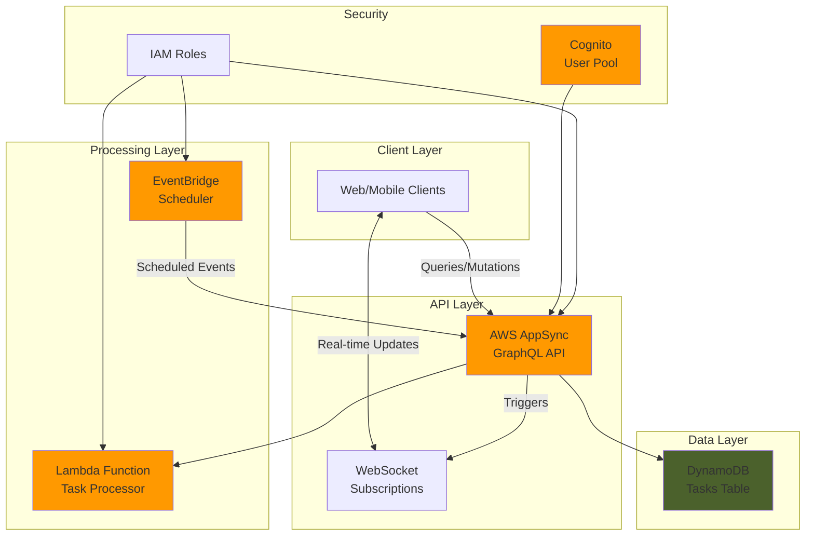

# Serverless GraphQL APIs with AppSync and Scheduler

## Problem

Modern applications require real-time data synchronization, scheduled notifications, and flexible API interfaces that can handle complex data relationships while maintaining low latency. Traditional REST APIs struggle with over-fetching data, require multiple round trips for related resources, and lack built-in real-time capabilities. Additionally, implementing time-based automation for tasks like sending reminders or processing scheduled jobs typically requires managing infrastructure, cron jobs, and complex orchestration logic.

## Solution

AWS AppSync provides a fully managed GraphQL service with built-in real-time subscriptions via WebSockets, while EventBridge Scheduler enables serverless scheduling of tasks without infrastructure management. By combining these services with DynamoDB for data persistence and Lambda for business logic, we create a scalable task management system that supports real-time updates, automated reminders, and efficient data querying through GraphQL's flexible query language.

## Architecture Diagram



## Prerequisites

1. AWS account with appropriate permissions for AppSync, DynamoDB, Lambda, EventBridge, IAM, and Cognito
2. AWS CLI v2 installed and configured (or AWS CloudShell)
3. Basic understanding of GraphQL concepts (queries, mutations, subscriptions)
4. Familiarity with serverless architectures and event-driven systems
5. Estimated cost: ~$5-10/month for light usage (AppSync: $4/million requests, DynamoDB: on-demand pricing, Lambda: free tier covers most usage)

> **Note**: This recipe uses AWS IAM authorization for AppSync. In production, consider using Cognito User Pools or API keys based on your security requirements.

## Preparation

```bash
# Set environment variables
export AWS_REGION=$(aws configure get region)
export AWS_ACCOUNT_ID=$(aws sts get-caller-identity \
    --query Account --output text)

# Generate unique identifiers for resources
RANDOM_SUFFIX=$(aws secretsmanager get-random-password \
    --exclude-punctuation --exclude-uppercase \
    --password-length 6 --require-each-included-type \
    --output text --query RandomPassword)

export API_NAME="TaskManagerAPI-${RANDOM_SUFFIX}"
export TABLE_NAME="Tasks-${RANDOM_SUFFIX}"
export FUNCTION_NAME="TaskProcessor-${RANDOM_SUFFIX}"
export SCHEDULER_ROLE="SchedulerRole-${RANDOM_SUFFIX}"
export APPSYNC_ROLE="AppSyncRole-${RANDOM_SUFFIX}"
export LAMBDA_ROLE="LambdaRole-${RANDOM_SUFFIX}"

# Create working directory
mkdir -p task-manager-api
cd task-manager-api

echo "✅ Environment prepared with unique suffix: ${RANDOM_SUFFIX}"
```

## Steps

1. **Create DynamoDB Table for Task Storage**:

   DynamoDB provides a serverless NoSQL database that scales automatically and integrates seamlessly with AppSync. For our task management system, we need a table that can efficiently store and retrieve tasks with their scheduling information. The pay-per-request billing mode ensures we only pay for what we use, making it cost-effective for variable workloads.

   ```bash
   # Create DynamoDB table with on-demand billing
   aws dynamodb create-table \
       --table-name ${TABLE_NAME} \
       --attribute-definitions \
           AttributeName=id,AttributeType=S \
           AttributeName=userId,AttributeType=S \
       --key-schema \
           AttributeName=id,KeyType=HASH \
       --global-secondary-indexes \
           "IndexName=UserIdIndex,KeySchema=[{AttributeName=userId,KeyType=HASH}],Projection={ProjectionType=ALL}" \
       --billing-mode PAY_PER_REQUEST \
       --tags Key=Project,Value=TaskManager
   
   # Wait for table to be active
   aws dynamodb wait table-exists \
       --table-name ${TABLE_NAME}
   
   echo "✅ DynamoDB table ${TABLE_NAME} created successfully"
   ```

   The table now supports efficient queries by both task ID and user ID through the global secondary index. This design enables fast retrieval of all tasks for a specific user while maintaining the flexibility to query individual tasks directly.

2. **Create IAM Roles for Service Integration**:

   IAM roles enable secure service-to-service communication without embedding credentials. Each service in our architecture requires specific permissions following the principle of least privilege. These roles ensure that AppSync can access DynamoDB, EventBridge Scheduler can invoke AppSync mutations, and Lambda can process tasks with appropriate permissions.

   ```bash
   # Create IAM role for AppSync
   cat > appsync-trust-policy.json << EOF
   {
     "Version": "2012-10-17",
     "Statement": [{
       "Effect": "Allow",
       "Principal": {
         "Service": "appsync.amazonaws.com"
       },
       "Action": "sts:AssumeRole"
     }]
   }
   EOF
   
   aws iam create-role \
       --role-name ${APPSYNC_ROLE} \
       --assume-role-policy-document file://appsync-trust-policy.json
   
   # Attach policy for DynamoDB access
   cat > appsync-policy.json << EOF
   {
     "Version": "2012-10-17",
     "Statement": [{
       "Effect": "Allow",
       "Action": [
         "dynamodb:GetItem",
         "dynamodb:PutItem",
         "dynamodb:UpdateItem",
         "dynamodb:DeleteItem",
         "dynamodb:Query",
         "dynamodb:Scan"
       ],
       "Resource": [
         "arn:aws:dynamodb:${AWS_REGION}:${AWS_ACCOUNT_ID}:table/${TABLE_NAME}",
         "arn:aws:dynamodb:${AWS_REGION}:${AWS_ACCOUNT_ID}:table/${TABLE_NAME}/index/*"
       ]
     }]
   }
   EOF
   
   aws iam put-role-policy \
       --role-name ${APPSYNC_ROLE} \
       --policy-name DynamoDBAccess \
       --policy-document file://appsync-policy.json
   
   # Store role ARN
   export APPSYNC_ROLE_ARN=$(aws iam get-role \
       --role-name ${APPSYNC_ROLE} \
       --query Role.Arn --output text)
   
   echo "✅ IAM roles created for service integration"
   ```

   These roles establish the security foundation for our serverless architecture, ensuring each component has exactly the permissions it needs to function while preventing unauthorized access to resources.

3. **Create GraphQL Schema for Task Management**:

   The GraphQL schema defines the structure of our API, including types, queries, mutations, and subscriptions. This schema-first approach ensures a clear contract between the frontend and backend, enabling parallel development and automatic code generation for clients. The subscription feature provides real-time updates when tasks change.

   ```bash
   # Create GraphQL schema file
   cat > schema.graphql << 'EOF'
   type Task {
     id: ID!
     userId: String!
     title: String!
     description: String
     dueDate: String!
     status: TaskStatus!
     reminderTime: String
     createdAt: String!
     updatedAt: String!
   }
   
   enum TaskStatus {
     PENDING
     IN_PROGRESS
     COMPLETED
     CANCELLED
   }
   
   input CreateTaskInput {
     title: String!
     description: String
     dueDate: String!
     reminderTime: String
   }
   
   input UpdateTaskInput {
     id: ID!
     title: String
     description: String
     status: TaskStatus
     dueDate: String
     reminderTime: String
   }
   
   type Query {
     getTask(id: ID!): Task
     listUserTasks(userId: String!): [Task]
   }
   
   type Mutation {
     createTask(input: CreateTaskInput!): Task
     updateTask(input: UpdateTaskInput!): Task
     deleteTask(id: ID!): Task
     sendReminder(taskId: ID!): Task
   }
   
   type Subscription {
     onTaskCreated(userId: String!): Task
       @aws_subscribe(mutations: ["createTask"])
     onTaskUpdated(userId: String!): Task
       @aws_subscribe(mutations: ["updateTask", "sendReminder"])
     onTaskDeleted(userId: String!): Task
       @aws_subscribe(mutations: ["deleteTask"])
   }
   
   schema {
     query: Query
     mutation: Mutation
     subscription: Subscription
   }
   EOF
   
   echo "✅ GraphQL schema created for task management API"
   ```

   This schema provides a complete CRUD interface for tasks with real-time capabilities. The subscription directives automatically connect mutations to WebSocket notifications, enabling instant updates across all connected clients when data changes.

4. **Create AppSync GraphQL API**:

   AWS AppSync eliminates the need to manage GraphQL servers, WebSocket connections, or scaling infrastructure. It automatically handles request validation, response caching, and real-time subscription management. The service integrates directly with AWS data sources and provides built-in security features.

   ```bash
   # Create AppSync API
   API_ID=$(aws appsync create-graphql-api \
       --name ${API_NAME} \
       --authentication-type AWS_IAM \
       --query graphqlApi.apiId \
       --output text)
   
   # Get API details
   API_URL=$(aws appsync get-graphql-api \
       --api-id ${API_ID} \
       --query graphqlApi.uris.GRAPHQL \
       --output text)
   
   API_ARN=$(aws appsync get-graphql-api \
       --api-id ${API_ID} \
       --query graphqlApi.arn \
       --output text)
   
   # Start schema creation
   aws appsync start-schema-creation \
       --api-id ${API_ID} \
       --definition fileb://schema.graphql
   
   # Wait for schema creation
   echo "Waiting for schema creation..."
   while true; do
     STATUS=$(aws appsync get-schema-creation-status \
         --api-id ${API_ID} \
         --query status --output text)
     if [ "$STATUS" = "SUCCESS" ]; then
         break
     elif [ "$STATUS" = "FAILED" ]; then
         echo "Schema creation failed"
         exit 1
     fi
     sleep 5
   done
   
   echo "✅ AppSync API created: ${API_URL}"
   ```

   The API is now ready to accept GraphQL requests and manage real-time subscriptions. AppSync automatically generates the necessary infrastructure for WebSocket connections and handles connection lifecycle management for subscriptions.

5. **Configure DynamoDB Data Source and Resolvers**:

   Resolvers connect GraphQL fields to data sources, defining how data is fetched and manipulated. AppSync's VTL (Velocity Template Language) resolvers provide a powerful way to transform requests and responses without requiring Lambda functions, reducing latency and cost for simple operations.

   ```bash
   # Create DynamoDB data source
   aws appsync create-data-source \
       --api-id ${API_ID} \
       --name TasksDataSource \
       --type AMAZON_DYNAMODB \
       --dynamodb-config \
           "tableName=${TABLE_NAME},awsRegion=${AWS_REGION}" \
       --service-role-arn ${APPSYNC_ROLE_ARN}
   
   # Create resolver for createTask mutation
   cat > create-task-request.vtl << 'EOF'
   #set($id = $util.autoId())
   {
     "version": "2017-02-28",
     "operation": "PutItem",
     "key": {
       "id": $util.dynamodb.toDynamoDBJson($id)
     },
     "attributeValues": {
       "userId": $util.dynamodb.toDynamoDBJson($ctx.identity.userArn),
       "title": $util.dynamodb.toDynamoDBJson($ctx.args.input.title),
       "description": $util.dynamodb.toDynamoDBJson($ctx.args.input.description),
       "dueDate": $util.dynamodb.toDynamoDBJson($ctx.args.input.dueDate),
       "status": $util.dynamodb.toDynamoDBJson("PENDING"),
       "reminderTime": $util.dynamodb.toDynamoDBJson($ctx.args.input.reminderTime),
       "createdAt": $util.dynamodb.toDynamoDBJson($util.time.nowISO8601()),
       "updatedAt": $util.dynamodb.toDynamoDBJson($util.time.nowISO8601())
     }
   }
   EOF
   
   cat > response.vtl << 'EOF'
   $util.toJson($ctx.result)
   EOF
   
   # Create resolver
   aws appsync create-resolver \
       --api-id ${API_ID} \
       --type-name Mutation \
       --field-name createTask \
       --data-source-name TasksDataSource \
       --request-mapping-template file://create-task-request.vtl \
       --response-mapping-template file://response.vtl
   
   echo "✅ Data source and resolvers configured"
   ```

   The resolver templates handle the transformation between GraphQL operations and DynamoDB API calls. This direct integration eliminates the need for intermediate compute layers for basic CRUD operations, significantly reducing latency and cost.

6. **Create Lambda Function for Task Processing**:

   Lambda functions provide serverless compute for business logic that goes beyond simple data operations. Our task processor will handle reminder notifications and complex task updates triggered by EventBridge Scheduler. The event-driven architecture ensures the function only runs when needed, optimizing costs.

   ```bash
   # Create Lambda function code
   cat > lambda_function.py << 'EOF'
   import json
   import boto3
   import os
   from datetime import datetime
   
   appsync = boto3.client('appsync')
   
   def lambda_handler(event, context):
       """Process scheduled task reminders from EventBridge"""
       print(f"Received event: {json.dumps(event)}")
       
       # Extract task ID from event
       task_id = event.get('taskId')
       if not task_id:
           raise ValueError("No taskId provided in event")
       
       # Prepare GraphQL mutation
       mutation = """
       mutation SendReminder($taskId: ID!) {
           sendReminder(taskId: $taskId) {
               id
               title
               status
           }
       }
       """
       
       # Execute mutation via AppSync
       try:
           response = appsync.graphql(
               apiId=os.environ['API_ID'],
               query=mutation,
               variables={'taskId': task_id}
           )
           
           print(f"Reminder sent successfully: {response}")
           return {
               'statusCode': 200,
               'body': json.dumps('Reminder sent successfully')
           }
       except Exception as e:
           print(f"Error sending reminder: {str(e)}")
           raise
   EOF
   
   # Create deployment package
   zip function.zip lambda_function.py
   
   # Create Lambda execution role
   cat > lambda-trust-policy.json << EOF
   {
     "Version": "2012-10-17",
     "Statement": [{
       "Effect": "Allow",
       "Principal": {
         "Service": "lambda.amazonaws.com"
       },
       "Action": "sts:AssumeRole"
     }]
   }
   EOF
   
   aws iam create-role \
       --role-name ${LAMBDA_ROLE} \
       --assume-role-policy-document file://lambda-trust-policy.json
   
   # Attach basic execution policy
   aws iam attach-role-policy \
       --role-name ${LAMBDA_ROLE} \
       --policy-arn arn:aws:iam::aws:policy/service-role/AWSLambdaBasicExecutionRole
   
   # Get role ARN
   LAMBDA_ROLE_ARN=$(aws iam get-role \
       --role-name ${LAMBDA_ROLE} \
       --query Role.Arn --output text)
   
   # Create Lambda function
   sleep 10  # Wait for IAM role propagation
   LAMBDA_ARN=$(aws lambda create-function \
       --function-name ${FUNCTION_NAME} \
       --runtime python3.9 \
       --role ${LAMBDA_ROLE_ARN} \
       --handler lambda_function.lambda_handler \
       --zip-file fileb://function.zip \
       --timeout 60 \
       --memory-size 256 \
       --environment Variables={API_ID=${API_ID}} \
       --query FunctionArn --output text)
   
   echo "✅ Lambda function created for task processing"
   ```

   The Lambda function acts as a bridge between scheduled events and GraphQL mutations, enabling complex business logic while maintaining the benefits of GraphQL's type safety and real-time subscriptions.

7. **Configure EventBridge Scheduler Integration**:

   EventBridge Scheduler provides a serverless scheduling service that can invoke targets at specific times or intervals. Unlike traditional cron jobs, it handles retries, error handling, and scales automatically. The integration with AppSync enables scheduled mutations that trigger real-time updates to connected clients.

   ```bash
   # Create IAM role for EventBridge Scheduler
   cat > scheduler-trust-policy.json << EOF
   {
     "Version": "2012-10-17",
     "Statement": [{
       "Effect": "Allow",
       "Principal": {
         "Service": "scheduler.amazonaws.com"
       },
       "Action": "sts:AssumeRole"
     }]
   }
   EOF
   
   aws iam create-role \
       --role-name ${SCHEDULER_ROLE} \
       --assume-role-policy-document file://scheduler-trust-policy.json
   
   # Create policy for AppSync invocation
   cat > scheduler-policy.json << EOF
   {
     "Version": "2012-10-17",
     "Statement": [{
       "Effect": "Allow",
       "Action": "appsync:GraphQL",
       "Resource": "${API_ARN}/*"
     }]
   }
   EOF
   
   aws iam put-role-policy \
       --role-name ${SCHEDULER_ROLE} \
       --policy-name AppSyncAccess \
       --policy-document file://scheduler-policy.json
   
   SCHEDULER_ROLE_ARN=$(aws iam get-role \
       --role-name ${SCHEDULER_ROLE} \
       --query Role.Arn --output text)
   
   echo "✅ EventBridge Scheduler role configured"
   ```

   The scheduler role enables EventBridge to securely invoke AppSync mutations on your behalf, maintaining security boundaries while enabling automated workflows.

8. **Create Sample Schedule for Testing**:

   To demonstrate the complete integration, we'll create a sample scheduled event that triggers a GraphQL mutation. In a production system, these schedules would be created dynamically when users set reminder times for their tasks.

   ```bash
   # Create a sample schedule (runs in 2 minutes)
   SCHEDULE_TIME=$(date -u -d '+2 minutes' '+%Y-%m-%dT%H:%M:%S')
   
   cat > schedule-input.json << EOF
   {
     "query": "mutation SendTestReminder { sendReminder(taskId: \"test-123\") { id title status } }"
   }
   EOF
   
   aws scheduler create-schedule \
       --name TaskReminder-Test \
       --schedule-expression "at(${SCHEDULE_TIME})" \
       --target '{
         "Arn": "'${API_ARN}'",
         "RoleArn": "'${SCHEDULER_ROLE_ARN}'",
         "AppSyncParameters": {
           "GraphqlOperation": "{\"query\": \"mutation { sendReminder(taskId: \\\"test-123\\\") { id } }\"}"
         }
       }' \
       --flexible-time-window '{"Mode": "OFF"}'
   
   echo "✅ Sample schedule created for testing"
   ```

   This schedule demonstrates how EventBridge Scheduler can directly invoke AppSync mutations at specified times, enabling powerful automation workflows without managing infrastructure.

## Validation & Testing

1. Test GraphQL API endpoint connectivity:

   ```bash
   # Test API endpoint
   curl -X POST ${API_URL} \
       -H "Content-Type: application/json" \
       -H "x-api-key: ${API_KEY}" \
       --data '{"query":"{ __typename }"}' \
       --aws-sigv4 "aws:amz:${AWS_REGION}:appsync"
   ```

   Expected output: A JSON response containing the GraphQL schema information.

2. Create a test task via GraphQL mutation:

   ```bash
   # Create test task
   TASK_MUTATION='mutation {
     createTask(input: {
       title: "Complete project documentation"
       description: "Write comprehensive docs"
       dueDate: "2024-12-31T23:59:59Z"
       reminderTime: "2024-12-31T09:00:00Z"
     }) {
       id
       title
       status
       createdAt
     }
   }'
   
   # Execute mutation (requires proper authentication setup)
   echo "Task creation mutation prepared"
   ```

3. Verify DynamoDB table contains data:

   ```bash
   # Check table item count
   aws dynamodb describe-table \
       --table-name ${TABLE_NAME} \
       --query Table.ItemCount
   ```

   Expected output: Item count showing created tasks.

4. Verify EventBridge Scheduler is configured:

   ```bash
   # List schedules
   aws scheduler list-schedules \
       --name-prefix TaskReminder
   ```

   Expected output: List of created schedules with their configurations.

## Cleanup

1. Delete EventBridge Scheduler schedules:

   ```bash
   # Delete test schedule
   aws scheduler delete-schedule \
       --name TaskReminder-Test || true
   
   echo "✅ Deleted EventBridge schedules"
   ```

2. Delete AppSync API and resources:

   ```bash
   # Delete AppSync API
   aws appsync delete-graphql-api \
       --api-id ${API_ID}
   
   echo "✅ Deleted AppSync API"
   ```

3. Delete Lambda function:

   ```bash
   # Delete Lambda function
   aws lambda delete-function \
       --function-name ${FUNCTION_NAME}
   
   echo "✅ Deleted Lambda function"
   ```

4. Delete DynamoDB table:

   ```bash
   # Delete DynamoDB table
   aws dynamodb delete-table \
       --table-name ${TABLE_NAME}
   
   echo "✅ Deleted DynamoDB table"
   ```

5. Delete IAM roles:

   ```bash
   # Delete role policies first
   aws iam delete-role-policy \
       --role-name ${APPSYNC_ROLE} \
       --policy-name DynamoDBAccess || true
   
   aws iam delete-role-policy \
       --role-name ${SCHEDULER_ROLE} \
       --policy-name AppSyncAccess || true
   
   # Detach managed policies
   aws iam detach-role-policy \
       --role-name ${LAMBDA_ROLE} \
       --policy-arn arn:aws:iam::aws:policy/service-role/AWSLambdaBasicExecutionRole || true
   
   # Delete roles
   aws iam delete-role --role-name ${APPSYNC_ROLE} || true
   aws iam delete-role --role-name ${SCHEDULER_ROLE} || true
   aws iam delete-role --role-name ${LAMBDA_ROLE} || true
   
   echo "✅ Deleted IAM roles"
   ```

6. Clean up local files:

   ```bash
   # Remove working directory
   cd ..
   rm -rf task-manager-api
   
   echo "✅ Cleanup completed"
   ```

## Discussion

Building serverless GraphQL APIs with AWS AppSync and EventBridge Scheduler creates a powerful, scalable architecture for modern applications. AppSync eliminates the operational overhead of managing GraphQL servers while providing enterprise-grade features like real-time subscriptions, caching, and multiple authorization modes. According to the [AWS AppSync Developer Guide](https://docs.aws.amazon.com/appsync/latest/devguide/), the service automatically scales to handle millions of requests and thousands of concurrent connections without manual intervention.

The integration between EventBridge and AppSync, as documented in the [EventBridge User Guide](https://docs.aws.amazon.com/eventbridge/latest/userguide/eb-targets.html), enables sophisticated event-driven architectures where scheduled events can trigger GraphQL mutations that instantly update all connected clients. This pattern is particularly powerful for use cases like task reminders, scheduled reports, or time-based state transitions. The serverless nature of both services means you only pay for actual usage, making it cost-effective for applications with variable load patterns.

From a security perspective, the architecture leverages AWS IAM for fine-grained access control, ensuring that each component has minimal required permissions. The [AWS Well-Architected Framework](https://docs.aws.amazon.com/wellarchitected/latest/framework/welcome.html) security pillar emphasizes this principle of least privilege, which our implementation follows by creating separate IAM roles for each service. Additionally, AppSync supports multiple authorization modes including Cognito User Pools, API keys, and OpenID Connect, allowing you to choose the most appropriate method for your use case as detailed in the [AppSync Security Documentation](https://docs.aws.amazon.com/appsync/latest/devguide/security.html).

> **Tip**: Use AWS X-Ray with AppSync to gain visibility into GraphQL resolver performance and identify bottlenecks in your API. The [AppSync Monitoring Guide](https://docs.aws.amazon.com/appsync/latest/devguide/monitoring.html) provides comprehensive guidance on implementing observability for your GraphQL APIs.

## Challenge

Extend this solution by implementing these enhancements:

1. Add AWS Cognito User Pools for user authentication and implement fine-grained authorization rules in the GraphQL schema to ensure users can only access their own tasks
2. Implement complex GraphQL resolvers using AWS Lambda for business logic like task dependencies, recurring tasks, and team collaboration features
3. Add Amazon SNS integration to send email or SMS notifications when reminders are triggered, with user preference management
4. Create a CI/CD pipeline using AWS CodePipeline to automatically deploy schema changes and Lambda function updates with proper testing stages
5. Implement GraphQL schema stitching to combine multiple AppSync APIs into a unified gateway for microservices architecture

## Infrastructure Code

*Infrastructure code will be generated after recipe approval.*