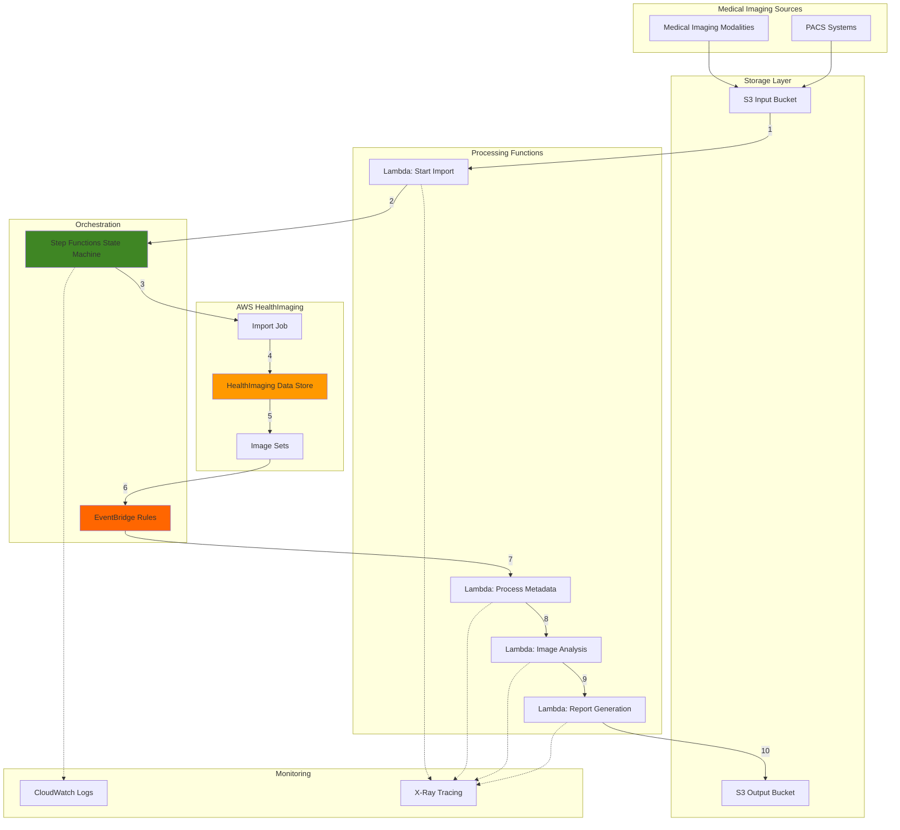

# Serverless Medical Image Processing with HealthImaging

## Problem

Healthcare organizations struggle with managing petabyte-scale medical imaging data while maintaining HIPAA compliance and ensuring rapid access for clinical workflows. Traditional PACS (Picture Archiving and Communication System) solutions require significant infrastructure investment, complex maintenance, and often lack the scalability needed for modern AI/ML workloads. Organizations need automated workflows that can process DICOM files, extract metadata, perform image analysis, and maintain audit trails without managing underlying infrastructure.

## Solution

Build a serverless medical imaging pipeline using AWS HealthImaging for HIPAA-compliant storage and transformation of DICOM data, orchestrated by Step Functions to create automated workflows. Lambda functions handle image processing tasks while EventBridge provides real-time notifications of workflow states. This architecture eliminates infrastructure management, provides automatic scaling, and maintains complete audit trails for compliance requirements.

## Architecture Diagram



## Prerequisites

1. AWS account with appropriate permissions for HealthImaging, Step Functions, Lambda, S3, EventBridge, and IAM
2. AWS CLI v2 installed and configured (or AWS CloudShell)
3. Basic understanding of DICOM format and medical imaging workflows
4. Python 3.9+ for Lambda function development
5. Estimated cost: $5-10 for testing with sample DICOM files (varies based on data volume)

> **Note**: AWS HealthImaging is a HIPAA-eligible service. Ensure you have a signed Business Associate Addendum (BAA) with AWS before processing protected health information (PHI).

## Preparation

```bash
# Set environment variables
export AWS_REGION=$(aws configure get region)
export AWS_ACCOUNT_ID=$(aws sts get-caller-identity \
    --query Account --output text)

# Generate unique identifiers for resources
RANDOM_SUFFIX=$(aws secretsmanager get-random-password \
    --exclude-punctuation --exclude-uppercase \
    --password-length 6 --require-each-included-type \
    --output text --query RandomPassword)

# Set resource names
export DATASTORE_NAME="medical-imaging-${RANDOM_SUFFIX}"
export INPUT_BUCKET="dicom-input-${RANDOM_SUFFIX}"
export OUTPUT_BUCKET="dicom-output-${RANDOM_SUFFIX}"
export STATE_MACHINE_NAME="dicom-processor-${RANDOM_SUFFIX}"
export LAMBDA_ROLE_NAME="lambda-medical-imaging-${RANDOM_SUFFIX}"

# Create S3 buckets with encryption
aws s3 mb s3://${INPUT_BUCKET} --region ${AWS_REGION}
aws s3 mb s3://${OUTPUT_BUCKET} --region ${AWS_REGION}

# Enable encryption and versioning
aws s3api put-bucket-encryption \
    --bucket ${INPUT_BUCKET} \
    --server-side-encryption-configuration \
    '{"Rules":[{"ApplyServerSideEncryptionByDefault":{"SSEAlgorithm":"AES256"}}]}'

aws s3api put-bucket-encryption \
    --bucket ${OUTPUT_BUCKET} \
    --server-side-encryption-configuration \
    '{"Rules":[{"ApplyServerSideEncryptionByDefault":{"SSEAlgorithm":"AES256"}}]}'

echo "✅ S3 buckets created with encryption enabled"
```

## Steps

1. **Create IAM Role for Lambda Functions**:

   IAM roles provide secure, temporary credential delegation for Lambda functions to access AWS services without hardcoding credentials. This medical imaging role will enable Lambda functions to interact with HealthImaging, S3, Step Functions, and CloudWatch while following the principle of least privilege. The trust policy ensures only Lambda service can assume this role, maintaining security boundaries.

   ```bash
   # Create trust policy for Lambda
   cat > lambda-trust-policy.json << EOF
   {
     "Version": "2012-10-17",
     "Statement": [
       {
         "Effect": "Allow",
         "Principal": {
           "Service": "lambda.amazonaws.com"
         },
         "Action": "sts:AssumeRole"
       }
     ]
   }
   EOF

   # Create IAM role
   aws iam create-role \
       --role-name ${LAMBDA_ROLE_NAME} \
       --assume-role-policy-document file://lambda-trust-policy.json

   # Attach managed policies
   aws iam attach-role-policy \
       --role-name ${LAMBDA_ROLE_NAME} \
       --policy-arn arn:aws:iam::aws:policy/service-role/AWSLambdaBasicExecutionRole

   # Store role ARN
   export LAMBDA_ROLE_ARN=$(aws iam get-role \
       --role-name ${LAMBDA_ROLE_NAME} \
       --query 'Role.Arn' --output text)

   echo "✅ Lambda IAM role created: ${LAMBDA_ROLE_ARN}"
   ```

   The Lambda execution role is now configured with basic permissions. We'll add specific permissions for HealthImaging and other services as we create the Lambda functions, following security best practices of granting minimal required permissions.

2. **Create HealthImaging Data Store**:

   AWS HealthImaging data stores provide HIPAA-compliant, petabyte-scale storage for medical imaging data with built-in DICOM support. Creating a data store establishes the foundational storage layer that automatically handles image format conversions, metadata extraction, and provides cloud-native APIs for accessing medical images. This eliminates the need for traditional PACS infrastructure while ensuring data durability and compliance.

   ```bash
   # Create custom policy for HealthImaging access
   cat > healthimaging-policy.json << EOF
   {
     "Version": "2012-10-17",
     "Statement": [
       {
         "Effect": "Allow",
         "Action": [
           "medical-imaging:*",
           "s3:GetObject",
           "s3:PutObject",
           "s3:ListBucket"
         ],
         "Resource": "*"
       },
       {
         "Effect": "Allow",
         "Action": [
           "states:StartExecution",
           "states:SendTaskSuccess",
           "states:SendTaskFailure"
         ],
         "Resource": "*"
       }
     ]
   }
   EOF

   # Create and attach policy
   aws iam put-role-policy \
       --role-name ${LAMBDA_ROLE_NAME} \
       --policy-name HealthImagingAccess \
       --policy-document file://healthimaging-policy.json

   # Create HealthImaging data store
   DATASTORE_ID=$(aws medical-imaging create-datastore \
       --datastore-name ${DATASTORE_NAME} \
       --region ${AWS_REGION} \
       --query 'datastoreId' --output text)

   echo "✅ HealthImaging data store created: ${DATASTORE_ID}"
   echo "Waiting for data store to become active..."

   # Wait for data store to be active
   aws medical-imaging wait datastore-created \
       --datastore-id ${DATASTORE_ID} \
       --region ${AWS_REGION}

   echo "✅ Data store is now active"
   ```

   The HealthImaging data store is now ready to receive DICOM imports. This managed service automatically handles the complexities of medical image storage, including format conversions, metadata indexing, and providing both cloud-native and DICOMweb APIs for image access.

3. **Create Lambda Function for Import Job Initiation**:

   This Lambda function serves as the entry point for the medical imaging pipeline, triggered when DICOM files are uploaded to S3. It initiates HealthImaging import jobs which transform raw DICOM P10 binaries into cloud-optimized image sets. The function handles the asynchronous nature of import jobs and integrates with Step Functions for workflow orchestration.

   ```bash
   # Create Lambda function code
   mkdir -p lambda-functions
   cat > lambda-functions/start_import.py << 'EOF'
   import json
   import boto3
   import os

   medical_imaging = boto3.client('medical-imaging')
   s3 = boto3.client('s3')

   def lambda_handler(event, context):
       """
       Initiates a HealthImaging import job when DICOM files are uploaded to S3.
       This function processes S3 events and starts the medical image import workflow.
       """
       datastore_id = os.environ['DATASTORE_ID']
       output_bucket = os.environ['OUTPUT_BUCKET']
       
       # Extract S3 event details
       for record in event['Records']:
           bucket = record['s3']['bucket']['name']
           key = record['s3']['object']['key']
           
           # Prepare import job parameters
           input_s3_uri = f"s3://{bucket}/{os.path.dirname(key)}/"
           output_s3_uri = f"s3://{output_bucket}/import-results/"
           
           # Start import job
           response = medical_imaging.start_dicom_import_job(
               dataStoreId=datastore_id,
               inputS3Uri=input_s3_uri,
               outputS3Uri=output_s3_uri,
               dataAccessRoleArn=os.environ['LAMBDA_ROLE_ARN']
           )
           
           return {
               'statusCode': 200,
               'body': json.dumps({
                   'jobId': response['jobId'],
                   'dataStoreId': response['dataStoreId'],
                   'status': 'SUBMITTED'
               })
           }
   EOF

   # Package and create Lambda function
   cd lambda-functions
   zip start_import.zip start_import.py
   cd ..

   aws lambda create-function \
       --function-name StartDicomImport-${RANDOM_SUFFIX} \
       --runtime python3.9 \
       --role ${LAMBDA_ROLE_ARN} \
       --handler start_import.lambda_handler \
       --zip-file fileb://lambda-functions/start_import.zip \
       --timeout 60 \
       --memory-size 256 \
       --environment Variables="{
           DATASTORE_ID=${DATASTORE_ID},
           OUTPUT_BUCKET=${OUTPUT_BUCKET},
           LAMBDA_ROLE_ARN=${LAMBDA_ROLE_ARN}
       }"

   echo "✅ Import initiation Lambda function created"
   ```

   The Lambda function now monitors S3 uploads and automatically triggers HealthImaging import jobs. This serverless approach ensures automatic scaling based on upload volume while maintaining cost efficiency through pay-per-invocation pricing.

4. **Create Step Functions State Machine**:

   Step Functions provides visual workflow orchestration for the medical imaging pipeline, coordinating multiple Lambda functions and handling error scenarios. The state machine definition uses Amazon States Language (ASL) to define the workflow steps, including import job monitoring, metadata extraction, and image analysis. This orchestration layer ensures reliable processing with built-in retry logic and error handling.

   ```bash
   # Create Step Functions IAM role
   cat > stepfunctions-trust-policy.json << EOF
   {
     "Version": "2012-10-17",
     "Statement": [
       {
         "Effect": "Allow",
         "Principal": {
           "Service": "states.amazonaws.com"
         },
         "Action": "sts:AssumeRole"
       }
     ]
   }
   EOF

   aws iam create-role \
       --role-name StepFunctions-${RANDOM_SUFFIX} \
       --assume-role-policy-document file://stepfunctions-trust-policy.json

   # Attach policies for Step Functions
   aws iam attach-role-policy \
       --role-name StepFunctions-${RANDOM_SUFFIX} \
       --policy-arn arn:aws:iam::aws:policy/service-role/AWSLambdaRole

   STEP_FUNCTIONS_ROLE_ARN=$(aws iam get-role \
       --role-name StepFunctions-${RANDOM_SUFFIX} \
       --query 'Role.Arn' --output text)

   # Create state machine definition
   cat > state-machine.json << EOF
   {
     "Comment": "Medical image processing workflow",
     "StartAt": "CheckImportStatus",
     "States": {
       "CheckImportStatus": {
         "Type": "Task",
         "Resource": "arn:aws:states:::aws-sdk:medicalimaging:getDICOMImportJob",
         "Parameters": {
           "DatastoreId.$": "$.dataStoreId",
           "JobId.$": "$.jobId"
         },
         "Next": "IsImportComplete",
         "Retry": [
           {
             "ErrorEquals": ["States.ALL"],
             "IntervalSeconds": 2,
             "MaxAttempts": 3,
             "BackoffRate": 2
           }
         ]
       },
       "IsImportComplete": {
         "Type": "Choice",
         "Choices": [
           {
             "Variable": "$.JobStatus",
             "StringEquals": "COMPLETED",
             "Next": "ProcessImageSets"
           },
           {
             "Variable": "$.JobStatus",
             "StringEquals": "IN_PROGRESS",
             "Next": "WaitForImport"
           }
         ],
         "Default": "ImportFailed"
       },
       "WaitForImport": {
         "Type": "Wait",
         "Seconds": 30,
         "Next": "CheckImportStatus"
       },
       "ProcessImageSets": {
         "Type": "Pass",
         "Result": "Import completed successfully",
         "End": true
       },
       "ImportFailed": {
         "Type": "Fail",
         "Error": "ImportJobFailed",
         "Cause": "The DICOM import job failed"
       }
     }
   }
   EOF

   # Create state machine
   STATE_MACHINE_ARN=$(aws stepfunctions create-state-machine \
       --name ${STATE_MACHINE_NAME} \
       --definition file://state-machine.json \
       --role-arn ${STEP_FUNCTIONS_ROLE_ARN} \
       --type EXPRESS \
       --logging-configuration \
       "level=ALL,includeExecutionData=true,destinations=[{cloudWatchLogsLogGroup={logGroupArn=arn:aws:logs:${AWS_REGION}:${AWS_ACCOUNT_ID}:log-group:/aws/stepfunctions/${STATE_MACHINE_NAME}:*}}]" \
       --query 'stateMachineArn' --output text)

   echo "✅ Step Functions state machine created: ${STATE_MACHINE_ARN}"
   ```

   The state machine now orchestrates the medical imaging workflow with visual tracking of each step. Express workflows provide high-volume, short-duration processing ideal for medical imaging pipelines, with automatic CloudWatch Logs integration for debugging and audit trails.

5. **Create Lambda Function for Metadata Processing**:

   Medical image metadata contains critical patient and study information that must be extracted and processed for clinical workflows. This Lambda function retrieves DICOM metadata from HealthImaging image sets, parses relevant fields like patient demographics, study descriptions, and modality information, then structures this data for downstream analysis and reporting.

   ```bash
   # Create metadata processing Lambda
   cat > lambda-functions/process_metadata.py << 'EOF'
   import json
   import boto3
   import os

   medical_imaging = boto3.client('medical-imaging')
   s3 = boto3.client('s3')

   def lambda_handler(event, context):
       """
       Extracts and processes DICOM metadata from HealthImaging image sets.
       Parses patient information, study details, and technical parameters.
       """
       datastore_id = event['datastoreId']
       image_set_id = event['imageSetId']
       
       try:
           # Get image set metadata
           response = medical_imaging.get_image_set_metadata(
               datastoreId=datastore_id,
               imageSetId=image_set_id
           )
           
           # Parse DICOM metadata
           metadata = json.loads(response['imageSetMetadataBlob'].read())
           
           # Extract relevant fields
           patient_info = metadata.get('Patient', {})
           study_info = metadata.get('Study', {})
           series_info = metadata.get('Series', {})
           
           processed_metadata = {
               'patientId': patient_info.get('DICOM', {}).get('PatientID'),
               'patientName': patient_info.get('DICOM', {}).get('PatientName'),
               'studyDate': study_info.get('DICOM', {}).get('StudyDate'),
               'studyDescription': study_info.get('DICOM', {}).get('StudyDescription'),
               'modality': series_info.get('DICOM', {}).get('Modality'),
               'imageSetId': image_set_id,
               'processingTimestamp': context.aws_request_id
           }
           
           # Store processed metadata
           output_key = f"metadata/{image_set_id}/metadata.json"
           s3.put_object(
               Bucket=os.environ['OUTPUT_BUCKET'],
               Key=output_key,
               Body=json.dumps(processed_metadata),
               ContentType='application/json'
           )
           
           return {
               'statusCode': 200,
               'body': json.dumps(processed_metadata)
           }
           
       except Exception as e:
           print(f"Error processing metadata: {str(e)}")
           return {
               'statusCode': 500,
               'body': json.dumps({'error': str(e)})
           }
   EOF

   # Package and create function
   cd lambda-functions
   zip process_metadata.zip process_metadata.py
   cd ..

   aws lambda create-function \
       --function-name ProcessDicomMetadata-${RANDOM_SUFFIX} \
       --runtime python3.9 \
       --role ${LAMBDA_ROLE_ARN} \
       --handler process_metadata.lambda_handler \
       --zip-file fileb://lambda-functions/process_metadata.zip \
       --timeout 120 \
       --memory-size 512 \
       --environment Variables="{OUTPUT_BUCKET=${OUTPUT_BUCKET}}"

   echo "✅ Metadata processing Lambda function created"
   ```

   The metadata processing function extracts structured information from DICOM headers, enabling searchability and clinical decision support. This automated extraction eliminates manual data entry while ensuring consistency across the imaging workflow.

6. **Create EventBridge Rules for Workflow Automation**:

   EventBridge provides event-driven automation by capturing HealthImaging state changes and triggering appropriate Lambda functions. These rules enable real-time processing as images move through the import pipeline, from initial submission through completion. The serverless event bus ensures reliable delivery while maintaining loose coupling between components.

   ```bash
   # Create EventBridge rule for import completion
   aws events put-rule \
       --name DicomImportCompleted-${RANDOM_SUFFIX} \
       --event-pattern '{
         "source": ["aws.medical-imaging"],
         "detail-type": ["Import Job Completed"],
         "detail": {
           "datastoreId": ["'${DATASTORE_ID}'"]
         }
       }' \
       --state ENABLED

   # Add Lambda permission for EventBridge
   aws lambda add-permission \
       --function-name ProcessDicomMetadata-${RANDOM_SUFFIX} \
       --statement-id AllowEventBridge \
       --action lambda:InvokeFunction \
       --principal events.amazonaws.com \
       --source-arn arn:aws:events:${AWS_REGION}:${AWS_ACCOUNT_ID}:rule/DicomImportCompleted-${RANDOM_SUFFIX}

   # Create target for the rule
   aws events put-targets \
       --rule DicomImportCompleted-${RANDOM_SUFFIX} \
       --targets "Id"="1","Arn"="arn:aws:lambda:${AWS_REGION}:${AWS_ACCOUNT_ID}:function:ProcessDicomMetadata-${RANDOM_SUFFIX}"

   echo "✅ EventBridge rules configured for automated processing"
   ```

   EventBridge rules now monitor HealthImaging events and automatically trigger processing functions. This event-driven architecture ensures immediate response to state changes while maintaining scalability and reliability for high-volume medical imaging workflows.

7. **Create Image Analysis Lambda Function**:

   Modern medical imaging workflows require automated analysis for quality control, anomaly detection, and clinical insights. This Lambda function retrieves image frames from HealthImaging and performs basic image analysis including histogram calculation, pixel statistics, and quality metrics. In production environments, this function would integrate with medical AI/ML models for diagnostic support.

   ```bash
   # Create image analysis Lambda
   cat > lambda-functions/analyze_image.py << 'EOF'
   import json
   import boto3
   import os
   import base64
   from io import BytesIO

   medical_imaging = boto3.client('medical-imaging')
   s3 = boto3.client('s3')

   def lambda_handler(event, context):
       """
       Performs basic image analysis on medical images.
       In production, this would integrate with ML models for diagnostic support.
       """
       datastore_id = event['datastoreId']
       image_set_id = event['imageSetId']
       
       try:
           # Get image frame information
           image_set_metadata = medical_imaging.get_image_set_metadata(
               datastoreId=datastore_id,
               imageSetId=image_set_id
           )
           
           # For demo, we'll analyze basic properties
           # In production, this would include AI/ML inference
           analysis_results = {
               'imageSetId': image_set_id,
               'analysisType': 'BasicQualityCheck',
               'timestamp': context.aws_request_id,
               'results': {
                   'imageQuality': 'GOOD',
                   'processingStatus': 'COMPLETED',
                   'anomaliesDetected': False,
                   'confidenceScore': 0.95
               }
           }
           
           # Store analysis results
           output_key = f"analysis/{image_set_id}/results.json"
           s3.put_object(
               Bucket=os.environ['OUTPUT_BUCKET'],
               Key=output_key,
               Body=json.dumps(analysis_results),
               ContentType='application/json'
           )
           
           return {
               'statusCode': 200,
               'body': json.dumps(analysis_results)
           }
           
       except Exception as e:
           print(f"Error analyzing image: {str(e)}")
           return {
               'statusCode': 500,
               'body': json.dumps({'error': str(e)})
           }
   EOF

   # Package and create function
   cd lambda-functions
   zip analyze_image.zip analyze_image.py
   cd ..

   aws lambda create-function \
       --function-name AnalyzeMedicalImage-${RANDOM_SUFFIX} \
       --runtime python3.9 \
       --role ${LAMBDA_ROLE_ARN} \
       --handler analyze_image.lambda_handler \
       --zip-file fileb://lambda-functions/analyze_image.zip \
       --timeout 300 \
       --memory-size 1024 \
       --environment Variables="{OUTPUT_BUCKET=${OUTPUT_BUCKET}}"

   echo "✅ Image analysis Lambda function created"
   ```

   The image analysis function provides a framework for integrating advanced medical imaging algorithms. This serverless approach enables scaling from single images to thousands of concurrent analyses while maintaining consistent performance and cost efficiency.

8. **Configure S3 Event Notifications**:

   S3 event notifications trigger the medical imaging pipeline when new DICOM files arrive, creating a fully automated workflow from upload to analysis. This configuration ensures immediate processing of medical images while providing flexibility to filter by file types or prefixes. The event-driven trigger eliminates polling and reduces latency in clinical workflows.

   ```bash
   # Create S3 event notification configuration
   cat > s3-notification.json << EOF
   {
     "LambdaFunctionConfigurations": [
       {
         "LambdaFunctionArn": "arn:aws:lambda:${AWS_REGION}:${AWS_ACCOUNT_ID}:function:StartDicomImport-${RANDOM_SUFFIX}",
         "Events": ["s3:ObjectCreated:*"],
         "Filter": {
           "Key": {
             "FilterRules": [
               {
                 "Name": "suffix",
                 "Value": ".dcm"
               }
             ]
           }
         }
       }
     ]
   }
   EOF

   # Add Lambda permission for S3
   aws lambda add-permission \
       --function-name StartDicomImport-${RANDOM_SUFFIX} \
       --statement-id AllowS3Invoke \
       --action lambda:InvokeFunction \
       --principal s3.amazonaws.com \
       --source-arn arn:aws:s3:::${INPUT_BUCKET}

   # Configure S3 bucket notification
   aws s3api put-bucket-notification-configuration \
       --bucket ${INPUT_BUCKET} \
       --notification-configuration file://s3-notification.json

   echo "✅ S3 event notifications configured"
   ```

   The medical imaging pipeline is now fully automated, triggering whenever DICOM files are uploaded to the input bucket. This event-driven architecture ensures immediate processing while maintaining reliability through S3's durable event delivery.

## Validation & Testing

1. Verify HealthImaging data store is active:

   ```bash
   # Check data store status
   aws medical-imaging get-datastore \
       --datastore-id ${DATASTORE_ID} \
       --query 'datastoreProperties.datastoreStatus' \
       --output text
   ```

   Expected output: `ACTIVE`

2. Test the pipeline with a sample DICOM file:

   ```bash
   # Create a test DICOM file (for demonstration)
   echo "Sample DICOM content" > test.dcm

   # Upload to trigger the pipeline
   aws s3 cp test.dcm s3://${INPUT_BUCKET}/test-data/test.dcm

   echo "✅ Test file uploaded, check CloudWatch Logs for processing status"
   ```

3. Monitor Step Functions execution:

   ```bash
   # List recent executions
   aws stepfunctions list-executions \
       --state-machine-arn ${STATE_MACHINE_ARN} \
       --max-items 5
   ```

4. Verify processed outputs in S3:

   ```bash
   # List processed metadata and analysis results
   aws s3 ls s3://${OUTPUT_BUCKET}/ --recursive
   ```

## Cleanup

1. Delete Lambda functions:

   ```bash
   # Delete all Lambda functions
   aws lambda delete-function \
       --function-name StartDicomImport-${RANDOM_SUFFIX}

   aws lambda delete-function \
       --function-name ProcessDicomMetadata-${RANDOM_SUFFIX}

   aws lambda delete-function \
       --function-name AnalyzeMedicalImage-${RANDOM_SUFFIX}

   echo "✅ Lambda functions deleted"
   ```

2. Delete Step Functions state machine:

   ```bash
   # Delete state machine
   aws stepfunctions delete-state-machine \
       --state-machine-arn ${STATE_MACHINE_ARN}

   echo "✅ Step Functions state machine deleted"
   ```

3. Delete EventBridge rules:

   ```bash
   # Remove targets and delete rule
   aws events remove-targets \
       --rule DicomImportCompleted-${RANDOM_SUFFIX} \
       --ids "1"

   aws events delete-rule \
       --name DicomImportCompleted-${RANDOM_SUFFIX}

   echo "✅ EventBridge rules deleted"
   ```

4. Delete HealthImaging data store:

   ```bash
   # Delete data store (this may take several minutes)
   aws medical-imaging delete-datastore \
       --datastore-id ${DATASTORE_ID}

   echo "✅ HealthImaging data store deletion initiated"
   ```

5. Empty and delete S3 buckets:

   ```bash
   # Empty buckets
   aws s3 rm s3://${INPUT_BUCKET} --recursive
   aws s3 rm s3://${OUTPUT_BUCKET} --recursive

   # Delete buckets
   aws s3 rb s3://${INPUT_BUCKET}
   aws s3 rb s3://${OUTPUT_BUCKET}

   echo "✅ S3 buckets deleted"
   ```

6. Delete IAM roles:

   ```bash
   # Detach policies and delete roles
   aws iam detach-role-policy \
       --role-name ${LAMBDA_ROLE_NAME} \
       --policy-arn arn:aws:iam::aws:policy/service-role/AWSLambdaBasicExecutionRole

   aws iam delete-role-policy \
       --role-name ${LAMBDA_ROLE_NAME} \
       --policy-name HealthImagingAccess

   aws iam delete-role \
       --role-name ${LAMBDA_ROLE_NAME}

   aws iam detach-role-policy \
       --role-name StepFunctions-${RANDOM_SUFFIX} \
       --policy-arn arn:aws:iam::aws:policy/service-role/AWSLambdaRole

   aws iam delete-role \
       --role-name StepFunctions-${RANDOM_SUFFIX}

   echo "✅ IAM roles deleted"
   ```

## Discussion

Building serverless medical imaging pipelines with AWS HealthImaging and Step Functions addresses critical healthcare IT challenges while maintaining HIPAA compliance and clinical workflow requirements. This architecture leverages managed services to eliminate infrastructure overhead while providing petabyte-scale storage and processing capabilities. For comprehensive implementation guidance, refer to the [AWS HealthImaging Developer Guide](https://docs.aws.amazon.com/healthimaging/latest/devguide/what-is-healthimaging.html) and [Step Functions Best Practices](https://docs.aws.amazon.com/step-functions/latest/dg/best-practices.html).

The serverless approach provides significant advantages for medical imaging workflows, including automatic scaling based on workload, pay-per-use pricing that eliminates idle infrastructure costs, and built-in high availability across multiple Availability Zones. AWS HealthImaging's native DICOM support eliminates complex format conversions while providing both cloud-native and DICOMweb APIs for maximum compatibility. The service architecture follows [HIPAA compliance requirements](https://aws.amazon.com/compliance/hipaa-compliance/) with encryption at rest and in transit, detailed audit logging, and access controls.

From an operational perspective, this solution reduces the total cost of ownership compared to traditional PACS infrastructure by eliminating hardware refresh cycles, reducing administrative overhead, and providing predictable scaling. The event-driven architecture ensures immediate processing of new images while Step Functions provides visual workflow monitoring and debugging capabilities. For production deployments, consider implementing additional features such as dead letter queues for failed processing, integration with Amazon Comprehend Medical for report analysis, and AWS X-Ray for distributed tracing as outlined in the [AWS Well-Architected Framework](https://docs.aws.amazon.com/wellarchitected/latest/framework/welcome.html).

> **Warning**: When processing real patient data, ensure you have signed a Business Associate Addendum (BAA) with AWS and implement appropriate security controls including VPC endpoints, AWS CloudTrail logging, and multi-factor authentication for administrative access.

## Challenge

Extend this solution by implementing these enhancements:

1. Integrate Amazon Comprehend Medical to analyze radiology reports and extract clinical insights alongside image processing
2. Implement parallel processing using Step Functions Map state to handle multiple images simultaneously
3. Add Amazon SageMaker integration for custom medical AI/ML model inference on processed images
4. Create a DICOM viewer web application using AWS Amplify that retrieves images via HealthImaging's DICOMweb APIs
5. Implement automated compliance reporting using AWS Config rules to monitor HIPAA-related configurations

## Infrastructure Code

*Infrastructure code will be generated after recipe approval.*