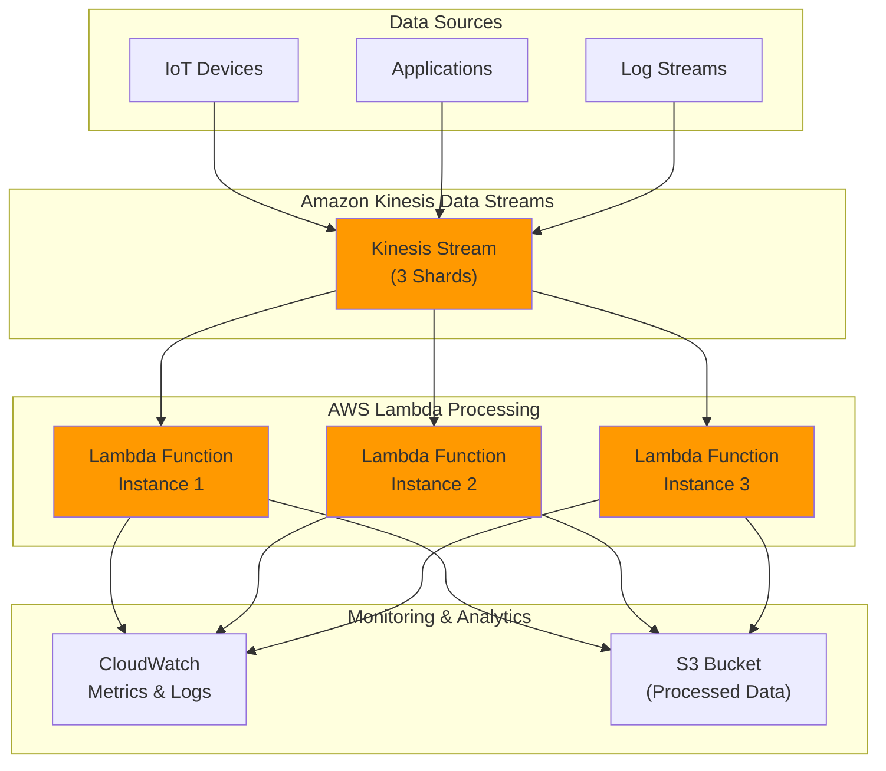

# Processing Serverless Streams with Kinesis and Lambda

## Problem

Your organization needs to process high-volume streaming data in real-time, such as IoT sensor readings, application logs, or financial transactions. You want to build a serverless data processing pipeline that can automatically scale to handle varying data volumes without managing servers or complex infrastructure while maintaining low latency and high throughput.

## Solution

Build a serverless real-time data processing pipeline using Amazon Kinesis Data Streams as the ingestion layer and AWS Lambda for processing. Kinesis will capture and store streaming data records, while Lambda functions will process the data in near real-time using event source mappings. This architecture provides automatic scaling, built-in error handling, and seamless integration with other AWS services for downstream processing or storage.



## Prerequisites

1. AWS CLI version 2 installed and configured with appropriate permissions
2. Basic understanding of stream processing concepts and event-driven architectures
3. Familiarity with AWS Lambda functions and IAM role management
4. IAM permissions for Kinesis Data Streams, Lambda, CloudWatch, S3, and IAM services
5. Python 3.8+ for sample data generator script
6. Estimated cost: $5-10 per day for testing (3 Kinesis shards, Lambda invocations, S3 storage)

> **Note**: This recipe follows AWS Well-Architected Framework principles for serverless architectures. See the [AWS Well-Architected Serverless Lens](https://docs.aws.amazon.com/wellarchitected/latest/serverless-applications-lens/welcome.html) for additional guidance.

## Preparation

Let's set up the foundational components using AWS CLI best practices and create the necessary IAM roles with least privilege permissions:

```bash
# Set environment variables using AWS CLI best practices
export AWS_REGION=$(aws configure get region)
export AWS_ACCOUNT_ID=$(aws sts get-caller-identity \
    --query Account --output text)

# Generate unique identifiers for resources
RANDOM_SUFFIX=$(aws secretsmanager get-random-password \
    --exclude-punctuation --exclude-uppercase \
    --password-length 6 --require-each-included-type \
    --output text --query RandomPassword)

# Define resource names with unique suffixes
export STREAM_NAME="realtime-data-stream-${RANDOM_SUFFIX}"
export LAMBDA_FUNCTION_NAME="kinesis-data-processor-${RANDOM_SUFFIX}"
export S3_BUCKET_NAME="processed-data-${AWS_ACCOUNT_ID}-${RANDOM_SUFFIX}"
export IAM_ROLE_NAME="kinesis-lambda-execution-role-${RANDOM_SUFFIX}"

echo "✅ Environment variables configured"
```

```bash
# Create S3 bucket for storing processed data with encryption
aws s3 mb s3://${S3_BUCKET_NAME} --region ${AWS_REGION}

# Enable default encryption on the S3 bucket
aws s3api put-bucket-encryption \
    --bucket ${S3_BUCKET_NAME} \
    --server-side-encryption-configuration \
    'Rules=[{ApplyServerSideEncryptionByDefault:{SSEAlgorithm:AES256}}]'

echo "✅ S3 bucket created with encryption enabled"
```

```bash
# Create IAM trust policy for Lambda execution role
cat > trust-policy.json << 'EOF'
{
  "Version": "2012-10-17",
  "Statement": [
    {
      "Effect": "Allow",
      "Principal": {
        "Service": "lambda.amazonaws.com"
      },
      "Action": "sts:AssumeRole"
    }
  ]
}
EOF

# Create custom IAM policy for S3 access (least privilege)
cat > s3-policy.json << EOF
{
  "Version": "2012-10-17",
  "Statement": [
    {
      "Effect": "Allow",
      "Action": [
        "s3:PutObject",
        "s3:PutObjectAcl"
      ],
      "Resource": "arn:aws:s3:::${S3_BUCKET_NAME}/*"
    }
  ]
}
EOF

echo "✅ IAM policy documents created"
```

```bash
# Create IAM role for Lambda function
aws iam create-role \
    --role-name ${IAM_ROLE_NAME} \
    --assume-role-policy-document file://trust-policy.json

# Attach managed policy for Kinesis and basic Lambda execution
aws iam attach-role-policy \
    --role-name ${IAM_ROLE_NAME} \
    --policy-arn arn:aws:iam::aws:policy/service-role/AWSLambdaKinesisExecutionRole

# Create and attach custom S3 policy with least privilege
aws iam put-role-policy \
    --role-name ${IAM_ROLE_NAME} \
    --policy-name S3WriteAccess \
    --policy-document file://s3-policy.json

# Wait for role to be available
sleep 10

# Get the role ARN for use in Lambda function creation
ROLE_ARN=$(aws iam get-role \
    --role-name ${IAM_ROLE_NAME} \
    --query 'Role.Arn' --output text)

export ROLE_ARN
echo "✅ IAM role created with least privilege permissions"
```

## Steps

1. **Create a Kinesis Data Stream with multiple shards to handle high throughput**:

   Amazon Kinesis Data Streams is a real-time data streaming service that can handle massive volumes of data with low latency. By creating a stream with multiple shards, we enable parallel processing and horizontal scaling. Each shard can ingest up to 1,000 records per second or 1 MB of data per second, making this architecture suitable for high-throughput applications like IoT data collection, financial transaction processing, or real-time analytics.

   ```bash
   # Create Kinesis stream with 3 shards for parallel processing
   # Multiple shards enable parallel processing and higher throughput
   aws kinesis create-stream \
       --stream-name ${STREAM_NAME} \
       --shard-count 3
   
   echo "Waiting for stream to become active..."
   # This wait ensures the stream is ready before proceeding with configuration
   aws kinesis wait stream-exists --stream-name ${STREAM_NAME}
   
   echo "✅ Kinesis stream created and active with 3 shards"
   ```

   The stream is now active and ready to receive data. With 3 shards, this configuration can handle up to 3,000 records per second or 3 MB per second of incoming data, providing the foundation for our real-time processing pipeline.

2. **Create the Lambda function code for processing Kinesis records**:

   AWS Lambda provides serverless compute that automatically scales to handle varying workloads without server management. When integrated with Kinesis, Lambda functions are triggered by new records in the stream, enabling real-time data processing. The function we're creating will decode Kinesis records, enrich them with processing metadata, and store the results in S3 for further analysis or archival.

   ```bash
   # Create the Lambda function code
   # This function processes streaming data and stores results in S3
   cat > lambda_function.py << 'EOF'
import json
import base64
import boto3
import os
from datetime import datetime
from typing import Dict, Any, List

s3_client = boto3.client('s3')
BUCKET_NAME = os.environ['S3_BUCKET_NAME']

def lambda_handler(event: Dict[str, Any], context: Any) -> Dict[str, Any]:
    """
    Process Kinesis records and store processed data in S3
    """
    processed_records = []
    
    for record in event['Records']:
        try:
            # Decode the Kinesis record data
            kinesis_data = record['kinesis']
            encoded_data = kinesis_data['data']
            decoded_data = base64.b64decode(encoded_data).decode('utf-8')
            
            # Parse the JSON data
            try:
                json_data = json.loads(decoded_data)
            except json.JSONDecodeError:
                # If not JSON, treat as plain text
                json_data = {"message": decoded_data}
                
            # Add processing metadata
            processed_record = {
                "original_data": json_data,
                "processing_timestamp": datetime.utcnow().isoformat(),
                "partition_key": kinesis_data['partitionKey'],
                "sequence_number": kinesis_data['sequenceNumber'],
                "event_id": record['eventID'],
                "processed": True
            }
            
            processed_records.append(processed_record)
            
            print(f"Processed record with EventID: {record['eventID']}")
            
        except Exception as e:
            print(f"Error processing record {record.get('eventID', 'unknown')}: {str(e)}")
            continue
    
    # Store processed records in S3
    if processed_records:
        try:
            s3_key = f"processed-data/{datetime.utcnow().strftime('%Y/%m/%d/%H')}/batch-{context.aws_request_id}.json"
            
            s3_client.put_object(
                Bucket=BUCKET_NAME,
                Key=s3_key,
                Body=json.dumps(processed_records, indent=2),
                ContentType='application/json'
            )
            
            print(f"Successfully stored {len(processed_records)} processed records to S3: {s3_key}")
            
        except Exception as e:
            print(f"Error storing data to S3: {str(e)}")
            raise
    
    return {
        'statusCode': 200,
        'body': json.dumps({
            'processed_count': len(processed_records),
            'message': 'Successfully processed Kinesis records'
        })
    }
EOF
   
   echo "✅ Lambda function code created"
   ```

   > **Note**: The Lambda function processes records in batches to optimize performance. Each record includes metadata about partition keys and sequence numbers to maintain data lineage. Learn more about [Kinesis Lambda integration](https://docs.aws.amazon.com/kinesis/latest/dev/lambda-preprocessing.html).

3. **Package and deploy the Lambda function**:

   Lambda deployment requires packaging your code into a ZIP file that contains all dependencies. The function configuration includes memory allocation (affecting performance and cost), timeout settings (maximum execution time), and environment variables. For Kinesis integration, we're setting appropriate memory (256 MB) and timeout (60 seconds) to handle batch processing efficiently while controlling costs.

   ```bash
   # Create deployment package
   # ZIP packaging is required for Lambda deployment
   zip lambda-function.zip lambda_function.py
   
   # Create Lambda function with appropriate memory and timeout settings
   # Memory size affects performance and cost for concurrent processing
   aws lambda create-function \
       --function-name ${LAMBDA_FUNCTION_NAME} \
       --runtime python3.12 \
       --role ${ROLE_ARN} \
       --handler lambda_function.lambda_handler \
       --zip-file fileb://lambda-function.zip \
       --timeout 60 \
       --memory-size 256 \
       --environment Variables="{S3_BUCKET_NAME=${S3_BUCKET_NAME}}"
   
   echo "✅ Lambda function deployed with Python 3.12 runtime"
   ```

   The Lambda function is now deployed and configured to process Kinesis records. The function has the necessary IAM permissions to read from Kinesis and write to S3, establishing the core processing component of our real-time pipeline.

4. **Create an event source mapping to connect Kinesis stream to Lambda**:

   Event source mapping is the bridge between Kinesis and Lambda, automatically polling the stream for new records and invoking your function with batches of data. This managed service handles the complexity of reading from multiple shards, maintaining checkpoints, and managing retries. The batch size and maximum batching window parameters allow you to optimize for either latency (smaller batches, shorter windows) or throughput (larger batches, longer windows).

   ```bash
   # Get the stream ARN for event source mapping
   STREAM_ARN=$(aws kinesis describe-stream \
       --stream-name ${STREAM_NAME} \
       --query 'StreamDescription.StreamARN' --output text)
   
   # Create event source mapping
   # Batch size and window control processing latency vs throughput
   aws lambda create-event-source-mapping \
       --function-name ${LAMBDA_FUNCTION_NAME} \
       --event-source-arn ${STREAM_ARN} \
       --starting-position LATEST \
       --batch-size 100 \
       --maximum-batching-window-in-seconds 5
   
   export STREAM_ARN
   echo "✅ Event source mapping created and active"
   ```

   The event source mapping is now active and will begin polling the Kinesis stream for new records. Lambda will automatically scale the number of concurrent function executions based on the number of shards and incoming data volume, ensuring optimal performance without manual intervention.

   > **Tip**: The batch size and batching window control how Lambda processes records. A batch size of 100 with a 5-second window means Lambda will invoke your function when it has 100 records or when 5 seconds have passed, whichever comes first.

5. **Create a simple data generator to test the pipeline**:

   To validate our real-time processing pipeline, we need a data source that simulates realistic streaming scenarios. This generator creates IoT-like sensor data with multiple data points including temperature, humidity, location, and battery levels. Using different device IDs as partition keys ensures data is distributed across all shards, testing the parallel processing capabilities of our architecture.

   ```bash
   # Create data generator script
   # This simulates IoT devices sending sensor data to the stream
   cat > data_generator.py << EOF
import boto3
import json
import time
import random
from datetime import datetime

kinesis_client = boto3.client('kinesis')
STREAM_NAME = '${STREAM_NAME}'

def generate_sample_data():
    """Generate sample IoT-like data"""
    return {
        "device_id": f"device_{random.randint(1, 100)}",
        "temperature": round(random.uniform(18.0, 35.0), 2),
        "humidity": round(random.uniform(30.0, 80.0), 2),
        "timestamp": datetime.utcnow().isoformat(),
        "location": {
            "lat": round(random.uniform(-90, 90), 6),
            "lon": round(random.uniform(-180, 180), 6)
        },
        "battery_level": random.randint(10, 100)
    }

def send_records_to_kinesis(num_records=50):
    """Send multiple records to Kinesis stream"""
    print(f"Sending {num_records} records to Kinesis stream: {STREAM_NAME}")
    
    for i in range(num_records):
        data = generate_sample_data()
        
        response = kinesis_client.put_record(
            StreamName=STREAM_NAME,
            Data=json.dumps(data),
            PartitionKey=data['device_id']
        )
        
        if i % 10 == 0:
            print(f"Sent {i+1} records...")
        
        # Small delay to simulate real-time data
        time.sleep(0.1)
    
    print(f"Successfully sent {num_records} records to Kinesis!")

if __name__ == "__main__":
    send_records_to_kinesis()
EOF
   
   echo "✅ Data generator script created"
   ```

   The data generator script is now ready to simulate real-world IoT device behavior. The script creates diverse sensor readings with realistic value ranges and uses device IDs as partition keys to ensure even distribution across Kinesis shards.

6. **Test the pipeline by sending data to the Kinesis stream**:

   Testing with realistic data loads validates that all components work together correctly. The data generator will send records to Kinesis, which will trigger Lambda function invocations through the event source mapping. This end-to-end test confirms that data flows properly from ingestion through processing to storage in S3.

   ```bash
   # Install boto3 if not already available
   python3 -m pip install boto3
   
   # Run the data generator to send test data
   # This simulates real-world streaming data ingestion
   python3 data_generator.py
   
   echo "✅ Test data sent through the pipeline"
   ```

   The test data is now flowing through the pipeline. You should see Lambda function invocations in CloudWatch Logs within a few seconds, and processed data files will appear in your S3 bucket as the functions complete their processing.

   > **Warning**: Monitor your AWS costs when testing with high-volume data streams. Kinesis charges per shard hour and PUT requests, while Lambda charges for execution time and requests. Set up [billing alerts](https://docs.aws.amazon.com/AmazonCloudWatch/latest/monitoring/monitor_estimated_charges_with_cloudwatch.html) to avoid unexpected charges.

## Validation & Testing

1. Verify that the Kinesis stream is active and receiving data:

   ```bash
   # Check stream status
   aws kinesis describe-stream \
       --stream-name ${STREAM_NAME} \
       --query 'StreamDescription.{Status:StreamStatus,Shards:Shards[].ShardId}'
   ```

   Expected output showing "ACTIVE" status:
   ```json
   {
       "Status": "ACTIVE",
       "Shards": [
           "shardId-000000000000",
           "shardId-000000000001", 
           "shardId-000000000002"
       ]
   }
   ```

2. Check Lambda function invocations and monitor processing:

   ```bash
   # Get recent Lambda invocations
   aws logs describe-log-groups \
       --log-group-name-prefix "/aws/lambda/${LAMBDA_FUNCTION_NAME}"

   # View recent logs (replace with actual log group name)
   aws logs filter-log-events \
       --log-group-name "/aws/lambda/${LAMBDA_FUNCTION_NAME}" \
       --start-time $(date -d '5 minutes ago' +%s)000
   ```

3. Verify that processed data is being stored in S3:

   ```bash
   # List objects in S3 bucket to confirm data storage
   aws s3 ls s3://${S3_BUCKET_NAME}/processed-data/ --recursive

   # Download and examine a sample processed file
   aws s3 cp s3://${S3_BUCKET_NAME}/processed-data/ . \
       --recursive --exclude "*" --include "*.json"
   ```

4. Monitor Lambda function metrics:

   ```bash
   # Get Lambda function metrics from CloudWatch
   aws cloudwatch get-metric-statistics \
       --namespace AWS/Lambda \
       --metric-name Invocations \
       --dimensions Name=FunctionName,Value=${LAMBDA_FUNCTION_NAME} \
       --start-time $(date -d '1 hour ago' --iso-8601) \
       --end-time $(date --iso-8601) \
       --period 300 \
       --statistics Sum
   ```

## Cleanup

1. Delete the event source mapping:

   ```bash
   # List event source mappings
   EVENT_SOURCE_UUID=$(aws lambda list-event-source-mappings \
       --function-name ${LAMBDA_FUNCTION_NAME} \
       --query 'EventSourceMappings[0].UUID' --output text)

   # Delete the event source mapping
   aws lambda delete-event-source-mapping \
       --uuid ${EVENT_SOURCE_UUID}
   
   echo "✅ Event source mapping deleted"
   ```

2. Delete the Lambda function:

   ```bash
   aws lambda delete-function --function-name ${LAMBDA_FUNCTION_NAME}
   
   echo "✅ Lambda function deleted"
   ```

3. Delete the Kinesis stream:

   ```bash
   aws kinesis delete-stream --stream-name ${STREAM_NAME}
   
   echo "✅ Kinesis stream deleted"
   ```

4. Delete the IAM role and policies:

   ```bash
   # Detach managed policy from role
   aws iam detach-role-policy \
       --role-name ${IAM_ROLE_NAME} \
       --policy-arn arn:aws:iam::aws:policy/service-role/AWSLambdaKinesisExecutionRole

   # Delete inline policy
   aws iam delete-role-policy \
       --role-name ${IAM_ROLE_NAME} \
       --policy-name S3WriteAccess

   # Delete the role
   aws iam delete-role --role-name ${IAM_ROLE_NAME}
   
   echo "✅ IAM role and policies deleted"
   ```

5. Delete the S3 bucket and its contents:

   ```bash
   # Delete all objects in the bucket
   aws s3 rm s3://${S3_BUCKET_NAME} --recursive

   # Delete the bucket
   aws s3 rb s3://${S3_BUCKET_NAME}
   
   echo "✅ S3 bucket and contents deleted"
   ```

6. Clean up local files:

   ```bash
   rm -f lambda-function.zip lambda_function.py data_generator.py \
         trust-policy.json s3-policy.json
   
   echo "✅ Local files cleaned up"
   ```

## Discussion

Amazon Kinesis Data Streams combined with AWS Lambda provides a powerful serverless architecture for real-time data processing that follows AWS Well-Architected Framework principles. This pattern is particularly effective because Kinesis handles the complexities of streaming data ingestion, buffering, and partitioning, while Lambda automatically scales to process the data without requiring server management. The event source mapping creates a robust integration that handles error conditions, retries, and maintains processing order within partitions, ensuring operational excellence and reliability.

The architecture scales horizontally by adding more shards to the Kinesis stream and leveraging Lambda's automatic concurrency scaling. Each shard can support up to 1,000 records per second or 1 MB of data per second for ingestion, and Lambda can process multiple batches concurrently across shards. For applications requiring even higher throughput, you can implement Kinesis Enhanced Fan-Out consumers, which provide dedicated throughput of 2 MB per second per consumer per shard. This approach aligns with the performance efficiency pillar by optimizing resource utilization based on demand.

Cost optimization is a key advantage of this serverless approach. You only pay for the Kinesis shards you provision and the Lambda compute time you consume. Unlike traditional streaming platforms that require persistent infrastructure, this solution scales to zero when there's no data to process. Organizations processing unpredictable or bursty workloads often see significant cost savings compared to maintaining always-on streaming infrastructure. For production workloads, consider implementing dead letter queues for error handling, CloudWatch X-Ray for distributed tracing, and AWS Config for compliance monitoring to ensure all Well-Architected pillars are addressed. See the [AWS Lambda best practices guide](https://docs.aws.amazon.com/lambda/latest/dg/best-practices.html) and [Kinesis Data Streams best practices](https://docs.aws.amazon.com/streams/latest/dev/kinesis-record-processor-additional-considerations.html) for additional guidance.

> **Tip**: Use AWS X-Ray for distributed tracing to monitor API performance and identify bottlenecks across your serverless architecture. The [X-Ray documentation](https://docs.aws.amazon.com/xray/latest/devguide/) provides comprehensive guidance.

## Challenge

Extend this solution by implementing these enhancements:

1. **Event Filtering**: Add filtering logic to process only specific types of records based on device type or temperature thresholds using Lambda event source mapping filters.
2. **Error Handling**: Implement dead letter queues for records that fail processing and set up CloudWatch alarms for monitoring error rates.
3. **Data Aggregation**: Create a second Lambda function that aggregates processed data into hourly summaries and stores them in DynamoDB for fast querying.
4. **Enhanced Monitoring**: Set up CloudWatch dashboards to visualize key metrics like processing latency, error rates, throughput, and shard utilization.
5. **Advanced Analytics**: Integrate with Amazon Kinesis Data Analytics to perform real-time SQL queries on the streaming data for immediate insights.

## Infrastructure Code

### Available Infrastructure as Code:

- [Infrastructure Code Overview](code/README.md) - Detailed description of all infrastructure components
- [AWS CDK (Python)](code/cdk-python/) - AWS CDK Python implementation
- [AWS CDK (TypeScript)](code/cdk-typescript/) - AWS CDK TypeScript implementation
- [CloudFormation](code/cloudformation.yaml) - AWS CloudFormation template
- [Bash CLI Scripts](code/scripts/) - Example bash scripts using AWS CLI commands to deploy infrastructure
- [Terraform](code/terraform/) - Terraform configuration files