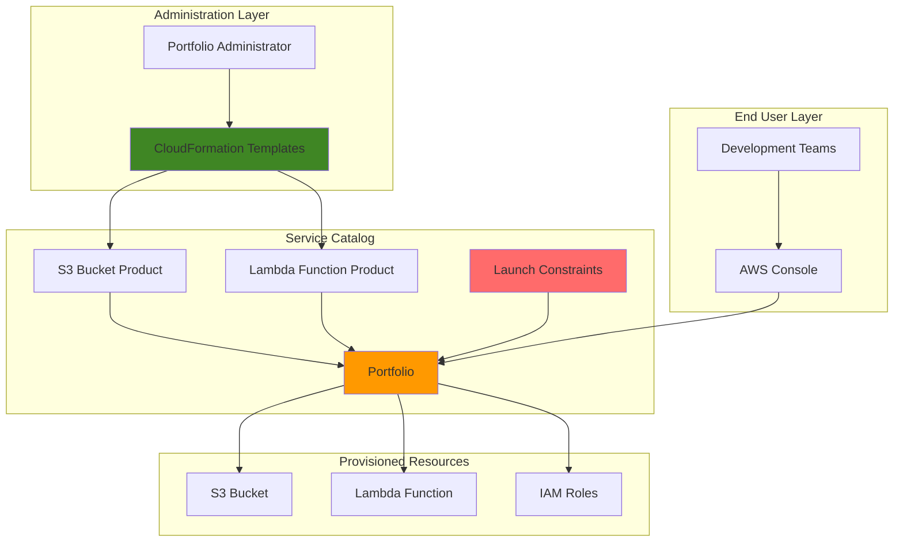

# Service Catalog Portfolio with CloudFormation Templates

## Problem

Development teams in growing organizations often deploy AWS resources inconsistently, leading to security vulnerabilities, cost overruns, and operational complexity. IT administrators struggle to maintain governance while enabling developer self-service, creating bottlenecks that slow innovation and increase shadow IT risks.

## Solution

AWS Service Catalog provides a centralized governance framework by organizing pre-approved CloudFormation templates into portfolios that teams can self-service deploy. This approach standardizes resource provisioning while maintaining security controls and enabling rapid, compliant infrastructure deployment across the organization.

## Architecture Diagram



## Prerequisites

1. AWS account with Service Catalog administrator permissions (servicecatalog:*)
2. AWS CLI v2 installed and configured with appropriate credentials
3. Basic understanding of CloudFormation template structure and AWS resource management
4. IAM permissions to create roles and policies for product launch constraints
5. Estimated cost: $0.50-2.00 for testing (S3 storage, Lambda invocations, minimal CloudFormation stack usage)

> **Note**: Service Catalog itself has no additional charges beyond the underlying AWS resources provisioned through the catalog products.

## Preparation

```bash
# Set AWS environment variables
export AWS_REGION=$(aws configure get region)
export AWS_ACCOUNT_ID=$(aws sts get-caller-identity \
    --query Account --output text)

# Generate unique identifiers for resources
RANDOM_SUFFIX=$(aws secretsmanager get-random-password \
    --exclude-punctuation --exclude-uppercase \
    --password-length 6 --require-each-included-type \
    --output text --query RandomPassword)

# Set resource names with unique suffix
export PORTFOLIO_NAME="enterprise-infrastructure-${RANDOM_SUFFIX}"
export S3_PRODUCT_NAME="managed-s3-bucket-${RANDOM_SUFFIX}"
export LAMBDA_PRODUCT_NAME="serverless-function-${RANDOM_SUFFIX}"

# Create S3 bucket for CloudFormation templates
aws s3 mb s3://service-catalog-templates-${RANDOM_SUFFIX} \
    --region ${AWS_REGION}

echo "✅ AWS environment configured with unique identifiers"
```

## Steps

1. **Create CloudFormation Template for S3 Bucket Product**:

   Service Catalog products are built from CloudFormation templates that define standardized, governable infrastructure patterns. Creating a parameterized S3 bucket template allows teams to deploy secure, compliant storage resources while maintaining organizational policies for encryption, versioning, and access controls.

   ```bash
   # Create S3 bucket CloudFormation template
   cat > s3-bucket-template.yaml << 'EOF'
   AWSTemplateFormatVersion: '2010-09-09'
   Description: 'Managed S3 bucket with security best practices'
   
   Parameters:
     BucketName:
       Type: String
       Description: 'Name for the S3 bucket'
       AllowedPattern: '^[a-z0-9][a-z0-9-]*[a-z0-9]$'
       ConstraintDescription: 'Bucket name must be lowercase alphanumeric with hyphens'
   
     Environment:
       Type: String
       Default: 'development'
       AllowedValues: ['development', 'staging', 'production']
       Description: 'Environment for resource tagging'
   
   Resources:
     S3Bucket:
       Type: AWS::S3::Bucket
       Properties:
         BucketName: !Ref BucketName
         BucketEncryption:
           ServerSideEncryptionConfiguration:
             - ServerSideEncryptionByDefault:
                 SSEAlgorithm: AES256
         VersioningConfiguration:
           Status: Enabled
         PublicAccessBlockConfiguration:
           BlockPublicAcls: true
           BlockPublicPolicy: true
           IgnorePublicAcls: true
           RestrictPublicBuckets: true
         Tags:
           - Key: Environment
             Value: !Ref Environment
           - Key: ManagedBy
             Value: ServiceCatalog
   
   Outputs:
     BucketName:
       Description: 'Name of the created S3 bucket'
       Value: !Ref S3Bucket
     BucketArn:
       Description: 'ARN of the created S3 bucket'
       Value: !GetAtt S3Bucket.Arn
   EOF
   
   # Upload template to S3
   aws s3 cp s3-bucket-template.yaml \
       s3://service-catalog-templates-${RANDOM_SUFFIX}/s3-bucket-template.yaml
   
   echo "✅ S3 bucket CloudFormation template created and uploaded"
   ```

   This template implements AWS security best practices including encryption, versioning, and public access blocking while providing parameterization for different environments and use cases.

2. **Create CloudFormation Template for Lambda Function Product**:

   A serverless Lambda function template provides teams with a standardized approach to deploying functions with proper IAM roles, environment variables, and monitoring configurations. This ensures consistent security postures and operational practices across all serverless deployments.

   ```bash
   # Create Lambda function CloudFormation template
   cat > lambda-function-template.yaml << 'EOF'
   AWSTemplateFormatVersion: '2010-09-09'
   Description: 'Managed Lambda function with IAM role and CloudWatch logging'
   
   Parameters:
     FunctionName:
       Type: String
       Description: 'Name for the Lambda function'
       AllowedPattern: '^[a-zA-Z0-9-_]+$'
   
     Runtime:
       Type: String
       Default: 'python3.12'
       AllowedValues: ['python3.12', 'python3.11', 'nodejs20.x', 'nodejs22.x']
       Description: 'Runtime environment for the function'
   
     Environment:
       Type: String
       Default: 'development'
       AllowedValues: ['development', 'staging', 'production']
       Description: 'Environment for resource tagging'
   
   Resources:
     LambdaExecutionRole:
       Type: AWS::IAM::Role
       Properties:
         AssumeRolePolicyDocument:
           Version: '2012-10-17'
           Statement:
             - Effect: Allow
               Principal:
                 Service: lambda.amazonaws.com
               Action: sts:AssumeRole
         ManagedPolicyArns:
           - arn:aws:iam::aws:policy/service-role/AWSLambdaBasicExecutionRole
         Tags:
           - Key: Environment
             Value: !Ref Environment
           - Key: ManagedBy
             Value: ServiceCatalog
   
     LambdaFunction:
       Type: AWS::Lambda::Function
       Properties:
         FunctionName: !Ref FunctionName
         Runtime: !Ref Runtime
         Handler: 'index.handler'
         Role: !GetAtt LambdaExecutionRole.Arn
         Code:
           ZipFile: |
             def handler(event, context):
                 return {
                     'statusCode': 200,
                     'body': 'Hello from Service Catalog managed Lambda!'
                 }
         Tags:
           - Key: Environment
             Value: !Ref Environment
           - Key: ManagedBy
             Value: ServiceCatalog
   
   Outputs:
     FunctionName:
       Description: 'Name of the created Lambda function'
       Value: !Ref LambdaFunction
     FunctionArn:
       Description: 'ARN of the created Lambda function'
       Value: !GetAtt LambdaFunction.Arn
   EOF
   
   # Upload template to S3
   aws s3 cp lambda-function-template.yaml \
       s3://service-catalog-templates-${RANDOM_SUFFIX}/lambda-function-template.yaml
   
   echo "✅ Lambda function CloudFormation template created and uploaded"
   ```

   The Lambda template includes proper IAM role configuration, CloudWatch logging permissions, and standardized tagging to ensure consistent operational practices across all function deployments.

3. **Create Service Catalog Portfolio**:

   A Service Catalog portfolio acts as a logical container for related products, enabling administrators to organize and manage access to standardized infrastructure templates. Portfolios provide the governance layer that controls which teams can deploy which resources while maintaining security and compliance requirements.

   ```bash
   # Create Service Catalog portfolio
   PORTFOLIO_ID=$(aws servicecatalog create-portfolio \
       --display-name "${PORTFOLIO_NAME}" \
       --description "Enterprise infrastructure templates for development teams" \
       --provider-name "IT Infrastructure Team" \
       --query 'PortfolioDetail.Id' --output text)
   
   echo "Portfolio ID: ${PORTFOLIO_ID}"
   echo "✅ Service Catalog portfolio created successfully"
   ```

   The portfolio now serves as the central catalog where approved infrastructure templates will be organized and made available to development teams through controlled access mechanisms.

4. **Create Service Catalog Products from CloudFormation Templates**:

   Service Catalog products represent deployable infrastructure patterns based on CloudFormation templates. Each product encapsulates a specific infrastructure capability with defined parameters, constraints, and governance policies that ensure consistent, secure deployments across the organization.

   ```bash
   # Create S3 bucket product
   S3_PRODUCT_ID=$(aws servicecatalog create-product \
       --name "${S3_PRODUCT_NAME}" \
       --description "Managed S3 bucket with security best practices" \
       --owner "IT Infrastructure Team" \
       --product-type "CLOUD_FORMATION_TEMPLATE" \
       --provisioning-artifact-parameters \
           Name="v1.0",Description="Initial version with encryption and versioning",Type="CLOUD_FORMATION_TEMPLATE",Info="{\"LoadTemplateFromURL\":\"https://service-catalog-templates-${RANDOM_SUFFIX}.s3.${AWS_REGION}.amazonaws.com/s3-bucket-template.yaml\"}" \
       --query 'ProductViewDetail.ProductViewSummary.ProductId' --output text)
   
   # Create Lambda function product
   LAMBDA_PRODUCT_ID=$(aws servicecatalog create-product \
       --name "${LAMBDA_PRODUCT_NAME}" \
       --description "Managed Lambda function with IAM role and logging" \
       --owner "IT Infrastructure Team" \
       --product-type "CLOUD_FORMATION_TEMPLATE" \
       --provisioning-artifact-parameters \
           Name="v1.0",Description="Initial version with execution role",Type="CLOUD_FORMATION_TEMPLATE",Info="{\"LoadTemplateFromURL\":\"https://service-catalog-templates-${RANDOM_SUFFIX}.s3.${AWS_REGION}.amazonaws.com/lambda-function-template.yaml\"}" \
       --query 'ProductViewDetail.ProductViewSummary.ProductId' --output text)
   
   echo "S3 Product ID: ${S3_PRODUCT_ID}"
   echo "Lambda Product ID: ${LAMBDA_PRODUCT_ID}"
   echo "✅ Service Catalog products created from CloudFormation templates"
   ```

   Both products are now available in the Service Catalog with their respective CloudFormation templates defining the infrastructure patterns that teams can deploy in a standardized, governed manner.

5. **Associate Products with Portfolio**:

   Associating products with a portfolio creates the logical grouping that enables access control and governance. This step establishes the relationship between the infrastructure templates and the organizational catalog, making them available for teams to discover and deploy through the Service Catalog interface.

   ```bash
   # Associate S3 product with portfolio
   aws servicecatalog associate-product-with-portfolio \
       --product-id "${S3_PRODUCT_ID}" \
       --portfolio-id "${PORTFOLIO_ID}"
   
   # Associate Lambda product with portfolio
   aws servicecatalog associate-product-with-portfolio \
       --product-id "${LAMBDA_PRODUCT_ID}" \
       --portfolio-id "${PORTFOLIO_ID}"
   
   echo "✅ Products successfully associated with portfolio"
   ```

   The products are now organized within the portfolio structure, enabling centralized management and controlled access to the standardized infrastructure templates.

6. **Create IAM Role for Launch Constraints**:

   Launch constraints define the IAM permissions used when Service Catalog provisions resources from CloudFormation templates. Creating a dedicated role with appropriate permissions ensures that users can deploy resources without requiring elevated privileges, maintaining the principle of least privilege while enabling self-service capabilities.

   ```bash
   # Create trust policy for Service Catalog service
   cat > servicecatalog-trust-policy.json << 'EOF'
   {
       "Version": "2012-10-17",
       "Statement": [
           {
               "Effect": "Allow",
               "Principal": {
                   "Service": "servicecatalog.amazonaws.com"
               },
               "Action": "sts:AssumeRole"
           }
       ]
   }
   EOF
   
   # Create IAM role for launch constraints
   LAUNCH_ROLE_ARN=$(aws iam create-role \
       --role-name "ServiceCatalogLaunchRole-${RANDOM_SUFFIX}" \
       --assume-role-policy-document file://servicecatalog-trust-policy.json \
       --query 'Role.Arn' --output text)
   
   # Create policy with permissions for S3 and Lambda resources
   cat > servicecatalog-launch-policy.json << 'EOF'
   {
       "Version": "2012-10-17",
       "Statement": [
           {
               "Effect": "Allow",
               "Action": [
                   "s3:CreateBucket",
                   "s3:DeleteBucket",
                   "s3:PutBucketEncryption",
                   "s3:PutBucketVersioning",
                   "s3:PutBucketPublicAccessBlock",
                   "s3:PutBucketTagging",
                   "lambda:CreateFunction",
                   "lambda:DeleteFunction",
                   "lambda:UpdateFunctionCode",
                   "lambda:UpdateFunctionConfiguration",
                   "lambda:TagResource",
                   "lambda:UntagResource",
                   "iam:CreateRole",
                   "iam:DeleteRole",
                   "iam:AttachRolePolicy",
                   "iam:DetachRolePolicy",
                   "iam:PassRole",
                   "iam:TagRole",
                   "iam:UntagRole"
               ],
               "Resource": "*"
           }
       ]
   }
   EOF
   
   # Attach policy to role
   aws iam put-role-policy \
       --role-name "ServiceCatalogLaunchRole-${RANDOM_SUFFIX}" \
       --policy-name "ServiceCatalogLaunchPolicy" \
       --policy-document file://servicecatalog-launch-policy.json
   
   echo "Launch Role ARN: ${LAUNCH_ROLE_ARN}"
   echo "✅ IAM launch role created with appropriate permissions"
   ```

   The launch role now provides Service Catalog with the minimum permissions necessary to create and manage the resources defined in the CloudFormation templates while maintaining security boundaries.

7. **Apply Launch Constraints to Products**:

   Launch constraints bind specific IAM roles to products, ensuring that resource provisioning occurs with predetermined permissions rather than user credentials. This approach enables secure self-service deployment while maintaining strict access controls and preventing privilege escalation.

   ```bash
   # Apply launch constraint to S3 product
   aws servicecatalog create-constraint \
       --portfolio-id "${PORTFOLIO_ID}" \
       --product-id "${S3_PRODUCT_ID}" \
       --type "LAUNCH" \
       --parameters "{\"RoleArn\":\"${LAUNCH_ROLE_ARN}\"}"
   
   # Apply launch constraint to Lambda product
   aws servicecatalog create-constraint \
       --portfolio-id "${PORTFOLIO_ID}" \
       --product-id "${LAMBDA_PRODUCT_ID}" \
       --type "LAUNCH" \
       --parameters "{\"RoleArn\":\"${LAUNCH_ROLE_ARN}\"}"
   
   echo "✅ Launch constraints applied to all products"
   ```

   Both products now have launch constraints that ensure consistent, secure provisioning using the dedicated IAM role rather than individual user permissions.

8. **Grant Portfolio Access to Users**:

   Associating principals (users, groups, or roles) with the portfolio establishes who can access and deploy the products within the catalog. This step completes the governance model by defining the controlled access that enables self-service infrastructure deployment while maintaining organizational oversight.

   ```bash
   # Get current user ARN for portfolio access
   CURRENT_USER_ARN=$(aws sts get-caller-identity --query 'Arn' --output text)
   
   # Associate current user with portfolio
   aws servicecatalog associate-principal-with-portfolio \
       --portfolio-id "${PORTFOLIO_ID}" \
       --principal-arn "${CURRENT_USER_ARN}" \
       --principal-type "IAM"
   
   echo "Current User ARN: ${CURRENT_USER_ARN}"
   echo "✅ Portfolio access granted to current user"
   ```

   The portfolio is now accessible to the specified user, enabling them to browse available products and deploy infrastructure using the standardized templates through the AWS console or CLI.

## Validation & Testing

1. **Verify Portfolio and Products Creation**:

   ```bash
   # List portfolios to confirm creation
   aws servicecatalog list-portfolios \
       --query "PortfolioDetails[?DisplayName=='${PORTFOLIO_NAME}']"
   
   # List products in the portfolio
   aws servicecatalog search-products-as-admin \
       --portfolio-id "${PORTFOLIO_ID}" \
       --query 'ProductViewDetails[].ProductViewSummary.[ProductId,Name]'  
   ```

   Expected output: Portfolio details showing the created portfolio and associated products with their respective IDs and names.

2. **Test Product Launch Capability**:

   ```bash
   # Search for available products as end user
   aws servicecatalog search-products \
       --query 'ProductViewSummaries[].Name'
   
   # Get launch paths for S3 product
   aws servicecatalog list-launch-paths \
       --product-id "${S3_PRODUCT_ID}" \
       --query 'LaunchPathSummaries[0].Id' --output text
   ```

   Expected output: Available products showing in the search results with valid launch paths indicating proper portfolio association and access configuration.

3. **Validate Template Access and Parameters**:

   ```bash
   # Describe provisioning parameters for S3 product
   aws servicecatalog describe-provisioning-parameters \
       --product-id "${S3_PRODUCT_ID}" \
       --query 'ProvisioningArtifactParameters[].ParameterKey'
   ```

   Expected output: List of template parameters (BucketName, Environment) confirming that CloudFormation templates are properly integrated and accessible.

## Cleanup

1. **Remove Portfolio Access**:

   ```bash
   # Disassociate user from portfolio
   aws servicecatalog disassociate-principal-from-portfolio \
       --portfolio-id "${PORTFOLIO_ID}" \
       --principal-arn "${CURRENT_USER_ARN}"
   
   echo "✅ Portfolio access removed"
   ```

2. **Delete Launch Constraints**:

   ```bash
   # List and delete constraints
   CONSTRAINT_IDS=$(aws servicecatalog list-constraints-for-portfolio \
       --portfolio-id "${PORTFOLIO_ID}" \
       --query 'ConstraintDetails[].ConstraintId' --output text)
   
   for CONSTRAINT_ID in ${CONSTRAINT_IDS}; do
       aws servicecatalog delete-constraint --id "${CONSTRAINT_ID}"
   done
   
   echo "✅ Launch constraints deleted"
   ```

3. **Remove Products from Portfolio**:

   ```bash
   # Disassociate products from portfolio
   aws servicecatalog disassociate-product-from-portfolio \
       --product-id "${S3_PRODUCT_ID}" \
       --portfolio-id "${PORTFOLIO_ID}"
   
   aws servicecatalog disassociate-product-from-portfolio \
       --product-id "${LAMBDA_PRODUCT_ID}" \
       --portfolio-id "${PORTFOLIO_ID}"
   
   echo "✅ Products disassociated from portfolio"
   ```

4. **Delete Products and Portfolio**:

   ```bash
   # Delete Service Catalog products
   aws servicecatalog delete-product --id "${S3_PRODUCT_ID}"
   aws servicecatalog delete-product --id "${LAMBDA_PRODUCT_ID}"
   
   # Delete portfolio
   aws servicecatalog delete-portfolio --id "${PORTFOLIO_ID}"
   
   echo "✅ Products and portfolio deleted"
   ```

5. **Clean Up IAM Resources and Templates**:

   ```bash
   # Delete IAM role and policy
   aws iam delete-role-policy \
       --role-name "ServiceCatalogLaunchRole-${RANDOM_SUFFIX}" \
       --policy-name "ServiceCatalogLaunchPolicy"
   
   aws iam delete-role \
       --role-name "ServiceCatalogLaunchRole-${RANDOM_SUFFIX}"
   
   # Delete S3 bucket and templates
   aws s3 rm s3://service-catalog-templates-${RANDOM_SUFFIX} --recursive
   aws s3 rb s3://service-catalog-templates-${RANDOM_SUFFIX}
   
   # Remove local files
   rm -f s3-bucket-template.yaml lambda-function-template.yaml
   rm -f servicecatalog-trust-policy.json servicecatalog-launch-policy.json
   
   echo "✅ All resources cleaned up successfully"
   ```

## Discussion

AWS Service Catalog provides a powerful governance framework that bridges the gap between IT control and developer agility. By organizing CloudFormation templates into portfolios, organizations can standardize infrastructure patterns while enabling self-service capabilities. The portfolio structure allows administrators to group related products logically, apply consistent access controls, and implement governance policies across multiple infrastructure components.

The launch constraint mechanism is particularly important for maintaining security while enabling self-service. Rather than granting users broad IAM permissions to create resources, Service Catalog uses predefined roles with minimal necessary permissions to provision infrastructure. This approach follows the principle of least privilege while ensuring that all deployed resources meet organizational security and compliance requirements. The launch role acts as a security boundary, preventing users from deploying resources with excessive permissions or outside approved patterns.

Template constraints and parameter validation provide additional governance layers by restricting how products can be configured and deployed. Organizations can define rules that limit parameter values, enforce naming conventions, or restrict deployment to specific regions or availability zones. These constraints ensure that even self-service deployments maintain consistency with organizational policies and architectural standards.

The integration with CloudFormation provides powerful infrastructure-as-code capabilities while maintaining the governance controls needed for enterprise environments. Teams can leverage the full power of CloudFormation templates including parameters, conditions, outputs, and stack policies while administrators maintain control over what can be deployed and how resources are configured.

> **Tip**: Implement template versioning in Service Catalog to enable gradual rollouts of infrastructure changes while maintaining backward compatibility for existing deployments.

For more comprehensive guidance, refer to the [AWS Service Catalog Administrator Guide](https://docs.aws.amazon.com/servicecatalog/latest/adminguide/), [CloudFormation Template Reference](https://docs.aws.amazon.com/AWSCloudFormation/latest/TemplateReference/), [Service Catalog Best Practices](https://docs.aws.amazon.com/servicecatalog/latest/adminguide/best-practices.html), [AWS Well-Architected Framework](https://docs.aws.amazon.com/wellarchitected/latest/framework/), and [Service Catalog Security Best Practices](https://docs.aws.amazon.com/servicecatalog/latest/adminguide/security-best-practices.html).

## Challenge

Extend this Service Catalog implementation with these enhancements:

1. **Multi-Environment Templates**: Create environment-specific product versions with different parameter constraints and resource configurations for development, staging, and production deployments.

2. **Template Constraints**: Implement advanced governance by adding template constraints that restrict parameter values, enforce naming conventions, or limit resource configurations based on organizational policies.

3. **Cross-Account Portfolio Sharing**: Share the portfolio with other AWS accounts in your organization to provide centralized governance across multiple environments while maintaining account isolation.

4. **Service Actions**: Add post-deployment service actions that execute Lambda functions to perform additional configuration, monitoring setup, or integration with external systems after resource provisioning.

5. **TagOptions Integration**: Create standardized tagging policies using Service Catalog TagOptions to ensure consistent resource tagging across all deployed infrastructure for cost allocation and governance.

## Infrastructure Code

*Infrastructure code will be generated after recipe approval.*