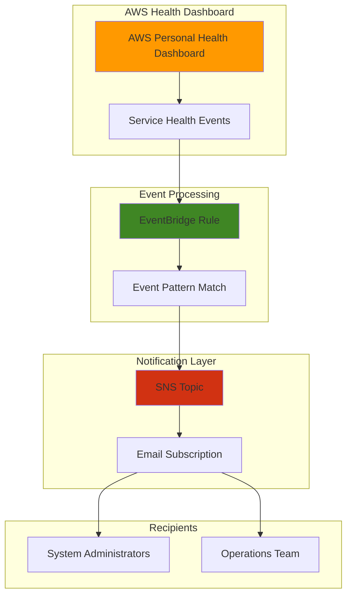

# Service Health Notifications with Health and SNS

## Problem

Organizations struggle to stay informed about AWS service disruptions, scheduled maintenance, and security events that could impact their applications and infrastructure. Manual monitoring of the AWS Personal Health Dashboard is time-consuming and unreliable, leading to delayed responses to critical service events that can affect business operations and customer experience.

## Solution

Implement an automated notification system using AWS Personal Health Dashboard, EventBridge, and SNS to receive real-time alerts about AWS service health events. This solution automatically detects service events affecting your account and sends immediate notifications via email, enabling proactive incident response and improved operational awareness.

## Architecture Diagram



## Prerequisites

1. AWS account with appropriate permissions for Health, EventBridge, and SNS services
2. AWS CLI installed and configured (version 2.0 or later)
3. Basic understanding of AWS service notifications and event-driven architecture
4. Valid email address for receiving notifications
5. Estimated cost: Less than $1/month for typical notification volumes (SNS charges $0.50 per 1 million notifications)

> **Note**: AWS Personal Health Dashboard events are available at no additional charge. You only pay for SNS notification delivery based on usage.

## Preparation

```bash
# Set environment variables
export AWS_REGION=$(aws configure get region)
export AWS_ACCOUNT_ID=$(aws sts get-caller-identity \
    --query Account --output text)

# Generate unique identifiers for resources
RANDOM_SUFFIX=$(aws secretsmanager get-random-password \
    --exclude-punctuation --exclude-uppercase \
    --password-length 6 --require-each-included-type \
    --output text --query RandomPassword)

# Set email address for notifications (replace with your email)
export NOTIFICATION_EMAIL="your-email@example.com"

# Create resource names
export SNS_TOPIC_NAME="aws-health-notifications-${RANDOM_SUFFIX}"
export EVENTBRIDGE_RULE_NAME="aws-health-events-rule-${RANDOM_SUFFIX}"

echo "✅ AWS environment configured"
echo "Region: ${AWS_REGION}"
echo "Account ID: ${AWS_ACCOUNT_ID}"
echo "SNS Topic: ${SNS_TOPIC_NAME}"
```

## Steps

1. **Create SNS Topic for Health Notifications**:

   Amazon SNS provides a fully managed messaging service that enables you to send notifications to multiple subscribers simultaneously. Creating a dedicated topic for AWS Health events ensures organized delivery of service notifications while supporting future expansion to additional notification endpoints like SMS or Slack integrations.

   ```bash
   # Create SNS topic for health notifications
   aws sns create-topic \
       --name ${SNS_TOPIC_NAME} \
       --attributes DisplayName="AWS Health Notifications"
   
   # Store the topic ARN for subsequent commands
   export TOPIC_ARN=$(aws sns get-topic-attributes \
       --topic-arn arn:aws:sns:${AWS_REGION}:${AWS_ACCOUNT_ID}:${SNS_TOPIC_NAME} \
       --query 'Attributes.TopicArn' --output text)
   
   echo "✅ SNS topic created: ${TOPIC_ARN}"
   ```

   The SNS topic serves as the central hub for distributing AWS Health notifications to all configured subscribers. This scalable approach allows you to easily add or remove notification endpoints without modifying the EventBridge rule configuration, supporting your growing operational needs.

2. **Subscribe Email Address to SNS Topic**:

   Email subscriptions provide immediate, accessible notifications that integrate seamlessly with existing communication workflows. The subscription process includes automatic confirmation to ensure secure delivery and prevent unauthorized subscriptions to your notification topic, following AWS security best practices.

   ```bash
   # Subscribe email to the SNS topic
   aws sns subscribe \
       --topic-arn ${TOPIC_ARN} \
       --protocol email \
       --notification-endpoint ${NOTIFICATION_EMAIL}
   
   echo "✅ Email subscription created for: ${NOTIFICATION_EMAIL}"
   echo "📧 Check your email and confirm the subscription"
   echo "⏳ Waiting 30 seconds for email delivery..."
   sleep 30
   ```

   A confirmation email will be sent to the specified address within 1-2 minutes. You must click the confirmation link to activate the subscription and begin receiving notifications. This security measure prevents unauthorized email subscriptions and ensures compliance with anti-spam regulations.

3. **Create IAM Role for EventBridge**:

   EventBridge requires appropriate IAM permissions to publish messages to your SNS topic. Creating a dedicated service role follows the principle of least privilege, granting only the specific permissions needed for the health notification workflow while maintaining security boundaries.

   ```bash
   # Create trust policy for EventBridge service
   cat > eventbridge-trust-policy.json << 'EOF'
   {
       "Version": "2012-10-17",
       "Statement": [
           {
               "Effect": "Allow",
               "Principal": {
                   "Service": "events.amazonaws.com"
               },
               "Action": "sts:AssumeRole"
           }
       ]
   }
   EOF
   
   # Create IAM role for EventBridge
   export ROLE_NAME="HealthNotificationRole-${RANDOM_SUFFIX}"
   aws iam create-role \
       --role-name ${ROLE_NAME} \
       --assume-role-policy-document file://eventbridge-trust-policy.json
   
   # Wait for role propagation
   echo "⏳ Waiting for IAM role to propagate..."
   sleep 10
   
   # Create and attach policy for SNS publishing permissions
   cat > sns-publish-policy.json << EOF
   {
       "Version": "2012-10-17",
       "Statement": [
           {
               "Effect": "Allow",
               "Action": [
                   "sns:Publish"
               ],
               "Resource": "${TOPIC_ARN}"
           }
       ]
   }
   EOF
   
   aws iam put-role-policy \
       --role-name ${ROLE_NAME} \
       --policy-name SNSPublishPolicy \
       --policy-document file://sns-publish-policy.json
   
   export ROLE_ARN=$(aws iam get-role --role-name ${ROLE_NAME} \
       --query 'Role.Arn' --output text)
   
   echo "✅ IAM role created: ${ROLE_ARN}"
   ```

   This IAM configuration ensures secure, least-privilege access while enabling EventBridge to deliver notifications reliably. The role is scoped specifically to the health notification topic, maintaining security boundaries across your AWS environment and following AWS security best practices.

4. **Create EventBridge Rule for AWS Health Events**:

   EventBridge rules define the event patterns that trigger notifications, filtering AWS Health events based on your specific monitoring requirements. This rule captures all Health events affecting your account, including service disruptions, scheduled maintenance, and security notifications across all AWS services.

   ```bash
   # Create event pattern for AWS Health events
   cat > health-event-pattern.json << 'EOF'
   {
       "source": ["aws.health"],
       "detail-type": ["AWS Health Event"]
   }
   EOF
   
   # Create EventBridge rule with comprehensive event monitoring
   aws events put-rule \
       --name ${EVENTBRIDGE_RULE_NAME} \
       --description "Monitor AWS Health events and send SNS notifications" \
       --event-pattern file://health-event-pattern.json \
       --state ENABLED
   
   echo "✅ EventBridge rule created: ${EVENTBRIDGE_RULE_NAME}"
   ```

   The event pattern filters for all AWS Health events across your account, ensuring comprehensive coverage of service issues that could impact your infrastructure. This pattern captures both account-specific events and broader service announcements relevant to your resources, providing complete visibility into AWS service health.

5. **Configure SNS as EventBridge Target**:

   Connecting the EventBridge rule to your SNS topic creates the automated notification pathway. When AWS Health events match the rule pattern, EventBridge automatically publishes formatted messages to SNS, which then delivers notifications to all subscribers with reliable message delivery.

   ```bash
   # Add SNS topic as target for the EventBridge rule
   aws events put-targets \
       --rule ${EVENTBRIDGE_RULE_NAME} \
       --targets "Id"="1","Arn"="${TOPIC_ARN}","RoleArn"="${ROLE_ARN}"
   
   echo "✅ SNS target configured for EventBridge rule"
   ```

   This configuration establishes the complete event flow from AWS Health through EventBridge to SNS, enabling real-time notification delivery. The target configuration includes the IAM role needed for secure message publishing to your notification topic, ensuring reliable event processing.

6. **Configure SNS Topic Policy for EventBridge Access**:

   SNS topic policies control which services can publish messages to your topic. Adding EventBridge permissions ensures the service can deliver health notifications while maintaining security controls over topic access, completing the secure notification pipeline.

   ```bash
   # Create topic policy to allow EventBridge access
   cat > topic-policy.json << EOF
   {
       "Version": "2012-10-17",
       "Statement": [
           {
               "Sid": "AllowEventBridgePublish",
               "Effect": "Allow",
               "Principal": {
                   "Service": "events.amazonaws.com"
               },
               "Action": "sns:Publish",
               "Resource": "${TOPIC_ARN}"
           }
       ]
   }
   EOF
   
   # Apply the policy to the SNS topic
   aws sns set-topic-attributes \
       --topic-arn ${TOPIC_ARN} \
       --attribute-name Policy \
       --attribute-value file://topic-policy.json
   
   echo "✅ SNS topic policy configured for EventBridge access"
   echo "🎉 Health notification system is now active!"
   ```

   The topic policy enables EventBridge to publish messages directly to your SNS topic, completing the notification pipeline. This permission is essential for the automated delivery of AWS Health event notifications to your subscribers and completes the secure event-driven architecture.

## Validation & Testing

1. **Verify SNS Topic and Subscription Status**:

   ```bash
   # Check SNS topic exists and review attributes
   aws sns get-topic-attributes --topic-arn ${TOPIC_ARN}
   
   # List subscriptions to verify email subscription
   aws sns list-subscriptions-by-topic --topic-arn ${TOPIC_ARN}
   ```

   Expected output: Topic attributes showing DisplayName and subscription details with your email address. Look for "SubscriptionArn" (indicates confirmed subscription) or "PendingConfirmation" status if you haven't confirmed yet.

2. **Verify EventBridge Rule Configuration**:

   ```bash
   # Check rule status and configuration
   aws events describe-rule --name ${EVENTBRIDGE_RULE_NAME}
   
   # Verify rule targets are properly configured
   aws events list-targets-by-rule --rule ${EVENTBRIDGE_RULE_NAME}
   ```

   Expected output: Rule details showing "State": "ENABLED", event pattern configuration, and target configuration with your SNS topic ARN and IAM role ARN.

3. **Test Complete Notification Pipeline**:

   ```bash
   # Send a test message to verify the complete pipeline
   aws sns publish \
       --topic-arn ${TOPIC_ARN} \
       --subject "Test: AWS Health Notification System" \
       --message "This is a test message to verify your AWS Health notification system is working correctly. If you receive this email, your notification pipeline is operational."
   
   echo "📧 Test notification sent. Check your email inbox within 1-2 minutes."
   echo "✅ If you receive the email, your health notification system is ready!"
   ```

   Expected result: You should receive a test email within 1-2 minutes confirming the notification system is operational and ready to deliver AWS Health events.

## Cleanup

1. **Remove EventBridge Rule and Targets**:

   ```bash
   # Remove targets from the rule first
   aws events remove-targets \
       --rule ${EVENTBRIDGE_RULE_NAME} \
       --ids "1"
   
   # Delete the EventBridge rule
   aws events delete-rule --name ${EVENTBRIDGE_RULE_NAME}
   
   echo "✅ EventBridge rule and targets deleted"
   ```

2. **Delete SNS Topic and Subscriptions**:

   ```bash
   # Delete SNS topic (automatically removes all subscriptions)
   aws sns delete-topic --topic-arn ${TOPIC_ARN}
   
   echo "✅ SNS topic and subscriptions deleted"
   ```

3. **Remove IAM Role and Policies**:

   ```bash
   # Delete inline policy from role
   aws iam delete-role-policy \
       --role-name ${ROLE_NAME} \
       --policy-name SNSPublishPolicy
   
   # Delete IAM role
   aws iam delete-role --role-name ${ROLE_NAME}
   
   echo "✅ IAM role and policies deleted"
   ```

4. **Clean Up Local Files and Environment**:

   ```bash
   # Remove temporary policy files
   rm -f eventbridge-trust-policy.json sns-publish-policy.json \
         health-event-pattern.json topic-policy.json
   
   # Clear environment variables
   unset TOPIC_ARN ROLE_ARN SNS_TOPIC_NAME EVENTBRIDGE_RULE_NAME \
         ROLE_NAME NOTIFICATION_EMAIL RANDOM_SUFFIX
   
   echo "✅ Local files and environment variables cleaned up"
   ```

## Discussion

AWS Personal Health Dashboard provides personalized service health information that goes beyond the general service status page, delivering account-specific events that directly impact your resources. By integrating this service with EventBridge and SNS, you create a proactive monitoring system that ensures immediate awareness of service disruptions, security events, and scheduled maintenance activities. This automation significantly reduces the mean time to awareness (MTTA) for service incidents, enabling faster response times and improved operational resilience.

The EventBridge integration follows AWS best practices for event-driven architecture, providing reliable event delivery with built-in retry mechanisms and error handling. EventBridge processes AWS Health events on a best-effort basis, typically delivering notifications within minutes of event occurrence. The service automatically handles event routing, filtering, and delivery without requiring server management or capacity planning, embodying the serverless operational model.

The SNS integration offers flexible notification delivery options that can expand beyond email to include SMS, mobile push notifications, Slack webhooks, or custom Lambda functions for advanced processing. This multi-channel approach ensures critical health notifications reach the appropriate team members regardless of their current communication preferences or availability. SNS provides guaranteed message delivery with automatic retry mechanisms and dead letter queue support for mission-critical notifications.

This solution aligns with the AWS Well-Architected Framework's operational excellence pillar by automating routine monitoring tasks and providing actionable insights for operational teams. For comprehensive guidance on operational best practices, refer to the [AWS Well-Architected Framework - Operational Excellence Pillar](https://docs.aws.amazon.com/wellarchitected/latest/operational-excellence-pillar/welcome.html). Additional implementation details can be found in the [AWS Health User Guide](https://docs.aws.amazon.com/health/latest/ug/what-is-aws-health.html) and [EventBridge integration documentation](https://docs.aws.amazon.com/health/latest/ug/cloudwatch-events-health.html).

> **Tip**: Consider creating separate EventBridge rules for different event categories (e.g., security events, scheduled maintenance) to enable targeted notification routing and response procedures. The [AWS Health events EventBridge schema reference](https://docs.aws.amazon.com/health/latest/ug/aws-health-events-eventbridge-schema.html) provides detailed information for advanced filtering and custom event processing patterns.

## Challenge

Extend this health notification system with these advanced capabilities:

1. **Multi-Channel Notifications**: Add Slack or Microsoft Teams integration using SNS webhooks or Lambda functions to deliver notifications directly to operational channels where teams collaborate and respond to incidents.

2. **Event Categorization and Routing**: Create multiple EventBridge rules with specific event patterns to route different types of health events (security, maintenance, outages) to appropriate teams or escalation procedures based on severity and impact.

3. **Automated Incident Response**: Integrate with AWS Systems Manager to automatically execute runbooks or remediation procedures when specific health events occur, such as scaling resources during service disruptions or updating security groups.

4. **Historical Event Analysis**: Store health events in DynamoDB or S3 for trend analysis and operational reporting, enabling proactive capacity planning and service optimization based on historical patterns and service reliability metrics.

5. **Cross-Account Aggregation**: Implement organizational health event monitoring using AWS Organizations delegated administrator access to centralize health notifications across multiple AWS accounts, providing enterprise-wide visibility into service health.

## Infrastructure Code

### Available Infrastructure as Code:

- [Infrastructure Code Overview](code/README.md) - Detailed description of all infrastructure components
- [AWS CDK (Python)](code/cdk-python/) - AWS CDK Python implementation
- [AWS CDK (TypeScript)](code/cdk-typescript/) - AWS CDK TypeScript implementation
- [CloudFormation](code/cloudformation.yaml) - AWS CloudFormation template
- [Bash CLI Scripts](code/scripts/) - Example bash scripts using AWS CLI commands to deploy infrastructure
- [Terraform](code/terraform/) - Terraform configuration files