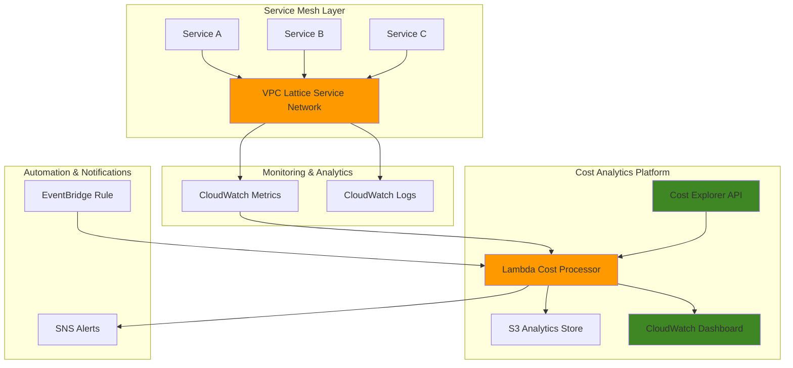

# Service Mesh Cost Analytics with VPC Lattice and Cost Explorer

## Problem

Enterprise organizations deploying service mesh architectures with VPC Lattice struggle to understand cost attribution across microservices, identify optimization opportunities, and correlate traffic patterns with infrastructure spending. Without granular cost analytics, teams cannot effectively optimize their service mesh investments or justify infrastructure decisions to stakeholders. Traditional cost monitoring approaches lack the service-level visibility needed for mesh architectures, resulting in budget overruns and inefficient resource allocation.

## Solution

Build an automated cost analytics platform that combines VPC Lattice monitoring capabilities with Cost Explorer APIs to provide comprehensive service mesh cost insights. This solution leverages CloudWatch metrics for traffic analysis, Lambda functions for automated cost data processing, and custom dashboards for optimization recommendations. The platform enables teams to track costs by service, analyze traffic-to-cost correlations, and generate actionable optimization insights for their VPC Lattice mesh architectures.

## Architecture Diagram



## Prerequisites

1. AWS account with VPC Lattice and Cost Explorer enabled
2. AWS CLI v2 installed and configured with appropriate IAM permissions
3. Understanding of service mesh concepts and cost allocation strategies
4. Existing VPC Lattice service network or willingness to create one for testing
5. IAM permissions for VPC Lattice, Cost Explorer, CloudWatch, Lambda, S3, and EventBridge
6. Estimated cost: $15-25 per month for analytics infrastructure (excludes VPC Lattice service mesh traffic costs)

> **Note**: Cost Explorer requires activation and may take up to 24 hours to provide data. Ensure it's enabled before starting this recipe.

## Preparation

```bash
# Set environment variables for AWS configuration
export AWS_REGION=$(aws configure get region)
export AWS_ACCOUNT_ID=$(aws sts get-caller-identity \
    --query Account --output text)

# Generate unique identifiers for resources
RANDOM_SUFFIX=$(aws secretsmanager get-random-password \
    --exclude-punctuation --exclude-uppercase \
    --password-length 6 --require-each-included-type \
    --output text --query RandomPassword)

# Set project-specific variables
export PROJECT_NAME="lattice-cost-analytics"
export FUNCTION_NAME="lattice-cost-processor-${RANDOM_SUFFIX}"
export BUCKET_NAME="lattice-analytics-${RANDOM_SUFFIX}"
export ROLE_NAME="LatticeAnalyticsRole-${RANDOM_SUFFIX}"

# Verify Cost Explorer is enabled
aws ce get-cost-and-usage \
    --time-period Start=2025-01-01,End=2025-01-02 \
    --granularity MONTHLY \
    --metrics BlendedCost \
    --query 'ResultsByTime[0]' || echo "⚠️  Enable Cost Explorer first"

echo "✅ Environment configured for VPC Lattice cost analytics"
```

## Steps

1. **Create IAM Role for Cost Analytics Lambda**:

   AWS Lambda requires specific IAM permissions to access Cost Explorer APIs, CloudWatch metrics, and S3 storage. This role implements least privilege access while enabling comprehensive cost data collection across VPC Lattice resources. The role configuration follows AWS security best practices for serverless cost analytics workloads.

   ```bash
   # Create trust policy for Lambda service
   cat > trust-policy.json << 'EOF'
   {
     "Version": "2012-10-17",
     "Statement": [
       {
         "Effect": "Allow",
         "Principal": {
           "Service": "lambda.amazonaws.com"
         },
         "Action": "sts:AssumeRole"
       }
     ]
   }
   EOF
   
   # Create IAM role for Lambda function
   aws iam create-role \
       --role-name ${ROLE_NAME} \
       --assume-role-policy-document file://trust-policy.json \
       --description "Role for VPC Lattice cost analytics"
   
   # Store role ARN for later use
   ROLE_ARN=$(aws iam get-role --role-name ${ROLE_NAME} \
       --query 'Role.Arn' --output text)
   
   echo "✅ IAM role created: ${ROLE_ARN}"
   ```

2. **Attach Required IAM Policies**:

   The Lambda function requires comprehensive permissions to collect VPC Lattice metrics, query Cost Explorer data, and store analytics results. These policies enable automated cost tracking while maintaining security boundaries through service-specific permissions.

   ```bash
   # Create custom policy for cost analytics permissions
   cat > cost-analytics-policy.json << 'EOF'
   {
     "Version": "2012-10-17",
     "Statement": [
       {
         "Effect": "Allow",
         "Action": [
           "ce:GetCostAndUsage",
           "ce:GetUsageReport",
           "ce:ListCostCategoryDefinitions",
           "ce:GetCostCategories"
         ],
         "Resource": "*"
       },
       {
         "Effect": "Allow",
         "Action": [
           "cloudwatch:GetMetricStatistics",
           "cloudwatch:GetMetricData",
           "cloudwatch:ListMetrics",
           "cloudwatch:PutMetricData"
         ],
         "Resource": "*"
       },
       {
         "Effect": "Allow",
         "Action": [
           "vpc-lattice:GetService",
           "vpc-lattice:GetServiceNetwork",
           "vpc-lattice:ListServices",
           "vpc-lattice:ListServiceNetworks"
         ],
         "Resource": "*"
       },
       {
         "Effect": "Allow",
         "Action": [
           "s3:GetObject",
           "s3:PutObject",
           "s3:DeleteObject"
         ],
         "Resource": "arn:aws:s3:::lattice-analytics-${RANDOM_SUFFIX}/*"
       },
       {
         "Effect": "Allow",
         "Action": [
           "sns:Publish"
         ],
         "Resource": "*"
       }
     ]
   }
   EOF
   
   # Create and attach the custom policy
   aws iam create-policy \
       --policy-name LatticeAnalyticsPolicy-${RANDOM_SUFFIX} \
       --policy-document file://cost-analytics-policy.json
   
   POLICY_ARN="arn:aws:iam::${AWS_ACCOUNT_ID}:policy/LatticeAnalyticsPolicy-${RANDOM_SUFFIX}"
   
   aws iam attach-role-policy \
       --role-name ${ROLE_NAME} \
       --policy-arn ${POLICY_ARN}
   
   # Attach AWS managed policy for Lambda execution
   aws iam attach-role-policy \
       --role-name ${ROLE_NAME} \
       --policy-arn arn:aws:iam::aws:policy/service-role/AWSLambdaBasicExecutionRole
   
   # Wait for role propagation
   sleep 10
   
   echo "✅ IAM policies attached for comprehensive cost analytics"
   ```

3. **Create S3 Bucket for Analytics Data Storage**:

   S3 provides highly durable storage for cost analytics data with built-in versioning and lifecycle management capabilities. This bucket serves as the central repository for processed cost data, enabling historical analysis and trend identification across VPC Lattice service mesh deployments.

   ```bash
   # Create S3 bucket for analytics data storage
   aws s3 mb s3://${BUCKET_NAME} --region ${AWS_REGION}
   
   # Enable versioning for data protection
   aws s3api put-bucket-versioning \
       --bucket ${BUCKET_NAME} \
       --versioning-configuration Status=Enabled
   
   # Configure server-side encryption
   aws s3api put-bucket-encryption \
       --bucket ${BUCKET_NAME} \
       --server-side-encryption-configuration \
       'Rules=[{ApplyServerSideEncryptionByDefault:{SSEAlgorithm:AES256}}]'
   
   # Create folder structure for organized data storage
   aws s3api put-object \
       --bucket ${BUCKET_NAME} \
       --key cost-reports/
   
   aws s3api put-object \
       --bucket ${BUCKET_NAME} \
       --key metrics-data/
   
   echo "✅ S3 bucket configured for analytics data: ${BUCKET_NAME}"
   ```

4. **Create Lambda Function for Cost Processing**:

   AWS Lambda provides serverless compute that automatically scales based on cost data processing requirements. This function combines VPC Lattice CloudWatch metrics with Cost Explorer data to generate comprehensive cost analytics, enabling correlation between service mesh traffic patterns and infrastructure spending.

   ```bash
   # Create Lambda function code for cost analytics
   cat > lambda_function.py << 'EOF'
   import json
   import boto3
   import datetime
   from decimal import Decimal
   import os
   
   def lambda_handler(event, context):
       ce_client = boto3.client('ce')
       cw_client = boto3.client('cloudwatch')
       s3_client = boto3.client('s3')
       lattice_client = boto3.client('vpc-lattice')
       
       bucket_name = os.environ['BUCKET_NAME']
       
       # Calculate date range for cost analysis
       end_date = datetime.datetime.now().date()
       start_date = end_date - datetime.timedelta(days=7)
       
       try:
           # Get VPC Lattice service networks
           service_networks = lattice_client.list_service_networks()
           
           cost_data = {}
           
           # Query Cost Explorer for VPC Lattice related costs
           response = ce_client.get_cost_and_usage(
               TimePeriod={
                   'Start': start_date.strftime('%Y-%m-%d'),
                   'End': end_date.strftime('%Y-%m-%d')
               },
               Granularity='DAILY',
               Metrics=['BlendedCost', 'UsageQuantity'],
               GroupBy=[
                   {'Type': 'DIMENSION', 'Key': 'SERVICE'},
                   {'Type': 'DIMENSION', 'Key': 'REGION'}
               ],
               Filter={
                   'Or': [
                       {
                           'Dimensions': {
                               'Key': 'SERVICE',
                               'Values': ['Amazon Virtual Private Cloud']
                           }
                       },
                       {
                           'Dimensions': {
                               'Key': 'SERVICE', 
                               'Values': ['Amazon VPC Lattice']
                           }
                       }
                   ]
               }
           )
           
           # Process cost data
           for result in response['ResultsByTime']:
               date = result['TimePeriod']['Start']
               for group in result['Groups']:
                   service = group['Keys'][0]
                   region = group['Keys'][1]
                   amount = float(group['Metrics']['BlendedCost']['Amount'])
                   
                   cost_data[f"{date}_{service}_{region}"] = {
                       'date': date,
                       'service': service,
                       'region': region,
                       'cost': amount,
                       'currency': group['Metrics']['BlendedCost']['Unit']
                   }
           
           # Get VPC Lattice CloudWatch metrics
           metrics_data = {}
           for network in service_networks.get('items', []):
               network_id = network['id']
               network_name = network.get('name', network_id)
               
               # Get request count metrics for service network
               metric_response = cw_client.get_metric_statistics(
                   Namespace='AWS/VpcLattice',
                   MetricName='TotalRequestCount',
                   Dimensions=[
                       {'Name': 'ServiceNetwork', 'Value': network_id}
                   ],
                   StartTime=datetime.datetime.combine(start_date, datetime.time.min),
                   EndTime=datetime.datetime.combine(end_date, datetime.time.min),
                   Period=86400,  # Daily
                   Statistics=['Sum']
               )
               
               total_requests = sum([point['Sum'] for point in metric_response['Datapoints']])
               
               metrics_data[network_id] = {
                   'network_name': network_name,
                   'request_count': total_requests
               }
           
           # Combine cost and metrics data
           analytics_report = {
               'report_date': end_date.isoformat(),
               'time_period': {
                   'start': start_date.isoformat(),
                   'end': end_date.isoformat()
               },
               'cost_data': cost_data,
               'metrics_data': metrics_data,
               'summary': {
                   'total_cost': sum([item['cost'] for item in cost_data.values()]),
                   'total_requests': sum([item['request_count'] for item in metrics_data.values()]),
                   'cost_per_request': 0
               }
           }
           
           # Calculate cost per request if requests exist
           if analytics_report['summary']['total_requests'] > 0:
               analytics_report['summary']['cost_per_request'] = (
                   analytics_report['summary']['total_cost'] / 
                   analytics_report['summary']['total_requests']
               )
           
           # Store analytics report in S3
           report_key = f"cost-reports/{end_date.isoformat()}_lattice_analytics.json"
           s3_client.put_object(
               Bucket=bucket_name,
               Key=report_key,
               Body=json.dumps(analytics_report, indent=2),
               ContentType='application/json'
           )
           
           # Create CloudWatch custom metrics
           cw_client.put_metric_data(
               Namespace='VPCLattice/CostAnalytics',
               MetricData=[
                   {
                       'MetricName': 'TotalCost',
                       'Value': analytics_report['summary']['total_cost'],
                       'Unit': 'None'
                   },
                   {
                       'MetricName': 'TotalRequests',
                       'Value': analytics_report['summary']['total_requests'],
                       'Unit': 'Count'
                   },
                   {
                       'MetricName': 'CostPerRequest',
                       'Value': analytics_report['summary']['cost_per_request'],
                       'Unit': 'None'
                   }
               ]
           )
           
           # Add logic for cost threshold alerts
           if analytics_report['summary']['total_cost'] > 10.0:  # $10 threshold
               topic_arn = os.environ.get('TOPIC_ARN')
               
               if topic_arn:
                   sns_client = boto3.client('sns')
                   sns_client.publish(
                       TopicArn=topic_arn,
                       Subject='VPC Lattice Cost Alert',
                       Message=f"VPC Lattice costs have exceeded $10: ${analytics_report['summary']['total_cost']:.2f}"
                   )
           
           return {
               'statusCode': 200,
               'body': json.dumps({
                   'message': 'Cost analytics completed successfully',
                   'report_location': f's3://{bucket_name}/{report_key}',
                   'summary': analytics_report['summary']
               })
           }
           
       except Exception as e:
           print(f"Error processing cost analytics: {str(e)}")
           return {
               'statusCode': 500,
               'body': json.dumps({'error': str(e)})
           }
   EOF
   
   # Package Lambda function
   zip lambda-package.zip lambda_function.py
   
   # Create Lambda function with updated runtime
   aws lambda create-function \
       --function-name ${FUNCTION_NAME} \
       --runtime python3.11 \
       --role ${ROLE_ARN} \
       --handler lambda_function.lambda_handler \
       --zip-file fileb://lambda-package.zip \
       --timeout 300 \
       --memory-size 512 \
       --environment Variables="{BUCKET_NAME=${BUCKET_NAME}}" \
       --description "VPC Lattice cost analytics processor"
   
   # Store Lambda ARN for later use
   LAMBDA_ARN=$(aws lambda get-function \
       --function-name ${FUNCTION_NAME} \
       --query 'Configuration.FunctionArn' --output text)
   
   echo "✅ Lambda function created for cost analytics processing"
   ```

5. **Create Sample VPC Lattice Service Network**:

   VPC Lattice provides application-layer networking for microservices with built-in observability and security features. Creating a sample service network enables testing of the cost analytics platform while demonstrating real-world service mesh monitoring capabilities. This step establishes the foundation for collecting meaningful cost and traffic data.

   ```bash
   # Create VPC Lattice service network for testing
   SERVICE_NETWORK_NAME="cost-demo-network-${RANDOM_SUFFIX}"
   
   aws vpc-lattice create-service-network \
       --name ${SERVICE_NETWORK_NAME} \
       --auth-type AWS_IAM \
       --tags Key=Project,Value=${PROJECT_NAME} Key=Environment,Value=demo Key=CostCenter,Value=engineering
   
   # Store service network ID
   SERVICE_NETWORK_ID=$(aws vpc-lattice list-service-networks \
       --query "items[?name=='${SERVICE_NETWORK_NAME}'].id" \
       --output text)
   
   # Create sample service within the network
   SERVICE_NAME="demo-service-${RANDOM_SUFFIX}"
   
   aws vpc-lattice create-service \
       --name ${SERVICE_NAME} \
       --auth-type AWS_IAM \
       --tags Key=Project,Value=${PROJECT_NAME} Key=ServiceType,Value=demo
   
   SERVICE_ID=$(aws vpc-lattice list-services \
       --query "items[?name=='${SERVICE_NAME}'].id" \
       --output text)
   
   # Associate service with service network
   aws vpc-lattice create-service-network-service-association \
       --service-network-identifier ${SERVICE_NETWORK_ID} \
       --service-identifier ${SERVICE_ID}
   
   # Wait for association to complete
   sleep 30
   
   echo "✅ VPC Lattice service network created: ${SERVICE_NETWORK_NAME}"
   echo "📋 Service Network ID: ${SERVICE_NETWORK_ID}"
   ```

6. **Configure CloudWatch Dashboard for Cost Visualization**:

   CloudWatch dashboards provide real-time visualization of VPC Lattice cost metrics and traffic patterns. This centralized monitoring interface enables teams to quickly identify cost trends, traffic anomalies, and optimization opportunities across their service mesh infrastructure.

   ```bash
   # Create CloudWatch dashboard configuration
   cat > dashboard-config.json << EOF
   {
     "widgets": [
       {
         "type": "metric",
         "x": 0,
         "y": 0,
         "width": 12,
         "height": 6,
         "properties": {
           "metrics": [
             [ "VPCLattice/CostAnalytics", "TotalCost" ],
             [ ".", "TotalRequests" ]
           ],
           "period": 86400,
           "stat": "Sum",
           "region": "${AWS_REGION}",
           "title": "VPC Lattice Cost and Traffic Overview",
           "yAxis": {
             "left": {
               "min": 0
             }
           }
         }
       },
       {
         "type": "metric",
         "x": 12,
         "y": 0,
         "width": 12,
         "height": 6,
         "properties": {
           "metrics": [
             [ "VPCLattice/CostAnalytics", "CostPerRequest" ]
           ],
           "period": 86400,
           "stat": "Average",
           "region": "${AWS_REGION}",
           "title": "Cost Per Request Efficiency",
           "yAxis": {
             "left": {
               "min": 0
             }
           }
         }
       },
       {
         "type": "metric",
         "x": 0,
         "y": 6,
         "width": 24,
         "height": 6,
         "properties": {
           "metrics": [
             [ "AWS/VpcLattice", "TotalRequestCount", "ServiceNetwork", "${SERVICE_NETWORK_ID}" ],
             [ ".", "ActiveConnectionCount", ".", "." ],
             [ ".", "TotalConnectionCount", ".", "." ]
           ],
           "period": 300,
           "stat": "Sum",
           "region": "${AWS_REGION}",
           "title": "VPC Lattice Service Network Traffic Metrics"
         }
       }
     ]
   }
   EOF
   
   # Create CloudWatch dashboard
   aws cloudwatch put-dashboard \
       --dashboard-name "VPCLattice-CostAnalytics-${RANDOM_SUFFIX}" \
       --dashboard-body file://dashboard-config.json
   
   echo "✅ CloudWatch dashboard created for cost visualization"
   ```

7. **Set Up Automated Cost Analysis Schedule**:

   Amazon EventBridge provides scheduled execution of cost analytics workflows, enabling regular monitoring without manual intervention. This automation ensures consistent cost tracking and timely identification of optimization opportunities across VPC Lattice service mesh deployments.

   ```bash
   # Create EventBridge rule for daily cost analysis
   aws events put-rule \
       --name lattice-cost-analysis-${RANDOM_SUFFIX} \
       --schedule-expression "rate(1 day)" \
       --description "Daily VPC Lattice cost analysis trigger" \
       --state ENABLED
   
   # Get rule ARN
   RULE_ARN=$(aws events describe-rule \
       --name lattice-cost-analysis-${RANDOM_SUFFIX} \
       --query 'Arn' --output text)
   
   # Add Lambda function as target
   aws events put-targets \
       --rule lattice-cost-analysis-${RANDOM_SUFFIX} \
       --targets "Id"="1","Arn"="${LAMBDA_ARN}"
   
   # Grant EventBridge permission to invoke Lambda
   aws lambda add-permission \
       --function-name ${FUNCTION_NAME} \
       --statement-id lattice-cost-analysis-trigger \
       --action lambda:InvokeFunction \
       --principal events.amazonaws.com \
       --source-arn ${RULE_ARN}
   
   echo "✅ Automated cost analysis scheduled for daily execution"
   ```

8. **Configure SNS Topic for Cost Alerts**:

   Amazon SNS provides notification capabilities for cost threshold alerts and optimization recommendations. This topic enables automated alerting when VPC Lattice costs exceed predefined thresholds or when optimization opportunities are identified by the analytics platform.

   ```bash
   # Create SNS topic for cost alerts
   aws sns create-topic \
       --name lattice-cost-alerts-${RANDOM_SUFFIX}
   
   # Store topic ARN
   TOPIC_ARN=$(aws sns list-topics \
       --query "Topics[?contains(TopicArn, 'lattice-cost-alerts-${RANDOM_SUFFIX}')].TopicArn" \
       --output text)
   
   # Create subscription for email notifications (replace with your email)
   read -p "Enter your email address for cost alerts: " EMAIL_ADDRESS
   
   if [ ! -z "$EMAIL_ADDRESS" ]; then
       aws sns subscribe \
           --topic-arn ${TOPIC_ARN} \
           --protocol email \
           --notification-endpoint ${EMAIL_ADDRESS}
       
       echo "⚠️  Please check your email and confirm the SNS subscription"
   fi
   
   # Update Lambda function to include SNS publishing
   aws lambda update-function-configuration \
       --function-name ${FUNCTION_NAME} \
       --environment Variables="{BUCKET_NAME=${BUCKET_NAME},TOPIC_ARN=${TOPIC_ARN}}"
   
   echo "✅ SNS topic created for cost alerts: ${TOPIC_ARN}"
   ```

9. **Configure Cost Allocation Tags and Tracking**:

   AWS cost allocation tags enable granular cost tracking across VPC Lattice resources and service mesh components. Proper tagging strategy ensures accurate cost attribution to business units, projects, and optimization initiatives while supporting comprehensive financial analysis of service mesh investments.

   ```bash
   # Define cost allocation tag strategy
   cat > tag-policy.json << 'EOF'
   {
     "CostCenter": "engineering",
     "Project": "lattice-cost-analytics",
     "Environment": "production",
     "Owner": "platform-team",
     "ServiceMesh": "vpc-lattice"
   }
   EOF
   
   # Apply tags to Lambda function
   aws lambda tag-resource \
       --resource ${LAMBDA_ARN} \
       --tags CostCenter=engineering,Project=${PROJECT_NAME},Environment=demo
   
   # Apply tags to S3 bucket
   aws s3api put-bucket-tagging \
       --bucket ${BUCKET_NAME} \
       --tagging TagSet="[{Key=CostCenter,Value=engineering},{Key=Project,Value=${PROJECT_NAME}},{Key=Environment,Value=demo}]"
   
   # Apply tags to IAM role
   aws iam tag-role \
       --role-name ${ROLE_NAME} \
       --tags Key=CostCenter,Value=engineering Key=Project,Value=${PROJECT_NAME}
   
   # Tag VPC Lattice service network
   aws vpc-lattice tag-resource \
       --resource-arn $(aws vpc-lattice get-service-network \
           --service-network-identifier ${SERVICE_NETWORK_ID} \
           --query 'arn' --output text) \
       --tags CostCenter=engineering,Project=${PROJECT_NAME},Environment=demo
   
   echo "✅ Cost allocation tags applied to all resources"
   ```

## Validation & Testing

1. **Verify Lambda Function Execution**:

   ```bash
   # Test Lambda function manually
   aws lambda invoke \
       --function-name ${FUNCTION_NAME} \
       --payload '{}' \
       response.json
   
   # Check execution result
   cat response.json
   
   # Verify CloudWatch logs
   aws logs describe-log-groups \
       --log-group-name-prefix "/aws/lambda/${FUNCTION_NAME}"
   ```

   Expected output: Status code 200 with cost analytics summary and S3 location

2. **Validate Cost Data Collection**:

   ```bash
   # Check S3 bucket for analytics reports
   aws s3 ls s3://${BUCKET_NAME}/cost-reports/ --recursive
   
   # Download and examine latest report
   LATEST_REPORT=$(aws s3 ls s3://${BUCKET_NAME}/cost-reports/ \
       --query 'sort_by(Contents, &LastModified)[-1].Key' --output text)
   
   aws s3 cp s3://${BUCKET_NAME}/${LATEST_REPORT} latest-report.json
   
   # Display report summary (requires jq)
   if command -v jq &> /dev/null; then
       cat latest-report.json | jq '.summary'
   else
       echo "Install jq to view formatted JSON or examine latest-report.json manually"
   fi
   ```

   Expected output: JSON report with cost data, metrics, and calculated efficiency metrics

3. **Test CloudWatch Dashboard Visualization**:

   ```bash
   # Verify custom metrics are being published
   aws cloudwatch list-metrics \
       --namespace VPCLattice/CostAnalytics
   
   # Get latest cost metric value
   aws cloudwatch get-metric-statistics \
       --namespace VPCLattice/CostAnalytics \
       --metric-name TotalCost \
       --start-time $(date -u -d '1 hour ago' +%Y-%m-%dT%H:%M:%S) \
       --end-time $(date -u +%Y-%m-%dT%H:%M:%S) \
       --period 3600 \
       --statistics Sum
   ```

   Expected output: Custom metrics published with recent data points

4. **Verify EventBridge Automation**:

   ```bash
   # Check EventBridge rule status
   aws events describe-rule \
       --name lattice-cost-analysis-${RANDOM_SUFFIX}
   
   # Verify Lambda function targets
   aws events list-targets-by-rule \
       --rule lattice-cost-analysis-${RANDOM_SUFFIX}
   ```

   Expected output: Active rule with Lambda function properly configured as target

## Cleanup

1. **Remove SNS Resources**:

   ```bash
   # Remove SNS subscription and topic
   if [ ! -z "$TOPIC_ARN" ]; then
       # List and delete all subscriptions
       aws sns list-subscriptions-by-topic \
           --topic-arn ${TOPIC_ARN} \
           --query 'Subscriptions[].SubscriptionArn' \
           --output text | xargs -I {} aws sns unsubscribe --subscription-arn {}
       
       # Delete SNS topic
       aws sns delete-topic --topic-arn ${TOPIC_ARN}
   fi
   
   echo "✅ SNS resources removed"
   ```

2. **Remove EventBridge Automation**:

   ```bash
   # Remove EventBridge targets
   aws events remove-targets \
       --rule lattice-cost-analysis-${RANDOM_SUFFIX} \
       --ids 1
   
   # Delete EventBridge rule
   aws events delete-rule \
       --name lattice-cost-analysis-${RANDOM_SUFFIX}
   
   echo "✅ EventBridge automation removed"
   ```

3. **Delete CloudWatch Dashboard**:

   ```bash
   # Delete CloudWatch dashboard
   aws cloudwatch delete-dashboards \
       --dashboard-names "VPCLattice-CostAnalytics-${RANDOM_SUFFIX}"
   
   echo "✅ CloudWatch dashboard deleted"
   ```

4. **Remove VPC Lattice Resources**:

   ```bash
   # Remove service network association
   ASSOCIATION_ID=$(aws vpc-lattice list-service-network-service-associations \
       --service-network-identifier ${SERVICE_NETWORK_ID} \
       --query 'items[0].id' --output text)
   
   if [ "${ASSOCIATION_ID}" != "None" ] && [ "${ASSOCIATION_ID}" != "" ]; then
       aws vpc-lattice delete-service-network-service-association \
           --service-network-service-association-identifier ${ASSOCIATION_ID}
   fi
   
   # Delete service
   aws vpc-lattice delete-service \
       --service-identifier ${SERVICE_ID}
   
   # Delete service network
   aws vpc-lattice delete-service-network \
       --service-network-identifier ${SERVICE_NETWORK_ID}
   
   echo "✅ VPC Lattice resources removed"
   ```

5. **Delete Lambda Function and S3 Bucket**:

   ```bash
   # Delete Lambda function
   aws lambda delete-function \
       --function-name ${FUNCTION_NAME}
   
   # Empty and delete S3 bucket
   aws s3 rm s3://${BUCKET_NAME} --recursive
   aws s3 rb s3://${BUCKET_NAME}
   
   echo "✅ Lambda function and S3 bucket deleted"
   ```

6. **Remove IAM Resources**:

   ```bash
   # Detach policies from role
   aws iam detach-role-policy \
       --role-name ${ROLE_NAME} \
       --policy-arn ${POLICY_ARN}
   
   aws iam detach-role-policy \
       --role-name ${ROLE_NAME} \
       --policy-arn arn:aws:iam::aws:policy/service-role/AWSLambdaBasicExecutionRole
   
   # Delete custom policy
   aws iam delete-policy --policy-arn ${POLICY_ARN}
   
   # Delete IAM role
   aws iam delete-role --role-name ${ROLE_NAME}
   
   # Clean up local files
   rm -f trust-policy.json cost-analytics-policy.json
   rm -f dashboard-config.json tag-policy.json
   rm -f lambda_function.py lambda-package.zip
   rm -f response.json latest-report.json
   
   echo "✅ All resources cleaned up successfully"
   ```

## Discussion

This service mesh cost analytics solution demonstrates how to effectively monitor and optimize VPC Lattice infrastructure investments using native AWS services. The architecture combines real-time traffic metrics from CloudWatch with detailed cost data from Cost Explorer to provide comprehensive visibility into service mesh economics. By correlating traffic patterns with infrastructure spending, teams can identify optimization opportunities and make data-driven decisions about resource allocation.

The solution leverages several key AWS architectural patterns for cost optimization. The serverless Lambda function processes cost data on-demand, eliminating fixed infrastructure costs while scaling automatically based on analysis requirements. S3 provides cost-effective long-term storage for historical analytics data, enabling trend analysis and capacity planning. CloudWatch dashboards offer real-time visibility into cost metrics, while EventBridge automation ensures consistent monitoring without manual intervention.

One critical aspect of this implementation is the proper use of cost allocation tags across all resources. As documented in the [AWS Cost Allocation Tags guide](https://docs.aws.amazon.com/awsaccountbilling/latest/aboutv2/cost-alloc-tags.html), consistent tagging enables granular cost tracking and helps organizations understand spending patterns across different business units or projects. The VPC Lattice service mesh benefits significantly from this approach, as it allows teams to attribute networking costs to specific applications or services.

The Cost Explorer API integration follows [AWS Cost Explorer best practices](https://docs.aws.amazon.com/cost-management/latest/userguide/ce-api-best-practices.html) by implementing appropriate caching strategies and avoiding excessive API calls. The Lambda function processes cost data efficiently while respecting API rate limits and optimizing for cost-effectiveness. This approach ensures reliable cost analytics without incurring unnecessary expenses from API usage. The Cost Explorer filter uses an "Or" condition to capture both general VPC costs and specific VPC Lattice service costs, providing comprehensive cost visibility across networking services.

The VPC Lattice CloudWatch metrics integration leverages the [AWS/VpcLattice namespace](https://docs.aws.amazon.com/vpc-lattice/latest/ug/monitoring-cloudwatch.html) to collect service network and target group metrics. Key metrics include TotalRequestCount, ActiveConnectionCount, and RequestTime, which provide essential traffic data for cost correlation analysis. The solution correctly uses service network identifiers as dimensions to filter metrics appropriately.

> **Tip**: Consider using Amazon EventBridge Scheduler instead of EventBridge Rules for new implementations, as AWS recommends EventBridge Scheduler for improved scalability and additional features. Configure CloudWatch alarms on the custom cost metrics to automatically notify teams when spending exceeds predefined thresholds.

## Challenge

Extend this service mesh cost analytics platform with these advanced capabilities:

1. **Multi-Account Cost Aggregation**: Implement cross-account cost collection using AWS Organizations and consolidated billing to provide enterprise-wide service mesh cost visibility across multiple AWS accounts and business units.

2. **Predictive Cost Modeling**: Add machine learning capabilities using Amazon Forecast to predict future VPC Lattice costs based on historical traffic patterns, seasonal trends, and planned capacity changes.

3. **Automated Optimization Recommendations**: Enhance the Lambda function to generate actionable optimization recommendations, such as right-sizing suggestions, traffic routing optimizations, or service consolidation opportunities based on cost-per-request metrics.

4. **Integration with AWS Budgets**: Implement automated budget tracking and alerting by integrating with AWS Budgets API to create dynamic spending limits based on service mesh usage patterns and business requirements.

5. **Cost Allocation Automation**: Build intelligent cost allocation logic that automatically distributes shared VPC Lattice infrastructure costs across consuming applications based on traffic volume, request complexity, or custom business rules.

## Infrastructure Code

### Available Infrastructure as Code:

- [Infrastructure Code Overview](code/README.md) - Detailed description of all infrastructure components
- [AWS CDK (Python)](code/cdk-python/) - AWS CDK Python implementation
- [AWS CDK (TypeScript)](code/cdk-typescript/) - AWS CDK TypeScript implementation
- [CloudFormation](code/cloudformation.yaml) - AWS CloudFormation template
- [Bash CLI Scripts](code/scripts/) - Example bash scripts using AWS CLI commands to deploy infrastructure
- [Terraform](code/terraform/) - Terraform configuration files