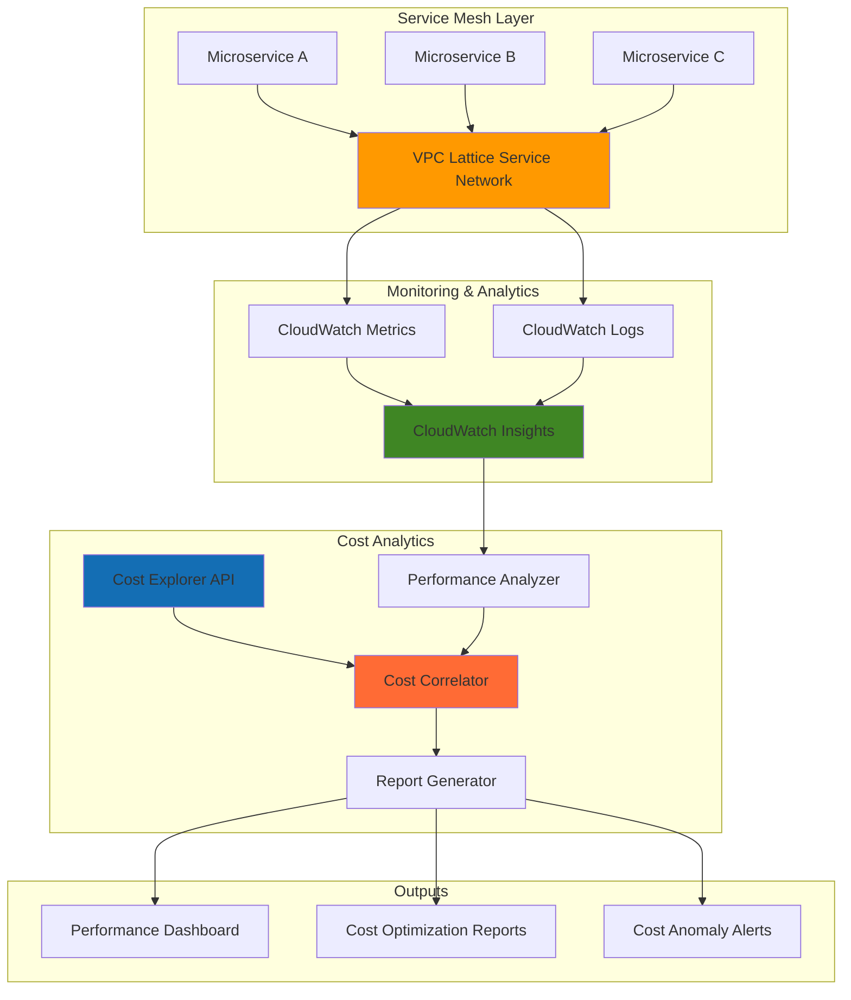

# Service Performance Cost Analytics with VPC Lattice and CloudWatch Insights

## Problem

Enterprise organizations running microservices architectures struggle to correlate service mesh performance metrics with actual infrastructure costs, making it difficult to identify which services are consuming the most resources and delivering poor cost-performance ratios. Without this visibility, teams cannot prioritize optimization efforts or make data-driven decisions about service scaling, leading to unnecessary cloud spending and performance bottlenecks.

## Solution

Build an advanced analytics system that automatically correlates VPC Lattice service mesh performance metrics with AWS costs using CloudWatch Insights queries and Cost Explorer API integration. This solution creates automated cost-performance dashboards, identifies optimization opportunities, and generates actionable recommendations through serverless Lambda functions that continuously analyze traffic patterns and spending trends.

## Architecture Diagram



## Prerequisites

1. AWS account with permissions for VPC Lattice, CloudWatch, Cost Explorer, Lambda, EventBridge, and IAM
2. AWS CLI installed and configured (version 2.x or higher)
3. Basic knowledge of service mesh concepts and CloudWatch Logs Insights query language
4. Two or more existing services/applications for demonstration (or ability to deploy sample services)
5. Estimated cost: $15-25/month for VPC Lattice traffic processing, CloudWatch Logs storage, and Lambda execution

> **Note**: This recipe requires Cost Explorer API access, which may incur additional charges based on API usage. Review [AWS Cost Explorer pricing](https://aws.amazon.com/aws-cost-management/pricing/) for current rates.

## Preparation

```bash
# Set environment variables
export AWS_REGION=$(aws configure get region)
export AWS_ACCOUNT_ID=$(aws sts get-caller-identity \
    --query Account --output text)

# Generate unique identifiers for resources
RANDOM_SUFFIX=$(aws secretsmanager get-random-password \
    --exclude-punctuation --exclude-uppercase \
    --password-length 6 --require-each-included-type \
    --output text --query RandomPassword)

# Set resource names
export SERVICE_NETWORK_NAME="analytics-mesh-${RANDOM_SUFFIX}"
export LOG_GROUP_NAME="/aws/vpclattice/performance-analytics"
export LAMBDA_ROLE_NAME="lattice-analytics-role-${RANDOM_SUFFIX}"

# Create CloudWatch Log Group for VPC Lattice logs
aws logs create-log-group \
    --log-group-name ${LOG_GROUP_NAME} \
    --retention-in-days 7

echo "✅ AWS environment configured with unique suffix: ${RANDOM_SUFFIX}"
```

## Steps

1. **Create IAM Role for Lambda Functions**:

   AWS Lambda requires comprehensive permissions to access VPC Lattice metrics, CloudWatch Logs Insights, and Cost Explorer API. This role follows the principle of least privilege while enabling the analytics functions to correlate performance data with cost information across multiple AWS services.

   ```bash
   # Create trust policy for Lambda
   cat > lambda-trust-policy.json << EOF
   {
     "Version": "2012-10-17",
     "Statement": [
       {
         "Effect": "Allow",
         "Principal": {
           "Service": "lambda.amazonaws.com"
         },
         "Action": "sts:AssumeRole"
       }
     ]
   }
   EOF
   
   # Create IAM role
   aws iam create-role \
       --role-name ${LAMBDA_ROLE_NAME} \
       --assume-role-policy-document file://lambda-trust-policy.json
   
   # Attach necessary policies
   aws iam attach-role-policy \
       --role-name ${LAMBDA_ROLE_NAME} \
       --policy-arn arn:aws:iam::aws:policy/service-role/AWSLambdaBasicExecutionRole
   
   aws iam attach-role-policy \
       --role-name ${LAMBDA_ROLE_NAME} \
       --policy-arn arn:aws:iam::aws:policy/CloudWatchLogsFullAccess
   
   # Wait for role propagation
   sleep 10
   
   echo "✅ IAM role created with comprehensive permissions"
   ```

2. **Create Custom Policy for Cost Explorer Access**:

   Cost Explorer API requires specific permissions to retrieve cost and usage data programmatically. This custom policy enables Lambda functions to query cost data and correlate it with performance metrics for comprehensive analytics.

   ```bash
   # Create custom policy for Cost Explorer access
   cat > cost-explorer-policy.json << EOF
   {
     "Version": "2012-10-17",
     "Statement": [
       {
         "Effect": "Allow",
         "Action": [
           "ce:GetCostAndUsage",
           "ce:GetDimensionValues",
           "ce:GetMetricsAndUsage",
           "ce:ListCostCategoryDefinitions",
           "ce:GetUsageReport",
           "ce:GetAnomalyDetectors",
           "ce:GetAnomalySubscriptions"
         ],
         "Resource": "*"
       },
       {
         "Effect": "Allow",
         "Action": [
           "cloudwatch:PutMetricData",
           "logs:StartQuery",
           "logs:GetQueryResults",
           "vpc-lattice:GetService",
           "vpc-lattice:GetServiceNetwork",
           "vpc-lattice:ListServices",
           "vpc-lattice:ListServiceNetworks"
         ],
         "Resource": "*"
       }
     ]
   }
   EOF
   
   # Create and attach the policy
   aws iam create-policy \
       --policy-name CostExplorerAnalyticsPolicy-${RANDOM_SUFFIX} \
       --policy-document file://cost-explorer-policy.json
   
   aws iam attach-role-policy \
       --role-name ${LAMBDA_ROLE_NAME} \
       --policy-arn arn:aws:iam::${AWS_ACCOUNT_ID}:policy/CostExplorerAnalyticsPolicy-${RANDOM_SUFFIX}
   
   export LAMBDA_ROLE_ARN="arn:aws:iam::${AWS_ACCOUNT_ID}:role/${LAMBDA_ROLE_NAME}"
   
   echo "✅ Cost Explorer permissions configured"
   ```

3. **Create VPC Lattice Service Network**:

   VPC Lattice provides application-layer networking that automatically captures detailed metrics about service-to-service communication. Creating a service network establishes the foundation for collecting performance data that will be correlated with cost information in our analytics system.

   ```bash
   # Create VPC Lattice service network with monitoring enabled
   aws vpc-lattice create-service-network \
       --name ${SERVICE_NETWORK_NAME} \
       --auth-type AWS_IAM \
       --tags Key=Purpose,Value=PerformanceCostAnalytics \
              Key=Environment,Value=Demo
   
   # Store service network details
   export SERVICE_NETWORK_ID=$(aws vpc-lattice list-service-networks \
       --query "serviceNetworks[?name=='${SERVICE_NETWORK_NAME}'].id" \
       --output text)
   
   export SERVICE_NETWORK_ARN=$(aws vpc-lattice list-service-networks \
       --query "serviceNetworks[?name=='${SERVICE_NETWORK_NAME}'].arn" \
       --output text)
   
   echo "✅ VPC Lattice service network created: ${SERVICE_NETWORK_ID}"
   ```

4. **Configure CloudWatch Logs Integration for VPC Lattice**:

   Enabling CloudWatch Logs for VPC Lattice captures detailed request and response data that CloudWatch Insights can query for performance analysis. This configuration ensures all service mesh traffic is logged with the necessary detail for cost correlation analysis.

   ```bash
   # Configure access logs for the service network
   aws vpc-lattice put-access-log-subscription \
       --resource-identifier ${SERVICE_NETWORK_ARN} \
       --destination-arn arn:aws:logs:${AWS_REGION}:${AWS_ACCOUNT_ID}:log-group:${LOG_GROUP_NAME}
   
   # Wait for configuration to propagate
   sleep 15
   
   # Verify access log subscription
   aws vpc-lattice get-access-log-subscription \
       --resource-identifier ${SERVICE_NETWORK_ARN}
   
   echo "✅ CloudWatch Logs integration configured for VPC Lattice"
   ```

5. **Create Performance Metrics Analyzer Lambda Function**:

   This Lambda function uses CloudWatch Insights to analyze VPC Lattice traffic patterns, calculate performance metrics, and identify trends in service utilization. It serves as the foundation for correlating performance data with cost information.

   ```bash
   # Create performance analyzer function code
   cat > performance_analyzer.py << 'EOF'
   import json
   import boto3
   import time
   from datetime import datetime, timedelta
   
   def lambda_handler(event, context):
       logs_client = boto3.client('logs')
       cloudwatch = boto3.client('cloudwatch')
       
       try:
           # Calculate time range for analysis (last 24 hours)
           end_time = datetime.now()
           start_time = end_time - timedelta(hours=24)
           
           # CloudWatch Insights query for VPC Lattice performance
           query = """
           fields @timestamp, sourceVpc, targetService, responseTime, requestSize, responseSize
           | filter @message like /requestId/
           | stats avg(responseTime) as avgResponseTime, 
                   sum(requestSize) as totalRequests,
                   sum(responseSize) as totalBytes,
                   count() as requestCount by targetService
           | sort avgResponseTime desc
           """
           
           # Start CloudWatch Insights query
           query_response = logs_client.start_query(
               logGroupName=event.get('log_group', '/aws/vpclattice/performance-analytics'),
               startTime=int(start_time.timestamp()),
               endTime=int(end_time.timestamp()),
               queryString=query
           )
           
           query_id = query_response['queryId']
           
           # Wait for query completion
           for attempt in range(30):  # Wait up to 30 seconds
               query_status = logs_client.get_query_results(queryId=query_id)
               if query_status['status'] == 'Complete':
                   break
               elif query_status['status'] == 'Failed':
                   raise Exception(f"Query failed: {query_status.get('statistics', {})}")
               time.sleep(1)
           else:
               raise Exception("Query timeout after 30 seconds")
           
           # Process results and publish custom metrics
           performance_data = []
           for result in query_status.get('results', []):
               service_metrics = {}
               for field in result:
                   service_metrics[field['field']] = field['value']
               
               if service_metrics:
                   performance_data.append(service_metrics)
                   
                   # Publish custom CloudWatch metrics
                   if 'targetService' in service_metrics and 'avgResponseTime' in service_metrics:
                       try:
                           cloudwatch.put_metric_data(
                               Namespace='VPCLattice/Performance',
                               MetricData=[
                                   {
                                       'MetricName': 'AverageResponseTime',
                                       'Dimensions': [
                                           {
                                               'Name': 'ServiceName',
                                               'Value': service_metrics['targetService']
                                           }
                                       ],
                                       'Value': float(service_metrics['avgResponseTime']),
                                       'Unit': 'Milliseconds',
                                       'Timestamp': datetime.now()
                                   }
                               ]
                           )
                       except Exception as metric_error:
                           print(f"Error publishing metrics: {metric_error}")
           
           return {
               'statusCode': 200,
               'body': json.dumps({
                   'message': 'Performance analysis completed',
                   'services_analyzed': len(performance_data),
                   'performance_data': performance_data,
                   'query_id': query_id
               })
           }
           
       except Exception as e:
           print(f"Error in performance analysis: {str(e)}")
           return {
               'statusCode': 500,
               'body': json.dumps({
                   'error': str(e),
                   'message': 'Performance analysis failed'
               })
           }
   EOF
   
   # Package and deploy the function
   zip performance_analyzer.zip performance_analyzer.py
   
   aws lambda create-function \
       --function-name performance-analyzer-${RANDOM_SUFFIX} \
       --runtime python3.12 \
       --role ${LAMBDA_ROLE_ARN} \
       --handler performance_analyzer.lambda_handler \
       --zip-file fileb://performance_analyzer.zip \
       --timeout 90 \
       --memory-size 256 \
       --environment Variables="{LOG_GROUP_NAME=${LOG_GROUP_NAME}}" \
       --description "Analyzes VPC Lattice performance metrics using CloudWatch Insights"
   
   echo "✅ Performance analyzer Lambda function deployed"
   ```

6. **Create Cost Correlation Lambda Function**:

   This function integrates Cost Explorer API data with performance metrics to identify cost-performance relationships. It correlates VPC Lattice traffic costs with service performance to identify optimization opportunities and cost anomalies.

   ```bash
   # Create cost correlation function code
   cat > cost_correlator.py << 'EOF'
   import json
   import boto3
   from datetime import datetime, timedelta
   
   def lambda_handler(event, context):
       ce_client = boto3.client('ce')
       
       try:
           # Calculate date range for cost analysis
           end_date = datetime.now()
           start_date = end_date - timedelta(days=7)
           
           # Get cost and usage data for VPC Lattice and related services
           cost_response = ce_client.get_cost_and_usage(
               TimePeriod={
                   'Start': start_date.strftime('%Y-%m-%d'),
                   'End': end_date.strftime('%Y-%m-%d')
               },
               Granularity='DAILY',
               Metrics=['BlendedCost', 'UsageQuantity'],
               GroupBy=[
                   {
                       'Type': 'DIMENSION',
                       'Key': 'SERVICE'
                   }
               ],
               Filter={
                   'Dimensions': {
                       'Key': 'SERVICE',
                       'Values': ['Amazon Virtual Private Cloud', 'Amazon Elastic Compute Cloud - Compute', 'AWS Lambda'],
                       'MatchOptions': ['EQUALS']
                   }
               }
           )
           
           # Process cost data
           cost_analysis = {}
           total_cost = 0.0
           
           for result_by_time in cost_response['ResultsByTime']:
               date = result_by_time['TimePeriod']['Start']
               cost_analysis[date] = {}
               
               for group in result_by_time['Groups']:
                   service = group['Keys'][0]
                   cost = float(group['Metrics']['BlendedCost']['Amount'])
                   usage = float(group['Metrics']['UsageQuantity']['Amount'])
                   
                   cost_analysis[date][service] = {
                       'cost': cost,
                       'usage': usage,
                       'cost_per_unit': cost / usage if usage > 0 else 0
                   }
                   total_cost += cost
           
           # Correlate with performance data from event
           performance_data = event.get('performance_data', [])
           
           correlations = []
           for service_perf in performance_data:
               service_name = service_perf.get('targetService', 'unknown')
               avg_response_time = float(service_perf.get('avgResponseTime', 0)) if service_perf.get('avgResponseTime') else 0
               request_count = int(service_perf.get('requestCount', 0)) if service_perf.get('requestCount') else 0
               
               # Calculate cost efficiency metric
               vpc_cost = sum(
                   day_data.get('Amazon Virtual Private Cloud', {}).get('cost', 0) 
                   for day_data in cost_analysis.values()
               )
               
               if request_count > 0 and avg_response_time > 0:
                   cost_per_request = vpc_cost / request_count if request_count > 0 else 0
                   # Efficiency score: higher is better (inverse relationship with cost and response time)
                   efficiency_score = 1000 / (avg_response_time * (cost_per_request + 0.001)) if (avg_response_time > 0 and cost_per_request >= 0) else 0
               else:
                   cost_per_request = 0
                   efficiency_score = 0
               
               correlations.append({
                   'service': service_name,
                   'avg_response_time': avg_response_time,
                   'request_count': request_count,
                   'estimated_cost': vpc_cost,
                   'cost_per_request': cost_per_request,
                   'efficiency_score': efficiency_score
               })
           
           # Sort by efficiency score to identify optimization opportunities
           correlations.sort(key=lambda x: x['efficiency_score'], reverse=True)
           
           return {
               'statusCode': 200,
               'body': json.dumps({
                   'cost_analysis': cost_analysis,
                   'total_cost_analyzed': total_cost,
                   'service_correlations': correlations,
                   'optimization_candidates': [
                       corr for corr in correlations 
                       if corr['efficiency_score'] < 50  # Low efficiency threshold
                   ]
               })
           }
           
       except Exception as e:
           print(f"Error in cost correlation: {str(e)}")
           return {
               'statusCode': 500,
               'body': json.dumps({
                   'error': str(e),
                   'message': 'Cost correlation analysis failed'
               })
           }
   EOF
   
   # Package and deploy the function
   zip cost_correlator.zip cost_correlator.py
   
   aws lambda create-function \
       --function-name cost-correlator-${RANDOM_SUFFIX} \
       --runtime python3.12 \
       --role ${LAMBDA_ROLE_ARN} \
       --handler cost_correlator.lambda_handler \
       --zip-file fileb://cost_correlator.zip \
       --timeout 120 \
       --memory-size 512 \
       --description "Correlates VPC Lattice performance with AWS costs"
   
   echo "✅ Cost correlation Lambda function deployed"
   ```

7. **Create Report Generator Lambda Function**:

   This orchestrator function combines performance and cost analysis to generate comprehensive reports with actionable recommendations. It produces formatted output suitable for dashboards and automated alerting systems.

   ```bash
   # Create report generator function code
   cat > report_generator.py << 'EOF'
   import json
   import boto3
   from datetime import datetime
   
   def lambda_handler(event, context):
       lambda_client = boto3.client('lambda')
       
       try:
           suffix = event.get('suffix', '')
           log_group = event.get('log_group', '/aws/vpclattice/performance-analytics')
           
           # Invoke performance analyzer
           perf_response = lambda_client.invoke(
               FunctionName=f"performance-analyzer-{suffix}",
               InvocationType='RequestResponse',
               Payload=json.dumps({
                   'log_group': log_group
               })
           )
           
           perf_data = json.loads(perf_response['Payload'].read())
           
           # Check for errors in performance analysis
           if perf_data.get('statusCode') != 200:
               raise Exception(f"Performance analysis failed: {perf_data.get('body', 'Unknown error')}")
           
           perf_body = json.loads(perf_data.get('body', '{}'))
           
           # Invoke cost correlator with performance data
           cost_response = lambda_client.invoke(
               FunctionName=f"cost-correlator-{suffix}",
               InvocationType='RequestResponse',
               Payload=json.dumps({
                   'performance_data': perf_body.get('performance_data', [])
               })
           )
           
           cost_data = json.loads(cost_response['Payload'].read())
           
           # Check for errors in cost analysis
           if cost_data.get('statusCode') != 200:
               raise Exception(f"Cost analysis failed: {cost_data.get('body', 'Unknown error')}")
           
           cost_body = json.loads(cost_data.get('body', '{}'))
           
           # Generate comprehensive report
           optimization_candidates = cost_body.get('optimization_candidates', [])
           
           report = {
               'timestamp': datetime.now().isoformat(),
               'summary': {
                   'services_analyzed': perf_body.get('services_analyzed', 0),
                   'optimization_opportunities': len(optimization_candidates),
                   'total_cost_analyzed': cost_body.get('total_cost_analyzed', 0),
                   'analysis_period': '24 hours (performance) / 7 days (cost)'
               },
               'performance_insights': perf_body.get('performance_data', []),
               'cost_correlations': cost_body.get('service_correlations', []),
               'optimization_recommendations': optimization_candidates
           }
           
           # Generate actionable recommendations
           recommendations = []
           for candidate in optimization_candidates:
               service_name = candidate.get('service', 'unknown')
               avg_response_time = candidate.get('avg_response_time', 0)
               cost_per_request = candidate.get('cost_per_request', 0)
               
               if avg_response_time > 500:  # High response time threshold
                   recommendations.append(f"Service {service_name}: Consider optimizing for performance (avg response time: {avg_response_time:.2f}ms)")
               
               if cost_per_request > 0.01:  # High cost per request threshold
                   recommendations.append(f"Service {service_name}: Review resource allocation (cost per request: ${cost_per_request:.4f})")
               
               if candidate.get('efficiency_score', 0) < 10:  # Very low efficiency
                   recommendations.append(f"Service {service_name}: Critical efficiency review needed (efficiency score: {candidate.get('efficiency_score', 0):.2f})")
           
           if not recommendations:
               recommendations.append("No critical optimization opportunities identified. Continue monitoring for trends.")
           
           report['actionable_recommendations'] = recommendations
           
           return {
               'statusCode': 200,
               'body': json.dumps(report, default=str, indent=2)
           }
           
       except Exception as e:
           print(f"Error in report generation: {str(e)}")
           return {
               'statusCode': 500,
               'body': json.dumps({
                   'error': str(e),
                   'message': 'Report generation failed',
                   'timestamp': datetime.now().isoformat()
               })
           }
   EOF
   
   # Package and deploy the function
   zip report_generator.zip report_generator.py
   
   aws lambda create-function \
       --function-name report-generator-${RANDOM_SUFFIX} \
       --runtime python3.12 \
       --role ${LAMBDA_ROLE_ARN} \
       --handler report_generator.lambda_handler \
       --zip-file fileb://report_generator.zip \
       --timeout 180 \
       --memory-size 256 \
       --description "Orchestrates performance and cost analysis reporting"
   
   echo "✅ Report generator Lambda function deployed"
   ```

8. **Create Sample VPC Lattice Service for Testing**:

   To demonstrate the analytics system, we'll create a sample service within the VPC Lattice service network. This provides realistic traffic data for testing the performance cost correlation functionality.

   ```bash
   # Create a sample service in VPC Lattice
   aws vpc-lattice create-service \
       --name sample-analytics-service-${RANDOM_SUFFIX} \
       --tags Key=Purpose,Value=AnalyticsDemo \
              Key=CostCenter,Value=Analytics
   
   # Get service details
   export SAMPLE_SERVICE_ID=$(aws vpc-lattice list-services \
       --query "services[?name=='sample-analytics-service-${RANDOM_SUFFIX}'].id" \
       --output text)
   
   # Associate service with the service network
   aws vpc-lattice create-service-network-service-association \
       --service-network-identifier ${SERVICE_NETWORK_ID} \
       --service-identifier ${SAMPLE_SERVICE_ID} \
       --tags Key=Purpose,Value=AnalyticsDemo
   
   echo "✅ Sample VPC Lattice service created and associated: ${SAMPLE_SERVICE_ID}"
   ```

9. **Configure CloudWatch Insights Queries**:

   Pre-configured CloudWatch Insights queries enable rapid analysis of VPC Lattice performance data. These saved queries provide templates for common performance investigations and cost optimization analysis.

   ```bash
   # Create custom CloudWatch Insights queries for VPC Lattice analysis
   cat > lattice-insights-queries.json << 'EOF'
   {
     "performance_summary": {
       "query": "fields @timestamp, sourceVpc, targetService, responseTime, requestSize, responseSize | filter @message like /requestId/ | stats avg(responseTime) as avgResponseTime, sum(requestSize) as totalRequests, sum(responseSize) as totalBytes, count() as requestCount by targetService | sort avgResponseTime desc",
       "description": "Service performance summary with response times and traffic volume"
     },
     "error_analysis": {
       "query": "fields @timestamp, targetService, responseCode | filter @message like /requestId/ and responseCode >= 400 | stats count() as errorCount by targetService, responseCode | sort errorCount desc",
       "description": "Service error analysis by response codes"
     },
     "traffic_patterns": {
       "query": "fields @timestamp, sourceVpc, targetService | filter @message like /requestId/ | stats count() as requestCount by bin(5m) | sort @timestamp desc",
       "description": "Traffic patterns over time in 5-minute intervals"
     },
     "high_latency_requests": {
       "query": "fields @timestamp, targetService, responseTime | filter @message like /requestId/ and responseTime > 1000 | sort responseTime desc | limit 100",
       "description": "Identify high-latency requests exceeding 1 second"
     }
   }
   EOF
   
   echo "✅ CloudWatch Insights queries configured for VPC Lattice analysis"
   echo "Saved queries available in lattice-insights-queries.json"
   ```

10. **Set Up Automated Scheduling**:

    EventBridge scheduling ensures regular execution of the analytics pipeline, providing continuous monitoring of service performance and cost trends. This automation enables proactive optimization recommendations and cost anomaly detection.

    ```bash
    # Create EventBridge rule for scheduled analytics
    aws events put-rule \
        --name analytics-scheduler-${RANDOM_SUFFIX} \
        --schedule-expression "rate(6 hours)" \
        --state ENABLED \
        --description "Trigger VPC Lattice performance cost analytics every 6 hours"
    
    # Add Lambda target to the rule
    aws events put-targets \
        --rule analytics-scheduler-${RANDOM_SUFFIX} \
        --targets "Id"="1","Arn"="arn:aws:lambda:${AWS_REGION}:${AWS_ACCOUNT_ID}:function:report-generator-${RANDOM_SUFFIX}","Input"="{\"suffix\":\"${RANDOM_SUFFIX}\",\"log_group\":\"${LOG_GROUP_NAME}\"}"
    
    # Grant EventBridge permission to invoke Lambda
    aws lambda add-permission \
        --function-name report-generator-${RANDOM_SUFFIX} \
        --statement-id analytics-eventbridge-${RANDOM_SUFFIX} \
        --action lambda:InvokeFunction \
        --principal events.amazonaws.com \
        --source-arn arn:aws:events:${AWS_REGION}:${AWS_ACCOUNT_ID}:rule/analytics-scheduler-${RANDOM_SUFFIX}
    
    echo "✅ Automated scheduling configured for 6-hour analytics cycles"
    ```

11. **Configure Cost Anomaly Detection**:

    AWS Cost Anomaly Detection integration provides automated alerting when service costs deviate from expected patterns. This complements the performance analytics by detecting cost spikes that may correlate with performance issues.

    ```bash
    # Create cost anomaly detector for VPC and Lambda services
    aws ce create-anomaly-detector \
        --anomaly-detector Name=vpc-lattice-cost-anomalies-${RANDOM_SUFFIX},MonitorType=DIMENSIONAL \
        --dimension-key SERVICE \
        --monitor-specification DimensionKey=SERVICE,MatchOptions=EQUALS,Values="Amazon Virtual Private Cloud"
    
    # Wait for anomaly detector creation
    sleep 5
    
    # Get the anomaly detector ARN
    export ANOMALY_DETECTOR_ARN=$(aws ce get-anomaly-detectors \
        --query "AnomalyDetectors[?AnomalyDetectorName=='vpc-lattice-cost-anomalies-${RANDOM_SUFFIX}'].AnomalyDetectorArn" \
        --output text)
    
    if [ -n "${ANOMALY_DETECTOR_ARN}" ]; then
        # Create cost anomaly subscription for notifications
        aws ce create-anomaly-subscription \
            --anomaly-subscription AnomalySubscriptionName=lattice-cost-alerts-${RANDOM_SUFFIX},MonitorArnList=${ANOMALY_DETECTOR_ARN},Frequency=DAILY,Threshold=50.0 \
            --subscribers Address=admin@example.com,Type=EMAIL
        
        echo "✅ Cost anomaly detection configured for VPC Lattice services"
    else
        echo "⚠️  Cost anomaly detector creation pending, configure manually if needed"
    fi
    ```

12. **Create Performance Dashboard**:

    A CloudWatch dashboard provides visual correlation of performance metrics and cost data, enabling teams to quickly identify optimization opportunities and track the effectiveness of performance improvements over time.

    ```bash
    # Create CloudWatch dashboard for performance cost analytics
    cat > dashboard-config.json << EOF
    {
        "widgets": [
            {
                "type": "metric",
                "x": 0,
                "y": 0,
                "width": 12,
                "height": 6,
                "properties": {
                    "metrics": [
                        [ "AWS/VPCLattice", "NewConnectionCount", "ServiceNetwork", "${SERVICE_NETWORK_NAME}" ],
                        [ ".", "ActiveConnectionCount", ".", "." ],
                        [ "VPCLattice/Performance", "AverageResponseTime", "ServiceName", "sample-analytics-service-${RANDOM_SUFFIX}" ]
                    ],
                    "period": 300,
                    "stat": "Average",
                    "region": "${AWS_REGION}",
                    "title": "VPC Lattice Performance Metrics",
                    "view": "timeSeries",
                    "stacked": false
                }
            },
            {
                "type": "log",
                "x": 0,
                "y": 6,
                "width": 24,
                "height": 6,
                "properties": {
                    "query": "SOURCE '${LOG_GROUP_NAME}' | fields @timestamp, targetService, responseTime, requestSize\\n| filter @message like /requestId/\\n| stats avg(responseTime) as avgResponseTime by targetService\\n| sort avgResponseTime desc",
                    "region": "${AWS_REGION}",
                    "title": "Service Response Time Analysis",
                    "view": "table"
                }
            },
            {
                "type": "log",
                "x": 12,
                "y": 0,
                "width": 12,
                "height": 6,
                "properties": {
                    "query": "SOURCE '${LOG_GROUP_NAME}' | fields @timestamp, responseCode\\n| filter @message like /requestId/\\n| stats count() as requestCount by responseCode\\n| sort requestCount desc",
                    "region": "${AWS_REGION}",
                    "title": "Response Code Distribution",
                    "view": "pie"
                }
            }
        ]
    }
    EOF
    
    # Create the dashboard
    aws cloudwatch put-dashboard \
        --dashboard-name "VPC-Lattice-Performance-Cost-Analytics-${RANDOM_SUFFIX}" \
        --dashboard-body file://dashboard-config.json
    
    echo "✅ Performance cost analytics dashboard created"
    echo "Access dashboard: https://console.aws.amazon.com/cloudwatch/home?region=${AWS_REGION}#dashboards:name=VPC-Lattice-Performance-Cost-Analytics-${RANDOM_SUFFIX}"
    ```

## Validation & Testing

1. **Verify VPC Lattice Service Network Configuration**:

   ```bash
   # Check service network status
   aws vpc-lattice get-service-network \
       --service-network-identifier ${SERVICE_NETWORK_ID}
   
   # Verify access logging configuration
   aws vpc-lattice get-access-log-subscription \
       --resource-identifier ${SERVICE_NETWORK_ARN}
   ```

   Expected output: Service network in "ACTIVE" state with access logging enabled to CloudWatch Logs.

2. **Test Lambda Functions Individually**:

   ```bash
   # Test performance analyzer function
   aws lambda invoke \
       --function-name performance-analyzer-${RANDOM_SUFFIX} \
       --payload '{"log_group":"'${LOG_GROUP_NAME}'"}' \
       --cli-binary-format raw-in-base64-out \
       response-performance.json
   
   echo "Performance Analyzer Response:"
   cat response-performance.json | jq '.'
   
   # Test cost correlator function
   aws lambda invoke \
       --function-name cost-correlator-${RANDOM_SUFFIX} \
       --payload '{"performance_data":[{"targetService":"test","avgResponseTime":"100","requestCount":"1000"}]}' \
       --cli-binary-format raw-in-base64-out \
       response-cost.json
   
   echo "Cost Correlator Response:"
   cat response-cost.json | jq '.'
   ```

3. **Execute Full Analytics Pipeline**:

   ```bash
   # Trigger the complete analytics pipeline
   aws lambda invoke \
       --function-name report-generator-${RANDOM_SUFFIX} \
       --payload '{"suffix":"'${RANDOM_SUFFIX}'","log_group":"'${LOG_GROUP_NAME}'"}' \
       --cli-binary-format raw-in-base64-out \
       analytics-report.json
   
   # Display the analytics report
   echo "Complete Analytics Report:"
   cat analytics-report.json | jq '.'
   ```

   Expected output: Comprehensive report with performance data, cost correlations, and optimization recommendations.

4. **Verify CloudWatch Insights Queries**:

   ```bash
   # Test CloudWatch Insights query execution
   QUERY_ID=$(aws logs start-query \
       --log-group-name ${LOG_GROUP_NAME} \
       --start-time $(date -d '1 hour ago' +%s) \
       --end-time $(date +%s) \
       --query-string "fields @timestamp, @message | filter @message like /requestId/ | limit 10" \
       --query 'queryId' --output text)
   
   echo "Started CloudWatch Insights query: ${QUERY_ID}"
   echo "Check query results in the AWS Console or wait 30 seconds and run:"
   echo "aws logs get-query-results --query-id ${QUERY_ID}"
   ```

5. **Verify EventBridge Rule**:

   ```bash
   # Check EventBridge rule status
   aws events describe-rule --name analytics-scheduler-${RANDOM_SUFFIX}
   
   # List targets for the rule
   aws events list-targets-by-rule --rule analytics-scheduler-${RANDOM_SUFFIX}
   ```

## Cleanup

1. **Remove EventBridge Rule and Targets**:

   ```bash
   # Remove targets from EventBridge rule
   aws events remove-targets \
       --rule analytics-scheduler-${RANDOM_SUFFIX} \
       --ids "1"
   
   # Delete EventBridge rule
   aws events delete-rule \
       --name analytics-scheduler-${RANDOM_SUFFIX}
   
   echo "✅ EventBridge scheduling removed"
   ```

2. **Delete Lambda Functions**:

   ```bash
   # Delete all Lambda functions
   aws lambda delete-function \
       --function-name performance-analyzer-${RANDOM_SUFFIX}
   
   aws lambda delete-function \
       --function-name cost-correlator-${RANDOM_SUFFIX}
   
   aws lambda delete-function \
       --function-name report-generator-${RANDOM_SUFFIX}
   
   echo "✅ Lambda functions deleted"
   ```

3. **Remove CloudWatch Resources**:

   ```bash
   # Delete CloudWatch dashboard
   aws cloudwatch delete-dashboards \
       --dashboard-names "VPC-Lattice-Performance-Cost-Analytics-${RANDOM_SUFFIX}"
   
   # Delete CloudWatch Log Group
   aws logs delete-log-group \
       --log-group-name ${LOG_GROUP_NAME}
   
   echo "✅ CloudWatch resources removed"
   ```

4. **Clean Up VPC Lattice Resources**:

   ```bash
   # Remove access log subscription
   aws vpc-lattice delete-access-log-subscription \
       --resource-identifier ${SERVICE_NETWORK_ARN}
   
   # Get service network service association ID
   ASSOCIATION_ID=$(aws vpc-lattice list-service-network-service-associations \
       --service-network-identifier ${SERVICE_NETWORK_ID} \
       --query "serviceNetworkServiceAssociations[0].id" --output text)
   
   # Delete service network service association if it exists
   if [ "${ASSOCIATION_ID}" != "None" ] && [ -n "${ASSOCIATION_ID}" ]; then
       aws vpc-lattice delete-service-network-service-association \
           --service-network-service-association-identifier ${ASSOCIATION_ID}
   fi
   
   # Delete sample service
   aws vpc-lattice delete-service \
       --service-identifier ${SAMPLE_SERVICE_ID}
   
   # Wait for service deletion
   sleep 10
   
   # Delete service network
   aws vpc-lattice delete-service-network \
       --service-network-identifier ${SERVICE_NETWORK_ID}
   
   echo "✅ VPC Lattice resources deleted"
   ```

5. **Remove Cost Anomaly Detection**:

   ```bash
   # Delete cost anomaly subscription if it exists
   if [ -n "${ANOMALY_DETECTOR_ARN}" ]; then
       aws ce delete-anomaly-subscription \
           --subscription-arn $(aws ce get-anomaly-subscriptions \
               --query "AnomalySubscriptions[?AnomalySubscriptionName=='lattice-cost-alerts-${RANDOM_SUFFIX}'].SubscriptionArn" \
               --output text) 2>/dev/null || true
       
       # Delete anomaly detector
       aws ce delete-anomaly-detector \
           --anomaly-detector-arn ${ANOMALY_DETECTOR_ARN} 2>/dev/null || true
   fi
   
   echo "✅ Cost anomaly detection resources removed"
   ```

6. **Remove IAM Resources**:

   ```bash
   # Detach policies from IAM role
   aws iam detach-role-policy \
       --role-name ${LAMBDA_ROLE_NAME} \
       --policy-arn arn:aws:iam::aws:policy/service-role/AWSLambdaBasicExecutionRole
   
   aws iam detach-role-policy \
       --role-name ${LAMBDA_ROLE_NAME} \
       --policy-arn arn:aws:iam::aws:policy/CloudWatchLogsFullAccess
   
   aws iam detach-role-policy \
       --role-name ${LAMBDA_ROLE_NAME} \
       --policy-arn arn:aws:iam::${AWS_ACCOUNT_ID}:policy/CostExplorerAnalyticsPolicy-${RANDOM_SUFFIX}
   
   # Delete custom policy and role
   aws iam delete-policy \
       --policy-arn arn:aws:iam::${AWS_ACCOUNT_ID}:policy/CostExplorerAnalyticsPolicy-${RANDOM_SUFFIX}
   
   aws iam delete-role \
       --role-name ${LAMBDA_ROLE_NAME}
   
   # Clean up local files
   rm -f lambda-trust-policy.json cost-explorer-policy.json
   rm -f *.py *.zip *.json
   
   echo "✅ IAM resources and local files cleaned up"
   ```

## Discussion

This recipe demonstrates advanced service mesh analytics by combining AWS VPC Lattice's comprehensive monitoring capabilities with CloudWatch Insights' powerful query engine and Cost Explorer's detailed cost attribution. The solution follows AWS Well-Architected Framework principles by implementing automated monitoring, cost optimization, and operational excellence through serverless functions that scale based on demand.

VPC Lattice provides application-layer networking with built-in observability, automatically capturing metrics for every request including response times, connection counts, and error rates. By integrating these metrics with CloudWatch Logs Insights, organizations can perform sophisticated queries to identify performance patterns and correlate them with infrastructure costs through the Cost Explorer API. This approach enables data-driven decisions about service optimization and resource allocation.

The serverless analytics pipeline demonstrates cost-effective operational patterns by using Lambda functions that execute only when needed, reducing operational overhead while providing continuous monitoring. The integration with EventBridge scheduling ensures regular analysis cycles, while Cost Anomaly Detection provides proactive alerting for unexpected cost patterns that may indicate performance issues or resource inefficiencies. Using Python 3.12 runtime ensures compatibility with the latest AWS features and security updates.

The solution's modular architecture allows teams to extend the analytics capabilities by adding custom metrics, integrating with additional AWS services, or implementing machine learning models for predictive cost optimization. Organizations can adapt the CloudWatch Insights queries to their specific service patterns and add custom correlation logic in the Lambda functions to match their operational requirements. The enhanced error handling and validation ensure robust operation in production environments.

> **Tip**: Use VPC Lattice service tags consistently to enable more granular cost allocation and performance tracking across different business units or application tiers. Consider implementing custom CloudWatch metrics to track business-specific KPIs alongside infrastructure metrics.

For comprehensive understanding of the services used, refer to the [AWS VPC Lattice User Guide](https://docs.aws.amazon.com/vpc-lattice/latest/ug/what-is-vpc-lattice.html), [CloudWatch Logs Insights documentation](https://docs.aws.amazon.com/AmazonCloudWatch/latest/logs/AnalyzingLogData.html), [Cost Explorer API reference](https://docs.aws.amazon.com/aws-cost-management/latest/APIReference/), [AWS Lambda Developer Guide](https://docs.aws.amazon.com/lambda/latest/dg/welcome.html), and [AWS Well-Architected Framework cost optimization pillar](https://docs.aws.amazon.com/wellarchitected/latest/cost-optimization-pillar/welcome.html).

## Challenge

Extend this solution by implementing these enhancements:

1. **Machine Learning Cost Prediction**: Integrate Amazon SageMaker to build predictive models that forecast service costs based on performance trends and historical patterns, enabling proactive resource optimization and capacity planning.

2. **Multi-Region Cost Correlation**: Expand the analytics to correlate performance and costs across multiple AWS regions, providing insights into geographical cost efficiency and enabling optimal traffic routing decisions for global applications.

3. **Real-time Anomaly Detection**: Implement Amazon Kinesis Data Streams integration for real-time performance monitoring with custom anomaly detection algorithms that trigger immediate cost optimization actions and automated scaling responses.

4. **Advanced Visualization**: Create interactive dashboards using Amazon QuickSight with custom visuals that correlate service mesh topology, performance heatmaps, and cost attribution for executive reporting and business intelligence.

5. **Automated Optimization Actions**: Integrate with AWS Systems Manager Automation and AWS Auto Scaling to automatically implement optimization recommendations, such as adjusting service capacity, routing traffic, or scaling infrastructure based on cost-performance analysis results.

## Infrastructure Code

*Infrastructure code will be generated after recipe approval.*