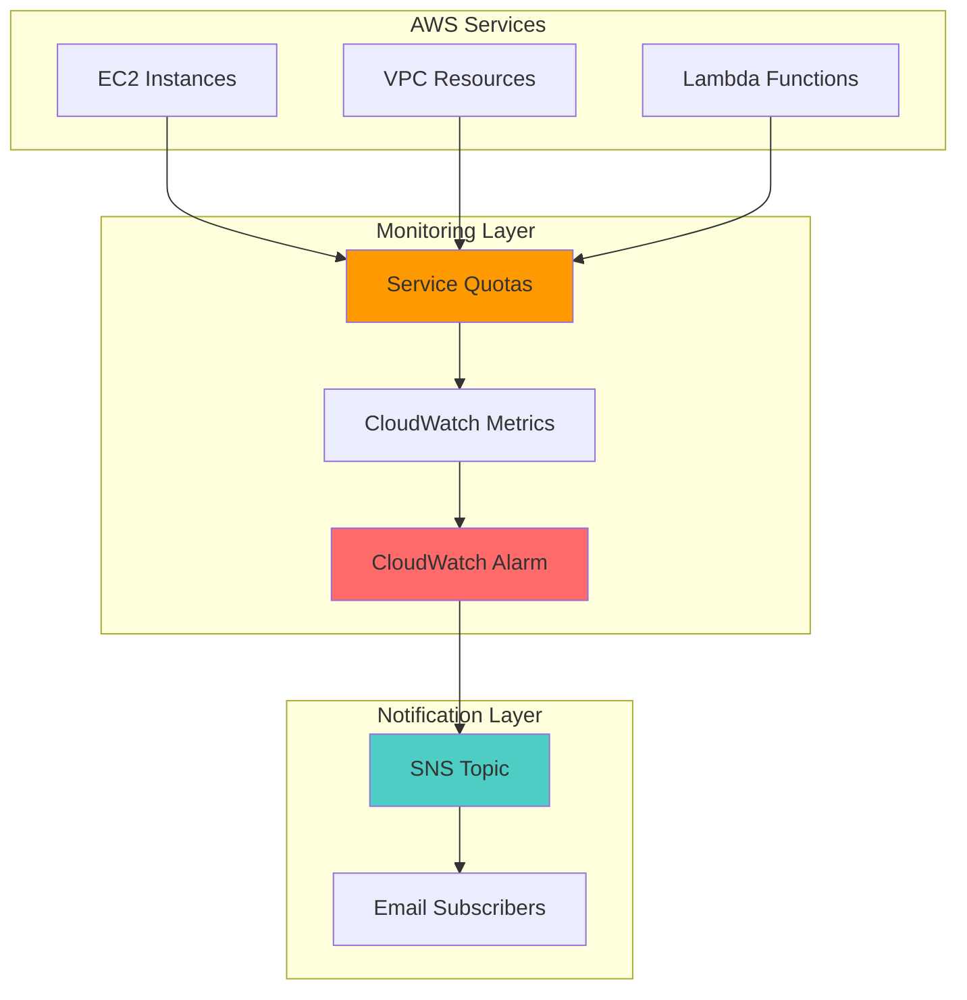

# Service Quota Monitoring with CloudWatch Alarms

## Problem

Organizations running AWS workloads often hit unexpected service limits that cause application failures, deployment blocks, or service disruptions. Without proactive monitoring, teams only discover quota exhaustion when services start failing, leading to emergency escalations, customer impact, and reactive firefighting instead of planned capacity management.

## Solution

Implement automated service quota monitoring using AWS Service Quotas, CloudWatch alarms, and SNS notifications to proactively track quota utilization and alert teams before limits are reached. This solution provides early warning when approaching quota thresholds, enabling proactive capacity planning and quota increase requests to maintain business continuity.

## Architecture Diagram



## Prerequisites

1. AWS account with permissions for Service Quotas, CloudWatch, and SNS
2. AWS CLI installed and configured (version 2.0 or later)
3. Basic understanding of AWS service limits and CloudWatch concepts
4. Email address for receiving quota notifications
5. Estimated cost: $0.50-$2.00 per month (CloudWatch alarms and SNS notifications)

> **Note**: This recipe uses AWS Free Tier eligible services where possible, but costs may apply for CloudWatch alarms beyond the free tier limits.

## Preparation

```bash
# Set environment variables
export AWS_REGION=$(aws configure get region)
export AWS_ACCOUNT_ID=$(aws sts get-caller-identity \
    --query Account --output text)

# Generate unique identifiers for resources
RANDOM_SUFFIX=$(aws secretsmanager get-random-password \
    --exclude-punctuation --exclude-uppercase \
    --password-length 6 --require-each-included-type \
    --output text --query RandomPassword)

# Set notification email (replace with your email)
export NOTIFICATION_EMAIL="your-email@example.com"

echo "✅ AWS environment configured for region: $AWS_REGION"
echo "✅ Account ID: $AWS_ACCOUNT_ID"
echo "✅ Notification email: $NOTIFICATION_EMAIL"
```

## Steps

1. **Create SNS Topic for Quota Notifications**:

   Amazon SNS provides a fully managed messaging service that enables reliable delivery of notifications to email subscribers. Creating a dedicated topic for quota alerts ensures notifications are properly routed and allows for easy subscription management as your team grows.

   ```bash
   # Create SNS topic for quota notifications
   SNS_TOPIC_ARN=$(aws sns create-topic \
       --name "service-quota-alerts-${RANDOM_SUFFIX}" \
       --query TopicArn --output text)
   
   echo "✅ SNS topic created: $SNS_TOPIC_ARN"
   ```

   The SNS topic now serves as the central notification hub for all quota-related alerts, providing a scalable foundation for team-wide notifications.

2. **Subscribe Email Address to SNS Topic**:

   Email subscriptions provide immediate notification delivery to operations teams and stakeholders. This ensures quota alerts reach the right people who can take action to request quota increases or optimize resource usage.

   ```bash
   # Subscribe email to SNS topic
   aws sns subscribe \
       --topic-arn $SNS_TOPIC_ARN \
       --protocol email \
       --notification-endpoint $NOTIFICATION_EMAIL
   
   echo "✅ Email subscription created for: $NOTIFICATION_EMAIL"
   echo "📧 Check your email and confirm the subscription"
   ```

   You'll receive a confirmation email that must be clicked to activate notifications. This double opt-in process ensures notifications only go to verified recipients.

3. **Verify Service Quotas CloudWatch Integration**:

   AWS Service Quotas publishes utilization metrics to CloudWatch for services that support usage monitoring. This step verifies which services are available for monitoring in your region.

   ```bash
   # List available service quotas with CloudWatch support
   aws service-quotas list-services \
       --query 'Services[?length(ServiceName) > `0`].[ServiceCode,ServiceName]' \
       --output table
   
   echo "✅ Service quotas available for monitoring"
   ```

   Services with CloudWatch integration automatically publish ServiceQuotaUtilization metrics, enabling real-time monitoring of quota consumption without additional configuration.

4. **Create CloudWatch Alarm for EC2 Instance Quota**:

   CloudWatch alarms provide automated monitoring that triggers actions when metrics cross defined thresholds. Monitoring EC2 instance quotas prevents deployment failures and ensures capacity is available for scaling operations.

   ```bash
   # Create alarm for EC2 running instances (80% threshold)
   aws cloudwatch put-metric-alarm \
       --alarm-name "EC2-Running-Instances-Quota-Alert" \
       --alarm-description "Alert when EC2 running instances exceed 80% of quota" \
       --metric-name ServiceQuotaUtilization \
       --namespace AWS/ServiceQuotas \
       --statistic Maximum \
       --period 300 \
       --threshold 80 \
       --comparison-operator GreaterThanThreshold \
       --evaluation-periods 1 \
       --alarm-actions $SNS_TOPIC_ARN \
       --dimensions Name=ServiceCode,Value=ec2 Name=QuotaCode,Value=L-1216C47A
   
   echo "✅ EC2 instance quota alarm created"
   ```

   This alarm monitors EC2 running instance utilization and triggers at 80% capacity, providing sufficient time to request quota increases before hitting limits.

5. **Create CloudWatch Alarm for VPC Quota**:

   VPC quotas are critical for network architecture and connectivity. Monitoring VPC limits prevents network deployment failures and ensures sufficient networking resources for application growth.

   ```bash
   # Create alarm for VPC quota (80% threshold)
   aws cloudwatch put-metric-alarm \
       --alarm-name "VPC-Quota-Alert" \
       --alarm-description "Alert when VPC count exceeds 80% of quota" \
       --metric-name ServiceQuotaUtilization \
       --namespace AWS/ServiceQuotas \
       --statistic Maximum \
       --period 300 \
       --threshold 80 \
       --comparison-operator GreaterThanThreshold \
       --evaluation-periods 1 \
       --alarm-actions $SNS_TOPIC_ARN \
       --dimensions Name=ServiceCode,Value=vpc Name=QuotaCode,Value=L-F678F1CE
   
   echo "✅ VPC quota alarm created"
   ```

   VPC monitoring ensures network capacity remains available for new environments, microservices deployments, and disaster recovery scenarios.

6. **Create CloudWatch Alarm for Lambda Function Quota**:

   Lambda concurrent execution limits directly impact serverless application performance and availability. Proactive monitoring prevents function throttling and ensures consistent application response times.

   ```bash
   # Create alarm for Lambda concurrent executions (80% threshold)
   aws cloudwatch put-metric-alarm \
       --alarm-name "Lambda-Concurrent-Executions-Quota-Alert" \
       --alarm-description "Alert when Lambda concurrent executions exceed 80% of quota" \
       --metric-name ServiceQuotaUtilization \
       --namespace AWS/ServiceQuotas \
       --statistic Maximum \
       --period 300 \
       --threshold 80 \
       --comparison-operator GreaterThanThreshold \
       --evaluation-periods 1 \
       --alarm-actions $SNS_TOPIC_ARN \
       --dimensions Name=ServiceCode,Value=lambda Name=QuotaCode,Value=L-B99A9384
   
   echo "✅ Lambda concurrent executions quota alarm created"
   ```

   This alarm prevents Lambda throttling events that could impact user experience and application reliability during peak traffic periods.

7. **Test Alarm Configuration**:

   Testing alarm functionality ensures notifications work correctly and reach the intended recipients. This validation step confirms the monitoring system will operate as expected when real quota thresholds are approached.

   ```bash
   # Test alarm by setting state to ALARM temporarily
   aws cloudwatch set-alarm-state \
       --alarm-name "EC2-Running-Instances-Quota-Alert" \
       --state-value ALARM \
       --state-reason "Testing alarm notification system"
   
   echo "✅ Test alarm triggered - check email for notification"
   echo "🔄 Resetting alarm state to OK"
   
   # Reset alarm state
   aws cloudwatch set-alarm-state \
       --alarm-name "EC2-Running-Instances-Quota-Alert" \
       --state-value OK \
       --state-reason "Test complete - resetting to normal state"
   ```

   You should receive an email notification within 1-2 minutes confirming the alarm system is functioning correctly and ready for production monitoring.

## Validation & Testing

1. **Verify SNS Topic and Subscription**:

   ```bash
   # Check SNS topic exists and has subscriptions
   aws sns get-topic-attributes --topic-arn $SNS_TOPIC_ARN
   
   aws sns list-subscriptions-by-topic \
       --topic-arn $SNS_TOPIC_ARN \
       --query 'Subscriptions[*].[Protocol,Endpoint,SubscriptionArn]' \
       --output table
   ```

   Expected output: Topic details and confirmed email subscription

2. **Verify CloudWatch Alarms**:

   ```bash
   # List all quota monitoring alarms
   aws cloudwatch describe-alarms \
       --alarm-names "EC2-Running-Instances-Quota-Alert" \
                     "VPC-Quota-Alert" \
                     "Lambda-Concurrent-Executions-Quota-Alert" \
       --query 'MetricAlarms[*].[AlarmName,StateValue,MetricName]' \
       --output table
   ```

   Expected output: Three alarms in OK state with correct metric configurations

3. **Check Service Quota Metrics**:

   ```bash
   # View current service quota utilization metrics
   aws cloudwatch get-metric-statistics \
       --namespace AWS/ServiceQuotas \
       --metric-name ServiceQuotaUtilization \
       --dimensions Name=ServiceCode,Value=ec2 Name=QuotaCode,Value=L-1216C47A \
       --start-time $(date -u -d '1 hour ago' +%Y-%m-%dT%H:%M:%S) \
       --end-time $(date -u +%Y-%m-%dT%H:%M:%S) \
       --period 3600 \
       --statistics Maximum
   ```

   Expected output: Metric data points showing current EC2 instance quota utilization

## Cleanup

1. **Delete CloudWatch Alarms**:

   ```bash
   # Delete quota monitoring alarms
   aws cloudwatch delete-alarms \
       --alarm-names "EC2-Running-Instances-Quota-Alert" \
                     "VPC-Quota-Alert" \
                     "Lambda-Concurrent-Executions-Quota-Alert"
   
   echo "✅ CloudWatch alarms deleted"
   ```

2. **Delete SNS Topic and Subscriptions**:

   ```bash
   # Delete SNS topic (automatically removes subscriptions)
   aws sns delete-topic --topic-arn $SNS_TOPIC_ARN
   
   echo "✅ SNS topic and subscriptions deleted"
   ```

3. **Clean up Environment Variables**:

   ```bash
   # Remove environment variables
   unset SNS_TOPIC_ARN
   unset NOTIFICATION_EMAIL
   unset RANDOM_SUFFIX
   
   echo "✅ Environment variables cleaned up"
   ```

## Discussion

Service quota monitoring represents a critical operational practice for maintaining reliable AWS infrastructure. The AWS Service Quotas service provides centralized quota management with CloudWatch integration, enabling proactive monitoring before limits impact operations. This automated approach replaces manual quota tracking and reactive limit increases with predictive capacity management that follows AWS Well-Architected Framework principles for operational excellence.

CloudWatch alarms offer sophisticated threshold-based monitoring with configurable evaluation periods and statistical functions. The 80% threshold provides sufficient lead time for quota increase requests, which typically require 24-72 hours for approval. Setting alarms at this level ensures operations teams can request increases before hitting hard limits that cause service disruptions, supporting the reliability pillar of the Well-Architected Framework.

The integration between Service Quotas, CloudWatch, and SNS creates a robust notification pipeline that scales across teams and services. As organizations grow, additional service quotas can be monitored using the same architectural pattern, providing consistent alerting and response procedures. This foundation supports advanced monitoring scenarios including composite alarms, multiple notification channels, and automated remediation workflows.

Cost optimization considerations include monitoring only critical service quotas that directly impact operations, using appropriate alarm evaluation periods to prevent notification noise, and leveraging AWS Free Tier where possible. Organizations should regularly review monitored quotas as application architectures evolve and new services are adopted. For comprehensive quota monitoring across hundreds of services, consider the [AWS Quota Monitor solution](https://docs.aws.amazon.com/solutions/latest/quota-monitor-for-aws/overview.html) which provides automated discovery and monitoring of all supported quotas.

> **Tip**: Use CloudWatch composite alarms to create higher-level alerts that combine multiple quota thresholds, reducing notification noise while maintaining comprehensive coverage. See the [CloudWatch composite alarms documentation](https://docs.aws.amazon.com/AmazonCloudWatch/latest/monitoring/Create_Composite_Alarm.html) for advanced alerting patterns.

## Challenge

Extend this solution by implementing these enhancements:

1. **Multi-Region Quota Monitoring**: Deploy quota monitoring across multiple AWS regions using CloudFormation StackSets to ensure global visibility of service limits and regional capacity planning.

2. **Automated Quota Increase Requests**: Integrate with AWS Support API to automatically submit quota increase requests when utilization reaches 85%, streamlining the capacity management process.

3. **Dashboard Integration**: Create CloudWatch dashboards displaying quota utilization trends, historical patterns, and forecast projections to support capacity planning decisions.

4. **Slack Integration**: Replace or supplement email notifications with Slack webhook integration for real-time team collaboration and faster incident response.

5. **Custom Service Metrics**: Monitor application-specific quotas like API rate limits, custom resource counts, or business logic thresholds using CloudWatch custom metrics and the same alarming pattern.

## Infrastructure Code

### Available Infrastructure as Code:

- [Infrastructure Code Overview](code/README.md) - Detailed description of all infrastructure components
- [AWS CDK (Python)](code/cdk-python/) - AWS CDK Python implementation
- [AWS CDK (TypeScript)](code/cdk-typescript/) - AWS CDK TypeScript implementation
- [CloudFormation](code/cloudformation.yaml) - AWS CloudFormation template
- [Bash CLI Scripts](code/scripts/) - Example bash scripts using AWS CLI commands to deploy infrastructure
- [Terraform](code/terraform/) - Terraform configuration files