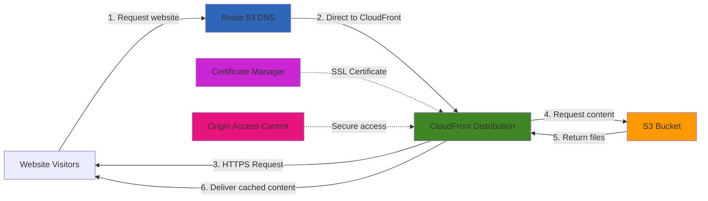

# Serving Static Content with S3 and CloudFront

## Problem

Your organization needs to host static website content (HTML, CSS, JavaScript, images) that is accessible globally with low latency. The website requires HTTPS support for security, and you want to minimize infrastructure management overhead while keeping costs low. Traditional web hosting solutions using EC2 instances require ongoing maintenance, patching, and scaling configurations, which your team wants to avoid. Additionally, you need a solution that provides high availability and scales automatically with traffic spikes.

## Solution

Implement a serverless static website hosting solution using Amazon S3 to store content and Amazon CloudFront to deliver it globally with low latency. This architecture uses S3 for cost-effective, durable storage of all website files, while CloudFront's global content delivery network caches content at edge locations close to users. The solution includes HTTPS support through AWS Certificate Manager and optional custom domain configuration with Route 53. This approach eliminates server management, automatically scales to handle traffic spikes, and significantly reduces latency for global visitors.



## Prerequisites

1. AWS account with permissions to create S3 buckets, CloudFront distributions, and IAM policies
2. AWS CLI v2 installed and configured with appropriate credentials
3. Basic website files (HTML, CSS, JavaScript) ready to upload
4. Domain name (optional, for custom domain setup)
5. Basic understanding of DNS if using a custom domain
6. Estimated monthly cost for a small website: S3 storage (~$0.023/GB), CloudFront data transfer (~$0.085/GB), Request pricing (minimal)

> **Note**: This recipe can be completed using the AWS Management Console instead of CLI if preferred. We provide CLI commands for automation and reproducibility.

## Preparation

Set up environment variables and prepare your local website files:

```bash
# Set environment variables
export AWS_REGION=$(aws configure get region)
export AWS_ACCOUNT_ID=$(aws sts get-caller-identity \
    --query Account --output text)

# Generate a random suffix for bucket name to ensure uniqueness
RANDOM_STRING=$(aws secretsmanager get-random-password \
    --exclude-punctuation --exclude-uppercase \
    --password-length 8 --require-each-included-type \
    --output text --query RandomPassword)

# Define resource names
export BUCKET_NAME="website-${RANDOM_STRING}"
export LOGS_BUCKET_NAME="${BUCKET_NAME}-logs"

# Ask if user wants to configure a custom domain
read -p "Do you want to set up a custom domain? (y/n): " SETUP_DOMAIN

if [ "$SETUP_DOMAIN" = "y" ]; then
    read -p "Enter your domain name (e.g., example.com): " DOMAIN_NAME
    export DOMAIN_NAME
    
    # Check if domain is registered in Route 53
    HOSTED_ZONE_ID=$(aws route53 list-hosted-zones-by-name \
        --dns-name "$DOMAIN_NAME." \
        --query "HostedZones[0].Id" \
        --output text)
        
    if [[ "$HOSTED_ZONE_ID" == "None" ]]; then
        echo "Domain not found in Route 53. You will need to:"
        echo "1. Register your domain in Route 53 or transfer it"
        echo "2. Or update your DNS provider with CloudFront details later"
    else
        echo "Domain found in Route 53: $HOSTED_ZONE_ID"
        export HOSTED_ZONE_ID
    fi
else
    echo "Proceeding without custom domain setup"
fi

# Create a sample website if one doesn't exist
if [ ! -d "website" ]; then
    mkdir -p website
    
    # Create index.html
    cat > website/index.html << EOF
<!DOCTYPE html>
<html lang="en">
<head>
    <meta charset="UTF-8">
    <meta name="viewport" content="width=device-width, initial-scale=1.0">
    <title>AWS S3 Static Website</title>
    <link rel="stylesheet" href="styles.css">
</head>
<body>
    <div class="container">
        <h1>Hello from Amazon S3 and CloudFront!</h1>
        <p>This static website is served from Amazon S3 and delivered via CloudFront.</p>
        <p>The current time is: <span id="current-time"></span></p>
    </div>
    <script src="script.js"></script>
</body>
</html>
EOF
    
    # Create styles.css
    cat > website/styles.css << EOF
body {
    font-family: Arial, sans-serif;
    line-height: 1.6;
    margin: 0;
    padding: 0;
    background-color: #f4f4f4;
    display: flex;
    justify-content: center;
    align-items: center;
    height: 100vh;
}

.container {
    max-width: 800px;
    margin: 0 auto;
    padding: 30px;
    background-color: white;
    border-radius: 8px;
    box-shadow: 0 2px 10px rgba(0, 0, 0, 0.1);
    text-align: center;
}

h1 {
    color: #ff9900;
}
EOF
    
    # Create script.js
    cat > website/script.js << EOF
document.addEventListener('DOMContentLoaded', function() {
    function updateTime() {
        const now = new Date();
        document.getElementById('current-time').textContent = now.toLocaleTimeString();
    }
    
    updateTime();
    setInterval(updateTime, 1000);
});
EOF
    
    # Create error.html
    cat > website/error.html << EOF
<!DOCTYPE html>
<html lang="en">
<head>
    <meta charset="UTF-8">
    <meta name="viewport" content="width=device-width, initial-scale=1.0">
    <title>Error - Page Not Found</title>
    <link rel="stylesheet" href="styles.css">
</head>
<body>
    <div class="container">
        <h1>404 - Page Not Found</h1>
        <p>The page you're looking for doesn't exist.</p>
        <p><a href="/">Return to homepage</a></p>
    </div>
</body>
</html>
EOF

    echo "✅ Sample website created in the 'website' directory"
fi
```

## Steps

1. **Create S3 buckets for website content and logs**:

   Amazon S3 (Simple Storage Service) provides the foundation of our static website hosting architecture with 99.999999999% (11 9's) durability and virtually unlimited scalability. We'll create two buckets: one for hosting website content and another for storing CloudFront access logs. S3's regional storage ensures high availability while keeping costs low, as you only pay for actual storage used without any minimum fees or upfront commitments.

   ```bash
   # Create main website bucket
   aws s3api create-bucket \
       --bucket $BUCKET_NAME \
       --region $AWS_REGION \
       $(if [ "$AWS_REGION" != "us-east-1" ]; then 
           echo "--create-bucket-configuration LocationConstraint=$AWS_REGION"; 
       fi)
   
   # Create bucket for access logs
   aws s3api create-bucket \
       --bucket $LOGS_BUCKET_NAME \
       --region $AWS_REGION \
       $(if [ "$AWS_REGION" != "us-east-1" ]; then 
           echo "--create-bucket-configuration LocationConstraint=$AWS_REGION"; 
       fi)
   
   # Block public access for logs bucket
   aws s3api put-public-access-block \
       --bucket $LOGS_BUCKET_NAME \
       --public-access-block-configuration \
           "BlockPublicAcls=true,IgnorePublicAcls=true,\
           BlockPublicPolicy=true,RestrictPublicBuckets=true"
   
   # Enable static website hosting on the main bucket
   aws s3 website \
       $BUCKET_NAME \
       --index-document index.html \
       --error-document error.html
   
   echo "✅ Created S3 buckets for website and logs"
   ```

   The S3 buckets are now established as the storage foundation for your website. The main bucket will serve as the origin for CloudFront, while the logs bucket will capture detailed access information for analytics and monitoring. Static website hosting is enabled on the main bucket, allowing it to serve index.html as the default document and error.html for 404 errors.

2. **Upload website content with proper MIME types**:

   Proper content-type headers are crucial for web browsers to correctly interpret and display your website files. S3 automatically detects some file types, but explicitly setting content-types ensures optimal browser rendering and prevents security issues. This step demonstrates best practices for organizing and uploading different file types while maintaining proper HTTP headers for performance and security.

   ```bash
   # Upload website files with proper content types
   aws s3 sync website/ s3://$BUCKET_NAME/ \
       --include "*" \
       --exclude "*.html" \
       --exclude "*.css" \
       --exclude "*.js" \
       --exclude "*.json" \
       --exclude "*.xml" \
       --exclude "*.svg" \
       --exclude "*.jpg" \
       --exclude "*.jpeg" \
       --exclude "*.png" \
       --exclude "*.gif"
   
   # Upload HTML files with correct content-type
   aws s3 sync website/ s3://$BUCKET_NAME/ \
       --exclude "*" \
       --include "*.html" \
       --content-type "text/html"
   
   # Upload CSS files with correct content-type
   aws s3 sync website/ s3://$BUCKET_NAME/ \
       --exclude "*" \
       --include "*.css" \
       --content-type "text/css"
   
   # Upload JavaScript files with correct content-type
   aws s3 sync website/ s3://$BUCKET_NAME/ \
       --exclude "*" \
       --include "*.js" \
       --content-type "application/javascript"
   
   # Upload image files with correct content-types (if any)
   aws s3 sync website/ s3://$BUCKET_NAME/ \
       --exclude "*" \
       --include "*.jpg" --include "*.jpeg" \
       --content-type "image/jpeg"
   
   aws s3 sync website/ s3://$BUCKET_NAME/ \
       --exclude "*" \
       --include "*.png" \
       --content-type "image/png"
   
   aws s3 sync website/ s3://$BUCKET_NAME/ \
       --exclude "*" \
       --include "*.gif" \
       --content-type "image/gif"
   
   echo "✅ Uploaded website content to S3 bucket"
   ```

   Your website files are now stored in S3 with appropriate content-type headers, ensuring browsers render them correctly. The systematic upload approach by file type guarantees proper MIME type assignment, which is essential for security (preventing XSS attacks) and performance (enabling browser caching and compression).

   > **Warning**: Always ensure your S3 bucket remains private and is not configured for public access. The Origin Access Control and bucket policy provide the security layer that prevents direct access while allowing CloudFront to serve your content.

3. **Create Origin Access Control for secure CloudFront access**:

   Origin Access Control (OAC) is AWS's modern security mechanism that replaces the legacy Origin Access Identity (OAI). OAC uses AWS Signature Version 4 (SigV4) for authentication, providing enhanced security and support for additional AWS services. This security layer ensures that your S3 bucket content can only be accessed through CloudFront, preventing direct public access to your S3 bucket while maintaining the performance benefits of CloudFront's global edge network.

   ```bash
   # Create Origin Access Control
   OAC_ID=$(aws cloudfront create-origin-access-control \
       --origin-access-control-config '{
           "Name": "S3OriginAccessControl",
           "Description": "OAC for S3 static website",
           "SigningProtocol": "sigv4",
           "SigningBehavior": "always",
           "OriginAccessControlOriginType": "s3"
       }' \
       --query 'OriginAccessControl.Id' \
       --output text)
   
   echo "✅ Created Origin Access Control: $OAC_ID"
   ```

   The Origin Access Control is now configured and ready to secure the connection between CloudFront and your S3 bucket. This critical security component ensures that users cannot bypass CloudFront to access your content directly from S3, maintaining both security and allowing you to leverage CloudFront's caching, compression, and global distribution capabilities.

4. **Set up SSL certificate for HTTPS encryption**:

   AWS Certificate Manager (ACM) provides free SSL/TLS certificates for securing your website with HTTPS encryption. For CloudFront distributions, certificates must be requested in the us-east-1 region regardless of where your other resources are located. The DNS validation method automatically proves domain ownership by adding a CNAME record to your DNS configuration, ensuring secure certificate issuance without manual verification steps.

   ```bash
   if [ "$SETUP_DOMAIN" = "y" ]; then
       # Request a certificate in us-east-1 (required for CloudFront)
       CERT_ARN=$(aws acm request-certificate \
           --domain-name $DOMAIN_NAME \
           --validation-method DNS \
           --region us-east-1 \
           --query 'CertificateArn' \
           --output text)
       
       echo "✅ Requested SSL certificate: $CERT_ARN"
       
       # Get validation record details
       sleep 5  # Brief pause to ensure certificate details are available
       
       VALIDATION_RECORD=$(aws acm describe-certificate \
           --certificate-arn $CERT_ARN \
           --region us-east-1 \
           --query 'Certificate.DomainValidationOptions[0].ResourceRecord' \
           --output json)
       
       VALIDATION_NAME=$(echo $VALIDATION_RECORD | jq -r '.Name')
       VALIDATION_VALUE=$(echo $VALIDATION_RECORD | jq -r '.Value')
       
       echo "Certificate validation record:"
       echo "Name: $VALIDATION_NAME"
       echo "Value: $VALIDATION_VALUE"
       
       # Add validation record to Route 53 if hosted zone exists
       if [[ "$HOSTED_ZONE_ID" != "None" && "$HOSTED_ZONE_ID" != "null" ]]; then
           CHANGE_ID=$(aws route53 change-resource-record-sets \
               --hosted-zone-id $HOSTED_ZONE_ID \
               --change-batch '{
                   "Changes": [{
                       "Action": "UPSERT",
                       "ResourceRecordSet": {
                           "Name": "'"$VALIDATION_NAME"'",
                           "Type": "CNAME",
                           "TTL": 300,
                           "ResourceRecords": [{"Value": "'"$VALIDATION_VALUE"'"}]
                       }
                   }]
               }' \
               --query 'ChangeInfo.Id' \
               --output text)
           
           echo "✅ Added validation record to Route 53"
           echo "Waiting for validation to complete (this may take several minutes)..."
           
           # Wait for certificate validation
           aws acm wait certificate-validated \
               --certificate-arn $CERT_ARN \
               --region us-east-1
               
           echo "✅ Certificate validated successfully"
       else
           echo "Please add this CNAME record to your DNS provider to validate the certificate:"
           echo "Name: $VALIDATION_NAME"
           echo "Value: $VALIDATION_VALUE"
           echo "Then wait for validation to complete before proceeding"
           read -p "Press Enter once the certificate is validated... "
       fi
   fi
   ```

   The SSL certificate is now requested and validated, providing the cryptographic foundation for secure HTTPS connections. This certificate will automatically encrypt all data in transit between your users and CloudFront edge locations, meeting modern security requirements and improving SEO rankings. ACM handles certificate renewal automatically, eliminating ongoing maintenance overhead.

5. **Create CloudFront distribution for global content delivery**:

   CloudFront is AWS's global content delivery network (CDN) with over 400 edge locations worldwide. This distribution will cache your website content at edge locations closest to your users, dramatically reducing latency and improving user experience. The configuration includes compression, HTTPS redirection, custom error pages, and cost optimization through PriceClass_100 (North America and Europe edge locations only).

   ```bash
   # Define CloudFront configuration based on domain setup
   if [ "$SETUP_DOMAIN" = "y" ]; then
       DISTRIBUTION_CONFIG='{
           "CallerReference": "'${RANDOM_STRING}'",
           "Comment": "Distribution for '${DOMAIN_NAME}'",
           "DefaultRootObject": "index.html",
           "Origins": {
               "Quantity": 1,
               "Items": [
                   {
                       "Id": "S3Origin",
                       "DomainName": "'${BUCKET_NAME}'.s3.'${AWS_REGION}'.amazonaws.com",
                       "S3OriginConfig": {
                           "OriginAccessIdentity": ""
                       },
                       "OriginAccessControlId": "'${OAC_ID}'"
                   }
               ]
           },
           "DefaultCacheBehavior": {
               "TargetOriginId": "S3Origin",
               "ViewerProtocolPolicy": "redirect-to-https",
               "AllowedMethods": {
                   "Quantity": 2,
                   "Items": ["GET", "HEAD"],
                   "CachedMethods": {
                       "Quantity": 2,
                       "Items": ["GET", "HEAD"]
                   }
               },
               "CachePolicyId": "658327ea-f89d-4fab-a63d-7e88639e58f6",
               "Compress": true
           },
           "Aliases": {
               "Quantity": 1,
               "Items": ["'${DOMAIN_NAME}'"]
           },
           "ViewerCertificate": {
               "ACMCertificateArn": "'${CERT_ARN}'",
               "SSLSupportMethod": "sni-only",
               "MinimumProtocolVersion": "TLSv1.2_2021"
           },
           "CustomErrorResponses": {
               "Quantity": 1,
               "Items": [
                   {
                       "ErrorCode": 404,
                       "ResponsePagePath": "/error.html",
                       "ResponseCode": "404",
                       "ErrorCachingMinTTL": 300
                   }
               ]
           },
           "Enabled": true,
           "PriceClass": "PriceClass_100"
       }'
   else
       DISTRIBUTION_CONFIG='{
           "CallerReference": "'${RANDOM_STRING}'",
           "Comment": "Distribution for S3 static website",
           "DefaultRootObject": "index.html",
           "Origins": {
               "Quantity": 1,
               "Items": [
                   {
                       "Id": "S3Origin",
                       "DomainName": "'${BUCKET_NAME}'.s3.'${AWS_REGION}'.amazonaws.com",
                       "S3OriginConfig": {
                           "OriginAccessIdentity": ""
                       },
                       "OriginAccessControlId": "'${OAC_ID}'"
                   }
               ]
           },
           "DefaultCacheBehavior": {
               "TargetOriginId": "S3Origin",
               "ViewerProtocolPolicy": "redirect-to-https",
               "AllowedMethods": {
                   "Quantity": 2,
                   "Items": ["GET", "HEAD"],
                   "CachedMethods": {
                       "Quantity": 2,
                       "Items": ["GET", "HEAD"]
                   }
               },
               "CachePolicyId": "658327ea-f89d-4fab-a63d-7e88639e58f6",
               "Compress": true
           },
           "CustomErrorResponses": {
               "Quantity": 1,
               "Items": [
                   {
                       "ErrorCode": 404,
                       "ResponsePagePath": "/error.html",
                       "ResponseCode": "404",
                       "ErrorCachingMinTTL": 300
                   }
               ]
           },
           "Enabled": true,
           "PriceClass": "PriceClass_100"
       }'
   fi
   
   # Save the distribution config to a file
   echo $DISTRIBUTION_CONFIG > distribution-config.json
   
   # Create CloudFront distribution
   DISTRIBUTION_ID=$(aws cloudfront create-distribution \
       --distribution-config file://distribution-config.json \
       --query 'Distribution.Id' \
       --output text)
   
   DISTRIBUTION_DOMAIN=$(aws cloudfront describe-distribution \
       --id $DISTRIBUTION_ID \
       --query 'Distribution.DomainName' \
       --output text)
   
   echo "✅ Created CloudFront distribution: $DISTRIBUTION_ID"
   echo "CloudFront domain: $DISTRIBUTION_DOMAIN"
   ```

   Your CloudFront distribution is now created and will begin deploying to edge locations worldwide. This process typically takes 5-15 minutes to complete. Once deployed, users will access your website through CloudFront's optimized network, benefiting from edge caching, automatic compression, and geographic proximity to reduce load times significantly.

6. **Configure S3 bucket policy for secure CloudFront access**:

   The bucket policy implements the principle of least privilege by granting CloudFront read-only access to your S3 bucket contents while blocking all other access. This policy uses the CloudFront service principal and includes a condition that verifies the request originates from your specific distribution, preventing unauthorized access even if someone discovers your bucket name.

   ```bash
   # Create bucket policy for CloudFront access
   cat > bucket-policy.json << EOF
   {
       "Version": "2012-10-17",
       "Statement": [
           {
               "Sid": "AllowCloudFrontServicePrincipalReadOnly",
               "Effect": "Allow",
               "Principal": {
                   "Service": "cloudfront.amazonaws.com"
               },
               "Action": "s3:GetObject",
               "Resource": "arn:aws:s3:::${BUCKET_NAME}/*",
               "Condition": {
                   "StringEquals": {
                       "AWS:SourceArn": "arn:aws:cloudfront::${AWS_ACCOUNT_ID}:distribution/${DISTRIBUTION_ID}"
                   }
               }
           }
       ]
   }
   EOF
   
   # Apply the bucket policy
   aws s3api put-bucket-policy \
       --bucket $BUCKET_NAME \
       --policy file://bucket-policy.json
   
   echo "✅ Applied bucket policy for CloudFront access"
   ```

   The S3 bucket policy is now active, completing the secure integration between S3 and CloudFront. This configuration ensures that your website content remains protected while allowing CloudFront to serve it efficiently. Users cannot access your content directly from S3, forcing all traffic through CloudFront where you can apply caching, security headers, and access controls.

7. **Create Route 53 DNS record for custom domain**:

   Route 53 alias records provide several advantages over traditional CNAME records when pointing to AWS resources. Alias records respond to DNS queries with the IP address of the CloudFront distribution, eliminating additional DNS lookups and providing better performance. They also support apex domain names (like example.com) and are free of charge, unlike standard DNS queries.

   ```bash
   if [ "$SETUP_DOMAIN" = "y" ] && [[ "$HOSTED_ZONE_ID" != "None" && "$HOSTED_ZONE_ID" != "null" ]]; then
       # Wait for CloudFront distribution to deploy
       echo "Waiting for CloudFront distribution to deploy... This may take 5-10 minutes."
       aws cloudfront wait distribution-deployed \
           --id $DISTRIBUTION_ID
       
       # Create Route 53 record pointing to CloudFront
       CHANGE_ID=$(aws route53 change-resource-record-sets \
           --hosted-zone-id $HOSTED_ZONE_ID \
           --change-batch '{
               "Changes": [{
                   "Action": "UPSERT",
                   "ResourceRecordSet": {
                       "Name": "'"$DOMAIN_NAME"'",
                       "Type": "A",
                       "AliasTarget": {
                           "HostedZoneId": "Z2FDTNDATAQYW2",
                           "DNSName": "'"$DISTRIBUTION_DOMAIN"'",
                           "EvaluateTargetHealth": false
                       }
                   }
               }]
           }' \
           --query 'ChangeInfo.Id' \
           --output text)
       
       echo "✅ Created Route 53 record for $DOMAIN_NAME pointing to CloudFront"
       echo "Record change status: $CHANGE_ID"
   elif [ "$SETUP_DOMAIN" = "y" ]; then
       echo "To use your custom domain with CloudFront:"
       echo "1. Create an A record in your DNS provider"
       echo "2. Point it to your CloudFront distribution: $DISTRIBUTION_DOMAIN"
   fi
   ```

   Your custom domain is now properly configured to route traffic to your CloudFront distribution. DNS propagation may take up to 48 hours globally, but most users will see the changes within minutes. The alias record ensures optimal performance by resolving directly to CloudFront IP addresses without intermediate DNS lookups.

## Validation & Testing

1. Verify CloudFront distribution status:

   ```bash
   # Check CloudFront distribution status
   aws cloudfront get-distribution \
       --id $DISTRIBUTION_ID \
       --query 'Distribution.{Status:Status,DomainName:DomainName,Enabled:Enabled}' \
       --output table
   ```

   Expected output: Status should be "Deployed" and Enabled should be "true".

2. Test website access via CloudFront:

   ```bash
   # Get the CloudFront domain name
   CLOUDFRONT_URL="https://$DISTRIBUTION_DOMAIN"
   
   echo "Testing access to website via CloudFront..."
   echo "CloudFront URL: $CLOUDFRONT_URL"
   
   # Use curl to test access to the index.html file
   curl -s $CLOUDFRONT_URL/index.html | grep -q "Hello from Amazon S3 and CloudFront"
   
   if [ $? -eq 0 ]; then
       echo "✅ Successfully accessed website via CloudFront!"
   else
       echo "❌ Could not access website via CloudFront."
       echo "Wait 5-10 minutes for the distribution to fully deploy and try again."
   fi
   ```

3. Test custom domain (if configured):

   ```bash
   if [ "$SETUP_DOMAIN" = "y" ]; then
       DOMAIN_URL="https://$DOMAIN_NAME"
       
       echo "Testing access to website via custom domain..."
       echo "Domain URL: $DOMAIN_URL"
       
       echo "Note: DNS changes may take time to propagate."
       echo "If this test fails, try accessing the URL in your browser later."
       
       # Use curl to test access via the custom domain
       curl -s $DOMAIN_URL/index.html | grep -q "Hello from Amazon S3 and CloudFront"
       
       if [ $? -eq 0 ]; then
           echo "✅ Successfully accessed website via custom domain!"
       else
           echo "DNS may still be propagating. Try again later."
       fi
   fi
   ```

4. Verify caching is working:

   ```bash
   # Make two requests and check the "X-Cache" header
   echo "Testing CloudFront caching..."
   
   echo "First request:"
   curl -s -I $CLOUDFRONT_URL/index.html | grep "X-Cache"
   
   echo "Second request:"
   curl -s -I $CLOUDFRONT_URL/index.html | grep "X-Cache"
   
   echo "The first request should show 'X-Cache: Miss' and subsequent"
   echo "requests should show 'X-Cache: Hit' if caching is working correctly."
   ```

## Cleanup

1. Delete Route 53 record (if created):

   ```bash
   if [ "$SETUP_DOMAIN" = "y" ] && [[ "$HOSTED_ZONE_ID" != "None" && "$HOSTED_ZONE_ID" != "null" ]]; then
       # Delete Route 53 A record
       aws route53 change-resource-record-sets \
           --hosted-zone-id $HOSTED_ZONE_ID \
           --change-batch '{
               "Changes": [{
                   "Action": "DELETE",
                   "ResourceRecordSet": {
                       "Name": "'"$DOMAIN_NAME"'",
                       "Type": "A",
                       "AliasTarget": {
                           "HostedZoneId": "Z2FDTNDATAQYW2",
                           "DNSName": "'"$DISTRIBUTION_DOMAIN"'",
                           "EvaluateTargetHealth": false
                       }
                   }
               }]
           }'
       
       # Delete Route 53 CNAME record for certificate validation
       VALIDATION_RECORD=$(aws acm describe-certificate \
           --certificate-arn $CERT_ARN \
           --region us-east-1 \
           --query 'Certificate.DomainValidationOptions[0].ResourceRecord' \
           --output json)
       
       VALIDATION_NAME=$(echo $VALIDATION_RECORD | jq -r '.Name')
       VALIDATION_VALUE=$(echo $VALIDATION_RECORD | jq -r '.Value')
       
       aws route53 change-resource-record-sets \
           --hosted-zone-id $HOSTED_ZONE_ID \
           --change-batch '{
               "Changes": [{
                   "Action": "DELETE",
                   "ResourceRecordSet": {
                       "Name": "'"$VALIDATION_NAME"'",
                       "Type": "CNAME",
                       "TTL": 300,
                       "ResourceRecords": [{"Value": "'"$VALIDATION_VALUE"'"}]
                   }
               }]
           }'
       
       echo "✅ Deleted Route 53 records"
   fi
   ```

2. Disable and delete CloudFront distribution:

   ```bash
   # First, disable the CloudFront distribution
   aws cloudfront update-distribution \
       --id $DISTRIBUTION_ID \
       --if-match $(aws cloudfront get-distribution \
           --id $DISTRIBUTION_ID \
           --query 'ETag' \
           --output text) \
       --distribution-config '{
           "CallerReference": "'${RANDOM_STRING}'",
           "Comment": "Distribution for static website (disabling)",
           "DefaultRootObject": "index.html",
           "Origins": {
               "Quantity": 1,
               "Items": [
                   {
                       "Id": "S3Origin",
                       "DomainName": "'${BUCKET_NAME}'.s3.'${AWS_REGION}'.amazonaws.com",
                       "S3OriginConfig": {
                           "OriginAccessIdentity": ""
                       },
                       "OriginAccessControlId": "'${OAC_ID}'"
                   }
               ]
           },
           "DefaultCacheBehavior": {
               "TargetOriginId": "S3Origin",
               "ViewerProtocolPolicy": "redirect-to-https",
               "AllowedMethods": {
                   "Quantity": 2,
                   "Items": ["GET", "HEAD"],
                   "CachedMethods": {
                       "Quantity": 2,
                       "Items": ["GET", "HEAD"]
                   }
               },
               "CachePolicyId": "658327ea-f89d-4fab-a63d-7e88639e58f6",
               "Compress": true
           },
           "Enabled": false,
           "PriceClass": "PriceClass_100"
       }'
   
   echo "Waiting for CloudFront distribution to be disabled..."
   aws cloudfront wait distribution-deployed \
       --id $DISTRIBUTION_ID
   
   # Delete the CloudFront distribution
   aws cloudfront delete-distribution \
       --id $DISTRIBUTION_ID \
       --if-match $(aws cloudfront get-distribution \
           --id $DISTRIBUTION_ID \
           --query 'ETag' \
           --output text)
   
   # Delete Origin Access Control
   aws cloudfront delete-origin-access-control \
       --id $OAC_ID \
       --if-match $(aws cloudfront get-origin-access-control \
           --id $OAC_ID \
           --query 'ETag' \
           --output text)
   
   echo "✅ Deleted CloudFront distribution and Origin Access Control"
   ```

3. Delete SSL certificate (if created):

   ```bash
   if [ "$SETUP_DOMAIN" = "y" ]; then
       # Give time for CloudFront distribution to fully delete
       sleep 30
       
       # Delete ACM certificate
       aws acm delete-certificate \
           --certificate-arn $CERT_ARN \
           --region us-east-1
       
       echo "✅ Deleted ACM certificate"
   fi
   ```

4. Delete S3 buckets and content:

   ```bash
   # Empty and delete S3 buckets
   aws s3 rm s3://$BUCKET_NAME/ --recursive
   aws s3api delete-bucket --bucket $BUCKET_NAME
   
   aws s3 rm s3://$LOGS_BUCKET_NAME/ --recursive
   aws s3api delete-bucket --bucket $LOGS_BUCKET_NAME
   
   echo "✅ Deleted S3 buckets and content"
   ```

5. Clean up local files:

   ```bash
   # Remove local files
   rm -f bucket-policy.json
   rm -f distribution-config.json
   
   echo "✅ Cleaned up local files"
   
   echo "Cleanup complete! All resources have been removed."
   ```

## Discussion

Hosting static websites with Amazon S3 and CloudFront offers numerous advantages over traditional hosting methods. This serverless architecture eliminates the need to provision, manage, and patch servers, significantly reducing operational overhead. CloudFront's global edge network automatically caches content close to users, reducing latency and providing a faster browsing experience regardless of visitor location.

From a security perspective, this solution provides several benefits. CloudFront automatically encrypts data in transit with HTTPS, protecting user information and helping to meet compliance requirements. The Origin Access Control mechanism ensures that website content can only be accessed through CloudFront and not directly from S3, reducing potential attack vectors. Additionally, CloudFront includes built-in DDoS protection through AWS Shield Standard at no additional cost.

Cost optimization is another significant advantage of this approach. With S3, you only pay for the storage actually used by your website files, with no minimum fees. CloudFront's pay-as-you-go pricing model means you're only charged for actual data transfer and requests, making this solution very cost-effective for websites with unpredictable traffic patterns. For smaller websites, costs are typically just a few dollars per month.

> **Tip**: To optimize your website's performance, leverage CloudFront's caching capabilities by setting appropriate Cache-Control headers on your S3 objects. For static assets that don't change often (like images, CSS, and JavaScript files), consider setting a longer TTL (Time To Live) to maximize cache hits and reduce origin requests.

When considering maintenance, this architecture excels because content updates are as simple as uploading new files to S3. There's no need to worry about scaling during traffic spikes, as both S3 and CloudFront automatically handle increased load. For websites with dynamic components, consider integrating with serverless solutions like AWS Lambda and API Gateway to maintain the benefits of a serverless architecture.

## Challenge

Extend this basic static website hosting solution with the following enhancements:

1. Implement content versioning by setting up S3 versioning and CloudFront invalidations to manage content updates without downtime or cached outdated content.

2. Add basic authentication to protect access to your website by implementing Lambda@Edge to check for authentication headers before serving content.

3. Create a CI/CD pipeline using AWS CodePipeline that automatically deploys website updates to S3 whenever changes are pushed to a Git repository.

4. Implement a contact form on your static website by creating an API Gateway endpoint and Lambda function to process form submissions and store them in DynamoDB.

5. Set up detailed access analytics by configuring CloudFront access logs to be analyzed with Amazon Athena, allowing you to query and visualize visitor patterns.

## Infrastructure Code

*Infrastructure code will be generated after recipe approval.*