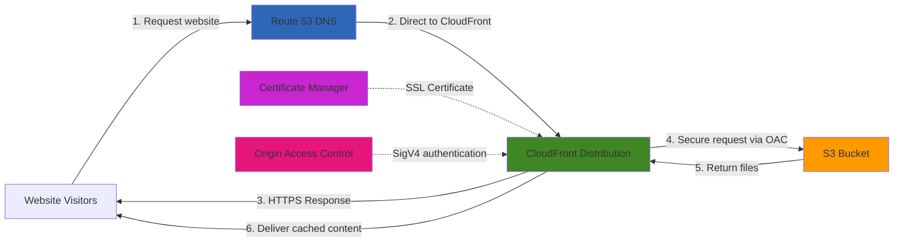

# Serving Static Content with S3 and CloudFront

## Problem

Your organization needs to host static website content (HTML, CSS, JavaScript, images) that is accessible globally with low latency and enhanced security. The website requires HTTPS support for compliance, and you want to minimize infrastructure management overhead while keeping costs low. Traditional web hosting solutions using EC2 instances require ongoing maintenance, patching, and scaling configurations, which your team wants to avoid. Additionally, you need a solution that provides high availability, automatic scaling during traffic spikes, and protection against unauthorized direct access to your content storage.

## Solution

Implement a serverless static website hosting solution using Amazon S3 for cost-effective, durable storage and Amazon CloudFront for global content delivery with enhanced security. This architecture uses S3 as a private origin with CloudFront's Origin Access Control (OAC) to ensure content can only be accessed through the CDN, not directly from S3. CloudFront's global edge network caches content at over 400 locations worldwide, dramatically reducing latency for users. The solution includes automatic HTTPS encryption through AWS Certificate Manager and optional custom domain configuration with Route 53. This approach eliminates server management, automatically scales to handle traffic spikes, and provides built-in DDoS protection through AWS Shield Standard.

## Architecture Diagram



## Prerequisites

1. AWS account with permissions to create S3 buckets, CloudFront distributions, ACM certificates, and IAM policies
2. AWS CLI v2 installed and configured with appropriate credentials
3. Basic website files (HTML, CSS, JavaScript) ready to upload
4. Domain name registered (optional, for custom domain setup)
5. Basic understanding of DNS configuration if using a custom domain
6. Estimated monthly cost for a small website: S3 storage (~$0.023/GB), CloudFront data transfer (~$0.085/GB for first 10TB), Request pricing (minimal for static sites)

> **Note**: This recipe uses AWS best practices including Origin Access Control (OAC) instead of the legacy Origin Access Identity (OAI). OAC provides enhanced security with short-term credentials and supports all AWS regions including those launched after December 2022.

## Preparation

Set up environment variables and prepare your local website files:

```bash
# Set environment variables
export AWS_REGION=$(aws configure get region)
export AWS_ACCOUNT_ID=$(aws sts get-caller-identity \
    --query Account --output text)

# Generate a random suffix for bucket name to ensure uniqueness
RANDOM_STRING=$(aws secretsmanager get-random-password \
    --exclude-punctuation --exclude-uppercase \
    --password-length 8 --require-each-included-type \
    --output text --query RandomPassword)

# Define resource names
export BUCKET_NAME="website-${RANDOM_STRING}"
export LOGS_BUCKET_NAME="${BUCKET_NAME}-logs"

# Ask if user wants to configure a custom domain
read -p "Do you want to set up a custom domain? (y/n): " SETUP_DOMAIN

if [ "$SETUP_DOMAIN" = "y" ]; then
    read -p "Enter your domain name (e.g., example.com): " DOMAIN_NAME
    export DOMAIN_NAME
    
    # Check if domain is registered in Route 53
    HOSTED_ZONE_ID=$(aws route53 list-hosted-zones-by-name \
        --dns-name "$DOMAIN_NAME." \
        --query "HostedZones[0].Id" \
        --output text)
        
    if [[ "$HOSTED_ZONE_ID" == "None" ]]; then
        echo "Domain not found in Route 53. You will need to:"
        echo "1. Register your domain in Route 53 or transfer it"
        echo "2. Or update your DNS provider with CloudFront details later"
    else
        echo "Domain found in Route 53: $HOSTED_ZONE_ID"
        export HOSTED_ZONE_ID
    fi
else
    echo "Proceeding without custom domain setup"
fi

# Create a sample website if one doesn't exist
if [ ! -d "website" ]; then
    mkdir -p website
    
    # Create index.html
    cat > website/index.html << 'EOF'
<!DOCTYPE html>
<html lang="en">
<head>
    <meta charset="UTF-8">
    <meta name="viewport" content="width=device-width, initial-scale=1.0">
    <title>AWS S3 Static Website</title>
    <link rel="stylesheet" href="styles.css">
</head>
<body>
    <div class="container">
        <h1>Hello from Amazon S3 and CloudFront!</h1>
        <p>This static website is served from Amazon S3 and delivered via CloudFront.</p>
        <p>The current time is: <span id="current-time"></span></p>
        <p><small>Secured with Origin Access Control (OAC)</small></p>
    </div>
    <script src="script.js"></script>
</body>
</html>
EOF
    
    # Create styles.css
    cat > website/styles.css << 'EOF'
body {
    font-family: -apple-system, BlinkMacSystemFont, 'Segoe UI', Roboto, sans-serif;
    line-height: 1.6;
    margin: 0;
    padding: 0;
    background: linear-gradient(135deg, #667eea 0%, #764ba2 100%);
    display: flex;
    justify-content: center;
    align-items: center;
    min-height: 100vh;
}

.container {
    max-width: 800px;
    margin: 20px;
    padding: 40px;
    background-color: white;
    border-radius: 12px;
    box-shadow: 0 8px 32px rgba(0, 0, 0, 0.1);
    text-align: center;
}

h1 {
    color: #ff9900;
    margin-bottom: 20px;
}

p {
    color: #333;
    margin-bottom: 15px;
}

small {
    color: #666;
}
EOF
    
    # Create script.js
    cat > website/script.js << 'EOF'
document.addEventListener('DOMContentLoaded', function() {
    function updateTime() {
        const now = new Date();
        const timeElement = document.getElementById('current-time');
        if (timeElement) {
            timeElement.textContent = now.toLocaleTimeString();
        }
    }
    
    updateTime();
    setInterval(updateTime, 1000);
});
EOF
    
    # Create error.html
    cat > website/error.html << 'EOF'
<!DOCTYPE html>
<html lang="en">
<head>
    <meta charset="UTF-8">
    <meta name="viewport" content="width=device-width, initial-scale=1.0">
    <title>Error - Page Not Found</title>
    <link rel="stylesheet" href="styles.css">
</head>
<body>
    <div class="container">
        <h1>404 - Page Not Found</h1>
        <p>The page you're looking for doesn't exist.</p>
        <p><a href="/" style="color: #ff9900; text-decoration: none;">Return to homepage</a></p>
    </div>
</body>
</html>
EOF

    echo "✅ Sample website created in the 'website' directory"
fi
```

## Steps

1. **Create S3 bucket for website content with security best practices**:

   Amazon S3 provides the foundation for our static website hosting with 99.999999999% (11 9's) durability and virtually unlimited scalability. We'll create a private S3 bucket that will serve as the origin for CloudFront, following AWS security best practices by keeping the bucket private and using Origin Access Control (OAC) for secure access. This approach ensures that content can only be accessed through CloudFront, preventing direct public access to your S3 bucket.

   ```bash
   # Create main website bucket (private by default)
   aws s3api create-bucket \
       --bucket $BUCKET_NAME \
       --region $AWS_REGION \
       $(if [ "$AWS_REGION" != "us-east-1" ]; then 
           echo "--create-bucket-configuration LocationConstraint=$AWS_REGION"; 
       fi)
   
   # Create bucket for CloudFront access logs
   aws s3api create-bucket \
       --bucket $LOGS_BUCKET_NAME \
       --region $AWS_REGION \
       $(if [ "$AWS_REGION" != "us-east-1" ]; then 
           echo "--create-bucket-configuration LocationConstraint=$AWS_REGION"; 
       fi)
   
   # Ensure public access is blocked (default for new buckets)
   aws s3api put-public-access-block \
       --bucket $BUCKET_NAME \
       --public-access-block-configuration \
           "BlockPublicAcls=true,IgnorePublicAcls=true,\
           BlockPublicPolicy=true,RestrictPublicBuckets=true"
   
   # Block public access for logs bucket
   aws s3api put-public-access-block \
       --bucket $LOGS_BUCKET_NAME \
       --public-access-block-configuration \
           "BlockPublicAcls=true,IgnorePublicAcls=true,\
           BlockPublicPolicy=true,RestrictPublicBuckets=true"
   
   # Set bucket ownership to BucketOwnerEnforced (required for OAC)
   aws s3api put-bucket-ownership-controls \
       --bucket $BUCKET_NAME \
       --ownership-controls Rules='[{ObjectOwnership=BucketOwnerEnforced}]'
   
   echo "✅ Created private S3 bucket with security best practices"
   ```

   The S3 bucket is now configured as a secure, private origin that follows AWS security best practices. By keeping the bucket private and configuring BucketOwnerEnforced ownership, we ensure that only CloudFront can access the content through the Origin Access Control mechanism we'll configure next.

2. **Upload website content with optimized content types and cache headers**:

   Proper content-type headers and cache-control settings are crucial for optimal performance and security. S3 automatically detects some file types, but explicitly setting content-types and cache headers ensures optimal browser rendering, prevents security issues, and maximizes CloudFront cache efficiency. This step demonstrates best practices for content optimization.

   ```bash
   # Upload HTML files with cache headers optimized for content updates
   aws s3 sync website/ s3://$BUCKET_NAME/ \
       --exclude "*" \
       --include "*.html" \
       --content-type "text/html; charset=utf-8" \
       --cache-control "public, max-age=0, must-revalidate"
   
   # Upload CSS files with longer cache duration
   aws s3 sync website/ s3://$BUCKET_NAME/ \
       --exclude "*" \
       --include "*.css" \
       --content-type "text/css; charset=utf-8" \
       --cache-control "public, max-age=31536000"
   
   # Upload JavaScript files with longer cache duration
   aws s3 sync website/ s3://$BUCKET_NAME/ \
       --exclude "*" \
       --include "*.js" \
       --content-type "application/javascript; charset=utf-8" \
       --cache-control "public, max-age=31536000"
   
   # Upload image files with optimized cache headers
   aws s3 sync website/ s3://$BUCKET_NAME/ \
       --exclude "*" --include "*.jpg" --include "*.jpeg" \
       --content-type "image/jpeg" \
       --cache-control "public, max-age=31536000"
   
   aws s3 sync website/ s3://$BUCKET_NAME/ \
       --exclude "*" --include "*.png" \
       --content-type "image/png" \
       --cache-control "public, max-age=31536000"
   
   aws s3 sync website/ s3://$BUCKET_NAME/ \
       --exclude "*" --include "*.gif" \
       --content-type "image/gif" \
       --cache-control "public, max-age=31536000"
   
   # Upload any remaining files
   aws s3 sync website/ s3://$BUCKET_NAME/ \
       --exclude "*.html" --exclude "*.css" --exclude "*.js" \
       --exclude "*.jpg" --exclude "*.jpeg" --exclude "*.png" --exclude "*.gif"
   
   echo "✅ Uploaded website content with optimized cache headers"
   ```

   Your website files are now stored in S3 with appropriate content-type headers and cache-control settings. HTML files are configured for immediate cache invalidation to allow quick content updates, while static assets (CSS, JS, images) have longer cache durations for optimal performance.

   > **Tip**: The cache-control headers set on S3 objects work in conjunction with CloudFront caching. HTML files use `must-revalidate` to ensure content freshness, while static assets use long cache durations since they're typically versioned or change infrequently.

3. **Create Origin Access Control for enhanced security**:

   Origin Access Control (OAC) is AWS's modern security mechanism that replaces the legacy Origin Access Identity (OAI). OAC uses AWS Signature Version 4 (SigV4) for authentication, provides enhanced security with short-term credentials, and supports all AWS regions including those launched after December 2022. This security layer ensures your S3 bucket content can only be accessed through CloudFront.

   ```bash
   # Create Origin Access Control with recommended settings
   OAC_ID=$(aws cloudfront create-origin-access-control \
       --origin-access-control-config '{
           "Name": "'${BUCKET_NAME}'-OAC",
           "Description": "OAC for S3 static website bucket",
           "SigningProtocol": "sigv4",
           "SigningBehavior": "always",
           "OriginAccessControlOriginType": "s3"
       }' \
       --query 'OriginAccessControl.Id' \
       --output text)
   
   echo "✅ Created Origin Access Control: $OAC_ID"
   echo "OAC will use SigV4 signing for enhanced security"
   ```

   The Origin Access Control is now configured with AWS best practices, including "always" signing behavior which ensures all requests between CloudFront and S3 use secure SigV4 authentication. This provides superior security compared to the legacy OAI approach and supports modern AWS features.

4. **Request SSL certificate for HTTPS encryption**:

   AWS Certificate Manager (ACM) provides free SSL/TLS certificates that automatically renew. For CloudFront distributions, certificates must be requested in the us-east-1 region regardless of your other resources' location. DNS validation is the recommended method as it automatically proves domain ownership and enables automation.

   ```bash
   if [ "$SETUP_DOMAIN" = "y" ]; then
       # Request certificate in us-east-1 (required for CloudFront)
       CERT_ARN=$(aws acm request-certificate \
           --domain-name $DOMAIN_NAME \
           --subject-alternative-names "www.$DOMAIN_NAME" \
           --validation-method DNS \
           --region us-east-1 \
           --query 'CertificateArn' \
           --output text)
       
       echo "✅ Requested SSL certificate: $CERT_ARN"
       echo "Certificate includes both apex and www subdomain"
       
       # Get validation record details
       sleep 5
       
       VALIDATION_RECORD=$(aws acm describe-certificate \
           --certificate-arn $CERT_ARN \
           --region us-east-1 \
           --query 'Certificate.DomainValidationOptions[0].ResourceRecord' \
           --output json)
       
       VALIDATION_NAME=$(echo $VALIDATION_RECORD | jq -r '.Name')
       VALIDATION_VALUE=$(echo $VALIDATION_RECORD | jq -r '.Value')
       
       echo "Certificate validation record:"
       echo "Name: $VALIDATION_NAME"
       echo "Value: $VALIDATION_VALUE"
       
       # Add validation record to Route 53 if hosted zone exists
       if [[ "$HOSTED_ZONE_ID" != "None" && "$HOSTED_ZONE_ID" != "null" ]]; then
           CHANGE_ID=$(aws route53 change-resource-record-sets \
               --hosted-zone-id $HOSTED_ZONE_ID \
               --change-batch '{
                   "Changes": [{
                       "Action": "UPSERT",
                       "ResourceRecordSet": {
                           "Name": "'"$VALIDATION_NAME"'",
                           "Type": "CNAME",
                           "TTL": 300,
                           "ResourceRecords": [{"Value": "'"$VALIDATION_VALUE"'"}]
                       }
                   }]
               }' \
               --query 'ChangeInfo.Id' \
               --output text)
           
           echo "✅ Added validation record to Route 53"
           echo "Waiting for certificate validation..."
           
           # Wait for certificate validation (typically 2-5 minutes)
           aws acm wait certificate-validated \
               --certificate-arn $CERT_ARN \
               --region us-east-1
               
           echo "✅ Certificate validated and ready for use"
       else
           echo "Please add this CNAME record to your DNS provider:"
           echo "Name: $VALIDATION_NAME"
           echo "Value: $VALIDATION_VALUE"
           echo "Certificate will be validated automatically once DNS record is added"
           read -p "Press Enter once the certificate shows 'Issued' status..."
       fi
   fi
   ```

   The SSL certificate is now requested and configured for automatic validation. ACM handles certificate renewal automatically, eliminating ongoing maintenance. The certificate includes both the apex domain and www subdomain for comprehensive coverage.

5. **Create CloudFront distribution with optimized settings**:

   CloudFront is AWS's global content delivery network with over 400 edge locations worldwide. This distribution configuration includes modern security settings, optimal caching policies, compression, and cost optimization through PriceClass_100 (North America and Europe). The configuration uses AWS managed cache policies for optimal performance.

   ```bash
   # Create CloudFront distribution configuration
   if [ "$SETUP_DOMAIN" = "y" ]; then
       DISTRIBUTION_CONFIG='{
           "CallerReference": "'${RANDOM_STRING}'",
           "Comment": "Static website for '${DOMAIN_NAME}' with OAC",
           "DefaultRootObject": "index.html",
           "Origins": {
               "Quantity": 1,
               "Items": [
                   {
                       "Id": "S3-'${BUCKET_NAME}'",
                       "DomainName": "'${BUCKET_NAME}'.s3.'${AWS_REGION}'.amazonaws.com",
                       "S3OriginConfig": {
                           "OriginAccessIdentity": ""
                       },
                       "OriginAccessControlId": "'${OAC_ID}'"
                   }
               ]
           },
           "DefaultCacheBehavior": {
               "TargetOriginId": "S3-'${BUCKET_NAME}'",
               "ViewerProtocolPolicy": "redirect-to-https",
               "AllowedMethods": {
                   "Quantity": 2,
                   "Items": ["GET", "HEAD"],
                   "CachedMethods": {
                       "Quantity": 2,
                       "Items": ["GET", "HEAD"]
                   }
               },
               "CachePolicyId": "658327ea-f89d-4fab-a63d-7e88639e58f6",
               "Compress": true
           },
           "Aliases": {
               "Quantity": 2,
               "Items": ["'${DOMAIN_NAME}'", "www.'${DOMAIN_NAME}'"]
           },
           "ViewerCertificate": {
               "ACMCertificateArn": "'${CERT_ARN}'",
               "SSLSupportMethod": "sni-only",
               "MinimumProtocolVersion": "TLSv1.2_2019"
           },
           "CustomErrorResponses": {
               "Quantity": 2,
               "Items": [
                   {
                       "ErrorCode": 404,
                       "ResponsePagePath": "/error.html",
                       "ResponseCode": "404",
                       "ErrorCachingMinTTL": 300
                   },
                   {
                       "ErrorCode": 403,
                       "ResponsePagePath": "/error.html",
                       "ResponseCode": "404",
                       "ErrorCachingMinTTL": 300
                   }
               ]
           },
           "Enabled": true,
           "PriceClass": "PriceClass_100",
           "HttpVersion": "http2and3"
       }'
   else
       DISTRIBUTION_CONFIG='{
           "CallerReference": "'${RANDOM_STRING}'",
           "Comment": "Static website with OAC security",
           "DefaultRootObject": "index.html",
           "Origins": {
               "Quantity": 1,
               "Items": [
                   {
                       "Id": "S3-'${BUCKET_NAME}'",
                       "DomainName": "'${BUCKET_NAME}'.s3.'${AWS_REGION}'.amazonaws.com",
                       "S3OriginConfig": {
                           "OriginAccessIdentity": ""
                       },
                       "OriginAccessControlId": "'${OAC_ID}'"
                   }
               ]
           },
           "DefaultCacheBehavior": {
               "TargetOriginId": "S3-'${BUCKET_NAME}'",
               "ViewerProtocolPolicy": "redirect-to-https",
               "AllowedMethods": {
                   "Quantity": 2,
                   "Items": ["GET", "HEAD"],
                   "CachedMethods": {
                       "Quantity": 2,
                       "Items": ["GET", "HEAD"]
                   }
               },
               "CachePolicyId": "658327ea-f89d-4fab-a63d-7e88639e58f6",
               "Compress": true
           },
           "CustomErrorResponses": {
               "Quantity": 2,
               "Items": [
                   {
                       "ErrorCode": 404,
                       "ResponsePagePath": "/error.html",
                       "ResponseCode": "404",
                       "ErrorCachingMinTTL": 300
                   },
                   {
                       "ErrorCode": 403,
                       "ResponsePagePath": "/error.html",
                       "ResponseCode": "404",
                       "ErrorCachingMinTTL": 300
                   }
               ]
           },
           "Enabled": true,
           "PriceClass": "PriceClass_100",
           "HttpVersion": "http2and3"
       }'
   fi
   
   # Save configuration and create distribution
   echo $DISTRIBUTION_CONFIG > distribution-config.json
   
   # Create CloudFront distribution
   DISTRIBUTION_ID=$(aws cloudfront create-distribution \
       --distribution-config file://distribution-config.json \
       --query 'Distribution.Id' \
       --output text)
   
   DISTRIBUTION_DOMAIN=$(aws cloudfront get-distribution \
       --id $DISTRIBUTION_ID \
       --query 'Distribution.DomainName' \
       --output text)
   
   echo "✅ Created CloudFront distribution: $DISTRIBUTION_ID"
   echo "CloudFront domain: $DISTRIBUTION_DOMAIN"
   echo "Distribution supports HTTP/2 and HTTP/3 for optimal performance"
   ```

   Your CloudFront distribution is now created with modern performance and security settings. The distribution uses the CachingOptimized managed policy (ID: 658327ea-f89d-4fab-a63d-7e88639e58f6) for optimal cache efficiency and supports HTTP/2 and HTTP/3 protocols for the best possible performance.

6. **Configure S3 bucket policy to allow secure CloudFront access**:

   The bucket policy implements the principle of least privilege by granting CloudFront service principal read-only access while using a condition to ensure requests originate only from your specific distribution. This prevents unauthorized access even if someone discovers your bucket name.

   ```bash
   # Create bucket policy for secure CloudFront access
   cat > bucket-policy.json << EOF
   {
       "Version": "2012-10-17",
       "Statement": [
           {
               "Sid": "AllowCloudFrontServicePrincipalReadOnly",
               "Effect": "Allow",
               "Principal": {
                   "Service": "cloudfront.amazonaws.com"
               },
               "Action": "s3:GetObject",
               "Resource": "arn:aws:s3:::${BUCKET_NAME}/*",
               "Condition": {
                   "StringEquals": {
                       "AWS:SourceArn": "arn:aws:cloudfront::${AWS_ACCOUNT_ID}:distribution/${DISTRIBUTION_ID}"
                   }
               }
           }
       ]
   }
   EOF
   
   # Apply the bucket policy
   aws s3api put-bucket-policy \
       --bucket $BUCKET_NAME \
       --policy file://bucket-policy.json
   
   echo "✅ Applied secure bucket policy with SourceArn condition"
   echo "Bucket is now accessible only through CloudFront distribution $DISTRIBUTION_ID"
   ```

   The S3 bucket policy is now active, completing the secure integration between S3 and CloudFront. The SourceArn condition ensures that only your specific CloudFront distribution can access the bucket content, providing defense against confused deputy attacks.

7. **Configure DNS records for custom domain**:

   Route 53 alias records provide optimal performance for CloudFront distributions by resolving directly to CloudFront IP addresses without additional DNS lookups. We'll create records for both the apex domain and www subdomain for comprehensive coverage.

   ```bash
   if [ "$SETUP_DOMAIN" = "y" ] && [[ "$HOSTED_ZONE_ID" != "None" && "$HOSTED_ZONE_ID" != "null" ]]; then
       # Wait for CloudFront distribution to deploy
       echo "Waiting for CloudFront distribution to deploy..."
       echo "This typically takes 5-15 minutes for global propagation"
       aws cloudfront wait distribution-deployed \
           --id $DISTRIBUTION_ID
       
       # Create A record for apex domain
       CHANGE_ID_APEX=$(aws route53 change-resource-record-sets \
           --hosted-zone-id $HOSTED_ZONE_ID \
           --change-batch '{
               "Changes": [{
                   "Action": "UPSERT",
                   "ResourceRecordSet": {
                       "Name": "'"$DOMAIN_NAME"'",
                       "Type": "A",
                       "AliasTarget": {
                           "HostedZoneId": "Z2FDTNDATAQYW2",
                           "DNSName": "'"$DISTRIBUTION_DOMAIN"'",
                           "EvaluateTargetHealth": false
                       }
                   }
               }]
           }' \
           --query 'ChangeInfo.Id' \
           --output text)
       
       # Create A record for www subdomain
       CHANGE_ID_WWW=$(aws route53 change-resource-record-sets \
           --hosted-zone-id $HOSTED_ZONE_ID \
           --change-batch '{
               "Changes": [{
                   "Action": "UPSERT",
                   "ResourceRecordSet": {
                       "Name": "www.'"$DOMAIN_NAME"'",
                       "Type": "A",
                       "AliasTarget": {
                           "HostedZoneId": "Z2FDTNDATAQYW2",
                           "DNSName": "'"$DISTRIBUTION_DOMAIN"'",
                           "EvaluateTargetHealth": false
                       }
                   }
               }]
           }' \
           --query 'ChangeInfo.Id' \
           --output text)
       
       echo "✅ Created Route 53 records for both apex and www domains"
       echo "Apex domain change: $CHANGE_ID_APEX"
       echo "WWW subdomain change: $CHANGE_ID_WWW"
   elif [ "$SETUP_DOMAIN" = "y" ]; then
       echo "To configure your custom domain:"
       echo "1. Create A records in your DNS provider"
       echo "2. Point both $DOMAIN_NAME and www.$DOMAIN_NAME to: $DISTRIBUTION_DOMAIN"
       echo "3. Use ALIAS/ANAME records if supported, otherwise use CNAME for www"
   fi
   ```

   Your custom domain configuration is complete. Both the apex domain and www subdomain now point to your CloudFront distribution using optimized alias records that provide the best possible DNS performance.

## Validation & Testing

1. **Verify CloudFront distribution deployment status**:

   ```bash
   # Check distribution status and configuration
   aws cloudfront get-distribution \
       --id $DISTRIBUTION_ID \
       --query 'Distribution.{Status:Status,DomainName:DomainName,Enabled:Enabled,HttpVersion:HttpVersion}' \
       --output table
   ```

   Expected output: Status should be "Deployed", Enabled should be "true", and HttpVersion should be "http2and3".

2. **Test website access via CloudFront domain**:

   ```bash
   # Test CloudFront domain access
   CLOUDFRONT_URL="https://$DISTRIBUTION_DOMAIN"
   
   echo "Testing CloudFront domain access..."
   echo "URL: $CLOUDFRONT_URL"
   
   # Test main page
   HTTP_STATUS=$(curl -s -o /dev/null -w "%{http_code}" $CLOUDFRONT_URL)
   if [ "$HTTP_STATUS" = "200" ]; then
       echo "✅ CloudFront domain returns HTTP 200"
       
       # Check for expected content
       if curl -s $CLOUDFRONT_URL | grep -q "Hello from Amazon S3 and CloudFront"; then
           echo "✅ Website content loaded successfully via CloudFront"
       else
           echo "⚠️  CloudFront accessible but content may not be fully loaded"
       fi
   else
       echo "❌ CloudFront domain returned HTTP $HTTP_STATUS"
       echo "Wait 5-10 minutes for full deployment, then try again"
   fi
   ```

3. **Test custom domain access (if configured)**:

   ```bash
   if [ "$SETUP_DOMAIN" = "y" ]; then
       echo "Testing custom domain access..."
       
       # Test apex domain
       APEX_URL="https://$DOMAIN_NAME"
       echo "Testing: $APEX_URL"
       
       HTTP_STATUS=$(curl -s -o /dev/null -w "%{http_code}" $APEX_URL)
       if [ "$HTTP_STATUS" = "200" ]; then
           echo "✅ Apex domain ($DOMAIN_NAME) accessible"
       else
           echo "⚠️  Apex domain returned HTTP $HTTP_STATUS (DNS may still be propagating)"
       fi
       
       # Test www subdomain
       WWW_URL="https://www.$DOMAIN_NAME"
       echo "Testing: $WWW_URL"
       
       HTTP_STATUS=$(curl -s -o /dev/null -w "%{http_code}" $WWW_URL)
       if [ "$HTTP_STATUS" = "200" ]; then
           echo "✅ WWW subdomain (www.$DOMAIN_NAME) accessible"
       else
           echo "⚠️  WWW subdomain returned HTTP $HTTP_STATUS (DNS may still be propagating)"
       fi
       
       echo "Note: DNS propagation can take up to 48 hours globally"
   fi
   ```

4. **Verify caching and security headers**:

   ```bash
   echo "Testing CloudFront caching and security features..."
   
   # Test caching behavior
   echo "First request (should be cache MISS):"
   curl -s -I $CLOUDFRONT_URL | grep -E "(X-Cache|X-Amz-Cf-Id)"
   
   echo "Second request (should be cache HIT):"
   curl -s -I $CLOUDFRONT_URL | grep -E "(X-Cache|X-Amz-Cf-Id)"
   
   # Test security headers
   echo "Security headers:"
   curl -s -I $CLOUDFRONT_URL | grep -E "(Strict-Transport|X-Content-Type|X-Frame)"
   
   # Test HTTP/2 support
   echo "Protocol version:"
   curl -s -I --http2 $CLOUDFRONT_URL | head -1
   ```

5. **Verify S3 bucket is not directly accessible**:

   ```bash
   echo "Verifying S3 bucket security (should return access denied)..."
   
   S3_DIRECT_URL="https://${BUCKET_NAME}.s3.${AWS_REGION}.amazonaws.com/index.html"
   HTTP_STATUS=$(curl -s -o /dev/null -w "%{http_code}" $S3_DIRECT_URL)
   
   if [ "$HTTP_STATUS" = "403" ]; then
       echo "✅ S3 bucket correctly blocks direct access (HTTP 403)"
       echo "Content is only accessible through CloudFront"
   else
       echo "⚠️  S3 bucket returned HTTP $HTTP_STATUS - check bucket policy"
   fi
   ```

## Cleanup

1. **Remove Route 53 DNS records (if created)**:

   ```bash
   if [ "$SETUP_DOMAIN" = "y" ] && [[ "$HOSTED_ZONE_ID" != "None" && "$HOSTED_ZONE_ID" != "null" ]]; then
       # Delete apex domain A record
       aws route53 change-resource-record-sets \
           --hosted-zone-id $HOSTED_ZONE_ID \
           --change-batch '{
               "Changes": [{
                   "Action": "DELETE",
                   "ResourceRecordSet": {
                       "Name": "'"$DOMAIN_NAME"'",
                       "Type": "A",
                       "AliasTarget": {
                           "HostedZoneId": "Z2FDTNDATAQYW2",
                           "DNSName": "'"$DISTRIBUTION_DOMAIN"'",
                           "EvaluateTargetHealth": false
                       }
                   }
               }]
           }'
       
       # Delete www subdomain A record
       aws route53 change-resource-record-sets \
           --hosted-zone-id $HOSTED_ZONE_ID \
           --change-batch '{
               "Changes": [{
                   "Action": "DELETE",
                   "ResourceRecordSet": {
                       "Name": "www.'"$DOMAIN_NAME"'",
                       "Type": "A",
                       "AliasTarget": {
                           "HostedZoneId": "Z2FDTNDATAQYW2",
                           "DNSName": "'"$DISTRIBUTION_DOMAIN"'",
                           "EvaluateTargetHealth": false
                       }
                   }
               }]
           }'
       
       # Delete certificate validation CNAME record
       if [ ! -z "$CERT_ARN" ]; then
           VALIDATION_RECORD=$(aws acm describe-certificate \
               --certificate-arn $CERT_ARN \
               --region us-east-1 \
               --query 'Certificate.DomainValidationOptions[0].ResourceRecord' \
               --output json)
           
           VALIDATION_NAME=$(echo $VALIDATION_RECORD | jq -r '.Name')
           VALIDATION_VALUE=$(echo $VALIDATION_RECORD | jq -r '.Value')
           
           aws route53 change-resource-record-sets \
               --hosted-zone-id $HOSTED_ZONE_ID \
               --change-batch '{
                   "Changes": [{
                       "Action": "DELETE",
                       "ResourceRecordSet": {
                           "Name": "'"$VALIDATION_NAME"'",
                           "Type": "CNAME",
                           "TTL": 300,
                           "ResourceRecords": [{"Value": "'"$VALIDATION_VALUE"'"}]
                       }
                   }]
               }'
       fi
       
       echo "✅ Deleted Route 53 DNS records"
   fi
   ```

2. **Disable and delete CloudFront distribution**:

   ```bash
   # Get current distribution configuration
   ETAG=$(aws cloudfront get-distribution \
       --id $DISTRIBUTION_ID \
       --query 'ETag' \
       --output text)
   
   # Update distribution to disable it
   DISABLE_CONFIG=$(echo $DISTRIBUTION_CONFIG | jq '.Enabled = false')
   echo $DISABLE_CONFIG > disable-config.json
   
   aws cloudfront update-distribution \
       --id $DISTRIBUTION_ID \
       --if-match $ETAG \
       --distribution-config file://disable-config.json
   
   echo "Waiting for distribution to be disabled..."
   aws cloudfront wait distribution-deployed \
       --id $DISTRIBUTION_ID
   
   # Get new ETag and delete distribution
   ETAG=$(aws cloudfront get-distribution \
       --id $DISTRIBUTION_ID \
       --query 'ETag' \
       --output text)
   
   aws cloudfront delete-distribution \
       --id $DISTRIBUTION_ID \
       --if-match $ETAG
   
   echo "✅ CloudFront distribution disabled and deleted"
   ```

3. **Delete Origin Access Control**:

   ```bash
   # Delete OAC
   OAC_ETAG=$(aws cloudfront get-origin-access-control \
       --id $OAC_ID \
       --query 'ETag' \
       --output text)
   
   aws cloudfront delete-origin-access-control \
       --id $OAC_ID \
       --if-match $OAC_ETAG
   
   echo "✅ Deleted Origin Access Control"
   ```

4. **Delete SSL certificate (if created)**:

   ```bash
   if [ "$SETUP_DOMAIN" = "y" ] && [ ! -z "$CERT_ARN" ]; then
       # Wait for CloudFront to fully delete before removing certificate
       sleep 60
       
       aws acm delete-certificate \
           --certificate-arn $CERT_ARN \
           --region us-east-1
       
       echo "✅ Deleted ACM certificate"
   fi
   ```

5. **Delete S3 buckets and content**:

   ```bash
   # Remove all objects and delete main bucket
   aws s3 rm s3://$BUCKET_NAME/ --recursive
   aws s3api delete-bucket --bucket $BUCKET_NAME
   
   # Remove all objects and delete logs bucket
   aws s3 rm s3://$LOGS_BUCKET_NAME/ --recursive
   aws s3api delete-bucket --bucket $LOGS_BUCKET_NAME
   
   echo "✅ Deleted S3 buckets and all content"
   ```

6. **Clean up local files and environment**:

   ```bash
   # Remove local configuration files
   rm -f bucket-policy.json
   rm -f distribution-config.json
   rm -f disable-config.json
   
   # Clean up environment variables
   unset BUCKET_NAME LOGS_BUCKET_NAME DISTRIBUTION_ID OAC_ID
   unset DOMAIN_NAME HOSTED_ZONE_ID CERT_ARN DISTRIBUTION_DOMAIN
   
   echo "✅ Cleaned up local files and environment"
   echo "Cleanup complete! All AWS resources have been removed."
   ```

## Discussion

This serverless static website hosting solution demonstrates AWS best practices for security, performance, and cost optimization. The architecture leverages Amazon S3's eleven 9's of durability (99.999999999%) combined with CloudFront's global edge network of over 400 locations to deliver exceptional performance worldwide. By keeping the S3 bucket private and using Origin Access Control (OAC), we implement defense-in-depth security that prevents unauthorized direct access to content.

The use of Origin Access Control instead of the legacy Origin Access Identity represents current AWS best practices. OAC provides enhanced security through short-term credentials, frequent credential rotation, and resource-based policies that strengthen protection against confused deputy attacks. Additionally, OAC supports all AWS regions, including those launched after December 2022, and works seamlessly with S3 server-side encryption using AWS KMS (SSE-KMS). For more information, see the [AWS CloudFront OAC announcement](https://aws.amazon.com/blogs/networking-and-content-delivery/amazon-cloudfront-introduces-origin-access-control-oac/).

Cost optimization is achieved through several mechanisms. S3's pay-as-you-go pricing means you only pay for storage actually used, with no minimum fees or upfront commitments. CloudFront's PriceClass_100 setting limits edge locations to North America and Europe, reducing costs while maintaining excellent performance for most global audiences. The managed cache policy optimizes cache efficiency by excluding query strings and cookies from the cache key, maximizing cache hit ratios and reducing origin requests. For detailed pricing information, refer to the [S3 pricing](https://aws.amazon.com/s3/pricing/) and [CloudFront pricing](https://aws.amazon.com/cloudfront/pricing/) pages.

> **Warning**: Always ensure your S3 bucket remains private with public access blocked. The combination of OAC and bucket policies provides the security layer that prevents direct access while allowing CloudFront to serve content efficiently.

Performance optimizations include HTTP/2 and HTTP/3 support for reduced latency, automatic compression for faster content delivery, and strategic cache-control headers that balance content freshness with performance. HTML files use immediate cache revalidation to enable quick content updates, while static assets leverage long cache durations since they typically don't change frequently or are versioned.

## Challenge

Extend this static website hosting solution with these advanced enhancements:

1. **Implement automated content deployment** by creating an AWS CodePipeline that automatically uploads website changes to S3 and creates CloudFront invalidations whenever code is pushed to a Git repository, ensuring zero-downtime deployments.

2. **Add Lambda@Edge for dynamic functionality** by implementing authentication, A/B testing, or request/response manipulation at CloudFront edge locations, enabling dynamic behavior while maintaining the performance benefits of static hosting.

3. **Configure comprehensive monitoring and alerting** using CloudWatch dashboards to track website performance metrics, set up alarms for error rates and latency thresholds, and use AWS X-Ray for detailed request tracing across the CloudFront-S3 architecture.

4. **Enhance security with AWS WAF integration** by configuring AWS Web Application Firewall rules to protect against common web attacks, implement rate limiting, and create custom security rules based on geographic or IP-based restrictions.

5. **Implement multi-environment deployment strategy** by creating separate S3 buckets and CloudFront distributions for development, staging, and production environments, with automated promotion pipelines and blue-green deployment capabilities for risk-free updates.

## Infrastructure Code

*Infrastructure code will be generated after recipe approval.*