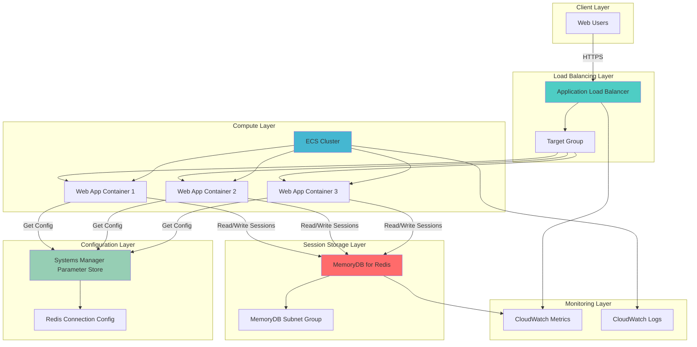

# Building Distributed Session Management with MemoryDB and Application Load Balancer

## Problem

Modern web applications require stateless architectures to achieve horizontal scalability, but traditional session management relies on server-side storage that creates dependencies between users and specific application instances. When applications scale across multiple servers, users may lose session data if they're routed to different servers, leading to poor user experience and authentication failures. This challenge becomes more complex in containerized environments where instances can be ephemeral and auto-scaling policies frequently add or remove capacity.

## Solution

Create a distributed session management solution using Amazon MemoryDB for Redis as a centralized, high-performance session store with Application Load Balancer distributing traffic across multiple ECS containers. This architecture enables truly stateless applications where session data persists independently of individual application instances, allowing seamless horizontal scaling while maintaining user session continuity. AWS Systems Manager Parameter Store provides secure configuration management for Redis connection strings and application settings.

## Architecture Diagram



## Prerequisites

1. AWS account with appropriate permissions for MemoryDB, ECS, ALB, and Systems Manager
2. AWS CLI v2 installed and configured (or AWS CloudShell)
3. Understanding of containerized applications and Redis data structures
4. Knowledge of load balancing concepts and session management patterns
5. Estimated cost: $50-100/month for MemoryDB cluster, $20-40/month for ALB, $10-30/month for ECS tasks

> **Note**: MemoryDB provides durable, Multi-AZ Redis-compatible storage with microsecond read latency and single-digit millisecond write latency, making it ideal for session management workloads.

## Preparation

```bash
# Set environment variables
export AWS_REGION=$(aws configure get region)
export AWS_ACCOUNT_ID=$(aws sts get-caller-identity \
    --query Account --output text)

# Generate unique identifiers for resources
RANDOM_SUFFIX=$(aws secretsmanager get-random-password \
    --exclude-punctuation --exclude-uppercase \
    --password-length 6 --require-each-included-type \
    --output text --query RandomPassword)

# Set resource names
export CLUSTER_NAME="session-cluster-${RANDOM_SUFFIX}"
export MEMORYDB_CLUSTER_NAME="session-memorydb-${RANDOM_SUFFIX}"
export ALB_NAME="session-alb-${RANDOM_SUFFIX}"
export TARGET_GROUP_NAME="session-tg-${RANDOM_SUFFIX}"

# Create VPC and networking foundation
aws ec2 create-vpc \
    --cidr-block 10.0.0.0/16 \
    --tag-specifications 'ResourceType=vpc,Tags=[{Key=Name,Value=session-vpc}]' \
    --output text --query 'Vpc.VpcId' > vpc-id.txt

export VPC_ID=$(cat vpc-id.txt)

# Create public subnets for ALB
aws ec2 create-subnet \
    --vpc-id ${VPC_ID} \
    --cidr-block 10.0.1.0/24 \
    --availability-zone ${AWS_REGION}a \
    --tag-specifications 'ResourceType=subnet,Tags=[{Key=Name,Value=session-public-1}]' \
    --output text --query 'Subnet.SubnetId' > public-subnet-1.txt

aws ec2 create-subnet \
    --vpc-id ${VPC_ID} \
    --cidr-block 10.0.2.0/24 \
    --availability-zone ${AWS_REGION}b \
    --tag-specifications 'ResourceType=subnet,Tags=[{Key=Name,Value=session-public-2}]' \
    --output text --query 'Subnet.SubnetId' > public-subnet-2.txt

# Create private subnets for ECS and MemoryDB
aws ec2 create-subnet \
    --vpc-id ${VPC_ID} \
    --cidr-block 10.0.3.0/24 \
    --availability-zone ${AWS_REGION}a \
    --tag-specifications 'ResourceType=subnet,Tags=[{Key=Name,Value=session-private-1}]' \
    --output text --query 'Subnet.SubnetId' > private-subnet-1.txt

aws ec2 create-subnet \
    --vpc-id ${VPC_ID} \
    --cidr-block 10.0.4.0/24 \
    --availability-zone ${AWS_REGION}b \
    --tag-specifications 'ResourceType=subnet,Tags=[{Key=Name,Value=session-private-2}]' \
    --output text --query 'Subnet.SubnetId' > private-subnet-2.txt

echo "✅ AWS environment and networking configured"
```

## Steps

1. **Create MemoryDB Subnet Group and Cluster**:

   Amazon MemoryDB provides a fully managed, Redis-compatible, in-memory database service that delivers ultra-fast performance with Multi-AZ durability. Unlike traditional Redis deployments, MemoryDB stores data both in-memory and on disk, ensuring data persistence across node failures while maintaining microsecond read latencies. This makes it ideal for session management where both speed and durability are critical.

   ```bash
   # Create MemoryDB subnet group for Multi-AZ deployment
   aws memorydb create-subnet-group \
       --subnet-group-name session-subnet-group \
       --description "Subnet group for session management MemoryDB" \
       --subnet-ids "$(cat private-subnet-1.txt)" "$(cat private-subnet-2.txt)"
   
   # Create default MemoryDB user for authentication
   aws memorydb create-user \
       --user-name session-user \
       --access-string "~* &* +@all" \
       --authentication-mode Type=password,Passwords="SessionPass123!"
   
   # Create MemoryDB ACL for access control
   aws memorydb create-acl \
       --acl-name session-acl \
       --user-names session-user
   
   # Wait for ACL to become active
   aws memorydb wait acl-active --acl-name session-acl
   
   # Create MemoryDB cluster with optimized session storage configuration
   aws memorydb create-cluster \
       --cluster-name ${MEMORYDB_CLUSTER_NAME} \
       --description "Session management cluster" \
       --node-type db.r6g.large \
       --parameter-group-name default.memorydb-redis7 \
       --subnet-group-name session-subnet-group \
       --acl-name session-acl \
       --num-shards 2 \
       --num-replicas-per-shard 1 \
       --security-group-ids $(aws ec2 create-security-group \
           --group-name memorydb-sg \
           --description "MemoryDB security group" \
           --vpc-id ${VPC_ID} \
           --output text --query 'GroupId')
   
   # Wait for cluster creation to complete
   aws memorydb wait cluster-available \
       --cluster-name ${MEMORYDB_CLUSTER_NAME}
   
   echo "✅ MemoryDB cluster created with Multi-AZ durability"
   ```

   The MemoryDB cluster now provides a highly available, durable session store that can handle thousands of concurrent sessions. The Multi-AZ configuration ensures that session data remains available even if an entire Availability Zone becomes unavailable, providing enterprise-grade reliability for session management.

2. **Configure Security Groups for Network Access**:

   Proper security group configuration is essential for a distributed session management architecture. We need to enable controlled access between the load balancer, application containers, and MemoryDB cluster while maintaining security boundaries. This step implements the principle of least privilege by opening only the necessary ports between specific components.

   ```bash
   # Create security group for ALB
   ALB_SG=$(aws ec2 create-security-group \
       --group-name alb-sg \
       --description "ALB security group" \
       --vpc-id ${VPC_ID} \
       --output text --query 'GroupId')
   
   # Allow HTTPS traffic from internet to ALB
   aws ec2 authorize-security-group-ingress \
       --group-id ${ALB_SG} \
       --protocol tcp \
       --port 443 \
       --cidr 0.0.0.0/0
   
   # Allow HTTP traffic from internet to ALB
   aws ec2 authorize-security-group-ingress \
       --group-id ${ALB_SG} \
       --protocol tcp \
       --port 80 \
       --cidr 0.0.0.0/0
   
   # Create security group for ECS tasks
   ECS_SG=$(aws ec2 create-security-group \
       --group-name ecs-sg \
       --description "ECS tasks security group" \
       --vpc-id ${VPC_ID} \
       --output text --query 'GroupId')
   
   # Allow ALB to communicate with ECS tasks on port 80
   aws ec2 authorize-security-group-ingress \
       --group-id ${ECS_SG} \
       --protocol tcp \
       --port 80 \
       --source-group ${ALB_SG}
   
   # Allow ECS tasks outbound internet access for pulling images
   aws ec2 authorize-security-group-egress \
       --group-id ${ECS_SG} \
       --protocol tcp \
       --port 443 \
       --cidr 0.0.0.0/0
   
   # Get MemoryDB security group ID
   MEMORYDB_SG=$(aws ec2 describe-security-groups \
       --filters "Name=group-name,Values=memorydb-sg" \
       --query 'SecurityGroups[0].GroupId' \
       --output text)
   
   # Allow ECS tasks to connect to MemoryDB on Redis port 6379
   aws ec2 authorize-security-group-ingress \
       --group-id ${MEMORYDB_SG} \
       --protocol tcp \
       --port 6379 \
       --source-group ${ECS_SG}
   
   echo "✅ Security groups configured with least privilege access"
   ```

   The security groups now enforce network-level security that allows only necessary communication between components. This layered security approach ensures that MemoryDB is accessible only from authorized ECS tasks, while the ALB can receive traffic from the internet and forward it to healthy application instances.

3. **Store Configuration in Systems Manager Parameter Store**:

   AWS Systems Manager Parameter Store provides secure, hierarchical storage for configuration data and secrets management. By storing MemoryDB connection details in Parameter Store, we enable dynamic configuration management without hardcoding sensitive information in application code. This approach supports the AWS Well-Architected Framework's operational excellence and security principles.

   ```bash
   # Get MemoryDB cluster endpoint
   MEMORYDB_ENDPOINT=$(aws memorydb describe-clusters \
       --cluster-name ${MEMORYDB_CLUSTER_NAME} \
       --query 'Clusters[0].ClusterEndpoint.Address' \
       --output text)
   
   # Store MemoryDB configuration in Parameter Store
   aws ssm put-parameter \
       --name "/session-app/memorydb/endpoint" \
       --value "${MEMORYDB_ENDPOINT}" \
       --type "String" \
       --description "MemoryDB cluster endpoint for session storage"
   
   aws ssm put-parameter \
       --name "/session-app/memorydb/port" \
       --value "6379" \
       --type "String" \
       --description "MemoryDB port for Redis connections"
   
   aws ssm put-parameter \
       --name "/session-app/memorydb/username" \
       --value "session-user" \
       --type "String" \
       --description "MemoryDB username for authentication"
   
   aws ssm put-parameter \
       --name "/session-app/memorydb/password" \
       --value "SessionPass123!" \
       --type "SecureString" \
       --description "MemoryDB password for authentication"
   
   aws ssm put-parameter \
       --name "/session-app/config/session-timeout" \
       --value "1800" \
       --type "String" \
       --description "Session timeout in seconds (30 minutes)"
   
   aws ssm put-parameter \
       --name "/session-app/config/redis-db" \
       --value "0" \
       --type "String" \
       --description "Redis database number for session storage"
   
   echo "✅ Configuration stored securely in Parameter Store"
   ```

   Parameter Store now contains all necessary configuration for the session management system. This centralized approach allows applications to retrieve current configuration values at runtime, enabling dynamic updates without redeployment and supporting environment-specific configurations across development, staging, and production environments.

4. **Create ECS Cluster and Task Definition**:

   Amazon ECS provides a highly scalable, fast container management service that makes it easy to run, stop, and manage Docker containers on a cluster. For session management, ECS enables us to deploy stateless application containers that can scale horizontally based on demand while maintaining session continuity through the shared MemoryDB store.

   ```bash
   # Create ECS cluster for session management applications
   aws ecs create-cluster \
       --cluster-name ${CLUSTER_NAME} \
       --capacity-providers EC2 FARGATE \
       --default-capacity-provider-strategy \
       capacityProvider=FARGATE,weight=1,base=0
   
   # Create task execution role for ECS tasks
   aws iam create-role \
       --role-name ecsTaskExecutionRole-session \
       --assume-role-policy-document '{
           "Version": "2012-10-17",
           "Statement": [
               {
                   "Effect": "Allow",
                   "Principal": {
                       "Service": "ecs-tasks.amazonaws.com"
                   },
                   "Action": "sts:AssumeRole"
               }
           ]
       }'
   
   # Attach policies for ECS task execution and Parameter Store access
   aws iam attach-role-policy \
       --role-name ecsTaskExecutionRole-session \
       --policy-arn arn:aws:iam::aws:policy/service-role/AmazonECSTaskExecutionRolePolicy
   
   aws iam attach-role-policy \
       --role-name ecsTaskExecutionRole-session \
       --policy-arn arn:aws:iam::aws:policy/AmazonSSMReadOnlyAccess
   
   # Create CloudWatch log group for application logs
   aws logs create-log-group \
       --log-group-name /ecs/session-app \
       --retention-in-days 7
   
   # Create task definition for session-aware web application
   cat > task-definition.json << EOF
   {
       "family": "session-app",
       "networkMode": "awsvpc",
       "requiresCompatibilities": ["FARGATE"],
       "cpu": "256",
       "memory": "512",
       "executionRoleArn": "arn:aws:iam::${AWS_ACCOUNT_ID}:role/ecsTaskExecutionRole-session",
       "containerDefinitions": [
           {
               "name": "session-app",
               "image": "nginx:latest",
               "portMappings": [
                   {
                       "containerPort": 80,
                       "protocol": "tcp"
                   }
               ],
               "environment": [
                   {
                       "name": "REDIS_ENDPOINT",
                       "value": "${MEMORYDB_ENDPOINT}"
                   },
                   {
                       "name": "REDIS_PORT",
                       "value": "6379"
                   }
               ],
               "logConfiguration": {
                   "logDriver": "awslogs",
                   "options": {
                       "awslogs-group": "/ecs/session-app",
                       "awslogs-region": "${AWS_REGION}",
                       "awslogs-stream-prefix": "ecs"
                   }
               }
           }
       ]
   }
   EOF
   
   # Register task definition
   aws ecs register-task-definition \
       --cli-input-json file://task-definition.json
   
   echo "✅ ECS cluster and task definition created for stateless containers"
   ```

   The ECS cluster is now ready to run stateless application containers that can scale independently while sharing session data through MemoryDB. The task definition includes environment variables for Redis connectivity and CloudWatch logging for operational visibility.

5. **Create Application Load Balancer and Target Group**:

   Application Load Balancer operates at the application layer (Layer 7) and provides advanced routing capabilities, SSL termination, and health checks. For session management, ALB distributes traffic across healthy application instances while supporting both sticky sessions (if needed) and stateless session handling through external storage.

   ```bash
   # Create internet gateway for public subnet access
   IGW_ID=$(aws ec2 create-internet-gateway \
       --tag-specifications 'ResourceType=internet-gateway,Tags=[{Key=Name,Value=session-igw}]' \
       --output text --query 'InternetGateway.InternetGatewayId')
   
   aws ec2 attach-internet-gateway \
       --internet-gateway-id ${IGW_ID} \
       --vpc-id ${VPC_ID}
   
   # Create route table for public subnets
   RT_ID=$(aws ec2 create-route-table \
       --vpc-id ${VPC_ID} \
       --tag-specifications 'ResourceType=route-table,Tags=[{Key=Name,Value=session-public-rt}]' \
       --output text --query 'RouteTable.RouteTableId')
   
   aws ec2 create-route \
       --route-table-id ${RT_ID} \
       --destination-cidr-block 0.0.0.0/0 \
       --gateway-id ${IGW_ID}
   
   # Associate public subnets with route table
   aws ec2 associate-route-table \
       --route-table-id ${RT_ID} \
       --subnet-id $(cat public-subnet-1.txt)
   
   aws ec2 associate-route-table \
       --route-table-id ${RT_ID} \
       --subnet-id $(cat public-subnet-2.txt)
   
   # Create Application Load Balancer
   ALB_ARN=$(aws elbv2 create-load-balancer \
       --name ${ALB_NAME} \
       --subnets $(cat public-subnet-1.txt) $(cat public-subnet-2.txt) \
       --security-groups ${ALB_SG} \
       --scheme internet-facing \
       --type application \
       --ip-address-type ipv4 \
       --output text --query 'LoadBalancers[0].LoadBalancerArn')
   
   # Create target group for ECS tasks
   TG_ARN=$(aws elbv2 create-target-group \
       --name ${TARGET_GROUP_NAME} \
       --protocol HTTP \
       --port 80 \
       --vpc-id ${VPC_ID} \
       --target-type ip \
       --health-check-enabled \
       --health-check-interval-seconds 30 \
       --health-check-path / \
       --health-check-protocol HTTP \
       --health-check-timeout-seconds 5 \
       --healthy-threshold-count 2 \
       --unhealthy-threshold-count 3 \
       --output text --query 'TargetGroups[0].TargetGroupArn')
   
   # Create listener for ALB
   aws elbv2 create-listener \
       --load-balancer-arn ${ALB_ARN} \
       --protocol HTTP \
       --port 80 \
       --default-actions Type=forward,TargetGroupArn=${TG_ARN}
   
   echo "✅ Application Load Balancer created with health check configuration"
   ```

   The ALB is now configured to distribute incoming traffic across healthy application instances. The health check configuration ensures that only healthy containers receive traffic, while the target group uses IP targeting for compatibility with Fargate networking.

6. **Deploy ECS Service with Auto Scaling**:

   ECS Services ensure that a specified number of task instances are running and healthy at all times. With auto scaling enabled, the service can automatically adjust the number of running tasks based on demand, providing cost-effective scaling for session management workloads while maintaining high availability.

   ```bash
   # Create NAT gateway for private subnet internet access
   NAT_GATEWAY_ID=$(aws ec2 create-nat-gateway \
       --subnet-id $(cat public-subnet-1.txt) \
       --allocation-id $(aws ec2 allocate-address \
           --domain vpc \
           --output text --query 'AllocationId') \
       --output text --query 'NatGateway.NatGatewayId')
   
   # Wait for NAT gateway to be available
   aws ec2 wait nat-gateway-available --nat-gateway-ids ${NAT_GATEWAY_ID}
   
   # Create route table for private subnets
   PRIVATE_RT_ID=$(aws ec2 create-route-table \
       --vpc-id ${VPC_ID} \
       --tag-specifications 'ResourceType=route-table,Tags=[{Key=Name,Value=session-private-rt}]' \
       --output text --query 'RouteTable.RouteTableId')
   
   aws ec2 create-route \
       --route-table-id ${PRIVATE_RT_ID} \
       --destination-cidr-block 0.0.0.0/0 \
       --nat-gateway-id ${NAT_GATEWAY_ID}
   
   # Associate private subnets with route table
   aws ec2 associate-route-table \
       --route-table-id ${PRIVATE_RT_ID} \
       --subnet-id $(cat private-subnet-1.txt)
   
   aws ec2 associate-route-table \
       --route-table-id ${PRIVATE_RT_ID} \
       --subnet-id $(cat private-subnet-2.txt)
   
   # Create ECS service with ALB integration
   aws ecs create-service \
       --cluster ${CLUSTER_NAME} \
       --service-name session-app-service \
       --task-definition session-app:1 \
       --desired-count 2 \
       --launch-type FARGATE \
       --network-configuration "awsvpcConfiguration={
           subnets=[$(cat private-subnet-1.txt),$(cat private-subnet-2.txt)],
           securityGroups=[${ECS_SG}],
           assignPublicIp=DISABLED
       }" \
       --load-balancers "targetGroupArn=${TG_ARN},containerName=session-app,containerPort=80" \
       --health-check-grace-period-seconds 300
   
   # Configure auto scaling for the ECS service
   aws application-autoscaling register-scalable-target \
       --service-namespace ecs \
       --resource-id service/${CLUSTER_NAME}/session-app-service \
       --scalable-dimension ecs:service:DesiredCount \
       --min-capacity 2 \
       --max-capacity 10 \
       --role-arn arn:aws:iam::${AWS_ACCOUNT_ID}:role/aws-service-role/ecs.application-autoscaling.amazonaws.com/AWSServiceRoleForApplicationAutoScaling_ECSService
   
   # Create scaling policy based on CPU utilization
   aws application-autoscaling put-scaling-policy \
       --service-namespace ecs \
       --resource-id service/${CLUSTER_NAME}/session-app-service \
       --scalable-dimension ecs:service:DesiredCount \
       --policy-name session-app-cpu-scaling \
       --policy-type TargetTrackingScaling \
       --target-tracking-scaling-policy-configuration '{
           "TargetValue": 70.0,
           "PredefinedMetricSpecification": {
               "PredefinedMetricType": "ECSServiceAverageCPUUtilization"
           },
           "ScaleOutCooldown": 300,
           "ScaleInCooldown": 300
       }'
   
   # Wait for service to stabilize
   aws ecs wait services-stable \
       --cluster ${CLUSTER_NAME} \
       --services session-app-service
   
   echo "✅ ECS service deployed with auto scaling based on CPU utilization"
   ```

   The ECS service now maintains high availability with automatic scaling based on CPU utilization. This configuration ensures that session management capacity scales with demand while maintaining cost efficiency during periods of low usage.

7. **Configure Session Storage Integration**:

   The final step involves configuring the application containers to use MemoryDB for session storage. This integration transforms stateful applications into stateless services that can scale horizontally without losing session data. The configuration enables session sharing across all application instances.

   ```bash
   # Create a simple session configuration script
   cat > session-config.sh << 'EOF'
   #!/bin/bash
   
   # Retrieve configuration from Parameter Store
   REDIS_ENDPOINT=$(aws ssm get-parameter \
       --name "/session-app/memorydb/endpoint" \
       --query 'Parameter.Value' \
       --output text)
   
   REDIS_PORT=$(aws ssm get-parameter \
       --name "/session-app/memorydb/port" \
       --query 'Parameter.Value' \
       --output text)
   
   REDIS_USERNAME=$(aws ssm get-parameter \
       --name "/session-app/memorydb/username" \
       --query 'Parameter.Value' \
       --output text)
   
   REDIS_PASSWORD=$(aws ssm get-parameter \
       --name "/session-app/memorydb/password" \
       --with-decryption \
       --query 'Parameter.Value' \
       --output text)
   
   SESSION_TIMEOUT=$(aws ssm get-parameter \
       --name "/session-app/config/session-timeout" \
       --query 'Parameter.Value' \
       --output text)
   
   # Export environment variables for application use
   export REDIS_ENDPOINT="${REDIS_ENDPOINT}"
   export REDIS_PORT="${REDIS_PORT}"
   export REDIS_USERNAME="${REDIS_USERNAME}"
   export REDIS_PASSWORD="${REDIS_PASSWORD}"
   export SESSION_TIMEOUT="${SESSION_TIMEOUT}"
   
   echo "Session configuration loaded from Parameter Store"
   echo "Redis Endpoint: ${REDIS_ENDPOINT}"
   echo "Redis Port: ${REDIS_PORT}"
   echo "Session Timeout: ${SESSION_TIMEOUT} seconds"
   EOF
   
   # Create simple session test script
   cat > test-session.py << 'EOF'
   import redis
   import json
   import uuid
   import time
   import os
   
   # Connect to MemoryDB with authentication
   redis_client = redis.Redis(
       host=os.getenv('REDIS_ENDPOINT', 'localhost'),
       port=int(os.getenv('REDIS_PORT', '6379')),
       username=os.getenv('REDIS_USERNAME', ''),
       password=os.getenv('REDIS_PASSWORD', ''),
       db=0,
       decode_responses=True,
       ssl=True,
       ssl_cert_reqs=None
   )
   
   # Test session creation and retrieval
   session_id = str(uuid.uuid4())
   session_data = {
       'user_id': 'user123',
       'login_time': time.time(),
       'preferences': {'theme': 'dark', 'language': 'en'}
   }
   
   # Store session with timeout
   session_timeout = int(os.getenv('SESSION_TIMEOUT', '1800'))
   redis_client.setex(
       f"session:{session_id}", 
       session_timeout, 
       json.dumps(session_data)
   )
   
   # Retrieve and verify session
   retrieved_session = redis_client.get(f"session:{session_id}")
   if retrieved_session:
       session_data = json.loads(retrieved_session)
       print(f"Session {session_id} retrieved successfully")
       print(f"User ID: {session_data['user_id']}")
       print(f"Session TTL: {redis_client.ttl(f'session:{session_id}')} seconds")
   else:
       print("Session not found")
   EOF
   
   # Upload configuration script to S3 for ECS task access
   aws s3 mb s3://session-config-${RANDOM_SUFFIX} --region ${AWS_REGION}
   aws s3 cp session-config.sh s3://session-config-${RANDOM_SUFFIX}/
   aws s3 cp test-session.py s3://session-config-${RANDOM_SUFFIX}/
   
   echo "✅ Session storage integration configured with MemoryDB"
   ```

   The session management system is now fully integrated with MemoryDB for centralized session storage. Applications can store and retrieve session data from any container instance, enabling true stateless operation and horizontal scaling.

## Validation & Testing

1. **Verify MemoryDB Cluster Health**:

   ```bash
   # Check MemoryDB cluster status
   aws memorydb describe-clusters \
       --cluster-name ${MEMORYDB_CLUSTER_NAME} \
       --query 'Clusters[0].Status'
   ```

   Expected output: `"available"`

2. **Test Application Load Balancer Connectivity**:

   ```bash
   # Get ALB DNS name
   ALB_DNS=$(aws elbv2 describe-load-balancers \
       --load-balancer-arns ${ALB_ARN} \
       --query 'LoadBalancers[0].DNSName' \
       --output text)
   
   # Test ALB health
   curl -I http://${ALB_DNS}/
   ```

   Expected output: HTTP 200 OK response

3. **Verify ECS Service Health**:

   ```bash
   # Check ECS service status
   aws ecs describe-services \
       --cluster ${CLUSTER_NAME} \
       --services session-app-service \
       --query 'services[0].runningCount'
   ```

   Expected output: `2` (or configured desired count)

4. **Test Session Storage and Retrieval**:

   ```bash
   # Test Redis connectivity with authentication
   redis-cli -h ${MEMORYDB_ENDPOINT} -p 6379 \
       --tls --user session-user --askpass \
       SET "test:session:123" "user_data" EX 1800
   
   # Verify session retrieval
   redis-cli -h ${MEMORYDB_ENDPOINT} -p 6379 \
       --tls --user session-user --askpass \
       GET "test:session:123"
   ```

   Expected output: `"user_data"`

5. **Test Auto Scaling Configuration**:

   ```bash
   # Check auto scaling configuration
   aws application-autoscaling describe-scalable-targets \
       --service-namespace ecs \
       --resource-ids service/${CLUSTER_NAME}/session-app-service
   ```

   Expected output: Scalable target with min/max capacity settings

6. **Verify Parameter Store Configuration**:

   ```bash
   # Test parameter retrieval
   aws ssm get-parameter \
       --name "/session-app/memorydb/endpoint" \
       --query 'Parameter.Value' \
       --output text
   ```

   Expected output: MemoryDB cluster endpoint address

## Cleanup

1. **Delete ECS Service and Cluster**:

   ```bash
   # Delete auto scaling policy
   aws application-autoscaling delete-scaling-policy \
       --policy-name session-app-cpu-scaling \
       --service-namespace ecs \
       --resource-id service/${CLUSTER_NAME}/session-app-service \
       --scalable-dimension ecs:service:DesiredCount
   
   # Deregister auto scaling target
   aws application-autoscaling deregister-scalable-target \
       --service-namespace ecs \
       --resource-id service/${CLUSTER_NAME}/session-app-service \
       --scalable-dimension ecs:service:DesiredCount
   
   # Delete ECS service
   aws ecs delete-service \
       --cluster ${CLUSTER_NAME} \
       --service session-app-service \
       --force
   
   # Delete ECS cluster
   aws ecs delete-cluster \
       --cluster ${CLUSTER_NAME}
   
   echo "✅ ECS resources deleted"
   ```

2. **Remove Application Load Balancer**:

   ```bash
   # Delete ALB listener
   aws elbv2 delete-listener \
       --listener-arn $(aws elbv2 describe-listeners \
           --load-balancer-arn ${ALB_ARN} \
           --query 'Listeners[0].ListenerArn' \
           --output text)
   
   # Delete target group
   aws elbv2 delete-target-group \
       --target-group-arn ${TG_ARN}
   
   # Delete load balancer
   aws elbv2 delete-load-balancer \
       --load-balancer-arn ${ALB_ARN}
   
   echo "✅ Application Load Balancer deleted"
   ```

3. **Delete MemoryDB Cluster and ACL**:

   ```bash
   # Delete MemoryDB cluster
   aws memorydb delete-cluster \
       --cluster-name ${MEMORYDB_CLUSTER_NAME}
   
   # Wait for cluster deletion
   aws memorydb wait cluster-deleted \
       --cluster-name ${MEMORYDB_CLUSTER_NAME}
   
   # Delete ACL and user
   aws memorydb delete-acl --acl-name session-acl
   aws memorydb delete-user --user-name session-user
   
   # Delete subnet group
   aws memorydb delete-subnet-group \
       --subnet-group-name session-subnet-group
   
   echo "✅ MemoryDB resources deleted"
   ```

4. **Clean up Parameter Store and IAM Resources**:

   ```bash
   # Delete Parameter Store parameters
   aws ssm delete-parameters \
       --names "/session-app/memorydb/endpoint" \
              "/session-app/memorydb/port" \
              "/session-app/memorydb/username" \
              "/session-app/memorydb/password" \
              "/session-app/config/session-timeout" \
              "/session-app/config/redis-db"
   
   # Delete IAM roles and policies
   aws iam detach-role-policy \
       --role-name ecsTaskExecutionRole-session \
       --policy-arn arn:aws:iam::aws:policy/service-role/AmazonECSTaskExecutionRolePolicy
   
   aws iam detach-role-policy \
       --role-name ecsTaskExecutionRole-session \
       --policy-arn arn:aws:iam::aws:policy/AmazonSSMReadOnlyAccess
   
   aws iam delete-role \
       --role-name ecsTaskExecutionRole-session
   
   # Delete S3 bucket
   aws s3 rb s3://session-config-${RANDOM_SUFFIX} --force
   
   echo "✅ Configuration and IAM resources cleaned up"
   ```

5. **Remove VPC and Networking Resources**:

   ```bash
   # Delete NAT gateway
   NAT_ALLOCATION_ID=$(aws ec2 describe-nat-gateways \
       --nat-gateway-ids ${NAT_GATEWAY_ID} \
       --query 'NatGateways[0].NatGatewayAddresses[0].AllocationId' \
       --output text)
   aws ec2 delete-nat-gateway --nat-gateway-id ${NAT_GATEWAY_ID}
   aws ec2 wait nat-gateway-deleted --nat-gateway-ids ${NAT_GATEWAY_ID}
   aws ec2 release-address --allocation-id ${NAT_ALLOCATION_ID}
   
   # Delete security groups
   aws ec2 delete-security-group --group-id ${ALB_SG}
   aws ec2 delete-security-group --group-id ${ECS_SG}
   aws ec2 delete-security-group --group-id ${MEMORYDB_SG}
   
   # Delete route table associations and routes
   aws ec2 disassociate-route-table \
       --association-id $(aws ec2 describe-route-tables \
           --route-table-ids ${RT_ID} \
           --query 'RouteTables[0].Associations[0].RouteTableAssociationId' \
           --output text)
   
   aws ec2 disassociate-route-table \
       --association-id $(aws ec2 describe-route-tables \
           --route-table-ids ${PRIVATE_RT_ID} \
           --query 'RouteTables[0].Associations[0].RouteTableAssociationId' \
           --output text)
   
   # Delete routes and route tables
   aws ec2 delete-route \
       --route-table-id ${RT_ID} \
       --destination-cidr-block 0.0.0.0/0
   aws ec2 delete-route-table --route-table-id ${RT_ID}
   aws ec2 delete-route-table --route-table-id ${PRIVATE_RT_ID}
   
   # Detach and delete internet gateway
   aws ec2 detach-internet-gateway \
       --internet-gateway-id ${IGW_ID} \
       --vpc-id ${VPC_ID}
   aws ec2 delete-internet-gateway --internet-gateway-id ${IGW_ID}
   
   # Delete subnets
   aws ec2 delete-subnet --subnet-id $(cat public-subnet-1.txt)
   aws ec2 delete-subnet --subnet-id $(cat public-subnet-2.txt)
   aws ec2 delete-subnet --subnet-id $(cat private-subnet-1.txt)
   aws ec2 delete-subnet --subnet-id $(cat private-subnet-2.txt)
   
   # Delete VPC
   aws ec2 delete-vpc --vpc-id ${VPC_ID}
   
   # Delete CloudWatch log group
   aws logs delete-log-group --log-group-name /ecs/session-app
   
   # Delete temporary files
   rm -f vpc-id.txt public-subnet-*.txt private-subnet-*.txt
   rm -f task-definition.json session-config.sh test-session.py
   
   echo "✅ VPC and networking resources deleted"
   ```

## Discussion

This distributed session management architecture demonstrates how to build scalable, stateless web applications using AWS managed services. The combination of MemoryDB for Redis and Application Load Balancer provides a robust foundation for session management that can scale to support thousands of concurrent users while maintaining high availability and performance.

**MemoryDB for Redis** serves as the cornerstone of this architecture, providing microsecond read latencies and single-digit millisecond write latencies with full Redis compatibility. Unlike traditional Redis deployments, MemoryDB offers durability by storing data both in-memory and on disk, ensuring that session data survives node failures and provides Multi-AZ redundancy. This durability is crucial for session management where data loss could result in user logout and poor user experience. The service automatically handles backups, patching, and scaling, reducing operational overhead while providing enterprise-grade reliability. The integration of Access Control Lists (ACLs) and user authentication provides fine-grained security controls that follow the AWS Well-Architected Framework's security best practices.

**Application Load Balancer** integration enables sophisticated traffic routing and health checking capabilities. While traditional session management often relies on sticky sessions to maintain user affinity to specific servers, this architecture eliminates that dependency by storing session data externally. ALB can distribute traffic using various algorithms (round-robin, least connections) without concern for session continuity, enabling true horizontal scaling. The health check configuration ensures that only healthy application instances receive traffic, providing automatic failover capabilities when containers become unhealthy.

**ECS with Fargate** provides the compute layer for running stateless application containers. The auto scaling configuration automatically adjusts capacity based on CPU utilization, ensuring that session management performance remains consistent during traffic spikes while optimizing costs during low-demand periods. The integration with Systems Manager Parameter Store enables dynamic configuration management, allowing applications to retrieve current settings without hardcoding values or requiring redeployment for configuration changes. The use of secure string parameters for sensitive information like passwords ensures that credentials are encrypted at rest and in transit.

This architecture follows the AWS Well-Architected Framework principles across multiple pillars. The [security pillar](https://docs.aws.amazon.com/wellarchitected/latest/security-pillar/welcome.html) is addressed through VPC isolation, security groups with least privilege access, encrypted data storage, and secure parameter management. The [reliability pillar](https://docs.aws.amazon.com/wellarchitected/latest/reliability-pillar/welcome.html) is implemented through Multi-AZ deployments, automatic failover, and health checks. The [performance efficiency pillar](https://docs.aws.amazon.com/wellarchitected/latest/framework/perf-bp.html) is achieved through in-memory session storage, efficient load balancing, and auto scaling capabilities. The [cost optimization pillar](https://docs.aws.amazon.com/wellarchitected/latest/cost-optimization-pillar/welcome.html) is supported through the use of Fargate's pay-per-use model and auto scaling that adjusts capacity based on actual demand.

> **Tip**: Monitor MemoryDB performance metrics in CloudWatch to optimize node types and scaling policies. Key metrics include CPU utilization, memory usage, network throughput, and authentication failures to ensure optimal performance and security for session management workloads.

## Challenge

Extend this solution by implementing these enhancements:

1. **Implement Session Encryption and Security**: Add encryption at rest and in transit for session data using AWS KMS keys, implement Redis AUTH with more complex access control patterns, and add session token validation middleware to prevent session hijacking attacks and implement session rotation policies.

2. **Add Session Analytics and Monitoring**: Create CloudWatch dashboards for session metrics, implement custom metrics for session duration and user activity patterns, set up alarms for session storage capacity and performance thresholds, and integrate with AWS X-Ray for distributed tracing of session operations.

3. **Implement Session Replication Across Regions**: Configure cross-region MemoryDB replication using [Global Datastore](https://docs.aws.amazon.com/memorydb/latest/devguide/global-datastore.html) for disaster recovery, implement active-passive session failover with Route 53 health checks, and add DNS-based routing for region-level failover scenarios.

4. **Add Advanced Session Management Features**: Implement session clustering by user type or geographic location using Redis data structures, add session warming and pre-loading capabilities for frequently accessed user data, and create session data compression and serialization optimizations for improved performance and reduced storage costs.

5. **Integrate with Identity and Access Management**: Connect session management with [AWS Cognito](https://docs.aws.amazon.com/cognito/latest/developerguide/) for user authentication and authorization, implement role-based session data access with fine-grained permissions, and add comprehensive session audit logging for compliance and security monitoring using CloudTrail and CloudWatch Logs.

## Infrastructure Code

*Infrastructure code will be generated after recipe approval.*