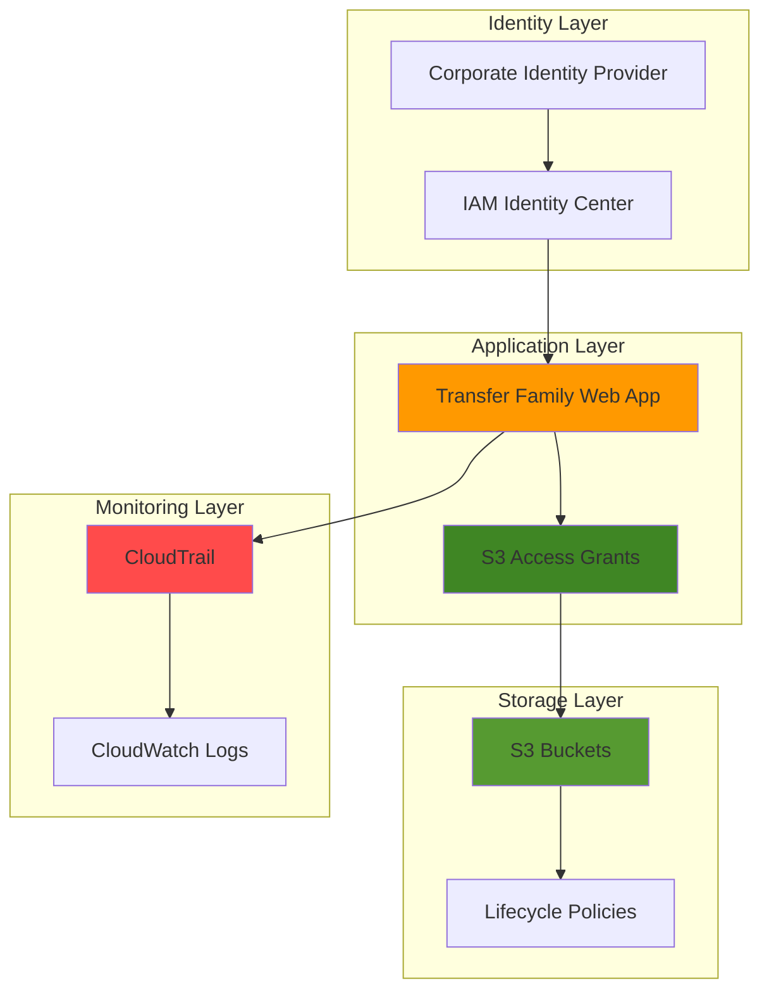

# Sharing Files Securely with Web Portals

## Problem

Organizations need to provide secure file sharing capabilities for external partners, vendors, and non-technical users without requiring specialized FTP clients or AWS console access. Traditional file sharing solutions often lack granular access controls, proper audit trails, and integration with corporate identity systems, creating security risks, compliance gaps, and operational overhead when managing file access across diverse user populations.

## Solution

AWS Transfer Family Web Apps provide a fully managed, browser-based file sharing portal that integrates seamlessly with your existing identity infrastructure. This solution combines S3's secure object storage with IAM Identity Center's authentication and fine-grained authorization to create a zero-trust file sharing environment with comprehensive audit logging through CloudTrail.

## Architecture Diagram



## Prerequisites

1. AWS account with administrative permissions for IAM Identity Center, Transfer Family, S3, and CloudTrail
2. AWS CLI v2 installed and configured (or AWS CloudShell)
3. Basic understanding of AWS identity services and S3 storage concepts
4. Corporate identity provider (optional for enhanced security)
5. Estimated cost: $15-35 per month for development/testing workloads

> **Note**: This recipe follows AWS Well-Architected Framework principles for security, reliability, and operational excellence. See [AWS Well-Architected Framework](https://docs.aws.amazon.com/wellarchitected/latest/framework/welcome.html) for additional guidance.

## Preparation

```bash
# Set environment variables
export AWS_REGION=$(aws configure get region)
export AWS_ACCOUNT_ID=$(aws sts get-caller-identity \
    --query Account --output text)

# Generate unique identifiers for resources
RANDOM_SUFFIX=$(aws secretsmanager get-random-password \
    --exclude-punctuation --exclude-uppercase \
    --password-length 6 --require-each-included-type \
    --output text --query RandomPassword)

# Set resource names
export BUCKET_NAME="secure-files-${RANDOM_SUFFIX}"
export WEBAPP_NAME="secure-file-portal-${RANDOM_SUFFIX}"
export TRAIL_NAME="file-sharing-audit-${RANDOM_SUFFIX}"

# Create S3 bucket for file storage
aws s3 mb s3://${BUCKET_NAME} --region ${AWS_REGION}

# Enable versioning and encryption
aws s3api put-bucket-versioning \
    --bucket ${BUCKET_NAME} \
    --versioning-configuration Status=Enabled

aws s3api put-bucket-encryption \
    --bucket ${BUCKET_NAME} \
    --server-side-encryption-configuration \
    'Rules=[{ApplyServerSideEncryptionByDefault:{SSEAlgorithm:AES256}}]'

# Enable public access block for security
aws s3api put-public-access-block \
    --bucket ${BUCKET_NAME} \
    --public-access-block-configuration \
    'BlockPublicAcls=true,IgnorePublicAcls=true,BlockPublicPolicy=true,RestrictPublicBuckets=true'

echo "✅ AWS environment configured with secure S3 bucket"
```

## Steps

1. **Enable IAM Identity Center**:

   IAM Identity Center serves as the central identity provider for your Transfer Family web app, providing secure authentication and user management capabilities. This AWS managed service eliminates the need for separate user databases while supporting integration with existing corporate identity systems like Active Directory, Azure AD, or external SAML/OIDC providers for seamless single sign-on experiences.

   ```bash
   # Check if Identity Center is already enabled
   EXISTING_INSTANCE=$(aws sso-admin list-instances \
       --query 'Instances[0].InstanceArn' --output text 2>/dev/null)
   
   if [ "$EXISTING_INSTANCE" != "None" ] && [ -n "$EXISTING_INSTANCE" ]; then
       echo "Identity Center already enabled"
       IDENTITY_CENTER_ARN=$EXISTING_INSTANCE
   else
       echo "Please enable IAM Identity Center manually in the AWS Console"
       echo "Visit: https://console.aws.amazon.com/singlesignon/"
       echo "Click 'Enable' and wait for setup to complete"
       read -p "Press Enter after enabling Identity Center..."
       
       # Get the newly created instance ARN
       IDENTITY_CENTER_ARN=$(aws sso-admin list-instances \
           --query 'Instances[0].InstanceArn' --output text)
   fi
   
   # Get the Identity Store ID
   IDENTITY_STORE_ID=$(aws sso-admin list-instances \
       --query 'Instances[0].IdentityStoreId' --output text)
   
   echo "✅ IAM Identity Center enabled with ARN: ${IDENTITY_CENTER_ARN}"
   ```

   The Identity Center instance now provides the foundation for secure user authentication and authorization, supporting both internal users and external partners through a unified identity management system that integrates with your existing corporate directory services.

2. **Create Test User in Identity Center**:

   Creating a test user demonstrates the user onboarding process and provides a way to validate the complete authentication flow. This user will represent the typical end-user experience when accessing the file sharing portal through the web interface.

   ```bash
   # Create a test user in Identity Center
   aws identitystore create-user \
       --identity-store-id ${IDENTITY_STORE_ID} \
       --user-name "testuser" \
       --display-name "Test User" \
       --name '{"FamilyName":"User","GivenName":"Test"}' \
       --emails '[{"Value":"testuser@example.com","Type":"Work","Primary":true}]'
   
   # Get the user ID
   USER_ID=$(aws identitystore list-users \
       --identity-store-id ${IDENTITY_STORE_ID} \
       --query 'Users[?UserName==`testuser`].UserId' --output text)
   
   echo "✅ Test user created with ID: ${USER_ID}"
   ```

   The test user is now available in the Identity Center directory and can be assigned specific permissions through IAM policies and roles, enabling fine-grained access control for different user roles within your organization.

3. **Create S3 Access Grants Instance**:

   S3 Access Grants provide fine-grained access control to S3 resources, enabling you to grant specific permissions to users without managing complex IAM policies. This service integrates with IAM Identity Center to provide seamless authorization for web app users.

   ```bash
   # Create S3 Access Grants instance
   aws s3control create-access-grants-instance \
       --account-id ${AWS_ACCOUNT_ID} \
       --identity-center-arn ${IDENTITY_CENTER_ARN}
   
   # Wait for instance to be ready
   sleep 30
   
   # Get the Access Grants instance ARN
   ACCESS_GRANTS_ARN=$(aws s3control get-access-grants-instance \
       --account-id ${AWS_ACCOUNT_ID} \
       --query 'AccessGrantsInstanceArn' --output text)
   
   echo "✅ S3 Access Grants instance created: ${ACCESS_GRANTS_ARN}"
   ```

   The S3 Access Grants instance now provides centralized access management for S3 resources, enabling fine-grained permissions that integrate seamlessly with your Identity Center users and groups.

4. **Create Access Grant Location and Grant**:

   Access grant locations define the S3 resources that can be accessed, while access grants specify which users or groups can access those resources and what actions they can perform. This approach provides granular security controls while simplifying access management.

   ```bash
   # Create S3 Access Grant location
   LOCATION_ID=$(aws s3control create-access-grant-location \
       --account-id ${AWS_ACCOUNT_ID} \
       --location-scope s3://${BUCKET_NAME}/* \
       --iam-role-arn arn:aws:iam::${AWS_ACCOUNT_ID}:role/service-role/S3AccessGrantsLocationRole \
       --query 'AccessGrantLocationId' --output text 2>/dev/null || \
   aws s3control create-access-grant-location \
       --account-id ${AWS_ACCOUNT_ID} \
       --location-scope s3://${BUCKET_NAME}/* \
       --query 'AccessGrantLocationId' --output text)
   
   # Create access grant for the test user
   GRANT_ID=$(aws s3control create-access-grant \
       --account-id ${AWS_ACCOUNT_ID} \
       --access-grant-location-id ${LOCATION_ID} \
       --access-grant-location-configuration LocationScope=s3://${BUCKET_NAME}/* \
       --grantee GranteeType=IAM,GranteeIdentifier=${IDENTITY_CENTER_ARN}/user/${USER_ID} \
       --permission READWRITE \
       --query 'AccessGrantId' --output text)
   
   echo "✅ Access grant created with ID: ${GRANT_ID}"
   ```

   The access grant now provides the test user with read and write permissions to the S3 bucket, demonstrating how fine-grained access controls can be implemented for different users and use cases.

5. **Create IAM Role for Web App Identity Bearer**:

   The web app requires an identity bearer role that allows it to assume the identity of authenticated users and access S3 resources on their behalf. This role enables secure delegation of permissions while maintaining proper access controls.

   ```bash
   # Create trust policy for web app identity bearer role
   cat > webapp-trust-policy.json << EOF
   {
       "Version": "2012-10-17",
       "Statement": [
           {
               "Effect": "Allow",
               "Principal": {
                   "Service": "transfer.amazonaws.com"
               },
               "Action": "sts:AssumeRole"
           }
       ]
   }
   EOF
   
   # Create IAM role for web app
   aws iam create-role \
       --role-name TransferWebAppRole-${RANDOM_SUFFIX} \
       --assume-role-policy-document file://webapp-trust-policy.json
   
   # Create policy for S3 Access Grants integration
   cat > webapp-policy.json << EOF
   {
       "Version": "2012-10-17",
       "Statement": [
           {
               "Effect": "Allow",
               "Action": [
                   "s3:GetDataAccess"
               ],
               "Resource": "*"
           }
       ]
   }
   EOF
   
   # Attach policy to role
   aws iam put-role-policy \
       --role-name TransferWebAppRole-${RANDOM_SUFFIX} \
       --policy-name S3AccessGrantsPolicy \
       --policy-document file://webapp-policy.json
   
   # Get role ARN
   WEBAPP_ROLE_ARN=$(aws iam get-role \
       --role-name TransferWebAppRole-${RANDOM_SUFFIX} \
       --query 'Role.Arn' --output text)
   
   echo "✅ Web app identity bearer role created: ${WEBAPP_ROLE_ARN}"
   ```

   The identity bearer role now enables the web app to securely access S3 resources on behalf of authenticated users while leveraging S3 Access Grants for fine-grained permission management.

6. **Create CloudTrail for Audit Logging**:

   CloudTrail provides comprehensive audit logging for all file sharing activities, enabling compliance monitoring, security analysis, and operational troubleshooting. This creates an immutable record of all user actions and system events for regulatory compliance and security analysis.

   ```bash
   # Create CloudTrail for audit logging
   aws cloudtrail create-trail \
       --name ${TRAIL_NAME} \
       --s3-bucket-name ${BUCKET_NAME} \
       --s3-key-prefix "audit-logs/" \
       --include-global-service-events \
       --is-multi-region-trail \
       --enable-log-file-validation
   
   # Enable data events for S3 bucket
   aws cloudtrail put-event-selectors \
       --trail-name ${TRAIL_NAME} \
       --event-selectors \
       'ReadWriteType=All,IncludeManagementEvents=true,DataResources=[{Type=AWS::S3::Object,Values=["arn:aws:s3:::'${BUCKET_NAME}'/*"]}]'
   
   # Start logging
   aws cloudtrail start-logging --name ${TRAIL_NAME}
   
   echo "✅ CloudTrail configured for comprehensive audit logging"
   ```

   CloudTrail now captures all file access events and API calls, providing detailed audit trails for compliance requirements and security monitoring while supporting forensic analysis of user activities and system behavior.

7. **Create Transfer Family Web App**:

   The Transfer Family web app provides a secure, browser-based interface for file sharing operations without requiring specialized client software or technical expertise. This fully managed service handles authentication, authorization, and file transfer operations through a user-friendly web interface that integrates with IAM Identity Center.

   ```bash
   # Configure CORS for the S3 bucket (required for web app)
   cat > cors-configuration.json << EOF
   {
       "CORSRules": [
           {
               "AllowedHeaders": ["*"],
               "AllowedMethods": ["GET", "PUT", "POST", "DELETE", "HEAD"],
               "AllowedOrigins": ["*"],
               "ExposeHeaders": ["ETag"],
               "MaxAgeSeconds": 3000
           }
       ]
   }
   EOF
   
   aws s3api put-bucket-cors \
       --bucket ${BUCKET_NAME} \
       --cors-configuration file://cors-configuration.json
   
   # Create web app configuration with Identity Center integration
   WEBAPP_ID=$(aws transfer create-web-app \
       --identity-provider-details \
       'IdentityCenterConfig={InstanceArn='${IDENTITY_CENTER_ARN}',Role='${WEBAPP_ROLE_ARN}'}' \
       --web-app-units 'Provisioned=1' \
       --tags Key=Environment,Value=Development Key=Purpose,Value=SecureFileSharing \
       --query 'WebAppId' --output text)
   
   # Wait for web app to be created (manual check)
   echo "Waiting for web app to be available..."
   sleep 60
   
   # Get web app details
   WEBAPP_ENDPOINT=$(aws transfer describe-web-app \
       --web-app-id ${WEBAPP_ID} \
       --query 'WebApp.AccessEndpoint' --output text)
   
   echo "✅ Transfer Family web app created with ID: ${WEBAPP_ID}"
   echo "✅ Web app endpoint: ${WEBAPP_ENDPOINT}"
   ```

   The web app is now available with secure authentication through IAM Identity Center and provides a user-friendly interface for file sharing operations while maintaining enterprise security and compliance requirements through integrated audit logging and access controls.

8. **Create Sample Files and Directory Structure**:

   Creating a sample file structure demonstrates the organizational capabilities and provides test data for validation. This structure shows how different file types and organizational patterns can be implemented within the secure file sharing environment.

   ```bash
   # Create sample directory structure
   mkdir -p test-files/{uploads,shared,archive}
   
   # Create sample files
   echo "Welcome to Secure File Sharing Portal" > test-files/welcome.txt
   echo "Sample document for testing upload functionality" > test-files/uploads/sample.txt
   echo "Shared resource document for collaboration" > test-files/shared/resource.txt
   echo "Archived document for long-term storage" > test-files/archive/archive.txt
   
   # Upload sample files to S3
   aws s3 cp test-files/ s3://${BUCKET_NAME}/ --recursive
   
   # Set lifecycle policy for archive folder
   cat > lifecycle-policy.json << EOF
   {
       "Rules": [
           {
               "ID": "ArchiveRule",
               "Status": "Enabled",
               "Filter": {
                   "Prefix": "archive/"
               },
               "Transitions": [
                   {
                       "Days": 30,
                       "StorageClass": "STANDARD_IA"
                   },
                   {
                       "Days": 90,
                       "StorageClass": "GLACIER"
                   }
               ]
           }
       ]
   }
   EOF
   
   aws s3api put-bucket-lifecycle-configuration \
       --bucket ${BUCKET_NAME} \
       --lifecycle-configuration file://lifecycle-policy.json
   
   echo "✅ Sample files uploaded with lifecycle policies configured"
   ```

   The sample file structure now demonstrates different access patterns and organizational approaches while showcasing cost optimization through automated lifecycle management that transitions files to lower-cost storage classes over time.

## Validation & Testing

1. **Verify Web App Configuration**:

   ```bash
   # Check web app status
   aws transfer describe-web-app \
       --web-app-id ${WEBAPP_ID} \
       --query 'WebApp.{State:State,AccessEndpoint:AccessEndpoint,IdentityProviderDetails:IdentityProviderDetails}'
   
   # Test endpoint accessibility
   curl -I ${WEBAPP_ENDPOINT} 2>/dev/null | head -n 1
   ```

   Expected output: Web app should show "AVAILABLE" state with proper Identity Center configuration and endpoint should respond with HTTP 200 or redirect status.

2. **Verify S3 Access Grants Configuration**:

   ```bash
   # Check access grants instance
   aws s3control get-access-grants-instance \
       --account-id ${AWS_ACCOUNT_ID} \
       --query 'AccessGrantsInstanceArn'
   
   # List access grants
   aws s3control list-access-grants \
       --account-id ${AWS_ACCOUNT_ID} \
       --query 'AccessGrantsList[0].{GrantId:AccessGrantId,Permission:Permission,LocationScope:AccessGrantLocationConfiguration.LocationScope}'
   ```

   Expected output: Access grants instance should be properly configured with the test user having READWRITE permissions to the S3 bucket.

3. **Verify CloudTrail Logging**:

   ```bash
   # Check CloudTrail status
   aws cloudtrail get-trail-status \
       --name ${TRAIL_NAME} \
       --query 'IsLogging'
   
   # Verify recent log delivery
   aws cloudtrail lookup-events \
       --lookup-attributes AttributeKey=EventName,AttributeValue=CreateWebApp \
       --max-items 1 \
       --query 'Events[0].{EventName:EventName,EventTime:EventTime}'
   ```

   Expected output: CloudTrail should show "true" for IsLogging and recent events should be captured in the audit logs.

4. **Test S3 Bucket Security and CORS**:

   ```bash
   # Verify bucket encryption
   aws s3api get-bucket-encryption \
       --bucket ${BUCKET_NAME} \
       --query 'ServerSideEncryptionConfiguration.Rules[0].ApplyServerSideEncryptionByDefault.SSEAlgorithm'
   
   # Check CORS configuration
   aws s3api get-bucket-cors \
       --bucket ${BUCKET_NAME} \
       --query 'CORSRules[0].AllowedMethods'
   
   # Check public access block
   aws s3api get-public-access-block \
       --bucket ${BUCKET_NAME} \
       --query 'PublicAccessBlockConfiguration.{BlockPublicAcls:BlockPublicAcls,RestrictPublicBuckets:RestrictPublicBuckets}'
   ```

   Expected output: Bucket should have AES256 encryption enabled, CORS configured for web app access, and public access should be blocked for security.

## Cleanup

1. **Delete Transfer Family Web App**:

   ```bash
   # Delete web app
   aws transfer delete-web-app --web-app-id ${WEBAPP_ID}
   
   # Wait for deletion to complete
   echo "Waiting for web app deletion..."
   sleep 60
   
   echo "✅ Transfer Family web app deleted"
   ```

2. **Remove S3 Access Grants Resources**:

   ```bash
   # Delete access grant
   aws s3control delete-access-grant \
       --account-id ${AWS_ACCOUNT_ID} \
       --access-grant-id ${GRANT_ID}
   
   # Delete access grant location
   aws s3control delete-access-grant-location \
       --account-id ${AWS_ACCOUNT_ID} \
       --access-grant-location-id ${LOCATION_ID}
   
   # Delete access grants instance
   aws s3control delete-access-grants-instance \
       --account-id ${AWS_ACCOUNT_ID}
   
   echo "✅ S3 Access Grants resources removed"
   ```

3. **Stop CloudTrail and Clean Up**:

   ```bash
   # Stop CloudTrail logging
   aws cloudtrail stop-logging --name ${TRAIL_NAME}
   
   # Delete CloudTrail
   aws cloudtrail delete-trail --name ${TRAIL_NAME}
   
   echo "✅ CloudTrail resources cleaned up"
   ```

4. **Remove IAM Role and Identity Center User**:

   ```bash
   # Delete inline policy
   aws iam delete-role-policy \
       --role-name TransferWebAppRole-${RANDOM_SUFFIX} \
       --policy-name S3AccessGrantsPolicy
   
   # Delete IAM role
   aws iam delete-role --role-name TransferWebAppRole-${RANDOM_SUFFIX}
   
   # Delete Identity Center user
   aws identitystore delete-user \
       --identity-store-id ${IDENTITY_STORE_ID} \
       --user-id ${USER_ID}
   
   echo "✅ IAM role and Identity Center user removed"
   ```

5. **Remove S3 Bucket and Contents**:

   ```bash
   # Delete all objects in bucket
   aws s3 rm s3://${BUCKET_NAME} --recursive
   
   # Delete bucket CORS configuration
   aws s3api delete-bucket-cors --bucket ${BUCKET_NAME}
   
   # Delete bucket lifecycle configuration
   aws s3api delete-bucket-lifecycle --bucket ${BUCKET_NAME}
   
   # Delete bucket
   aws s3 rb s3://${BUCKET_NAME}
   
   # Clean up local files
   rm -rf test-files/
   rm -f webapp-trust-policy.json webapp-policy.json \
         cors-configuration.json lifecycle-policy.json
   
   echo "✅ S3 bucket and local files removed"
   ```

## Discussion

AWS Transfer Family Web Apps represent a significant advancement in secure file sharing capabilities, combining enterprise-grade security with user-friendly interfaces that require no specialized client software. The integration with IAM Identity Center provides centralized identity management while S3 Access Grants enable fine-grained access controls that follow zero-trust principles. This architecture eliminates the need for traditional FTP servers or complex VPN configurations while maintaining comprehensive audit trails through CloudTrail.

The solution leverages AWS's principle of least privilege by using S3 Access Grants to provide users only the minimum permissions necessary for their specific roles and responsibilities. The Transfer Family service automatically manages secure connections and file transfer operations, reducing the risk of security vulnerabilities while supporting seamless integration with corporate identity providers. The web-based interface makes file sharing accessible to non-technical users while maintaining enterprise security standards through continuous authentication and authorization validation.

Performance and scalability are inherent benefits of this fully managed architecture. The Transfer Family web app automatically scales to handle varying loads without manual intervention, while S3 provides virtually unlimited storage capacity with multiple durability and availability options. CloudTrail ensures comprehensive logging for compliance requirements while supporting advanced analytics through integration with CloudWatch, AWS Config, and third-party SIEM solutions for enhanced security monitoring and threat detection.

> **Tip**: Enable S3 Cross-Region Replication for critical files to ensure business continuity and disaster recovery capabilities. The [S3 Cross-Region Replication documentation](https://docs.aws.amazon.com/AmazonS3/latest/userguide/replication.html) provides detailed configuration guidance for implementing multi-region data protection strategies.

The architecture supports various compliance frameworks including SOC 2, HIPAA, PCI DSS, and FedRAMP through AWS's comprehensive security controls and audit capabilities. Organizations can implement additional security measures such as IP allowlists, custom branding, and integration with existing monitoring systems to meet specific regulatory or business requirements. For detailed security guidance, refer to the [AWS Transfer Family Security documentation](https://docs.aws.amazon.com/transfer/latest/userguide/security.html), [S3 Security Best Practices](https://docs.aws.amazon.com/AmazonS3/latest/userguide/security-best-practices.html), and [IAM Identity Center implementation guidance](https://docs.aws.amazon.com/singlesignon/latest/userguide/what-is.html).

## Challenge

Extend this solution by implementing these enhancements:

1. **Implement Custom Branding and Domain**: Configure custom logos, colors, and a custom domain name for the web app to match your corporate identity using Transfer Family's branding features and Route 53 DNS management for professional user experience.

2. **Add Multi-Factor Authentication**: Integrate MFA requirements through IAM Identity Center or external identity providers to strengthen authentication security for sensitive file operations and administrative access with conditional access policies.

3. **Create Automated File Processing Workflows**: Use S3 Event Notifications with Lambda functions to automatically process uploaded files through workflows such as virus scanning, format conversion, metadata extraction, or content classification with Step Functions orchestration.

4. **Implement Advanced Access Controls**: Configure IP-based access restrictions, time-based access controls, and conditional permissions using IAM policies and S3 Access Grants for enhanced security and compliance requirements with automated policy management.

5. **Add Comprehensive Monitoring and Alerting**: Create CloudWatch dashboards, custom metrics, and automated alerts to monitor file sharing activities, detect anomalous behavior, track usage patterns, and alert administrators to potential security incidents or capacity issues using EventBridge rules.

## Infrastructure Code

*Infrastructure code will be generated after recipe approval.*