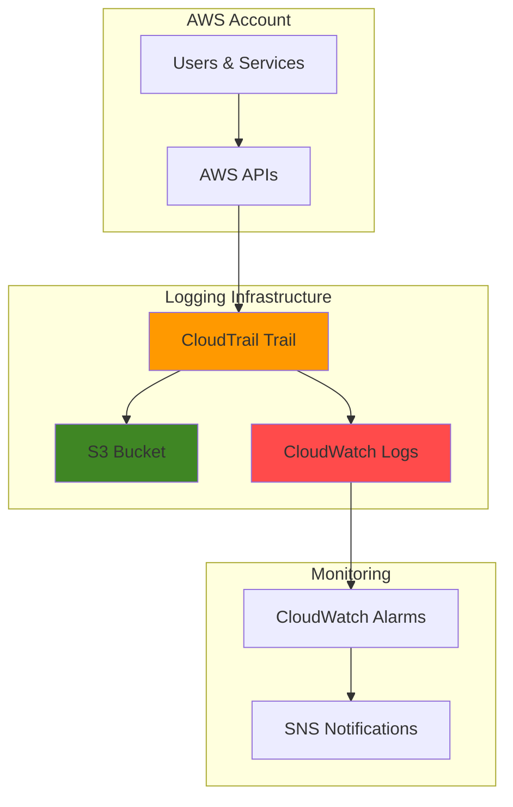

# Simple API Logging with CloudTrail and S3

## Problem

Organizations struggle to maintain comprehensive audit trails of AWS API activities for security monitoring and compliance requirements. Without proper API logging, security teams cannot track user actions, investigate incidents, or demonstrate compliance with regulatory frameworks. Manual log collection is time-consuming and often incomplete, leaving security blind spots in cloud environments.

## Solution

Implement AWS CloudTrail to automatically capture and log all API calls across your AWS account, storing the audit logs in a secure S3 bucket with proper access controls. This solution provides centralized API logging with CloudWatch integration for real-time monitoring and alerting, ensuring complete visibility into AWS account activities while meeting compliance requirements.

## Architecture Diagram



## Prerequisites

1. AWS account with administrative permissions for CloudTrail, S3, CloudWatch, and IAM services
2. AWS CLI installed and configured (version 2.0 or later) or access to AWS CloudShell
3. Basic understanding of AWS services and JSON policy syntax
4. Knowledge of security best practices and compliance requirements
5. Estimated cost: $2-5 per month for small-scale logging (varies by API call volume)

> **Note**: CloudTrail provides 90 days of management event history at no charge, but creating a trail enables long-term storage and additional event types.

## Preparation

```bash
# Set environment variables
export AWS_REGION=$(aws configure get region)
export AWS_ACCOUNT_ID=$(aws sts get-caller-identity \
    --query Account --output text)

# Generate unique identifiers for resources
RANDOM_SUFFIX=$(aws secretsmanager get-random-password \
    --exclude-punctuation --exclude-uppercase \
    --password-length 6 --require-each-included-type \
    --output text --query RandomPassword)

# Set resource names
export BUCKET_NAME="cloudtrail-logs-${AWS_ACCOUNT_ID}-${RANDOM_SUFFIX}"
export TRAIL_NAME="api-logging-trail-${RANDOM_SUFFIX}"
export LOG_GROUP_NAME="/aws/cloudtrail/${TRAIL_NAME}"
export ROLE_NAME="CloudTrailLogsRole-${RANDOM_SUFFIX}"

echo "✅ Environment configured for CloudTrail setup"
echo "Bucket: ${BUCKET_NAME}"
echo "Trail: ${TRAIL_NAME}"
echo "Log Group: ${LOG_GROUP_NAME}"
```

## Steps

1. **Create S3 Bucket for CloudTrail Logs**:

   Amazon S3 provides the durable, scalable storage foundation for CloudTrail logs with 99.999999999% (11 9's) durability. Creating a dedicated bucket with proper security configurations ensures log integrity and access control while supporting long-term retention for compliance requirements.

   ```bash
   # Create S3 bucket with server-side encryption
   aws s3 mb s3://${BUCKET_NAME} --region ${AWS_REGION}
   
   # Enable versioning for audit trail protection
   aws s3api put-bucket-versioning \
       --bucket ${BUCKET_NAME} \
       --versioning-configuration Status=Enabled
   
   # Configure server-side encryption with AES256
   aws s3api put-bucket-encryption \
       --bucket ${BUCKET_NAME} \
       --server-side-encryption-configuration \
       'Rules=[{ApplyServerSideEncryptionByDefault:{SSEAlgorithm:AES256}}]'
   
   # Block public access for security
   aws s3api put-public-access-block \
       --bucket ${BUCKET_NAME} \
       --public-access-block-configuration \
       BlockPublicAcls=true,IgnorePublicAcls=true,BlockPublicPolicy=true,RestrictPublicBuckets=true
   
   echo "✅ S3 bucket created with security features: ${BUCKET_NAME}"
   ```

   The S3 bucket now serves as a secure, encrypted repository for CloudTrail logs with versioning enabled to protect against accidental deletion or modification of audit records.

2. **Create CloudWatch Log Group**:

   CloudWatch Logs provides real-time log streaming and enables metric filters for monitoring specific API events. Creating a dedicated log group allows for centralized log management and real-time alerting on security-relevant activities across your AWS environment.

   ```bash
   # Create CloudWatch log group for CloudTrail
   aws logs create-log-group \
       --log-group-name ${LOG_GROUP_NAME}
   
   # Set log retention to 30 days (adjust as needed)
   aws logs put-retention-policy \
       --log-group-name ${LOG_GROUP_NAME} \
       --retention-in-days 30
   
   echo "✅ CloudWatch log group created: ${LOG_GROUP_NAME}"
   ```

   The log group now provides a centralized location for real-time CloudTrail events with configurable retention policies to balance monitoring needs with storage costs.

3. **Create CloudTrail Service Role with Minimal Permissions**:

   CloudTrail requires specific IAM permissions to write logs to CloudWatch. Creating a dedicated service role with least-privilege permissions ensures secure access while enabling full logging functionality according to AWS security best practices.

   ```bash
   # Create trust policy for CloudTrail service
   cat > cloudtrail-trust-policy.json << EOF
   {
       "Version": "2012-10-17",
       "Statement": [
           {
               "Effect": "Allow",
               "Principal": {
                   "Service": "cloudtrail.amazonaws.com"
               },
               "Action": "sts:AssumeRole"
           }
       ]
   }
   EOF
   
   # Create inline policy for CloudWatch Logs access
   cat > cloudtrail-logs-policy.json << EOF
   {
       "Version": "2012-10-17",
       "Statement": [
           {
               "Sid": "AWSCloudTrailCreateLogStream",
               "Effect": "Allow",
               "Action": [
                   "logs:CreateLogStream"
               ],
               "Resource": [
                   "arn:aws:logs:${AWS_REGION}:${AWS_ACCOUNT_ID}:log-group:${LOG_GROUP_NAME}:log-stream:*"
               ]
           },
           {
               "Sid": "AWSCloudTrailPutLogEvents",
               "Effect": "Allow",
               "Action": [
                   "logs:PutLogEvents"
               ],
               "Resource": [
                   "arn:aws:logs:${AWS_REGION}:${AWS_ACCOUNT_ID}:log-group:${LOG_GROUP_NAME}:log-stream:*"
               ]
           }
       ]
   }
   EOF
   
   # Create CloudTrail service role
   aws iam create-role \
       --role-name ${ROLE_NAME} \
       --assume-role-policy-document file://cloudtrail-trust-policy.json
   
   # Attach the custom policy for CloudWatch Logs
   aws iam put-role-policy \
       --role-name ${ROLE_NAME} \
       --policy-name CloudTrailLogsPolicy \
       --policy-document file://cloudtrail-logs-policy.json
   
   export CLOUDTRAIL_ROLE_ARN="arn:aws:iam::${AWS_ACCOUNT_ID}:role/${ROLE_NAME}"
   
   echo "✅ CloudTrail service role created: ${CLOUDTRAIL_ROLE_ARN}"
   ```

   The service role enables CloudTrail to securely deliver logs to CloudWatch Logs with minimal required permissions, following the principle of least privilege for enhanced security.

4. **Configure S3 Bucket Policy for CloudTrail**:

   CloudTrail requires specific S3 bucket permissions to deliver log files securely. The bucket policy implements AWS security best practices including source ARN conditions and least-privilege access to ensure only authorized CloudTrail services can write logs.

   ```bash
   # Create S3 bucket policy for CloudTrail with source ARN condition
   cat > s3-bucket-policy.json << EOF
   {
       "Version": "2012-10-17",
       "Statement": [
           {
               "Sid": "AWSCloudTrailAclCheck",
               "Effect": "Allow",
               "Principal": {
                   "Service": "cloudtrail.amazonaws.com"
               },
               "Action": "s3:GetBucketAcl",
               "Resource": "arn:aws:s3:::${BUCKET_NAME}",
               "Condition": {
                   "StringEquals": {
                       "aws:SourceArn": "arn:aws:cloudtrail:${AWS_REGION}:${AWS_ACCOUNT_ID}:trail/${TRAIL_NAME}"
                   }
               }
           },
           {
               "Sid": "AWSCloudTrailWrite",
               "Effect": "Allow",
               "Principal": {
                   "Service": "cloudtrail.amazonaws.com"
               },
               "Action": "s3:PutObject",
               "Resource": "arn:aws:s3:::${BUCKET_NAME}/AWSLogs/${AWS_ACCOUNT_ID}/*",
               "Condition": {
                   "StringEquals": {
                       "s3:x-amz-acl": "bucket-owner-full-control",
                       "aws:SourceArn": "arn:aws:cloudtrail:${AWS_REGION}:${AWS_ACCOUNT_ID}:trail/${TRAIL_NAME}"
                   }
               }
           }
       ]
   }
   EOF
   
   # Apply bucket policy
   aws s3api put-bucket-policy \
       --bucket ${BUCKET_NAME} \
       --policy file://s3-bucket-policy.json
   
   echo "✅ S3 bucket policy configured with CloudTrail permissions"
   ```

   The bucket policy ensures secure, authorized access while preventing unauthorized users from accessing or modifying CloudTrail log files stored in S3. The source ARN condition is a critical security feature that prevents cross-account access.

5. **Create CloudTrail Trail**:

   The CloudTrail trail serves as the central logging configuration that captures all AWS API calls across your account. Enabling both S3 and CloudWatch Logs delivery provides comprehensive logging with long-term storage and real-time monitoring capabilities.

   ```bash
   # Create CloudTrail trail with multi-region support
   aws cloudtrail create-trail \
       --name ${TRAIL_NAME} \
       --s3-bucket-name ${BUCKET_NAME} \
       --include-global-service-events \
       --is-multi-region-trail \
       --enable-log-file-validation \
       --cloud-watch-logs-log-group-arn "arn:aws:logs:${AWS_REGION}:${AWS_ACCOUNT_ID}:log-group:${LOG_GROUP_NAME}:*" \
       --cloud-watch-logs-role-arn ${CLOUDTRAIL_ROLE_ARN}
   
   # Start logging on the trail
   aws cloudtrail start-logging --name ${TRAIL_NAME}
   
   # Get trail status and ARN
   TRAIL_ARN=$(aws cloudtrail describe-trails \
       --trail-name-list ${TRAIL_NAME} \
       --query 'trailList[0].TrailARN' --output text)
   
   echo "✅ CloudTrail trail created and logging started"
   echo "Trail ARN: ${TRAIL_ARN}"
   ```

   CloudTrail is now actively logging all API activities to both S3 and CloudWatch Logs, providing comprehensive audit coverage with log file validation for integrity verification across all AWS regions.

6. **Create CloudWatch Alarm for Root Account Usage**:

   Monitoring root account usage is a critical security best practice. Creating CloudWatch alarms on specific API events enables real-time detection of potentially suspicious activities and automated response workflows for security incident management.

   ```bash
   # Create metric filter for root account usage
   aws logs put-metric-filter \
       --log-group-name ${LOG_GROUP_NAME} \
       --filter-name RootAccountUsage \
       --filter-pattern '{ $.userIdentity.type = "Root" && $.userIdentity.invokedBy NOT EXISTS && $.eventType != "AwsServiceEvent" }' \
       --metric-transformations \
           metricName=RootAccountUsageCount,metricNamespace=CloudTrailMetrics,metricValue=1
   
   # Create SNS topic for notifications
   export TOPIC_ARN=$(aws sns create-topic \
       --name cloudtrail-alerts-${RANDOM_SUFFIX} \
       --query 'TopicArn' --output text)
   
   # Create CloudWatch alarm
   aws cloudwatch put-metric-alarm \
       --alarm-name "CloudTrail-RootAccountUsage-${RANDOM_SUFFIX}" \
       --alarm-description "Alert when root account is used" \
       --metric-name RootAccountUsageCount \
       --namespace CloudTrailMetrics \
       --statistic Sum \
       --period 300 \
       --threshold 1 \
       --comparison-operator GreaterThanOrEqualToThreshold \
       --evaluation-periods 1 \
       --alarm-actions ${TOPIC_ARN}
   
   echo "✅ CloudWatch alarm created for root account monitoring"
   echo "SNS Topic: ${TOPIC_ARN}"
   ```

   The monitoring system now automatically detects and alerts on root account usage, providing immediate notification of potentially high-risk security events that require investigation.

## Validation & Testing

1. **Verify CloudTrail is logging events**:

   ```bash
   # Check trail status
   aws cloudtrail get-trail-status --name ${TRAIL_NAME}
   
   # Verify recent events are being captured
   aws cloudtrail lookup-events \
       --lookup-attributes AttributeKey=EventName,AttributeValue=DescribeTrails \
       --start-time "$(date -u -d '10 minutes ago' +%Y-%m-%dT%H:%M:%S.000Z)" \
       --max-items 5
   ```

   Expected output: Trail status showing `IsLogging: true` and recent API events in the lookup results.

2. **Test S3 log delivery**:

   ```bash
   # Wait a few minutes, then check for log files in S3
   sleep 300
   
   # List objects in CloudTrail bucket
   aws s3 ls s3://${BUCKET_NAME}/AWSLogs/${AWS_ACCOUNT_ID}/CloudTrail/ \
       --recursive | head -10
   ```

   Expected output: CloudTrail log files with timestamps showing recent API activity.

3. **Verify CloudWatch Logs integration**:

   ```bash
   # Check log streams in CloudWatch
   aws logs describe-log-streams \
       --log-group-name ${LOG_GROUP_NAME} \
       --order-by LastEventTime \
       --descending --max-items 3
   
   # Sample recent log events (if streams exist)
   STREAM_NAME=$(aws logs describe-log-streams \
       --log-group-name ${LOG_GROUP_NAME} \
       --order-by LastEventTime --descending --max-items 1 \
       --query 'logStreams[0].logStreamName' --output text 2>/dev/null)
   
   if [ "${STREAM_NAME}" != "None" ] && [ -n "${STREAM_NAME}" ]; then
       aws logs get-log-events \
           --log-group-name ${LOG_GROUP_NAME} \
           --log-stream-name ${STREAM_NAME} \
           --limit 3
   else
       echo "Log streams may take a few minutes to appear after trail creation"
   fi
   ```

   Expected output: Log streams with recent timestamps and CloudTrail events in JSON format.

## Cleanup

1. **Stop CloudTrail logging and delete trail**:

   ```bash
   # Stop logging
   aws cloudtrail stop-logging --name ${TRAIL_NAME}
   
   # Delete trail
   aws cloudtrail delete-trail --name ${TRAIL_NAME}
   
   echo "✅ CloudTrail trail deleted"
   ```

2. **Remove CloudWatch resources**:

   ```bash
   # Delete CloudWatch alarm
   aws cloudwatch delete-alarms \
       --alarm-names "CloudTrail-RootAccountUsage-${RANDOM_SUFFIX}"
   
   # Delete metric filter
   aws logs delete-metric-filter \
       --log-group-name ${LOG_GROUP_NAME} \
       --filter-name RootAccountUsage
   
   # Delete log group
   aws logs delete-log-group --log-group-name ${LOG_GROUP_NAME}
   
   # Delete SNS topic
   aws sns delete-topic --topic-arn ${TOPIC_ARN}
   
   echo "✅ CloudWatch resources cleaned up"
   ```

3. **Remove S3 bucket and contents**:

   ```bash
   # Delete all objects in bucket
   aws s3 rm s3://${BUCKET_NAME} --recursive
   
   # Delete all object versions (if versioning was enabled)
   aws s3api delete-objects \
       --bucket ${BUCKET_NAME} \
       --delete "$(aws s3api list-object-versions \
           --bucket ${BUCKET_NAME} \
           --query '{Objects: Versions[].{Key:Key,VersionId:VersionId}}' \
           --output json)" 2>/dev/null || true
   
   # Delete bucket
   aws s3 rb s3://${BUCKET_NAME}
   
   echo "✅ S3 bucket deleted"
   ```

4. **Clean up IAM role and local files**:

   ```bash
   # Delete inline role policy
   aws iam delete-role-policy \
       --role-name ${ROLE_NAME} \
       --policy-name CloudTrailLogsPolicy
   
   # Delete IAM role
   aws iam delete-role --role-name ${ROLE_NAME}
   
   # Remove local policy files
   rm -f cloudtrail-trust-policy.json \
       cloudtrail-logs-policy.json \
       s3-bucket-policy.json
   
   echo "✅ All resources cleaned up successfully"
   ```

## Discussion

AWS CloudTrail serves as the foundational audit logging service for AWS environments, providing comprehensive visibility into API activities across all services and regions. This recipe demonstrates the essential setup for security monitoring and compliance requirements, establishing a robust logging infrastructure that captures every API call made within your AWS account.

The integration between CloudTrail, S3, and CloudWatch Logs creates a comprehensive logging architecture that addresses both long-term storage and real-time monitoring needs. S3 provides cost-effective, durable storage for historical audit logs, while CloudWatch Logs enables real-time analysis and alerting. This dual-delivery approach ensures you maintain complete audit trails while gaining immediate visibility into security-relevant events.

The security configurations implemented in this recipe follow AWS Well-Architected Framework principles and current best practices for 2025. The S3 bucket policy includes source ARN conditions to prevent unauthorized access, while encryption at rest protects log confidentiality. Log file validation ensures data integrity, and the CloudWatch alarm provides automated detection of root account usage - a critical security monitoring requirement. The custom IAM policy follows the principle of least privilege by granting only the specific permissions required for CloudWatch Logs integration.

Cost optimization considerations are important for CloudTrail implementations. Management events are captured at no additional charge for the first copy of trails, but data events and additional trail copies incur charges based on the number of events recorded. The CloudWatch Logs integration also adds costs based on ingestion and storage volumes, making retention policy configuration crucial for cost management. Consider using S3 Intelligent Tiering or lifecycle policies for long-term cost optimization.

> **Tip**: Enable AWS Config alongside CloudTrail for comprehensive compliance monitoring. Config tracks resource configuration changes while CloudTrail captures API activities, providing complete visibility into your AWS environment. See the [AWS Config documentation](https://docs.aws.amazon.com/config/latest/developerguide/WhatIsConfig.html) for integration guidance.

## Challenge

Extend this solution by implementing these enhancements:

1. **Multi-Account Logging**: Configure CloudTrail for organization-wide logging using AWS Organizations, centralizing audit logs from multiple AWS accounts into a single S3 bucket with proper access controls and prefix organization.

2. **Advanced Event Filtering**: Implement data event logging for specific S3 buckets and Lambda functions, creating focused audit trails for high-value resources while managing costs through selective event capture.

3. **Automated Threat Detection**: Integrate CloudTrail logs with Amazon GuardDuty and AWS Security Hub for automated threat detection and security incident response workflows using machine learning-based analysis.

4. **Custom Metric Filters**: Create additional CloudWatch metric filters for monitoring failed API calls, unusual access patterns, and privilege escalation attempts, building a comprehensive security monitoring dashboard.

5. **Log Analysis Pipeline**: Implement an automated log analysis pipeline using Amazon Athena and AWS Glue to query CloudTrail logs stored in S3, creating custom security reports and compliance dashboards for regular audit requirements.

## Infrastructure Code

### Available Infrastructure as Code:

- [Infrastructure Code Overview](code/README.md) - Detailed description of all infrastructure components
- [AWS CDK (Python)](code/cdk-python/) - AWS CDK Python implementation
- [AWS CDK (TypeScript)](code/cdk-typescript/) - AWS CDK TypeScript implementation
- [CloudFormation](code/cloudformation.yaml) - AWS CloudFormation template
- [Bash CLI Scripts](code/scripts/) - Example bash scripts using AWS CLI commands to deploy infrastructure
- [Terraform](code/terraform/) - Terraform configuration files