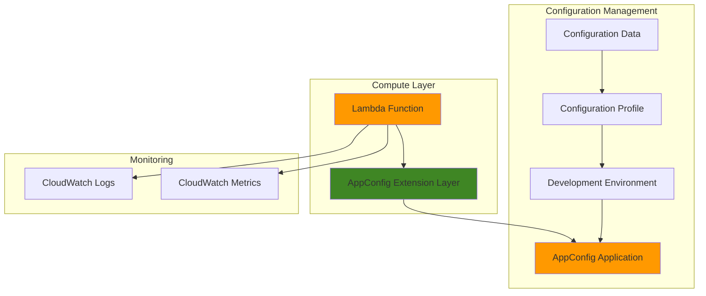

# Simple Application Configuration with AppConfig and Lambda

## Problem

Development teams often hard-code application settings directly into their code, making it difficult to change configurations without redeploying applications. This approach leads to longer deployment cycles, increased risk of errors, and inability to quickly respond to operational issues or enable feature flags for gradual rollouts.

## Solution

Create a dynamic configuration management system using AWS AppConfig to store and manage application settings, integrated with AWS Lambda to retrieve and use these configurations at runtime. This approach enables configuration changes without code deployments while providing built-in safety features like validation and rollback capabilities.

## Architecture Diagram



## Prerequisites

1. AWS account with appropriate permissions for AppConfig, Lambda, and IAM
2. AWS CLI installed and configured (or AWS CloudShell)
3. Basic understanding of serverless functions and configuration management
4. No existing resources required
5. Estimated cost: $0.01-$0.05 for testing (AppConfig requests + Lambda invocations)

> **Note**: AWS AppConfig follows a pay-per-request pricing model with no upfront costs, making it cost-effective for small applications.

## Preparation

```bash
# Set environment variables
export AWS_REGION=$(aws configure get region)
export AWS_ACCOUNT_ID=$(aws sts get-caller-identity \
    --query Account --output text)

# Generate unique identifiers for resources
RANDOM_SUFFIX=$(aws secretsmanager get-random-password \
    --exclude-punctuation --exclude-uppercase \
    --password-length 6 --require-each-included-type \
    --output text --query RandomPassword)

export APP_NAME="simple-config-app-${RANDOM_SUFFIX}"
export LAMBDA_FUNCTION_NAME="config-demo-${RANDOM_SUFFIX}"
export LAMBDA_ROLE_NAME="lambda-appconfig-role-${RANDOM_SUFFIX}"

echo "✅ AWS environment configured"
echo "Application Name: ${APP_NAME}"
echo "Lambda Function: ${LAMBDA_FUNCTION_NAME}"
```

## Steps

1. **Create IAM Role for Lambda Function**:

   AWS Lambda requires an execution role with specific permissions to interact with AppConfig services. This role will enable the Lambda function to retrieve configuration data while following the principle of least privilege for security.

   ```bash
   # Create trust policy for Lambda service
   cat > trust-policy.json << EOF
   {
     "Version": "2012-10-17",
     "Statement": [
       {
         "Effect": "Allow",
         "Principal": {
           "Service": "lambda.amazonaws.com"
         },
         "Action": "sts:AssumeRole"
       }
     ]
   }
   EOF
   
   # Create IAM role
   aws iam create-role \
       --role-name ${LAMBDA_ROLE_NAME} \
       --assume-role-policy-document file://trust-policy.json
   
   # Attach basic Lambda execution policy
   aws iam attach-role-policy \
       --role-name ${LAMBDA_ROLE_NAME} \
       --policy-arn arn:aws:iam::aws:policy/service-role/AWSLambdaBasicExecutionRole
   
   # Create custom policy for AppConfig access
   cat > appconfig-policy.json << EOF
   {
     "Version": "2012-10-17",
     "Statement": [
       {
         "Effect": "Allow",
         "Action": [
           "appconfig:StartConfigurationSession",
           "appconfig:GetLatestConfiguration"
         ],
         "Resource": "*"
       }
     ]
   }
   EOF
   
   # Create and attach AppConfig policy
   aws iam create-policy \
       --policy-name AppConfigLambdaPolicy-${RANDOM_SUFFIX} \
       --policy-document file://appconfig-policy.json
   
   aws iam attach-role-policy \
       --role-name ${LAMBDA_ROLE_NAME} \
       --policy-arn arn:aws:iam::${AWS_ACCOUNT_ID}:policy/AppConfigLambdaPolicy-${RANDOM_SUFFIX}
   
   # Get the role ARN for later use
   export LAMBDA_ROLE_ARN=$(aws iam get-role \
       --role-name ${LAMBDA_ROLE_NAME} \
       --query 'Role.Arn' --output text)
   
   # Wait for IAM role propagation
   sleep 10
   
   echo "✅ IAM role created: ${LAMBDA_ROLE_ARN}"
   ```

2. **Create AppConfig Application**:

   AWS AppConfig applications serve as logical containers for configuration data, providing organization and access control. Creating an application establishes the foundation for managing multiple environments and configuration profiles.

   ```bash
   # Create AppConfig application
   aws appconfig create-application \
       --name ${APP_NAME} \
       --description "Simple configuration management demo"
   
   # Get the application ID
   export APP_ID=$(aws appconfig list-applications \
       --query "Items[?Name=='${APP_NAME}'].Id" \
       --output text)
   
   echo "✅ AppConfig application created with ID: ${APP_ID}"
   ```

3. **Create Configuration Environment**:

   Environments in AppConfig represent logical deployment groups such as development, staging, or production. They provide isolation and control over configuration deployments to different application tiers.

   ```bash
   # Create development environment
   aws appconfig create-environment \
       --application-id ${APP_ID} \
       --name "development" \
       --description "Development environment for configuration testing"
   
   # Get the environment ID
   export ENV_ID=$(aws appconfig list-environments \
       --application-id ${APP_ID} \
       --query "Items[?Name=='development'].Id" \
       --output text)
   
   echo "✅ Development environment created with ID: ${ENV_ID}"
   ```

4. **Create Configuration Profile**:

   Configuration profiles define the structure and source of configuration data. This profile will hold our application settings as freeform configuration data that can be updated independently of code deployments.

   ```bash
   # Create configuration profile for freeform data
   aws appconfig create-configuration-profile \
       --application-id ${APP_ID} \
       --name "app-settings" \
       --description "Application settings configuration" \
       --location-uri "hosted"
   
   # Get the configuration profile ID
   export CONFIG_PROFILE_ID=$(aws appconfig list-configuration-profiles \
       --application-id ${APP_ID} \
       --query "Items[?Name=='app-settings'].Id" \
       --output text)
   
   echo "✅ Configuration profile created with ID: ${CONFIG_PROFILE_ID}"
   ```

5. **Create Initial Configuration Data**:

   Configuration data contains the actual application settings in JSON format. This hosted configuration approach stores the data directly in AppConfig, providing versioning and validation capabilities.

   ```bash
   # Create configuration data as JSON
   cat > config-data.json << EOF
   {
     "database": {
       "max_connections": 100,
       "timeout_seconds": 30,
       "retry_attempts": 3
     },
     "features": {
       "enable_logging": true,
       "enable_metrics": true,
       "debug_mode": false
     },
     "api": {
       "rate_limit": 1000,
       "cache_ttl": 300
     }
   }
   EOF
   
   # Create hosted configuration version
   aws appconfig create-hosted-configuration-version \
       --application-id ${APP_ID} \
       --configuration-profile-id ${CONFIG_PROFILE_ID} \
       --content-type "application/json" \
       --content fileb://config-data.json
   
   # Get the version number
   export CONFIG_VERSION=$(aws appconfig list-hosted-configuration-versions \
       --application-id ${APP_ID} \
       --configuration-profile-id ${CONFIG_PROFILE_ID} \
       --query "Items[0].VersionNumber" --output text)
   
   echo "✅ Configuration data created with version: ${CONFIG_VERSION}"
   ```

6. **Create Lambda Function**:

   The Lambda function will demonstrate how to retrieve and use configuration data from AppConfig. The function includes logic to handle configuration retrieval and respond to different configuration values.

   ```bash
   # Create Lambda function code
   cat > lambda_function.py << 'EOF'
   import json
   import urllib3
   import os
   
   def lambda_handler(event, context):
       # AppConfig extension endpoint (local to Lambda execution environment)
       appconfig_endpoint = 'http://localhost:2772'
       
       # AppConfig parameters from environment variables
       application_id = os.environ.get('APPCONFIG_APPLICATION_ID')
       environment_id = os.environ.get('APPCONFIG_ENVIRONMENT_ID')
       configuration_profile_id = os.environ.get('APPCONFIG_CONFIGURATION_PROFILE_ID')
       
       try:
           # Create HTTP connection to AppConfig extension
           http = urllib3.PoolManager()
           
           # Retrieve configuration from AppConfig
           config_url = f"{appconfig_endpoint}/applications/{application_id}/environments/{environment_id}/configurations/{configuration_profile_id}"
           response = http.request('GET', config_url)
           
           if response.status == 200:
               config_data = json.loads(response.data.decode('utf-8'))
               
               # Use configuration in application logic
               max_connections = config_data.get('database', {}).get('max_connections', 50)
               enable_logging = config_data.get('features', {}).get('enable_logging', False)
               rate_limit = config_data.get('api', {}).get('rate_limit', 500)
               
               # Log configuration usage if logging is enabled
               if enable_logging:
                   print(f"Configuration loaded - Max connections: {max_connections}, Rate limit: {rate_limit}")
               
               return {
                   'statusCode': 200,
                   'body': json.dumps({
                       'message': 'Configuration loaded successfully',
                       'config_summary': {
                           'database_max_connections': max_connections,
                           'logging_enabled': enable_logging,
                           'api_rate_limit': rate_limit
                       }
                   })
               }
           else:
               print(f"Failed to retrieve configuration: {response.status}")
               return {
                   'statusCode': 500,
                   'body': json.dumps({'error': 'Configuration retrieval failed'})
               }
               
       except Exception as e:
           print(f"Error: {str(e)}")
           return {
               'statusCode': 500,
               'body': json.dumps({'error': 'Internal server error'})
           }
   EOF
   
   # Create deployment package
   zip lambda-function.zip lambda_function.py
   
   # Create Lambda function with updated Python runtime
   aws lambda create-function \
       --function-name ${LAMBDA_FUNCTION_NAME} \
       --runtime python3.12 \
       --role ${LAMBDA_ROLE_ARN} \
       --handler lambda_function.lambda_handler \
       --zip-file fileb://lambda-function.zip \
       --timeout 30 \
       --environment Variables="{
           APPCONFIG_APPLICATION_ID=${APP_ID},
           APPCONFIG_ENVIRONMENT_ID=${ENV_ID},
           APPCONFIG_CONFIGURATION_PROFILE_ID=${CONFIG_PROFILE_ID}
       }"
   
   echo "✅ Lambda function created: ${LAMBDA_FUNCTION_NAME}"
   ```

7. **Add AppConfig Extension Layer**:

   The AppConfig Lambda extension layer provides a local HTTP endpoint for retrieving configuration data with built-in caching and performance optimization. This extension reduces latency and API calls while providing automatic configuration updates.

   ```bash
   # Add AppConfig extension layer (x86_64 architecture)
   # Use region-specific ARN - example shows us-east-1
   aws lambda update-function-configuration \
       --function-name ${LAMBDA_FUNCTION_NAME} \
       --layers arn:aws:lambda:${AWS_REGION}:027255383542:layer:AWS-AppConfig-Extension:207
   
   echo "✅ AppConfig extension layer added to Lambda function"
   ```

8. **Deploy Configuration**:

   Deploying configuration activates the settings and makes them available to applications. AppConfig's deployment strategy ensures safe rollouts with monitoring and automatic rollback capabilities.

   ```bash
   # Create deployment strategy for immediate deployment
   aws appconfig create-deployment-strategy \
       --name "immediate-deployment-${RANDOM_SUFFIX}" \
       --description "Immediate deployment for testing" \
       --deployment-duration-in-minutes 0 \
       --final-bake-time-in-minutes 0 \
       --growth-factor 100 \
       --growth-type LINEAR \
       --replicate-to NONE
   
   # Get deployment strategy ID
   export DEPLOYMENT_STRATEGY_ID=$(aws appconfig list-deployment-strategies \
       --query "Items[?Name=='immediate-deployment-${RANDOM_SUFFIX}'].Id" \
       --output text)
   
   # Start configuration deployment
   aws appconfig start-deployment \
       --application-id ${APP_ID} \
       --environment-id ${ENV_ID} \
       --deployment-strategy-id ${DEPLOYMENT_STRATEGY_ID} \
       --configuration-profile-id ${CONFIG_PROFILE_ID} \
       --configuration-version ${CONFIG_VERSION} \
       --description "Initial configuration deployment"
   
   # Wait for deployment to complete
   sleep 5
   
   echo "✅ Configuration deployed successfully"
   ```

## Validation & Testing

1. **Test Lambda Function with Configuration**:

   ```bash
   # Invoke Lambda function to test configuration retrieval
   aws lambda invoke \
       --function-name ${LAMBDA_FUNCTION_NAME} \
       --payload '{}' \
       response.json
   
   # Display function response
   cat response.json | jq '.'
   ```

   Expected output: JSON response showing configuration values loaded from AppConfig.

2. **Update Configuration and Test Dynamic Changes**:

   ```bash
   # Create updated configuration with different values
   cat > updated-config.json << EOF
   {
     "database": {
       "max_connections": 200,
       "timeout_seconds": 45,
       "retry_attempts": 5
     },
     "features": {
       "enable_logging": true,
       "enable_metrics": true,
       "debug_mode": true
     },
     "api": {
       "rate_limit": 2000,
       "cache_ttl": 600
     }
   }
   EOF
   
   # Create new configuration version
   aws appconfig create-hosted-configuration-version \
       --application-id ${APP_ID} \
       --configuration-profile-id ${CONFIG_PROFILE_ID} \
       --content-type "application/json" \
       --content fileb://updated-config.json
   
   # Get new version number
   NEW_VERSION=$(aws appconfig list-hosted-configuration-versions \
       --application-id ${APP_ID} \
       --configuration-profile-id ${CONFIG_PROFILE_ID} \
       --query "Items[0].VersionNumber" --output text)
   
   # Deploy updated configuration
   aws appconfig start-deployment \
       --application-id ${APP_ID} \
       --environment-id ${ENV_ID} \
       --deployment-strategy-id ${DEPLOYMENT_STRATEGY_ID} \
       --configuration-profile-id ${CONFIG_PROFILE_ID} \
       --configuration-version ${NEW_VERSION} \
       --description "Updated configuration deployment"
   
   # Wait for deployment to complete, then test
   sleep 10
   aws lambda invoke \
       --function-name ${LAMBDA_FUNCTION_NAME} \
       --payload '{}' \
       updated-response.json
   
   cat updated-response.json | jq '.'
   ```

3. **Verify CloudWatch Logs**:

   ```bash
   # Check Lambda function logs
   aws logs describe-log-groups \
       --log-group-name-prefix "/aws/lambda/${LAMBDA_FUNCTION_NAME}"
   
   # Get recent log events
   aws logs filter-log-events \
       --log-group-name "/aws/lambda/${LAMBDA_FUNCTION_NAME}" \
       --start-time $(date -d '5 minutes ago' +%s)000
   ```

## Cleanup

1. **Delete Lambda Function**:

   ```bash
   # Delete Lambda function
   aws lambda delete-function \
       --function-name ${LAMBDA_FUNCTION_NAME}
   
   echo "✅ Lambda function deleted"
   ```

2. **Delete AppConfig Resources**:

   ```bash
   # Delete deployment strategy
   aws appconfig delete-deployment-strategy \
       --deployment-strategy-id ${DEPLOYMENT_STRATEGY_ID}
   
   # Delete configuration profile
   aws appconfig delete-configuration-profile \
       --application-id ${APP_ID} \
       --configuration-profile-id ${CONFIG_PROFILE_ID}
   
   # Delete environment
   aws appconfig delete-environment \
       --application-id ${APP_ID} \
       --environment-id ${ENV_ID}
   
   # Delete application
   aws appconfig delete-application \
       --application-id ${APP_ID}
   
   echo "✅ AppConfig resources deleted"
   ```

3. **Remove IAM Resources**:

   ```bash
   # Detach policies from role
   aws iam detach-role-policy \
       --role-name ${LAMBDA_ROLE_NAME} \
       --policy-arn arn:aws:iam::aws:policy/service-role/AWSLambdaBasicExecutionRole
   
   aws iam detach-role-policy \
       --role-name ${LAMBDA_ROLE_NAME} \
       --policy-arn arn:aws:iam::${AWS_ACCOUNT_ID}:policy/AppConfigLambdaPolicy-${RANDOM_SUFFIX}
   
   # Delete custom policy
   aws iam delete-policy \
       --policy-arn arn:aws:iam::${AWS_ACCOUNT_ID}:policy/AppConfigLambdaPolicy-${RANDOM_SUFFIX}
   
   # Delete IAM role
   aws iam delete-role --role-name ${LAMBDA_ROLE_NAME}
   
   echo "✅ IAM resources cleaned up"
   ```

4. **Clean Up Local Files**:

   ```bash
   # Remove temporary files
   rm -f trust-policy.json appconfig-policy.json
   rm -f config-data.json updated-config.json
   rm -f lambda_function.py lambda-function.zip
   rm -f response.json updated-response.json
   
   echo "✅ Local files cleaned up"
   ```

## Discussion

AWS AppConfig provides a robust foundation for application configuration management that extends far beyond simple key-value storage. By separating configuration from code, applications gain the flexibility to adapt to changing requirements without requiring new deployments. The service's built-in safety features, including validators, deployment strategies, and automatic rollback capabilities, ensure that configuration changes don't introduce instability into production systems.

The integration with AWS Lambda through the extension layer demonstrates modern serverless architecture patterns where configuration becomes a first-class citizen in application design. The extension layer provides local caching and HTTP endpoint access, reducing latency and API calls while maintaining fresh configuration data. This approach aligns with the [Twelve-Factor App methodology](https://docs.aws.amazon.com/whitepapers/latest/microservices-on-aws/configuration-management.html), which emphasizes storing configuration in environment variables or external systems rather than in code.

AWS AppConfig's deployment strategies offer sophisticated control over how configuration changes roll out to production environments. Unlike simple configuration updates that take effect immediately, AppConfig can gradually deploy changes over time, monitor application health, and automatically roll back problematic configurations. This capability is particularly valuable for feature flags and operational tuning, where the impact of changes needs careful monitoring and control.

The service integrates seamlessly with AWS's broader ecosystem, including CloudWatch for monitoring, CloudTrail for auditing, and IAM for access control. This integration provides comprehensive governance and observability for configuration changes, meeting enterprise requirements for compliance and operational visibility. For more detailed guidance, see the [AWS AppConfig User Guide](https://docs.aws.amazon.com/appconfig/latest/userguide/what-is-appconfig.html) and [Lambda Extensions documentation](https://docs.aws.amazon.com/appconfig/latest/userguide/appconfig-integration-lambda-extensions.html).

> **Tip**: Consider implementing configuration versioning strategies and using deployment strategies with monitoring to safely roll out configuration changes in production environments.

## Challenge

Extend this solution by implementing these enhancements:

1. **Add Configuration Validation**: Implement JSON Schema validators to ensure configuration data meets specific requirements before deployment, preventing invalid configurations from reaching production environments.

2. **Implement Feature Flags**: Create boolean feature flags that can be toggled dynamically to enable or disable application features, allowing for A/B testing and gradual feature rollouts.

3. **Add Configuration Monitoring**: Set up CloudWatch alarms to monitor application health metrics and automatically trigger configuration rollbacks when error rates exceed thresholds.

4. **Create Multiple Environments**: Expand the setup to include staging and production environments with different configuration values, demonstrating environment-specific configuration management.

5. **Implement Configuration Caching**: Add local caching logic in the Lambda function to reduce AppConfig API calls and improve performance while maintaining configuration freshness.

## Infrastructure Code

*Infrastructure code will be generated after recipe approval.*