# Simple Color Palette Generator with Lambda and S3

## Problem

Web designers and developers frequently need inspiration for color schemes when creating websites, mobile apps, or digital products. Manually creating harmonious color palettes is time-consuming and requires design expertise that many developers lack. Existing color palette tools often require complex installations or subscriptions, creating barriers for quick design iteration and collaboration.

## Solution

Build a serverless color palette generator using AWS Lambda and S3 that creates random, aesthetically pleasing color combinations on demand. The Lambda function generates color palettes using proven color theory algorithms, stores them as JSON files in S3 for persistence, and provides instant access through a simple HTTP endpoint without requiring server management or complex infrastructure.

## Architecture Diagram

```mermaid
graph TB
    subgraph "User Layer"
        USER[Web Browser/Client]
    end
    
    subgraph "AWS Lambda"
        FUNC[Color Generator Function]
        URL[Function URL Endpoint]
    end
    
    subgraph "AWS S3"
        BUCKET[Palette Storage Bucket]
        PALETTES[JSON Palette Files]
    end
    
    subgraph "AWS IAM"
        ROLE[Lambda Execution Role]
    end
    
    USER-->URL
    URL-->FUNC
    FUNC-->BUCKET
    BUCKET-->PALETTES
    ROLE-->FUNC
    ROLE-->BUCKET
    
    style FUNC fill:#FF9900
    style BUCKET fill:#3F8624
    style URL fill:#232F3E
```



## Prerequisites

1. AWS account with permissions to create Lambda functions, S3 buckets, and IAM roles
2. AWS CLI installed and configured (version 2.0 or later)
3. Basic understanding of serverless computing concepts
4. Familiarity with JSON data structures
5. Estimated cost: $0.01-$0.05 per month for typical usage

> **Note**: This recipe uses AWS Free Tier eligible services. Lambda provides 1 million free requests per month, and S3 offers 5GB of free storage.

## Preparation

```bash
# Set environment variables
export AWS_REGION=$(aws configure get region)
export AWS_ACCOUNT_ID=$(aws sts get-caller-identity \
    --query Account --output text)

# Generate unique identifiers for resources
RANDOM_SUFFIX=$(aws secretsmanager get-random-password \
    --exclude-punctuation --exclude-uppercase \
    --password-length 6 --require-each-included-type \
    --output text --query RandomPassword)

# Set resource names
export BUCKET_NAME="color-palettes-${RANDOM_SUFFIX}"
export FUNCTION_NAME="palette-generator-${RANDOM_SUFFIX}"
export ROLE_NAME="palette-generator-role-${RANDOM_SUFFIX}"

echo "✅ AWS environment configured with suffix: ${RANDOM_SUFFIX}"
```

## Steps

1. **Create S3 Bucket for Palette Storage**:

   S3 provides highly durable object storage with 99.999999999% (11 9's) durability, making it perfect for storing generated color palettes. The bucket will serve as persistent storage for palette data while enabling easy retrieval and potential future analytics on color preferences.

   ```bash
   # Create S3 bucket for storing color palettes
   aws s3 mb s3://${BUCKET_NAME} --region ${AWS_REGION}
   
   # Enable versioning for palette history tracking
   aws s3api put-bucket-versioning \
       --bucket ${BUCKET_NAME} \
       --versioning-configuration Status=Enabled
   
   # Configure bucket encryption for data security
   aws s3api put-bucket-encryption \
       --bucket ${BUCKET_NAME} \
       --server-side-encryption-configuration \
       'Rules=[{ApplyServerSideEncryptionByDefault:{SSEAlgorithm:AES256}}]'
   
   echo "✅ S3 bucket ${BUCKET_NAME} created with security features"
   ```

   The bucket now provides a secure, scalable foundation for storing color palette data with built-in versioning and encryption to protect generated content.

2. **Create IAM Role for Lambda Function**:

   AWS Lambda requires an execution role that defines the permissions needed to interact with other AWS services. This role follows the principle of least privilege, granting only the minimum permissions required for S3 read/write operations and CloudWatch logging.

   ```bash
   # Create trust policy for Lambda service
   cat > trust-policy.json << 'EOF'
   {
     "Version": "2012-10-17",
     "Statement": [
       {
         "Effect": "Allow",
         "Principal": {
           "Service": "lambda.amazonaws.com"
         },
         "Action": "sts:AssumeRole"
       }
     ]
   }
   EOF
   
   # Create IAM role for Lambda function
   aws iam create-role \
       --role-name ${ROLE_NAME} \
       --assume-role-policy-document file://trust-policy.json
   
   # Attach basic Lambda execution policy
   aws iam attach-role-policy \
       --role-name ${ROLE_NAME} \
       --policy-arn arn:aws:iam::aws:policy/service-role/AWSLambdaBasicExecutionRole
   
   echo "✅ IAM role ${ROLE_NAME} created with Lambda permissions"
   ```

   This role enables the Lambda function to write logs to CloudWatch and interact with AWS services securely without hardcoded credentials.

3. **Create S3 Access Policy for Lambda**:

   Lambda needs specific permissions to read from and write to the S3 bucket. This custom policy grants only the necessary S3 operations while maintaining security through resource-specific permissions.

   ```bash
   # Create S3 access policy for the specific bucket
   cat > s3-policy.json << EOF
   {
     "Version": "2012-10-17",
     "Statement": [
       {
         "Effect": "Allow",
         "Action": [
           "s3:GetObject",
           "s3:PutObject",
           "s3:DeleteObject"
         ],
         "Resource": "arn:aws:s3:::${BUCKET_NAME}/*"
       },
       {
         "Effect": "Allow",
         "Action": [
           "s3:ListBucket"
         ],
         "Resource": "arn:aws:s3:::${BUCKET_NAME}"
       }
     ]
   }
   EOF
   
   # Create and attach the S3 policy
   aws iam create-policy \
       --policy-name ${ROLE_NAME}-s3-policy \
       --policy-document file://s3-policy.json
   
   aws iam attach-role-policy \
       --role-name ${ROLE_NAME} \
       --policy-arn arn:aws:iam::${AWS_ACCOUNT_ID}:policy/${ROLE_NAME}-s3-policy
   
   echo "✅ S3 access policy attached to Lambda role"
   ```

   The Lambda function can now securely store and retrieve color palette files from the designated S3 bucket.

4. **Create Lambda Function Code**:

   The color palette generator uses proven color theory algorithms to create harmonious color combinations. This implementation generates palettes using complementary, analogous, and triadic color schemes that are popular in modern web design trends.

   ```bash
   # Create the Lambda function code
   cat > lambda_function.py << 'EOF'
   import json
   import random
   import colorsys
   import boto3
   import os
   from datetime import datetime
   import uuid
   
   # Initialize S3 client
   s3_client = boto3.client('s3')
   
   def lambda_handler(event, context):
       # Get bucket name from environment variable
       bucket_name = os.environ.get('BUCKET_NAME')
       if not bucket_name:
           return {
               'statusCode': 500,
               'headers': {
                   'Content-Type': 'application/json',
                   'Access-Control-Allow-Origin': '*'
               },
               'body': json.dumps({'error': 'Bucket name not configured'})
           }
       
       try:
           # Generate color palette based on requested type
           query_params = event.get('queryStringParameters') or {}
           palette_type = query_params.get('type', 'complementary')
           palette = generate_color_palette(palette_type)
           
           # Store palette in S3
           palette_id = str(uuid.uuid4())[:8]
           s3_key = f"palettes/{palette_id}.json"
           
           palette_data = {
               'id': palette_id,
               'type': palette_type,
               'colors': palette,
               'created_at': datetime.utcnow().isoformat(),
               'hex_colors': [rgb_to_hex(color) for color in palette]
           }
           
           s3_client.put_object(
               Bucket=bucket_name,
               Key=s3_key,
               Body=json.dumps(palette_data, indent=2),
               ContentType='application/json'
           )
           
           return {
               'statusCode': 200,
               'headers': {
                   'Content-Type': 'application/json',
                   'Access-Control-Allow-Origin': '*',
                   'Access-Control-Allow-Methods': 'GET, POST, OPTIONS',
                   'Access-Control-Allow-Headers': 'Content-Type'
               },
               'body': json.dumps(palette_data)
           }
           
       except Exception as e:
           return {
               'statusCode': 500,
               'headers': {
                   'Content-Type': 'application/json',
                   'Access-Control-Allow-Origin': '*'
               },
               'body': json.dumps({'error': str(e)})
           }
   
   def generate_color_palette(palette_type):
       """Generate color palette based on color theory"""
       base_hue = random.uniform(0, 1)
       saturation = random.uniform(0.6, 0.9)
       lightness = random.uniform(0.4, 0.8)
       
       colors = []
       
       if palette_type == 'complementary':
           # Base color and its complement
           colors.append(hsv_to_rgb(base_hue, saturation, lightness))
           colors.append(hsv_to_rgb((base_hue + 0.5) % 1, saturation, lightness))
           colors.append(hsv_to_rgb(base_hue, saturation * 0.7, lightness * 1.2))
           colors.append(hsv_to_rgb((base_hue + 0.5) % 1, saturation * 0.7, lightness * 1.2))
           
       elif palette_type == 'analogous':
           # Colors adjacent on color wheel
           for i in range(5):
               hue = (base_hue + (i * 0.08)) % 1
               colors.append(hsv_to_rgb(hue, saturation, lightness))
               
       elif palette_type == 'triadic':
           # Three colors evenly spaced on color wheel
           for i in range(3):
               hue = (base_hue + (i * 0.333)) % 1
               colors.append(hsv_to_rgb(hue, saturation, lightness))
           # Add two supporting colors
           colors.append(hsv_to_rgb(base_hue, saturation * 0.5, min(lightness * 1.3, 1.0)))
           colors.append(hsv_to_rgb(base_hue, saturation * 0.3, lightness * 0.9))
           
       else:  # Random palette
           for i in range(5):
               hue = random.uniform(0, 1)
               sat = random.uniform(0.5, 0.9)
               light = random.uniform(0.3, 0.8)
               colors.append(hsv_to_rgb(hue, sat, light))
       
       return colors
   
   def hsv_to_rgb(h, s, v):
       """Convert HSV color to RGB"""
       r, g, b = colorsys.hsv_to_rgb(h, s, v)
       return [int(r * 255), int(g * 255), int(b * 255)]
   
   def rgb_to_hex(rgb):
       """Convert RGB to hex color code"""
       return f"#{rgb[0]:02x}{rgb[1]:02x}{rgb[2]:02x}"
   EOF
   
   # Create deployment package
   zip -r function.zip lambda_function.py
   
   echo "✅ Lambda function code created and packaged"
   ```

   This function implements multiple color harmony algorithms and stores each generated palette with metadata for future reference and analysis. The code now properly accesses environment variables and handles edge cases in color generation.

5. **Deploy Lambda Function**:

   AWS Lambda provides serverless compute that automatically scales based on demand. The function deployment includes environment variables for S3 bucket access and configures appropriate timeout and memory settings for color generation workloads.

   ```bash
   # Wait for IAM role to be fully propagated
   sleep 10
   
   # Create Lambda function with updated Python runtime
   aws lambda create-function \
       --function-name ${FUNCTION_NAME} \
       --runtime python3.12 \
       --role arn:aws:iam::${AWS_ACCOUNT_ID}:role/${ROLE_NAME} \
       --handler lambda_function.lambda_handler \
       --zip-file fileb://function.zip \
       --timeout 30 \
       --memory-size 256 \
       --environment Variables="{BUCKET_NAME=${BUCKET_NAME}}"
   
   echo "✅ Lambda function ${FUNCTION_NAME} deployed successfully"
   ```

   The function is now ready to generate color palettes on demand with automatic scaling and built-in monitoring through CloudWatch. The updated runtime uses Python 3.12 for better performance and longer support lifecycle.

6. **Create Function URL for HTTP Access**:

   Lambda Function URLs provide a simple way to create HTTP endpoints without API Gateway complexity. This approach is perfect for our beginner-level recipe while still providing CORS support and security controls through resource-based policies.

   ```bash
   # Create function URL for direct HTTP access
   FUNCTION_URL=$(aws lambda create-function-url-config \
       --function-name ${FUNCTION_NAME} \
       --auth-type NONE \
       --cors AllowCredentials=false,AllowMethods="GET,POST,OPTIONS",AllowOrigins="*",AllowHeaders="Content-Type" \
       --query FunctionUrl --output text)
   
   # Add resource-based policy for public access
   aws lambda add-permission \
       --function-name ${FUNCTION_NAME} \
       --statement-id AllowPublicAccess \
       --action lambda:InvokeFunctionUrl \
       --principal "*" \
       --function-url-auth-type NONE
   
   echo "✅ Function URL created: ${FUNCTION_URL}"
   ```

   The function is now accessible via a public HTTPS endpoint that supports cross-origin requests for web application integration.

7. **Test Color Palette Generation**:

   Testing ensures the serverless architecture works correctly and validates that color palettes are generated and stored properly. This step verifies both the Lambda function logic and S3 integration.

   ```bash
   # Test different palette types
   echo "Testing complementary palette..."
   curl -s "${FUNCTION_URL}?type=complementary" | jq '.'
   
   echo -e "\nTesting analogous palette..."
   curl -s "${FUNCTION_URL}?type=analogous" | jq '.'
   
   echo -e "\nTesting triadic palette..."
   curl -s "${FUNCTION_URL}?type=triadic" | jq '.'
   
   # Verify palettes are stored in S3
   echo -e "\nVerifying S3 storage..."
   aws s3 ls s3://${BUCKET_NAME}/palettes/ --human-readable
   
   echo "✅ Color palette generator tested successfully"
   ```

   The tests confirm that the serverless application generates diverse color palettes and stores them reliably in S3.

## Validation & Testing

1. **Verify Lambda Function Deployment**:

   ```bash
   # Check Lambda function status
   aws lambda get-function --function-name ${FUNCTION_NAME} \
       --query 'Configuration.[FunctionName,Runtime,State,LastModified]' \
       --output table
   ```

   Expected output: Function should show "Active" state with recent timestamp.

2. **Test All Palette Types**:

   ```bash
   # Test all available palette generation types
   for type in complementary analogous triadic random; do
       echo "Testing ${type} palette:"
       response=$(curl -s "${FUNCTION_URL}?type=${type}")
       echo $response | jq '.type, .hex_colors'
       echo "---"
   done
   ```

   Expected output: Each request should return a JSON response with different color combinations and hex codes.

3. **Validate S3 Storage Integration**:

   ```bash
   # Check that palettes are being stored
   aws s3api list-objects-v2 --bucket ${BUCKET_NAME} \
       --prefix palettes/ --query 'Contents[].Key' --output table
   
   # Download and inspect a stored palette
   SAMPLE_KEY=$(aws s3api list-objects-v2 --bucket ${BUCKET_NAME} \
       --prefix palettes/ --query 'Contents[0].Key' --output text)
   
   aws s3 cp s3://${BUCKET_NAME}/${SAMPLE_KEY} - | jq '.'
   ```

   Expected output: Multiple palette files should exist with complete JSON structure including colors and metadata.

## Cleanup

1. **Remove Lambda Function and Configuration**:

   ```bash
   # Delete function URL configuration
   aws lambda delete-function-url-config \
       --function-name ${FUNCTION_NAME}
   
   # Delete Lambda function
   aws lambda delete-function --function-name ${FUNCTION_NAME}
   
   echo "✅ Lambda function and URL deleted"
   ```

2. **Remove S3 Bucket and Contents**:

   ```bash
   # Delete all objects in bucket
   aws s3 rm s3://${BUCKET_NAME} --recursive
   
   # Delete the bucket
   aws s3 rb s3://${BUCKET_NAME}
   
   echo "✅ S3 bucket and contents deleted"
   ```

3. **Remove IAM Role and Policies**:

   ```bash
   # Detach policies from role
   aws iam detach-role-policy \
       --role-name ${ROLE_NAME} \
       --policy-arn arn:aws:iam::aws:policy/service-role/AWSLambdaBasicExecutionRole
   
   aws iam detach-role-policy \
       --role-name ${ROLE_NAME} \
       --policy-arn arn:aws:iam::${AWS_ACCOUNT_ID}:policy/${ROLE_NAME}-s3-policy
   
   # Delete custom policy
   aws iam delete-policy \
       --policy-arn arn:aws:iam::${AWS_ACCOUNT_ID}:policy/${ROLE_NAME}-s3-policy
   
   # Delete IAM role
   aws iam delete-role --role-name ${ROLE_NAME}
   
   # Clean up local files
   rm -f trust-policy.json s3-policy.json lambda_function.py function.zip
   
   echo "✅ IAM resources and local files cleaned up"
   ```

## Discussion

This serverless color palette generator demonstrates the power of AWS Lambda and S3 for building scalable, cost-effective applications without server management. The solution leverages proven color theory algorithms to generate aesthetically pleasing palettes that align with modern web design trends, including sustainable color choices, complex gradients, and accessible color combinations for inclusive design.

The architecture follows AWS Well-Architected Framework principles by implementing security best practices through IAM roles, encryption at rest, and resource-based policies. The serverless approach provides automatic scaling from zero to thousands of requests while maintaining cost efficiency through pay-per-use pricing. Lambda Function URLs offer a simpler alternative to API Gateway for basic HTTP endpoints, reducing complexity while still providing CORS support essential for web applications.

S3's 99.999999999% durability ensures generated palettes remain available for future reference, while versioning enables tracking of palette evolution over time. The combination of Lambda's millisecond billing and S3's storage classes creates an economical solution that scales with usage patterns. Performance optimization opportunities include implementing Lambda provisioned concurrency for consistent response times and using S3 Transfer Acceleration for global users.

The updated implementation uses Python 3.12 runtime for improved performance and longer support lifecycle, while proper environment variable handling ensures reliable bucket access. The color generation algorithms have been enhanced to prevent mathematical errors and produce more balanced color combinations suitable for professional design work.

> **Tip**: Consider implementing palette caching using ElastiCache or DynamoDB for frequently requested color combinations to reduce Lambda invocations and improve response times.

For more information, see the [AWS Lambda Best Practices Guide](https://docs.aws.amazon.com/lambda/latest/dg/best-practices.html), [S3 Security Best Practices](https://docs.aws.amazon.com/AmazonS3/latest/userguide/security-best-practices.html), [Lambda Function URLs Documentation](https://docs.aws.amazon.com/lambda/latest/dg/urls-configuration.html), [S3 Performance Optimization](https://docs.aws.amazon.com/AmazonS3/latest/userguide/optimizing-performance.html), and [AWS Well-Architected Serverless Applications](https://docs.aws.amazon.com/wellarchitected/latest/serverless-applications-lens/welcome.html).

## Challenge

Extend this solution by implementing these enhancements:

1. **Add palette validation and accessibility scoring** using WCAG color contrast ratios to ensure generated palettes meet accessibility standards for web applications.

2. **Implement user favorites and sharing features** by adding DynamoDB for user sessions and social sharing metadata with pre-signed S3 URLs for palette images.

3. **Create a web interface** using S3 static website hosting with JavaScript to consume the Lambda API and display palettes with real-time previews and download options.

4. **Add palette analytics and trending colors** using Amazon Athena to query S3 palette data and identify popular color combinations, seasonal trends, and usage patterns.

5. **Integrate AI-powered palette suggestions** using Amazon Bedrock to generate color palettes based on text descriptions, brand guidelines, or uploaded images for contextual color matching.

## Infrastructure Code

*Infrastructure code will be generated after recipe approval.*