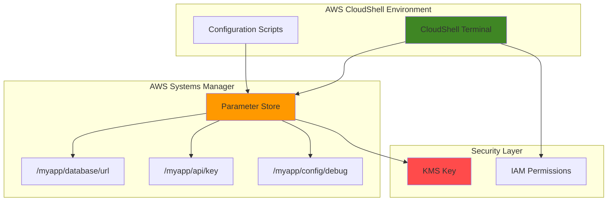

# Simple Configuration Management with Parameter Store and CloudShell

## Problem

Modern applications require centralized configuration management to store database connection strings, API keys, and environment-specific settings. Developers often struggle with hardcoded configuration values in application code, leading to security vulnerabilities, deployment complexity across environments, and difficulty maintaining consistent configurations as applications scale across development, staging, and production environments.

## Solution

AWS Systems Manager Parameter Store provides secure, hierarchical storage for configuration data that can be accessed programmatically through AWS CloudShell. This serverless approach enables centralized configuration management with built-in encryption, versioning, and IAM-based access controls, allowing teams to separate configuration data from application code while maintaining security and operational simplicity.

## Architecture Diagram



## Prerequisites

1. AWS account with Systems Manager and CloudShell access permissions
2. IAM permissions for Parameter Store operations (`ssm:PutParameter`, `ssm:GetParameter`, `ssm:GetParameters`, `ssm:GetParametersByPath`, `ssm:DescribeParameters`, `ssm:DeleteParameter`)
3. Basic familiarity with AWS CLI commands and shell scripting
4. Understanding of configuration management concepts
5. Estimated cost: Less than $1 for standard parameters (first 10,000 API calls are free monthly)

> **Note**: CloudShell provides 1 GB of persistent storage per AWS Region and comes with AWS CLI pre-configured using your console credentials.

## Preparation

```bash
# Set environment variables
export AWS_REGION=$(aws configure get region)
export AWS_ACCOUNT_ID=$(aws sts get-caller-identity \
    --query Account --output text)

# Generate unique identifiers for resources
RANDOM_SUFFIX=$(aws secretsmanager get-random-password \
    --exclude-punctuation --exclude-uppercase \
    --password-length 6 --require-each-included-type \
    --output text --query RandomPassword)

# Set application namespace for parameter organization
export APP_NAME="myapp-${RANDOM_SUFFIX}"
export PARAM_PREFIX="/${APP_NAME}"

echo "✅ Environment configured for Parameter Store demo"
echo "App namespace: ${APP_NAME}"
echo "Parameter prefix: ${PARAM_PREFIX}"
```

## Steps

1. **Create Standard Configuration Parameters**:

   Parameter Store supports different parameter types for various use cases. Standard parameters are ideal for non-sensitive configuration data like application settings, feature flags, and environment variables. These parameters are stored as plain text and are perfect for configuration values that don't require encryption.

   ```bash
   # Create database configuration parameter
   aws ssm put-parameter \
       --name "${PARAM_PREFIX}/database/url" \
       --value "postgresql://db.example.com:5432/myapp" \
       --type "String" \
       --description "Database connection URL for ${APP_NAME}"
   
   # Create environment configuration parameter
   aws ssm put-parameter \
       --name "${PARAM_PREFIX}/config/environment" \
       --value "development" \
       --type "String" \
       --description "Application environment setting"
   
   # Create feature flag parameter
   aws ssm put-parameter \
       --name "${PARAM_PREFIX}/features/debug-mode" \
       --value "true" \
       --type "String" \
       --description "Debug mode feature flag"
   
   echo "✅ Standard configuration parameters created"
   ```

   These parameters are now stored in Parameter Store's hierarchical structure, enabling organized access patterns and simplified parameter management across your application components.

2. **Create Secure String Parameters for Sensitive Data**:

   SecureString parameters provide encryption at rest using AWS KMS, making them ideal for sensitive configuration data like API keys, passwords, and tokens. AWS automatically encrypts these values using the default KMS key, ensuring sensitive data remains protected while still being easily accessible to authorized applications.

   ```bash
   # Create encrypted API key parameter
   aws ssm put-parameter \
       --name "${PARAM_PREFIX}/api/third-party-key" \
       --value "api-key-12345-secret-value" \
       --type "SecureString" \
       --description "Third-party API key for ${APP_NAME}" \
       --key-id "alias/aws/ssm"
   
   # Create encrypted database password
   aws ssm put-parameter \
       --name "${PARAM_PREFIX}/database/password" \
       --value "super-secure-password-123" \
       --type "SecureString" \
       --description "Database password for ${APP_NAME}"
   
   echo "✅ Secure string parameters created with KMS encryption"
   ```

   The SecureString parameters are now encrypted using AWS KMS, providing an additional layer of security for sensitive configuration data while maintaining programmatic access through IAM permissions.

3. **Create StringList Parameters for Multiple Values**:

   StringList parameters enable storage of comma-separated values within a single parameter, perfect for configuration lists like allowed origins, supported regions, or comma-delimited feature sets. This parameter type simplifies management of array-style configuration data.

   ```bash
   # Create allowed origins list for CORS configuration
   aws ssm put-parameter \
       --name "${PARAM_PREFIX}/api/allowed-origins" \
       --value "https://app.example.com,https://admin.example.com,https://mobile.example.com" \
       --type "StringList" \
       --description "CORS allowed origins for ${APP_NAME}"
   
   # Create supported regions list
   aws ssm put-parameter \
       --name "${PARAM_PREFIX}/deployment/regions" \
       --value "us-east-1,us-west-2,eu-west-1" \
       --type "StringList" \
       --description "Supported deployment regions"
   
   echo "✅ StringList parameters created for multi-value configuration"
   ```

   StringList parameters provide a clean way to store and retrieve multiple related values as a single configuration unit, reducing parameter sprawl and simplifying application configuration logic.

4. **Retrieve Individual Parameters**:

   Parameter retrieval is the core functionality for accessing configuration data in applications. The AWS CLI provides flexible options for retrieving parameters, including automatic decryption for SecureString parameters and formatted output for easy parsing in scripts and applications.

   ```bash
   # Retrieve standard parameter
   DB_URL=$(aws ssm get-parameter \
       --name "${PARAM_PREFIX}/database/url" \
       --query "Parameter.Value" \
       --output text)
   
   # Retrieve encrypted parameter with automatic decryption
   API_KEY=$(aws ssm get-parameter \
       --name "${PARAM_PREFIX}/api/third-party-key" \
       --with-decryption \
       --query "Parameter.Value" \
       --output text)
   
   # Retrieve StringList parameter
   ALLOWED_ORIGINS=$(aws ssm get-parameter \
       --name "${PARAM_PREFIX}/api/allowed-origins" \
       --query "Parameter.Value" \
       --output text)
   
   echo "✅ Retrieved individual parameters:"
   echo "Database URL: ${DB_URL}"
   echo "API Key: ${API_KEY:0:10}..." # Show only first 10 chars for security
   echo "Allowed Origins: ${ALLOWED_ORIGINS}"
   ```

   Individual parameter retrieval provides precise control over which configuration values are loaded, enabling applications to fetch only the parameters they need and reducing unnecessary API calls.

5. **Retrieve Multiple Parameters by Path**:

   Hierarchical parameter organization enables bulk retrieval using path-based queries. This approach is highly efficient for applications that need to load entire configuration sections, reducing API calls and simplifying configuration management logic in application startup routines.

   ```bash
   # Get all parameters for the application by path
   aws ssm get-parameters-by-path \
       --path "${PARAM_PREFIX}" \
       --recursive \
       --with-decryption \
       --output table
   
   # Store parameters in environment variables using proper parsing
   eval $(aws ssm get-parameters-by-path \
       --path "${PARAM_PREFIX}" \
       --recursive \
       --with-decryption \
       --query 'Parameters[].[Name,Value]' \
       --output text | \
       while read name value; do
           # Convert parameter name to environment variable format
           env_name=$(echo "${name}" | sed "s|${PARAM_PREFIX}/||" | \
               tr '/' '_' | tr '[:lower:]' '[:upper:]')
           echo "export ${env_name}='${value}'"
       done)
   
   echo "✅ Retrieved all application parameters by path"
   echo "Parameters loaded as environment variables"
   ```

   Path-based retrieval demonstrates the power of Parameter Store's hierarchical organization, enabling efficient bulk operations that scale with application complexity while maintaining clean separation of configuration concerns.

6. **Create a Configuration Management Script**:

   Automation scripts enable standardized configuration management workflows. This script demonstrates how to create reusable configuration management patterns that can be integrated into deployment pipelines, infrastructure automation, and operational procedures.

   ```bash
   # Create configuration management script
   cat > config-manager.sh << 'EOF'
#!/bin/bash

PARAM_PREFIX="${1:-/myapp-default}"
ACTION="${2:-get}"

case $ACTION in
    "get")
        echo "=== Configuration for ${PARAM_PREFIX} ==="
        aws ssm get-parameters-by-path \
            --path "${PARAM_PREFIX}" \
            --recursive \
            --with-decryption \
            --query 'Parameters[].[Name,Value,Type]' \
            --output table
        ;;
    "backup")
        echo "=== Backing up configuration for ${PARAM_PREFIX} ==="
        aws ssm get-parameters-by-path \
            --path "${PARAM_PREFIX}" \
            --recursive \
            --with-decryption \
            --output json > "config-backup-$(date +%Y%m%d-%H%M%S).json"
        echo "Configuration backed up successfully"
        ;;
    "count")
        COUNT=$(aws ssm get-parameters-by-path \
            --path "${PARAM_PREFIX}" \
            --recursive \
            --query 'length(Parameters)' \
            --output text)
        echo "Total parameters under ${PARAM_PREFIX}: ${COUNT}"
        ;;
    *)
        echo "Usage: $0 <param-prefix> [get|backup|count]"
        exit 1
        ;;
esac
EOF

   chmod +x config-manager.sh
   
   echo "✅ Configuration management script created"
   ```

   This script provides a foundation for configuration management automation, demonstrating how Parameter Store can be integrated into broader operational workflows and deployment processes.

7. **Demonstrate Script Functionality**:

   Testing the configuration management script validates the operational patterns and demonstrates real-world usage scenarios. This step shows how Parameter Store integrates into daily operations and automated workflows.

   ```bash
   # Test the configuration script with different operations
   echo "=== Testing configuration retrieval ==="
   ./config-manager.sh "${PARAM_PREFIX}" get
   
   echo "=== Testing parameter count ==="
   ./config-manager.sh "${PARAM_PREFIX}" count
   
   echo "=== Testing configuration backup ==="
   ./config-manager.sh "${PARAM_PREFIX}" backup
   
   # List created backup files
   ls -la config-backup-*.json 2>/dev/null || echo "No backup files found"
   
   echo "✅ Configuration management script tested successfully"
   ```

   The script testing demonstrates practical configuration management patterns that can be adapted for production use, showing how Parameter Store supports both interactive and automated operational workflows.

## Validation & Testing

1. **Verify Parameter Creation and Retrieval**:

   ```bash
   # Check all created parameters
   echo "=== Verifying all parameters exist ==="
   aws ssm describe-parameters \
       --parameter-filters "Key=Name,Option=BeginsWith,Values=${PARAM_PREFIX}" \
       --query 'Parameters[].[Name,Type,Description]' \
       --output table
   ```

   Expected output: Table showing all created parameters with their types and descriptions.

2. **Test Parameter Encryption Status**:

   ```bash
   # Verify SecureString parameters are encrypted
   echo "=== Testing encrypted parameter access ==="
   
   # This should fail without --with-decryption flag
   aws ssm get-parameter \
       --name "${PARAM_PREFIX}/api/third-party-key" \
       --query "Parameter.Value" \
       --output text 2>&1 || echo "✅ Encryption working - decryption required"
   
   # This should show decrypted value
   aws ssm get-parameter \
       --name "${PARAM_PREFIX}/api/third-party-key" \
       --with-decryption \
       --query "Parameter.Value" \
       --output text
   ```

3. **Test Configuration Script Operations**:

   ```bash
   # Test script with invalid action
   ./config-manager.sh "${PARAM_PREFIX}" invalid 2>&1 | \
       grep -q "Usage:" && echo "✅ Script error handling works"
   
   # Verify backup file was created
   [ -f config-backup-*.json ] && echo "✅ Backup functionality works" || \
       echo "❌ Backup file not found"
   ```

## Cleanup

1. **Remove All Created Parameters**:

   ```bash
   # Get list of all parameters to delete
   PARAMS_TO_DELETE=$(aws ssm describe-parameters \
       --parameter-filters "Key=Name,Option=BeginsWith,Values=${PARAM_PREFIX}" \
       --query 'Parameters[].Name' \
       --output text)
   
   # Delete parameters one by one
   for param in $PARAMS_TO_DELETE; do
       aws ssm delete-parameter --name "$param"
       echo "Deleted parameter: $param"
   done
   
   echo "✅ All parameters deleted"
   ```

2. **Remove Created Files**:

   ```bash
   # Clean up configuration script and backup files
   rm -f config-manager.sh
   rm -f config-backup-*.json
   
   # Clear environment variables
   unset APP_NAME PARAM_PREFIX RANDOM_SUFFIX
   
   echo "✅ Local files and environment variables cleaned up"
   ```

## Discussion

AWS Systems Manager Parameter Store provides a robust foundation for centralized configuration management that addresses common challenges in modern application deployment. The hierarchical structure enables logical organization of configuration data, supporting both environment-specific and application-specific parameter organization patterns. This approach follows the [AWS Well-Architected Framework's Security pillar](https://docs.aws.amazon.com/wellarchitected/latest/security-pillar/welcome.html) by separating configuration data from application code and implementing fine-grained access controls through IAM policies.

The integration with AWS CloudShell demonstrates the operational simplicity of Parameter Store access. CloudShell's pre-authenticated environment eliminates credential management complexity while providing a consistent interface for configuration operations. The automatic credential handling and persistent storage capabilities make CloudShell ideal for configuration management workflows, enabling teams to build reliable operational procedures without managing local tool installations or credential configurations.

Parameter Store's encryption capabilities using AWS KMS provide enterprise-grade security for sensitive configuration data. SecureString parameters automatically encrypt data at rest while maintaining programmatic access through standard AWS APIs. This encryption model scales across applications and environments without requiring custom encryption implementations or key management procedures. The automatic decryption capabilities ensure that applications can retrieve sensitive configuration data securely without exposing sensitive values in logs or error messages.

The cost model of Parameter Store, with its generous free tier of 10,000 API requests per month, makes it accessible for organizations of all sizes. [Advanced parameters](https://docs.aws.amazon.com/systems-manager/latest/userguide/parameter-store-advanced-parameters.html) support higher throughput requirements and additional features like parameter policies, while standard parameters meet most configuration management needs at minimal cost. This pricing structure encourages adoption of centralized configuration management practices without creating budget constraints for development teams.

> **Tip**: Use Parameter Store parameter policies to implement automatic rotation schedules and access notifications for sensitive configuration data. See the [Parameter Store Advanced Parameters documentation](https://docs.aws.amazon.com/systems-manager/latest/userguide/parameter-store-advanced-parameters.html) for policy configuration guidance.

## Challenge

1. **Implement Environment-Specific Configuration**: Create separate parameter hierarchies for development, staging, and production environments using path prefixes like `/dev/myapp/`, `/staging/myapp/`, and `/prod/myapp/`. Configure IAM policies to restrict developers to non-production parameters.

2. **Add Parameter Versioning and Rollback**: Modify the configuration script to support parameter versioning using the `--overwrite` flag and implement a rollback mechanism that can restore previous parameter versions using the `get-parameter-history` command.

3. **Create Configuration Validation**: Implement parameter validation by adding custom parameter policies that enforce value formats, allowed values, or required parameters. Use Systems Manager compliance rules to monitor parameter compliance across environments.

4. **Build Application Integration**: Create a Python or Node.js application that loads configuration from Parameter Store on startup, implements caching with TTL, and handles parameter change notifications using Amazon EventBridge integration.

5. **Implement Cross-Account Parameter Sharing**: Configure cross-account parameter access using resource-based policies and IAM roles, enabling centralized configuration management across multiple AWS accounts while maintaining security boundaries.

## Infrastructure Code

*Infrastructure code will be generated after recipe approval.*