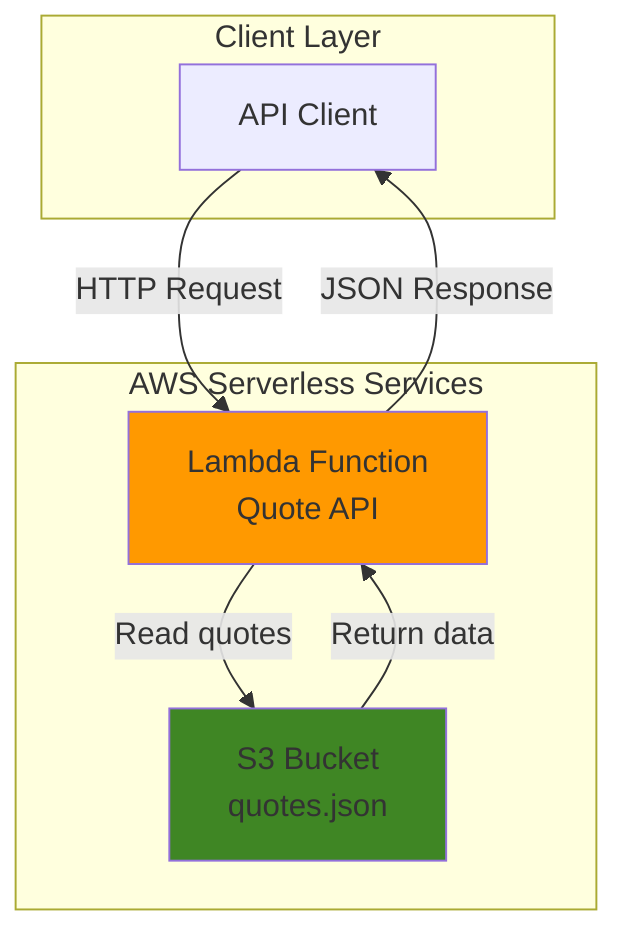

# Simple Daily Quote Generator with Lambda and S3

## Problem

Many applications need a simple way to provide inspirational content to users, but setting up traditional servers for a basic quote API creates unnecessary complexity and cost. Developers learning serverless architecture need a straightforward example that demonstrates core AWS services without overwhelming complexity, while businesses want cost-effective solutions that scale automatically.

## Solution

Build a serverless API using AWS Lambda to serve random inspirational quotes stored in Amazon S3. This solution leverages S3's high durability for data storage and Lambda's event-driven compute model to create a cost-effective, automatically scaling API that only charges for actual usage.

## Architecture Diagram



## Prerequisites

1. AWS account with Lambda and S3 permissions
2. AWS CLI installed and configured (v2.0 or later)
3. Basic understanding of JSON format and REST APIs
4. Text editor for creating function code
5. Estimated cost: $0.01-$0.05 per month for typical usage

> **Note**: This tutorial uses AWS Free Tier eligible services. Lambda provides 1 million free requests per month, and S3 provides 5GB of free storage.

## Preparation

```bash
# Set environment variables
export AWS_REGION=$(aws configure get region)
export AWS_ACCOUNT_ID=$(aws sts get-caller-identity \
    --query Account --output text)

# Generate unique identifiers for resources
RANDOM_SUFFIX=$(aws secretsmanager get-random-password \
    --exclude-punctuation --exclude-uppercase \
    --password-length 6 --require-each-included-type \
    --output text --query RandomPassword)

# Set resource names
export BUCKET_NAME="daily-quotes-${RANDOM_SUFFIX}"
export FUNCTION_NAME="daily-quote-generator"
export ROLE_NAME="lambda-s3-role-${RANDOM_SUFFIX}"

echo "✅ AWS environment configured"
echo "Bucket: ${BUCKET_NAME}"
echo "Function: ${FUNCTION_NAME}"
```

## Steps

1. **Create S3 Bucket for Quote Storage**:

   Amazon S3 provides highly durable object storage with 99.999999999% (11 9's) durability, making it perfect for storing our quote data. We'll create a bucket with server-side encryption to ensure our inspirational quotes are stored securely and can be accessed reliably by our Lambda function.

   ```bash
   # Create S3 bucket
   aws s3 mb s3://${BUCKET_NAME} --region ${AWS_REGION}
   
   # Enable server-side encryption
   aws s3api put-bucket-encryption \
       --bucket ${BUCKET_NAME} \
       --server-side-encryption-configuration \
       'Rules=[{ApplyServerSideEncryptionByDefault:{SSEAlgorithm:AES256}}]'
   
   echo "✅ S3 bucket created: ${BUCKET_NAME}"
   ```

2. **Upload Quote Data to S3**:

   We'll create a JSON file containing inspirational quotes and upload it to our S3 bucket. This demonstrates how S3 can serve as a simple database for static data that doesn't require complex querying capabilities.

   ```bash
   # Create quotes JSON file
   cat > quotes.json << 'EOF'
   {
     "quotes": [
       {
         "text": "The only way to do great work is to love what you do.",
         "author": "Steve Jobs"
       },
       {
         "text": "Innovation distinguishes between a leader and a follower.",
         "author": "Steve Jobs"
       },
       {
         "text": "Life is what happens to you while you're busy making other plans.",
         "author": "John Lennon"
       },
       {
         "text": "The future belongs to those who believe in the beauty of their dreams.",
         "author": "Eleanor Roosevelt"
       },
       {
         "text": "It is during our darkest moments that we must focus to see the light.",
         "author": "Aristotle"
       },
       {
         "text": "Success is not final, failure is not fatal: it is the courage to continue that counts.",
         "author": "Winston Churchill"
       }
     ]
   }
   EOF
   
   # Upload quotes to S3
   aws s3 cp quotes.json s3://${BUCKET_NAME}/quotes.json
   
   echo "✅ Quote data uploaded to S3"
   ```

3. **Create IAM Role for Lambda Function**:

   Following the AWS Well-Architected Framework's security pillar, we'll create an IAM role with minimal permissions needed for our Lambda function to read from S3. This implements the principle of least privilege for enhanced security.

   ```bash
   # Create trust policy for Lambda
   cat > trust-policy.json << 'EOF'
   {
     "Version": "2012-10-17",
     "Statement": [
       {
         "Effect": "Allow",
         "Principal": {
           "Service": "lambda.amazonaws.com"
         },
         "Action": "sts:AssumeRole"
       }
     ]
   }
   EOF
   
   # Create IAM role
   aws iam create-role \
       --role-name ${ROLE_NAME} \
       --assume-role-policy-document file://trust-policy.json
   
   # Attach basic Lambda execution policy
   aws iam attach-role-policy \
       --role-name ${ROLE_NAME} \
       --policy-arn arn:aws:iam::aws:policy/service-role/AWSLambdaBasicExecutionRole
   
   # Create S3 read policy
   cat > s3-policy.json << EOF
   {
     "Version": "2012-10-17",
     "Statement": [
       {
         "Effect": "Allow",
         "Action": [
           "s3:GetObject"
         ],
         "Resource": "arn:aws:s3:::${BUCKET_NAME}/*"
       }
     ]
   }
   EOF
   
   # Create and attach S3 policy
   aws iam put-role-policy \
       --role-name ${ROLE_NAME} \
       --policy-name S3ReadPolicy \
       --policy-document file://s3-policy.json
   
   echo "✅ IAM role created with S3 read permissions"
   ```

4. **Create Lambda Function Code**:

   Our Lambda function will implement a simple API that reads the quotes from S3, selects a random quote, and returns it as a JSON response. This demonstrates the event-driven serverless pattern where functions execute only when triggered.

   ```bash
   # Create Lambda function code
   cat > lambda_function.py << 'EOF'
   import json
   import boto3
   import random
   import os
   
   def lambda_handler(event, context):
       # Initialize S3 client
       s3 = boto3.client('s3')
       bucket_name = os.environ['BUCKET_NAME']
       
       try:
           # Get quotes from S3
           response = s3.get_object(Bucket=bucket_name, Key='quotes.json')
           quotes_data = json.loads(response['Body'].read().decode('utf-8'))
           
           # Select random quote
           random_quote = random.choice(quotes_data['quotes'])
           
           # Return response
           return {
               'statusCode': 200,
               'headers': {
                   'Content-Type': 'application/json',
                   'Access-Control-Allow-Origin': '*'
               },
               'body': json.dumps({
                   'quote': random_quote['text'],
                   'author': random_quote['author'],
                   'timestamp': context.aws_request_id
               })
           }
           
       except Exception as e:
           return {
               'statusCode': 500,
               'headers': {
                   'Content-Type': 'application/json'
               },
               'body': json.dumps({
                   'error': 'Failed to retrieve quote',
                   'message': str(e)
               })
           }
   EOF
   
   # Create deployment package
   zip function.zip lambda_function.py
   
   echo "✅ Lambda function code created and packaged"
   ```

5. **Deploy Lambda Function**:

   AWS Lambda provides serverless compute that automatically scales from zero to thousands of concurrent executions based on demand. We'll deploy our function with environment variables and appropriate resource allocation for optimal performance and cost efficiency.

   ```bash
   # Get IAM role ARN (wait for role propagation)
   sleep 10
   ROLE_ARN=$(aws iam get-role --role-name ${ROLE_NAME} \
       --query 'Role.Arn' --output text)
   
   # Create Lambda function
   aws lambda create-function \
       --function-name ${FUNCTION_NAME} \
       --runtime python3.12 \
       --role ${ROLE_ARN} \
       --handler lambda_function.lambda_handler \
       --zip-file fileb://function.zip \
       --timeout 30 \
       --memory-size 128 \
       --environment Variables="{BUCKET_NAME=${BUCKET_NAME}}"
   
   echo "✅ Lambda function deployed: ${FUNCTION_NAME}"
   ```

6. **Create Function URL for Direct Access**:

   Lambda Function URLs provide a dedicated HTTPS endpoint for your Lambda function, eliminating the need for API Gateway in simple scenarios. This feature enables direct HTTP(S) access to your function with built-in authentication and CORS support.

   ```bash
   # Create function URL
   aws lambda create-function-url-config \
       --function-name ${FUNCTION_NAME} \
       --auth-type NONE \
       --cors 'AllowCredentials=false,AllowHeaders=["*"],AllowMethods=["GET"],AllowOrigins=["*"],MaxAge=86400'
   
   # Get the function URL
   FUNCTION_URL=$(aws lambda get-function-url-config \
       --function-name ${FUNCTION_NAME} \
       --query 'FunctionUrl' --output text)
   
   echo "✅ Function URL created: ${FUNCTION_URL}"
   ```

## Validation & Testing

1. **Verify S3 bucket contains quote data**:

   ```bash
   # Check bucket contents
   aws s3 ls s3://${BUCKET_NAME}
   
   # Verify quotes.json content
   aws s3 cp s3://${BUCKET_NAME}/quotes.json - | head -10
   ```

   Expected output: Should show `quotes.json` file (approximately 1KB) and display JSON content starting with `{"quotes": [{"text": "The only way to do great work...`

2. **Test Lambda function directly**:

   ```bash
   # Invoke function directly
   aws lambda invoke \
       --function-name ${FUNCTION_NAME} \
       --payload '{}' \
       response.json
   
   # Display response
   cat response.json
   ```

   Expected output: JSON response with `statusCode: 200` and body containing `quote`, `author`, and `timestamp` fields, similar to:
   ```json
   {
     "statusCode": 200,
     "headers": {...},
     "body": "{\"quote\":\"The only way to do great work...\",\"author\":\"Steve Jobs\",\"timestamp\":\"...\"}" 
   }
   ```

3. **Test via Function URL**:

   ```bash
   # Test HTTP endpoint
   curl -s ${FUNCTION_URL} | jq '.'
   
   # Test multiple calls to verify randomness
   for i in {1..3}; do
     echo "Request $i:"
     curl -s ${FUNCTION_URL} | jq '.quote'
     echo
   done
   ```

   Expected output: Different quotes returned on each request, formatted as clean JSON with `quote`, `author`, and `timestamp` fields. The quotes should vary across multiple requests demonstrating the randomization functionality.

## Cleanup

1. **Delete Lambda function and related resources**:

   ```bash
   # Delete function URL configuration
   aws lambda delete-function-url-config \
       --function-name ${FUNCTION_NAME}
   
   # Delete Lambda function
   aws lambda delete-function --function-name ${FUNCTION_NAME}
   
   echo "✅ Lambda function deleted"
   ```

2. **Remove IAM role and policies**:

   ```bash
   # Detach managed policy
   aws iam detach-role-policy \
       --role-name ${ROLE_NAME} \
       --policy-arn arn:aws:iam::aws:policy/service-role/AWSLambdaBasicExecutionRole
   
   # Delete inline policy
   aws iam delete-role-policy \
       --role-name ${ROLE_NAME} \
       --policy-name S3ReadPolicy
   
   # Delete IAM role
   aws iam delete-role --role-name ${ROLE_NAME}
   
   echo "✅ IAM role and policies deleted"
   ```

3. **Remove S3 bucket and contents**:

   ```bash
   # Delete all objects in bucket
   aws s3 rm s3://${BUCKET_NAME} --recursive
   
   # Delete bucket
   aws s3 rb s3://${BUCKET_NAME}
   
   echo "✅ S3 bucket deleted"
   ```

4. **Clean up local files**:

   ```bash
   # Remove temporary files
   rm -f quotes.json lambda_function.py function.zip
   rm -f trust-policy.json s3-policy.json response.json
   
   echo "✅ Local files cleaned up"
   ```

## Discussion

This serverless architecture demonstrates the power of AWS Lambda and S3 for building cost-effective, scalable APIs. The solution follows the AWS Well-Architected Framework's serverless principles by leveraging managed services that automatically handle scaling, availability, and security. Lambda's event-driven model means you only pay for actual usage, making this solution extremely cost-effective for applications with variable or unpredictable traffic patterns.

The architecture showcases key serverless benefits including automatic scaling from zero to thousands of concurrent executions, built-in high availability across multiple AWS Availability Zones, and no server management overhead. S3 provides 99.999999999% durability for your quote data while supporting unlimited storage capacity. The combination creates a resilient system that can handle traffic spikes without pre-provisioning resources.

Security is implemented through IAM roles following the principle of least privilege, where the Lambda function can only read from the specific S3 bucket containing quote data. The Function URL feature provides HTTPS endpoints with built-in security and CORS configuration, eliminating the complexity of API Gateway for simple use cases. This approach aligns with AWS security best practices documented in the [AWS Well-Architected Security Pillar](https://docs.aws.amazon.com/wellarchitected/latest/security-pillar/welcome.html).

For production deployments, consider implementing additional monitoring with AWS CloudWatch to track function performance, error rates, and costs. The [AWS Lambda Developer Guide](https://docs.aws.amazon.com/lambda/latest/dg/) provides comprehensive guidance on optimizing function performance, while the [Amazon S3 User Guide](https://docs.aws.amazon.com/AmazonS3/latest/userguide/) covers advanced storage features like lifecycle policies for cost optimization.

> **Tip**: Use AWS X-Ray for distributed tracing to monitor API performance and identify bottlenecks across your serverless architecture. Enable X-Ray tracing in your Lambda function configuration to gain detailed insights into execution patterns and dependencies.

> **Note**: We use Python 3.12 runtime as it provides improved performance and security over older versions, while being well-supported until October 2028. Python 3.9 approaches deprecation in December 2025, making 3.12 a better long-term choice.

## Challenge

Extend this solution by implementing these enhancements:

1. **Add Quote Categories**: Modify the JSON structure to include categories (motivational, tech, business) and update the Lambda function to accept a category parameter for filtered quote selection.

2. **Implement Caching**: Use Amazon ElastiCache or DynamoDB to cache frequently requested quotes and reduce S3 API calls, improving response times and reducing costs.

3. **Add User Favorites**: Create a DynamoDB table to store user favorite quotes and add endpoints for saving/retrieving personalized quote collections using API Gateway for user authentication.

4. **Build a Web Interface**: Create a simple HTML/CSS/JavaScript frontend hosted on S3 with CloudFront distribution to provide a user-friendly interface for quote consumption.

5. **Add Analytics and Monitoring**: Implement CloudWatch custom metrics to track quote requests by category, set up alarms for error rates, and create a CloudWatch dashboard for operational visibility.

## Infrastructure Code

*Infrastructure code will be generated after recipe approval.*