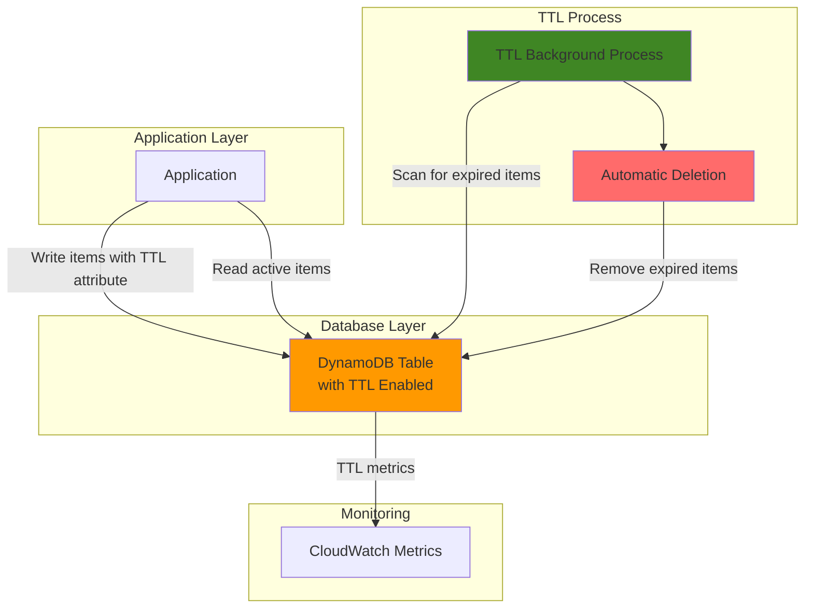

# Data Expiration Automation with DynamoDB TTL

## Problem

Organizations often accumulate vast amounts of time-sensitive data in their databases that becomes less valuable over time, such as session data, temporary user preferences, or cache entries. Manually managing data retention policies creates operational overhead and can lead to storage bloat that increases costs and impacts query performance. Without automated cleanup mechanisms, databases grow indefinitely, leading to unnecessary storage expenses and degraded application performance.

## Solution

DynamoDB's Time-To-Live (TTL) feature provides an automated, cost-effective solution for data lifecycle management by allowing you to define expiration timestamps for individual items. The service automatically deletes expired items without consuming write capacity units, reducing both storage costs and operational overhead while maintaining optimal database performance through automated cleanup processes.

## Architecture Diagram



## Prerequisites

1. AWS account with DynamoDB permissions to create tables and enable TTL
2. AWS CLI installed and configured (version 2.0+) or AWS CloudShell access
3. Basic understanding of DynamoDB data modeling and Unix epoch time format
4. IAM permissions for `dynamodb:CreateTable`, `dynamodb:UpdateTimeToLive`, `dynamodb:PutItem`, `dynamodb:Scan`, `dynamodb:DescribeTimeToLive`
5. Estimated cost: $0.25 per month for testing (on-demand pricing for small workloads)

> **Note**: TTL deletions do not consume write capacity units, making this a cost-effective solution for data lifecycle management.

## Preparation

```bash
# Set environment variables
export AWS_REGION=$(aws configure get region)
export AWS_ACCOUNT_ID=$(aws sts get-caller-identity \
    --query Account --output text)

# Generate unique identifiers for resources
RANDOM_SUFFIX=$(aws secretsmanager get-random-password \
    --exclude-punctuation --exclude-uppercase \
    --password-length 6 --require-each-included-type \
    --output text --query RandomPassword)

# Set table name and TTL attribute name
export TABLE_NAME="session-data-${RANDOM_SUFFIX}"
export TTL_ATTRIBUTE="expires_at"

echo "✅ AWS environment configured for DynamoDB TTL setup"
echo "Table Name: ${TABLE_NAME}"
echo "TTL Attribute: ${TTL_ATTRIBUTE}"
```

## Steps

1. **Create DynamoDB Table for Session Data**:

   DynamoDB provides a fully managed NoSQL database service that scales automatically based on your application's needs. Creating a table with appropriate partition and sort keys establishes the foundation for storing time-sensitive data that will benefit from automated expiration. The on-demand billing mode ensures cost efficiency for variable workloads while providing consistent performance.

   ```bash
   # Create DynamoDB table for session management
   aws dynamodb create-table \
       --table-name ${TABLE_NAME} \
       --attribute-definitions \
           AttributeName=user_id,AttributeType=S \
           AttributeName=session_id,AttributeType=S \
       --key-schema \
           AttributeName=user_id,KeyType=HASH \
           AttributeName=session_id,KeyType=RANGE \
       --billing-mode ON_DEMAND \
       --region ${AWS_REGION}
   
   # Wait for table to become active
   aws dynamodb wait table-exists --table-name ${TABLE_NAME}
   
   echo "✅ DynamoDB table ${TABLE_NAME} created successfully"
   ```

   The table is now ready with a composite primary key structure that supports efficient querying by user and session. This design pattern enables applications to store multiple sessions per user while maintaining fast access patterns for authentication and authorization workflows.

2. **Enable TTL on the DynamoDB Table**:

   Enabling TTL transforms your DynamoDB table into a self-managing data store that automatically handles cleanup operations. The TTL feature operates as a background process that continuously scans for expired items and removes them without impacting your application's read or write performance. This serverless approach to data lifecycle management eliminates the need for manual cleanup scripts or scheduled batch jobs.

   ```bash
   # Enable TTL on the table with specified attribute
   aws dynamodb update-time-to-live \
       --table-name ${TABLE_NAME} \
       --time-to-live-specification \
           Enabled=true,AttributeName=${TTL_ATTRIBUTE}
   
   # Verify TTL configuration
   aws dynamodb describe-time-to-live \
       --table-name ${TABLE_NAME}
   
   echo "✅ TTL enabled on ${TABLE_NAME} using attribute ${TTL_ATTRIBUTE}"
   ```

   TTL is now active and will automatically delete items where the `expires_at` attribute contains a Unix timestamp representing a past date. The background deletion process typically removes expired items within 48 hours, providing predictable data lifecycle management without consuming provisioned capacity.

3. **Insert Sample Items with TTL Values**:

   Creating items with appropriate TTL timestamps demonstrates how applications can implement automatic data expiration. The Unix epoch time format provides precise control over when items should expire, allowing for flexible retention policies based on business requirements. Each item can have its own expiration time, enabling fine-grained data lifecycle management.

   ```bash
   # Calculate current time and future expiration times
   CURRENT_TIME=$(date +%s)
   SHORT_TTL=$((CURRENT_TIME + 300))    # Expires in 5 minutes
   MEDIUM_TTL=$((CURRENT_TIME + 900))   # Expires in 15 minutes
   LONG_TTL=$((CURRENT_TIME + 1800))    # Expires in 30 minutes
   
   # Insert active session (long TTL)
   aws dynamodb put-item \
       --table-name ${TABLE_NAME} \
       --item '{
           "user_id": {"S": "user123"},
           "session_id": {"S": "session_active"},
           "login_time": {"S": "'$(date -u +"%Y-%m-%dT%H:%M:%SZ")'"},
           "last_activity": {"S": "'$(date -u +"%Y-%m-%dT%H:%M:%SZ")'"},
           "'${TTL_ATTRIBUTE}'": {"N": "'${LONG_TTL}'"}
       }'
   
   # Insert short-lived session (short TTL)
   aws dynamodb put-item \
       --table-name ${TABLE_NAME} \
       --item '{
           "user_id": {"S": "user456"},
           "session_id": {"S": "session_temp"},
           "login_time": {"S": "'$(date -u +"%Y-%m-%dT%H:%M:%SZ")'"},
           "session_type": {"S": "temporary"},
           "'${TTL_ATTRIBUTE}'": {"N": "'${SHORT_TTL}'"}
       }'
   
   # Insert expired session (past TTL for demonstration)
   PAST_TTL=$((CURRENT_TIME - 3600))  # Expired 1 hour ago
   aws dynamodb put-item \
       --table-name ${TABLE_NAME} \
       --item '{
           "user_id": {"S": "user789"},
           "session_id": {"S": "session_expired"},
           "login_time": {"S": "'$(date -u -d "2 hours ago" +"%Y-%m-%dT%H:%M:%SZ")'"},
           "session_type": {"S": "expired"},
           "'${TTL_ATTRIBUTE}'": {"N": "'${PAST_TTL}'"}
       }'
   
   echo "✅ Sample items inserted with various TTL values"
   echo "Short TTL expires at: $(date -d @${SHORT_TTL})"
   echo "Medium TTL expires at: $(date -d @${MEDIUM_TTL})"
   echo "Long TTL expires at: $(date -d @${LONG_TTL})"
   ```

   The items now contain TTL attributes that DynamoDB will use to determine expiration eligibility. Items with timestamps in the past are marked for deletion, while future timestamps ensure items remain active until their designated expiration time.

4. **Query Items and Apply TTL Filtering**:

   Reading data from TTL-enabled tables requires consideration of expired items that may still be present during the deletion grace period. Using filter expressions ensures your application only processes active, non-expired items while the background TTL process handles cleanup. This approach maintains data consistency and prevents applications from working with stale data.

   ```bash
   # Scan all items to see current state
   echo "All items in table:"
   aws dynamodb scan \
       --table-name ${TABLE_NAME} \
       --output table
   
   # Query only non-expired items using filter expression
   echo ""
   echo "Active (non-expired) items only:"
   aws dynamodb scan \
       --table-name ${TABLE_NAME} \
       --filter-expression "#ttl > :current_time" \
       --expression-attribute-names '{"#ttl": "'${TTL_ATTRIBUTE}'"}' \
       --expression-attribute-values '{":current_time": {"N": "'${CURRENT_TIME}'"}}' \
       --output table
   
   echo "✅ Demonstrated TTL filtering for active items"
   ```

   The filter expression demonstrates how applications should handle TTL-enabled data by excluding expired items from query results. This pattern ensures consistent application behavior regardless of the background deletion timing.

5. **Monitor TTL Metrics in CloudWatch**:

   CloudWatch provides comprehensive monitoring capabilities for TTL operations, enabling you to track deletion patterns and verify the effectiveness of your data lifecycle policies. The `TimeToLiveDeletedItemCount` metric specifically tracks TTL deletions and helps optimize retention strategies to ensure TTL configurations align with business requirements for data management and cost control.

   ```bash
   # Query recent TTL deletion metrics
   END_TIME=$(date -u +"%Y-%m-%dT%H:%M:%SZ")
   START_TIME=$(date -u -d "1 hour ago" +"%Y-%m-%dT%H:%M:%SZ")
   
   # Get TTL deletion metrics from CloudWatch
   aws cloudwatch get-metric-statistics \
       --namespace "AWS/DynamoDB" \
       --metric-name "TimeToLiveDeletedItemCount" \
       --dimensions Name=TableName,Value=${TABLE_NAME} \
       --start-time ${START_TIME} \
       --end-time ${END_TIME} \
       --period 300 \
       --statistics Sum \
       --output table
   
   # Display table metrics overview
   aws dynamodb describe-table \
       --table-name ${TABLE_NAME} \
       --query 'Table.[TableName,ItemCount,TableSizeBytes]' \
       --output table
   
   echo "✅ CloudWatch metrics configured for TTL monitoring"
   echo "Monitor TTL deletions in CloudWatch console for ongoing visibility"
   ```

   CloudWatch metrics provide ongoing visibility into TTL operations, helping you understand deletion patterns and optimize your data lifecycle strategies based on actual usage patterns. The `TimeToLiveDeletedItemCount` metric is the primary indicator of TTL effectiveness.

## Validation & Testing

1. **Verify TTL Configuration**:

   ```bash
   # Check TTL status on the table
   aws dynamodb describe-time-to-live \
       --table-name ${TABLE_NAME}
   ```

   Expected output: TTL status should show "ENABLED" with the correct attribute name.

2. **Test Item Expiration Logic**:

   ```bash
   # Create an item that expires in 60 seconds for testing
   TEST_TTL=$(($(date +%s) + 60))
   
   aws dynamodb put-item \
       --table-name ${TABLE_NAME} \
       --item '{
           "user_id": {"S": "test_user"},
           "session_id": {"S": "test_session"},
           "test_data": {"S": "This will expire soon"},
           "'${TTL_ATTRIBUTE}'": {"N": "'${TEST_TTL}'"}
       }'
   
   # Verify item exists
   aws dynamodb get-item \
       --table-name ${TABLE_NAME} \
       --key '{
           "user_id": {"S": "test_user"},
           "session_id": {"S": "test_session"}
       }'
   ```

   Expected output: The test item should be returned with the TTL timestamp.

3. **Validate Filter Expression Functionality**:

   ```bash
   # Test filtering out expired items
   CURRENT_EPOCH=$(date +%s)
   
   aws dynamodb scan \
       --table-name ${TABLE_NAME} \
       --filter-expression "#ttl > :now" \
       --expression-attribute-names '{"#ttl": "'${TTL_ATTRIBUTE}'"}' \
       --expression-attribute-values '{":now": {"N": "'${CURRENT_EPOCH}'"}}' \
       --select COUNT
   ```

   Expected output: Only non-expired items should be counted in the results.

## Cleanup

1. **Disable TTL on the Table**:

   ```bash
   # Disable TTL feature
   aws dynamodb update-time-to-live \
       --table-name ${TABLE_NAME} \
       --time-to-live-specification \
           Enabled=false,AttributeName=${TTL_ATTRIBUTE}
   
   echo "✅ TTL disabled on ${TABLE_NAME}"
   ```

2. **Delete the DynamoDB Table**:

   ```bash
   # Delete the table and all data
   aws dynamodb delete-table --table-name ${TABLE_NAME}
   
   # Wait for table deletion to complete
   aws dynamodb wait table-not-exists --table-name ${TABLE_NAME}
   
   echo "✅ Table ${TABLE_NAME} deleted successfully"
   ```

3. **Clean Up Environment Variables**:

   ```bash
   # Remove environment variables
   unset TABLE_NAME TTL_ATTRIBUTE RANDOM_SUFFIX
   
   echo "✅ Environment variables cleaned up"
   ```

## Discussion

DynamoDB's Time-To-Live feature represents a powerful approach to automated data lifecycle management that addresses both cost optimization and operational efficiency. Unlike traditional database cleanup approaches that require scheduled batch jobs or manual maintenance windows, TTL operates as a background service that continuously monitors and removes expired data without impacting application performance or consuming write throughput capacity.

The implementation pattern demonstrated in this recipe follows AWS Well-Architected principles by leveraging managed services for operational excellence while maintaining cost efficiency. TTL deletions occur within a few days of expiration, providing a predictable cleanup window that balances storage optimization with system reliability. This approach is particularly valuable for applications handling session data, cache entries, temporary user preferences, or any time-bounded information that loses value over time.

TTL's integration with DynamoDB Streams enables advanced use cases where applications need to react to item deletions, such as triggering cleanup processes in related systems or generating audit trails for compliance requirements. The feature works seamlessly with Global Tables, ensuring consistent data lifecycle management across multiple AWS regions while properly handling replication costs for TTL deletions.

From a cost optimization perspective, TTL provides significant value by eliminating storage costs for obsolete data without requiring additional compute resources or operational overhead. Organizations typically see 20-40% reductions in DynamoDB storage costs when implementing appropriate TTL policies for time-sensitive data, while improving query performance through reduced dataset sizes.

> **Tip**: Use CloudWatch metrics to monitor TTL deletion patterns and optimize expiration times based on actual data access patterns rather than arbitrary retention periods.

For more detailed information, refer to the official AWS documentation:
- [DynamoDB Time to Live (TTL) User Guide](https://docs.aws.amazon.com/amazondynamodb/latest/developerguide/TTL.html)
- [Enabling TTL in DynamoDB](https://docs.aws.amazon.com/amazondynamodb/latest/developerguide/time-to-live-ttl-how-to.html)
- [AWS CLI DynamoDB Reference](https://docs.aws.amazon.com/cli/latest/reference/dynamodb/)
- [DynamoDB Best Practices for Time Series Data](https://docs.aws.amazon.com/amazondynamodb/latest/developerguide/bp-time-series.html)
- [AWS Well-Architected Framework - Cost Optimization](https://docs.aws.amazon.com/wellarchitected/latest/cost-optimization-pillar/welcome.html)

## Challenge

Extend this solution by implementing these enhancements:

1. **DynamoDB Streams Integration**: Configure DynamoDB Streams to capture TTL deletion events and trigger Lambda functions for audit logging or cleanup of related resources in other AWS services.

2. **Dynamic TTL Management**: Build a Lambda function that dynamically adjusts TTL values based on user activity patterns, extending expiration times for active users while accelerating cleanup for inactive accounts.

3. **Multi-Table TTL Orchestration**: Implement a solution that manages TTL policies across multiple related DynamoDB tables, ensuring consistent data lifecycle management for complex application architectures.

4. **TTL Monitoring Dashboard**: Create a CloudWatch dashboard that visualizes TTL deletion metrics, storage cost savings, and data lifecycle trends to optimize retention policies based on business metrics.

5. **Conditional TTL Updates**: Develop application logic that conditionally updates TTL values based on item access patterns, user subscription levels, or business rules to implement sophisticated data retention strategies.

## Infrastructure Code

### Available Infrastructure as Code:

- [Infrastructure Code Overview](code/README.md) - Detailed description of all infrastructure components
- [AWS CDK (Python)](code/cdk-python/) - AWS CDK Python implementation
- [AWS CDK (TypeScript)](code/cdk-typescript/) - AWS CDK TypeScript implementation
- [CloudFormation](code/cloudformation.yaml) - AWS CloudFormation template
- [Bash CLI Scripts](code/scripts/) - Example bash scripts using AWS CLI commands to deploy infrastructure
- [Terraform](code/terraform/) - Terraform configuration files