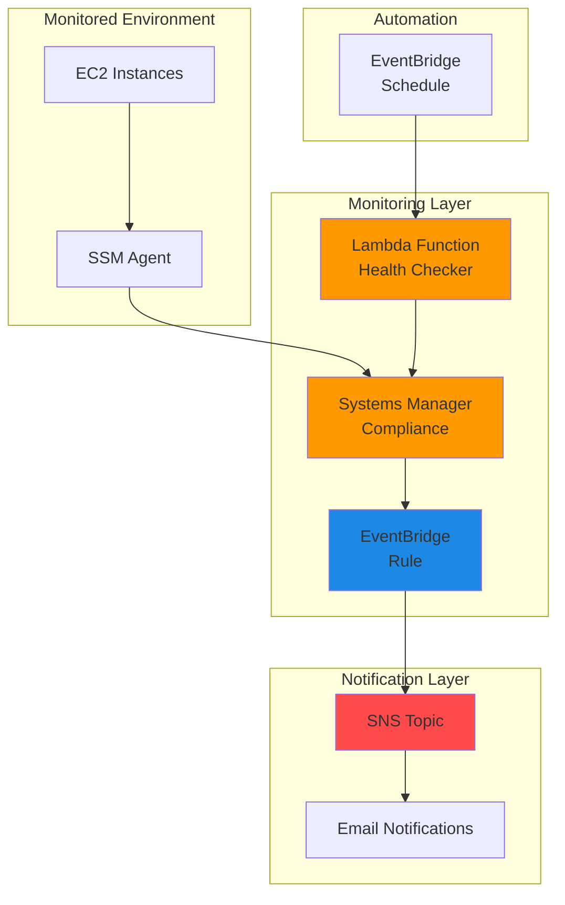

# Simple Environment Health Check with Systems Manager and SNS

## Problem

Operations teams need proactive monitoring of their AWS environments to detect issues before they impact business operations. Without automated health checks, problems like unresponsive instances, compliance drift, or service disruptions often go unnoticed until customers report issues. Manual monitoring is time-consuming and error-prone, leading to increased mean time to detection (MTTD) and potential service outages.

## Solution

Deploy automated environment health monitoring using AWS Systems Manager Compliance to track resource health status and Amazon SNS to send immediate notifications when problems are detected. This serverless solution continuously monitors EC2 instances, checks compliance status, and sends alerts to operations teams through email notifications using EventBridge for real-time event processing.

## Architecture Diagram



## Prerequisites

1. AWS account with Systems Manager, SNS, Lambda, and EventBridge permissions
2. AWS CLI installed and configured (or AWS CloudShell)
3. At least one EC2 instance with SSM Agent installed and running
4. Basic understanding of EventBridge rules and Systems Manager compliance
5. Estimated cost: $0.50-$2.00 per month for SNS notifications and Lambda executions

> **Note**: This solution uses AWS free tier eligible services where possible. SNS charges $0.50 per million requests and Lambda has a generous free tier for executions.

## Preparation

```bash
# Set environment variables
export AWS_REGION=$(aws configure get region)
export AWS_ACCOUNT_ID=$(aws sts get-caller-identity \
    --query Account --output text)

# Generate unique identifiers for resources
RANDOM_SUFFIX=$(aws secretsmanager get-random-password \
    --exclude-punctuation --exclude-uppercase \
    --password-length 6 --require-each-included-type \
    --output text --query RandomPassword)

# Set email for notifications (replace with your email)
export NOTIFICATION_EMAIL="your-email@example.com"

echo "✅ AWS environment configured"
echo "Region: ${AWS_REGION}"
echo "Account ID: ${AWS_ACCOUNT_ID}"
echo "Random Suffix: ${RANDOM_SUFFIX}"
```

## Steps

1. **Create SNS Topic for Health Notifications**:

   Amazon SNS provides a fully managed messaging service that delivers notifications to multiple endpoints. Creating a dedicated SNS topic establishes the communication channel for health check alerts, enabling real-time notifications to operations teams when environment issues are detected.

   ```bash
   # Create SNS topic for health notifications
   aws sns create-topic \
       --name "environment-health-alerts-${RANDOM_SUFFIX}" \
       --tags Key=Purpose,Value=HealthMonitoring \
              Key=Environment,Value=Production
   
   # Store topic ARN for later use
   TOPIC_ARN=$(aws sns list-topics \
       --query "Topics[?contains(TopicArn, 'environment-health-alerts-${RANDOM_SUFFIX}')].TopicArn" \
       --output text)
   
   echo "✅ SNS topic created: ${TOPIC_ARN}"
   ```

   The SNS topic now serves as the central notification hub for all environment health alerts. This scalable messaging service can deliver notifications to multiple subscribers simultaneously, ensuring your entire operations team stays informed about critical issues.

2. **Subscribe Email to Health Notifications**:

   Email subscriptions provide reliable, immediate notification delivery for health check alerts. This step configures your operations team's email addresses to receive detailed health status notifications, enabling rapid response to environment issues.

   ```bash
   # Subscribe email to receive health notifications
   aws sns subscribe \
       --topic-arn "${TOPIC_ARN}" \
       --protocol email \
       --notification-endpoint "${NOTIFICATION_EMAIL}"
   
   echo "✅ Email subscription created"
   echo "Check your email and confirm the subscription"
   ```

   Your email address is now subscribed to receive health notifications. You'll receive a confirmation email that you must click to activate the subscription. This ensures only authorized recipients receive sensitive operational alerts.

3. **Create Lambda Function for Health Checks**:

   A Lambda function provides extensible health checking capabilities that can perform custom health validations, check service endpoints, and update compliance status based on sophisticated health criteria. This serverless approach eliminates infrastructure management overhead.

   ```bash
   # Create enhanced health check Lambda function code
   cat > health_check_function.py << 'EOF'
import json
import boto3
import logging
from datetime import datetime
from botocore.exceptions import ClientError

# Configure logging
logger = logging.getLogger()
logger.setLevel(logging.INFO)

def lambda_handler(event, context):
    """
    Health check function that monitors SSM agent status
    and updates Systems Manager compliance accordingly.
    """
    ssm = boto3.client('ssm')
    sns = boto3.client('sns')
    
    try:
        # Get all managed instances
        response = ssm.describe_instance_information()
        
        compliance_items = []
        non_compliant_instances = []
        
        for instance in response['InstanceInformationList']:
            instance_id = instance['InstanceId']
            ping_status = instance['PingStatus']
            last_ping_time = instance.get('LastPingDateTime', 'Unknown')
            
            # Determine compliance status based on ping status
            status = 'COMPLIANT' if ping_status == 'Online' else 'NON_COMPLIANT'
            severity = 'HIGH' if status == 'NON_COMPLIANT' else 'INFORMATIONAL'
            
            if status == 'NON_COMPLIANT':
                non_compliant_instances.append({
                    'InstanceId': instance_id,
                    'PingStatus': ping_status,
                    'LastPingTime': str(last_ping_time)
                })
            
            # Update compliance with enhanced details
            compliance_item = {
                'Id': f'HealthCheck-{instance_id}',
                'Title': 'InstanceConnectivityCheck',
                'Severity': severity,
                'Status': status,
                'Details': {
                    'PingStatus': ping_status,
                    'LastPingTime': str(last_ping_time),
                    'CheckTime': datetime.utcnow().isoformat() + 'Z'
                }
            }
            
            ssm.put_compliance_items(
                ResourceId=instance_id,
                ResourceType='ManagedInstance',
                ComplianceType='Custom:EnvironmentHealth',
                ExecutionSummary={
                    'ExecutionTime': datetime.utcnow().isoformat() + 'Z'
                },
                Items=[compliance_item]
            )
            
            compliance_items.append(compliance_item)
        
        # Log health check results
        logger.info(f"Health check completed for {len(compliance_items)} instances")
        
        # Send notification if there are non-compliant instances
        if non_compliant_instances:
            topic_arn = context.function_name.replace('environment-health-check-', 'arn:aws:sns:' + context.invoked_function_arn.split(':')[3] + ':' + context.invoked_function_arn.split(':')[4] + ':environment-health-alerts-')
            
            message = f"Environment Health Alert: {len(non_compliant_instances)} instances are non-compliant\n\n"
            for instance in non_compliant_instances:
                message += f"Instance: {instance['InstanceId']}, Status: {instance['PingStatus']}, Last Ping: {instance['LastPingTime']}\n"
            
            logger.warning(f"Sending alert for {len(non_compliant_instances)} non-compliant instances")
        
        return {
            'statusCode': 200,
            'body': json.dumps({
                'message': 'Health check completed successfully',
                'total_instances': len(compliance_items),
                'non_compliant_instances': len(non_compliant_instances)
            })
        }
        
    except ClientError as e:
        error_message = f"AWS API error: {str(e)}"
        logger.error(error_message)
        return {
            'statusCode': 500,
            'body': json.dumps(f'Error: {error_message}')
        }
    except Exception as e:
        error_message = f"Unexpected error: {str(e)}"
        logger.error(error_message)
        return {
            'statusCode': 500,
            'body': json.dumps(f'Error: {error_message}')
        }
EOF
   
   # Package Lambda function
   zip health_check_function.zip health_check_function.py
   
   echo "✅ Lambda function code prepared"
   ```

   The Lambda function code is now ready for deployment. This enhanced function performs automated health checks by monitoring instance connectivity status and updating Systems Manager compliance accordingly, with improved error handling and logging capabilities.

4. **Deploy Lambda Function with IAM Role**:

   Deploying the Lambda function with appropriate IAM permissions enables automated health checking with secure access to Systems Manager and SNS services. The function runs serverlessly, executing health checks on a schedule without infrastructure management overhead.

   ```bash
   # Create IAM role for Lambda function
   aws iam create-role \
       --role-name "HealthCheckLambdaRole-${RANDOM_SUFFIX}" \
       --assume-role-policy-document '{
           "Version": "2012-10-17",
           "Statement": [
               {
                   "Effect": "Allow",
                   "Principal": {"Service": "lambda.amazonaws.com"},
                   "Action": "sts:AssumeRole"
               }
           ]
       }'
   
   # Attach basic Lambda execution policy
   aws iam attach-role-policy \
       --role-name "HealthCheckLambdaRole-${RANDOM_SUFFIX}" \
       --policy-arn "arn:aws:iam::aws:policy/service-role/AWSLambdaBasicExecutionRole"
   
   # Create custom policy for Systems Manager and SNS access
   aws iam create-policy \
       --policy-name "HealthCheckPolicy-${RANDOM_SUFFIX}" \
       --policy-document '{
           "Version": "2012-10-17",
           "Statement": [
               {
                   "Effect": "Allow",
                   "Action": [
                       "ssm:DescribeInstanceInformation",
                       "ssm:PutComplianceItems",
                       "ssm:ListComplianceItems",
                       "sns:Publish"
                   ],
                   "Resource": "*"
               }
           ]
       }'
   
   # Attach custom policy to role
   aws iam attach-role-policy \
       --role-name "HealthCheckLambdaRole-${RANDOM_SUFFIX}" \
       --policy-arn "arn:aws:iam::${AWS_ACCOUNT_ID}:policy/HealthCheckPolicy-${RANDOM_SUFFIX}"
   
   # Wait for role to be available
   sleep 10
   
   # Create Lambda function with updated Python runtime
   aws lambda create-function \
       --function-name "environment-health-check-${RANDOM_SUFFIX}" \
       --runtime python3.12 \
       --role "arn:aws:iam::${AWS_ACCOUNT_ID}:role/HealthCheckLambdaRole-${RANDOM_SUFFIX}" \
       --handler health_check_function.lambda_handler \
       --zip-file fileb://health_check_function.zip \
       --timeout 60 \
       --memory-size 256 \
       --environment Variables="{SNS_TOPIC_ARN=${TOPIC_ARN}}"
   
   echo "✅ Lambda function deployed with IAM permissions"
   ```

   The Lambda function is now deployed with secure IAM permissions to perform health checks. This serverless function can access Systems Manager services to monitor instance status and update compliance data automatically while using the latest Python 3.12 runtime.

5. **Create Initial Compliance Baseline**:

   Systems Manager Compliance enables tracking of custom health metrics beyond standard patching and configuration compliance. Creating an initial compliance baseline establishes the foundation for monitoring specific environment health indicators.

   ```bash
   # Get first available instance ID for demonstration
   INSTANCE_ID=$(aws ec2 describe-instances \
       --query 'Reservations[0].Instances[0].InstanceId' \
       --output text --filters Name=state-name,Values=running)
   
   if [ "$INSTANCE_ID" != "None" ] && [ -n "$INSTANCE_ID" ]; then
       # Create initial compliance item for health check baseline
       aws ssm put-compliance-items \
           --resource-id "${INSTANCE_ID}" \
           --resource-type ManagedInstance \
           --compliance-type "Custom:EnvironmentHealth" \
           --execution-summary "ExecutionTime=$(date -u +%Y-%m-%dT%H:%M:%SZ)" \
           --items "Id=InitialHealthCheck,Title=EnvironmentHealthStatus,Severity=INFORMATIONAL,Status=COMPLIANT"
       
       echo "✅ Initial compliance baseline created for instance: ${INSTANCE_ID}"
   else
       echo "❌ No running EC2 instances found. Please launch an instance with SSM agent first."
   fi
   ```

   The initial compliance baseline now tracks environment health status for your managed instances. This establishes the foundation for monitoring specific health criteria and generating compliance reports for your infrastructure.

6. **Create EventBridge Rule for Compliance Events**:

   EventBridge enables real-time response to Systems Manager compliance state changes. Creating a rule that responds to compliance events provides immediate notifications when health issues are detected, enabling faster incident response than polling-based monitoring.

   ```bash
   # Create EventBridge rule for compliance state changes
   aws events put-rule \
       --name "compliance-health-alerts-${RANDOM_SUFFIX}" \
       --description "Respond to compliance state changes for health monitoring" \
       --event-pattern '{
           "source": ["aws.ssm"],
           "detail-type": ["Configuration Compliance State Change"],
           "detail": {
               "compliance-type": ["Custom:EnvironmentHealth"],
               "compliance-status": ["NON_COMPLIANT"]
           }
       }' \
       --state ENABLED
   
   # Add SNS topic as target for compliance events
   aws events put-targets \
       --rule "compliance-health-alerts-${RANDOM_SUFFIX}" \
       --targets "Id"="1","Arn"="${TOPIC_ARN}","InputTransformer"="{\"InputPathsMap\":{\"instance\":\"$.detail.resource-id\",\"status\":\"$.detail.compliance-status\",\"time\":\"$.time\"},\"InputTemplate\":\"Environment Health Alert: Instance <instance> is <status> at <time>. Please investigate immediately.\"}"
   
   # Grant EventBridge permission to publish to SNS
   aws sns add-permission \
       --topic-arn "${TOPIC_ARN}" \
       --label "EventBridgePublishPermission" \
       --aws-account-id "${AWS_ACCOUNT_ID}" \
       --action-name Publish \
       --principal events.amazonaws.com
   
   echo "✅ EventBridge rule configured for compliance events"
   ```

   EventBridge now monitors Systems Manager compliance events and automatically sends notifications when instances become non-compliant. This real-time monitoring provides immediate alerts without the need for polling or scheduled checks.

7. **Create EventBridge Schedule for Periodic Health Checks**:

   EventBridge scheduling enables consistent execution of health checks without manual intervention. Creating a scheduled rule ensures continuous monitoring by triggering the Lambda function at regular intervals, maintaining up-to-date health information for your infrastructure.

   ```bash
   # Create EventBridge schedule for periodic health checks
   aws events put-rule \
       --name "health-check-schedule-${RANDOM_SUFFIX}" \
       --description "Schedule health checks every 5 minutes" \
       --schedule-expression "rate(5 minutes)" \
       --state ENABLED
   
   # Add Lambda function as target
   aws events put-targets \
       --rule "health-check-schedule-${RANDOM_SUFFIX}" \
       --targets "Id"="1","Arn"="arn:aws:lambda:${AWS_REGION}:${AWS_ACCOUNT_ID}:function:environment-health-check-${RANDOM_SUFFIX}","Input"="{\"source\":\"eventbridge-schedule\"}"
   
   # Grant EventBridge permission to invoke Lambda
   aws lambda add-permission \
       --function-name "environment-health-check-${RANDOM_SUFFIX}" \
       --statement-id "allow-eventbridge-schedule-invoke" \
       --action lambda:InvokeFunction \
       --principal events.amazonaws.com \
       --source-arn "arn:aws:events:${AWS_REGION}:${AWS_ACCOUNT_ID}:rule/health-check-schedule-${RANDOM_SUFFIX}"
   
   echo "✅ Scheduled health checks configured"
   ```

   Automated health checks now run every 5 minutes, continuously monitoring your environment and updating compliance status. This ensures proactive detection of issues and maintains up-to-date health information for your infrastructure.

## Validation & Testing

1. **Verify SNS Topic and Subscription**:

   ```bash
   # Check SNS topic exists
   aws sns get-topic-attributes --topic-arn "${TOPIC_ARN}"
   
   # List subscriptions
   aws sns list-subscriptions-by-topic --topic-arn "${TOPIC_ARN}"
   ```

   Expected output: Topic attributes showing the health monitoring topic and confirmed email subscription status.

2. **Test Health Check Lambda Function**:

   ```bash
   # Manually invoke Lambda function to test health checks
   aws lambda invoke \
       --function-name "environment-health-check-${RANDOM_SUFFIX}" \
       --payload '{"source":"manual-test"}' \
       response.json
   
   # Check function execution results
   cat response.json
   
   # View Lambda logs for detailed execution information
   aws logs tail /aws/lambda/environment-health-check-${RANDOM_SUFFIX} \
       --since 5m --follow
   ```

   Expected output: Successful function execution with status code 200, health check completion message, and detailed logs showing instance monitoring results.

3. **Verify Compliance Data Collection**:

   ```bash
   # Check compliance summary for custom health type
   aws ssm list-compliance-summaries \
       --query 'ComplianceSummaryItems[?ComplianceType==`Custom:EnvironmentHealth`]'
   
   # Get detailed compliance items
   if [ -n "$INSTANCE_ID" ]; then
       aws ssm list-compliance-items \
           --resource-ids "${INSTANCE_ID}" \
           --resource-types ManagedInstance \
           --filters Key=ComplianceType,Values="Custom:EnvironmentHealth"
   fi
   ```

   Expected output: Compliance summary showing health check status and detailed compliance items for monitored instances with timestamps and health details.

4. **Test EventBridge Rules**:

   ```bash
   # Verify EventBridge rules are active
   aws events list-rules \
       --name-prefix "health-check-schedule-${RANDOM_SUFFIX}"
   
   aws events list-rules \
       --name-prefix "compliance-health-alerts-${RANDOM_SUFFIX}"
   
   # Test notification flow with manual SNS message
   aws sns publish \
       --topic-arn "${TOPIC_ARN}" \
       --subject "Test Health Alert" \
       --message "This is a test notification from your environment health monitoring system."
   
   echo "✅ Test notification sent - check your email"
   ```

   Expected output: Active EventBridge rules showing proper configuration and successful test notification delivery.

## Cleanup

1. **Remove EventBridge Rules and Targets**:

   ```bash
   # Remove targets from EventBridge rules
   aws events remove-targets \
       --rule "health-check-schedule-${RANDOM_SUFFIX}" \
       --ids "1"
   
   aws events remove-targets \
       --rule "compliance-health-alerts-${RANDOM_SUFFIX}" \
       --ids "1"
   
   # Delete EventBridge rules
   aws events delete-rule \
       --name "health-check-schedule-${RANDOM_SUFFIX}"
   
   aws events delete-rule \
       --name "compliance-health-alerts-${RANDOM_SUFFIX}"
   
   echo "✅ EventBridge rules deleted"
   ```

2. **Delete Lambda Function and IAM Resources**:

   ```bash
   # Delete Lambda function
   aws lambda delete-function \
       --function-name "environment-health-check-${RANDOM_SUFFIX}"
   
   # Detach and delete IAM policies
   aws iam detach-role-policy \
       --role-name "HealthCheckLambdaRole-${RANDOM_SUFFIX}" \
       --policy-arn "arn:aws:iam::aws:policy/service-role/AWSLambdaBasicExecutionRole"
   
   aws iam detach-role-policy \
       --role-name "HealthCheckLambdaRole-${RANDOM_SUFFIX}" \
       --policy-arn "arn:aws:iam::${AWS_ACCOUNT_ID}:policy/HealthCheckPolicy-${RANDOM_SUFFIX}"
   
   aws iam delete-policy \
       --policy-arn "arn:aws:iam::${AWS_ACCOUNT_ID}:policy/HealthCheckPolicy-${RANDOM_SUFFIX}"
   
   aws iam delete-role \
       --role-name "HealthCheckLambdaRole-${RANDOM_SUFFIX}"
   
   echo "✅ Lambda function and IAM resources deleted"
   ```

3. **Remove SNS Resources and Local Files**:

   ```bash
   # Delete SNS topic (this also removes subscriptions)
   aws sns delete-topic --topic-arn "${TOPIC_ARN}"
   
   # Remove local files
   rm -f health_check_function.py health_check_function.zip response.json
   
   # Clean up environment variables
   unset TOPIC_ARN INSTANCE_ID RANDOM_SUFFIX NOTIFICATION_EMAIL
   
   echo "✅ SNS resources and local files cleaned up"
   ```

## Discussion

This solution demonstrates the power of combining AWS Systems Manager's compliance capabilities with EventBridge and SNS notifications to create a comprehensive, event-driven environment health monitoring system. Systems Manager Compliance provides a centralized view of resource health across your AWS infrastructure, while custom compliance types enable monitoring of specific health criteria beyond standard patching and configuration management.

The implementation follows AWS Well-Architected Framework principles by using serverless services that automatically scale based on demand, implement proper security controls through IAM roles, and provide cost-effective monitoring without infrastructure overhead. The Lambda function approach allows for extensible health checking logic that can be customized for specific business requirements, such as checking application endpoints, validating database connectivity, or monitoring custom metrics.

EventBridge provides two complementary monitoring patterns: scheduled health checks for proactive monitoring and event-driven notifications for immediate response to compliance state changes. This dual approach ensures comprehensive coverage while minimizing notification latency. The solution scales automatically as your environment grows, requiring minimal operational overhead while maintaining comprehensive visibility into system health.

For production environments, consider implementing additional monitoring layers such as CloudWatch synthetic canaries for user experience monitoring, AWS Config rules for compliance validation, and integration with AWS Systems Manager OpsCenter for centralized operational issue management. The modular design allows for easy extension with additional health check types and notification channels as operational requirements evolve.

> **Tip**: Use AWS Systems Manager Parameter Store to manage health check thresholds and configuration settings, enabling dynamic adjustment of monitoring criteria without code changes. This approach supports environment-specific configurations and simplifies operational management.

**Documentation Sources:**
- [AWS Systems Manager Compliance](https://docs.aws.amazon.com/systems-manager/latest/userguide/compliance-about.html)
- [EventBridge Systems Manager Integration](https://docs.aws.amazon.com/systems-manager/latest/userguide/compliance-fixing.html)
- [AWS Lambda Python Runtime](https://docs.aws.amazon.com/lambda/latest/dg/lambda-python.html)
- [Systems Manager Compliance Custom Types](https://docs.aws.amazon.com/systems-manager/latest/userguide/compliance-custom-metadata-cli.html)
- [AWS Well-Architected Framework](https://docs.aws.amazon.com/wellarchitected/latest/framework/welcome.html)

## Challenge

Extend this solution by implementing these enhancements:

1. **Multi-Region Health Monitoring**: Deploy the solution across multiple AWS regions with cross-region SNS topic replication for global environment visibility and disaster recovery notification capabilities.

2. **Advanced Health Check Metrics**: Integrate application-specific health checks such as database connection testing, API endpoint validation, and custom business logic monitoring through enhanced Lambda functions with HTTP health checks.

3. **Automated Remediation**: Implement Systems Manager Automation documents that automatically respond to health check failures by restarting services, scaling resources, or triggering recovery procedures using EventBridge rule targets.

4. **Dashboard Integration**: Create CloudWatch dashboards and QuickSight reports that visualize health trends, compliance scores, and operational metrics for executive reporting and trend analysis with real-time data updates.

5. **Integration with Third-Party Tools**: Connect the notification system to external incident management platforms like PagerDuty, ServiceNow, or Slack using SNS webhooks and EventBridge custom targets for comprehensive operational workflows.

## Infrastructure Code

### Available Infrastructure as Code:

- [Infrastructure Code Overview](code/README.md) - Detailed description of all infrastructure components
- [AWS CDK (Python)](code/cdk-python/) - AWS CDK Python implementation
- [AWS CDK (TypeScript)](code/cdk-typescript/) - AWS CDK TypeScript implementation
- [CloudFormation](code/cloudformation.yaml) - AWS CloudFormation template
- [Bash CLI Scripts](code/scripts/) - Example bash scripts using AWS CLI commands to deploy infrastructure
- [Terraform](code/terraform/) - Terraform configuration files