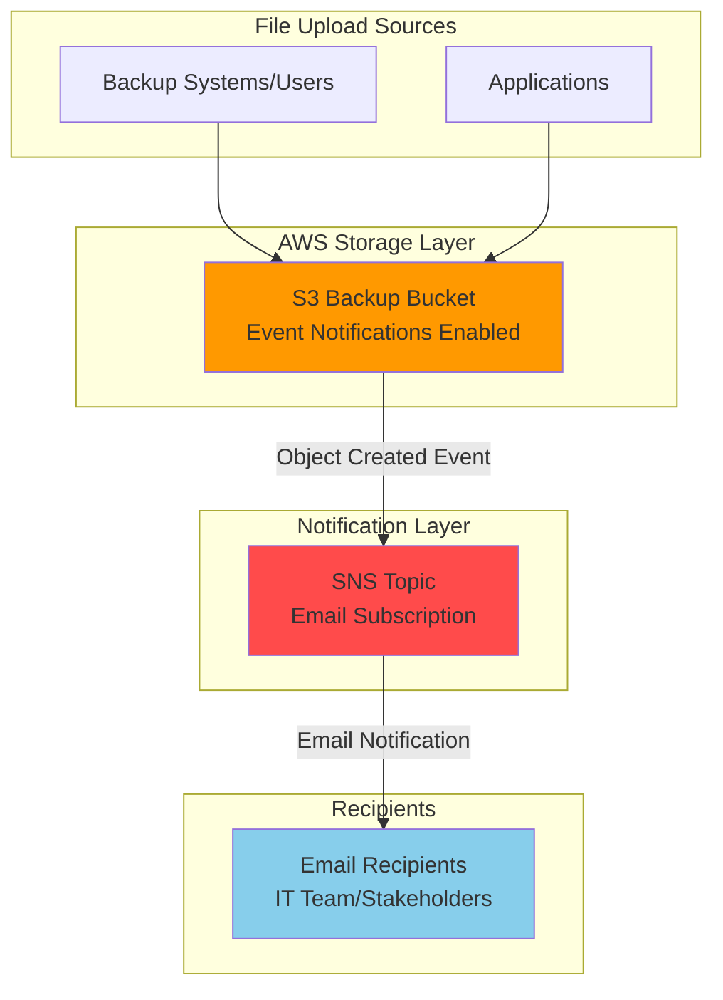

# Simple File Backup Notifications with S3 and SNS

## Problem

Organizations need real-time visibility into their backup operations and file transfers to ensure data protection compliance and operational reliability. Without automated notifications, IT teams often discover failed backups or missing files hours or days later, creating potential data loss risks and compliance violations. Manual monitoring of S3 buckets is time-consuming and prone to human error, making it difficult to maintain consistent backup verification processes.

## Solution

Create an automated notification system using Amazon S3 event notifications integrated with Amazon SNS (Simple Notification Service) to send instant email alerts whenever files are uploaded to your backup bucket. This serverless solution provides real-time monitoring of backup operations while eliminating the need for manual checking or custom monitoring scripts, ensuring immediate awareness of successful file transfers and backup completions.

## Architecture Diagram



## Prerequisites

1. AWS account with permissions to create S3 buckets and SNS topics
2. AWS CLI installed and configured (or use CloudShell)
3. Basic understanding of S3 bucket operations and email notifications
4. Valid email address for receiving notifications
5. Estimated cost: $0.01-$0.50 per month for typical backup notification usage

> **Note**: This solution follows AWS Well-Architected Framework principles for operational excellence and cost optimization.

## Preparation

```bash
# Set environment variables
export AWS_REGION=$(aws configure get region)
export AWS_ACCOUNT_ID=$(aws sts get-caller-identity \
    --query Account --output text)

# Generate unique identifiers for resources
RANDOM_SUFFIX=$(aws secretsmanager get-random-password \
    --exclude-punctuation --exclude-uppercase \
    --password-length 6 --require-each-included-type \
    --output text --query RandomPassword)

# Set resource names with unique suffix
export BUCKET_NAME="backup-notifications-${RANDOM_SUFFIX}"
export SNS_TOPIC_NAME="backup-alerts-${RANDOM_SUFFIX}"
export EMAIL_ADDRESS="your-email@example.com"

echo "✅ AWS environment configured"
echo "Bucket name: ${BUCKET_NAME}"
echo "SNS topic: ${SNS_TOPIC_NAME}"
```

## Steps

1. **Create SNS Topic for Email Notifications**:

   Amazon SNS provides a fully managed pub/sub messaging service that enables decoupled communication between applications and services. Creating an SNS topic establishes the central communication hub that will receive S3 event notifications and distribute them to email subscribers. This serverless approach ensures reliable message delivery with built-in redundancy and automatic scaling based on demand.

   ```bash
   # Create SNS topic for backup notifications
   SNS_TOPIC_ARN=$(aws sns create-topic \
       --name ${SNS_TOPIC_NAME} \
       --query 'TopicArn' --output text)
   
   echo "✅ SNS topic created: ${SNS_TOPIC_ARN}"
   ```

   The SNS topic is now ready to receive messages from S3 and distribute them to subscribers. This foundational component provides the messaging backbone for our notification system with enterprise-grade reliability and performance that scales automatically with message volume.

2. **Subscribe Email Address to SNS Topic**:

   Email subscriptions in SNS enable automatic delivery of formatted messages to specified recipients. This step establishes the notification endpoint where backup alerts will be delivered, providing immediate visibility into file upload events for operational teams and stakeholders.

   ```bash
   # Subscribe email address to SNS topic
   aws sns subscribe \
       --topic-arn ${SNS_TOPIC_ARN} \
       --protocol email \
       --notification-endpoint ${EMAIL_ADDRESS}
   
   echo "✅ Email subscription created for ${EMAIL_ADDRESS}"
   echo "📧 Check your email and confirm the subscription"
   ```

   You'll receive a confirmation email that must be clicked to activate the subscription. This security measure prevents unauthorized email subscriptions and ensures only intended recipients receive notifications, following AWS security best practices for subscription management.

3. **Create S3 Bucket for File Storage**:

   S3 provides highly durable object storage with 99.999999999% (11 9's) durability, making it the ideal foundation for backup operations. Creating a dedicated backup bucket establishes secure, scalable storage that can handle files of any size while supporting automated event notifications for operational monitoring.

   ```bash
   # Create S3 bucket for backup files
   aws s3 mb s3://${BUCKET_NAME} --region ${AWS_REGION}
   
   # Enable versioning for data protection
   aws s3api put-bucket-versioning \
       --bucket ${BUCKET_NAME} \
       --versioning-configuration Status=Enabled
   
   # Enable server-side encryption
   aws s3api put-bucket-encryption \
       --bucket ${BUCKET_NAME} \
       --server-side-encryption-configuration \
       'Rules=[{ApplyServerSideEncryptionByDefault:{SSEAlgorithm:AES256}}]'
   
   echo "✅ S3 bucket created with security features enabled"
   ```

   The bucket now provides enterprise-grade security with versioning and encryption enabled by default. These features protect your backup data while maintaining compliance with security best practices and supporting data recovery scenarios.

4. **Configure SNS Topic Policy for S3 Access**:

   AWS services use IAM policies to control access between resources. Configuring the SNS topic policy grants S3 the necessary permissions to publish event notifications, enabling seamless integration between the storage and messaging services. This security configuration follows the principle of least privilege while allowing the required service-to-service communication.

   ```bash
   # Create SNS topic policy allowing S3 to publish messages
   cat > sns-policy.json << EOF
   {
     "Version": "2012-10-17",
     "Statement": [
       {
         "Sid": "AllowS3ToPublish",
         "Effect": "Allow",
         "Principal": {
           "Service": "s3.amazonaws.com"
         },
         "Action": "SNS:Publish",
         "Resource": "${SNS_TOPIC_ARN}",
         "Condition": {
           "StringEquals": {
             "aws:SourceAccount": "${AWS_ACCOUNT_ID}"
           },
           "StringLike": {
             "aws:SourceArn": "arn:aws:s3:::${BUCKET_NAME}"
           }
         }
       }
     ]
   }
   EOF
   
   # Apply the policy to SNS topic
   aws sns set-topic-attributes \
       --topic-arn ${SNS_TOPIC_ARN} \
       --attribute-name Policy \
       --attribute-value file://sns-policy.json
   
   echo "✅ SNS topic policy configured for S3 access"
   ```

   The policy now allows S3 to publish messages while maintaining security through account and source ARN conditions. This configuration ensures only your specific S3 bucket can trigger notifications, preventing unauthorized access from other AWS resources.

5. **Configure S3 Event Notifications**:

   S3 event notifications provide real-time awareness of bucket activities by triggering messages when specific events occur. Configuring object creation events ensures immediate notification when files are uploaded, enabling proactive monitoring of backup operations and file transfers across all upload methods.

   ```bash
   # Create S3 event notification configuration
   cat > notification-config.json << EOF
   {
     "TopicConfigurations": [
       {
         "Id": "BackupNotification",
         "TopicArn": "${SNS_TOPIC_ARN}",
         "Events": [
           "s3:ObjectCreated:*"
         ]
       }
     ]
   }
   EOF
   
   # Apply notification configuration to S3 bucket
   aws s3api put-bucket-notification-configuration \
       --bucket ${BUCKET_NAME} \
       --notification-configuration file://notification-config.json
   
   echo "✅ S3 event notifications configured"
   ```

   The S3 bucket now automatically publishes messages to SNS whenever objects are created, including uploads via AWS CLI, console, SDK, or third-party applications. This event-driven architecture provides immediate visibility into backup activities without impacting upload performance.

6. **Create Test Files for Validation**:

   Testing with sample files validates the complete notification workflow and ensures all components are properly configured. Creating test files simulates real backup scenarios while providing immediate feedback on the system's functionality.

   ```bash
   # Create test files to validate notifications
   echo "Backup test file created at $(date)" > test-backup-1.txt
   echo "Database backup completed at $(date)" > test-backup-2.txt
   echo "Application logs archived at $(date)" > test-backup-3.txt
   
   echo "✅ Test files created for validation"
   ```

   These test files simulate typical backup content and will trigger notifications when uploaded to the S3 bucket, allowing verification of the complete notification workflow from storage to email delivery.

## Validation & Testing

1. **Upload Test Files to Trigger Notifications**:

   ```bash
   # Upload test files to S3 bucket
   aws s3 cp test-backup-1.txt s3://${BUCKET_NAME}/
   aws s3 cp test-backup-2.txt s3://${BUCKET_NAME}/backups/
   aws s3 cp test-backup-3.txt s3://${BUCKET_NAME}/logs/
   
   echo "✅ Test files uploaded to S3 bucket"
   ```

   Expected result: You should receive 3 email notifications within 1-2 minutes for each uploaded file.

2. **Verify S3 Objects and Notifications**:

   ```bash
   # List objects in the bucket
   aws s3 ls s3://${BUCKET_NAME}/ --recursive
   
   # Check SNS topic metrics (wait a few minutes after upload)
   aws cloudwatch get-metric-statistics \
       --namespace AWS/SNS \
       --metric-name NumberOfMessagesPublished \
       --dimensions Name=TopicName,Value=${SNS_TOPIC_NAME} \
       --start-time $(date -u -d '10 minutes ago' \
           '+%Y-%m-%dT%H:%M:%S' 2>/dev/null || \
           date -u -v-10M '+%Y-%m-%dT%H:%M:%S') \
       --end-time $(date -u '+%Y-%m-%dT%H:%M:%S') \
       --period 300 \
       --statistics Sum
   ```

   Expected output: Objects should be listed in the bucket, and CloudWatch metrics should show message publications.

3. **Test Notification Content Structure**:

   ```bash
   # Upload another test file and check notification details
   echo "Final validation backup at $(date)" > validation-test.txt
   aws s3 cp validation-test.txt s3://${BUCKET_NAME}/validation/
   
   echo "Check your email for notification containing:"
   echo "- Bucket name: ${BUCKET_NAME}"
   echo "- Object key: validation/validation-test.txt"
   echo "- Event type: ObjectCreated:Put"
   ```

## Cleanup

1. **Remove Test Files from S3 Bucket**:

   ```bash
   # Delete all objects from the bucket
   aws s3 rm s3://${BUCKET_NAME} --recursive
   
   echo "✅ All objects deleted from S3 bucket"
   ```

2. **Delete S3 Bucket and Configuration**:

   ```bash
   # Remove bucket notification configuration
   aws s3api put-bucket-notification-configuration \
       --bucket ${BUCKET_NAME} \
       --notification-configuration '{}'
   
   # Delete the S3 bucket
   aws s3 rb s3://${BUCKET_NAME}
   
   echo "✅ S3 bucket deleted"
   ```

3. **Remove SNS Topic and Subscription**:

   ```bash
   # Delete SNS topic (this also removes all subscriptions)
   aws sns delete-topic --topic-arn ${SNS_TOPIC_ARN}
   
   echo "✅ SNS topic and subscriptions deleted"
   ```

4. **Clean Up Local Files**:

   ```bash
   # Remove local test files and configuration
   rm -f test-backup-*.txt validation-test.txt
   rm -f sns-policy.json notification-config.json
   
   # Clear environment variables
   unset BUCKET_NAME SNS_TOPIC_NAME EMAIL_ADDRESS SNS_TOPIC_ARN RANDOM_SUFFIX
   
   echo "✅ Local cleanup completed"
   ```

## Discussion

This solution demonstrates the power of event-driven architecture using AWS managed services to create reliable, scalable notification systems. The integration between S3 event notifications and SNS provides immediate visibility into file operations without requiring custom code or complex monitoring infrastructure. This approach follows [AWS Well-Architected Framework](https://docs.aws.amazon.com/wellarchitected/latest/framework/welcome.html) principles by leveraging managed services that automatically scale, provide high availability, and minimize operational overhead.

The notification system operates asynchronously, ensuring that file upload performance is not impacted by the notification delivery process. S3 event notifications are designed to be delivered at least once, providing reliability guarantees for critical backup monitoring scenarios. The use of SNS as the messaging layer enables easy expansion to multiple notification channels, including additional email addresses, SMS messages, or integration with incident management systems through [SNS message filtering](https://docs.aws.amazon.com/sns/latest/dg/sns-message-filtering.html).

From a security perspective, the solution implements least privilege access through IAM policies that restrict S3's ability to publish messages only to the specific SNS topic and from the designated bucket. Server-side encryption and versioning protect the backup data while maintaining compliance with security best practices. The email confirmation process ensures that only authorized recipients receive sensitive backup notifications, following [AWS SNS security best practices](https://docs.aws.amazon.com/sns/latest/dg/sns-security-best-practices.html).

Cost optimization is achieved through the serverless, pay-per-use model of both S3 event notifications and SNS. Organizations pay only for actual events and message deliveries, making this solution highly cost-effective for backup monitoring scenarios. The ability to filter events by object prefixes or suffixes enables fine-grained control over which files trigger notifications, further optimizing costs and reducing notification noise for large-scale backup operations.

> **Tip**: Use S3 object prefixes in event configurations to filter notifications for specific backup types or applications, reducing email volume and improving operational focus.

## Challenge

Extend this solution by implementing these enhancements:

1. **Multi-Environment Notifications**: Configure separate SNS topics for development, staging, and production buckets with environment-specific email distribution lists and message formatting using SNS message attributes.

2. **Advanced Event Filtering**: Implement notification rules based on file size, type, or naming conventions to create targeted alerts for different backup scenarios (database backups vs. log archives) using S3 event filters.

3. **Slack Integration**: Add Slack webhook endpoints to SNS subscriptions for real-time team notifications in dedicated backup monitoring channels with rich message formatting and custom notification templates.

4. **Backup Validation Workflow**: Integrate with AWS Lambda to perform file integrity checks and send success/failure notifications based on backup validation results rather than just upload completion, including checksum verification.

5. **Cross-Region Backup Monitoring**: Extend the architecture to monitor backup replication across multiple AWS regions with consolidated reporting and alerting for disaster recovery compliance using cross-region SNS topics.

## Infrastructure Code

*Infrastructure code will be generated after recipe approval.*