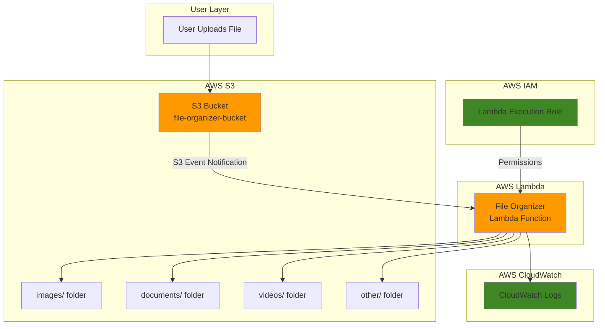

# Simple File Organization with S3 and Lambda

## Problem

Organizations often struggle with manually organizing uploaded files by type, leading to cluttered storage buckets and inefficient file management workflows. Teams waste valuable time sorting documents, images, and other files into appropriate folders, while inconsistent naming conventions make file retrieval difficult and error-prone.

## Solution

Create an automated file organization system using S3 event notifications to trigger Lambda functions that detect file types and move files into organized folder structures. This serverless approach eliminates manual work while providing scalable, cost-effective file management that responds instantly to new uploads.

## Architecture Diagram



## Prerequisites

1. AWS account with permissions to create S3 buckets, Lambda functions, and IAM roles
2. AWS CLI installed and configured (or AWS CloudShell access)
3. Basic understanding of serverless computing concepts
4. Familiarity with file extensions and MIME types
5. Estimated cost: $0.50-2.00 USD for testing (includes Lambda invocations and S3 requests)

> **Note**: This recipe uses AWS Free Tier eligible services. Lambda provides 1 million free requests per month, and S3 includes 5GB of free storage.

## Preparation

```bash
# Set environment variables
export AWS_REGION=$(aws configure get region)
export AWS_ACCOUNT_ID=$(aws sts get-caller-identity \
    --query Account --output text)

# Generate unique identifiers for resources
RANDOM_SUFFIX=$(aws secretsmanager get-random-password \
    --exclude-punctuation --exclude-uppercase \
    --password-length 6 --require-each-included-type \
    --output text --query RandomPassword)

# Set resource names
export BUCKET_NAME="file-organizer-${RANDOM_SUFFIX}"
export FUNCTION_NAME="file-organizer-function"
export ROLE_NAME="file-organizer-lambda-role"

echo "✅ AWS environment configured"
echo "Bucket Name: ${BUCKET_NAME}"
echo "Function Name: ${FUNCTION_NAME}"
echo "Region: ${AWS_REGION}"
```

## Steps

1. **Create S3 Bucket for File Organization**:

   Amazon S3 provides highly durable object storage with 99.999999999% (11 9's) durability, making it the ideal foundation for our automated file organization system. Creating a dedicated bucket establishes the primary storage layer that will trigger our Lambda function whenever new files are uploaded.

   ```bash
   # Create S3 bucket with versioning enabled
   aws s3 mb s3://${BUCKET_NAME} --region ${AWS_REGION}
   
   # Enable versioning for file safety
   aws s3api put-bucket-versioning \
       --bucket ${BUCKET_NAME} \
       --versioning-configuration Status=Enabled
   
   # Enable server-side encryption
   aws s3api put-bucket-encryption \
       --bucket ${BUCKET_NAME} \
       --server-side-encryption-configuration \
       'Rules=[{ApplyServerSideEncryptionByDefault:{SSEAlgorithm:AES256}}]'
   
   echo "✅ S3 bucket created: ${BUCKET_NAME}"
   ```

   The bucket is now configured with enterprise-grade security features including versioning and encryption at rest, providing the secure foundation needed for automated file processing.

2. **Create IAM Execution Role for Lambda**:

   AWS Lambda requires an execution role that defines which AWS services and resources the function can access. This role follows the principle of least privilege, granting only the minimum permissions needed for S3 operations and CloudWatch logging.

   ```bash
   # Create trust policy for Lambda service
   cat > trust-policy.json << EOF
   {
     "Version": "2012-10-17",
     "Statement": [
       {
         "Effect": "Allow",
         "Principal": {
           "Service": "lambda.amazonaws.com"
         },
         "Action": "sts:AssumeRole"
       }
     ]
   }
   EOF
   
   # Create IAM role
   aws iam create-role \
       --role-name ${ROLE_NAME} \
       --assume-role-policy-document file://trust-policy.json
   
   # Get role ARN for later use
   ROLE_ARN=$(aws iam get-role --role-name ${ROLE_NAME} \
       --query 'Role.Arn' --output text)
   
   echo "✅ IAM role created: ${ROLE_NAME}"
   ```

   The IAM role is now configured to allow the Lambda service to assume it, establishing the security foundation for our serverless function.

3. **Attach Policies to Lambda Execution Role**:

   Lambda functions require specific permissions to read from S3, write to S3, and send logs to CloudWatch. We'll attach both AWS managed policies and a custom policy for S3 operations within our specific bucket.

   ```bash
   # Attach basic Lambda execution policy for CloudWatch logs
   aws iam attach-role-policy \
       --role-name ${ROLE_NAME} \
       --policy-arn arn:aws:iam::aws:policy/service-role/AWSLambdaBasicExecutionRole
   
   # Create custom policy for S3 operations
   cat > s3-policy.json << EOF
   {
     "Version": "2012-10-17",
     "Statement": [
       {
         "Effect": "Allow",
         "Action": [
           "s3:GetObject",
           "s3:PutObject",
           "s3:DeleteObject"
         ],
         "Resource": "arn:aws:s3:::${BUCKET_NAME}/*"
       }
     ]
   }
   EOF
   
   # Create and attach custom S3 policy
   aws iam create-policy \
       --policy-name ${ROLE_NAME}-s3-policy \
       --policy-document file://s3-policy.json
   
   aws iam attach-role-policy \
       --role-name ${ROLE_NAME} \
       --policy-arn arn:aws:iam::${AWS_ACCOUNT_ID}:policy/${ROLE_NAME}-s3-policy
   
   echo "✅ IAM policies attached to role"
   ```

   The role now has the exact permissions needed for S3 file operations and CloudWatch logging, following AWS security best practices for least privilege access.

4. **Create Lambda Function Code**:

   The Lambda function analyzes uploaded files by their extensions and moves them into appropriate folders. This event-driven architecture responds automatically to S3 uploads without requiring servers or manual intervention.

   ```bash
   # Create Python code for file organization
   cat > lambda_function.py << 'EOF'
   import json
   import boto3
   import os
   from urllib.parse import unquote_plus
   
   s3_client = boto3.client('s3')
   
   def lambda_handler(event, context):
       # Process each S3 event record
       for record in event['Records']:
           bucket = record['s3']['bucket']['name']
           key = unquote_plus(record['s3']['object']['key'])
           
           # Skip if file is already in an organized folder
           if '/' in key and key.split('/')[0] in ['images', 'documents', 'videos', 'other']:
               print(f"File {key} is already organized, skipping")
               continue
           
           # Skip .gitkeep files used for folder structure
           if key.endswith('/.gitkeep'):
               print(f"Skipping folder placeholder file: {key}")
               continue
           
           # Determine file type based on extension
           file_extension = key.lower().split('.')[-1] if '.' in key else ''
           folder = get_folder_for_extension(file_extension)
           
           # Create new key with folder structure
           new_key = f"{folder}/{key}"
           
           try:
               # Copy object to new location
               s3_client.copy_object(
                   Bucket=bucket,
                   CopySource={'Bucket': bucket, 'Key': key},
                   Key=new_key
               )
               
               # Delete original object
               s3_client.delete_object(Bucket=bucket, Key=key)
               
               print(f"Moved {key} to {new_key}")
               
           except Exception as e:
               print(f"Error moving {key}: {str(e)}")
               # Return error to trigger retry mechanism
               raise e
   
   def get_folder_for_extension(extension):
       """Determine folder based on file extension"""
       image_extensions = ['jpg', 'jpeg', 'png', 'gif', 'bmp', 'tiff', 'svg', 'webp']
       document_extensions = ['pdf', 'doc', 'docx', 'txt', 'rtf', 'odt', 'xls', 'xlsx', 'ppt', 'pptx', 'csv']
       video_extensions = ['mp4', 'avi', 'mov', 'wmv', 'flv', 'webm', 'mkv', 'm4v']
       
       if extension in image_extensions:
           return 'images'
       elif extension in document_extensions:
           return 'documents'
       elif extension in video_extensions:
           return 'videos'
       else:
           return 'other'
   EOF
   
   # Create deployment package
   zip function.zip lambda_function.py
   
   echo "✅ Lambda function code created and packaged"
   ```

   The Lambda function is now ready with enhanced error handling and expanded file type recognition, including additional common file extensions.

5. **Deploy Lambda Function**:

   AWS Lambda provides serverless compute that automatically scales based on incoming S3 events. The function runs only when files are uploaded, ensuring cost-effective operation with built-in error handling and monitoring through CloudWatch.

   ```bash
   # Wait for IAM role to propagate (important for new roles)
   sleep 10
   
   # Create Lambda function with updated Python runtime
   aws lambda create-function \
       --function-name ${FUNCTION_NAME} \
       --runtime python3.12 \
       --role ${ROLE_ARN} \
       --handler lambda_function.lambda_handler \
       --zip-file fileb://function.zip \
       --timeout 60 \
       --memory-size 256 \
       --description "Automatically organizes uploaded files by type"
   
   # Get function ARN for S3 trigger configuration
   FUNCTION_ARN=$(aws lambda get-function --function-name ${FUNCTION_NAME} \
       --query 'Configuration.FunctionArn' --output text)
   
   echo "✅ Lambda function deployed: ${FUNCTION_NAME}"
   echo "Function ARN: ${FUNCTION_ARN}"
   ```

   The Lambda function is now deployed with the Python 3.12 runtime, providing improved performance and long-term support compared to older runtime versions.

6. **Configure S3 Event Notification**:

   S3 event notifications provide real-time triggers that invoke Lambda functions when objects are created. This creates an event-driven architecture where file organization happens automatically without manual intervention or scheduled jobs.

   ```bash
   # Add permission for S3 to invoke Lambda function
   aws lambda add-permission \
       --function-name ${FUNCTION_NAME} \
       --principal s3.amazonaws.com \
       --action lambda:InvokeFunction \
       --statement-id s3-trigger-${RANDOM_SUFFIX} \
       --source-arn arn:aws:s3:::${BUCKET_NAME}
   
   # Create notification configuration
   cat > notification.json << EOF
   {
     "LambdaConfigurations": [
       {
         "Id": "ObjectCreatedEvents",
         "LambdaFunctionArn": "${FUNCTION_ARN}",
         "Events": ["s3:ObjectCreated:*"]
       }
     ]
   }
   EOF
   
   # Configure S3 bucket notification
   aws s3api put-bucket-notification-configuration \
       --bucket ${BUCKET_NAME} \
       --notification-configuration file://notification.json
   
   echo "✅ S3 event notification configured"
   ```

   The S3 bucket now automatically triggers Lambda executions for all object creation events, establishing the event-driven file organization system.

7. **Create Folder Structure**:

   Pre-creating folder structure in S3 provides clear organization and helps users understand the automated filing system. These folders serve as destinations for our Lambda function's file organization logic.

   ```bash
   # Create folder structure by uploading placeholder files
   echo "Images will be stored here" | \
       aws s3 cp - s3://${BUCKET_NAME}/images/.gitkeep
   echo "Documents will be stored here" | \
       aws s3 cp - s3://${BUCKET_NAME}/documents/.gitkeep
   echo "Videos will be stored here" | \
       aws s3 cp - s3://${BUCKET_NAME}/videos/.gitkeep
   echo "Other files will be stored here" | \
       aws s3 cp - s3://${BUCKET_NAME}/other/.gitkeep
   
   # List bucket contents to verify structure
   aws s3 ls s3://${BUCKET_NAME}/ --recursive
   
   echo "✅ Folder structure created in S3 bucket"
   ```

   The folder structure is now established, providing clear destinations for automated file organization with placeholder files to maintain folder visibility.

## Validation & Testing

1. **Verify Lambda function is ready**:

   ```bash
   # Check Lambda function status
   aws lambda get-function --function-name ${FUNCTION_NAME} \
       --query 'Configuration.State' --output text
   ```

   Expected output: `Active`

2. **Test file organization with sample uploads**:

   ```bash
   # Create test files with different extensions
   echo "Sample image content" > test-image.jpg
   echo "Sample document content" > test-document.pdf
   echo "Sample video metadata" > test-video.mp4
   echo "Sample unknown file" > test-file.unknown
   
   # Upload test files to trigger organization
   aws s3 cp test-image.jpg s3://${BUCKET_NAME}/
   aws s3 cp test-document.pdf s3://${BUCKET_NAME}/
   aws s3 cp test-video.mp4 s3://${BUCKET_NAME}/
   aws s3 cp test-file.unknown s3://${BUCKET_NAME}/
   
   # Wait for Lambda processing
   sleep 5
   
   # Verify files were organized correctly
   echo "Files organized in bucket:"
   aws s3 ls s3://${BUCKET_NAME}/ --recursive
   ```

   Expected output: Files should appear in appropriate folders (images/, documents/, videos/, other/)

3. **Check Lambda function logs**:

   ```bash
   # Get recent log events
   aws logs describe-log-groups \
       --log-group-name-prefix "/aws/lambda/${FUNCTION_NAME}"
   
   # View latest log stream
   LATEST_STREAM=$(aws logs describe-log-streams \
       --log-group-name "/aws/lambda/${FUNCTION_NAME}" \
       --order-by LastEventTime --descending \
       --query 'logStreams[0].logStreamName' --output text)
   
   aws logs get-log-events \
       --log-group-name "/aws/lambda/${FUNCTION_NAME}" \
       --log-stream-name "${LATEST_STREAM}" \
       --query 'events[*].message' --output text
   ```

## Cleanup

1. **Remove S3 bucket contents**:

   ```bash
   # Delete all objects in bucket
   aws s3 rm s3://${BUCKET_NAME} --recursive
   
   echo "✅ Deleted all objects from bucket"
   ```

2. **Delete S3 bucket**:

   ```bash
   # Delete the bucket
   aws s3 rb s3://${BUCKET_NAME}
   
   echo "✅ Deleted S3 bucket: ${BUCKET_NAME}"
   ```

3. **Remove Lambda function**:

   ```bash
   # Delete Lambda function
   aws lambda delete-function --function-name ${FUNCTION_NAME}
   
   echo "✅ Deleted Lambda function: ${FUNCTION_NAME}"
   ```

4. **Clean up IAM resources**:

   ```bash
   # Detach policies from role
   aws iam detach-role-policy \
       --role-name ${ROLE_NAME} \
       --policy-arn arn:aws:iam::aws:policy/service-role/AWSLambdaBasicExecutionRole
   
   aws iam detach-role-policy \
       --role-name ${ROLE_NAME} \
       --policy-arn arn:aws:iam::${AWS_ACCOUNT_ID}:policy/${ROLE_NAME}-s3-policy
   
   # Delete custom policy
   aws iam delete-policy \
       --policy-arn arn:aws:iam::${AWS_ACCOUNT_ID}:policy/${ROLE_NAME}-s3-policy
   
   # Delete IAM role
   aws iam delete-role --role-name ${ROLE_NAME}
   
   echo "✅ Deleted IAM role and policies"
   ```

5. **Remove local files**:

   ```bash
   # Clean up local files
   rm -f trust-policy.json s3-policy.json notification.json
   rm -f lambda_function.py function.zip
   rm -f test-image.jpg test-document.pdf test-video.mp4 test-file.unknown
   
   echo "✅ Cleaned up local files"
   ```

## Discussion

This serverless file organization solution demonstrates the power of event-driven architecture using AWS S3 and Lambda. When files are uploaded to S3, they automatically trigger Lambda functions that analyze file extensions and move files into organized folder structures. This approach eliminates manual file management while providing instant organization that scales automatically with upload volume.

The Lambda function uses Python's built-in string operations to extract file extensions and categorize files into predefined folders (images, documents, videos, other). The `copy_object` and `delete_object` operations effectively "move" files by creating copies in the destination folder and removing the originals. This pattern ensures atomic operations and maintains data integrity throughout the organization process.

S3 event notifications provide millisecond-level responsiveness, triggering Lambda functions as soon as uploads complete. The serverless architecture means you only pay for actual file processing, making this solution extremely cost-effective for organizations with variable upload patterns. Lambda's automatic scaling handles everything from single file uploads to thousands of concurrent operations without infrastructure management.

Security follows AWS best practices with least privilege IAM policies that grant Lambda functions only the minimum permissions needed for S3 operations within the specific bucket. Server-side encryption protects data at rest, while CloudWatch logging provides comprehensive audit trails for compliance and troubleshooting. This foundation can easily extend to support advanced features like content analysis, virus scanning, or integration with other AWS services.

> **Tip**: Consider using S3 event filtering to trigger organization only for specific prefixes or file types, reducing Lambda invocations and costs for large-scale deployments.

**Documentation References:**
- [Process Amazon S3 event notifications with Lambda](https://docs.aws.amazon.com/lambda/latest/dg/with-s3.html) - AWS Lambda Developer Guide
- [Amazon S3 Event Notifications](https://docs.aws.amazon.com/AmazonS3/latest/userguide/EventNotifications.html) - Amazon S3 User Guide  
- [Defining Lambda function permissions with an execution role](https://docs.aws.amazon.com/lambda/latest/dg/lambda-intro-execution-role.html) - AWS Lambda Developer Guide
- [Create a serverless file-processing app](https://docs.aws.amazon.com/lambda/latest/dg/file-processing-app.html) - AWS Lambda Developer Guide
- [AWS Well-Architected Framework](https://docs.aws.amazon.com/wellarchitected/latest/framework/welcome.html) - AWS Architecture Center

## Challenge

Extend this solution by implementing these enhancements:

1. **Content-Based Organization**: Use AWS Rekognition to analyze image content and organize photos by detected objects (people, animals, vehicles) rather than just file type
2. **Duplicate Detection**: Implement file hash comparison to detect and handle duplicate uploads, either by skipping or creating versioned storage
3. **Size-Based Routing**: Add logic to route large files (>100MB) to S3 Intelligent Tiering for automatic cost optimization across storage classes
4. **Notification System**: Integrate Amazon SNS to send email notifications when files are organized, including summary reports of daily file processing activities
5. **Advanced File Analysis**: Use Amazon Textract to extract metadata from documents and create searchable indexes in Amazon OpenSearch for enterprise document management

## Infrastructure Code

### Available Infrastructure as Code:

- [Infrastructure Code Overview](code/README.md) - Detailed description of all infrastructure components
- [AWS CDK (Python)](code/cdk-python/) - AWS CDK Python implementation
- [AWS CDK (TypeScript)](code/cdk-typescript/) - AWS CDK TypeScript implementation
- [CloudFormation](code/cloudformation.yaml) - AWS CloudFormation template
- [Bash CLI Scripts](code/scripts/) - Example bash scripts using AWS CLI commands to deploy infrastructure
- [Terraform](code/terraform/) - Terraform configuration files